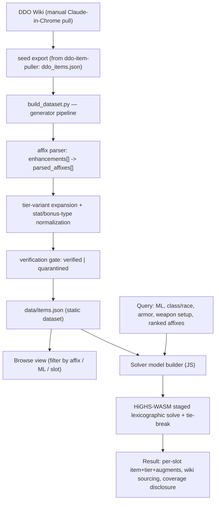

# DDO Loadout Optimizer - Plan

## Goal Capsule

- **Objective:** A public web tool that, given a build's constraints and a ranked list of desired affixes, returns the theoretically-optimal fully-upgraded gear set — items, tiers, and augments — computed against DDO's real bonus-type stacking rules, with every value traceable to the DDO Wiki.
- **Product authority:** User (DDO player, owner of the existing `ddo-item-puller` dataset).
- **Open blockers:** None. Scope is settled and ready for planning.

---

## Product Contract

### Summary

Build a public DDO gear optimizer as a new project seeded from the existing `ddo-item-puller` dataset. A player supplies a minimum-level cap, class/race, armor type, weapon setup, and a *ranked* list of target affixes; the tool returns the best legal gear set under DDO's stacking rules. It ships data-first: a verified, searchable item database is the first milestone, and a lexicographic solver layers on top.

### Problem Frame

DDO endgame gearing is a genuine constraint-satisfaction problem, not a lookup. Every stat can arrive through several distinct bonus types (Intelligence as Enchantment, Insightful, Quality, Profane, etc.); within one named type only the highest value counts, while different types stack. A single item usually carries several affixes across several types, and there are only ~14 gear slots plus augment slots to spend. Choosing the set that maximizes a player's priorities means reasoning across all slots at once while avoiding wasted redundant same-type bonuses — exactly the reasoning players do by hand today, poorly and slowly.

No existing tool does this from conclusively-sourced data. The user has already built the data foundation: `ddo-item-puller` holds 169 wiki-sourced entries with a clean schema (items, augments, essence-crafted pieces, filigrees, set bonuses, tiered items) and a proven scraping method. What is missing is (a) comprehensive coverage, (b) a *structured* affix representation the machine can optimize over rather than free-text effect lines, and (c) the solver itself.

### Key Decisions

- **New standalone project, seeded from `ddo-item-puller`** (session-settled: user-directed — chosen over evolving that project in place or a clean-slate rebuild: keeps the existing leveling-tool dataset intact for its consumers while the optimizer grows a bigger, structured, public scope).
- **Strict priority order (lexicographic) tradeoff resolution** (session-settled: user-directed — chosen over weighted-sum, hard-floors, and Pareto: deterministic, and the user can always reason about why a set was chosen).
- **Pure theoretical best-in-slot** (session-settled: user-directed — chosen over acquisition-annotated and attainability-aware modes: assume every item obtainable and fully upgraded; no per-user inventory, so the app stays a solver, not an account system).
- **Comprehensive affix sources** — named items (all slots), augments + slot colors, essence crafting (the Update 81 system), filigrees, set bonuses, and tiered/upgradeable items (session-settled: user-directed).
- **Query respects class/race, armor type, and weapon setup** (session-settled: user-directed — chosen over an ML-plus-priorities-only query: makes results actually equippable and correctly values capped stats like dodge).
- **Strict "exclude until verified" data trust** (session-settled: user-directed — chosen over best-effort-with-flags and human-in-the-loop-first: only high-confidence parsed items are solver-eligible; ambiguous data is quarantined and flagged, so coverage grows behind trust rather than risking a confidently-wrong set).
- **Data-platform-first sequencing with an early browse view** (session-settled: user-directed — chosen over engine-first: a verified, searchable item database is the first milestone and a standalone community asset; the solver layers on afterward).
- **Solver-aware schema from day one** (session-settled: user-approved — the DB carries structured affix tuples, per-tier variants, and restriction flags rather than display-only text, to avoid re-working the schema once the solver arrives).
- **Manual, patch-triggered data refresh** (session-settled: user-directed — chosen over a scheduled re-scrape or no-refresh commitment: the maintainer re-runs ingestion when a DDO update ships new items, which fits the strict gate where a human already clears the verification quarantine).

### Actors

- A1. **DDO player** (primary) — submits a build query and reads the returned loadout; browses/searches the item database.
- A2. **Data maintainer** — runs the scrape/parse pipeline and clears the verification quarantine.
- A3. **DDO Wiki** — external source of record for all item data.
- A4. **Scraper** — the browser-driven ingestion process pulling wiki pages.

### Requirements

**Data platform & sourcing**

- R1. The project is a new standalone tool that imports `ddo-item-puller`'s 169 entries, schema, and slot/category taxonomy as its initial verified seed.
- R2. Coverage goal is comprehensive — every named item, augment, essence-crafted piece, filigree, and set — grown incrementally rather than required complete at launch.
- R3. Ingestion scrapes the DDO Wiki via browser automation (Claude-in-Chrome navigate + `get_page_text`), because plain HTTP fetch returns empty for `ddowiki.com`; page resolution uses the `Item:` namespace and `Special:Search`.
- R4. Every affix value stored is traceable to a source wiki URL.
- R5. Only high-confidence, cleanly-parsed items are eligible for the solver; items with ambiguous or conflicting wiki data are quarantined and flagged for review, not silently included.
- R6. The maintainer can re-run ingestion to absorb new items when a DDO update ships; refresh is manual and patch-triggered, not scheduled.

**Affix modeling**

- R7. Each affix is stored as a structured tuple — stat/effect, bonus type, value, and unit — a layer beyond the existing free-text effect lines. Minimum level is tracked per item variant (see KTD3), not inside the affix tuple.
- R8. The model encodes bonus-type stacking: within one named type only the highest value counts; different types stack.
- R9. Upgradeable items are modeled as one selectable variant per tier, each with its own affix set and minimum level.
- R10. Set bonuses are modeled with their piece-count thresholds and per-threshold effects.
- R11. Stats with game caps (e.g. dodge) are valued against the cap implied by the query's armor type, not in isolation.

**Solver**

- R12. The solver optimizes lexicographically over the ranked affix list: maximize priority 1 fully, lock it, maximize priority 2 given that, and so on.
- R13. The solver is exact (provably optimal under the modeled rules), respecting one-item-per-slot exclusivity, augment-slot colors, and the slot-cost tradeoff of chasing a set bonus.
- R14. The result is a full gear set: for each slot, the chosen item, its tier, and its augments.
- R15. Every result discloses its own coverage completeness — which slots were optimized over fully-verified data and which have unverified candidates still pending — so "best set" never silently means "best verified so far."

**Query model**

- R16. A query accepts a minimum-level cap, class/race, armor type, weapon setup, and a ranked list of target affixes.
- R17. The minimum-level cap is an upper bound: items with minimum level at or below the cap are eligible.
- R18. The solver excludes items the queried class/race cannot equip.
- R19. Weapon setup (two-handed / sword-and-board / two-weapon) determines whether the off-hand slot holds a weapon, shield, orb, or rune-arm, and which slots are available to fill.

**Web app & browse**

- R20. The tool is a public web application.
- R21. The first milestone is a searchable, browsable view of verified items — filter/query by affix, minimum level, and slot.
- R22. The solver interface is added on top of the browse milestone.

### Key Flows

- F1. **Optimize a build**
  - **Trigger:** Player submits a query (R16).
  - **Actors:** A1
  - **Steps:** Validate inputs; filter items by ML cap, class/race, armor, and weapon setup; run the lexicographic exact solver over verified-eligible variants; assemble the per-slot set with tiers and augments.
  - **Outcome:** A gear set with per-value wiki sourcing and a coverage-completeness disclosure.
  - **Covered by:** R8, R10, R11, R12, R13, R14, R15, R16, R17, R18, R19

- F2. **Browse / search items**
  - **Trigger:** Player opens the item database.
  - **Actors:** A1
  - **Steps:** Query verified items by affix, minimum level, or slot; read affixes with their wiki source.
  - **Outcome:** A filtered list of sourced items.
  - **Covered by:** R4, R21

- F3. **Ingest and verify wiki data**
  - **Trigger:** Maintainer runs ingestion (initial load or a refresh).
  - **Actors:** A2, A3, A4
  - **Steps:** Scrape target pages via browser automation; parse effect lines into structured tuples; apply the verification gate; mark clean items solver-eligible and quarantine ambiguous ones with a flag.
  - **Outcome:** Grown eligible dataset plus a review queue.
  - **Covered by:** R3, R4, R5, R6, R7

### Acceptance Examples

- AE1. **Lexicographic contention.** **Given** priorities ranked INT > … > dodge and slots that cannot satisfy both fully, **when** the solver runs, **then** it maximizes INT even if that consumes slots dodge would have wanted, and dodge is optimized only within what remains. **Covers R12.**
- AE2. **Redundant same-type bonus.** **Given** two eligible items each granting an Enchantment bonus to INT, **when** the solver evaluates them, **then** only the higher value counts and it does not spend a second slot on the redundant lower one unless that item earns its slot another way. **Covers R8, R13.**
- AE3. **Capped stat depends on armor.** **Given** dodge is a target and the query specifies heavy armor, **when** dodge is valued, **then** it is scored against the heavy-armor dodge cap rather than as an uncapped magnitude. **Covers R11, R16.**
- AE4. **Restriction filter.** **Given** an item that is theoretically optimal for a slot but not equippable by the queried class, **when** the solver selects, **then** that item is excluded and the best equippable alternative is chosen. **Covers R18.**
- AE5. **Tier selection.** **Given** an upgradeable item with tiers at several minimum levels, **when** the ML cap and priorities are applied, **then** the solver selects the specific tier variant that is legal at the cap and best serves the priorities. **Covers R9, R17.**
- AE6. **Incomplete coverage disclosure.** **Given** a slot whose only candidate items are still in verification quarantine, **when** the result is returned, **then** that slot is reported as having unverified candidates pending rather than silently filled or silently dropped. **Covers R5, R15.**

### Scope Boundaries

**Deferred for later**

- Attainability-aware optimization and any per-user owned-gear or "what can I realistically get" tracking — theoretical BiS assumes access to everything.
- Weighted-sum and Pareto-frontier tradeoff modes — strict priority order is the only mode.
- Generating arbitrary custom essence-crafted items to fill gaps — essence-crafted pieces are catalogued as sources, but the solver does not search the open crafting combinatorial space in v1.

**Outside this product's identity**

- User accounts and inventory management.
- In-game or live-character integration.

### Dependencies / Assumptions

- Browser automation (Claude-in-Chrome) is available for ingestion; plain HTTP fetch does not work against `ddowiki.com`.
- The DDO Wiki remains the source of record; the tool respects its content licensing/attribution and scrapes politely (relevant because the tool is public).
- `ddo-item-puller` supplies the initial verified seed, schema, and taxonomy (`../ddo-item-puller/ddo_items.json`, `../ddo-item-puller/build_json.py`).
- A meaningful fraction of wiki item data is parseable into structured tuples; the strict verification gate is what absorbs the remainder without corrupting results. This parsing reliability is the project's primary risk.

### Outstanding Questions

**Deferred to planning**

- Hosting, stack, database technology, and the solver formulation/library (e.g. integer program vs. constraint solver) — implementation choices.
- How the verification/curation workflow is operated day to day (who clears quarantine, and through what interface).
- How the structured affix layer coexists with the seed's free-text effect lines during migration.

### Sources / Research

- `../ddo-item-puller/ddo_items.json` — 169 wiki-sourced entries; per-item schema and `metadata` block (scope, decisions, augment color matrix, essence-crafting verification, audit).
- `../ddo-item-puller/build_json.py` — normalization pass with `WEAPON_TYPE` / `RUNEARMS` / `WORN_SLOT` / `SWAPPABLE` maps and slot/category taxonomy.
- `../ddo-item-puller/README.md` — scraping method (Claude-in-Chrome; `Item:` namespace / `Special:Search`), set-bonus/filigree/essence modeling, and the tiered-item handling precedent (The Diplomancer, ML 5/10/15/20/25/30).
- DDO Wiki — https://ddowiki.com — source of record.
- `ddo-item-puller` data-model dossier (this run): `enhancements[]` are free-text lines — typed bonus = leading word (`Quality Intelligence +3`), untyped = Enhancement default (`Intelligence +13`); weapon/armor base is value-first (`+5 Enhancement Bonus`); `%` inline; tiered items pack tiers into single strings (`ML11 (T3): ...`); random-roll items pack choice-sets (`Rolls one of: ...`). `slot`/`category`/`minimum_level`/`augment_slots`/`set_bonus` are already structured. `metadata.per_item_affix_layout` gives prefix/suffix ground truth for the 16 essence-crafted pieces (a parser validation set). `metadata.crafting_and_augment_compatibility` documents the augment color-compat matrix.
- Solver research (this run): the "different bonus-types stack, same type takes the max" rule linearizes cleanly; exact optimization is the right and unusually clean fit. Staged sequential lexicographic solving (optimize priority 1, fix as a constraint, optimize priority 2, …) is the robust, provably-optimal method; weighted-sum encoding is fragile and rejected. HiGHS (MIT) is the strongest open-source MILP solver and ships as WebAssembly (`highs-js`) usable in-browser. Prior-art RPG gear tools (Path of Building, WoW optimizers) mostly use heuristics/simulation because their objectives don't linearize; ours does.

---

## Planning Contract

**Product Contract preservation:** changed: R7 — clarified the affix-tuple shape (minimum level tracked per item variant, not inside each affix; added `unit`). This is a modeling clarification, not a scope change; no other R-ID, actor, flow, or scope boundary was altered.

### Key Technical Decisions

- KTD1. **Client-side exact solver via HiGHS-WebAssembly (`highs-js`, MIT).** The optimizer runs entirely in the browser; the whole app deploys as static files on GitHub Pages with no server. (session-settled: user-directed — chosen over an OR-Tools CP-SAT Python backend or a serverless hybrid: matches the zero-server, GitHub-Pages pattern of the user's other DDO tools and keeps a public tool free and low-maintenance. Trade-off accepted: HiGHS has no native `max`/reification, so the stacking and set-bonus constraints are hand-linearized in the model builder — a one-time build cost, still provably optimal.) Satisfies R13, R20.
- KTD2. **Add a structured `parsed_affixes[]` layer alongside the seed's free-text `enhancements[]`.** Each parsed affix is `{stat, bonus_type, value, unit}`; the original line is retained for provenance and the wiki source URL is preserved. The solver reads only `parsed_affixes[]`; browse can show both. Satisfies R7. Advances R4.
- KTD3. **Expand tiered items into one solver record per tier.** Each tier variant carries its own `minimum_level` and its own `parsed_affixes[]`, resolving the seed's documented trap where an item's `minimum_level` and its listed stats describe different tiers (e.g. The Diplomancer). Random-roll "Rolls one of" lines are modeled as mutually-exclusive affix options the solver may pick at most one of. Satisfies R9.
- KTD4. **The "database" is a generated static JSON dataset, not a DB server.** A Python generator (extending the seed's `build_json.py` approach) emits `data/items.json`, which the static app fetches. No database service. Satisfies R1, R20.
- KTD5. **Verification is per-affix, not per-item.** Each parsed affix carries a confidence; an affix that resolved to a clean `{stat, bonus_type, value}` is solver-eligible, and any item may contribute its clean affixes even when other lines on it (non-numeric procs like "Blindness Immunity", ambiguous-magnitude lines, Mythic Boosts) did not parse — those lines are flagged and excluded from the model but do not disqualify the whole item. Full-item quarantine is reserved for items whose *target-relevant* affixes cannot be parsed at all. Each item also carries an item-level `verification` status for browse display. This keeps the seed's endgame items usable (most carry at least one incidental non-numeric line) while still never feeding an unverified value to the solver. Satisfies R5. Enables R15.
- KTD6. **Rule-based affix parser with a validation harness.** The parser handles: untyped bonuses (default Enhancement); typed bonuses whether the type is a leading word (`Quality Intelligence +3`) or a trailing parenthetical (`Heal +17 (Competence)`, `Damage +8 (Deadly)`) — trailing parenthetical wins when both appear; `%` values; value-first weapon/armor base lines (`+5 Enhancement Bonus`); no-`+` values (`Seeker 9`); multi-stat lines (`Defense (Sheltering) +24 (PRR/MRR)` → two affixes); ML-scaling magnitudes (`+1% ML1 up to +14% ML32`) resolved against the query's ML cap (feeds R11/R17); and noise-line filtering (augment-slot and `(set)` tokens). It sub-parses tier strings and random-roll strings. Validation uses two oracles: (a) `metadata.essence_crafting_verification.per_item_affix_layout` (16 essence-crafted pieces) confirms *effect identity and prefix/suffix/extra position* — it carries no magnitudes, so it does not validate `value`/`bonus_type`; and (b) a hand-checked spot set carrying explicit `{stat, bonus_type, value}` validates the tuple fields. A line the parser cannot confidently resolve is flagged and excluded per KTD5 (per-affix), not used to disqualify its whole item. Satisfies R5, R7.
- KTD7. **Solver modeling (hand-linearized MILP).** Binary equip variables per item-variant and per augment placement. Per-`(stat, bonus_type)` auxiliary variable pulled to the max of selected sources (two-sided linearization so it is exact even when it appears in a cap constraint). Set bonuses: reified piece-count thresholds feed the same per-type max as gated sources (nested thresholds both apply). Slot exclusivity as cardinality constraints (rings `<= 2`); augment sub-slots gated by their parent item being equipped and by color compatibility. `minimum_level`/class/race applied as pre-filters that drop ineligible variants before model build; armor-dependent caps (e.g. dodge) as constraints on the effective stat. Objective: **staged sequential lexicographic** solve over the ranked targets, plus a final deterministic tie-break stage for stable output. Satisfies R8, R10, R11, R12, R13, R16, R17, R18, R19.
- KTD8. **Ingestion stays a manual, Claude-in-Chrome process** (inherited from the seed; plain HTTP fetch returns empty for `ddowiki.com`). There is no live scraper service; a maintainer runs the browser-driven pull and re-runs the generator when a DDO update ships. Satisfies R3, R6.

### High-Level Technical Design

Data flows one direction from the wiki to the browser; the solver never touches the wiki.



The lexicographic driver is a loop over the ranked targets (directional sketch, not implementation):

```text
priors = []                                  # (stat, fixed optimal value)
for stat in ranked_targets:                  # priority order
    model = build_model(eligible_variants, query)
    for (s, v) in priors:
        model.add_constraint(effective(s) == v)   # lock higher priorities
    model.maximize(effective(stat))
    v_star = solve(model)                    # HiGHS: provably optimal for this stage
    priors.append((stat, v_star))
# final stage: among all sets tied on every target, pick a deterministic canonical one
model.add all priors as == constraints
model.minimize(tie_break_key)                # e.g. total ML, then item-id order
final_set = solve(model)

# effective(stat) = sum over bonus_type of max(selected source values of that type),
# where set-bonus thresholds are gated sources feeding the same per-type max.
```

### Assumptions

- A meaningful fraction of the wiki/seed `enhancements[]` lines parse cleanly; the strict `quarantined` bucket absorbs the rest without corrupting solver results. Parsing reliability is the primary risk (Product Contract Dependencies).
- `highs-js` solves a low-thousands-variant model per lexicographic stage in well under a second, keeping a 4–6 target query interactive. To be confirmed empirically in U7; if a stage is too slow, pre-filtering and per-stage time limits are the first levers.
- The seed's 169 entries are the initial `verified` set; comprehensive coverage grows by later ingestion runs and is a goal, not a launch gate (Product Contract R2).
- Canonical vocabularies for `stat` and `bonus_type` can be enumerated from the seed's affix lines plus DDO's known bonus-type set; unknown tokens route to `quarantined` rather than being guessed.
- Some seed affixes (notably Deadly and Seeker on essence-crafted and tiered items) are recorded without a numeric magnitude. A value-less affix is not solver-optimizable, so its magnitude must be sourced during ingestion before it can serve as a usable target. The ML-36 acceptance query (U8/DoD) therefore assumes its ranked targets have sourced magnitudes; a value-less target is surfaced as a coverage gap rather than silently scored as zero.
- The seed carries no class/race restriction or armor-type data, so R18 (class/race filtering) and R11 (armor-dependent dodge cap) are only as complete as later ingestion makes them. Records without sourced `restrictions`/`armor_type` are treated as unrestricted (fail-open), so early results may include an item a class cannot actually equip until that item's restriction is sourced — an accepted early-coverage limitation consistent with the grow-over-time model, surfaced the same way as verification coverage.

### Sequencing

Two milestones matching the Product Contract's data-platform-first decision. **Milestone 1 (Data platform + browse)** = U1–U5, independently shippable and a standalone community asset. **Milestone 2 (Solver)** = U6–U8, built on the verified dataset. Within each, units are dependency-ordered.

---

## Implementation Units

### U1. Project scaffold and seed import

- **Goal:** Stand up the static-site + generator-pipeline skeleton and import the seed dataset.
- **Requirements:** R1, R20
- **Dependencies:** none
- **Files:** `build_dataset.py`, `data/seed/ddo_items.json` (imported copy of the seed export), `web/index.html` (app shell), `web/app.js`, `README.md` (run/build instructions)
- **Approach:** Copy `ddo-item-puller`'s `ddo_items.json` into `data/seed/` as the immutable input. Establish `build_dataset.py` as the pipeline entry that reads the seed and (in later units) parses, expands, verifies, and writes `data/items.json`. Stand up a minimal static shell that fetches `data/items.json`. Keep the app deployable to GitHub Pages (static files only, no build step required to serve).
- **Patterns to follow:** the seed's `build_json.py` `__file__`-relative output path and generator-writes-JSON structure.
- **Test scenarios:** Running `build_dataset.py` on the seed produces a `data/items.json` with the same item count as the seed (no data lost in passthrough before parsing is added). The app shell fetches and counts records without error when served over a local static server.
- **Verification:** `data/items.json` exists and round-trips the seed; the shell loads it in a browser served locally.
- **Test expectation:** minimal — this unit is scaffolding; the count-preservation check is the only behavioral assertion.

### U2. Structured affix parser

- **Goal:** Parse free-text `enhancements[]` lines into structured `parsed_affixes[]`.
- **Requirements:** R4, R7
- **Dependencies:** U1
- **Files:** `src/affix_parser.py`, `tests/test_affix_parser.py`
- **Approach:** Rule-based parser producing `{stat, bonus_type, value, unit}` per parseable line. Handle: untyped `Stat +N` (bonus_type = Enhancement); typed with a leading word (`Quality Intelligence +3`) or a trailing parenthetical (`Heal +17 (Competence)`, `Damage +8 (Deadly)`) — trailing wins when both appear; value-first base lines (`+5 Enhancement Bonus`); `%` units; no-`+` values (`Seeker 9`); multi-stat lines (`Defense (Sheltering) +24 (PRR/MRR)` → two affixes); ML-scaling magnitudes (`+1% ML1 up to +14% ML32`) resolved against the query ML cap; and noise-line filtering (`... Augment Slot`, `... (set)`, `Set: ...`). Emit a per-line confidence and a list of unparseable lines. Do not guess unknown `bonus_type`/`stat` tokens — flag them (excluded per-affix per KTD5, not used to disqualify the whole item).
- **Execution note:** Implement test-first against the ground-truth set — correctness here gates everything downstream.
- **Patterns to follow:** the seed `metadata.essence_crafting_verification.per_item_affix_layout` prefix/suffix/extra breakdown as expected effect-identity output for the 16 essence-crafted pieces (positions only; no magnitudes).
- **Test scenarios:** Untyped `"Intelligence +13"` → `(Intelligence, Enhancement, 13)`. Typed leading-word `"Quality Intelligence +3"` → `(Intelligence, Quality, 3)` and `"Insightful Constitution +7"` → `(Constitution, Insightful, 7)`. Typed trailing-parenthetical `"Damage +8 (Deadly)"` and `"Heal +17 (Competence)"` extract the parenthetical as the bonus type. Value-first `"+5 Enhancement Bonus"` parsed as the weapon/armor base, not a stat named "Enhancement Bonus". No-`+` value `"Seeker 9"` → value 9. Multi-stat `"Defense (Sheltering) +24 (PRR/MRR)"` → two affixes (PRR +24, MRR +24). ML-scaling `"+1% ML1 up to +14% ML32"` at an ML-36 query resolves to the ML-capped magnitude. Percentage `"Fortification +94%"` → value 94, unit `%`. Noise lines `"Blue Augment Slot"` and `"Wallwatch (set)"` filtered, not emitted as affixes. Each of the 16 essence-crafted pieces reproduces its `essence_crafting_verification.per_item_affix_layout` effect identity + prefix/suffix/extra position (this oracle carries no magnitudes; `{value, bonus_type}` are checked against the hand-checked spot set). An unknown token (e.g. a novel bonus-type word) is reported as unparseable, not coerced.
- **Verification:** parser output matches the ground-truth layout for all 16 crafted pieces and the hand-checked spot set; unparseable lines are surfaced, not silently dropped.

### U3. Tier-variant expansion and vocabulary normalization

- **Goal:** Produce one solver record per tier and normalize stat/bonus-type vocabularies.
- **Requirements:** R9
- **Dependencies:** U2
- **Files:** `src/variants.py`, `src/vocab.py`, `tests/test_variants.py`
- **Approach:** Detect tier-packed strings (`"ML11 (T3): ..."`) and separate-entry tier ladders (Heroic/Epic/Legendary rows), and emit distinct variant records each with its own `minimum_level` and `parsed_affixes[]`. Resolve the min-level≠listed-stats trap: a variant's affixes are the affixes for *that* tier. Model `"Rolls one of: A / B / C"` as a mutually-exclusive option group on the variant. Define canonical `stat` and `bonus_type` vocabularies in `src/vocab.py`; map affix tokens onto them; route unmapped tokens to quarantine input. Add two fields the seed schema lacks but the solver's pre-filters need: `restrictions` (class/race equip restrictions, for R18) and `armor_type` (cloth/light/medium/heavy on Armor-slot items, for the R11 dodge cap). These are not derivable from the seed and must be sourced from the wiki during ingestion (KTD8); until an item's values are sourced, mark the field `unknown` and treat the item as unrestricted in the solver rather than silently excluding or wrongly capping it.
- **Test scenarios:** The Diplomancer expands to per-tier variants (ML 5/10/15/20/25/30) whose affix values differ by tier, and the ML5 variant does not carry ML20 stat values. A separate-entry Heroic/Epic/Legendary trio yields three variants at their respective MLs. A `"Rolls one of"` item yields one variant with an at-most-one option group, not several always-on affixes. An affix with an out-of-vocabulary stat token is flagged for quarantine rather than mapped.
- **Verification:** tiered items produce tier-correct variants; the Diplomancer trap is provably resolved by a test asserting per-tier affix values; vocabularies cover the seed with unmapped tokens enumerated.

### U4. Verification gate and coverage model

- **Goal:** Apply per-affix solver eligibility, set an item-level verification status, and record dataset coverage.
- **Requirements:** R5
- **Dependencies:** U2, U3
- **Files:** `src/verify.py`, `tests/test_verify.py`, `build_dataset.py` (wire the gate into the pipeline)
- **Approach:** Mark each affix solver-eligible when it parsed to a clean `{stat, bonus_type, value}` and its tokens mapped to the canonical vocabularies; unparseable lines and unmapped tokens are flagged with a reason and excluded from the model but do not disqualify the item's clean affixes (KTD5). Set an item-level `verification` status: `verified` when its target-relevant affixes are all clean, else `quarantined` with reasons. Write per-slot coverage metadata into `data/items.json` (per slot: counts of items with solver-eligible affixes vs items fully quarantined) for later result disclosure.
- **Test scenarios:** An item with one unparseable incidental line still contributes its cleanly-parsed affixes to the solver, with the bad line flagged rather than fatal. An item whose target-relevant affixes cannot be parsed is `quarantined` with a reason. Coverage metadata reports the correct per-slot eligible-vs-quarantined counts. Quarantined and partially-parsed records remain present in the dataset (for browse) with their flags.
- **Verification:** the gate is deterministic and reason-carrying; `data/items.json` includes coverage metadata. **Milestone 1 data layer complete.**

### U5. Searchable browse view

- **Goal:** A static, searchable/browsable view of the dataset.
- **Requirements:** R4, R21
- **Dependencies:** U4
- **Files:** `web/browse.js`, `web/index.html`, `web/styles.css`
- **Approach:** Filter/search by affix (`stat`, optionally `bonus_type`), minimum level, and slot, over the fetched `data/items.json`. Show each item's parsed affixes, its `verification` badge, and a link to its wiki source. When a filter combination matches zero records, show a "no items match these filters" empty state with a clear-filters affordance. Mirror the seed's data-driven HTML view (render everything from the dataset; nothing hardcoded).
- **Patterns to follow:** the seed's `ddo_items.html` — fully data-driven single-file view with search/filter/sortable columns.
- **Test scenarios:** Filtering by a stat returns exactly the items whose `parsed_affixes[]` include it. An ML filter returns only variants at or below the cap. Quarantined items render with a distinct badge and are visually distinguishable from verified. Every row's wiki-source link points at the record's `wiki_url`.
- **Verification:** filters are correct against known fixtures; the view runs on GitHub Pages as static files. **Milestone 1 (browse) shippable.**

### U6. Solver model builder

- **Goal:** Build the MILP model from a query and the verified dataset.
- **Requirements:** R8, R10, R11, R16, R17, R18, R19
- **Dependencies:** U4
- **Files:** `web/model.js`, `web/tests/model.test.js`
- **Approach:** Pre-filter variants (those contributing solver-eligible affixes) by `minimum_level <= cap`, class/race legality, and weapon-setup slot availability. Emit binary equip variables per surviving variant and per augment placement (gated by parent item and augment color compatibility). Only an affix's solver-eligible sources feed its per-`(stat, bonus_type)` max (KTD5). For each `(stat, bonus_type)`, add an auxiliary variable constrained to the max of selected source values (two-sided linearization). Sum per-type maxima into effective-stat expressions. Add set-bonus reified piece-count thresholds as gated sources into the same maxima. Add slot cardinality (rings `<= 2`, one per other worn slot) and armor-dependent caps (e.g. dodge `<= selected-armor cap`) as constraints on effective stats.
- **Execution note:** Build with known-answer fixtures — hand-computed small cases are the only reliable oracle for stacking/set-bonus/cap correctness.
- **Test scenarios:** `Covers AE2.` Two sources of Enchantment-INT yield an effective INT equal to the higher, not the sum. Two *different* INT bonus-types sum. `Covers AE3.` With heavy armor selected, effective dodge is constrained to the heavy-armor cap. `Covers AE5.` A tiered variant is selectable only at/below the ML cap. `Covers AE4.` A class-illegal item is pre-filtered out of the model. A 3-piece set threshold activates its bonus only when 3 members are equipped, and its bonus participates in the per-type max. Two ring slots cannot hold three rings.
- **Verification:** each modeling rule is proven by a known-answer fixture; the model builds without unbounded or infeasible-by-construction errors on the seed.

### U7. Lexicographic staged solve driver

- **Goal:** Drive HiGHS-WASM to a provably-optimal, deterministic result.
- **Requirements:** R12, R13
- **Dependencies:** U6
- **Files:** `web/solver.js`, `web/vendor/highs.js`, `web/vendor/highs.wasm`, `web/tests/solver.test.js`
- **Approach:** Vendor `highs-js`. Implement the staged loop: maximize target 1, fix its optimum as a constraint, maximize target 2, and so on down the ranked list; then a final tie-break stage minimizing a deterministic key (e.g. total ML, then item-id order) so repeated runs return the same set. Return per-target achieved values and the selected variants/augments.
- **Execution note:** Start from a failing end-to-end test asserting lexicographic dominance (priority 1 never sacrificed for priority 2).
- **Test scenarios:** `Covers AE1.` When targets contend, priority 1 is maximized even at the cost of a lower-priority target; the lower target is maximized only within the remainder. Given two loadouts tied on all targets, the driver returns the same one on repeated runs (tie-break determinism). A solved stage's fixed value is honored as a hard constraint in the next stage. Performance: a 6-target query over the seed returns within the interactive budget (record the measured time).
- **Verification:** lexicographic ordering holds on fixtures; output is deterministic; measured solve time is recorded and within budget.

### U8. Query UI and results view

- **Goal:** Let a player run a query and read a sourced, coverage-disclosed loadout.
- **Requirements:** R14, R15, R16, R19
- **Dependencies:** U7
- **Files:** `web/query.js`, `web/results.js`, `web/index.html`
- **Approach:** Inputs for ML cap, class/race, armor type, weapon setup, and a ranked affix list. The ranked list is built via an affix search/autocomplete constrained to the canonical stat/bonus_type vocabulary, rendered as an ordered list with drag-to-reorder plus keyboard-operable up/down and per-row remove controls, and an empty state prompting the user to add at least one target before solving. On submit, disable inputs and show progress across the lexicographic stages; if a per-stage time limit trips (the U7 fallback), surface a "still solving / partial" message rather than appearing frozen, and block concurrent submissions. On success, render the per-slot chosen item, its tier, and its augments, each affix value linked to its wiki source, plus the coverage disclosure from U4 metadata: name slots whose only candidates were quarantined as "unverified candidates pending", never silently filled or dropped. When the solve yields no feasible set (or a required slot has zero eligible candidates), show a distinct "no set satisfies these constraints" state that names the offending constraint or slot — separate from the coverage disclosure.
- **Test scenarios:** `Covers AE6.` A slot whose only candidates are quarantined is reported as pending in the result, not filled from unverified data and not silently omitted. The result lists an item, its tier, and its augments per filled slot. Each displayed affix value links to the source record's `wiki_url`. Changing weapon setup to two-handed removes the off-hand item from the result surface. Adding targets via search constrains entries to canonical affixes; the ranked list reorders by drag and by keyboard and starts in an explicit empty state. While solving, inputs are disabled and progress is shown; a tripped per-stage time limit shows a partial/solving message, not a frozen UI; concurrent submits are blocked. An infeasible query (or a required slot with zero eligible candidates) shows a distinct "no set" state naming the offending constraint, separate from the coverage disclosure.
- **Verification:** a real query (ML 36; targets Deadly > INT > CON > Accuracy > Seeker > Dodge) returns an equippable, provably-optimal, fully-sourced set with an accurate coverage disclosure. **Milestone 2 complete.**

---

## Verification Contract

| Gate | How | Applies to |
|---|---|---|
| Affix parser correctness | Python tests reproduce `essence_crafting_verification.per_item_affix_layout` effect identity + positions for all 16 essence-crafted pieces; `{value, bonus_type}` checked against the hand-checked spot set; trailing-parenthetical / no-`+` / multi-stat / ML-scaling forms covered; unparseable lines surfaced | U2 |
| Tier-variant correctness | Python tests assert per-tier affix values (Diplomancer trap resolved); random-roll option groups | U3 |
| Per-affix eligibility + gate determinism | Python tests: an unparseable incidental line is flagged and excluded but the item's clean affixes stay solver-eligible; item quarantined only when target-relevant affixes fail; coverage counts correct | U4 |
| Browse filter correctness | Filter-by-affix/ML/slot returns exactly the matching records; quarantine badges present | U5 |
| Solver modeling rules | Known-answer JS fixtures for stacking (max-of-type), set-bonus thresholds, dodge cap, slot cardinality, pre-filters | U6 |
| Lexicographic optimality + determinism | JS fixtures assert priority dominance and stable tie-broken output; solve time recorded | U7 |
| End-to-end query | The ML-36 example query returns an equippable, optimal, sourced set with correct coverage disclosure | U8 |
| Static deploy | App runs from static files on a local server and on GitHub Pages | U1, U5, U8 |

Run the Python suite with the project's Python test runner (e.g. `pytest`) and the JS suite with the project's node-based runner; browser behavior is verified over a local static server (the seed project's established localhost + Claude-in-Chrome pass applies here).

---

## Definition of Done

- **Milestone 1 (data platform + browse):** `build_dataset.py` produces a `data/items.json` with structured `parsed_affixes[]`, per-tier variants, and `verification` status + coverage metadata; the parser passes its ground-truth suite; the searchable browse view runs as static files with verification badges and wiki-source links. Publishable to GitHub Pages on its own.
- **Milestone 2 (solver):** the query UI runs the staged lexicographic HiGHS-WASM solve entirely client-side and returns a per-slot loadout (item + tier + augments) with per-value wiki sourcing and an accurate coverage disclosure; the solving, infeasible/no-set, and ranked-list interaction states are implemented; all Acceptance Examples (AE1–AE6) are covered by passing tests; the ML-36 example query returns a provably-optimal, equippable set over targets whose magnitudes are sourced (value-less targets surface as coverage gaps, not zeros).
- Both milestones deploy as static files on GitHub Pages; no server component exists.
