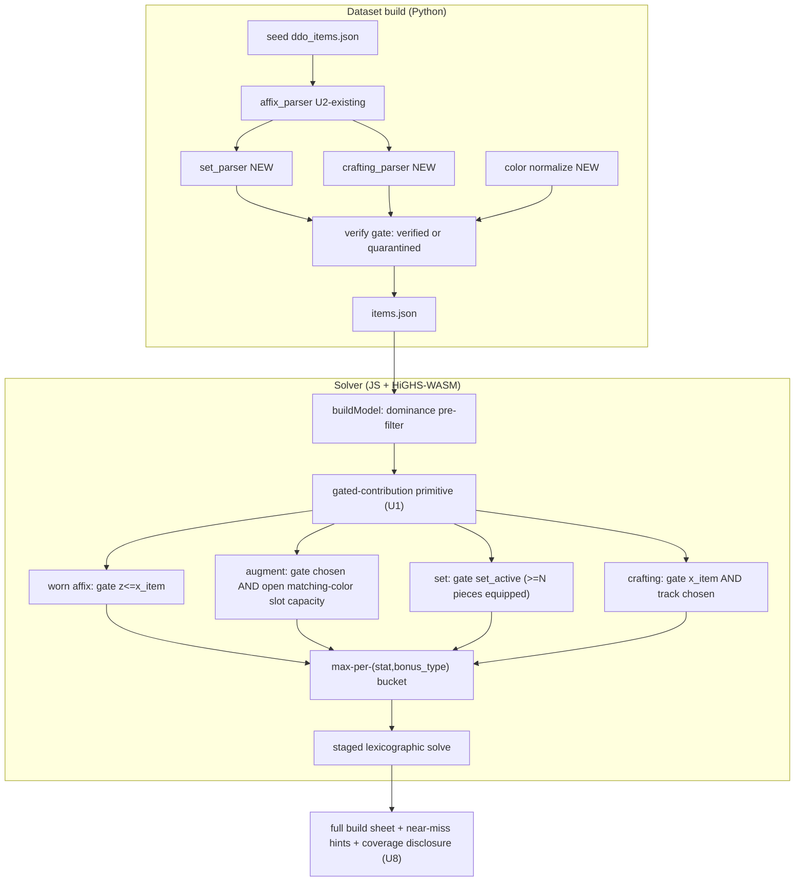

# All Verified Sources in the Objective - Plan

## Goal Capsule

**Objective.** Extend the exact worn-item solver so that *every* structured, verified stat source enters the lexicographic objective with correct DDO bonus-type stacking — not only base worn-item affixes (which Milestone 2 already optimizes). Three new source families join the objective: named-item **set bonuses**, **augments** (colored + Lunar/Solar), and **expansion crafting / gear upgrade paths**.

**Product authority.** The Product Contract below (carried from the `ce-brainstorm` requirements-only plan, unchanged). This document adds the Planning Contract (HOW).

**Product Contract preservation.** Product Contract unchanged — planning enriched this file in place from `requirements-only` to `implementation-ready` without altering product scope, decisions, or boundaries.

**Open blockers.** None. Ready for `/ce-work`.

**Why now.** Milestones 1 & 2 are live, but the solver optimizes only worn-item base affixes. Set bonuses, augments, and crafting-upgrade stats are displayed but never reach the objective — so the tool can under-count available stats *and*, because it models bonus-type stacking, select a genuinely wrong "optimal" set (it can't see that a needed bonus type could be routed through an augment or upgrade slot, freeing a gear slot). Closing this is the single biggest capability gap.

---

## Product Contract

### Primary actor & outcome
A DDO player theorycrafting a build submits a query (ML cap, class/race, armor type, weapon setup, ranked affix list) and receives the **theoretically-optimal fully-upgraded loadout** whose effective totals now include set, augment, and crafting-upgrade contributions — every value traceable to the DDO Wiki.

### In scope (requirements)
- **R1** Parse named-item **set bonuses**: `set_bonus[].piece_bonuses` free text → structured `(stat, bonus_type, value, pieces_required)`.
- **R2** Structure **augment** effects (colored + Lunar/Solar) so they can be assigned to open matching-color slots on equipped items. Augment records already carry a parsed affix and a color; this adds normalization and the assignment model.
- **R3** Source and parse **expansion crafting / gear upgrade paths** → structured add-on affixes attached to the upgradeable item, organized by upgrade *track*.
- **R4** All new data flows through the existing Claude-in-Chrome wiki scrape + `verified | quarantined` gate. Plain fetch returns empty for ddowiki.com; scraping stays browser-driven.
- **R5** MILP: the unified "gated contribution" primitive (Approach A) — every stat source enters the bonus-type buckets only when its enabling binaries hold. Augments gated by chosen + open matching-color slot capacity; crafting upgrades gated by item-equipped + track-choice (add-on affix vars, no combinatorial variant expansion); set bonuses gated by a `set_active` threshold indicator (≥N pieces equipped).
- **R6** Results = full build sheet: per slot, item + tier + which augment fills each colored/Lunar/Solar slot + which crafting upgrade track was chosen, plus near-miss set hints and per-family coverage disclosure.

### Out of scope / boundaries
- **Ship on a verified subset, disclose gaps.** Do NOT block ship on total wiki completeness. Land the machinery, source a meaningful verified slice, iterate sourcing after.
- No new solve paradigm — still HiGHS-WASM, staged lexicographic, deterministic tie-break.
- No per-user inventory — pure theoretical best-in-slot, unchanged.

#### Deferred to Follow-Up Work
- Broader stat-name canonicalization (e.g. `"Filigree effect: Ranged Power"` → `Ranged Power`) beyond what the augment/set/crafting parsers strictly need.
- Filigree *set* bonuses as objective terms (filigrees already carry structured affixes; their set layer follows the same pattern as named-item sets but is out of this milestone).
- Automated (scheduled) wiki refresh — sourcing stays manual/patch-triggered.

### Key Decisions (from brainstorm; see origin decisions)
- **[session-settled] Data sourced from the DDO Wiki without exception — never inferred.** Every `(stat, bonus_type, value, ML)`, every set-piece threshold, every augment effect, and every crafting-upgrade stat comes from an explicit ddowiki.com statement carrying its `wiki_url`. Parsers convert only what the wiki states explicitly; ambiguous records are **quarantined**, not defaulted.
- **[session-settled] One combined milestone** covering all three source families.
- **[session-settled] Approach A — unified gated-contribution primitive** for the MILP.
- **[session-settled] Full build sheet + near-miss set hints** as the result shape.
- **[session-settled] Verified-subset ship with per-family coverage disclosure.**

### Acceptance Examples
- **AE1** A query returns a loadout whose effective total for a target includes a set bonus that is present only because ≥N pieces of that set were equipped; removing one piece drops the bonus.
- **AE2** An augment is placed in a slot only when an equipped item has an open slot of a matching color; with no matching open slot, the augment's stat does not count.
- **AE3** A crafting add-on affix counts only when its item is equipped and that upgrade track is chosen; two mutually-exclusive tracks on one item never both count.
- **AE4** An augment providing an Enhancement bonus to a stat does not stack with a worn item's Enhancement bonus to the same stat (max, not sum), but does stack with an Insightful bonus.
- **AE5** A source whose wiki text is ambiguous is quarantined and reported in coverage disclosure — never assigned an inferred value.

---

## Planning Contract

### Architecture summary
The solver already encodes bonus-type stacking with a "select-one per `(stat, bonus_type)` bucket" pattern: binary `z` vars, `Σz ≤ 1`, `z ≤ x(source)`, so the raw stat is the single highest selected value per type. This milestone **generalizes that `z`-gate into a reusable "gated contribution"**: a `(stat, bonus_type, value)` whose availability binary is constrained by *whatever* enabling conditions its source requires. Worn affixes keep their existing gate (`z ≤ x(item)`); augments, set bonuses, and crafting upgrades add new gate shapes on top of the same bucket-max core. Nothing about the staged lexicographic solve or deterministic tie-break changes.

### High-Level Technical Design

The four source types are siblings feeding one bucket layer — the diagram's point is that adding a future crafting system is a new gate shape, not a new solve.

### Key Technical Decisions

- **KTD1 — Unified gated-contribution primitive** *(session-settled: user-directed — chosen over pre-expanded variants and a greedy post-pass: only this keeps cross-item set thresholds exact while avoiding combinatorial variant blow-up).* Generalize `buildProgram` in `web/solver.js` so a contribution is `{stat, bonus_type, value, availability_binary, gates[]}`. The bucket-max logic is unchanged; only the source of each `z`-gate's constraints varies.
- **KTD2 — Augment assignment via per-color capacity, not per-slot identity.** Model augment placement as an aggregate constraint: for each equipped item and color, `Σ(augments of that color placed on it) ≤ open_slots_of_color(item)`. Avoids enumerating individual physical slots while staying exact for "does this augment's stat count." The results layer reconstructs a concrete slot assignment for display.
- **KTD3 — Set threshold as a linear indicator.** `set_active_s ∈ {0,1}` with `set_active_s ≤ (Σ equipped pieces of s) / N_s`, and every parsed set stat becomes a gated contribution available iff `set_active_s = 1`. Standard big-M-free threshold since piece counts are small integers.
- **KTD4 — Crafting upgrades as optional add-on affix vars** *(session-settled: user-directed — chosen over enumerating upgrade combinations as variants: independent tracks on one item would explode combinatorially).* Each upgrade option is a binary gated by `x(item)` and its track's select-one group (`Σ track options ≤ 1`); its affix is a gated contribution available iff that option is chosen.
- **KTD5 — Wiki-sourced-only, quarantine-on-ambiguity** *(session-settled: user-directed — hard data-trust constraint).* Each new parser emits a structured record only when stat, bonus type, and magnitude are all explicit in the wiki text; otherwise it emits a quarantine record with a reason. No defaults, no inference. Mirrors the existing per-affix eligibility gate in `src/verify.py`.
- **KTD6 — Color-vocabulary normalization is a hard prerequisite.** Raw slot colors include unparseable values (`"ideally Green + Blue"`) and namespaced ones (`"Lamordia: Dolorous"`, `"Moon"`, `"Sun"`). Normalize to a canonical color set before capacity gating; quarantine unnormalizable colors so they never create phantom capacity.

### Alternatives Considered
- **Pre-expand every combination into variants (rejected).** Cannot represent set thresholds (a whole-loadout property) and explodes combinatorially across independent upgrade tracks.
- **Greedy augment/set post-pass after an exact item solve (rejected).** Not globally optimal — augment fills and set completion interact with which base items are chosen, so deciding them after the item solve gives up the "provably optimal" promise.

### System-Wide Impact
- **Dataset schema** gains structured set-bonus, normalized augment-color, and crafting-track fields plus per-family coverage metadata — consumed by both the solver and the browse view. Browse (`web/browse.js`) should keep rendering unaffected records unchanged.
- **Solve-time** grows with added binaries. The existing per-slot dominance pre-filter (`web/model.js`) is the primary mitigation; augment-pool size per color is the cap lever if needed. Benchmark gates this (see Verification Contract).

---

## Implementation Units

### U1. Generalize the solver into a gated-contribution primitive
- **Goal:** Refactor `buildProgram`/`encodeStage` so every stat source is a gated contribution with an availability binary constrained by an arbitrary list of gates, with worn-item affixes as the first (behavior-unchanged) consumer.
- **Requirements:** R5; KTD1.
- **Dependencies:** none (architectural spine).
- **Files:** `web/solver.js`, `tests/solver.test.js`.
- **Approach:** Replace the ad-hoc `z ≤ gate` construction with a contribution list where each entry names its bucket `(stat, bonus_type)`, value, and one-or-more gate constraints. Worn affixes emit a single gate (`z ≤ x(item)`) — identical LP to today. Keep `rawExpr`/`effectiveExpr`/capped-stat logic intact.
- **Execution note:** Characterization-first — the existing 23 JS solver/model tests encode the exact current behavior; they must stay green through this refactor before any new gate shape is added.
- **Patterns to follow:** existing `buckets`/`zByBucket` construction in `web/solver.js:34-59`; the `z ≤ gate` constraint emission at `web/solver.js:100-103`.
- **Test scenarios:**
  - Covers AE4. Same-bonus-type worn affixes still take max, different types still sum (existing fixtures unchanged).
  - Dodge cap clamp, lexicographic priority, deterministic tie-break all still pass (existing fixtures unchanged).
  - New: a synthetic contribution with two gates is available only when *both* gate vars are 1 (unit test of the primitive itself).
- **Verification:** all pre-existing solver/model tests pass with no assertion changes; the new primitive test passes.

### U2. Normalize augment-slot color vocabulary
- **Goal:** Canonicalize augment colors and worn-item `augment_slots` to a fixed color set; quarantine unnormalizable colors.
- **Requirements:** R2; KTD6.
- **Dependencies:** none.
- **Files:** `src/vocab.py` (extend) or `src/colors.py` (new), `build_dataset.py`, `tests/test_colors.py` (new).
- **Approach:** Define the canonical colors (`Blue, Red, Yellow, Green, Orange, Purple, Colorless, Moon, Sun`) plus a namespaced family for Ravenloft `Lamordia: *`. Map raw values; anything ambiguous (`"ideally Green + Blue"`) yields no capacity and a quarantine reason recorded on the record. Apply in the build pipeline so both augment records (color in `slot`) and worn items (`augment_slots[]`) carry normalized colors.
- **Patterns to follow:** `src/vocab.py` stat normalization; the per-affix quarantine-reason pattern in `src/verify.py`.
- **Test scenarios:**
  - `"Moon"`/`"Sun"` normalize to canonical Lunar/Solar colors and are distinct from `Blue`.
  - `"Lamordia: Dolorous"` normalizes within the Ravenloft family.
  - `"ideally Green + Blue"` is quarantined with a reason and contributes zero capacity.
  - A clean `"Blue"` passes through unchanged.
- **Verification:** build runs; a coverage field reports normalized-vs-quarantined color counts; no previously-verified record regresses to quarantined for an unrelated reason.

### U3. Encode augment assignment in the MILP (proving ground)
- **Goal:** Make augments objective-eligible: each augment placed at most once, per-color placements bounded by open matching-color slots on equipped items.
- **Requirements:** R2, R5; KTD1, KTD2.
- **Dependencies:** U1, U2.
- **Files:** `web/model.js`, `web/solver.js`, `tests/solver.test.js`, `tests/model.test.js`.
- **Approach:** Build the augment pool (already assembled in `web/model.js:133`, currently dropped) into gated contributions. Add per-(item,color) capacity constraints: `Σ placements ≤ open_slots_of_color`. Each augment's affix is a gated contribution available iff placed. Reuses U1's primitive and the existing bonus-type buckets so an augment's Enhancement bonus correctly maxes against a worn Enhancement bonus.
- **Test scenarios:**
  - Covers AE2. Augment stat counts only when an equipped item has an open matching-color slot; with none, it contributes 0.
  - Covers AE4. Augment Enhancement bonus does not stack with a worn Enhancement bonus (max); stacks with Insightful.
  - An augment cannot be placed twice; total placements per color ≤ open capacity.
  - Lunar/Solar (`Moon`/`Sun`) augments only fill Moon/Sun slots.
- **Verification:** new fixtures pass; an end-to-end solve over `web/data/items.json` with an augment-relevant target returns augment contributions in the totals.

### U4. Parse named-item set bonuses into structured thresholds
- **Goal:** Turn `set_bonus[].piece_bonuses` free text into structured `(stat, bonus_type, value, pieces_required)`; quarantine anything not fully explicit.
- **Requirements:** R1, R4; KTD5.
- **Dependencies:** none (parser only; can run parallel to U1–U3).
- **Files:** `src/set_parser.py` (new), `build_dataset.py`, `src/verify.py` (extend coverage), `tests/test_set_parser.py` (new).
- **Approach:** Parse each `"N Pieces": "<free text>"` entry. Reuse `affix_parser`'s value/bonus-type extraction where possible. Emit one structured threshold-affix per explicitly-typed-and-valued clause; record a quarantine reason for clauses lacking an explicit type or magnitude. Attach parsed thresholds to the variant; leave the raw text for display.
- **Execution note:** Test-first against real seed `piece_bonuses` strings (e.g. the Saltmarsh Explorer 5-piece line) so the parser is proven on actual wiki phrasing, not invented examples.
- **Patterns to follow:** `src/affix_parser.py` `_parse_value_bearing`; `parse_enhancements` bucketing into affixes/flagged.
- **Test scenarios:**
  - A `"5 Pieces"` clause with an explicit `"+N <Type> bonus to <Stat>"` parses to the right `(stat, bonus_type, value, pieces_required=5)`.
  - A multi-effect clause (`"...; +1 Artifact bonus to all Ability Scores"`) expands to one threshold-affix per stat where the stat set is explicit.
  - Covers AE5. A vague clause with no explicit magnitude is quarantined with a reason, not defaulted.
- **Verification:** whole-seed sweep parses without exceptions; coverage reports set-bonus verified/quarantined counts.

### U5. Encode set thresholds in the MILP
- **Goal:** A set's parsed stats count only when ≥ `pieces_required` pieces of that set are equipped.
- **Requirements:** R1, R5; KTD1, KTD3.
- **Dependencies:** U1, U4.
- **Files:** `web/model.js`, `web/solver.js`, `tests/solver.test.js`.
- **Approach:** Add `set_active_s` binary per in-play set with `set_active_s ≤ (Σ equipped pieces of s)/N_s`; each parsed set stat is a gated contribution available iff `set_active_s`. Set membership already influences the dominance pre-filter (`web/model.js:71`) — keep that; this adds the objective term.
- **Test scenarios:**
  - Covers AE1. With ≥N set pieces equipped, the set stat enters the total; removing one piece drops it.
  - Under lexicographic priority, a set bonus is pursued only when it advances a ranked target, never at the cost of a higher-priority target's locked max.
  - A set stat obeys bonus-type stacking against worn/augment sources of the same type.
- **Verification:** new fixtures pass; an end-to-end solve shows a set contribution appearing/disappearing at the piece threshold.

### U6. Source and parse expansion crafting / upgrade paths
- **Goal:** Source the authoritative crafting-system list from ddowiki.com and parse upgrade tracks into structured add-on affixes on their items.
- **Requirements:** R3, R4; KTD5.
- **Dependencies:** none for parser design; sourcing uses the existing Claude-in-Chrome method.
- **Files:** `data/seed/` (augment seed or a new crafting seed), `src/crafting_parser.py` (new), `build_dataset.py`, `tests/test_crafting_parser.py` (new).
- **Approach:** Use the Claude-in-Chrome wiki scrape (plain fetch returns empty for ddowiki.com) to enumerate crafting systems and their per-item upgrade tracks — candidates to verify: Sharn upgrade path, Isle of Dread, Vecna Unleashed, Myth Drannor, Chill of Ravenloft/Viktranium, Slave Lords, Thunder-Forged, Green Steel. Parse each upgrade *option* into an add-on affix tagged with its item and track. Emit only fully-explicit `(stat, bonus_type, value)`; quarantine the rest. Populate the currently-empty `essence_crafted` affixes where the wiki states them explicitly.
- **Execution note:** Ship on a verified subset — land the parser + schema proven on 1–2 fully-sourced systems; each additional expansion's data pull is a follow-up, with coverage disclosure naming what's pending.
- **Patterns to follow:** `../ddo-item-puller` scraping method; `src/affix_parser.py` extraction; the `verified|quarantined` gate.
- **Test scenarios:**
  - An upgrade option with explicit stat/type/value parses to a structured add-on affix tagged with item + track.
  - Two options in one track are recorded as mutually exclusive (same track id).
  - Covers AE5. An upgrade whose wiki text lacks an explicit magnitude is quarantined.
- **Verification:** build produces structured crafting add-on records for the sourced subset; coverage reports crafting verified/quarantined + which systems are covered vs pending.

### U7. Encode crafting add-on affixes in the MILP
- **Goal:** A crafting add-on affix counts only when its item is equipped and that track option is chosen; options within a track are mutually exclusive, tracks are independent.
- **Requirements:** R3, R5; KTD1, KTD4.
- **Dependencies:** U1, U6.
- **Files:** `web/model.js`, `web/solver.js`, `tests/solver.test.js`.
- **Approach:** For each upgradeable item, emit a select-one group per track (`Σ options ≤ 1`) with each option gated by `x(item)`; the option's affix is a gated contribution available iff chosen. Independent tracks add independent groups — no combinatorial variant expansion.
- **Test scenarios:**
  - Covers AE3. Add-on affix counts only with item equipped AND track option chosen.
  - Two mutually-exclusive options on one track never both count.
  - Two independent tracks on one item can both contribute.
  - Add-on affix obeys bonus-type stacking against other sources.
- **Verification:** new fixtures pass; end-to-end solve shows a crafting add-on entering the total and being reflected in the chosen track.

### U8. Full build sheet, near-miss hints, and coverage disclosure
- **Goal:** Prescribe augment-in-slot and chosen upgrade track per item, surface near-miss set hints, and disclose per-family coverage.
- **Requirements:** R6; KTD2.
- **Dependencies:** U3, U5, U7.
- **Files:** `web/results.js`, `web/query.js`, `tests/results.test.js` (new or extend), `web/app.js` (wire-up if needed).
- **Approach:** Reconstruct a concrete augment→slot assignment from the solved per-color placements for display. Show the chosen crafting track per item. Compute near-miss set hints (post-solve display pass: sets one piece short whose bonus would advance a target). Replace the current "not yet optimized" scope-note (`web/results.js:42,67`) with per-family coverage disclosure driven by dataset coverage metadata.
- **Patterns to follow:** existing loadout table + `scope-note` in `web/results.js`; `contributingAffixes` for the "why" column.
- **Test scenarios:**
  - A solved loadout renders each equipped item's augment-in-slot and chosen upgrade track.
  - A near-miss hint appears only when completing the set would advance a ranked target and the loadout is exactly one piece short.
  - Coverage disclosure reflects the dataset's per-family verified/quarantined/pending counts.
  - `Test expectation:` rendering assertions on data-driven output; no near-miss hint when no set is one-short.
- **Verification:** browser pass clean; the results view shows augment/upgrade prescriptions and honest coverage.

---

## Verification Contract
- All existing tests stay green: **36 Python + 23 JS = 59**, plus the new fixtures below. Run `python3 tests/run_tests.py`, `node tests/solver.test.js`, `node tests/model.test.js`, `node tests/browse.test.js`, and the new `test_colors.py` / `test_set_parser.py` / `test_crafting_parser.py` / `results.test.js`.
- New known-answer fixtures exist for: a **set threshold** (AE1), an **augment color-capacity limit** (AE2), a **crafting add-on affix** gated on item+track (AE3), and **cross-source bonus-type stacking** (AE4).
- **Solve-time benchmark:** an ML-34 query with augment + set + crafting sources in play solves fast enough to preserve the interactive feel; record the timing. If it regresses materially, apply the augment-pool-per-color cap (KTD2/System-Wide Impact) and re-measure before shipping.
- Dataset build (`python3 build_dataset.py`) succeeds and emits per-family coverage metadata; no explicit value is ever present without a `wiki_url` (KTD5 spot-check).
- Browser visual pass via localhost http server + Claude-in-Chrome (localhost permission already granted).

## Definition of Done
- U1–U8 landed; set bonuses, augments (incl. Lunar/Solar), and the sourced crafting subset are objective terms with correct stacking.
- Results render the full build sheet + near-miss hints + per-family coverage disclosure; the "not yet optimized" note is gone.
- All 59 existing tests plus the new fixtures pass; solve-time benchmark recorded and within the interactive bar.
- Every new stat value is wiki-traceable; ambiguous sources are quarantined and disclosed, never inferred.
- Live site redeploys via the existing GitHub Pages workflow on push to `main`.

## Open Questions (deferred to implementation)
- Exact canonical color set for Ravenloft `Lamordia: *` — one family or per-variant colors (resolve when U2 sees the full color distribution from the wiki).
- Whether any set's `pieces_required` is non-integer-thresholded or conditional in wiki text (handle as quarantine if so).
- The concrete augment→physical-slot reconstruction for display when multiple same-color slots exist (any valid assignment is acceptable; pick deterministically).
