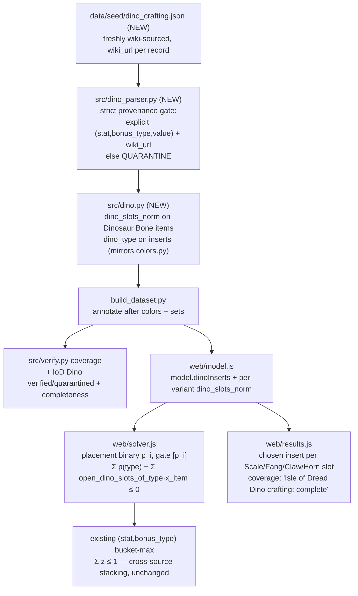

# Isle of Dread Dino Crafting as Typed Slot-Pools - Plan

## Goal Capsule

**Objective.** Make **Isle of Dread "Dino crafting"** a first-class objective source in the optimizer by extending Milestone 3's already-shipped **augment primitive** with four new *typed slot-pools* — Scale, Fang, Claw, Horn. A query that equips Dinosaur Bone gear then receives an optimal loadout whose effective totals include the best-per-slot Dino inserts, with each chosen insert shown per slot and every value wiki-traceable.

**Product authority.** The Product Contract below (carried from the `ce-brainstorm` requirements-only plan, unchanged). This document adds the Planning Contract (HOW).

**Product Contract preservation.** Product Contract unchanged — planning enriched this file in place from `requirements-only` to `implementation-ready` without altering product scope, decisions, or boundaries. One product decision was *sharpened* by a user directive on this planning run (strict wiki provenance), captured as a labeled KTD below; it tightens R1/R6, it does not change scope.

**Open blockers.** None. Ready for `/ce-work`. The two brainstorm Outstanding Questions (insert-pool explicitness, per-item slot layouts) are resolved into U2's sourcing acceptance, not blockers.

**Why now.** Milestone 3 shipped the gated-contribution + augment machinery live. Isle of Dread is endgame-relevant gear whose Dino-crafted stats are currently displayed but never reach the objective — so the solver under-counts IoD builds and can pick a wrong "optimal" set. Because IoD's mechanic turns out to be typed-slot-fill (verified below), it maps onto the augment primitive at low risk and delivers real build value without building new solver paradigms.

**Grounding — verification done this session (2026-07-25).** Before scoping, the Isle of Dread crafting structure was checked directly against ddowiki.com (plain fetch returns empty; checked via Claude-in-Chrome). Finding: IoD "Dino crafting" is **not** a linear upgrade track. **Dinosaur Bone** items (Boots, Bracers, Gloves, Belt, and weapons) carry typed **Scale / Fang / Claw / Horn** slots shown as `Isle of Dread: Scale Slot (Accessory): Empty`, filled from pools of crafted inserts; weapons carry a `Scale Slot (Weapon)`. This is structurally an augment system (typed slots + a pool per type), which is why the modeling primitive below is the augment extension, not the linear crafting-track (KTD4) primitive. Source: `https://ddowiki.com/page/Update_55_named_items` (§ Dino crafting).

---

## Product Contract

### Primary actor & outcome
A DDO player theorycrafting a build submits a query (ML cap, class/race, armor type, weapon setup, ranked affix list). When Dinosaur Bone gear is in play, the returned **theoretically-optimal loadout** now includes Isle of Dread Dino-crafting contributions, and the build sheet shows which insert fills each Scale/Fang/Claw/Horn slot — every value traceable to the DDO Wiki.

### In scope (requirements)
- **R1 — Source IoD Dino crafting.** Via the existing Claude-in-Chrome scrape, capture (a) which Dinosaur Bone items carry which typed slots (Scale/Fang/Claw/Horn for accessories; Scale for weapons), and (b) the **insert pool per slot type**, each insert as an explicit `(stat, bonus_type, value)`. Explicit-only; ambiguous inserts are **quarantined**, never inferred.
- **R2 — Model as typed slot-pools on the augment primitive.** Register Scale/Fang/Claw/Horn as four new typed slot categories in the existing augment model. Each Dinosaur Bone item exposes its Dino slots with per-type capacity; each slot is filled by *select-one* from its matching-type pool; the chosen insert's affix enters the `(stat, bonus_type)` buckets gated by **item-equipped AND insert-chosen-for-a-matching-slot**.
- **R3 — Correct stacking.** Dino insert contributions obey the same max-per-`(stat, bonus_type)` bonus-type stacking rule against worn affixes, colored augments, and set bonuses — they compete and collide by bonus type like any other source, never double-count.
- **R4 — Additive to existing augment slots.** Dinosaur Bone items also carry ordinary colored augment slots (Blue/Green/Yellow/Red), already handled by M3. The Dino slots are a parallel typed-slot layer on the same item; both apply.
- **R5 — Results & disclosure.** The full build sheet shows, per equipped Dinosaur Bone item, which insert fills each Scale/Fang/Claw/Horn slot. Per-family coverage disclosure reads **"Isle of Dread Dino crafting: complete."**
- **R6 — Data trust.** All new data flows through the existing `verified | quarantined` gate with a `wiki_url` on every record.

### Out of scope / boundaries
- **Only Isle of Dread Dino crafting this phase.** All other crafting systems (Sharn, Vecna, Myth Drannor, Ravenloft, Slave Lords) deferred.
- **The linear crafting-track primitive (U6/U7 / KTD4) is NOT built here.** It remains deferred to a future *genuinely* fixed-track system — IoD turned out not to be one.
- **Configurator systems (Green Steel, Thunder-Forged) deferred** — a distinct, larger modeling shape.
- **Done-bar = system-complete IoD.** Ship only when all Dinosaur Bone items and all Dino insert pools are sourced/encoded/shown — trustworthy rankings for IoD builds, not a partial-pipeline demo. (Chosen deliberately: a partially-sourced IoD would let the solver rank a non-IoD item "optimal" only because a better Dino insert wasn't in the dataset yet.)
- No new solve paradigm — still HiGHS-WASM, staged lexicographic, deterministic tie-break. No per-user inventory.

### Key Decisions (session-settled this brainstorm)
- **[session-settled] Vertical slice — one crafting system this phase**, then expand system-by-system. (Batch, don't boil the ocean.)
- **[session-settled] Isle of Dread is the slice target.**
- **[session-settled] Model via augment-primitive extension (typed slot-pools), not the crafting-track primitive** — chosen *after* wiki verification revealed IoD is typed-slot-fill, not a fixed track. Lowest risk (reuses shipped M3 code); accepts that this phase advances augment coverage, not the U6/U7 crafting-track capability.
- **[session-settled] Done-bar = system-complete IoD.**
- **[session-settled] Data wiki-sourced without exception, never inferred** (carried from M3; ambiguous → quarantined).

### Acceptance Examples
- **AE1** A Dino insert's stat counts only when its host Dinosaur Bone item is equipped **and** that insert is chosen for a matching-type slot; unequipping the item drops the stat from the totals.
- **AE2** A Scale insert can fill only a Scale slot — never a Fang/Claw/Horn slot; an item with no Scale slot cannot benefit from a Scale insert.
- **AE3** Two inserts contending for one slot are mutually exclusive (select-one per slot); per-type slot capacity per item is respected.
- **AE4** A Dino insert giving an Enhancement bonus to a stat does not stack with a worn item's Enhancement bonus to the same stat (max, not sum), but does stack with an Insightful bonus.
- **AE5** An insert whose wiki text is ambiguous is quarantined and surfaced in coverage disclosure — never assigned an inferred value.

### Outstanding Questions (resolve early in implementation — cheap wiki checks first)
- **Q1** Are the Dino insert pools stated on the wiki as explicit `(stat, bonus_type, value)`? Gauge the quarantine rate on a first pass — this is the primary sourcing risk to the system-complete done-bar.
- **Q2** Confirm the full per-item slot layout across all Dinosaur Bone items (which of Scale/Fang/Claw/Horn each carries; the weapon Scale variant). Verified for accessories + weapons in a sample; confirm completeness.
- **Q3** Slot-type capacity semantics — is it always exactly one slot per type per item, or can an item expose multiples? (Affects the select-one vs select-≤N gate.)
- **Q4** Do any Dino inserts carry set-like or conditional effects? If so, route through existing set-bonus handling or quarantine; do not shoehorn into a flat typed bonus.

*(Q1–Q2 are resolved into U2's sourcing acceptance; Q3 into U1's schema (KTD3); Q4 into U1's quarantine rule + U3 coverage.)*

---

## Planning Contract

### Architecture summary
Dino crafting is **the augment mechanic with a different slot vocabulary**. The solver already encodes augments (`web/solver.js:71–106`) as: each augment gets a placement binary `p_i`; its stat is a gated contribution `gates:[p_i]`; per-color capacity is bounded by `Σ p(color) − Σ open_slots_of_color(item)·x_item ≤ 0`, reading `augment_slots_norm.colors` on host variants and `aug_color.color` on augments. This plan adds a **parallel typed-slot family** — Scale / Fang / Claw / Horn — with the identical gate shape but its own namespace, so augment-color logic is untouched. The bucket-max core (`Σ z ≤ 1` per `(stat, bonus_type)`) already makes Dino contributions stack correctly against worn affixes, colored augments, and set bonuses for free. Nothing about the staged lexicographic solve or deterministic tie-break changes.

Data flows through the existing pipeline shape: a **new dedicated seed** `data/seed/dino_crafting.json` (freshly sourced; the base `ddo_items.json` stays immutable) → a new `src/dino_parser.py` that emits structured slot-layout + insert records under a **strict provenance gate** → `src/dino.py` normalization (mirroring `src/colors.py`) wired into `build_dataset.py` after color/set annotation → `web/model.js` assembly → the solver and results UI.

### High-Level Technical Design

The four Dino slot types are siblings of the augment colors — the diagram's point is that this is a **new slot namespace on an existing gate**, not a new solve.

### Key Technical Decisions

- **KTD1 — Model Dino inserts as a parallel typed-slot family, reusing the augment placement gate.** *(session-settled: user-directed — chosen over the linear crafting-track / KTD4 primitive: wiki verification this session showed IoD is typed-slot-fill, not a fixed track — see origin Grounding.)* Scale/Fang/Claw/Horn get their own capacity namespace in `web/solver.js`, structurally identical to the color-capacity block, so augment-color logic is untouched. Instantiates the brainstorm Key Decision "model via augment-primitive extension."
- **KTD2 — Strict wiki provenance is a hard gate in `src/dino_parser.py`.** *(user-directed this planning run — chosen over lenient parsing: matches the project's exclude-until-verified discipline.)* Every slot-layout and insert record must carry a non-empty `wiki_url` **and** an explicit `(stat, bonus_type, value)`; any record missing either is **quarantined**, never inferred or defaulted. Provenance is a first-class quarantine reason alongside missing magnitude. Tightens R1/R6 and the session-settled "never inferred" decision.
- **KTD3 — New dedicated seed `data/seed/dino_crafting.json`, not a mutation of the base seed.** The base `ddo_items.json` is immutable (imported from `ddo-item-puller`) and only fragmentarily carries Dino data (`Scale Slot`×1, `Horn`×0 today); Dino data is freshly sourced into its own file. Schema also records per-item slot **multiplicity** (resolves brainstorm Q3): each item lists its Dino slots explicitly, so select-one-per-slot vs multiple-slots-of-a-type falls out of the data, not an assumption.
- **KTD4 — Done-bar = system-complete IoD.** *(session-settled — chosen over pipeline-proof subset: a partially-sourced IoD lets the solver rank a non-IoD item "optimal" only because a better Dino insert wasn't sourced yet.)* U2 does not close until all Dinosaur Bone items + insert pools are sourced or their gaps are explicitly quarantined-and-disclosed.

### Implementation Units

#### U1. Dino crafting seed schema + strict provenance parser
- **Goal:** Define the `dino_crafting.json` schema and a parser that converts it to structured slot-layout + insert records under the strict provenance gate (KTD2).
- **Requirements:** R1, R2, R6; KTD2, KTD3.
- **Dependencies:** none.
- **Files:** `src/dino_parser.py` (new), `data/seed/dino_crafting.json` (new — schema + a small hand-verified starter sample, fully populated in U2), `tests/test_dino_parser.py` (new).
- **Approach:** Schema per item: `{ item, slot: "weapon"|"accessory", dino_slots: [{type: "Scale"|"Fang"|"Claw"|"Horn"}], wiki_url }`; per insert: `{ type, stat, bonus_type, value, wiki_url }`. Parser emits `{records, quarantined}`: a record is eligible only with a canonical type, an explicit `(stat, bonus_type, value)`, and a non-empty `wiki_url`; otherwise it lands in `quarantined` with a reason (`missing wiki_url`, `no parseable magnitude`, `unrecognized dino type`). Mirror the shape and quarantine idiom of `src/set_parser.py` and `src/affix_parser.py`.
- **Patterns to follow:** `src/set_parser.py` (parse-or-quarantine + `wiki_url` propagation, `src/set_parser.py:92–110`); `src/verify.py` per-record eligibility.
- **Test scenarios:**
  - Happy: a Scale insert with explicit stat/type/value + `wiki_url` → one eligible record with `dino_type: "Scale"`.
  - Provenance gate (Covers AE5): an insert missing `wiki_url` → quarantined with reason `missing wiki_url`, never emitted as eligible.
  - Magnitude gate (Covers AE5): an insert whose value is absent/free-text → quarantined `no parseable magnitude`.
  - Type gate: an insert with an unrecognized type → quarantined `unrecognized dino type`.
  - Item slot-layout: an accessory listing Scale+Fang+Claw+Horn parses to four typed open slots; a weapon with a single Scale slot parses to one.
- **Verification:** `python3 tests/run_tests.py` includes `test_dino_parser.py`; parser rejects every provenance-incomplete record in the fixtures.

#### U2. Source system-complete Isle of Dread Dino data into the seed
- **Goal:** Populate `data/seed/dino_crafting.json` with every upgradeable Dinosaur Bone item's slot layout and the full Scale/Fang/Claw/Horn insert pool, each record wiki-sourced.
- **Requirements:** R1, R6; KTD2, KTD4; resolves brainstorm Q1, Q2.
- **Dependencies:** U1.
- **Files:** `data/seed/dino_crafting.json` (populated).
- **Approach:** Source via **Claude-in-Chrome** against ddowiki.com (plain fetch returns empty). Start from `https://ddowiki.com/page/Update_55_named_items` (§ Dino crafting) for item slot layouts, and the Dinosaur Bone insert/augment pages for the per-type insert pools. Enter only fully-explicit `(stat, bonus_type, value)` records, each with its `wiki_url`; anything ambiguous is left out and logged as quarantined per U1. Record which items/pools are covered vs pending for the coverage disclosure.
- **Execution note:** This is a sourcing activity governed by U1's strict gate, not code — the deliverable is a provenance-complete seed. Do not infer values to fill gaps; a documented quarantine is the correct outcome for ambiguous wiki text.
- **Test scenarios:** `Test expectation: none -- data-sourcing unit; provenance and completeness are asserted by U1's parser over the populated seed and by U3 coverage.` Acceptance is: every record in the seed carries a `wiki_url`; the U1 parser emits zero provenance-quarantined records that were meant to be eligible; the coverage report (U3) shows IoD Dino complete or explicitly lists the pending/quarantined remainder.
- **Verification:** `python3 build_dataset.py` then the coverage summary shows all Dinosaur Bone items + insert pools sourced (or explicitly disclosed as pending); manual spot-check that sampled records' `wiki_url`s resolve to the stated stat.

#### U3. Dino slot normalization + pipeline wiring + coverage
- **Goal:** Attach typed open-slot data to Dinosaur Bone variants and a `dino_type` to inserts, wire into the build, and extend coverage to report IoD Dino completeness.
- **Requirements:** R1, R2, R4, R5; resolves brainstorm Q4 (set-like inserts routed/quarantined here).
- **Dependencies:** U1.
- **Files:** `src/dino.py` (new), `build_dataset.py`, `src/verify.py` (coverage), `tests/test_dino.py` (new).
- **Approach:** Mirror `src/colors.py`: `annotate_variant` attaches `dino_slots_norm` (typed open slots) to Dinosaur Bone variants and `dino_type` to insert records; add `dino_coverage(variants)`. In `build_dataset.py:47–51`, call `dino.annotate_variant(v)` alongside `colors_mod`/`set_mod`, and load the dino seed. Dino inserts that carry a conditional/set-like effect (Q4) are quarantined here (or deferred to set handling), never flattened.
- **Patterns to follow:** `src/colors.py` (`annotate_variant`, `normalize_slots`, `color_coverage`); `build_dataset.py` annotation loop.
- **Test scenarios:**
  - Happy: a Dinosaur Bone accessory variant gains `dino_slots_norm` with four typed slots; a Scale insert gains `dino_type: "Scale"`.
  - Boundary: a non-Dino item gains an empty `dino_slots_norm` (no phantom capacity).
  - Coverage: `dino_coverage` counts verified vs quarantined inserts and reports IoD completeness.
  - Q4: an insert flagged set-like/conditional is quarantined, not emitted as a flat typed bonus.
- **Verification:** build runs clean; `test_dino.py` green; coverage output includes an IoD Dino line.

#### U4. Solver: encode Dino inserts as typed-slot placements
- **Goal:** Make each chosen Dino insert a gated contribution bounded by its host item's typed slot capacity, stacking correctly against all other sources.
- **Requirements:** R2, R3; KTD1. Covers AE1, AE2, AE3, AE4.
- **Dependencies:** U3.
- **Files:** `web/model.js` (assemble `model.dinoInserts` + per-variant `dino_slots_norm`), `web/solver.js`, `tests/solver.test.js`, `tests/model.test.js`.
- **Approach:** Mirror the augment block (`web/solver.js:71–106`): each Dino insert gets a placement binary `p_i`; its stat is pushed to `zByBucket` gated `[p_i]`; per-type capacity constraint `Σ p(type) − Σ open_dino_slots_of_type(item)·x_item ≤ 0` emitted into `extraConstraints`, one per type. Track chosen placements in `dinoMeta` for the results reader. The `(stat, bonus_type)` bucket-max already handles stacking — no new stacking code. Before mirroring, confirm the exact `web/model.js` augment-assembly shape (how `model.augments` is built) and the `web/results.js` `augmentsPlaced` readback — both were inferred from `web/solver.js` (which consumes `model.augments` and emits `augmentsPlaced`), not read directly during planning.
- **Technical design (directional, not implementation spec):** capacity per type mirrors the color capacity `Σ p(color) − Σ open_slots_of_color(item)·x_item ≤ 0`; a Scale insert's `p` may be 1 only if an equipped item exposes an open Scale slot.
- **Patterns to follow:** the augment placement + color-capacity block and `augMeta` readback in `web/solver.js`.
- **Test scenarios:**
  - Covers AE1: a Dino insert's stat enters the total only when its host item is equipped and the insert is placed; unequipping the item drops it.
  - Covers AE2: a Scale insert places only where an open Scale slot exists; with no Scale slot its stat does not count; it never fills a Fang/Claw/Horn slot.
  - Covers AE3: two inserts contending for one slot are mutually exclusive; per-type capacity is respected.
  - Covers AE4: a Dino Enhancement bonus does not stack with a worn Enhancement bonus to the same stat (max), but stacks with an Insightful bonus.
  - Determinism: identical query yields identical placements (tie-break unchanged).
- **Verification:** `node tests/solver.test.js` + `node tests/model.test.js` green, including the four AE fixtures; an ML-34 query with Dino sources in play solves fast enough to preserve interactivity (record timing; if it regresses, apply the augment-style per-type pool cap and re-measure).

#### U5. Results UI + coverage disclosure
- **Goal:** Show the chosen insert per typed slot on each equipped Dinosaur Bone item and disclose IoD Dino coverage.
- **Requirements:** R5, R6. Covers AE5.
- **Dependencies:** U4.
- **Files:** `web/results.js`, `web/model.js` (pass through `dinoMeta`), `tests/results.test.js`.
- **Approach:** Mirror the `augmentsPlaced` rendering (`web/solver.js:248` readback → `web/results.js`): per equipped Dinosaur Bone item, list which insert fills each Scale/Fang/Claw/Horn slot. Extend the per-family coverage disclosure to read **"Isle of Dread Dino crafting: complete"** (or the sourced/pending split), driven by U3 coverage metadata; quarantined inserts are surfaced, never silently dropped.
- **Patterns to follow:** existing `augmentsPlaced` display and the per-family coverage note in `web/results.js`.
- **Test scenarios:**
  - Happy: a solved loadout with a placed Scale insert renders "Scale: <insert>" under its host item.
  - Covers AE5: a quarantined insert appears in coverage disclosure, never as a chosen placement.
  - Coverage line: disclosure reflects IoD Dino completeness from metadata.
- **Verification:** `node tests/results.test.js` green; a manual solve in `web/` shows Dino placements and the updated coverage line.

---

## System-Wide Impact
- **Dataset schema** gains a new seed file and `dino_slots_norm` / `dino_type` / `dinoInserts` fields consumed by the solver and results view. Browse (`web/browse.js`) renders unaffected records unchanged — Dino fields are additive.
- **Solve size** grows by one placement binary per eligible Dino insert plus four capacity constraints per Dinosaur Bone item. Expected small; benchmark in U4 and apply the augment per-type pool cap if an ML-34 query regresses.
- **Coverage disclosure** gains an IoD Dino family line; the "not yet optimized" scope-note shrinks by one family.

## Risks & Mitigations
- **Sourcing completeness (primary).** The insert pool may be large or partially documented → quarantine rate threatens the system-complete done-bar. *Mitigation:* U2 coverage report + quarantine review before ship; disclose any pending remainder honestly rather than inferring.
- **Configurator creep.** If some Dino inserts turn out to be player-chosen from a big pool with conditional effects (Q4), they strain the typed-slot model. *Mitigation:* U1/U3 quarantine such records; do not flatten; revisit as a follow-up if material.
- **Solve-time regression.** More binaries → slower solve. *Mitigation:* U4 benchmark + augment-style per-type pool cap.

## Verification Contract
- All existing tests stay green: `python3 tests/run_tests.py`, `node tests/solver.test.js`, `node tests/model.test.js`, `node tests/browse.test.js`, `node tests/results.test.js`, plus new `tests/test_dino_parser.py`, `tests/test_dino.py`.
- New known-answer fixtures exist for AE1 (host-equipped + placed), AE2 (type-matched slot only), AE3 (per-slot mutual exclusion / capacity), AE4 (cross-source bonus-type stacking), AE5 (quarantine disclosure).
- `python3 build_dataset.py` produces provenance-complete Dino records (every eligible record carries a `wiki_url`) and an IoD Dino coverage line.
- Solve-time for an ML-34 query with Dino sources preserves interactive feel; timing recorded.

## Definition of Done
- U1–U5 landed; Isle of Dread Dino crafting is an objective source with correct typed-slot capacity and cross-source stacking.
- Every shipped Dino record traces to an explicit ddowiki.com statement via `wiki_url`; ambiguous records are quarantined and disclosed, never inferred.
- Results show chosen inserts per typed slot; coverage discloses IoD Dino complete (or the explicit pending/quarantined remainder).
- All Verification Contract gates pass.

## Sources & Research
- **Origin (this file):** the requirements-only Product Contract above, and the session Grounding note (IoD verified as typed-slot-fill via Claude-in-Chrome; `https://ddowiki.com/page/Update_55_named_items` § Dino crafting).
- **Codebase patterns:** augment placement + color capacity `web/solver.js:71–106`; augment-color normalization `src/colors.py`; per-affix verification/quarantine `src/verify.py`; set parse-or-quarantine + `wiki_url` propagation `src/set_parser.py:92–110`; pipeline annotation loop `build_dataset.py:47–51`; immutable base seed `data/seed/ddo_items.json` (169 items, Dino data fragmentary: `Scale Slot`×1, `Horn`×0).
- **Prior plan:** `docs/plans/2026-07-25-002-feat-all-verified-sources-in-objective-plan.md` (M3 — the gated-contribution + augment primitive this extends; its U6/U7 crafting-track primitive remains deferred for a true fixed-track system).
