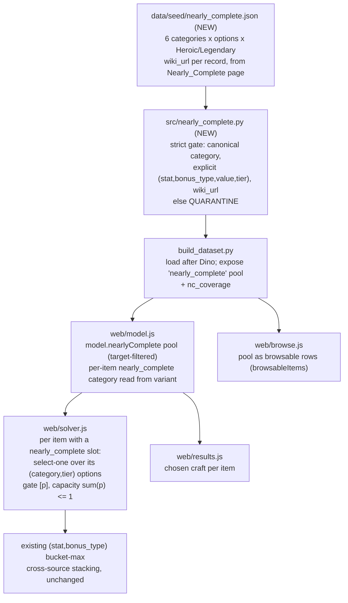

# U81 Nearly Complete Crafting - Plan

## Goal Capsule

**Objective.** Model Update 81's **Nearly Complete** crafting — the "choose a 4th affix from a category menu" upgrade from *Terror of Demogorgon* — as a new gated-contribution source, so the optimizer picks the best craftable affix for a build's ranked targets. Source the full effect pool now (via Claude-in-Chrome); attach it to item hosts as U81 named items get documented.

**Product authority.** The Product Contract below (carried from the `ce-brainstorm` requirements-only plan, unchanged). This document adds the Planning Contract (HOW).

**Product Contract preservation.** Product Contract unchanged — planning enriched this file in place from `requirements-only` to `implementation-ready` without altering product scope, decisions, or boundaries.

**Open blockers.** None. Ready for `/ce-work`. The item→slot host mapping is blocked on ddowiki publishing U81 named-item pages (revisit trigger) — disclosed and out of scope, not a blocker to this milestone (which ships the machinery + effect pool proven on fixtures).

**Why now.** U81 (*Terror of Demogorgon*, released 2026-07-22, level cap → 36) is the new endgame. Its Nearly-Complete effect system is fully documented with explicit Legendary values (+15 ability, +62 heal-amp, +13 spell focus, …) — significant best-in-slot-relevant contributions the optimizer currently can't see — and it is a clean fit for the existing gated-contribution choice-slot primitive.

**Grounding — verified this session via Claude-in-Chrome (plain fetch returns empty for ddowiki).**
- U81 = *Terror of Demogorgon*, released 2026-07-22, level cap → 36. Source: `https://ddowiki.com/page/Update_81_Release_Notes`.
- **Nearly Complete**: an upgrade mechanic that adds one extra enchantment chosen from a category menu, applied at the Duergar Completion Forge in Gravenhollow for 25 Abyssal Gems (Legendary Abyssal Gems for Legendary items); the choice is **irreversible** once selected. The full effect tables — 6 categories, their option sets, and both Heroic (ML11) and Legendary (ML35) magnitudes — are documented. Source: `https://ddowiki.com/page/Nearly_Complete`.
- The `Update 81 named items` page **does not exist yet** → which items carry which Nearly-Complete slot is not yet sourceable; that mapping is deferred.

---

## Product Contract

### Primary actor & outcome
A DDO player theorycrafting an ML35/36 build gets the optimizer to choose the best Nearly-Complete 4th affix — the single option from the slot's category menu that most advances their ranked targets — factored into the optimal loadout, with the chosen craft shown. Every value is traceable to ddowiki.

### In scope (requirements)
- **R1 — Source the Nearly-Complete effect pool** (via Claude-in-Chrome): the 6 categories, each with its bonus type, option set, and Heroic + Legendary magnitude — **Ability Score** (Enhancement, 6 abilities, +6/+15); **Insightful Ability** (Insight, +2/+7); **Quality Ability** (Quality, +1/+3); **Healing Amplification** (Positive=Competence / Repair=Enhancement / Negative=Profane, +24/+62); **Skill** (Exceptional, 6 ability-keyed skill groups, +6/+11); **Spell Focus** (Equipment, spell schools, +4/+13). Explicit values only; ambiguous → quarantined.
- **R2 — Model a Nearly-Complete slot as a parametric choice-slot.** An item carries a slot of one category; the solver selects **at most one** option from that category's pool (the best for the ranked targets), gated by the item being equipped — reusing the gated-contribution primitive (select-one feeding the bonus-type buckets), the same shape as augments and Dino inserts.
- **R3 — Correct stacking.** The chosen option's affix obeys bonus-type stacking against every other source: max per `(stat, bonus_type)`, sum across types.
- **R4 — Results & disclosure.** The build sheet shows the chosen Nearly-Complete craft per item; coverage discloses **"Nearly Complete effect system: sourced · U81 item hosts: pending wiki."**
- **R5 — Strict provenance.** Every effect-pool record carries a `wiki_url`; the unpublished item→slot mappings are pending, never inferred.
- **R6 — Sourcing mechanism.** All U81 (and ddowiki) data is sourced via the **Claude-in-Chrome MCP** — plain `fetch` returns empty for ddowiki. *(session-settled.)*

### Out of scope / boundaries
- **Item→slot host mapping** (which specific U81 items have which Nearly-Complete category) — **deferred**, blocked on ddowiki named-item pages; revisit when documented. The effect pool + machinery ship now, proven with test fixtures.
- **U81's other crafting systems** — **Catalyst Crafting** (legacy Named Item + catalyst → upgraded item) and **Essence Crafting Split-Prefix** (configurator, 100+ recipes) — deferred.
- **General U81 named-loot sourcing** — deferred (blocked on wiki).
- **No engine change** beyond the new choice-slot gated-contribution shape.
- **The legible-priority milestone** — separately scoped this session, parked on the backlog (needs no external data; ready to plan anytime).

### Key Decisions (session-settled)
- **[session-settled] Target U81 Nearly Complete specifically** — the well-specified, fully-documented choice-slot — over Catalyst Crafting and Essence Split-Prefix.
- **[session-settled] Model as a parametric select-one choice-slot** reusing the gated-contribution primitive (like augments / Dino inserts), not a new solve paradigm.
- **[session-settled] Build machinery + source the effect pool now; defer the item→slot host mapping** to when ddowiki publishes U81 items.
- **[session-settled] Source all ddowiki data via Claude-in-Chrome MCP** (plain fetch blocked).
- **[session-settled] Wiki-sourced, never inferred** — ambiguous records are quarantined.

### Acceptance Examples
- **AE1** A fixture item with a *Nearly Complete: Ability Score* slot lets the solver add **+15 Enhancement** to whichever ability best advances the ranked targets; changing the target ranking changes which ability it picks.
- **AE2** The solver selects **at most one** option per Nearly-Complete slot (options within a slot are mutually exclusive — the in-game choice is irreversible/single).
- **AE3** A Nearly-Complete Enhancement bonus to a stat does not stack with a worn Enhancement bonus to the same stat (max), but stacks with an Insightful or Quality Nearly-Complete bonus (sum).
- **AE4** An effect whose wiki text is ambiguous (e.g. a Healing-Amp bonus type that doesn't reconcile with the release notes) is quarantined and surfaced in coverage — never inferred.
- **AE5** Coverage discloses the effect system as **sourced** and the item hosts as **pending**.

### Outstanding Questions (resolve during sourcing/planning)
- **Q1** Reconcile **"Spell Focus"** (the `Nearly_Complete` page) vs **"Spell School"** (the release notes); confirm the school list (the page lists **7**, omitting **Divination**) and that the bonus type is **Equipment**.
- **Q2** Confirm the **Healing-Amp bonus types** — release notes say Positive=Competence, Repair=Enhancement, Negative=Profane; verify against the effect-table wording.
- **Q3** **Skill** category — is "Strength Skills" a target the solver ranks directly, or a group that must expand to individual skills? Define the modeling.
- **Q4** Confirm the optimizer handles **ML 36** queries (new cap); the pool's Legendary tier is ML35.
- **Q5** **Item-host attachment shape** — do U81 items simply carry a `nearly_complete: <category>` field, mirroring how Dinosaur Bone items carry their typed Dino slots? (Carry to planning.)

*(Q1–Q3 are resolved in U2's sourcing acceptance; Q4 in U4's ML-cap check; Q5 in KTD3 — items carry a `nearly_complete: <category>` field.)*

---

## Planning Contract

### Architecture summary
Nearly Complete is **the Dino-insert pattern with a parametric, category-shared pool.** It reuses the whole Dino chain shipped this session (see `docs/solutions/design-patterns/milp-encoding-for-gear-optimization.md` and the merged Dino PRs):

- **Effect pool** — a new dedicated seed `data/seed/nearly_complete.json` (freshly wiki-sourced) → a new `src/nearly_complete.py` parser that emits structured option records under a **strict provenance gate** → wired into `build_dataset.py` after the Dino step → exposed as a dataset-level pool (`nearly_complete` array, the `dino_inserts` analogue) → consumed by the solver and results/browse views. Each record is `{category, stat, bonus_type, value, tier, wiki_url}`.
- **Choice-slot on the solver** — an item carrying a `nearly_complete: <category>` field gets, per the item's tier, a select-one over that category's option pool: each option is a gated contribution `[p]` (placement binary), with a per-slot capacity `Σ p ≤ 1` (the in-game choice is single/irreversible). This mirrors the augment placement + Dino per-type capacity block in `web/solver.js`; the `(stat, bonus_type)` bucket-max handles cross-source stacking for free.
- **The one structural difference from Dino:** Dino inserts are a flat pool matched by slot *type*, and Dinosaur Bone *blank* hosts exist to carry the slots. Nearly-Complete options are matched by *(category, tier)* and are **shared across all items** of that category; and there is **no generic blank** — the slot lives on a specific named item. Since no U81 items are sourced yet, the machinery is proven on **test fixtures** and goes live when U81 items gain a `nearly_complete` field.

### High-Level Technical Design

### Key Technical Decisions

- **KTD1 — Model Nearly Complete as a parametric per-category choice-slot, reusing the gated-contribution primitive.** *(session-settled: user-directed — chosen over the linear crafting-track and configurator primitives: it is a select-one-from-menu, structurally the augment/Dino gate.)* Each category expands to option records; an item's slot selects one from its category pool at its tier. Instantiates the brainstorm Key Decision "model as a parametric select-one choice-slot."
- **KTD2 — Strict wiki provenance is a hard gate in `src/nearly_complete.py`.** *(session-settled: user-directed — matches the project's exclude-until-verified discipline.)* Every option record must carry a canonical category, an explicit `(stat, bonus_type, value, tier)`, and a non-empty `wiki_url`; anything ambiguous — the Spell-Focus/Spell-School naming, an unreconciled Healing-Amp bonus type — is **quarantined**, never inferred. Sourced via Claude-in-Chrome (plain fetch returns empty for ddowiki).
- **KTD3 — An item carries a `nearly_complete: <category>` field** (mirroring how Dinosaur Bone items carry `dino_slots`); the solver reads it to attach the choice-slot. No generic blank host exists, so the pool + machinery ship proven on fixtures; real hosts attach when U81 items are sourced (deferred, disclosed). *(Resolves Q5.)*
- **KTD4 — Tier is (Heroic ML11 / Legendary ML35).** The item's tier selects which magnitude column applies; the pool carries both. The solver uses the option matching the item's tier. *(Legendary is the endgame-relevant tier.)*

### Implementation Units

#### U1. Nearly Complete effect-pool schema + strict provenance parser
- **Goal:** Define the `nearly_complete.json` schema and a parser that emits structured option records under the strict provenance gate (KTD2).
- **Requirements:** R1, R2, R5; KTD2.
- **Dependencies:** none.
- **Files:** `src/nearly_complete.py` (new), `data/seed/nearly_complete.json` (new — schema + a small hand-verified starter sample, fully populated in U2), `tests/test_nearly_complete.py` (new).
- **Approach:** Seed schema per category: `{category, bonus_type, options: [stat, ...], heroic_value, legendary_value, wiki_url}` (or per-option rows — implementer's call). Parser emits `{records, quarantined}`: a record is eligible only with a canonical category (Ability Score / Insightful Ability / Quality Ability / Healing Amplification / Skill / Spell Focus), an explicit `(stat, bonus_type, value)` per tier, and a non-empty `wiki_url`; otherwise quarantined with a reason. Reuse the parse-or-quarantine idiom and `wiki_url` propagation of `src/dino_parser.py` and `src/set_parser.py`. Bonus types come from `affix_parser.BONUS_TYPES` (already includes Equipment/Insight/Quality/Competence/Enhancement/Profane/Exceptional from prior work).
- **Patterns to follow:** `src/dino_parser.py` (strict gate, quarantine-with-reason, `parse_dino_crafting` coverage shape); `src/set_parser.py:92–110` (wiki_url propagation).
- **Test scenarios:**
  - Happy: an Ability-Score category with 6 abilities × (+6/+15) → 6 heroic + 6 legendary eligible records, bonus_type Enhancement. `Covers AE1.`
  - Provenance gate: a category record missing `wiki_url` → quarantined `missing wiki_url`. `Covers AE4.`
  - Category gate: an unrecognized category name → quarantined `unrecognized category`.
  - Reconciliation: a Healing-Amp option whose bonus type can't be resolved → quarantined, not inferred. `Covers AE4.`
  - Tier: both Heroic and Legendary magnitudes parse to distinct records tagged by tier.
- **Verification:** `python3 tests/run_tests.py` includes `test_nearly_complete.py`; the parser quarantines every provenance-incomplete fixture.

#### U2. Source the Nearly Complete effect pool via Claude-in-Chrome
- **Goal:** Populate `data/seed/nearly_complete.json` with all 6 categories, their options, and Heroic + Legendary magnitudes, each wiki-sourced; resolve the reconciliation flags.
- **Requirements:** R1, R5, R6; KTD2; resolves Q1–Q3.
- **Dependencies:** U1.
- **Files:** `data/seed/nearly_complete.json` (populated).
- **Approach:** Source from `https://ddowiki.com/page/Nearly_Complete` via **Claude-in-Chrome** (plain fetch returns empty). Transcribe verbatim: Ability Score (Enhancement, 6 abilities, +6/+15); Insightful Ability (Insight, +2/+7); Quality Ability (Quality, +1/+3); Healing Amplification (Positive=Competence / Repair=Enhancement / Negative=Profane per the release notes, +24/+62); Skill (Exceptional, 6 ability-keyed skill groups stored as the wiki's stat name e.g. "Strength Skills", +6/+11); Spell Focus (Equipment, the 7 schools the page lists — **Divination is omitted**, do not add it, +4/+13). Cross-check Healing-Amp bonus types against `Update_81_Release_Notes`; anything that doesn't reconcile is left out and logged as quarantined per U1.
- **Execution note:** Sourcing activity governed by U1's strict gate — do not infer magnitudes; a documented quarantine is the correct outcome for anything ambiguous. The `Nearly_Complete` page was already read this session and carries the full tables.
- **Test scenarios:** `Test expectation: none -- data-sourcing unit; the U1 parser + U3 coverage assert provenance and completeness over the populated seed.`
- **Verification:** `python3 build_dataset.py` then the coverage summary shows all 6 categories present with non-zero eligible options at both tiers; every record carries a `wiki_url`.

#### U3. Pipeline wiring + coverage
- **Goal:** Wire the parsed pool into the dataset and report Nearly-Complete coverage.
- **Requirements:** R1, R4.
- **Dependencies:** U1.
- **Files:** `src/nearly_complete.py` (a `build_nearly_complete(seed)` entry, if not already in U1), `build_dataset.py`, `tests/test_nearly_complete.py`.
- **Approach:** In `build_dataset.py`, load `nearly_complete.json` and attach the parsed pool as a top-level `nearly_complete` array (the `dino_inserts` analogue) plus `nc_coverage` metadata (categories sourced, options per category/tier, quarantine list, and the "item hosts: pending" note). Mirror the Dino wiring (`load_dino_seed` / `build_dino` / `dino_inserts` + `dino_coverage`).
- **Patterns to follow:** `build_dataset.py` Dino wiring; `src/dino.py` `build_dino` coverage shape.
- **Test scenarios:**
  - Built dataset carries a non-empty `nearly_complete` pool and `nc_coverage`.
  - Coverage reports all 6 categories and the pending-hosts disclosure. `Covers AE5.`
  - A quarantined option appears in coverage, not in the eligible pool.
- **Verification:** build runs clean; `test_nearly_complete.py` green; coverage output includes a Nearly-Complete line.

#### U4. Solver — encode the Nearly-Complete choice-slot
- **Goal:** For an item with a `nearly_complete` slot, let the solver select the single best option (for the ranked targets) from its category pool at its tier, gated by the item being equipped.
- **Requirements:** R2, R3; KTD1, KTD4. Covers AE1, AE2, AE3.
- **Dependencies:** U3.
- **Files:** `web/model.js` (assemble `model.nearlyComplete` pool + read each variant's `nearly_complete` field), `web/solver.js`, `tests/solver.test.js`, `tests/model.test.js`.
- **Approach:** Mirror the augment/Dino placement block (`web/solver.js`): for each equipped-eligible item carrying `nearly_complete: C` at tier T, gather the `(C, T)` options that advance a target; each gets a placement binary `p`; its stat is a contribution gated `[p]`; emit a per-slot capacity `Σ p ≤ 1` (single irreversible choice). Track chosen placements in a `ncMeta` readback. `model.js` filters the pool to target-relevant options and exposes each item's category. The `(stat, bonus_type)` bucket-max already gives correct cross-source stacking. **First confirm** the exact augment-assembly shape in `web/model.js` and the `augmentsPlaced` readback in `web/results.js` (mirror targets).
- **Technical design (directional):** capacity per Nearly-Complete slot is `Σ p(options of this item's slot) ≤ 1`, structurally the Dino per-type capacity with the host being a single item and the pool being `(category, tier)`-scoped.
- **Patterns to follow:** the augment placement + Dino per-type capacity block and `augMeta`/`dinoMeta` readback in `web/solver.js`.
- **Test scenarios:**
  - Covers AE1: a fixture item with a `nearly_complete: Ability Score` (Legendary) slot → the solver adds +15 Enhancement to whichever ability best advances the ranked targets; changing the target ranking changes the ability chosen.
  - Covers AE2: at most one option per slot is selected (mutual exclusion).
  - Covers AE3: a Nearly-Complete Enhancement bonus does not stack with a worn Enhancement bonus to the same stat (max); it stacks with an Insightful/Quality Nearly-Complete bonus.
  - An item with no `nearly_complete` field contributes nothing new (no regression to existing solves).
  - `Covers Q4:` a solve with `mlCap: 36` runs and applies the Legendary tier.
- **Verification:** `node tests/solver.test.js` + `node tests/model.test.js` green including the AE fixtures; an ML-36 fixture solve places a Nearly-Complete option in <~200 ms.

#### U5. Results + browse UI
- **Goal:** Show the chosen Nearly-Complete craft per item, make the pool browsable, and disclose coverage.
- **Requirements:** R4. Covers AE5.
- **Dependencies:** U4.
- **Files:** `web/results.js`, `web/browse.js`, `web/model.js` (pass `ncMeta` through), `tests/results.test.js`, `tests/browse.test.js`.
- **Approach:** Mirror `assignDinoInserts`/`assignAugments` — render the chosen Nearly-Complete option as a chip on its host item in the build sheet. Extend `browsableItems` (`web/browse.js`) so the Nearly-Complete pool is browsable (as the Dino insert pool now is), and extend `coverageNote` (`web/results.js`) to read **"U81 Nearly Complete: effect pool sourced · item hosts pending wiki."**
- **Patterns to follow:** `assignDinoInserts` + the dino chip render in `web/results.js`; `browsableItems`/`dinoInsertRow` in `web/browse.js`; the per-family coverage note.
- **Test scenarios:**
  - Happy: a solved loadout with a placed Nearly-Complete option renders a "<category>: <affix>" chip under its host.
  - `browsableItems` includes the Nearly-Complete pool as display rows, findable by stat/category. `Covers AE5.`
  - Coverage note reflects the sourced-pool / pending-hosts split.
- **Verification:** `node tests/results.test.js` + `node tests/browse.test.js` green.

---

## System-Wide Impact
- **Dataset schema** gains a new seed (`nearly_complete.json`), a top-level `nearly_complete` pool, `nc_coverage`, and a per-variant `nearly_complete` field (only on U81 items, when sourced). Browse renders unaffected records unchanged; the pool appears as display rows.
- **Solve size** grows by one placement binary per target-relevant Nearly-Complete option on each equipped item carrying a slot, plus one `Σ p ≤ 1` per slot. With no U81 items sourced yet the runtime impact is zero on real queries; bounded and augment-shaped once hosts land.
- **Coverage disclosure** gains a Nearly-Complete line stating the pool is sourced and item hosts are pending.

## Risks & Mitigations
- **Host data blocked (primary).** No U81 items carry the slot until ddowiki documents them → the feature is inert on real queries at ship. *Mitigation:* prove it end-to-end on fixtures; disclose "hosts pending" in coverage; revisit trigger when the `Update 81 named items` page appears.
- **Reconciliation drift.** The `Nearly_Complete` page ("Spell Focus", 7 schools) vs the release notes ("Spell School", Equipment bonus), and the Healing-Amp bonus types. *Mitigation:* U2 cross-checks both pages; unresolved records quarantine (KTD2), never inferred.
- **Skill group-stat.** `"Strength Skills"` is a group, not a single targetable stat — a user targeting a specific skill won't match it. *Mitigation:* store the wiki's group stat verbatim; skill-group expansion is deferred follow-up.

## Verification Contract
- All existing suites stay green: `python3 tests/run_tests.py`, `node tests/solver.test.js`, `node tests/model.test.js`, `node tests/browse.test.js`, `node tests/results.test.js`, plus new `tests/test_nearly_complete.py`.
- New known-answer fixtures exist for AE1 (best-option-for-targets), AE2 (single-choice mutual exclusion), AE3 (cross-source stacking), AE5 (coverage disclosure), and an ML-36 solve (Q4).
- `python3 build_dataset.py` produces a provenance-complete Nearly-Complete pool (every eligible record carries a `wiki_url`) across all 6 categories and both tiers, and an `nc_coverage` line.

## Definition of Done
- U1–U5 landed; the Nearly-Complete effect pool is sourced, browsable, and a solver choice-slot with correct single-choice + stacking behavior, proven on fixtures.
- Every pool record traces to `ddowiki.com` via `wiki_url`; ambiguous records quarantined and disclosed, never inferred.
- Coverage discloses the pool as sourced and U81 item hosts as pending.
- All Verification Contract gates pass.

## Sources & Research
- **Origin (this file):** the requirements-only Product Contract above, and the session Grounding note (U81 = *Terror of Demogorgon*, released 2026-07-22, cap 36; Nearly Complete effect tables verified via Claude-in-Chrome at `https://ddowiki.com/page/Nearly_Complete`; `Update 81 named items` page absent).
- **Codebase patterns (the Dino chain to mirror):** `src/dino_parser.py` (strict parser), `src/dino.py` + `build_dataset.py` (pipeline + coverage), `web/solver.js` (augment/Dino placement + capacity), `web/model.js` (pool assembly + dominance), `web/results.js` (`assignDinoInserts` + coverage note), `web/browse.js` (`browsableItems`/`dinoInsertRow`).
- **Prior art:** `docs/solutions/design-patterns/milp-encoding-for-gear-optimization.md` (gated-contribution + choice-slot primitive) and the Dino PRs (#2, #3) this mirrors; `CONCEPTS.md` (`Nearly Complete slot`, `gated contribution`, `bonus-type bucket`, `quarantined`).
