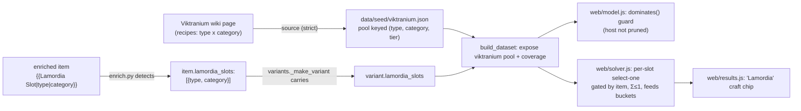

# Viktranium Experiment (Lamordia) Crafting - Plan

## Goal Capsule

**Objective.** Model **Viktranium Experiment crafting** (the "Lamordia" slots) — Milestone 1 of the multi-expansion crafting roadmap. Items carry typed Lamordia slots (Melancholic / Dolorous / Miserable / Woeful); each slot crafts one augment chosen from the pool for its (slot-type × item-category), which the solver optimizes for the ranked targets. **127 host slots already sit unused in the enriched data**; this activates them by reusing the shipped gated select-one primitive — no new solver mechanics.

**Product authority.** The roadmap's Product Contract (`docs/plans/2026-07-25-006`, M1 / R1–R3, R5). This plan adds the Planning Contract (HOW) for M1 only; the roadmap stays `requirements-only` for M2+.

**Why now / why cheap.** This is a near-exact parallel to the shipped **U81 Nearly-Complete** work (PR [#4](https://github.com/eddiefiggie/ddo-loadout-optimizer/pull/4)/[#9](https://github.com/eddiefiggie/ddo-loadout-optimizer/pull/9)): a per-item choice-slot that select-ones from a category-keyed pool, gated by the item, feeding the bonus-type buckets. The pool is fully documented and the hosts are already in the data.

**Grounding — sourced this session via Claude-in-Chrome (server-side access blocked).**
- **`https://ddowiki.com/page/Viktranium_Experiment_crafting`** — the system. Slot types **Melancholic / Dolorous / Miserable / Woeful**; recipes organized by **(slot-type × item-category)** where item-category ∈ {Weapons, Accessories, Armors}; **Heroic (ML11) and Legendary (ML35)** magnitudes; a "Wicked Viktranium Experiment Crafting" variant (Miserable/Woeful) and a "Legendary Cataclysmic Weapons and Shields" arm. Augment ingredients come from Chill of Ravenloft quests + raid.
- **Host marker in-data:** enriched items carry `{{Lamordia Slot|<type>|<category>}}` (e.g. `{{Lamordia Slot|Melancholic|Accessory}}`) — **127 occurrences** across the enriched batches, currently recorded as `unmapped` by `src/enrich.py`. The template gives the slot type and the item-category directly.

**Open blockers.** None. The pool is documented and hosts exist. Ready for `/ce-work`.

---

## Product Contract (carried from roadmap M1, unchanged)

### Primary actor & outcome
A DDO player whose gear carries Lamordia slots gets the optimizer to craft the best augment per slot — the single option from the slot's (type, item-category) pool that most advances the ranked targets — factored into the optimal loadout, with the chosen augment shown. Every value traceable to the Viktranium wiki page.

### In scope (requirements)
- **R1 — Source the Lamordia-augment pool** (via Claude-in-Chrome, strict): for each (slot-type ∈ {Melancholic, Dolorous, Miserable, Woeful} × item-category ∈ {Weapon, Accessory, Armor}), the augment options with stat, bonus type, and Heroic + Legendary magnitude. Explicit values only; ambiguous → quarantined. Include the "Wicked" and "Cataclysmic" arms if their effects parse cleanly; otherwise quarantine and disclose.
- **R2 — Model a Lamordia slot as a gated choice-slot.** An item carrying `{{Lamordia Slot|<type>|<category>}}` gets a select-one over that (type, category) pool at the item's tier (ML≥35 → Legendary), gated by the item being equipped — reusing the Nearly-Complete select-one primitive. Σ ≤ 1 per slot; an item may carry several slots of different types.
- **R3 — Correct stacking & tier.** The chosen augment obeys bonus-type stacking against every other source (max per `(stat, bonus_type)`, sum across types). Tier derives from the host ML like Nearly-Complete's `nc_tier`.
- **R4 — Activate the 127 in-data hosts.** `enrich.py` detects the `{{Lamordia Slot|...}}` template and sets a host field so those items' slots become solver-active; coverage discloses hosts active vs pool options eligible.
- **R5 — Reuse over rebuild; strict provenance; dominance-safe.** No new solver primitive. Every value carries a `wiki_url`. Add the `dominates()` guard so a Lamordia host is never pruned before it can craft (the recurring comparison-surface lesson — see `docs/solutions/design-patterns/milp-encoding-for-gear-optimization.md`).

### Key Technical Decisions
- **KTD1 — Typed choice-slot, keyed by (slot-type, item-category)** *(from wiki sourcing).* Confirmed from the Viktranium recipe structure: options depend on both the slot's type AND the item's category. So the pool key is `(type, category)`, not category alone (unlike Nearly-Complete's single-category key).
- **KTD2 — Reuse the gated select-one primitive** *(session-settled: user-directed — chosen over a new mechanic: the roadmap's whole thesis is primitive reuse).* Mirror the Nearly-Complete solver block (`web/solver.js`) and its `dominates()` guard (`web/model.js`), and the `src/nearly_complete.py` parser + `build_dataset` wiring.
- **KTD3 — Tier from host ML** *(mirrors `ncTier`).* ML≥35 → Legendary, else Heroic; no per-item tier field required.

---

## Planning Contract

### High-Level Technical Design

The data + control flow mirrors the shipped Nearly-Complete path exactly, with a two-key pool:

*Directional — mirrors the Nearly-Complete implementation.*

### Implementation Units

### U1. Source the Viktranium/Lamordia augment pool

**Goal.** Produce `data/seed/viktranium.json` — the augment option pool keyed by (slot-type, item-category, tier), strictly wiki-sourced.
**Requirements.** R1, R5.
**Files.** `data/seed/viktranium.json` (new), `data/seed/compendium/raw/viktranium.json` (new — raw wikitext for reproducibility, per the enrichment reproducibility contract).
**Approach.** Harvest the Viktranium recipe tables via the Claude-in-Chrome MediaWiki API / DOM+`get_page_text` bridge (see `docs/solutions/`… and [[ddo-wiki-bulk-data-bridge]] in memory). For each (Melancholic/Dolorous/Miserable/Woeful × Weapons/Accessories/Armors) table, extract each augment's stat, bonus type, and Heroic + Legendary magnitude. Normalize stat via `src.vocab.normalize_stat`; validate `bonus_type in src.affix_parser.BONUS_TYPES`; ambiguous rows → `coverage.quarantined` with a reason. Include Wicked + Cataclysmic arms only if they parse cleanly. Mirror the shape of `data/seed/nearly_complete.json`.
**Execution note.** Source strictly — never infer a magnitude; a row with no explicit value quarantines. Confirm the (type, category) matrix is complete before writing; log any table that failed to parse rather than silently dropping it.
**Patterns to follow.** `data/seed/nearly_complete.json` (pool shape), `src/nearly_complete.py` (strict validation), the get_page_text windowed export bridge.
**Test scenarios.** (data unit — validated by U2's loader) the seed parses; every option has stat + bonus_type + tier magnitude + `wiki_url`; no option has an unknown bonus_type; quarantined rows carry a reason.
**Verification.** `viktranium.json` loads and its option count matches the wiki table count (minus quarantined), all wiki-traceable.

### U2. Parse the pool + detect hosts + propagate through the pipeline

**Goal.** A `src/viktranium.py` loader/parser (mirror `src/nearly_complete.py`); `enrich.py` sets `lamordia_slots` on items carrying `{{Lamordia Slot|...}}`; `variants._make_variant` carries the field.
**Requirements.** R2, R4, R5.
**Dependencies.** U1.
**Files.** `src/viktranium.py` (new), `src/enrich.py` (modify — detect the template like it detects `{{Nearly Complete}}`), `src/variants.py` (modify — carry `lamordia_slots` + reuse the ML→tier derivation), `tests/test_viktranium.py` (new), `tests/test_enrich.py` (extend).
**Approach.** `viktranium.py`: `parse_viktranium(seed)` → `{records, coverage}` keyed by (type, category, tier), same contract as `nearly_complete.parse_nearly_complete`. In `enrich.parse_enhancement_field`, handle `{{Lamordia Slot|<type>|<category>}}` (currently unmapped): append `{type, category}` to a `lamordia_slots` list on the result; `build_item_record` sets `rec["lamordia_slots"]`. In `variants._make_variant`, propagate `lamordia_slots` (exactly like the `nearly_complete`/`nc_tier` propagation added in PR #9). Category normalization: map the template's `Accessory`/`Weapon`/`Armor` to the pool's item-category key.
**Patterns to follow.** `src/enrich.py` `{{Nearly Complete}}` handling + `build_item_record`; `src/variants.py` `_make_variant` `nearly_complete` propagation.
**Test scenarios.**
- `{{Lamordia Slot|Melancholic|Accessory}}` → `lamordia_slots == [{"type":"Melancholic","category":"Accessory"}]`; unknown slot type → recorded, not hosted.
- an item with two Lamordia slots → both captured.
- `parse_viktranium` marks a quarantined option and surfaces it in coverage.
- Covers R4: an enriched item with the template flows through `expand_dataset` carrying `lamordia_slots` on its variant.
**Verification.** Rebuild shows the 127 in-data slots resolved to `lamordia_slots` fields on their variants; `viktranium_coverage` reports pool options eligible + hosts detected.

### U3. Solver select-one block + dominance guard + build wiring

**Goal.** The solver crafts one augment per Lamordia slot; `dominates()` never prunes a host; `build_dataset` exposes the pool + coverage.
**Requirements.** R2, R3, R5.
**Dependencies.** U2.
**Files.** `build_dataset.py` (modify — load `viktranium.json`, expose `viktranium` pool + `viktranium_coverage`), `web/solver.js` (modify — add the Lamordia choice-slot block), `web/model.js` (modify — `dominates()` guard + carry the pool through `buildModel`), `tests/solver.test.js` (extend), `tests/model.test.js` (extend).
**Approach.** `build_dataset`: `viktranium.py` → `metadata.viktranium_coverage` + a `viktranium` pool block; the enriched-item merge already carries `lamordia_slots`. `web/model.js` `buildModel`: filter the pool to target-advancing options (mirror `ncPool`), pass as `viktranium`. `web/solver.js`: a block mirroring the Nearly-Complete one — for each `xv.variant.lamordia_slots`, for each option in the pool matching `(slot.type, slot.category, tier)` that hits a target: a placement binary gated by the item (`n - x_item <= 0`), fed into its `(stat, bonus_type)` bucket, `Σ n <= 1` **per slot** (an item with two slots gets two independent select-ones). Tier from host ML (reuse the `ncTier`/`nc_tier` derivation). Return `viktraniumPlaced`. `web/model.js` `dominates()`: a guard — if B carries a Lamordia slot A cannot match (by type+category+tier), A does not dominate B (mirror the `nearly_complete` guard; the slot value lives outside `variantBuckets`).
**Execution note.** The dominance guard is the load-bearing correctness step — cover it with an **end-to-end** solve, not just a model test (the recurring lesson: pruning defects hide from already-built-model unit tests).
**Patterns to follow.** `web/solver.js` Nearly-Complete block (`ncMeta`, per-option binary, `Σ ≤ 1`, `ncPlaced`); `web/model.js` `dominates()` `nearly_complete` guard + `ncTier`.
**Test scenarios.**
- Solver: an item with a `Melancholic|Accessory` slot and a target the pool advances → exactly one augment placed (Σ≤1), correct stat/type/value; targeting a different stat pivots the chosen option.
- Solver: an item with two Lamordia slots → up to two augments placed (one per slot).
- Stacking: a crafted Enhancement augment maxes (not sums) against a worn Enhancement of the same stat; sums across types.
- Dominance (model): an affix-bearing rival does NOT dominate a Lamordia host it cannot match.
- **End-to-end (real dataset):** targeting a stat only a Lamordia augment supplies selects a real host and places the augment (mirrors the "Diversion"/NC-craft regressions in `tests/solver.test.js`).
**Verification.** Full suite green; an end-to-end solve crafts a Lamordia augment onto one of the 127 hosts.

### U4. Surface it — results chip, coverage note, browse

**Goal.** The chosen Lamordia augment shows on its item in the loadout; coverage discloses the system; the pool is browsable.
**Requirements.** R4.
**Dependencies.** U3.
**Files.** `web/results.js` (modify — a "Lamordia" craft chip from `viktraniumPlaced`, mirror the NC/"Choice" chips), `web/styles.css` (modify — `.chip.lamordia`), `web/browse.js` (modify — surface the pool as browse rows, mirror the NC option rows), `tests/browse.test.js` (extend), `tests/results.test.js` (extend).
**Approach.** `results.js`: group `viktraniumPlaced` by item, render a chip per crafted augment (mirror `ncByItem`/`rollByItem`). `results.js` `coverageNote`: add Viktranium to the "Optimized" line with `viktranium_coverage.hosts_active` + options-eligible (mirror the NC-hosts line added in PR #9). `browse.js`: render pool options as `indexed`-style display rows so the effect pool is browsable (mirror `ncRow`).
**Patterns to follow.** `web/results.js` `ncByItem` chip + `coverageNote` NC line; `web/browse.js` `ncRow`.
**Test scenarios.**
- `results`: a placed Lamordia augment renders as a chip on its item; coverage note names Viktranium with the host count once hosts exist (mirror the NC coverage test).
- `browse`: pool options appear as browsable rows, filterable.
**Verification.** Browse shows the Viktranium pool; a solve result displays the crafted augment; coverage note reflects hosts active.

### U5. Reproducibility + docs

**Goal.** The seed is regenerable from committed raw wikitext; the plan/coverage story is honest.
**Requirements.** R1, R5.
**Dependencies.** U1.
**Files.** `data/seed/compendium/raw/viktranium.json` (committed in U1), a short note in the coverage disclosure that Wicked/Cataclysmic arms are included or quarantined.
**Approach.** Per the enrichment reproducibility contract, commit the raw wikitext so `viktranium.json` is regenerable through `src/viktranium.py`. Disclose in coverage which arms (Wicked, Cataclysmic) shipped vs quarantined.
**Test expectation:** none — documentation/data-provenance unit.
**Verification.** `viktranium.json` can be regenerated from `raw/viktranium.json` and matches.

---

## Verification Contract

- `python3 tests/run_tests.py` green; all `tests/*.test.js` green (exit-code checked).
- `python3 build_dataset.py` rebuilds with `metadata.viktranium_coverage` (options eligible + hosts active) and a `viktranium` pool block; the 127 in-data slots resolve to `lamordia_slots` on their variants.
- End-to-end HiGHS solve crafts a Lamordia augment onto a real host for a matching target (the load-bearing dominance/consumption check).
- Browse surfaces the pool; results show the crafted augment; coverage note names Viktranium with hosts active.
- Strict provenance: every option wiki-traceable; ambiguous rows quarantined, not inferred.

## Definition of Done

The 127 Lamordia host slots are solver-active: for a build whose gear carries them, the optimizer crafts the best augment per slot and shows it, with correct bonus-type stacking and tier, every value wiki-traceable — reusing the Nearly-Complete primitive with only a `dominates()` guard added. Wicked/Cataclysmic arms shipped or honestly quarantined.

---

## Scope Boundaries

### Deferred to Follow-Up Work
- **M2 IoD Dino Weapon/Armor/Set-Bonus pools, M3 Essence** — separate roadmap milestones.
- **Catalyst-crafted named items** — named-gear sourcing (roadmap R4), not this plan.
- **Ingredient/economy modeling** (Bleak Conductors/etc.) — the optimizer cares about the resulting stats, not the crafting currency.

### Out of scope
- New solver/model primitives — Viktranium is expressed with the existing gated select-one; if the Cataclysmic arm proves to need item-creation semantics (like Catalyst), it moves to named-gear sourcing, not a new mechanic.

---

## Provenance
- Source: roadmap `docs/plans/2026-07-25-006` (M1), enriched by `ce-plan`. Architecture (typed choice-slot keyed by type×category) resolved from a live Claude-in-Chrome read of the Viktranium page this session.
- Mirrors the shipped Nearly-Complete implementation (PRs #4, #9) and its dominance-guard lesson (`docs/solutions/design-patterns/milp-encoding-for-gear-optimization.md`).
