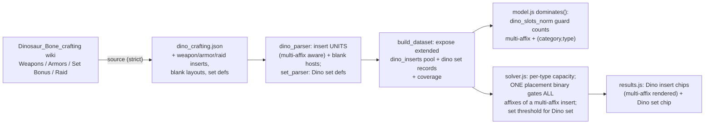

# IoD Dino Weapon / Armor / Set-Bonus / Raid Crafting - Plan

## Goal Capsule

**Objective.** Complete Isle of Dread **Dinosaur Bone crafting** in the optimizer by sourcing the four pools deferred from the shipped Accessory slice — **Weapon**, **Armor**, **Set-Bonus**, and **Raid** — under strict wiki provenance, and wiring them through the already-built machinery: the typed choice-slot (Dino insert) primitive for Weapon/Armor/Raid, and the set-bonus primitive for Set-Bonus. This milestone also lifts two limitations the Accessory slice deferred: **multi-affix inserts** (one slot granting several affixes) and **variant-aware slot typing** (an insert pool that depends on the host's category/variant, not the slot type alone).

**Product authority.** This plan enriches milestone **M2** of the roadmap (`origin:` above). The roadmap's Product Contract (R1–R5) is the source of truth for WHAT; this plan adds HOW. Product Contract unchanged.

**Why now.** M1 (Viktranium) shipped the exact two-key `(slot_type × category)` typed choice-slot extension and the strict-provenance sourcing loop this milestone reuses. The Dino typed-insert primitive, its per-type capacity constraint, its `dominates()` slot guard, and the set-bonus primitive are all already built and battle-tested — M2 is mostly sourcing + a bounded model extension for multi-affix placements.

**Grounding — what already exists (shipped in PR #2 / plan 003).**
- `src/dino_parser.py` — parses the `dino_crafting.json` seed into typed **insert records** (`{dino_type, stat, bonus_type, value}`, one per affix) keyed by `dino_type` (Scale/Fang/Claw/Horn), and **slot layouts** (a blank host's typed open slots, with per-type multiplicity). **Multi-affix inserts are currently quarantined** (`_is_multi_affix`), and **inserts are keyed by `dino_type` alone** (no variant dimension).
- `src/dino.py` — `build_dino` → pre-verified **blank host variants** (`dino_slots_norm`, no base affixes) + insert records + coverage. Blank→worn-slot mapping (`_worn_slot`) currently covers **Accessory** slots only.
- `web/solver.js` — the Dino block: a placement binary `q` per insert gated into its `(stat, bonus_type)` bucket, with **aggregate per-type capacity** `Σq(type) − Σ open_slots_of_type(item)·x_item ≤ 0`.
- `web/model.js` — `dominates()` reads `dino_slots_norm` as a multiset so a blank host is never pruned; `buildModel` filters the insert pool to target-advancing records.
- The **set-bonus primitive** (`src/set_parser.py`, the solver's set-threshold block, `dominates()`'s set guard) already models a named set activating at a piece count — the shape a Dino Set-Bonus needs.
- `data/seed/dino_crafting.json` — `metadata.sourcing_status`: *"Accessory pools complete … DEFERRED (disclosed): Weapon/Armor/Raid/Set-Bonus augment pools + variant-aware (variant,type) slot typing; and multi-affix inserts."* This plan closes that deferral.

**Session-settled scope decisions (this run).**
- **Multi-affix inserts are IN scope**, modeled by extending the gated primitive to multi-contribution-per-placement (see KTD4). *(user-directed — chosen over keeping them deferred: weapon pools are expected to be heavily multi-affix, and deferring would gut weapon coverage.)*
- **The Raid Dino pool is IN scope for M2**, sourced as a fourth typed-insert pool when it shares the insert shape. *(user-directed — chosen over folding Raid into the later R4 named-gear sweep.)*

---

## Product Contract (carried from roadmap M2, unchanged)

### Primary actor & outcome
A DDO player theorycrafting an endgame build gets optimizer results that account for **all** Isle of Dread Dinosaur Bone crafting — not just Accessory inserts, but the Weapon, Armor, and Raid typed-insert pools and the Dino Set-Bonus — so the solver crafts the best insert per typed slot (and completes a Dino set when it advances a ranked target), over every host their gear carries. Every crafted value is wiki-traceable.

### In scope (requirements)
- **R1 — Source the four deferred pools** (Weapon, Armor, Set-Bonus, Raid) from `ddowiki.com/page/Dinosaur_Bone_crafting` (and any linked raid page) under strict provenance; resolve the `(variant, type)` slot-typing question from the wiki.
- **R2 — "Done" per pool** (the Accessory / Nearly-Complete / Viktranium precedent): pool sourced → parser produces typed records + blank hosts (or set records) → the **existing** primitive attaches them → verified end-to-end by a real HiGHS solve → honest per-pool coverage disclosure.
- **R3 — Strict provenance, block-until-documented.** Explicit values only; ambiguous → quarantined, never inferred; every value carries a `wiki_url`. A pool whose shape is not fully documented does not ship.
- **R4 — Reuse over rebuild.** Weapon/Armor/Raid fold into the typed Dino-insert primitive; Set-Bonus folds into the set-bonus primitive. The one sanctioned new mechanic is multi-contribution-per-placement (KTD4), because a multi-affix insert provably cannot be expressed as independent single-affix placements.
- **R5 — Lift the Accessory-slice deferrals:** multi-affix inserts (KTD4) and variant-aware `(variant, type)` slot typing (KTD1).

### Success criteria
- The solver crafts the best Weapon/Armor/Raid Dino insert per typed slot (including multi-affix inserts as an all-or-nothing placement) and completes a Dino set when it advances a ranked target, verified by a real solve.
- Coverage honestly moves Dino Weapon/Armor/Set-Bonus/Raid from *pending* to *optimized*, with per-pool host/insert counts and an explicit list of anything quarantined.
- No fabricated data: ambiguous effects quarantined; nothing inferred.

---

## Key Technical Decisions

- **KTD1 — Variant-aware slot typing resolved from the wiki, extend only if needed.** Source first. If Weapon/Armor/Raid insert pools depend only on the slot type (Scale/Fang/Claw/Horn), the existing `dino_type`-keyed primitive is reused unchanged. If a pool is **variant-dependent** (e.g. the inserts a *weapon* can take differ from an *armor*'s for the same slot type), extend the pool key to `(category, dino_type)` and the blank's slot signature likewise — **mirroring the Viktranium `(slot_type, category)` extension shipped in plan 007** (`web/model.js` `lamordiaSlotKeys`, the solver's two-key match predicate). *(agent-decided during U1 sourcing; the branch that fires is data-determined.)*
- **KTD2 — Dino Set-Bonus reuses the set-bonus primitive, not the insert primitive.** A Dino set is a named set that activates at a piece threshold — the exact shape `src/set_parser.py` + the solver's set-threshold block already model. Confirmed during U1; if a "set bonus" turns out to be a per-item typed insert instead, it routes to the insert primitive.
- **KTD3 — Blank weapon/armor/raid hosts map to their worn slot; per-type capacity falls out of slot multiplicity.** Extend `_worn_slot` so weapon blanks compete in **Main Hand**, armor blanks in **Armor**, raid blanks in their equip slot — mirroring the Accessory blank mapping. Capacity is already aggregate-per-type across equipped items, so no capacity-model change.
- **KTD4 — Multi-affix insert = one placement binary gating several bucket contributions** *(session-settled: user-directed — chosen over deferring: weapon pools are heavily multi-affix).* The record model changes from "one flattened record per affix" to "one insert unit carrying a list of affixes"; the solver gives it a single placement binary `q` that gates **every** affix's `z` contribution (all-or-nothing, since the affixes come together from one slot). The `dominates()` comparison surface must count the insert's **full** affix set so a multi-affix blank host is never wrongly pruned (the documented dominance-superset obligation).
- **KTD5 — Tier/eligibility from the wiki, never inferred** — same strict rule as every prior pool: a record is solver-eligible only with a canonical type, a parseable `(stat, bonus_type, value)` (or set), and a `wiki_url`.

---

## Planning Contract

### High-Level Technical Design

The data + control flow reuses the shipped Dino path, extended at two points (multi-affix record shape; optional `(category, type)` key) plus the set primitive for the Set-Bonus pool.

*Directional — mirrors the shipped Dino + set + Viktranium implementations.*

### Implementation Units

### U1. Source the four Dino pools + resolve slot typing

**Goal.** Extend `data/seed/dino_crafting.json` with the Weapon, Armor, Raid, and Set-Bonus pools, strictly wiki-sourced, and resolve the `(variant, type)` typing question (KTD1) and the Set-Bonus shape (KTD2) from the wiki.
**Requirements.** R1, R3, R5.
**Files.** `data/seed/dino_crafting.json` (extend), `data/seed/compendium/raw/dino_crafting.json` (new — raw harvested effect text for reproducibility, per the enrichment reproducibility contract).
**Approach.** Harvest the Weapons / Armors / Set Bonus sections (and the linked raid page) of `ddowiki.com/page/Dinosaur_Bone_crafting` via the Claude-in-Chrome MediaWiki API / DOM+`get_page_text` bridge ([[ddo-wiki-bulk-data-bridge]] in memory). For each pool: capture each insert's slot type, its VERBATIM effect string(s), and its host's category; capture blank host slot layouts; capture Set-Bonus named-set + per-tier threshold definitions. Store effect strings verbatim (values parsed downstream, never hand-structured). Determine per pool whether the insert set is slot-type-only or `(category, type)`-dependent, and record that determination in `metadata.sourcing_status`.
**Execution note.** Source strictly — never infer a magnitude or a slot type. Multi-affix effect strings are now KEPT (U2 parses them), not dropped. If the raid page documents a *distinct* crafting mechanic rather than the same typed-insert shape, stop and record it as out-of-scope rather than forcing it into the insert model (R4 boundary).
**Patterns to follow.** `data/seed/dino_crafting.json` (existing Accessory shape), `data/seed/compendium/raw/viktranium.json` (raw-harvest reproducibility shape), the get_page_text windowed export bridge.
**Test scenarios.** (data unit — validated by U2's parser) the extended seed loads; every insert has a canonical type + verbatim effect + `wiki_url`; every set def has a named set + threshold; the `(variant,type)` determination is recorded.
**Verification.** The seed carries the four new pools; counts match the wiki section counts (minus quarantined); `sourcing_status` records the typing determination and any raid out-of-scope note.

### U2. Extend the parser: multi-affix insert units, variant-aware typing, weapon/armor/raid blank hosts

**Goal.** `src/dino_parser.py` parses multi-affix inserts as single placeable **units** (KTD4) and, if U1 confirmed it, `(category, type)`-keyed pools (KTD1); `src/dino.py` materializes weapon/armor/raid blank host variants (KTD3).
**Requirements.** R2, R4, R5.
**Dependencies.** U1.
**Files.** `src/dino_parser.py` (modify), `src/dino.py` (modify), `tests/test_dino.py` (extend; create if absent).
**Approach.** `dino_parser`: replace the multi-affix **quarantine** with multi-affix **parsing** — an insert record becomes `{dino_type, category?, affixes: [{stat,bonus_type,value,unit}, …], wiki_url, raw}` (a single-affix insert is just a one-element `affixes` list, preserving the Accessory shape). Keep the strict gates (canonical type, `wiki_url`, each affix parseable via `affix_parser.parse_line`); quarantine an insert only if *no* affix parses. If U1 found variant-dependence, add the `category` key and thread it through `parse_inserts` / `parse_slot_layouts`. `dino.py`: extend `_worn_slot`/`WORN_SLOT` mapping so weapon blanks → Main Hand (category weapon), armor blanks → Armor, raid blanks → their slot; materialize their blank host variants exactly like Accessory blanks.
**Patterns to follow.** `src/dino_parser.py` `parse_inserts` / `parse_slot_layouts`; `src/dino.py` `_blank_variant`; the Viktranium `(slot_type, category)` threading in `src/viktranium.py` if the two-key branch fires.
**Test scenarios.**
- A multi-affix insert ("Fang: Deception") parses to ONE unit with two affixes; a single-affix insert parses to a one-affix unit.
- An insert with one parseable + one garbage affix: the garbage is dropped, the unit keeps the parseable affix, with a quarantine note; an all-garbage insert quarantines whole.
- A weapon blank materializes a Main Hand host with its typed `dino_slots_norm`; an armor blank → Armor host.
- If two-key: a `(Weapon, Scale)` insert is not offered to an `(Armor, Scale)` slot.
- Covers R5: an item exposing two Scale slots lists Scale twice (per-type multiplicity preserved).
**Verification.** Rebuild shows weapon/armor/raid blank hosts with typed slots; the insert pool includes multi-affix units; coverage reports per-pool eligible + quarantined.

### U3. Dino Set-Bonus via the set-bonus primitive

**Goal.** A crafted Dino set activates through the existing set machinery — its stats count only at the piece threshold.
**Requirements.** R1, R2, R4.
**Dependencies.** U1.
**Files.** `src/set_parser.py` (modify only if the Dino set shape needs a new source path; otherwise `build_dataset.py` wiring only), `build_dataset.py` (modify — feed Dino set defs into set records), `tests/test_set_parser.py` (extend).
**Approach.** Map each sourced Dino Set-Bonus definition to the set-parser's record shape (named set + per-threshold parsed affixes). If Dino set data arrives already in the base-seed `set_bonus` shape, this is pure wiring; if it needs a distinct parse, add a thin adapter mirroring `set_parser`. The solver's set-threshold block and `dominates()`'s set guard are unchanged — a Dino set is just another named set.
**Execution note.** Confirm from U1 whether "Set Bonus" is genuinely a named-set/threshold mechanic; if U1 found it is actually a per-item insert, drop this unit and route those records to U2's insert pool (KTD2's fallback).
**Patterns to follow.** `src/set_parser.py`; the base seed's `set_bonus` records; `build_dataset.py` set wiring.
**Test scenarios.**
- A Dino set's tier stats count only once N pieces are equipped (mirror the existing set-threshold test).
- A Dino set completes only when it advances a ranked target (lexicographic).
**Verification.** A solve completes a Dino set when it helps; coverage lists the Dino set(s) sourced.

### U4. Solver + dominance + build wiring

**Goal.** The solver crafts multi-affix (and `(category,type)`) Dino inserts correctly; `dominates()` never prunes a host; `build_dataset` exposes the extended pools + coverage.
**Requirements.** R2, R3, R4, R5.
**Dependencies.** U2, U3.
**Files.** `web/solver.js` (modify — multi-affix placement; optional two-key match), `web/model.js` (modify — `dominates()` guard counts multi-affix + optional `(category,type)`; `buildModel` pool filter), `build_dataset.py` (modify — expose the extended `dino_inserts` + coverage), `tests/solver.test.js` (extend), `tests/model.test.js` (extend).
**Approach.** `solver.js`: give each insert **unit** one placement binary `q`; for each affix in the unit, add a `z` contribution gated `[q]` into that affix's `(stat,bonus_type)` bucket — so all affixes of a multi-affix insert apply together or not at all. Per-type capacity constraint is unchanged (it counts placements per type). If two-key, match `q` to a slot only when `(category, type)` agree. `model.js` `dominates()`: the `dino_slots_norm` multiset guard already keeps blank hosts; ensure the **pool filter** keeps a multi-affix insert whenever *any* of its affixes advances a target, and that the guard key includes `category` when the two-key branch fires (mirror `lamordiaSlotKeys`). `build_dataset`: unchanged pool wiring plus the new coverage fields.
**Execution note.** The multi-affix all-or-nothing gate and the dominance surface are the load-bearing correctness steps — cover them with an **end-to-end** solve, not just a model test (the recurring lesson: pruning/consumption defects hide from already-built-model unit tests; see plan 007's tier bug).
**Patterns to follow.** `web/solver.js` existing Dino block (`dinoByType`, capacity constraint) + the NC/Viktranium select-one blocks; `web/model.js` `dominates()` `dino_slots_norm` + `lamordiaSlotKeys` guards.
**Test scenarios.**
- Solver: a Scale slot + a multi-affix Scale insert whose two affixes both hit targets → BOTH affixes apply from one placement; capacity still bounds to one placement per open slot.
- Solver: a multi-affix insert is all-or-nothing — it is never placed for only one of its affixes.
- Stacking: a crafted insert affix maxes (not sums) against a worn affix of the same `(stat,bonus_type)`; sums across types.
- If two-key: an insert is placed only into a slot of its `(category, type)`.
- Dominance (model): an affix-bearing rival does NOT dominate a weapon/armor Dino blank whose value is its typed slots (incl. a multi-affix insert's full value).
- **End-to-end (real dataset):** targeting a stat only a Weapon (or multi-affix) Dino insert supplies selects a real blank host and places the insert.
**Verification.** Full suite green; an end-to-end solve crafts a weapon/armor/raid Dino insert (incl. a multi-affix one) onto a real host.

### U5. Surface — results chips, coverage note, browse

**Goal.** Crafted Weapon/Armor/Raid inserts (multi-affix rendered) and the Dino set show in the loadout; coverage discloses the pools; the pools are browsable.
**Requirements.** R2.
**Dependencies.** U4.
**Files.** `web/results.js` (modify — Dino insert chips render all affixes of a multi-affix insert; Dino set chip), `web/browse.js` (modify — weapon/armor/raid insert rows + Dino set rows), `web/styles.css` (modify only if a new chip class is needed), `tests/results.test.js` (extend), `tests/browse.test.js` (extend).
**Approach.** `results.js`: the existing `dinoInsertRow`/chip path renders one affix; extend it to render a multi-affix insert's affix list on one chip (e.g. "Fang: +11 Sneak Attacks, +17 Sneak Attack Damage"). `results.js` `coverageNote`: move Dino Weapon/Armor/Raid/Set-Bonus out of the **Pending** line and into the **Optimized** line with per-pool counts (mirror the Viktranium coverage line added in plan 007). `browse.js`: render weapon/armor/raid insert pool rows and Dino set rows (mirror `dinoInsertRow`/`ncRow`).
**Patterns to follow.** `web/results.js` `assignDinoInserts` + the Dino/NC/Lamordia chips + `coverageNote`; `web/browse.js` `dinoInsertRow`.
**Test scenarios.**
- `results`: a placed multi-affix insert renders all its affixes on its chip; coverage note names Dino Weapon/Armor/Set-Bonus/Raid under Optimized once hosts exist.
- `browse`: weapon/armor/raid inserts + Dino set appear as browsable rows, filterable by stat.
**Verification.** Browse shows the new pools; a solve displays the crafted insert(s) and any completed Dino set; the pending line no longer claims these pools are unoptimized.

### U6. Reproducibility + docs

**Goal.** The extended seed is regenerable from committed raw wikitext; the coverage story is honest.
**Requirements.** R1, R3.
**Dependencies.** U1.
**Files.** `data/seed/compendium/raw/dino_crafting.json` (committed in U1), `CONCEPTS.md` (update), `data/seed/dino_crafting.json` `metadata.sourcing_status` (update to reflect what shipped vs. what remains).
**Approach.** Per the enrichment reproducibility contract, commit the raw harvested effect text so the seed's parsed values are regenerable through `dino_parser`. Update `CONCEPTS.md`: add/extend entries for the **multi-affix Dino insert** (one placement, several affixes), **variant-aware slot typing** (if the two-key branch fired), and **Dino Set-Bonus**. Rewrite `sourcing_status` to disclose which pools shipped, which effects quarantined, and any raid mechanic ruled out of scope.
**Test expectation:** none — documentation / data-provenance unit.
**Verification.** The parsed insert/set values are reproducible from the committed raw text; `sourcing_status` and `CONCEPTS.md` reflect the shipped state honestly.

---

## Verification Contract

- `python3 tests/run_tests.py` green; all `tests/*.test.js` green (exit-code checked).
- `python3 build_dataset.py` rebuilds with the extended `dino_inserts` pool, weapon/armor/raid blank hosts, Dino set records, and per-pool coverage; multi-affix inserts appear as single placeable units.
- End-to-end HiGHS solve crafts a Weapon/Armor/Raid Dino insert (including a multi-affix insert, all-or-nothing) onto a real host, and completes a Dino set when it advances a ranked target (the load-bearing dominance/consumption checks).
- Browse surfaces the four pools; results show crafted inserts (multi-affix rendered) and any completed Dino set; the coverage note moves them from pending to optimized.
- Strict provenance: every insert/set value wiki-traceable; ambiguous rows quarantined, not inferred; any distinct raid mechanic disclosed as out-of-scope rather than force-fit.

## Definition of Done

Isle of Dread Dinosaur Bone crafting is complete in the optimizer: the solver crafts the best Weapon/Armor/Raid insert per typed slot — including multi-affix inserts as all-or-nothing placements — and completes a Dino set when it advances a ranked target, over every real host, with correct per-type capacity and bonus-type stacking, every value wiki-traceable. Coverage honestly reports the four pools as optimized with per-pool counts, and the `(variant,type)` typing + multi-affix deferrals from the Accessory slice are lifted. Reuse held: the typed-insert primitive and the set primitive absorbed the work, with only the sanctioned multi-contribution-per-placement extension added.

---

## Scope Boundaries

### Deferred to Follow-Up Work
- **M3 Essence crafting** — the next roadmap milestone; separate plan.
- **R4 exhaustive named + raid gear** — the endgame named-item sweep; raid *named* gear (as opposed to raid Dino *crafting*, which is in this plan) belongs there.

### Out of scope
- **A distinct raid crafting mechanic**, if the raid page documents one rather than the same typed-insert shape — disclosed and deferred to its own milestone under R2's "done" bar, not force-fit into the insert model (R4).
- **New solver primitives beyond multi-contribution-per-placement** — the whole thesis is reuse; multi-affix placement is the one sanctioned extension because it provably cannot be expressed as independent single-affix placements.
- **Heroic / mid-level Dino gear** — endgame-band only, consistent with the compendium scope.

---

## Provenance

- Source workflow: `ce-plan` enriching roadmap milestone M2 (`origin:` above; `ce-brainstorm` Product Contract). Grounding: the shipped Dino machinery (`src/dino_parser.py`, `src/dino.py`, the solver/model Dino blocks, `src/set_parser.py`) and the `dino_crafting.json` `sourcing_status` deferral list; the Viktranium `(slot_type, category)` two-key extension shipped in plan 007 as the pattern for KTD1.
- Two scope forks settled this run (user-directed): multi-affix inserts IN (KTD4), Raid pool IN (M2 sources four pools).
- Next step: `/ce-work docs/plans/2026-07-25-008-feat-iod-dino-weapon-armor-set-raid-crafting-plan.md`.
