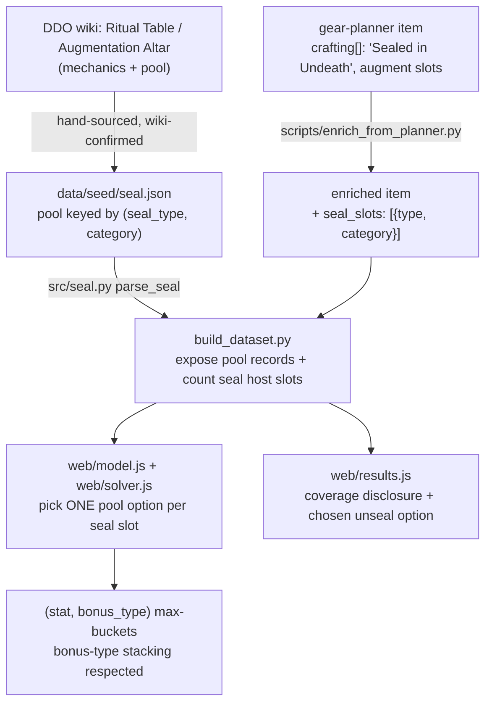

# Seal-Slot Crafting - Plan

## Goal Capsule

- **Objective:** Model DDO's "Sealed in …" upgrade slots as a category-keyed, single-pick crafting host so the solver values seal-bearing gear at its fully-upgraded affix set instead of its base stats.
- **Product authority:** The DDO Wiki is the source of truth for every mechanic and pool; the GitHub gear-planner dataset (already imported) is the source for *which items carry a seal*. Mechanics were confirmed by direct wiki audit (see Sources).
- **Execution profile:** Extends the existing gated-contribution host+pool subsystem (mirrors Viktranium). No new solver mechanic.
- **Open blockers:** None. PR #18 (base-enriched Myth Drannor/U81 items) merges independently; this work is its follow-up increment.

**Product Contract preservation:** changed R1 — generalized from "detect a `{{Sealed in X}}` wikitext marker" to "detect that an item carries a seal", because the resolved host source is the gear-planner `crafting[]` field, not a wiki template. Intent unchanged; the sourcing mechanism is recorded as KTD1. All other Product Contract text and IDs preserved.

---

## Product Contract

### Summary

Add a **seal-slot crafting host** to the enrichment + solver pipeline: an item that carries a `Sealed in X` enchantment gains a slot that contributes **exactly one** effect, chosen by the solver from a pool keyed to the item's gear category. It reuses the existing gated-contribution host+pool primitive (the same one behind Nearly-Complete and Viktranium inserts), so no new solver mechanic is required. Host detection comes from the already-imported gear-planner data; the selectable pool is added as wiki-confirmed seed data. Sealed in Undeath ships first with a fully-enumerated stat pool; the same primitive covers the rest of the seal family as their pools are harvested.

### Problem Frame

The optimizer assumes pure theoretical best-in-slot: every item is valued as if fully upgraded. Myth Drannor and Undying-Age gear carry a "Sealed in …" enchantment that, when unsealed at a crafting table, adds a chosen affix — but the enrichment pipeline never modeled it. The already-enriched Myth Drannor items (`batch12`, 196 items) went in with their base stats only; the seal was dropped. The gear-planner import (`batch14`) even reads each item's `crafting[]` field but keeps only the augment slots and discards the `"Sealed in X"` entries. The result is systematic **under-valuation**: a sealable item that should win a slot looks weaker than it is, so the solver can return a genuinely wrong "optimal" set. Closing this makes the solver's answer correct for the whole class of seal-bearing gear.

### Key Decisions

- **Model the whole seal family as one primitive, not Undeath-only** (session-settled: user-approved — chosen over Undeath-only after the wiki audit revealed a four-member family, `Sealed in Fire / Undeath / Gloom / Mist`, with mechanically identical single-pick semantics; covering all four costs almost nothing extra).
- **Reuse the existing two-keyed host+pool primitive.** A seal slot is mechanically the same choice-slot as Nearly-Complete / Viktranium — a host item drawing one option from a category-keyed pool. This is enrichment + sourcing, not solver design.
- **One effect per seal slot, mutually exclusive.** The wiki is explicit: *"adding one effect. Attempting to add another will remove the original."* The solver picks the single best pool effect per sealed item and never stacks the pool.
- **Demogorgon raid upgrade and Essence Crafting are wiki-confirmed not-applicable, not open deferrals** (session-settled: user-approved). The raid documents no seal/ritual/upgrade slot; the expansion's crafting is Catalyst (item-creation, already sourced) and universal Essence/Cannith (generic, rarely beats named BiS).
- **Merge PR #18 now; seal work is the follow-up increment** (session-settled: user-directed — chosen over holding #18 or a disclosure tag; accepts a brief window where base Myth Drannor items are under-valued).

### Requirements

**Seal detection and host tagging**

- R1. The enrichment pipeline detects that an item carries a seal and tags it as a seal host. Only some gear carries a seal; untagged items get no seal slot.
- R2. Each seal type maps to its gear category and effect pool per the wiki: Sealed in Undeath → clothing/jewelry (Ritual Table); Sealed in Fire → weapons (Ritual Table); Sealed in Gloom → item and Sealed in Mist → weapons (Augmentation Altar).

**Solver contribution**

- R3. A seal host contributes exactly one effect, chosen from its pool — single-pick and mutually exclusive. The solver must not grant more than one pool effect per seal slot.
- R4. The chosen seal effect flows through the existing gated-contribution primitive into the `(stat, bonus_type)` max-buckets, honoring bonus-type stacking exactly like the current craftable inserts.
- R5. Sealed in Undeath's pool is the Ritual Table clothing/jewelry set: one of Strength, Constitution, Dexterity, Intelligence, Wisdom, or Charisma at +15, +7 Insightful, or +3 Quality.

**Coverage and provenance**

- R6. The primitive covers all four seal types uniformly. Sealed in Undeath ships with its pool fully enumerated; Fire, Gloom, and Mist reuse the same host+pool mechanism once their pools are harvested.
- R7. Strict provenance holds: every pool effect is wiki-sourced with committed raw evidence, and any unmapped or ambiguous effect is recorded, never guessed.

### Acceptance Examples

- AE1. Seal contributes one effect, gated by the host.
  - **Covers R1, R3.** Given a Trinket with a `Sealed in Undeath` crafting entry and a build ranking Constitution first, when the solver runs, then it unseals a single Constitution effect for that item and adds no second effect from the same slot.
- AE2. Untagged item gets no seal.
  - **Covers R1.** Given a clothing item with no seal entry, when the solver runs, then it grants no seal effect — guarding against over-valuing non-sealable gear.
- AE3. Single-pick respects bonus-type stacking.
  - **Covers R3, R4, R5.** Given a build already capped on Constitution enhancement from another source, when the solver evaluates a Sealed in Undeath host, then it may pick the Insightful +7 or Quality +3 tier or a different stat — whichever best serves the ranked targets — but still only one effect.

### Scope Boundaries

**Deferred for later**

- Enumerating the Fire, Gloom, and Mist pools. The shared mechanism and host detection ship now; those pools are harvested as follow-on seed additions.

**Outside this work (wiki-confirmed not-applicable)**

- Demogorgon raid upgrade choice-slot — the wiki documents no such mechanic. The raid drops named gear sourced normally; Catalyst Crafting creates items (already handled).
- Essence Crafting (the Cannith Crafting rename) — a universal craft-your-own-item system whose generic Enhancement affixes rarely beat named best-in-slot.

---

## Planning Contract

### Key Technical Decisions

- KTD1. **Source seal hosts from the gear-planner data, not a per-item wiki crawl** (session-settled: user-directed — chosen over a wiki host-harvest: the data is already in the repo). Two representations must both be read: `Sealed in Undeath` (9), `Sealed in Mist` (18), and `Sealed in Gloom` (4) appear in each item's `crafting[]` array; `Sealed in Fire` (66) and `Sealed in Amber` (8) appear in `affixes[]` as `{type:"Bool"}` markers that `affix_to_string` currently drops. `scripts/enrich_from_planner.py` reads `crafting[]` at line ~77 (keeping augment slots, discarding seal entries) but does not scan `affixes[]` for seals — detection must cover both. Two reachability gaps that U1 must close, both verified against the data: (a) the 9 Undeath hosts carry `quests: ["Threats Old and New"]`, which is absent from `QUEST_MAP["mythdrannor"]`, so the planner's quest filter (`enrich_from_planner.py:117`) skips all of them today; (b) those 9 items appear in no enriched batch — they live only in the base seed. The gear-planner `slot`/`type` supplies the category that keys the pool (R2). Implements R1.
- KTD2. **Add the pool as new wiki-confirmed seed data.** The gear-planner supplies hosts; the wiki supplies the selectable pool the gear-planner omits ("add data where missing affixes for the slots" + "wiki confirmation on mechanics"). New `data/seed/seal.json` mirrors `data/seed/viktranium.json`. Implements R2, R5, R7.
- KTD3. **Reuse the gated-contribution host+pool primitive.** Add `src/seal.py` (pool parser) and a `seal_slots` host field mirroring `src/viktranium.py` and the `lamordia_slots` field. No new solver mechanic. Implements R3, R4.
- KTD4. **Single-pick per seal slot** — the solver selects one pool option per seal host, mirroring the Nearly-Complete / Viktranium select-one. Implements R3 (wiki-confirmed mutual exclusivity).
- KTD5. **Ship the mechanism covering all four seal types; enumerate Undeath now, stub Fire/Gloom/Mist.** Implements R6.
- KTD6. **Produce a wiki mechanics-confirmation provenance record and commit raw wiki evidence**, per the project's strict-provenance contract. Implements R7.

### High-Level Technical Design

The seal slot threads through the same five stages as Viktranium, roughly one stage per unit:

The diagram is authoritative for data flow; per-unit Files sections are authoritative for what each unit touches.

### Assumptions

- The gear-planner data is a reliable host-set source for established Myth Drannor content once the QUEST_MAP reachability gap (U1) is closed. It lists **9** Sealed-in-Undeath items; because that community dataset can lag, U6 cross-checks the host-set count against the wiki rather than assuming 9 is complete.
- The Ritual Table "Sealed in Undeath clothing / jewelry" pool is uniform across those items (a single flat wiki list), not per-item.

### Sequencing

U1 (host detection) and U2 (pool seed + parser) are independent and can land in either order. U3 wires U2's pool into the build and consumes U1's host field. U4 consumes U3's dataset. U5 depends on U4. U6 (provenance) can proceed in parallel but must land before the pool data is considered trustworthy.

---

## Implementation Units

### U1. Detect seal hosts from the gear-planner data and make them reachable

- **Goal:** Recognize `"Sealed in X"` seals in the gear-planner data, attach a `seal_slots` host marker, and ensure the seal-bearing items actually flow through the import (they are excluded today).
- **Requirements:** R1, R2 (category from item slot/type). Implements KTD1.
- **Dependencies:** none.
- **Files:** `scripts/enrich_from_planner.py` (the `crafting[]` loop at line ~77 and `affix_to_string` in `build_record`; the `QUEST_MAP` and the quest filter at line ~117), regenerated enriched planner batch files, a new `tests/test_seal.py`.
- **Approach:** Detect seals from **both** representations: seal entries in `crafting[]` (Undeath/Mist/Gloom) and `{type:"Bool"}` seal affixes in `affixes[]` (Fire/Amber). A matched seal resolves `(seal_type, category)` — seal_type from the name, category from the item's normalized `slot`/`type` — and appends to a new `seal_slots` list, mirroring the `lamordia_slots` shape; augment-slot `crafting[]` entries still flow to `augment_slots`. **Close the reachability gap (verified):** the 9 Undeath hosts carry `quests: ["Threats Old and New"]`, which `QUEST_MAP["mythdrannor"]` omits, so the quest filter skips them — add that quest grouping to `QUEST_MAP` (a new key or extending the Myth Drannor entry) so the planner reaches them. These items live only in the base seed today; the `QUEST_MAP` fix routes them through the planner import. (Fallback if the planner path proves insufficient: add a base-seed seal-detection path mirroring `src/viktranium.py::parse_base_lamordia`, which the plan otherwise does not replicate.) Re-run the planner import to regenerate the enriched batch files.
- **Patterns to follow:** the `lamordia_slots` host marker in `src/enrich.py` (`build_item_record`); category normalization in `src/viktranium.py::normalize_category`; the base-seed marker path `src/viktranium.py::parse_base_lamordia`.
- **Test scenarios:**
  - Covers AE1. A gear-planner item with `crafting: ["Sealed in Undeath", "Green Augment Slot"]` yields one `seal_slots` entry `(Undeath, <jewelry/clothing category>)` with the augment slot still captured.
  - Covers AE2. An item with no seal in `crafting[]` or `affixes[]` yields no `seal_slots` field.
  - A `Sealed in Fire` item (Bool affix in `affixes[]`) yields a `seal_slots` entry keyed to the weapon category — proving the `affixes[]` path, since Fire is not in `crafting[]`.
  - Reachability: after the `QUEST_MAP` fix, the Myth Drannor planner import produces a non-zero Undeath seal-host count (the 9 known items), not zero.
  - An unknown `Sealed in <Y>` name is recorded as unmapped (strict provenance), not silently dropped.
- **Verification:** the regenerated enriched batch carries `seal_slots` on the 9 Undeath hosts (and the Fire/Mist/Gloom hosts); the planner import prints a non-zero seal-host count.

### U2. Add the wiki-confirmed seal pool seed and parser

- **Goal:** Provide the selectable pool the gear-planner omits, as wiki-confirmed seed data with a parser mirroring Viktranium.
- **Requirements:** R2, R5, R6, R7. Implements KTD2, KTD3, KTD5.
- **Dependencies:** none.
- **Files:** `data/seed/seal.json` (new), `src/seal.py` (new), `tests/test_seal.py`.
- **Approach:** `data/seed/seal.json` holds the pool keyed by `(seal_type, category)`. Undeath/clothing-jewelry is fully enumerated from the Ritual Table: the six ability scores at +15, at +7 Insightful, and at +3 Quality. Fire/Gloom/Mist entries exist as empty/stub pools with a note. `src/seal.py` exposes `parse_seal(seed)` returning `{records, coverage}` and a `normalize_category`, mirroring `src/viktranium.py::parse_viktranium` / `parse_pools`.
- **Patterns to follow:** `src/viktranium.py` public API (`parse_viktranium`, `parse_pools`, `normalize_category`, `SLOT_TYPES`); `data/seed/viktranium.json` structure.
- **Test scenarios:**
  - Covers R5. The Undeath clothing/jewelry pool parses to 18 options (6 stats × 3 bonus tiers) with the correct `(stat, bonus_type, value)` for each tier.
  - A stubbed Fire/Gloom/Mist pool parses to zero options without error and is reported in coverage.
  - An ambiguous or magnitude-less pool line is quarantined, never guessed.
- **Verification:** `parse_seal` returns the enumerated Undeath pool and a coverage summary; the "+15 / +7 Insightful / +3 Quality" tiers bucket to distinct bonus types.

### U3. Wire the seal pool into the dataset build

- **Goal:** Load the seal seed, expose its pool records, and count seal host slots for coverage disclosure.
- **Requirements:** R6, R7.
- **Dependencies:** U1, U2.
- **Files:** `build_dataset.py`, `tests/run_tests.py` suite.
- **Approach:** In `build_dataset.py::build`, load `data/seed/seal.json` via `src.seal`, expose `seal` pool records in the dataset, and count `seal_slots` hosts into the coverage block — mirroring the Viktranium wiring (`load_vik_seed`, `vik_mod.parse_viktranium`, `vik_host_slots`, the `viktranium` dataset key). (A `{{Sealed in X}}` wikitext-template handler in `src/enrich.py` is intentionally **not** added: no wiki-harvested sealed items enter the pipeline today, so it would have zero consumers; defer it until such items exist, per KTD1's gear-planner sourcing decision.)
- **Patterns to follow:** the Viktranium wiring in `build_dataset.py` (lines ~66, ~138, ~162, ~188).
- **Test scenarios:**
  - The built dataset exposes the seal pool records and a `seal_slots` host count.
  - Coverage disclosure reports seal hosts and pool completeness (Undeath optimized; Fire/Gloom/Mist pending).
- **Verification:** `python3 build_dataset.py` reports a non-zero seal-host count and the seal pool in the dataset.

### U4. Solver consumption — single-pick from the category pool

- **Goal:** Have the solver pick exactly one pool option per seal host and feed it into the objective buckets.
- **Requirements:** R3, R4. Implements KTD3, KTD4.
- **Dependencies:** U3.
- **Files:** `web/model.js`, `web/solver.js`, `tests/model.test.js`, `tests/solver.test.js`.
- **Approach:** Mirror the Viktranium/`lamordia_slots` consumption: for each equipped seal host, expose its `(seal_type, category)` pool at the host's tier, add a select-one choice over that pool to the model, and feed the chosen option into the `(stat, bonus_type)` max-buckets with the existing `dominates()` guard. Enforce one option per seal slot.
- **Patterns to follow:** the `lamordia_slots` / Viktranium pool consumption in `web/model.js` and `web/solver.js`.
- **Test scenarios:**
  - Covers AE1. A Sealed-in-Undeath host with a Constitution-first target selects one Constitution effect and no second seal effect.
  - Covers AE3. With Constitution enhancement already capped elsewhere, the solver selects a different bonus tier or stat from the pool, still one option.
  - Covers R4. The chosen effect stacks correctly by bonus type against other sources (enhancement vs Insightful vs Quality).
  - A build with two seal hosts gets one pick each, independently optimized.
- **Verification:** the solver test suite proves a seal host reaches the objective and single-pick holds; an end-to-end real-dataset case selects a seal option for a Myth Drannor item.

### U5. Results disclosure — surface the chosen unseal option

- **Goal:** Show seal-slot coverage and the solver's chosen unseal option in the build sheet, consistent with existing coverage disclosure.
- **Requirements:** R6, R7.
- **Dependencies:** U4.
- **Files:** `web/results.js`, `web/browse.js`, `tests/results.test.js`, `tests/browse.test.js`.
- **Approach:** Render the prescribed unseal choice per seal host in results (mirroring how augment-in-slot and Viktranium picks are shown), and disclose Fire/Gloom/Mist as pending pools so results stay honest about coverage. Browse view marks seal hosts.
- **Patterns to follow:** the Viktranium/augment disclosure in `web/results.js`; coverage-note rendering already tested in `tests/results.test.js`.
- **Test scenarios:**
  - A result including a Sealed-in-Undeath host shows its chosen unseal option.
  - Coverage note discloses Undeath as optimized and Fire/Gloom/Mist as pending once hosts exist.
  - Browse marks a seal host, solver-included.
- **Verification:** browser pass shows the unseal option in a real build sheet; results tests green.

### U6. Wiki mechanics-confirmation provenance record

- **Goal:** Document the seal-family mechanics confirmed from the wiki and commit raw wiki evidence, so the pool seed is authoritative under strict provenance; cross-check the host-set count.
- **Requirements:** R7. Implements KTD6.
- **Dependencies:** none (parallel), lands before pool data is trusted.
- **Files:** `docs/gear-and-crafting-assessment.md` (extend) or a new `docs/seal-slot-mechanics.md`, `data/seed/compendium/raw/seal_mechanics.json` (raw wiki evidence).
- **Approach:** Record the confirmed mechanics: the four seal types, their tables (Ritual Table for Fire/Undeath, Augmentation Altar for Gloom/Mist), category keying (Undeath = clothing/jewelry, Fire = weapons), the single-pick "one effect, replacing the original" rule, and the Undeath pool. Note explicitly that a fifth gear-planner string, `Sealed in Amber`, is **excluded** — it is Ravenloft "The Vampire Hunters" quest content (wiki-confirmed), not a stat-choice seal in this family. Commit the raw wiki `Unique_enchantment` and Ritual Table extracts as provenance. Cross-check the gear-planner's 9 Undeath hosts against the wiki and note any delta.
- **Patterns to follow:** `docs/gear-and-crafting-assessment.md`; the committed-raw provenance contract used for other batches.
- **Test scenarios:** `Test expectation: none -- documentation/provenance unit, no runtime behavior.`
- **Verification:** the mechanics record and raw evidence are committed; the host-set cross-check delta is recorded.

---

## Verification Contract

| Gate | Command | Applies to |
|---|---|---|
| Dataset builds | `python3 build_dataset.py` | U1, U2, U3 |
| Python suite (incl. new `tests/test_seal.py`) | `python3 tests/run_tests.py` | U1, U2, U3 |
| JS suites | `node tests/model.test.js && node tests/solver.test.js && node tests/results.test.js && node tests/browse.test.js` | U4, U5 |
| Browser pass | serve `web/` on localhost, confirm a Sealed-in-Undeath item's unseal option appears in a build sheet | U4, U5 |

## Definition of Done

- Seal hosts are detected from both gear-planner representations (`crafting[]` for Undeath/Mist/Gloom, `affixes[]` Bool for Fire), the planner quest filter is extended so the 9 Undeath hosts are reached instead of skipped, and the regenerated enriched items carry `seal_slots` (U1).
- The Undeath pool is wiki-confirmed seed data and solver-active; Fire/Gloom/Mist stubs exist under the same primitive (U2, U3).
- The solver picks exactly one pool option per seal host, stacking correctly by bonus type (U4).
- Results disclose the chosen unseal option and the pending pools (U5).
- The wiki mechanics-confirmation record and raw evidence are committed, and the Undeath host-set count is cross-checked against the wiki (U6).
- `python3 build_dataset.py`, the Python suite, and the JS suites are green.
- Real Myth Drannor clothing/jewelry items that carry Sealed in Undeath are now valued with their best unseal option instead of base stats only.

---

## Outstanding Questions (Deferred to Planning-time verification)

- Confirm the bonus type each pool tier maps to (bare "+15", "+7 Insightful", "+3 Quality") so the solver buckets them correctly. The existing affix parser canonicalizes bare stat bonus types; U2 verifies the seal pool strings parse to the intended buckets against a wiki example.
- Whether Gloom/Mist (Augmentation Altar) reuse the Ritual Table seals' enrichment path or need a separate altar-keyed pool source (resolved when those pools are harvested).

## Sources / Research

- DDO Wiki (authority): `Sealed in Undeath`, `Sealed in Fire`, `Sealed in Gloom`, `Sealed in Mist`, `Ritual Table`, `Essence Crafting`, `Catalyst Crafting`, `Terror of Demogorgon (Legendary)`.
- Host source: `data/seed/compendium/raw/gearplanner_items.json` — `Sealed in Undeath` (9), `Sealed in Mist` (18), and `Sealed in Gloom` (4) appear in items' `crafting[]` arrays; `Sealed in Fire` (66) and `Sealed in Amber` (8) appear in `affixes[]` as `{type:"Bool"}` markers. The 9 Undeath items carry `quests: ["Threats Old and New"]` (relevant to the QUEST_MAP fix in U1).
- Mirror subsystem: `src/viktranium.py`, `data/seed/viktranium.json`, and the Viktranium wiring in `build_dataset.py`; the `lamordia_slots` host marker in `src/enrich.py`; the gear-planner ingestion `scripts/enrich_from_planner.py` (`crafting[]` loop at line 77).
- Current state: `data/seed/compendium/enriched_batch12_myth_drannor.json` — 196 Myth Drannor items enriched without seal slots.
