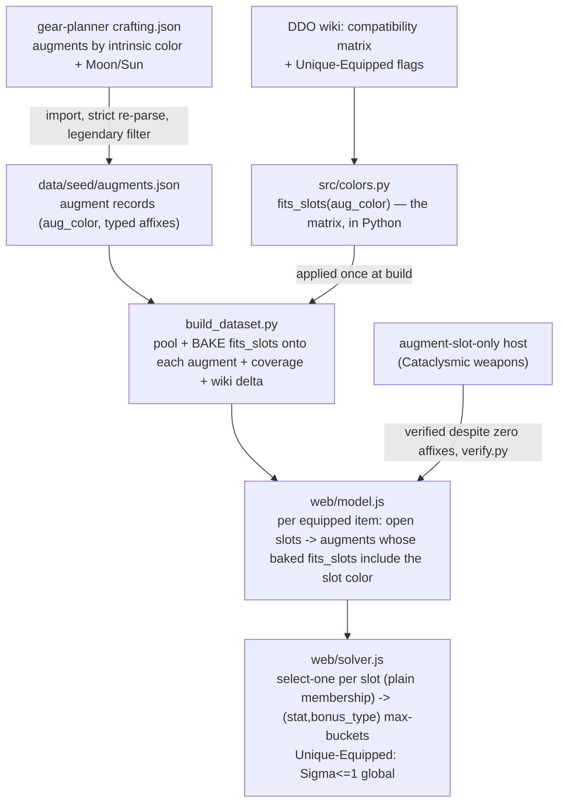

# Augment Color-Compatibility Rework - Plan

## Goal Capsule

- **Objective:** Model augments by DDO's real slot-compatibility rules, source the legendary augment pool (colored + Lunar/Solar), and value augment-slot-only hosts — so endgame gear like the Legendary Cataclysmic weapons is optimized instead of quarantined, and every build's augment optimization becomes correct.
- **Product authority:** The DDO Wiki is the source of truth for the color-compatibility matrix, the typed-bonus stacking rule, and the new-content cross-check; the gear-planner `crafting.json` is the augment pool source.
- **Execution profile:** Replaces the solver's exact-color aggregate-capacity augment model with per-slot compatible choice-slots — the same gated select-one primitive already used for seal / Viktranium / Nearly-Complete. Core-solver change.
- **Open blockers:** None.

**Product Contract preservation:** changed R2 — the wiki confirms augment bonuses are typed and feed the standard `(stat, bonus_type)` buckets (same-type doesn't stack), so the "uses each augment at most once" clause is dropped: the bucket-max makes reuse harmless, and only Unique-Equipped augments are constrained to one placement. All other Product Contract text and IDs preserved.

---

## Product Contract

### Summary

Rework colored-augment modeling to DDO's real compatibility rules (a secondary slot accepts its two component primaries + its own color + Colorless; a Colorless augment fits every colored slot), source the **legendary** augment pool (colored + Lunar/Solar) from the gear-planner cross-checked against the wiki, and value augment-slot-only hosts. Augment slots become typed choice-slots the solver fills per-slot, like the seal / Viktranium slots already do; typed-bonus stacking is handled by the existing max-buckets.

### Problem Frame

The optimizer's augment model is wrong three ways. First, it matches augment color to slot color **exactly** (`src/colors.py` + the per-color capacity constraint in `web/solver.js`) — but in DDO a secondary slot accepts its two component primaries plus Colorless, and a Colorless augment fits every colored slot, so the solver misses most legal placements. Second, the augment pool is **49 incidental base-seed augments** (no Orange, no Lunar/Solar, mostly heroic ML) — nowhere near the real endgame set. Third, an item whose only value is its augment slots (the Legendary Cataclysmic weapon line: just Orange + Purple slots, no base affix) has no verifiable affix, so the verify gate **quarantines it** and its slot capacity is lost. Net: endgame augment optimization is both incorrect and incomplete. This is quarantine "case A" — the ~240 augment-slot-only ML29+ variants currently excluded.

### Key Decisions

- **Model augment slots as per-slot typed choice-slots, replacing the exact-match aggregate-per-color model** (session-settled: user-directed — chosen over patching the current model: multi-fit makes placement a compatible-augment-per-open-slot problem the aggregate-per-color capacity can't express).
- **Compatibility comes from the wiki matrix, not assumption** (session-settled: user-directed). Sourced 2026-07-26 from the DDO Wiki `Augment Slot` page (rows = slot, columns = the augment colors it accepts):

  | Slot | accepts augment colors |
  |---|---|
  | Colorless | Colorless |
  | Red / Blue / Yellow (primary) | own color, Colorless |
  | Purple (Red+Blue) | Red, Blue, Purple, Colorless |
  | Orange (Red+Yellow) | Red, Yellow, Orange, Colorless |
  | Green (Blue+Yellow) | Blue, Yellow, Green, Colorless |
  | Moon (Lunar) | Moon |
  | Sun (Solar) | Sun |

- **Augment bonuses are typed; typed non-stacking is handled by the existing buckets, so there is no used-once constraint** (session-settled: user-directed, wiki-confirmed — augments feed the same `(stat, bonus_type)` max-buckets as equipment, so two same-type augments can't double-count and the solver spreads different bonus types across slots; only **Unique-Equipped** augments are constrained to a single placement).
- **Legendary augment pool sourced from the gear-planner `crafting.json`, cross-checked against the wiki** (session-settled: user-directed). The gear-planner stores ~1,000 augments keyed by **intrinsic** color (Red 185, Blue 151, Yellow 149, Colorless 263, Green 16, Orange 8, Purple 5, Moon 77, Sun 146) — **not** compatibility-expanded — so the wiki matrix is layered on top. The gear-planner is the base; the wiki catches augments new DDO content added that the gear-planner lags on.
- **Value augment-slot-only hosts** by admitting them past the verify gate the way Dinosaur Bone blanks are (session-settled: user-approved — closes quarantine case A).
- **Lunar/Solar (Moon/Sun) ride the same per-slot machinery** with exact-match compatibility (Moon→Moon, Sun→Sun) — no separate code path; the wiki confirms they don't cross-fit with colored augments.
- **Legendary first; heroic deferred** (session-settled: user-directed).

### Requirements

**Compatibility model**

- R1. A colored augment slot accepts an augment per the wiki matrix above: a secondary slot accepts its two component primaries, its own color, and Colorless; a primary slot accepts its own color and Colorless; a Colorless slot accepts Colorless only; and a Colorless augment fits every colored slot.
- R2. The solver places at most one augment per open slot; augment contributions feed the `(stat, bonus_type)` max-buckets, so same-type augments don't stack (the bucket takes the highest) and no used-once constraint applies. Augments flagged Unique-Equipped are constrained to a single placement.
- R3. Lunar (Moon) and Solar (Sun) slots draw only from their own augment pools and never interact with colored augments or slots.

**Pool sourcing**

- R4. The legendary augment pool (colored + Lunar/Solar) is sourced from the gear-planner `crafting.json` augment lists, keyed by intrinsic augment color, filtered to legendary minimum level.
- R5. The sourced pool is cross-checked against the DDO Wiki; augments the wiki lists that the gear-planner omits are surfaced as a new-content gap, never silently dropped.
- R6. Only augments whose effect parses to a solver-eligible, correctly-typed affix enter the solver; unparseable augments (procs, clickies, dice) are recorded, never guessed (strict provenance, as with the item import).

**Host valuation**

- R7. An item whose only value is its augment slots (no verifiable base affix) is admitted to the solver so its open slots contribute — it is no longer quarantined out.

### Acceptance Examples

- AE1. Multi-fit placement.
  - **Covers R1, R2.** Given an item with an open Orange slot and a build ranking a stat supplied only by a Red augment, when the solver runs, then it places that Red augment in the Orange slot.
- AE2. Colorless fits any colored slot.
  - **Covers R1.** Given the best option for a target is a Colorless augment and the only open slot is Blue, the solver places the Colorless augment in the Blue slot.
- AE3. Typed non-stacking across two slots.
  - **Covers R2.** Given two open compatible slots and a target stat, the solver fills them with two **different-bonus-type** augments (e.g. Enhancement + Insightful of that stat) which stack, rather than two same-type augments (which would not).
- AE4. Slot-only host is optimized, not quarantined.
  - **Covers R7.** Given a Legendary Cataclysmic weapon (only Orange + Purple slots, no base affix) is the best Main Hand for filling those slots with target-advancing augments, the solver equips it and prescribes the augments.
- AE5. Lunar/Solar don't cross-fit.
  - **Covers R3.** A colored augment is never placed in a Moon or Sun slot, and vice versa.

### Scope Boundaries

**Deferred for later**
- Heroic augments (legendary pool first).
- The Fire/Gloom/Mist seal pools and other pending crafting (unrelated increments).

**Outside this work**
- Green Steel, Slave Lords, and Dinosaur Bone special augment slots — separate systems with their own slots (Dino already modeled; the others out of scope).
- The 7 proc/dice/clicky quarantine items (case B) — no parseable magnitude; correctly excluded.

---

## Planning Contract

### Key Technical Decisions

- KTD1. **Per-slot typed choice-slots replace the exact-color aggregate-capacity constraint.** Each open augment slot on an equipped item becomes an independent select-one over the augments compatible with its color; feeds the `(stat, bonus_type)` buckets. Mirrors the seal / Viktranium blocks in `web/solver.js`, replacing the `augByColor` capacity constraint. Implements R1, R2. (session-settled: user-directed — the "like lamordia" shape.)
- KTD2. **Compatibility is a slot-color → accepted-augment-color lookup** (the wiki matrix above), owned in **one place, Python** (`src/colors.py`). Because the solver runs in the browser (JS), a Python function can't be called at solve time — so the **build bakes each augment's compatible slot-color set into its record** (applying the matrix once at build time). The JS solver then does plain set-membership per slot (slot color ∈ the augment's baked `fits_slots`), and the matrix never crosses into JS. Colored slots use the matrix; Moon/Sun map to themselves. Implements R1, R3. (session-settled: user-directed.)
- KTD3. **Typed non-stacking is free — no used-once constraint.** Augment affixes carry their bonus type; the existing bucket-max makes duplicate same-type augments non-additive, so the solver spreads bonus types across slots on its own. Only Unique-Equipped augments get a global `Σ placement ≤ 1`. Implements R2. (session-settled: user-directed, wiki-confirmed.)
- KTD4. **Pool sourced from `crafting.json` into a new seed, re-parsed strictly.** A new import reads the colored + Moon/Sun slot keys, emits augment records (`category: "augment"`, `aug_color` = intrinsic color from the slot key, affixes re-parsed through this repo's parser carrying their bonus types), filtered to legendary ML. On base-seed name collision, the richer sourced record wins. Implements R4, R6. (session-settled: user-directed.)
- KTD5. **Augment-slot-only host admission mirrors the Dino-blank workaround** — a host whose only value is augment slots is admitted after the verify pass so its slots contribute, exactly as `dino_blanks` are appended post-verify in `build_dataset.py`. Implements R7. (session-settled: user-approved.)
- KTD6. **Wiki cross-check is a reported delta, not a silent merge** — R5 surfaces wiki augments absent from the gear-planner as a coverage disclosure; it does not fabricate augment values.

### High-Level Technical Design

The bucket-max (unchanged) does the stacking; the new work is the per-slot pool built from the compatibility matrix, the sourced pool, and host admission.

### Assumptions

- The gear-planner `crafting.json` augment affixes carry usable bonus types (verified: Colorless "Diamond of Balance" is `Competence`, colored augments carry Enhancement/Insightful/Quality/etc.). Augments whose affix doesn't parse to a typed magnitude are quarantined (R6).
- Normal colored + Lunar/Solar augments are craftable multiples with no per-character uniqueness (wiki-confirmed; the unique-augment note covers separate systems). Unique-Equipped is a per-augment flag applied only where the source marks it.
- The compatibility matrix is stable (sourced 2026-07-26).

### Sequencing

U1 (pool source) and U2 (compatibility matrix) are independent. U5 needs U1 and U2 — it bakes U2's matrix onto U1's pool. U3 (solver rework) needs U5 (it reads the baked `fits_slots`, never the Python matrix). U4 (host admission) is independent of U3 but both must land before an augment-slot-only host is optimized end-to-end. U6 (results) needs U3.

---

## Implementation Units

### U1. Source the legendary augment pool from the gear-planner `crafting.json`

- **Goal:** Import the colored + Lunar/Solar augments from the gear-planner into a strict, re-parsed augment seed, keyed by intrinsic color, filtered to legendary.
- **Requirements:** R4, R6. Implements KTD4.
- **Dependencies:** none.
- **Files:** `scripts/import_augments.py` (new), `data/seed/augments.json` (new) + committed raw `data/seed/compendium/raw/gearplanner_crafting.json`, `tests/test_augments.py` (new).
- **Approach:** First **acquire the source** — `crafting.json` is not yet in this repo (only `gearplanner_items.json` is): download `site/src/assets/crafting.json` from the `illusionistpm/ddo-gear-planner` GitHub repo and commit it as `data/seed/compendium/raw/gearplanner_crafting.json` (mirroring how `gearplanner_items.json` was committed). Then read its `<Color> Augment Slot` / `Moon Augment Slot` / `Sun Augment Slot` keys; for each augment under a key, emit a record `{name, category:"augment", aug_color:<intrinsic color from the key>, affixes, minimum_level}` with affixes converted from the planner's `{name,type,value}` and re-parsed through this repo's strict `affix_parser` (mirror `scripts/enrich_from_planner.py::affix_to_string`), carrying the bonus type. Filter to legendary ML. Carry a `unique_equipped: true` flag when the source marks it. Skip augments with no parseable typed affix (record as unmapped).
- **Patterns to follow:** `scripts/enrich_from_planner.py` (affix conversion + strict re-parse + committed raw + regeneration contract).
- **Test scenarios:**
  - A Colorless "Diamond" augment yields a record with `aug_color: "Colorless"` and a typed affix (e.g. Competence).
  - A Red augment under "Red Augment Slot" yields `aug_color: "Red"`.
  - Moon/Sun augments yield `aug_color: "Moon"/"Sun"`.
  - An augment whose affix is a Bool/proc (no magnitude) is recorded unmapped, not emitted.
  - Only ML >= legendary threshold augments are emitted.
- **Verification:** `data/seed/augments.json` contains legendary augments across all colors + Moon/Sun with typed affixes; the import prints per-color counts.

### U2. Encode the wiki color-compatibility matrix

- **Goal:** A single Python source of truth for the matrix, plus the inverse helper the build uses to bake each augment's compatible slot-colors.
- **Requirements:** R1, R3. Implements KTD2.
- **Dependencies:** none.
- **Files:** `src/colors.py` (extend — the matrix colocates with the canonical color set it keys off; no new module), `tests/test_colors.py` (extend).
- **Approach:** Extend `src/colors.py` with `accepts(slot_color) -> set(augment_colors)` implementing the matrix (primary → own + Colorless; secondary → two component primaries + own + Colorless; Colorless → Colorless; Moon → Moon; Sun → Sun), a `fits(augment_color, slot_color)` helper, and the **inverse `fits_slots(augment_color) -> set(slot_colors)`** (the slot colors an augment can fill) that U5 bakes onto each augment record. Keep the existing normalization as-is.
- **Patterns to follow:** `src/colors.py` canonical-color set and normalization.
- **Test scenarios:**
  - `fits("Red","Orange")` and `fits("Red","Purple")` are true; `fits("Red","Green")` is false.
  - `fits("Colorless", <any colored slot>)` is true; `fits("Colorless","Moon")` and `fits("Colorless","Sun")` are false (Colorless fits colored slots only).
  - `fits("Moon","Sun")` is false; `fits("Moon","Moon")` is true; `fits("Red","Moon")` is false.
  - `accepts("Orange")` == {Red, Yellow, Orange, Colorless}; `accepts("Green")` == {Blue, Yellow, Green, Colorless}.
  - `fits_slots("Red")` == {Red, Purple, Orange}; `fits_slots("Colorless")` == the six colored slots (not Moon/Sun); `fits_slots("Moon")` == {Moon}.
- **Verification:** the matrix and its inverse match the Key Decisions table exactly.

### U3. Rework the solver to per-slot compatible choice-slots

- **Goal:** Replace the exact-color aggregate-capacity augment constraint with per-open-slot select-one over the compatible augment pool; feed the buckets; keep typed non-stacking via bucket-max.
- **Requirements:** R1, R2, R3. Implements KTD1, KTD2, KTD3.
- **Dependencies:** U5 (which exposes the augment pool AND bakes each augment's `fits_slots` using U2's matrix — the JS solver reads that baked field, never the Python matrix).
- **Files:** `web/model.js`, `web/solver.js`, `web/query.js`, `tests/model.test.js`, `tests/solver.test.js`.
- **Approach:** In `web/solver.js`, replace the `augByColor` capacity block (the `p<i>` placement vars + per-color capacity constraint) with: for each equipped item, expand its open augment slots (from `augment_slots_norm.colors`, a per-physical-slot multiset) into individual typed slots; for each slot, a select-one over augments whose baked `fits_slots` **includes the slot's color** (plain set-membership — the compatibility was applied at build time in U5, so no matrix logic lives in JS); each option's affixes feed the `(stat, bonus_type)` buckets; `Σ n ≤ 1` per slot. Add a global `Σ ≤ 1` only for augments flagged `unique_equipped`. In `web/model.js::buildModel`, build the compatible pool and keep the dominance guard counting open slot colors (a superset of the objective surface, so a slot-only host isn't pruned). Thread through `web/query.js`.
- **Patterns to follow:** the seal / Viktranium select-one blocks in `web/solver.js` (per-slot `n`, `n - x_item <= 0`, `Σ n <= 1`); the existing augment dominance in `web/model.js`.
- **Execution note:** proof-first on the compatibility behavior — write the multi-fit and Colorless-fits-all solver tests and watch them fail against the current exact-match model before reworking.
- **Test scenarios:**
  - Covers AE1. A Red augment placed into an Orange slot when Red best advances the target.
  - Covers AE2. A Colorless augment placed into a Blue slot when it's the best option.
  - Covers AE3. Two compatible slots filled with two different-bonus-type augments (they stack); not two same-type (bucket-max).
  - Covers AE5. A colored augment is never offered to a Moon/Sun slot, and vice versa.
  - A Unique-Equipped augment is placed at most once across all slots.
  - A slot-only host's open slots generate placement options in the program (pairs with U4).
- **Verification:** the solver suite proves multi-fit, Colorless-fits-all, typed non-stacking, and Lunar/Solar isolation on synthetic and real-dataset cases.

### U4. Admit augment-slot-only hosts past the verify gate

- **Goal:** An item whose only value is augment slots reaches the solver so its slots contribute.
- **Requirements:** R7. Implements KTD5.
- **Dependencies:** none (pairs with U3 for end-to-end).
- **Files:** `src/verify.py`, `tests/test_augment_hosts.py` (new).
- **Approach:** The Cataclysmic hosts are **already in the main item pipeline** but quarantined by the verify gate for having zero solver-eligible affixes — unlike Dino blanks, which are *synthesized* from a separate seed and appended after verify (so the append pattern doesn't fit here). The implementable path is in the verify gate itself (`src/verify.py`): treat a variant that carries open augment slots as **verified despite zero affixes** — the same non-affix-worth exception the Dino blank relies on — so it survives into the solver with its `augment_slots_norm` intact and its slots contribute.
- **Patterns to follow:** the Dino-blank verified-despite-zero-affixes exception (see the `## Data trust — Verified` entry in `CONCEPTS.md`); the seal-only-host note in `docs/seal-slot-mechanics.md` (same verify-gate class).
- **Test scenarios:**
  - Covers AE4. A Legendary Cataclysmic weapon (Orange + Purple slots, no base affix) is admitted (not quarantined) and its slots reach the solver.
  - A truly value-less item (no affixes, no slots) stays quarantined.
  - An admitted slot-only host with a base-seed collision keeps its slots.
- **Verification:** the build admits augment-slot-only hosts; a Cataclysmic weapon appears as solver-eligible with its slots.

### U5. Wire the augment pool + coverage into the dataset build

- **Goal:** Load the sourced augment seed as the augment pool, **bake each augment's compatible slot-colors (the Python→JS compatibility bridge)**, expose it, and disclose coverage + the wiki cross-check delta.
- **Requirements:** R1 (bake), R4, R5. Implements KTD2 (bridge), KTD4, KTD6.
- **Dependencies:** U1, U2.
- **Files:** `build_dataset.py`, `tests/run_tests.py` suite.
- **Approach:** Load `data/seed/augments.json` and merge into the augment pool, superseding colliding base-seed augments (richer source wins). **Bake `fits_slots` onto each augment record** via `src.colors.fits_slots(aug_color)` — this applies the wiki matrix once at build time so the JS solver (U3) only does set-membership and the matrix never crosses into JS. Expose an `augment_coverage` block: counts by color incl. Moon/Sun, legendary count, and the R5 wiki cross-check delta (augments the wiki has that the gear-planner lacks). Keep affixes flowing through the same parse/verify path.
- **Patterns to follow:** the seed-load + coverage wiring for viktranium/seal in `build_dataset.py`.
- **Test scenarios:**
  - The built dataset's augment pool includes legendary colored + Moon/Sun augments (far more than the prior 49).
  - Each augment record carries a baked `fits_slots` list matching the matrix (a Red augment's = {Red, Purple, Orange}; a Colorless's = the six colored slots; a Moon's = {Moon}).
  - `augment_coverage` reports per-color counts and any wiki-only delta.
  - A base-seed augment colliding with a sourced one is deduped (sourced wins).
- **Verification:** `python3 build_dataset.py` reports the expanded augment pool and augment coverage.

### U6. Results — augment-in-slot prescription per colored slot

- **Goal:** Show which augment the solver placed in which colored slot, reflecting the per-slot model.
- **Requirements:** R1, R2 (disclosure).
- **Dependencies:** U3.
- **Files:** `web/results.js`, `tests/results.test.js`.
- **Approach:** Update the augment rendering to show the placed augment and the slot color it filled (the per-slot placement now names its slot). Keep the existing augment chip shape.
- **Patterns to follow:** the existing augment chip + the seal/Viktranium chips in `web/results.js`.
- **Test scenarios:**
  - A result with a Red augment in an Orange slot renders "Orange slot: <Red augment>".
  - A Colorless augment in a Blue slot renders correctly.
- **Verification:** browser pass shows per-slot augment prescriptions with the filled slot color.

---

## Verification Contract

| Gate | Command | Applies to |
|---|---|---|
| Augment import | `python3 scripts/import_augments.py` then `python3 build_dataset.py` | U1, U5 |
| Python suite (incl. new augment tests) | `python3 tests/run_tests.py` | U1, U2, U4, U5 |
| JS suites | `node tests/model.test.js && node tests/solver.test.js && node tests/results.test.js` | U3, U6 |
| Browser pass | serve `web/`, confirm a multi-fit placement (Red augment in an Orange slot) and a Cataclysmic weapon equipped for its slots | U3, U4, U6 |

## Definition of Done

- The legendary augment pool (colored + Lunar/Solar) is sourced from `crafting.json`, strictly re-parsed with typed affixes, and exposed in the build (U1, U5).
- The solver places augments per the wiki compatibility matrix — multi-fit and Colorless-fits-all work; Lunar/Solar don't cross-fit; typed non-stacking holds via the bucket-max; Unique-Equipped augments are singular (U3).
- Augment-slot-only hosts (the Cataclysmic weapon line) are admitted and optimized instead of quarantined (U4).
- The results surface which augment fills which slot (U6); coverage discloses the augment pool and the wiki cross-check delta (U5).
- `python3 build_dataset.py`, the Python suite, and the JS suites are green.
- Quarantine "case A" is materially reduced: augment-slot-only ML29+ items are no longer excluded.

---

## Outstanding Questions

**Deferred to planning-time verification**
- The exact legendary ML threshold (29 vs 30) and treatment of ML28 borderline augments (default: ML >= 29, matching the item pipeline).
- How the R5 wiki cross-check enumerates the wiki's legendary augment set (category pages vs the `Augment Slot` page sections) — a harvest detail, not a blocker.
- Whether any sourced augment carries a Unique-Equipped flag in the gear-planner data, or whether that flag must come from the wiki cross-check.

## Sources / Research

- DDO Wiki `Augment Slot` — the color-compatibility matrix (rows = slot color, columns = accepted augment colors), the Special-augment-slots section (Moon/Sun don't mix with colored), and the unique-augment-systems note (Green Steel / Slave Lords / Dino use separate slots). Typed-bonus stacking follows the standard DDO rule the solver already models. Sourced via Claude-in-Chrome (plain fetch returns empty for ddowiki).
- Gear-planner `illusionistpm/ddo-gear-planner`, `site/src/assets/crafting.json` — augments keyed by slot (`Red/Blue/Yellow/Orange/Green/Purple/Colorless/Moon/Sun Augment Slot`), affixes pre-parsed with types; ~1,000 augments including legendary Lunar/Solar. Verified NOT compatibility-expanded.
- Current state: `src/colors.py` (exact-match color normalization), the `augByColor` per-color capacity constraint in `web/solver.js` and the augment pool in `web/model.js`, and the 49-augment incidental pool from `data/seed/ddo_items.json`.
- Motivating context: the quarantine "case A" analysis — ~240 augment-slot-only ML29+ variants (led by the Legendary Cataclysmic weapon line) excluded because "empty augment slots" isn't verifiable value; augment optimization additionally under-counts because the exact-match model misses most legal placements.
