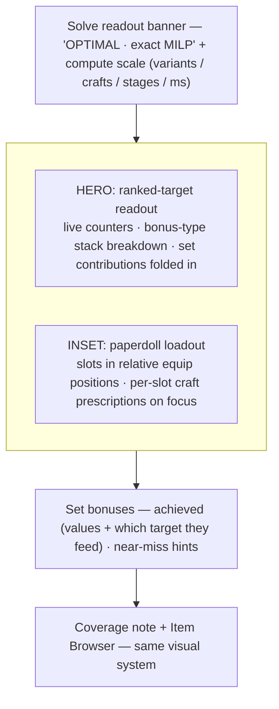

# Data-Forward UI Revamp - Plan

> **✅ SHIPPED (2026-07-26, PR #21, merge `debae94`).** This plan was executed and is live: data-forward readout hero, per-target bonus-type breakdown, paperdoll inset, OPTIMAL/compute-scale banner, responsive query/browser, mobile-first. **Followed up by [`2026-07-27-004-feat-ui-refinement-paperdoll-trust-plan.md`](2026-07-27-004-feat-ui-refinement-paperdoll-trust-plan.md)** — a next iteration on the shipped UI (tabbed item browser, uniform selectors, stepper feedback, full proof/trust panel, attribution-over-progress-bars, and upgrading the paperdoll inset to a prominent character figure).

## Goal Capsule

- **Objective:** Rebuild the optimizer's UI as a modern, data-forward system — the computed result is the hero (live ranked-target readout with bonus-type + set breakdowns), the loadout renders as a paperdoll, and the whole page shares one cohesive visual system — so the tool reads as the exact-optimization engine it actually is.
- **Product authority:** The user, via a visual sketch (Option C selected) and the scoping dialogue. Presentation only — the solver and data model are the authority for values, unchanged.
- **Open blockers:** None.

---

## Product Contract

### Summary

Give the optimizer a full data-forward facelift. The ranked-target readout becomes the primary surface — big live counters, each value broken down by bonus-type stack with set-bonus contributions highlighted and folded in — and the chosen loadout renders as a paperdoll (equipment slots in their relative character-screen positions) as a supporting inset. A cohesive visual system spans the whole page, including a reworked query panel. The "complex calculations" feel comes from real substance (exact-optimal MILP framing + a compute-scale readout) plus brief, tasteful motion — never fake slowness.

### Problem Frame

The current UI is a dark, plain **table** layout — an "Achieved (priority order)" table, a "Loadout" table (Slot / Item / ML / Contributes), a coverage note, and an item browser. It works, but it reads like a spreadsheet, not like the exact integer-program solver underneath it: the sophistication (provably-optimal, bonus-type stacking, staged lexicographic solve, crafting prescriptions) is invisible, the loadout is a flat list with no spatial intuition, and set bonuses aren't visibly tied to the ranked targets they advance. The result under-sells a genuinely powerful engine and makes the loadout harder to read than a character screen.

### Key Decisions

- **Data-forward layout (Option C): the computed readout is the hero, the paperdoll a supporting inset** (session-settled: user-directed via the visual probe — chosen over paperdoll-hero (A) and balanced-dashboard (B)).
- **The data-powered feel is substance + light motion, not solve-theater** (session-settled: user-directed — chosen over animating the staged solve stage-by-stage: the solve is genuinely sub-100ms, so honesty wins; motion is polish, never a fake progress gate).
- **Whole-app facelift with a shared visual system** (session-settled: user-directed — chosen over results-only: the query panel and every surface read as one system).
- **Presentation only — no solver or data-model change** (session-settled: user-approved). The UI consumes the solver's existing output.
- **Keep the near-miss set hints** (session-settled: user-approved).

### Requirements

**Data-forward results readout**

- R1. The ranked targets are the primary surface: a live counter per target shows the achieved value in strict priority order.
- R2. Each target value breaks down by bonus-type stack (e.g. Enhancement / Insightful / Quality), showing how the total is composed.
- R3. On solve, values briefly animate (count up) and a compute-scale readout shows what the engine did — variant count, crafts considered, lexicographic stages, solve time — framed as provably optimal (exact MILP, not a heuristic). Motion is brief and never delays or gates showing the final result.

**Paperdoll loadout**

- R4. The chosen loadout renders as a paperdoll: each equipped item sits in a slot placed in its relative character-equipment position (helmet, goggles, necklace, trinket, cloak, belt, two rings, gloves, bracers, boots, armor, main hand, off hand / rune arm, quiver), as a supporting inset to the readout.
- R5. Each occupied slot surfaces its item and, on focus/expand, the full per-slot detail — contributing affixes and every crafting prescription the solver emits for it (augment-in-slot with color, seal unseal, Dino insert, Nearly-Complete, Viktranium). Empty or target-irrelevant slots read as empty.

**Set bonuses**

- R6. Achieved set bonuses are listed with their stat values (set name, piece count, and the stats they grant).
- R7. Where an achieved set's stats match a ranked target, its contribution is folded into that target's achieved value and attributed in the target's breakdown ("+2, set: <name>").
- R8. Near-miss set hints remain: a set close to a threshold surfaces how many more pieces are needed and what it would add to which ranked target.

**Visual system**

- R9. A cohesive visual system (typography, spacing, color roles, component styles, states) applies across the whole page — query panel, results readout, paperdoll, set bonuses, coverage note, and item browser read as one system.
- R10. The query/input panel (targets, ML cap, class/race, armor type, weapon setup, ranked priority list) is reworked to match the system while preserving its current inputs and behavior.

**Mobile-friendly (added by user directive — first-class, not an afterthought)**

- R11. The whole page is usable and legible on a phone (target 360–430px wide): no horizontal page scroll, fluid layout, text stays readable without pinch-zoom, and every interactive control (buttons, rank arrows/delete, inputs, paperdoll slots) has a touch target of at least 44×44px. The readout counters stack, the paperdoll reflows to a compact single-column arrangement, and wide tables (item browser) become cards or a contained horizontal-scroll region — never a source of page overflow.

**Quality (added by user directive)**

- R12. New presentation logic that is non-trivial and pure (per-target breakdown/attribution derivation, paperdoll slot mapping, set-fold) is unit-tested. The build is verified end-to-end in a real browser at both a phone viewport and a desktop viewport before it ships.

### Acceptance Examples

- AE1. Set folds into a ranked target.
  - **Covers R6, R7.** Given a build achieving a set that grants +2 Constitution and Constitution is ranked #1, when results render, then the Constitution counter includes the +2 and its breakdown attributes "+2 (set: <name>)".
- AE2. Achieved set with no ranked match.
  - **Covers R7.** Given an achieved set whose stats match no ranked target, it is listed (R6) but adjusts no priority value — nothing to fold "where applicable".
- AE3. Paperdoll surfaces a craft prescription.
  - **Covers R5.** Given a Sealed-in-Undeath belt in the loadout, its paperdoll slot expands to show the unseal choice ("Sealed in Undeath: Charisma") alongside its affixes.
- AE4. Motion never blocks the result.
  - **Covers R3.** Values animate on solve, yet the final optimal result is fully readable immediately — motion is decorative, not a loading gate.
- AE5. Near-miss surfaced.
  - **Covers R8.** Given a set at 3/4 whose 4th piece would add +15 Wisdom (ranked #2), a near-miss hint states the piece count and the target it would advance.

### Scope Boundaries

**Outside this work**
- The solver, data model, bonus-type math, and coverage computation are unchanged — presentation only.
- The augment-compatibility rework and the seal Fire/Gloom/Mist pools are separate increments; the new UI **displays** their prescriptions but does not implement them.
- New query capabilities beyond the current inputs (no new filters or target types) unless the redesign trivially implies them.

### Dependencies / Assumptions

- Consumes the solver's existing output (chosen items, per-target effective values, and the placed-craft lists `augmentsPlaced` / `setsActive` / `dinoPlaced` / `ncPlaced` / `rollPlaced` / `vikPlaced` / `sealPlaced`, plus the coverage block).
- The app is a self-contained static client on GitHub Pages with no server; the redesign stays client-side and self-contained.
- Assumes the current query panel's inputs and behavior are the baseline to preserve (R10).

### Outstanding Questions

**Resolved during planning (code inspection)**
- *Per-target set/bonus-type attribution:* `readSolution`/`solveLexicographic` return only `effective` (the summed value per target) — no breakdown. BUT the program already carries every `(stat, bonus_type)` bucket in `zByBucket`, each z gated by its source var (worn `x`, set-active var, augment `p`, craft var), and `rawExpr(program, stat)` already reconstructs which z's fired. So the UI derives the breakdown + set attribution by reading the **active z's per bucket** from the final solution and mapping each z's gate back to its source (via `setMeta`/`augMeta`/`xVars`). This exposes already-computed internal state — the OPTIMIZATION is unchanged, so "presentation only" holds. Implemented as `breakdownByTarget` in U-solver.

**Deferred to implementation**
- The exact paperdoll arrangement for two-handed weapons, off-hand vs rune-arm, and how an augment-slot-only host renders. Resolution: a fixed slot-position map keyed on the solver's `WORN_SLOTS`; two-handed occupies main hand and greys the off-hand; unknown/extra slots fall to a "misc" row rather than being dropped.
- "Light motion" (R3) honors `prefers-reduced-motion` (yes): count-up runs only when motion is allowed; otherwise values render final immediately. Motion never gates the result either way (AE4).

### Sources / Research

- Visual probe (disposable scratch, three rough layout options; Option C — data-forward — selected).
- Current UI: `web/index.html`, `web/styles.css`, `web/results.js` (results tables, coverage note, per-item craft chips), `web/query.js` (query panel + solve trigger).
- Solver output surface: `web/solver.js` `readSolution` / `solveLexicographic` (`effective`, `chosen`, `augmentsPlaced`, `setsActive`, `dinoPlaced`, `ncPlaced`, `rollPlaced`, `vikPlaced`, `sealPlaced`) and the dataset `metadata.*_coverage` blocks.
- Motivating context: the current table layout under-sells the exact-MILP engine and lacks spatial loadout intuition and set-to-target attribution.

---

## Planning Contract

### Key Technical Decisions

- **KTD1 — Derive the breakdown, don't re-solve.** A pure reader `breakdownByTarget(program, primalFn)` walks each target's `zByBucket` entries, keeps the active z per bucket (`primal(z.name) > 0.5`), and labels its source by looking the z's gate up in `setMeta` (→ set), `augMeta` (→ augment), or the `xVars` map (→ worn item). Returns `[{ bonus_type, value, source, sourceKind }]` per target, highest-first. No change to `encodeStage`/`solveLexicographic` math. (Resolves the outstanding question; keeps R-scope "presentation only".)
- **KTD2 — Fixed paperdoll position map.** A static map from `WORN_SLOTS` names to CSS-grid cells laid out like the character screen. Rendering is data-driven off `result.chosen` + the craft-by-item maps already built in `results.js`. Two-handed greys the off-hand; unrecognized slots go to a misc row. CSS grid (not SVG) so it reflows trivially on mobile.
- **KTD3 — Mobile-first CSS.** Base styles target the phone; `min-width` media queries progressively enhance to multi-column. Layout uses fluid grid/flex with `minmax`/`clamp`, `overflow-x` contained to wide children only. This is the safest way to guarantee R11 (no page overflow) rather than retrofitting a desktop layout.
- **KTD4 — Motion is opt-in polish.** `requestAnimationFrame` count-up gated on `matchMedia('(prefers-reduced-motion: reduce)')`; the final DOM value is written first (or immediately when reduced), so the result is always readable (AE4).
- **KTD5 — No framework, no build step.** Stays vanilla JS + CSS, self-contained static (GitHub Pages, no server). Consistent with the rest of the app.

### Implementation Units

### U1. Solver breakdown reader + compute-scale
- **Goal:** Expose the per-target bonus-type/source breakdown and the compute-scale stats the hero needs, without changing the solve.
- **Files:** Modify `web/solver.js` (add `breakdownByTarget`, export it; surface `computeScale` = `{ variants, crafts, stages, ms }` from the model/program/result). Create `tests/breakdown.test.js`.
- **Approach:** `breakdownByTarget(program, primalFn)` per KTD1. `crafts` = count of placement metas (`augMeta`+`dinoMeta`+`ncMeta`+`rollMeta`+`vikMeta`+`sealMeta`) sized; `variants` = `program.xVars.length`; `stages` = `targetList.length + 1`. `ms` is passed through from `query.js`.
- **Covers:** R2, R3, R7, KTD1. **Verification:** unit tests assert a worn+set+augment mix breaks down into the right typed contributions with correct source labels, highest-first, summing to `effective`.

### U2. Shared visual system + mobile-first base
- **Goal:** One cohesive, mobile-first design system across the page.
- **Files:** Rewrite `web/styles.css`; minor `web/index.html` structure (header/nav, layout wrappers).
- **Approach:** Design tokens (type scale via `clamp`, spacing scale, color roles, radii, elevation, focus rings), component primitives (panel, chip, badge, stat readout, slot cell, button, input), and states (hover/focus/active/disabled). Mobile-first base + `@media (min-width: …)` enhancements. Touch targets ≥44px. Per KTD3.
- **Covers:** R9, R11, KTD3. **Verification:** browser at 390px shows no horizontal scroll; controls meet 44px; desktop reads as one system (U-quality gate).

### U3. Data-forward readout hero
- **Goal:** The ranked-target readout is the hero.
- **Files:** Modify `web/results.js` (new `renderReadout`), `web/query.js` (pass `ms`).
- **Approach:** For each ranked target in order, a large counter with the achieved value and a stacked bonus-type breakdown (from U1), set contributions folded in and attributed ("+2 · set: Name"). A compute-scale banner reads "OPTIMAL · exact MILP" + variants/crafts/stages/ms. Count-up motion per KTD4.
- **Covers:** R1, R2, R3, R7, AE1, AE2, AE4. **Verification:** AE1/AE2 unit-covered via breakdown; browser shows counters + banner + motion.

### U4. Paperdoll loadout + set bonuses
- **Goal:** Loadout as a paperdoll inset; sets with values + folded attribution + near-miss.
- **Files:** Modify `web/results.js` (new `renderPaperdoll`, `slotPosition` map, restyle sets), `web/styles.css` (grid).
- **Approach:** Static `WORN_SLOTS`→grid-cell map (KTD2). Each occupied slot: item name + ML; on focus/tap expands to affixes + all craft chips (augment-in-slot color, seal, dino, NC, viktranium, roll) reusing the existing per-item craft maps. Empty/irrelevant slots read empty. Sets list values; near-miss retained. Mobile: grid collapses to a single column.
- **Covers:** R4, R5, R6, R8, AE3, AE5. **Verification:** `slotPosition` unit-tested (every WORN_SLOTS name maps; two-handed/misc handled); browser shows the paperdoll + expand, reflow on mobile.

### U5. Query panel + item browser responsive rework
- **Goal:** Query panel and browser join the system and work on phones.
- **Files:** Modify `web/query.js` (panel markup/classes), `web/browse.js` + `web/results.js coverageNote` styling, `web/styles.css`.
- **Approach:** Restyle the query controls and ranked list to the system, preserving every input and handler (R10). Item browser: table becomes cards under a phone breakpoint (or a contained scroll region), never overflowing the page. Rank arrows/delete become ≥44px targets.
- **Covers:** R9, R10, R11. **Verification:** all existing query behavior intact (add/reorder/delete target, solve); browser at 390px has no page overflow.

### U6. Quality gate
- **Goal:** Prove quality + mobile-friendliness before ship.
- **Files:** `tests/breakdown.test.js`, `tests/paperdoll.test.js` (or fold into `results.test.js`); run all suites; browser verification.
- **Approach:** Unit tests green (Python + JS). Serve `web/` on localhost; drive Chrome at 390×844 and ~1280 desktop: run a real solve, assert no horizontal scroll, legible text, working expand, paperdoll reflow, hero motion. Then `ce-code-review`, PR, merge/deploy, live re-verify.
- **Covers:** R12, all AEs end-to-end. **Verification:** is itself the gate.

### Sequencing
U1 → U2 (independent of U1) → U3 (needs U1+U2) → U4 (needs U2) → U5 (needs U2) → U6 (needs all). U1 and U2 can start together; U3/U4/U5 layer on U2; U6 last.

### Verification Contract
- **Unit:** `breakdownByTarget` (typed split, source labels, order, sum == effective); `slotPosition` (total WORN_SLOTS coverage, two-handed, misc fallback); set-fold attribution. All existing JS + Python suites stay green (JS solver: the 1 pre-existing Dino tie-break failure on local Node v26 excepted).
- **Integration/browser (the R11/R12 gate):** localhost + Chrome. Phone viewport (390×844) and desktop (~1280). Checks: no horizontal page scroll at 390px; body text ≥ ~14px effective; interactive targets ≥44px; a full solve renders hero + paperdoll + sets + coverage; slot expand works by tap; paperdoll is single-column on mobile, multi-column on desktop; motion runs and never gates the result; `prefers-reduced-motion` respected.
- **Manual/visual:** the page reads as one cohesive system on both viewports.

### Definition of Done
- R1–R12 satisfied; AE1–AE5 demonstrated.
- All unit suites green; browser verification passed at phone + desktop viewports with screenshots/observations recorded.
- `ce-code-review` run and its P0/P1 findings resolved.
- Merged to `main`; deploy workflow succeeds; live site re-verified on a phone viewport.
- Solver/data model unchanged (diff touches only `web/*.js`, `web/*.css`, `web/index.html`, `tests/*`, and this plan).

### Scope Boundaries (execution)
- No solver/data-model/bonus-math change (U1 only *reads* existing state).
- No new query capabilities or target types.
- Augment-compat and seal Fire/Gloom/Mist pools remain separate increments — the UI displays whatever the solver emits.
