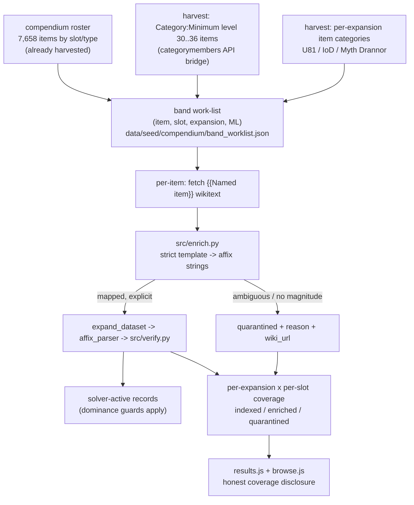

# R4 Endgame Named + Raid Gear — ML30-36 Band Enrichment (U81 / IoD / Myth Drannor) - Plan

## Goal Capsule

**Objective.** Execute the first batch of roadmap-006 **R4** (exhaustive named + raid gear): enrich **every** named + raid item in the **ML 30-36 endgame band** across the three target content sets — **Update 81, Isle of Dread, Myth Drannor** — into solver-active records via the shipped `enrich.py → verify` pipeline, under strict provenance. The enumeration already exists (the 7,658-item compendium roster); this is an **enrichment** effort, not discovery.

**Why now.** The crafting-reuse program is closed (roadmap-006 Status Update 2026-07-27; M1/M2 + seal/NC shipped, Essence deferred). But solver-active named gear is only ~758 records against a 7,658-item roster (~10%). Within the ML 30-36 band it is **uneven, not empty**: ~645 of the 758 enriched records already fall in the band (Myth Drannor ~196 and U81 ~166 are substantially done via `enriched_batch12/13`), but **Isle of Dread has ~9** even though its crafting is fully modeled. So this batch is a **delta-closing** effort — finish the thin slots/expansions (IoD first) and prove exhaustive per-slot coverage — not a from-scratch enrichment of the whole band.

**Sizing reality (from the 2026-07-27 scout, load-bearing).** The band is largely populated already, so the fetch-and-enrich work in U3 targets only the **delta** (band work-list minus names already terminal in a prior `enriched_*.json` shard or the base seed). This matters for correctness, not just effort: `build_dataset.py:load_enriched_items` globs **all** `enriched_*.json` and dedups by name (`seen_names`), so creating an R4 copy of an already-enriched name is silently dropped **and** breaks the reconciliation gate's "exactly one shard" assertion. Already-enriched is a first-class terminal state (KTD6).

**Completeness bar (user-directed).** "Done" = **every** ML 30-36 item in the three sets is **enriched or explicitly quarantined** — none silently missing. Strict provenance stands: an item whose wikitext lacks an explicit `(stat, bonus_type, value)` is quarantined with a recorded reason and `wiki_url`, never inferred.

**Product authority.** roadmap-006's Product Contract (R4) is the source of truth for WHAT; this plan adds HOW for the ML30-36 first batch. **Product Contract unchanged.**

---

## Product Contract (carried from roadmap-006 R4, unchanged)

### Primary actor & outcome
A DDO player theorycrafting an endgame build gets optimizer results whose per-slot optimum is genuinely optimal over the **real endgame named + raid gear** of U81, Isle of Dread, and Myth Drannor — every item stat wiki-traceable, ambiguous effects quarantined and disclosed.

### In scope (requirements)
- **R4 (this batch)** — Source **every viable named item per slot** in the **ML 30-36 band** for U81, IoD, and Myth Drannor, **including raid named gear** (raid loot is ordinary named gear — no separate path; it already sits in the by-type roster). Via the established harvest → `src/enrich.py` → `src/verify.py` pipeline.
- **R3 (strict provenance, block-until-documented)** — Explicit values only; every `(stat, bonus_type, value)` carries a `wiki_url`; ambiguous → quarantined, never inferred.
- **R5 (reuse over rebuild)** — Fold into the shipped enrichment pipeline and its data-layer conventions (strict `enrich.py` rendering, dominance guards, umbrella/alias normalization). No new solver mechanics.

### Out of scope (boundaries)
- **Catalyst-crafted item roster** — named gear per R4, but its own follow-up batch; not ML-band-scoped here.
- **Below-endgame (ML < 30) named gear** — consistent with the existing endgame-band compendium scope.
- **Essence "wildcard crafted item" primitive** — deferred to its own brainstorm (roadmap-006 Status Update 2026-07-27).

### Success criteria
- Every ML 30-36 item in the three sets is enriched or quarantined; a real HiGHS solve selects band items and they pass the dominance filter.
- Coverage honestly reports, per expansion × per slot, indexed / enriched / quarantined counts.
- No fabricated data: ambiguous effects quarantined with reason + `wiki_url`.

---

## Key Technical Decisions

- **KTD1 — Assemble the work-list by category intersection, not per-item wikitext scans** *(agent-recommended).* The band work-list = (roster) ∩ (`Category:Minimum level 30..36 items`) ∩ (per-expansion item categories), all harvested through the same MediaWiki `categorymembers` API bridge that built the roster (same-origin; server-side fetch is blocked — use Claude-in-Chrome / the API bridge). Chosen over fetching every roster item's wikitext just to read `| minimum level =`: the ML and expansion categories give the exact band + attribution directly, so wikitext is fetched only for items actually being enriched.
- **KTD2 — ML from category membership is authoritative; wikitext ML is a cross-check** *(agent-recommended).* The `Minimum level N items` categories define band membership. When an item's fetched wikitext `| minimum level =` disagrees, prefer the wikitext value for the record and flag the mismatch (quarantine reason if it pushes the item out of band). Avoids trusting a single source silently.
- **KTD3 — Expansion attribution is best-effort for disclosure/batching; ML-band membership is the hard gate** *(session-settled: user-directed — chosen over strict-expansion-only scoping: the user set the bar at "every ML30-36 item in the three sets", and content-set categories on the wiki are imperfect).* An item in the ML band whose expansion category is ambiguous still enriches; its expansion tag is recorded as `unattributed` and disclosed, not dropped.
- **KTD4 — Completeness = enriched-or-quarantined, per item** *(session-settled: user-directed — chosen over pipeline-proven-then-incremental: user chose the exhaustive KD3 bar).* Every band item must reach a terminal state (solver-active or quarantined-with-reason). Coverage metadata counts both; a silently-absent band item is a defect.
- **KTD5 — Extend `enrich.py` only for band-surfaced unambiguous templates** *(agent-recommended).* Survey the band's template vocabulary first (as U5 of plan 005 did); add renderers only for templates that are unambiguous and magnitude-bearing. Everything else stays in `unmapped`/quarantined. No speculative mapping.
- **KTD6 — Three terminal states, not two: enriched / already-enriched / quarantined** *(agent-recommended, from feasibility review).* A band item is terminal if it is newly enriched in an R4 shard, **already enriched** in any prior `enriched_*.json` shard or the base seed, or quarantined. U3 fetches+enriches only the delta (work-list minus already-enriched names). The reconciliation gate (U5) loads the **full** `enriched_*.json` corpus, never just `enriched_r4_*`, and treats existing batches as satisfying the bar — never re-creating an already-enriched name (which `build_dataset.py`'s name-dedup would silently drop).

---

## Planning Contract

### High-Level Technical Design

The four sources feed one work-list; each item reaches exactly one terminal state (solver-active or quarantined). Nothing about the solver, dominance filter, or lexicographic solve changes — this is data population plus coverage surfacing.

### Implementation Units

### U1. Resolve the band frontier + build the attributed work-list

- **Goal.** Produce the authoritative ML30-36 band work-list, attributed by slot + expansion, cross-referenced to the roster. Resolves roadmap-006 OQ6 (which categories enumerate each set).
- **Requirements.** R4, R3; KTD1, KTD2, KTD3.
- **Dependencies.** none (uses the shipped roster + the categorymembers bridge).
- **Files.** `src/band_frontier.py` (new — intersection + attribution logic over harvested category shards), `data/seed/compendium/band_categories/` (new — harvested `Minimum level 30..36 items` + per-expansion category member lists, one JSON shard per category, each carrying its `wiki_url` + harvest date), `data/seed/compendium/band_worklist.json` (new — the attributed work-list + a per-expansion/per-slot baseline count), `tests/test_band_frontier.py` (new).
- **Approach.** Harvest `Category:Minimum level 30 items` … `Category:Minimum level 36 items` and the per-expansion item categories via the manual API bridge (server-side fetch is blocked — Claude-in-Chrome / same-origin categorymembers; downloads are one-shot, base64/query payloads are guard-blocked). Resolve exact category names during harvest (e.g. Isle of Dread, Myth Drannor packs, U81/Vecna content; record what was and wasn't found). Intersect member names with the roster to get (item, slot): matching is **exact against wiki page titles** (both sides come from the categorymembers namespace, so the strings align). Name-normalization for casing/punctuation and roster disambiguator suffixes (e.g. `First Blood (level 25)`) is **new code in `src/band_frontier.py`** — `compendium.py` has no normalization helper to reuse (only `load_roster`, `build_compendium`, `wiki_url`). Tag expansion from the per-expansion shards; items in-band but unattributed get `expansion: unattributed`. Emit `band_worklist.json` sorted by slot then expansion, plus a baseline coverage block that also marks which work-list names are **already enriched** (KTD6) so U3 can scope to the delta.
- **Patterns to follow.** `src/compendium.py` (`load_roster`, `wiki_url` — note: harvest itself is the manual bridge process, not in-repo code); the roster shard shape in `data/seed/compendium/roster_*.json` (metadata + categories blocks); the DDO wiki bulk-data bridge method (windowed export; one-shot downloads; base64/query payloads guard-blocked).
- **Test scenarios.**
  - A name present in both an ML-band category shard and the roster appears in the work-list with its roster slot.
  - An item in an expansion shard is tagged with that expansion; an in-band item in no expansion shard is tagged `unattributed` (not dropped).
  - Covers R3. A category shard missing its `wiki_url`/harvest metadata fails validation (provenance gate).
  - Name-normalization: a roster name differing only by punctuation/casing, or carrying a disambiguator suffix (`First Blood (level 25)`), still intersects its category-member title (no false miss).
  - A work-list name already present in a prior `enriched_*.json` shard is marked `already_enriched` in the baseline (feeds U3's delta scoping).
  - The emitted baseline count equals the work-list length grouped by (expansion, slot).
- **Verification.** `band_worklist.json` builds; its grouped counts reconcile with the source shard sizes; the set of covered vs pending categories is reported (OQ6 answered in-artifact).

### U2. Survey band template vocabulary + extend the strict renderer minimally

- **Goal.** Ensure `enrich.py` maps every *unambiguous, magnitude-bearing* template the band actually uses, and nothing speculative.
- **Requirements.** R3, R5; KTD5.
- **Dependencies.** U1.
- **Files.** `src/enrich.py` (extend renderers only), `tests/test_enrich.py` (add band-surfaced cases).
- **Approach.** Sample wikitext across the work-list slots to enumerate distinct `| enhancements =` templates in the band (mirror plan-005 U5's survey method). For each template not already mapped: add a renderer **only** if stat + magnitude + bonus type are explicit; otherwise leave it to `unmapped`. Round-trip every new renderer's output through the real `affix_parser`.
- **Execution note.** Add characterization cases to `tests/test_enrich.py` for each new template before wiring it, so the strict-vs-unmapped boundary is pinned.
- **Patterns to follow.** Existing per-template renderers + `_typed`/`_opt_type` idioms in `src/enrich.py`; the `unmapped` disclosure contract in its docstring.
- **Test scenarios.**
  - Each newly-mapped template renders a value-last string that the `affix_parser` parses to the expected `(stat, bonus_type, value)`.
  - A composite/nested or magnitude-less template in the band is skipped and recorded in `unmapped` (not guessed).
  - Regression: all previously-mapped templates still render unchanged.
- **Verification.** Survey output lists every band template as mapped-or-unmapped with a rationale; `test_enrich.py` green.

### U3. Enrich the full band, slot-by-slot, to a terminal state per item

- **Goal.** Every **delta** work-list item (not already enriched) becomes solver-active (enriched) or quarantined-with-reason. Already-enriched items are terminal as-is (KTD6). This is the bulk of R4's first batch — and, per the sizing reality, it is concentrated in IoD and the thin slots, not the whole band.
- **Requirements.** R4, R3; KTD4, KTD6.
- **Dependencies.** U1, U2.
- **Files.** `data/seed/compendium/raw/batch_r4_<expansion>.json` (new — committed harvested `{{Named item}}` wikitext, one entry per delta item), `scripts/enrich_batch_r4_<expansion>.py` (new — driver: reads only the raw shard + the strict parser, calls `enrich.build_item_record(...)`, writes the enriched + quarantined shards; **no hand-authored values**), `data/seed/compendium/enriched_r4_<expansion>_<slot>.json` (new — generated enriched shards), `data/seed/compendium/quarantined_r4.json` (new — quarantined items with reason + `wiki_url`), `build_dataset.py` (already globs `enriched_*.json` — confirm the new shards are picked up; extend coverage counting), `tests/test_r4_enrichment.py` (new — pipeline-integration).
- **Approach.** Scope to the **delta** (U1's `already_enriched` marks are skipped — never re-fetch or re-create them, since `build_dataset.py` dedups by name and a duplicate breaks U5's gate). Walk the delta grouped by slot then expansion (deterministic order): harvest each item's `{{Named item}}` wikitext into the committed `raw/batch_r4_<expansion>.json`, then run the driver — `enrich.build_item_record(name, slot, enh, wiki_url, minimum_level=ml, armor_type=...)`; ≥1 mapped affix → enriched shard; zero mapped affixes (or ML cross-check ejects it from band) → `quarantined_r4.json` with a reason (`no_explicit_magnitude`, `ml_mismatch`, `wikitext_missing`, …) and `wiki_url`. Raid items flow through identically. The shards are the ledger: every delta item appears in exactly one output; every already-enriched item stays terminal in its existing shard.
- **Execution note.** Ship incrementally per (expansion, slot) shard, IoD first (largest gap). The DoD is reached when enriched (new + already) + quarantined covers the whole work-list. A reconciliation check (U5) enforces no silent gaps.
- **Patterns to follow.** `scripts/enrich_batch12_myth_drannor.py` (the driver + "reads only raw + strict parser, no hand-authored values" reproducibility contract) and its `data/seed/compendium/raw/batch12_myth_drannor.json` raw shard; `enrich.build_item_record` signature in `src/enrich.py`; `build_dataset.py` `load_enriched_items` glob+dedup merge.
- **Test scenarios.**
  - Covers R4. A shipped enriched shard item parses → verifies → is present in the built dataset as a solver-active variant.
  - Covers R3/KTD4. A quarantined item carries a non-empty reason + `wiki_url` and does **not** enter the solver dataset.
  - Every name in a produced shard exists in `band_worklist.json` (no stray/invented items).
  - Covers KTD6. An `already_enriched` work-list item is **not** re-fetched or written to an R4 shard (no duplicate name across `enriched_*.json`; `build_dataset.py` dedup would otherwise silently drop one).
  - The driver produces the shard from `raw/batch_r4_*.json` + the strict parser alone — re-running it byte-reproduces the shard (no hand-authored values).
  - An item with an augment slot but no explicit affix magnitude is quarantined (`no_explicit_magnitude`), not enriched with a guessed value.
- **Verification.** For each completed (expansion, slot): enriched + quarantined counts sum to that group's work-list count; a real solve targeting a stat only these items carry selects one of them.

### U4. Per-expansion × per-slot coverage metadata + honest surfacing

- **Goal.** Emit and display band coverage (indexed / enriched / quarantined) per expansion × slot, so results and browse tell the truth about completeness.
- **Requirements.** R4 (coverage disclosure); success criteria.
- **Dependencies.** U1, U3.
- **Files.** `build_dataset.py` (emit `band_coverage` metadata from work-list + shards), `web/results.js` (coverage disclosure in the build sheet), `web/browse.js` (band coverage indicator), `tests/results.test.js` / `tests/browse.test.js` (extend).
- **Approach.** Extend the existing coverage metadata (the per-family disclosure shipped with M3) with a `band_coverage` block keyed by (expansion, slot) → {indexed, enriched, quarantined}. `results.js` shows, per solved loadout, the coverage backing each slot's expansion band (e.g. "IoD Boots: 12/14 enriched, 2 quarantined"); `browse.js` surfaces the same at the roster level. Reuse the existing `scope-note` / coverage-disclosure rendering — do not fabricate completeness.
- **Patterns to follow.** M3's per-family coverage disclosure in `web/results.js`; the existing `scope-note` component; `build_dataset.py` coverage emission.
- **Test scenarios.**
  - `band_coverage` numbers reconcile with the enriched + quarantined shard counts from U3.
  - Results view renders honest coverage for a slot whose band is partially enriched (enriched + quarantined + pending shown distinctly).
  - Browse shows band coverage per expansion/slot; an expansion with zero enriched shows 0, not blank.
  - `Test expectation:` rendering assertions on data-driven output; no coverage claim exceeds the work-list denominator.
- **Verification.** Browser pass clean; coverage figures match the dataset build; no slot claims more enriched than its work-list holds.

### U5. Reconciliation gate, benchmark, and reproducibility doc

- **Goal.** Enforce the completeness bar mechanically, confirm interactive solve-time holds, and document the harvest→enrich→verify reproduction.
- **Requirements.** KTD4; roadmap-006 Success criteria; Verification Contract.
- **Dependencies.** U3, U4.
- **Files.** `tests/test_r4_reconciliation.py` (new — every work-list item is in exactly one terminal shard), `docs/solutions/` (a learnings entry for the band-enrichment reproduction + OQ6 category resolution), `build_dataset.py` (fail the build if reconciliation breaks, optional guard).
- **Approach.** A test loads `band_worklist.json` and asserts each item is terminal in **exactly one** place across the **full** `enriched_*.json` corpus (new R4 shards **and** pre-existing batches) or `quarantined_r4.json` — no duplicates, no gaps. This is the KTD4 + KTD6 completeness gate: already-enriched items satisfy the bar via their existing shard; the gate must not scope to `enriched_r4_*` alone (that would false-report ~645 already-enriched band items as gaps). Record a solve-time benchmark for an ML34 query with the newly-populated band in play; if it regresses materially, note the mitigation (per-slot dominance pre-filter already exists). Write the reproduction + resolved expansion category names to `docs/solutions/`.
- **Patterns to follow.** The DDO wiki-audit / bulk-data-bridge method notes; existing `docs/solutions/` entries; the solver benchmark approach from M2/M3.
- **Test scenarios.**
  - Reconciliation passes on the shipped shards (every work-list item terminal, exactly once across the full corpus).
  - An already-enriched band item (present only in a pre-existing batch, no R4 shard entry) counts as terminal — not a gap.
  - A name present in both a pre-existing batch and an R4 shard fails reconciliation (duplicate — the state `build_dataset.py` dedup would hide).
  - A deliberately-removed item from all shards makes reconciliation fail (the gate has teeth).
  - Benchmark: an ML34 query with the band populated solves within the interactive bar; the timing is recorded.
- **Verification.** Reconciliation green; benchmark recorded; `docs/solutions/` entry names the covered vs pending categories and the reproduction steps.

---

## Verification Contract

- All existing tests stay green, plus the new `tests/test_band_frontier.py`, `tests/test_r4_enrichment.py`, `tests/test_r4_reconciliation.py`, and extended `tests/test_enrich.py` / `tests/results.test.js` / `tests/browse.test.js`. Run `python3 tests/run_tests.py`, `node tests/browse.test.js`, `node tests/results.test.js`, `node tests/solver.test.js`.
- Dataset build (`python3 build_dataset.py`) succeeds and emits `band_coverage` metadata; the reconciliation gate holds (every work-list item terminal, exactly once).
- Strict-provenance spot-check (KTD5): no enriched value exists without a `wiki_url`; every quarantined item carries a reason + `wiki_url`.
- A real HiGHS solve selects newly-enriched band items and they pass the dominance filter (cover with end-to-end solves, not just model tests — the project's recurring lesson).
- Browser visual pass via localhost http server + Claude-in-Chrome (localhost permission granted): coverage disclosure reads honestly.
- Solve-time benchmark for an ML34 band-populated query recorded and within the interactive bar.

## Status — SHIPPED 2026-07-27

All units landed. **188/188 band items terminal** across the three sets (Isle of Dread 43, Myth Drannor 70, U81 75): **33 newly enriched** (IoD 24, MD 8, U81 1), **8 already-active** (Dinosaur Bone Dino-host blanks), **0 quarantined, 0 pending**. Update→expansion resolved (U55/U69/U81; roadmap-006 OQ6 closed). A real HiGHS solve selects an enriched band ring over a weaker rival; browser coverage note renders per-expansion band coverage. **318 tests pass** (205 Python + 113 JS). Files: `src/band_frontier.py`, `scripts/enrich_batch_r4.py`, `scripts/snapshot_baseline.py`, `data/seed/compendium/{band_categories/,raw/batch_r4.json,band_worklist.json,enriched_r4_*.json}`, `build_dataset.py` + `web/results.js` (band coverage), 3 new test files, `docs/solutions/design-patterns/r4-endgame-band-enrichment.md`.

## Definition of Done

- **Every** ML 30-36 named + raid item in U81, Isle of Dread, and Myth Drannor is terminal — newly enriched, already enriched in a prior batch, or quarantined (reason + `wiki_url`) — none silently missing; the reconciliation gate proves it over the full `enriched_*.json` corpus.
- Coverage renders per expansion × per slot (indexed / enriched / quarantined) in results and browse; no fabricated completeness.
- The exact enumerating categories per set are resolved and recorded (roadmap-006 OQ6 closed); unattributed in-band items are disclosed, not dropped.
- All existing + new tests green; benchmark recorded; live site redeploys via the GitHub Pages workflow on push to `main`.

---

## Scope Boundaries

### Deferred to Follow-Up Work
- Below-band (ML < 30) named gear for these sets; other expansions' endgame bands (next R4 batches).
- Catalyst-crafted item roster (named gear, its own batch).
- Upstream reconciliation of the in-repo compendium into `ddo-item-puller`.

### Out of scope
- Essence "wildcard crafted item" solver primitive (separate brainstorm — roadmap-006 Status Update 2026-07-27).
- Any new solver/model mechanics — this batch is data population + coverage surfacing (R5).

---

## Provenance

- Source: roadmap-006 R4 (`docs/plans/2026-07-25-006-feat-multi-expansion-crafting-content-roadmap-plan.md`), Product Contract carried unchanged. Grounded by a 2026-07-27 coverage scout (roster 7,658 indexed; ~758 enriched, IoD only ~9) and the Essence data-check that closed the crafting program.
- Builds on the shipped enrichment pipeline (`src/enrich.py`, `src/verify.py`, `src/compendium.py`, `build_dataset.py`) and its strict-provenance conventions; structure follows plans 005 (compendium enrichment) and 007/008 (per-milestone plans).
- Session-settled decisions: completeness bar = every-item enriched-or-quarantined (KTD4); ML-band membership is the hard gate, expansion attribution best-effort (KTD3).
