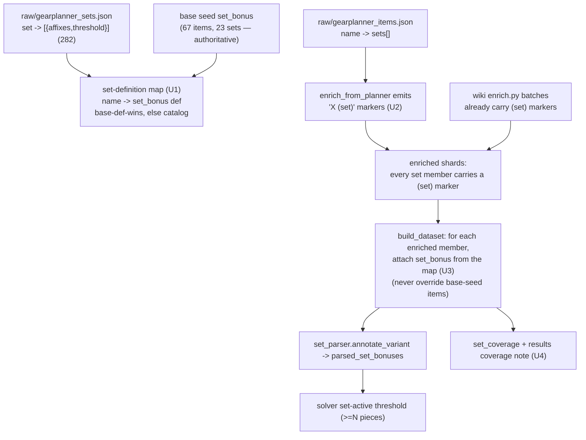

# Record Set Bonuses for Enriched Set-Member Gear - Plan

## Goal Capsule

**Objective.** Make every **enriched** set-member item carry a `set_bonus` field so the solver counts it toward set thresholds and applies the set bonus — closing the gap where only the 67 hand-authored base-seed items participate in sets while ~571 enriched members (wiki batches incl. R4, and the gear-planner bulk import) do not.

**Why now.** The bulk gear-planner import (2026-07-27) roughly tripled the solver-active pool, but set bonuses silently apply to almost none of it. The solver reads set membership from `variant.set_bonus[].set` (`web/model.js` `variantSets`), and `src/variants.py` copies `set_bonus` verbatim from the seed — which only base-seed items populate. Enriched items get a cosmetic `"X (set)"` marker that the build strips and never converts to a `set_bonus`. So a real endgame set (e.g. *The Legendary Dread Isle's Curse* across the IoD gear) contributes nothing, and the "optimal" loadout is wrong whenever a set bonus would change the answer.

**Approach.** Introduce a committed **set-definition catalog** from the gear-planner `sets.json` (ddowiki-derived, pre-structured: set → tiers `[{affixes:[{name,type,value}], threshold}]`) and, at build time, attach a `set_bonus` field to every enriched item that is a set member — reusing the existing `set_parser` → solver set-active machinery. Base-seed definitions are authoritative and untouched; enriched members reuse the base name so pieces count together.

**Product Contract source.** Solo (`ce-plan-bootstrap`) — no prior brainstorm. Problem Frame + Requirements below are the source of truth.

---

## Problem Frame

- **Mechanism (verified).** Set bonuses reach the solver only through an item's `set_bonus` field: `set_parser.parse_piece_text` turns each `piece_bonuses:{"N Pieces": text}` into structured `parsed_set_bonuses`, and the MILP activates those affixes at `>= N` equipped pieces of the set (shipped in M3). `src/variants.py` copies `set_bonus` from the seed record unchanged.
- **Gap (verified).** Only `data/seed/ddo_items.json` (67 items, 23 sets) has a `set_bonus` field. Enriched records (`enrich.py` wiki batches + `enriched_planner_ml29.json`) carry only a `"X (set)"` enhancement marker (stripped during build; 0 survive to `web/data/items.json`). Result: **571 enriched items across 82 sets** are set members with empty `set_bonus`; confirmed on *Legendary Magma Waders* (a Dread Isle's Curse piece) — `set_bonus: []`, not counted.
- **Data availability.** The gear-planner `sets.json` (282 sets) defines **81 of the 82** involved sets; only *Legendary Cooking By the Book* (a novelty set) has no definition. Of the 82, several already have a base-seed `set_bonus` — some under the exact same name, but a subset only after reconciling cross-source spelling drift (base `Adherent of the Mists (Legendary)` vs enriched `Adherent of the Mists Set (Legendary)`; base `Saltmarsh Explorer` vs enriched `Legendary Saltmarsh Explorer`), which R4/KTD4 canonicalize.

---

## Requirements

- **R1 — Enriched set members participate.** Every enriched item that is a documented set member carries a `set_bonus` field with the set's definition, so the solver counts it toward the threshold and applies the bonus.
- **R2 — Both membership encodings covered.** Membership is detected for both sources: the gear-planner bulk items (which carry a `sets:[name]` field in the raw source) and the wiki-enriched items (which carry a `"X (set)"` marker).
- **R3 — Base-seed definitions authoritative and unchanged.** The 67 hand-authored base-seed `set_bonus` entries are never modified. For a set that exists in both base seed and catalog, the base-seed definition wins and every member (base + enriched) uses the same set name so thresholds combine.
- **R4 — Name reconciliation across sources, tiers distinct.** The same real set spelled differently across the three name sources (base-seed `set_bonus.set`, gear-planner `sets.json` keys, wiki `(set)` markers) must resolve to ONE canonical name so its pieces count together — the gear-planner `" Set"` infix (`Adherent of the Mists Set (Legendary)` vs base `Adherent of the Mists (Legendary)`) and `"Legendary "`-prefix drift (`Legendary Saltmarsh Explorer` vs base `Saltmarsh Explorer`) are known systematic divergences. Genuine tier variants (Heroic/Epic/Legendary) stay distinct — reconciliation unifies *spelling*, never *merges tiers*.
- **R5 — Strict provenance.** Set affixes come from the ddowiki-derived catalog and carry a `wiki_url`; any affix clause that does not parse to an explicit `(stat, bonus_type, value)` is flagged/quarantined, never inferred. A set with no definition (the novelty set) yields membership disclosure but no fabricated bonus.
- **R6 — Honest coverage disclosure.** `set_coverage` metadata and the results coverage note report that enriched set members are now covered (and disclose the uncovered set).

---

## Key Technical Decisions

- **KTD1 — Gear-planner `sets.json` as the catalog, committed raw** *(session-settled: user-directed — chosen over per-item wiki set-page harvest: the planner set data is pre-structured `{affixes, threshold}` and covers 81/82 sets in one file).* Commit at `data/seed/compendium/raw/gearplanner_sets.json`, mirroring `gearplanner_items.json` / `gearplanner_crafting.json`.
- **KTD2 — Attach `set_bonus` at build time, not at import time** *(agent-recommended).* One place in `build_dataset` covers all enriched sources and needs no re-harvest of existing shards — mirrors the order-independent seal-slot graft already in `build_dataset`.
- **KTD3 — Unified set-definition map: base-def-wins, else catalog-def** *(session-settled: user-directed — chosen over letting each source carry its own def: members of one set must share a single definition or the solver sees conflicting set bonuses for the same name).* For each set name, the authoritative definition is the base-seed entry if present, otherwise the catalog entry. Every member of that set (base already has it; enriched gets it attached) uses that one definition.
- **KTD4 — Canonicalize set names across sources; tiers stay distinct** *(session-settled: user-directed as "exact-string, tiers distinct" — **REVISED after doc-review evidence**: exact-string matching alone silently splits real overlap sets, e.g. base `Adherent of the Mists (Legendary)` vs enriched `Adherent of the Mists Set (Legendary)`, reintroducing the very bug this plan fixes. Revision keeps the user's intent — tier variants distinct — but adds a minimal, explicit canonicalization for the systematic spelling divergences.)* Canonicalize by normalizing the gear-planner `" Set"` infix and reconciling the `"Legendary/Epic/Heroic "` tier-prefix drift against the base-seed names, driven by an explicit reconciliation audit (U1). Never merge genuine tiers; only unify one set spelled differently. The user's rejected alternative (merging Heroic/Epic/Legendary into one threshold) remains out of scope.
- **KTD5 — Structured affixes → `piece_bonuses` text, with the catalog as the provenance gate** *(agent-recommended; **hardened after doc-review**: `affix_parser.parse_line` does NOT flag unknown stat names or bonus types — it folds an unrecognized leading type word into the stat and defaults to Enhancement, so relying on `set_parser` to flag would silently mint bogus stats like `"Deflection bonus to Armor Class"`, violating R5).* `set_catalog` validates each catalog affix against `vocab` (`is_known_bonus_type`, `CORE_STATS`/`STAT_ALIASES`) BEFORE synthesis; only fully-recognized `(stat, bonus_type, value)` triples become `piece_bonuses` text (canonical value-first form `"+15 Profane bonus to Melee Power"`), and any unknown stat/type is routed to a flagged/quarantined list — never emitted. Recognized text still round-trips through `affix_parser.parse_line` as the second gate.

---

## Planning Contract

### High-Level Technical Design

The catalog and base seed feed one authoritative def-per-set map; membership is unified onto the `(set)` marker; `build_dataset` attaches the def to enriched members; everything downstream (parser, solver, coverage) is unchanged.

### Implementation Units

### U1. Set-definition catalog + reconciled, provenance-gated def-per-set map

- **Goal.** A committed catalog and a module that yields, per **canonical** set name, the single authoritative `set_bonus` definition (base-def-wins, else catalog) — with catalog affixes validated against `vocab` before synthesis, and a reconciliation audit that unifies cross-source spelling divergences.
- **Requirements.** R1, R3, R4, R5; KTD1, KTD3, KTD4, KTD5.
- **Dependencies.** none.
- **Files.** `data/seed/compendium/raw/gearplanner_sets.json` (new — fetched from `illusionistpm/ddo-gear-planner site/src/assets/sets.json`), `src/set_catalog.py` (new), `tests/test_set_catalog.py` (new).
- **Approach.**
  - **Reconciliation audit (KTD4).** Enumerate every set name across the three sources — base-seed `set_bonus.set`, gear-planner `sets.json` keys, and the `(set)` markers / gear-planner `sets[]` on enriched items — and build a canonical-name map. Normalize the gear-planner `" Set"` infix (`"X Set (Legendary)"` → `"X (Legendary)"`) and reconcile `"Legendary/Epic/Heroic "`-prefix drift so a base set and its enriched members collapse to one key; keep genuine tier variants separate. The audit **fails loudly** on the split signature — a base-def set with enriched members that only match under a near-name — so no divergence is silently missed.
  - **Provenance gate (KTD5).** For each catalog affix `{name,type,value}`, resolve the stat via `vocab` (`CORE_STATS`/`STAT_ALIASES`) and the type via `vocab.is_known_bonus_type` FIRST; emit a `piece_bonuses` clause only for fully-recognized triples; route unknown stat names or bonus types (the gear-planner carries `Deflection`, `Natural`, `Vitality`, `Luck`, … outside the 17 `BONUS_TYPES`) to a flagged list — never synthesized. Render recognized clauses in the canonical value-first form `"+{value} {type} bonus to {name}"` (Enhancement omits the type word), `"; "`-joined per tier, so they round-trip through `affix_parser.parse_line` as a second gate.
  - **Map.** Expose `definition_for(canonical_name, base_defs)` → base-seed entry if present, else the synthesized catalog entry `{set: canonical_name, source, wiki_url, piece_bonuses:{f"{threshold} Pieces": text}}`, else `None`.
  - **Parse-rate report (Finding 4).** After fetching `sets.json`, run the real parser over every involved set's synthesized text and report parsed-vs-flagged affix counts per set (and per tier), so coverage (U4) can state applied-affix tiers vs membership-only rather than assuming full coverage.
- **Patterns to follow.** `scripts/enrich_from_planner.py` `affix_to_string` **type/value conventions only** (not its value-last string layout — U1 uses the value-first `"bonus to"` form); the `set_bonus` shape in `data/seed/ddo_items.json`; `src/set_parser.parse_piece_text` for the text grammar; `src/vocab.py` validators.
- **Test scenarios.**
  - A catalog set renders a `set_bonus` whose `piece_bonuses` text parses (via `set_parser.parse_set_bonuses`) to the expected `(stat, bonus_type, value, pieces_required)` — e.g. Dread Isle's Curse 5-piece → Profane Melee Power +15.
  - Covers R5/Finding 1. A catalog affix with a bonus type outside `BONUS_TYPES` (e.g. `Deflection`) and one with an unknown stat name are **flagged**, not emitted as a bogus `"Deflection bonus to Armor Class"` stat.
  - Covers R4/Finding 3. `Adherent of the Mists Set (Legendary)` (enriched) canonicalizes to the base key `Adherent of the Mists (Legendary)`, so `definition_for` returns the base def and members share one name; `Legendary Saltmarsh Explorer`-vs-`Saltmarsh Explorer` drift resolves to one key.
  - The reconciliation audit raises on a synthetic split signature (a base-def set with only near-name enriched members).
  - `definition_for` returns `None` for *Legendary Cooking By the Book* (no catalog def) — caller discloses, never fabricates.
  - A distinct tier (Heroic vs Legendary of the same family) is NOT collapsed into one key.
- **Verification.** The canonical map covers all involved sets except the disclosed-undefined one; every base-def set with enriched members shares one canonical key (audit green); parse-rate report emitted; recognized text parses through the real `set_parser`.

### U2. Emit `(set)` membership markers for gear-planner items

- **Goal.** Unify membership detection: the bulk-imported gear-planner set members carry the same `"X (set)"` marker the wiki batches already do.
- **Requirements.** R2; KTD2.
- **Dependencies.** none (independent of U1).
- **Files.** `scripts/enrich_from_planner.py` (`build_record`), `data/seed/compendium/enriched_planner_ml29.json` (regenerated), `tests/test_planner_import.py` (extend).
- **Approach.** In `build_record`, read `it.get("sets")` and append `f"{s} (set)"` to `enhancements` for each — the same shape `enrich.py` emits (`enrich.py:371`). Re-run `python3 scripts/enrich_from_planner.py all` to regenerate the shard (idempotent). Seal-carrier stubs are unaffected.
- **Patterns to follow.** `src/enrich.py` set-marker emission; the existing `build_record` augment/seal handling.
- **Test scenarios.**
  - A gear-planner set member (e.g. Magma Waders) in the regenerated shard carries `"The Legendary Dread Isle's Curse (set)"` in `enhancements`.
  - A non-set gear-planner item gains no `(set)` marker.
  - Regenerating the shard is reproducible (byte-identical re-run), consistent with the existing planner-import test.
- **Verification.** Every gear-planner set member carries a `(set)` marker; no non-member does.

### U3. Attach `set_bonus` to enriched set members at build time

- **Goal.** Every enriched item carrying a `(set)` marker gets the authoritative `set_bonus` attached, without touching base-seed items.
- **Requirements.** R1, R3, R4, R5; KTD2, KTD3.
- **Dependencies.** U1, U2.
- **Files.** `build_dataset.py`, `tests/test_enriched_set_bonuses.py` (new).
- **Approach.** After `load_enriched_items()` (and before `expand_dataset`), build `base_defs` from `data/seed/ddo_items.json` `set_bonus` entries. For each enriched record, extract its set names from `"X (set)"` markers, **canonicalize each via `set_catalog` (U1)** so an enriched `"… Set (Legendary)"` / `"Legendary …"` name maps to the base key, then look up `set_catalog.definition_for(canonical, base_defs)`; collect the non-`None` defs into the record's `set_bonus` (skip if the record already has a `set_bonus`, i.e. a base-seed item — enriched records never do). Undefined sets (novelty) attach no bonus but are counted for coverage disclosure. Do not remove the `(set)` markers — the existing build step still strips them from the final variant.
- **Execution note.** Attach on the seed record before `expand_dataset` so tier variants inherit `set_bonus` via `variants.py`; verify base-seed `set_bonus` entries are byte-identical before/after (a snapshot compare).
- **Patterns to follow.** The order-independent seal-slot graft already in `build_dataset` (the `kept_by_name` / second-pass shape); `set_mod.annotate_variant` consumes `set_bonus` downstream unchanged.
- **Test scenarios.**
  - An enriched Dread Isle's Curse member ends up with a `set_bonus` whose `.set` equals the base/catalog name, and `parsed_set_bonuses` carries the 5-piece affixes.
  - A base-seed set item's `set_bonus` is unchanged (deep-equal before/after the build change).
  - Covers R4/Finding 3. An overlap set with cross-source name drift (Adherent of the Mists Legendary) ends with base members and canonicalized enriched members carrying the **same** `.set` string, so the solver counts them toward one threshold.
  - The novelty set's members carry no `set_bonus` (no fabricated bonus) but are reported as members in coverage.
  - No enriched item is double-counted or gains a `set_bonus` it isn't a member of.
- **Verification.** Enriched members have `set_bonus`; base-seed entries byte-identical; overlap-set members agree on the definition.

### U4. Coverage disclosure + end-to-end solve proof

- **Goal.** Report the new coverage honestly and prove a real solve uses an enriched member's set bonus.
- **Requirements.** R6; Verification Contract.
- **Dependencies.** U3.
- **Files.** `src/set_parser.py` (`set_coverage`) or `build_dataset.py` (coverage emit), `web/results.js` (`coverageNote`), `tests/solver.test.js` (extend), `tests/results.test.js` (extend), `tests/test_enriched_set_bonuses.py` (extend).
- **Approach.** Extend `set_coverage` (or a small build-time count) to report enriched set members now covered vs the disclosed-undefined set. Add a clause to `results.js` `coverageNote` noting set bonuses now apply to enriched gear (with the uncovered-set disclosure). Add a real HiGHS solve test: equip N pieces of an enriched-only set (e.g. Dread Isle's Curse via IoD gear) and assert the set bonus activates at the threshold and not below it.
- **Patterns to follow.** The R4 band coverage note + its `results.test.js` test; the existing set-threshold solve tests in `tests/solver.test.js` (AE1-style set activation); `set_coverage` shape.
- **Test scenarios.**
  - Covers R6. `set_coverage` reports a non-zero enriched-member covered count, distinguishes applied-affix tiers from membership-only (parse-rate), and names the uncovered novelty set.
  - `coverageNote` renders the enriched-set-bonus disclosure.
  - Real solve: with `>= N` enriched pieces of a set equipped, the set affixes appear in `effective`; with `N-1`, they do not (threshold honored).
  - `Test expectation:` the solve asserts activation/deactivation across the threshold, not just presence.
- **Verification.** Coverage numbers reconcile; a real HiGHS solve shows an enriched set bonus activating at the threshold.

---

## Verification Contract

- Base-seed `set_bonus` entries are byte-identical before and after (no regression to the 67 hand-authored items / 23 sets).
- **Name-reconciliation audit is green**: every base-def set that has enriched members shares one canonical `.set` string with them (no split-signature); tier variants remain distinct.
- A real HiGHS solve shows an enriched-only set (e.g. *The Legendary Dread Isle's Curse*) activating its bonus at the piece threshold and not below it.
- `set_coverage` reports enriched set members now covered, distinguishing **applied-affix tiers from membership-only** (parse-rate), and discloses the one undefined set; the results coverage note reflects it.
- Strict provenance: every attached set affix traces to the catalog (`wiki_url` present); unknown stat names / bonus types are flagged by `set_catalog` itself (not left to `set_parser`, which would silently fold them), never fabricated.
- Full suite green: `python3 tests/run_tests.py` and every `node tests/*.test.js` (solver, model, browse, results, breakdown), plus the new `tests/test_set_catalog.py` and `tests/test_enriched_set_bonuses.py`.
- Dataset build (`python3 build_dataset.py`) succeeds; no enriched item is double-listed or mis-attributed to a set it doesn't belong to.

## Definition of Done

- Every enriched set member (both encodings) carries the authoritative `set_bonus`; the solver counts it toward thresholds and applies the bonus (or, for a tier with unparseable affixes, counts membership and discloses membership-only — never fabricates).
- Base-seed set definitions are untouched; overlap-set members canonicalize to one shared name so their pieces count together; genuine tier variants stay distinct; the reconciliation audit passes.
- The one undefined set is disclosed (membership only, no fabricated bonus); coverage is honest and distinguishes applied vs membership-only.
- All existing + new tests pass; a real solve proves threshold activation; live site redeploys via the GitHub Pages workflow on push to `main`.

---

## Scope Boundaries

### Deferred to Follow-Up Work
- A hand-authored or wiki-harvested definition for *Legendary Cooking By the Book* (novelty set; low solver value).
- Any base-seed set-definition rework or reconciliation of base tier-name conventions.
- Set bonuses for below-ML29 / non-endgame gear.

### Out of scope
- An Off Hand solver slot (off-hand items remain browse-only regardless of set membership).
- Cross-tier threshold merging or fuzzy set-name aliasing (KTD4 keeps tiers distinct).
- Changes to the solver's set-active MILP encoding — this plan only populates the data it already consumes.

---

## Provenance

- Solo `ce-plan` (bootstrap), grounded by a 2026-07-27 in-session investigation: confirmed the `set_bonus`-only membership path (`model.js` `variantSets`, `variants.py:53`, `set_parser.py`), the 67-base-item / 571-enriched-member gap, and gear-planner `sets.json` coverage (81/82 sets).
- Doc-review (coherence/feasibility/adversarial) hardened the plan: KTD4 revised from exact-string to cross-source canonicalization after evidence that the gear-planner `" Set"` infix / tier-prefix drift splits real overlap sets; KTD5 gained a `vocab`-based provenance gate after finding `set_parser` silently folds unknown types instead of flagging.
- Builds on the shipped M3 set-bonus machinery and the 2026-07-27 gear-planner bulk import; reuses the strict affix parser and the order-independent build-time graft pattern (seal slots). Session-settled decisions: catalog source (KTD1), build-time attach (KTD2), base-def-wins map (KTD3), canonicalized names / tiers-distinct (KTD4), catalog-gated synthesis (KTD5).
