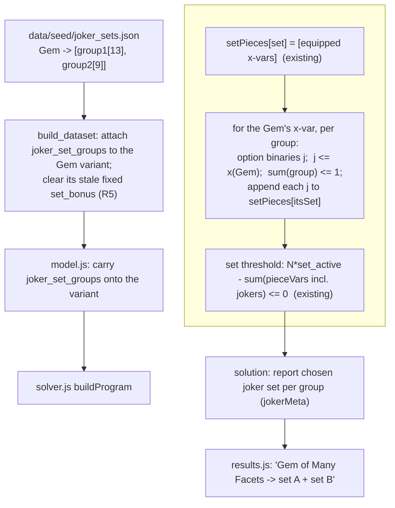

# Wildcard Set Piece (Gem of Many Facets joker) - Plan

## Goal Capsule

**Objective.** Model the **Legendary Gem of Many Facets** correctly: a *wildcard* Trinket that grants **one set membership from each of two pools** (13-set group + 9-set group), which the solver assigns to the sets that best advance ranked targets — a new "joker set piece" solver primitive feeding the existing set-threshold machinery.

**Why now.** The set-bonus feature just shipped assumes **fixed** membership (`variant.set_bonus[].set` counted in `web/solver.js`). The Gem breaks that: the wiki lists it in 22 set categories, but it is not a member of all 22 — it randomly rolls **one set from group 1 AND one from group 2** (rerollable at will). Attaching all 22 flat would over-count (one Gem would complete every set at once); the current base seed under-models it as a single fixed set (Legendary Vulkoor's Might, itself just one of the 13 group-1 options). Neither is right.

**Approach.** Since the optimizer is pure theoretical best-in-slot (free reroll assumed), the Gem is two **gated select-one** choices: pick at most one set per group, each contributing +1 piece toward that set's threshold, gated on the Gem being equipped. This reuses the gated-select-one shape already shipped for Dino typed slots, Viktranium/Lamordia slots, Nearly-Complete choice slots, and seal single-pick — the only new mechanic is the two joker groups feeding `setPieces`.

**Product Contract source.** Solo (`ce-plan-bootstrap`). Problem Frame + Requirements below are the source of truth.

---

## Problem Frame

- **Mechanic (verified — DDO wiki, `Item:Legendary_Gem_of_Many_Facets`).** ML30 Trinket. Grants **Random set 1** (one of 13: Legendary Divine Blessing, Elder's Knowledge, Marshwalker, Raven's Eye, Shaman's Fury, Siren's Ward, Vulkoor's Cunning, Vulkoor's Might, Kundarak Delving Equipment, Mroranon's Might, Silver Concord's Subtlety, Wards of House Kundarak, Draconic Prophecy — all "Legendary") and **Random set 2** (one of 9: Legendary Might of the Abishai, The Legendary Desert's {Biting Sands, Burning Sun, Starless Nights, Writhing Storm}, Legendary Menechtarun Scavenger, Oasis of Morality, Vulkoor's Chosen, Windlasher's Ferocity). Rerollable (100 Threads of Fate). "It can take the place of various other items for the purpose of activating certain set bonuses." The two pools are **disjoint** (13 + 9 = 22 distinct sets, verified), so no set is reachable from both groups — the Gem contributes to at most two distinct sets.
- **Current model is wrong.** The Gem is a base-seed item with `set_bonus = [Legendary Vulkoor's Might]` — a single fixed set. The solver counts it as a fixed piece of exactly that set; it can neither pick a better group-1 set nor contribute a group-2 piece.
- **Set MILP integration point (verified, `web/solver.js` buildProgram).** `setPieces: Map(setName → [equipped x-var names])`; per set tier a `set_active` binary with `N·set_active − Σ(pieceVars) ≤ 0`; the tier's affixes are gated by `set_active`. To make the Gem a joker, its per-group select-one option variables must be appended to `setPieces[chosenSet]` before the threshold constraints are built.

---

## Requirements

- **R1 — Two independent joker groups.** When the Gem is equipped, the solver may activate **at most one** set option per group (two groups). A chosen option contributes exactly +1 piece toward that set's threshold. The Gem never advances more than one set per group, and contributes nothing when not equipped.
- **R2 — Best-fit assignment.** The lexicographic solve assigns each group's pick to whichever pool set most advances the ranked targets (theoretical BiS / free reroll). A group may pick nothing if no option helps.
- **R3 — Reuse the set-active machinery.** The joker feeds the existing `setPieces` / `set_active` threshold; no change to how set bonuses are parsed or gated. The only new solver construct is the two gated select-one groups.
- **R4 — Provenance honesty.** A joker option for a set with a real definition (base or `set_catalog`) can complete that set's bonus; an option for an undefined/membership-only set contributes a piece but no bonus (harmless — no threshold exists for it) and is not misreported as granting a bonus.
- **R5 — Correct the fixed membership.** The Gem's incorrect fixed `set_bonus` (single Vulkoor's Might) is superseded by the joker groups (Vulkoor's Might remains selectable as a group-1 option).
- **R6 — Surface the assignment.** Results show which set(s) the Gem was assigned to in the solved loadout, alongside the other per-item prescriptions (augment-in-slot, dino insert, chosen track).

---

## Key Technical Decisions

- **KTD1 — Joker = two gated select-one groups feeding `setPieces`** *(session-settled: user-directed — chosen over attaching all 22 memberships flat, which over-counts, and over a single combined joker, which contradicts the wiki's one-per-group grant).* Per group: option binaries `j`, `j ≤ x(Gem)`, `Σ(group) ≤ 1`; each chosen `j` is appended to `setPieces[itsSet]`.
- **KTD2 — Committed joker-pool seed, wiki-sourced** *(agent-recommended).* The pools aren't in the base seed or gear-planner (gear-planner has 0 sets for the Gem). Commit a small `data/seed/joker_sets.json` keyed by item name → two set-name groups, sourced from the wiki (Legendary Gem harvested this session). `build_dataset` attaches `joker_set_groups` to the Gem variant and clears its stale fixed `set_bonus` (R5).
- **KTD3 — Reuse the gated-select-one pattern verbatim** *(agent-recommended).* Mirror `ncMeta`/`rollMeta`/`placeMeta` (a meta map + `extraVars` + `extraConstraints` with `≤ 1` and `≤ x(host)`), not a new abstraction. Add a `jokerMeta` for surfacing.
- **KTD4 — Legendary Gem only; other tiers deferred** *(session-settled: user-directed).* Epic / heroic Gem of Many Facets and any other wildcard items are a follow-up, sourced the same way; the data seed and solver mechanic generalize to them with no new mechanic.

---

## Planning Contract

### High-Level Technical Design

The joker sits entirely between `setPieces` construction and the threshold constraints; everything downstream (set_active, affix gating, lexicographic solve) is unchanged.

### Implementation Units

### U1. Joker-pool seed + build-time attach

- **Goal.** Commit the Legendary Gem's two set-group pools and attach them to its variant, superseding the stale fixed membership.
- **Requirements.** R1, R4, R5; KTD2.
- **Dependencies.** none.
- **Files.** `data/seed/joker_sets.json` (new — `{item: {groups: [[...group1], [...group2]], wiki_url, source}}`), `build_dataset.py` (load + attach `joker_set_groups`, clear the Gem's fixed `set_bonus`), `src/set_catalog.py` (reuse `canonical()` to normalize pool set names to match definitions), `tests/test_joker_sets.py` (new).
- **Approach.** Attach on the **post-`expand_dataset` variants**, NOT the base-seed item: `src/variants.py` `_make_variant` builds a new dict from a fixed field list, so a `joker_set_groups` field on the base item would be silently dropped at tier expansion (unlike `set_bonus`/`seal_slots`/`lamordia_slots`, which are enumerated there — do not follow that base-item pattern here). For each variant whose `source_item`/name is in the seed, attach `joker_set_groups` (a list of groups, each a list of **canonical** set names) and remove any pre-existing `set_bonus` (the fixed membership was wrong — R5). Do the clear **before** `set_parser.annotate_variant` runs so the Gem carries no lingering `parsed_set_bonuses`. Canonicalize pool names with `set_catalog.canonical` so a group option matches the same `.set` string the threshold uses. Record which pool sets have a real definition (base/catalog) vs membership-only (R4).
- **Patterns to follow.** The set-bonus attach block in `build_dataset.py` (canonical-name matching); `data/seed/*.json` seed shapes; `src/set_catalog.py`.
- **Test scenarios.**
  - The Gem variant carries `joker_set_groups` with 13 + 9 canonical set names and no fixed `set_bonus`.
  - Every group option name canonicalizes to a form that matches a base/catalog definition where one exists (no silent name drift); options with no definition are recorded as membership-only.
  - Covers R5. The Gem no longer carries the fixed Legendary Vulkoor's Might membership (it is present only as a group-1 option).
- **Verification.** The Gem variant exposes two pools of canonical set names; the stale fixed membership is gone.

### U2. Dominance guard so the Gem is never pruned

- **Goal.** Prevent the per-slot dominance pre-filter from silently pruning the Gem, whose wildcard value is invisible to `dominates()`.
- **Requirements.** R1, R2; KTD3.
- **Dependencies.** U1.
- **Files.** `web/model.js` (`dominates`), `tests/model.test.js`.
- **Approach.** **Field pass-through needs NO code** — `buildModel` keeps original variant references (it does not reconstruct objects with a fixed field list), so `joker_set_groups` reaches `xv.variant` in the solver intact. The real required change is the **dominance guard**: `dominates(A, B)` reads only affix buckets, `set_bonus[].set`, augment colors, dino/nc/lamordia/roll/seal markers — **not** `joker_set_groups`. Because U1 clears the Gem's fixed `set_bonus` (R5), its entire wildcard set-completion capacity is invisible; a plain Trinket with more affixes would dominate and prune it, silently killing the feature. Add a keep-clause mirroring the seal/lamordia guards: if `B` carries `joker_set_groups` that `A` does not also offer, `A` does not dominate `B`. The Gem is a Trinket (cardinality 1), so the cardinality>1 set-piece escape never fires — this guard is mandatory.
- **Patterns to follow.** The seal-slot and lamordia keep-clauses in `dominates()` (`web/model.js`) — the same "B has a target-relevant capacity A lacks → not dominated" shape.
- **Test scenarios.**
  - A plain-affix Trinket with higher target buckets does NOT prune the Gem (the Gem survives to the solver).
  - Two Gems / a Gem vs an item with equal joker capacity still dominance-reduce normally (no infinite retention).
  - A non-Gem item without `joker_set_groups` is unaffected by the new clause.
- **Verification.** With a stronger competitor Trinket in the pool, the Gem still reaches the solver's worn Trinket slot.

### U3. Joker select-one groups in the solver MILP

- **Goal.** Emit the two gated select-one groups and feed their picks into the set-threshold piece counts.
- **Requirements.** R1, R2, R3; KTD1, KTD3.
- **Dependencies.** U2.
- **Files.** `web/solver.js` (`buildProgram` + solution reconstruction), `tests/solver.test.js`.
- **Approach.** After `setPieces` is populated from `xVars` and before the per-set threshold constraints are built: for each `xVars` entry whose variant has `joker_set_groups`, for each group create one option binary per **defined** set in the group (`extraVars`), add `option ≤ x(Gem)` and `Σ(group options) ≤ 1` (`extraConstraints`), and **append each option var to `setPieces[itsSet]`** so the existing threshold constraint counts it. Register `jokerMeta[option] = {host: gemVariantId, group_index, set}`. **Skip options whose set has no defined tier** — such a var would feed a `setPieces` list with no threshold constraint, leaving it free, so the solver could set it to 1 arbitrarily and U4 would surface a fabricated assignment (R4). **Determinism (must-fix):** an appended joker var is load-bearing only as the Nth piece; otherwise it is a free binary that the lexicographic tie-break (which sums only `xVars`, `web/solver.js`) does not pin. Include the joker option vars in the final deterministic tie-break with a small positive weight (mirror the `Σ (i+1)·xVars` term) so an option is set to 1 only when it actually completes a set, and ties among equally-good pool sets resolve deterministically. In solution reconstruction, read the active option vars and report the chosen set per group (alongside `dinoPlaced` / `augmentsPlaced`), reporting a group's pick only when it is load-bearing (its set would not be active without the joker).
- **Execution note.** Add a failing solver test first (equip 4 real pieces of a group set + the Gem → set completes only via the joker), then wire the MILP.
- **Technical design (directional).** Per group *g* with defined options `{s1…sk}`: `j_g_s1 + … + j_g_sk ≤ 1`; each `j_g_si ≤ x(Gem)`; `setPieces[si].push(j_g_si)`. The unchanged threshold `N·set_active(si) − Σ(setPieces[si]) ≤ 0` now sees the joker.
- **Patterns to follow.** `ncMeta` / `rollMeta` / `placeMeta` select-one blocks in `web/solver.js` (meta map + `≤ 1` + `≤ x(host)`); `setPieces` / `set_active` construction.
- **Test scenarios.**
  - Covers R1/R2 (representative case). 1 equipped real carrier of a **2-piece** group set + the Gem → that set's 2-piece threshold activates via the joker; the same solve with the Gem removed does NOT activate it. (Every real pool set is 2-piece except two 3-piece ones — see Scope.) Keep a synthetic higher-N fixture as an auxiliary check.
  - The Gem contributes at most **one** set per group — two independent picks maximum, never two from the same group, so it adds at most +2 pieces total across the loadout.
  - A group whose sets have no other equipped pieces (no threshold) yields no joker pick — the Gem never fabricates a set bonus or a "Gem → set" assignment on its own (R4).
  - Independence: the Gem can complete one group-1 set AND one group-2 set simultaneously (one pick each).
  - Determinism: two equally-beneficial pool sets resolve to a stable, deterministic pick across runs; a non-load-bearing option is never set to 1.
  - Base-seed and enriched fixed-membership sets are unaffected by the joker code path (regression).
- **Verification.** A real HiGHS solve shows the Gem completing the set it best advances (via a group pick) and not activating sets outside its chosen assignment; the two groups are independent and each capped at one.

### U4. Surface the Gem's assignment + coverage

- **Goal.** Show which set(s) the Gem was assigned to in the solved build sheet, and disclose the wildcard honestly.
- **Requirements.** R6; R4.
- **Dependencies.** U3.
- **Files.** `web/results.js`, `tests/results.test.js`.
- **Approach.** Read the reported picks from the solve result (only **load-bearing** picks per U3 — a set the Gem provably completed); in the loadout row for the Gem, render "Gem of Many Facets → {group-1 set} + {group-2 set}" (or "→ (no set advanced)" when a group made no load-bearing pick), mirroring the augment-in-slot / dino-insert prescription rendering. Never render a set the solver did not actually enable via the joker (R4). Optionally note the wildcard in the coverage note.
- **Patterns to follow.** `assignAugments` / `assignDinoInserts` result rendering and the loadout table in `web/results.js`.
- **Test scenarios.**
  - A solved loadout with the Gem renders its chosen set(s) per group.
  - A group that picked nothing renders honestly (no fabricated set).
  - `Test expectation:` rendering assertions on data-driven output; no set shown that the solver did not actually assign.
- **Verification.** The build sheet shows the Gem's wildcard assignment; browser pass clean.

---

## Verification Contract

- A real HiGHS solve: 1 real carrier of a 2-piece Gem group set + the Gem completes that set (via the joker) at its threshold; removing the Gem drops it below threshold; the Gem never advances more than one set per group.
- The Gem survives the dominance pre-filter even when a stronger plain-affix Trinket is in the pool (U2 guard).
- Joker assignment is deterministic and load-bearing-only: no fabricated "Gem → set" for a set with no threshold; ties resolve stably.
- Two-group independence holds: the Gem can complete one group-1 set and one group-2 set at once, but no group contributes >1.
- Base-seed and enriched fixed-membership set counting is unchanged (regression green).
- The Gem's stale fixed set_bonus is gone; its pool names canonicalize to real definitions (no drift); undefined-set options grant no bonus.
- Full suite green: `python3 tests/run_tests.py` and every `node tests/*.test.js`.

## Definition of Done

- The Legendary Gem of Many Facets is a wildcard: the solver assigns one set per group to best advance ranked targets, feeding the existing set thresholds; it never over-counts.
- Results surface the Gem's chosen set(s); provenance is honest (undefined-set picks grant no bonus).
- All existing + new tests pass; live site redeploys via the GitHub Pages workflow on push to `main`.

---

## Scope Boundaries

### Deferred to Follow-Up Work
- Epic Gem of Many Facets / heroic Gem of Many Facets (own pools; source from the wiki, reuse the seed + mechanic).
- Any other wildcard / "counts as a piece of any set" items discovered later.
- Modeling the reroll cost (Threads of Fate) — irrelevant under theoretical-BiS.
- **Two 3-piece pool sets stay inert for now** — Legendary Kundarak Delving Equipment and Legendary Might of the Abishai are 3-piece and currently have only one real ML29+ carrier each, so a single carrier + the Gem (2 pieces) can't reach the threshold. They activate automatically once a second real carrier is enriched (R4 named-gear work); no joker change needed.

### Out of scope
- Changes to how set bonuses are parsed, gated, or applied (`set_parser.py`, `set_catalog.py` definitions) — the joker only feeds the existing `setPieces`.
- Making the Gem's augment slots or Essence-crafting interactions part of this work.

---

## Provenance

- Solo `ce-plan` (bootstrap), grounded by a 2026-07-27 wiki read (`Item:Legendary_Gem_of_Many_Facets`) confirming the one-per-group grant + reroll, and by verifying the set-threshold integration point in `web/solver.js` (`setPieces` / `set_active`).
- Builds on the set-bonus machinery shipped 2026-07-27 (`set_catalog.py`, set-active threshold) and reuses the gated-select-one pattern (`ncMeta` / `rollMeta` / `placeMeta`). Session-settled: two independent joker groups feeding setPieces (KTD1), Legendary-only scope (KTD4).
