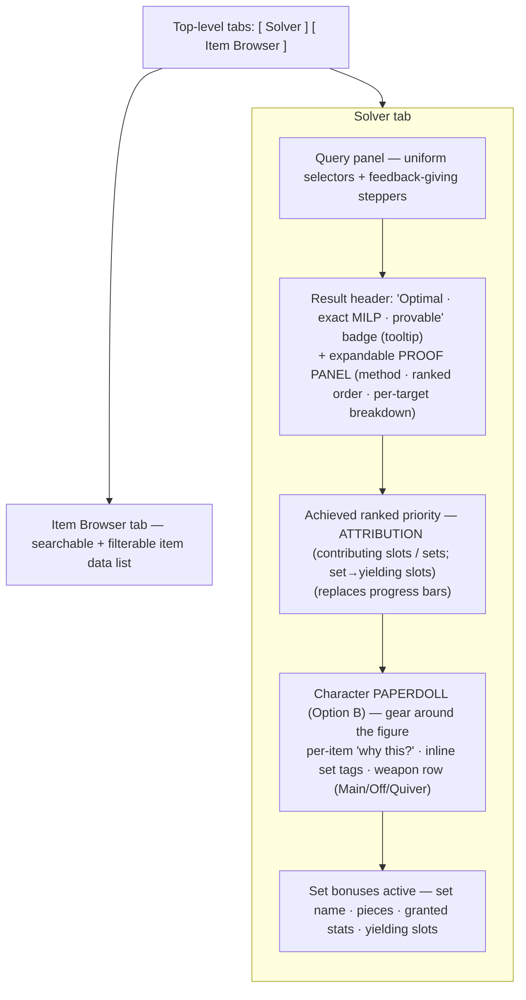
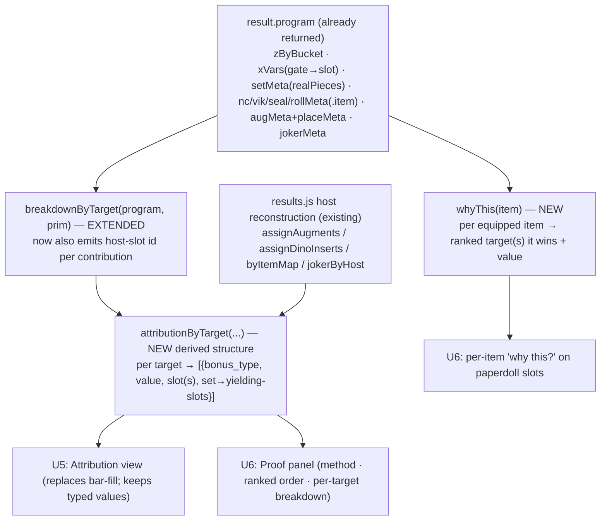

# UI Refinement — Tabbed Browse, Paperdoll & Trust Story - Plan

> **Implementation-ready.** Product Contract (WHAT) enriched with a Planning Contract (HOW) on 2026-07-27. Run `/ce-work` on this file to build it.
>
> **Product Contract preservation:** unchanged — all requirement IDs (R1–R19), acceptance examples (AE1–AE8), and key decisions (KD1–KD8) are carried verbatim from the brainstorm. Planning added the Planning Contract sections only.
>
> **Iterates on the shipped data-forward UI** (`2026-07-26-003`, PR #21, live). This is the next round of refinement based on the user actually using that build: the paperdoll inset becomes a prominent character figure, the item browser moves to its own tab, selectors are unified, steppers gain change-feedback, the trust story grows into a full proof panel + per-item justification (to answer doubt the all-levels import created — a low-ML item genuinely winning a slot), and the ranked-priority progress bars are replaced by slot/set attribution. It inherits the shipped plan's direction (cohesive visual system, mobile-first, presentation-only).

## Goal Capsule

- **Objective:** Refine the optimizer UI so it (a) reads and behaves like a polished product — uniform selectors, tactile stepper feedback, a searchable/filterable item tab — and (b) *earns trust* in its results: a prominent D&D-style character **paperdoll** for the loadout, per-target **attribution** showing which slots/sets drive each ranked priority, and a **proof story** that explains why the result is provably optimal even when a low-level item wins a slot.
- **Product authority:** The user, via the scoping dialogue and a visual sketch (paperdoll Option B selected, refined to a specific anatomy). Presentation only — the solver and data model are the authority for values, unchanged.
- **Open blockers:** None.

---

## Product Contract

### Summary

Six coordinated UI improvements, all presentation-only over the existing solver output:

1. **Tabbed item browser** — the item data list moves out of the single scrolling page into its own tab, made searchable and filterable.
2. **Uniform selectors** — the solver's input controls are unified into one consistent, best-practice component system.
3. **Stepper feedback** — numeric steppers (ML cap, target values, priority) visibly confirm every increment/decrement so the user never doubts a click registered.
4. **Trust / proof story** — a plain-language explanation of the "Optimal · MILP · Provable" claim (badge tooltip), a per-item "why this?" that justifies each pick (especially a surprising low-ML one), and a dedicated expandable **proof panel** that shows the solve method, the ranked-priority order it optimized, and a per-target contribution breakdown.
5. **Attribution replaces progress bars** — the "Achieved ranked priority" section drops the per-target progress bars in favor of an attribution view: which equipped slot(s) and/or set bonus contribute to each ranked target, and when a set contributes, which equipped slots yield it — so the user can see the impact of swapping a piece.
6. **Character paperdoll (Option B)** — the loadout renders as a symmetric D&D-style character figure with gear slots anchored to the body in a specified anatomy, replacing the flat loadout list.

### Problem Frame

The data-forward UI (PR #21) shipped and is live — a readout hero with per-target bonus-type breakdown bars, a paperdoll inset, an "OPTIMAL · exact MILP" / compute-scale banner, and a responsive query panel + item browser stacked on one page. The user has now been *using* that build and hit concrete friction that this iteration addresses:

- The **item browser sits inline under the solver** on one scrolling page; it should be its own searchable/filterable tab, not a scroll target below the results.
- The **input selectors are inconsistent** in look and behavior — they don't read as one designed system.
- The **numeric steppers give no feedback** on change: the user clicked the up/down arrows repeatedly, not realizing each click was working.
- The **"Optimal · MILP · PROVABLE" banner is liked but opaque** — the user doesn't know what MILP or "provable" means, or why to trust it. This came to a head when a **level-21 item appeared in an endgame loadout** (a real consequence of the all-levels import, which landed *after* PR #21: a low-ML affix genuinely beats higher-ML gear for a ranked target) and made the user doubt the result was optimal. The UI must *justify* surprising picks, not just assert optimality.
- The **"Achieved ranked priority" breakdown/progress bars feel pointless** — they show a bar but not *which equipped pieces* drive a target's value. The user wants to see which slot(s)/set drive each target, and for sets, which slots yield the bonus, to reason about swap impact.
- The **paperdoll inset looks weak and isn't laid out like the game** — the user wants a prominent, cool D&D character figure with gear positioned around it in a specific anatomy.

Underneath, the engine is genuinely powerful (exact integer program, provably optimal, staged lexicographic, set-bonus stacking). The shipped UI surfaced it but still under-explains it, which erodes trust exactly when the answer is non-obvious — most acutely now that the all-levels import makes low-ML picks legitimate and surprising.

### Key Decisions

- **KD1 — Item browser lives on its own tab** (session-settled: user-directed). The item data list moves off the solver page into a separate, searchable + filterable tab. Chosen over keeping it inline on the same scrolling page.
- **KD2 — One uniform selector system** (session-settled: user-directed — "make the selectors more uniform, employ best UI/UX practices"). All solver inputs share consistent component styling and behavior.
- **KD3 — Steppers give explicit change feedback** (session-settled: user-directed — the user clicked repeatedly, not realizing it worked). Each increment/decrement produces an unmistakable visual confirmation.
- **KD4 — Full proof story, not just a badge** (session-settled: user-directed — chose "Full proof panel" over badge-tooltip-only and tooltip+per-item). Three layers: (a) badge tooltip explaining provably-optimal in plain language, (b) per-item "why this?" naming the exact ranked target the item wins and by how much, (c) an expandable proof panel showing solve method, ranked-priority order optimized, and per-target contribution breakdown. Specifically must make a low-ML pick feel *earned*, not suspect.
- **KD5 — Attribution replaces progress bars** (session-settled: user-directed — "the progress bars are kind of pointless; show which slot or set contributes; if a set, show which slots yield it"). Per ranked target, show contributing slot(s) and/or set bonus; for a contributing set, show the equipped slots that yield it, to convey swap impact.
- **KD6 — Loadout is a character-figure paperdoll, Option B refined** (session-settled: user-directed via visual probe — Option B chosen over the ordered slot-grid (A) and the hybrid figure+columns (C), then refined to a specific symmetric anatomy). See the layout spec below.
- **KD7 — Presentation only, no solver or data-model change** (session-settled: user-approved). The UI consumes the solver's existing output; all values remain the solver's authority.
- **KD8 — Carry the superseded plan's cohesive visual system + mobile-first + quality gate** (session-settled: user-approved, inherited). One shared visual system across every surface; the whole app usable on a phone; non-trivial pure presentation logic unit-tested and the build browser-verified before ship.

#### Paperdoll layout spec (KD6)

Symmetric character figure centered, with paired gear boxes flanking it, each row aligned to a body region. No overlap; clean; both columns balanced.

| Row (body region) | Left box | Right box |
|---|---|---|
| Top of head | Helmet | Necklace |
| Ears | Goggles | Trinket |
| Neck / shoulders | Armor | Cloak (Cape) |
| Torso sides | Bracers | Belt |
| Hands | Ring 1 | Ring 2 |
| Under the feet | Boots | Gloves |

Beneath the figure, a centered **row of 3 weapon slots**: **Main Hand · [Off Hand / Rune Arm] · Quiver** (the user confirmed 3, not 4). The middle cell is **adaptive** (KTD10): labeled "Off Hand" by default, it relabels to and shows a **Rune Arm** when the solver equips one — because the solver produces Main Hand + Rune Arm and has no separate Off Hand slot, this keeps a real equipped item visible without ever showing a rune arm the solver didn't pick.

Set membership is stated **inline** on each contributing slot (the set name, not just a dot), and the **granted stats** are spelled out in a "Set bonuses active" panel (see R-attribution / R-sets).

### Requirements

**Tabbed item browser (KD1)**

- R1. The app presents at least two top-level tabs — a **Solver** tab and an **Item Browser** tab. The item data list no longer sits inline under the solver results.
- R2. The Item Browser tab has a **search** input that filters the item list by name (and matches as the user types).
- R3. The Item Browser tab has **filters** for the meaningful item facets (at minimum slot and minimum level; other facets the current data supports — e.g. set membership, source/expansion — where they add value). Filters combine with search.
- R4. Switching tabs preserves each tab's state (a solved loadout stays solved; browser search/filter state persists) within a session.

**Uniform selectors (KD2)**

- R5. All solver input controls (targets, ML cap, class/race, armor type, weapon setup, ranked priority list) share one consistent component system — consistent sizing, spacing, label placement, focus/hover/active/disabled states, and interaction patterns — following mainstream UI/UX conventions.

**Stepper feedback (KD3)**

- R6. Every numeric stepper (ML cap, target values, and any +/- control) gives an **unmistakable, immediate visual confirmation** on each increment/decrement — the changed value is visibly emphasized at the moment it changes — so a user never doubts a click registered. Rapid repeated clicks each register and read clearly.

**Trust / proof story (KD4)**

- R7. The "Optimal · MILP · Provable" badge has a **plain-language tooltip** (no jargon) explaining that the tool checked every legal combination and this loadout is mathematically the best for the chosen priorities — not a guess or a heuristic.
- R8. Each equipped item exposes a **"why this?"** affordance that names the specific ranked target(s) the item wins and by how much (the contribution that made it best-in-slot), so a surprising pick is self-justifying.
- R9. A **level-appropriate-looking pick is not required for optimality**: when a low-ML item is chosen, R8's "why this?" makes explicit that it genuinely provides the best value for a ranked target at the current cap — directly resolving the "why is a level-21 item here?" doubt.
- R10. A dedicated, **expandable proof panel** explains: the **solve method** in plain language (exact integer program, exhaustive over legal combinations, provably optimal), the **ranked-priority order** the solve optimized (which target was maximized first, then next, …), and a **per-target contribution breakdown** (how each achieved value is composed).

**Attribution replaces progress bars (KD5)**

- R11. The "Achieved ranked priority" section **removes the per-target progress bars** and instead shows, for each ranked target, **which equipped slot(s) and/or set bonus contribute** to its achieved value.
- R12. When a **set bonus** contributes to a target, the attribution shows **which equipped slots yield that set** (the pieces that make it active), so the user can see what swapping a piece would cost.
- R13. Attribution reads in the ranked (priority) order and stays legible when a target has several contributors.

**Character paperdoll (KD6)**

- R14. The loadout renders as a **symmetric character-figure paperdoll** with gear boxes anchored to the body per the layout spec above (paired rows: Helmet/Necklace, Goggles/Trinket, Armor/Cloak, Bracers/Belt, Ring1/Ring2, Boots/Gloves), a centered **3-slot weapon row** (Main Hand · Off Hand · Quiver), **no overlap**, and **balanced left/right columns**.
- R15. Each occupied slot shows its item and minimum level; a slot that is a **set member states the set name inline**; on focus/expand it surfaces the full per-slot detail (contributing affixes and every crafting prescription the solver emits — augment-in-slot with color, seal unseal, Dino insert, Nearly-Complete, Viktranium). Empty or target-irrelevant slots read as empty.

**Set bonuses (inherited, refined)**

- R16. Achieved set bonuses are listed with the **actual granted stats spelled out** (set name, piece count, and the stats they grant), and the equipped slots that yield each — feeding the attribution in R12.

**Visual system, mobile, quality (inherited from KD8)**

- R17. One cohesive visual system (typography, spacing, color roles, component styles, states) spans every surface — both tabs, the query panel, proof panel, attribution, paperdoll, and set bonuses read as one system.
- R18. The whole app is usable and legible on a phone (target 360–430px): no horizontal page scroll, fluid layout, readable text without pinch-zoom, and every interactive control (tab switch, buttons, stepper arrows, rank arrows/delete, inputs, paperdoll slots) has a touch target of at least 44×44px. The paperdoll reflows to a compact single-column arrangement; the item browser becomes cards or a contained horizontal-scroll region — never a page-overflow source.
- R19. Non-trivial pure presentation logic (per-target attribution derivation, set→yielding-slot mapping, paperdoll slot placement, the "why this?" contribution derivation) is unit-tested. The build is browser-verified end-to-end at a phone viewport and a desktop viewport before it ships.

### Acceptance Examples

- AE1. **Low-ML pick is justified.** *(Covers R8, R9.)* Given an endgame solve (high ML cap) where a ML-21 item is chosen for a slot, when the user opens that item's "why this?", then it names the ranked target the item wins and the value it contributes, making clear it is genuinely the best available value for that target at the cap.
- AE2. **Proof panel explains the order.** *(Covers R10.)* Given a solved loadout with three ranked targets, when the user expands the proof panel, then it states the solve is exact/provably optimal in plain language and lists the three targets in the order they were optimized, each with its achieved value's contribution breakdown.
- AE3. **Set attribution shows yielding slots.** *(Covers R11, R12, R16.)* Given a build where a set granting +2 Constitution is active and Constitution is ranked #1, when the user reads the attribution for Constitution, then it shows the set as a contributor and lists the equipped slots that yield the set — with no progress bar present.
- AE4. **Stepper change is unmistakable.** *(Covers R6.)* Given the ML cap stepper at 30, when the user clicks up once, then the value visibly changes to 31 with an immediate emphasis cue; clicking up three more times in quick succession lands on 34 with each step visibly registering.
- AE5. **Browser search + filter.** *(Covers R2, R3.)* Given the Item Browser tab, when the user types part of an item name and selects a slot filter, then the list narrows to items matching both the text and the slot.
- AE6. **Tabs preserve state.** *(Covers R4.)* Given a solved loadout on the Solver tab, when the user switches to the Item Browser tab and back, then the solved loadout is still displayed (not reset).
- AE7. **Paperdoll layout is symmetric and clean.** *(Covers R14.)* Given a full loadout, when the paperdoll renders, then the gear boxes appear in the paired anatomy rows around the figure with balanced left/right columns, no overlap, and the weapon row shows exactly Main Hand · Off Hand · Quiver.
- AE8. **Paperdoll set tag + craft detail.** *(Covers R15.)* Given a Sealed-in-Undeath belt that is also a set member in the loadout, when its paperdoll slot is expanded, then it shows the set name inline, its affixes, and the unseal choice ("Sealed in Undeath: Charisma").

### Scope Boundaries

**Outside this work**
- The solver, data model, bonus-type math, set catalog, and coverage computation are unchanged — presentation only. The UI *displays* whatever the solver emits (including any crafting prescriptions); it does not implement or change solve behavior.
- No new query capabilities or target types beyond the current inputs, unless the redesign trivially implies them.
- The augment-compatibility rework and the seal Fire/Gloom/Mist pools remain separate increments (their own plans); this UI displays their prescriptions but does not implement them.
- Paperdoll *art* is placeholder-grade for the figure; the requirement is the layout/anatomy and cleanliness, not commissioned illustration. (A nicer figure can be a later polish increment.)

### Dependencies / Assumptions

- Consumes the solver's existing output: chosen items, per-target effective values, the placed-craft lists (`augmentsPlaced` / `setsActive` / `dinoPlaced` / `ncPlaced` / `rollPlaced` / `vikPlaced` / `sealPlaced` / joker), and the coverage block. The per-target attribution (R11) and "why this?" (R8) are derived from already-computed internal state (the program's `(stat, bonus_type)` buckets gated by their source vars), consistent with "presentation only."
- The app is a self-contained static client on GitHub Pages with no server; the redesign stays client-side, vanilla JS + CSS, no build step.
- The current solver inputs and item-browser data are the baseline to preserve (R5, R2–R3).
- All-levels dataset is in effect (items span ML 1–36), which is *why* low-ML picks occur and R8/R9 matter.

### Outstanding Questions

**Deferred to planning / implementation**
- **Attribution data derivation.** Whether the per-target contributor list and set→yielding-slot mapping are derived purely in the client from existing solution state (expected: yes — the program already carries per-bucket `z` vars gated by their source), and the exact reader shape. Resolve in `ce-plan`.
- **Proof-panel copy.** The exact plain-language wording for "provably optimal / exact MILP" that is accurate but jargon-free. Draft in planning/implementation; the requirement is comprehensibility to a non-technical player.
- **Tab mechanism.** Whether tabs are a simple in-page toggle or URL-hash-routed (for shareable/deep-linkable state). Default: in-page toggle preserving state (R4); hash-routing is optional polish.
- **Stepper feedback treatment.** The specific cue (flash/pulse/scale/color) for R6 — an implementation-time design detail; requirement is only that it is immediate and unmistakable and respects `prefers-reduced-motion`.
- **"Why this?" placement.** Inline expander on the slot vs. a hover/tap popover — implementation-time; requirement is that every item exposes it (R8).

### Sources / Research

- Scoping dialogue (this brainstorm) — the six user asks and their resolutions.
- Visual probe (disposable scratch mockup, three paperdoll options; **Option B selected and refined** to the symmetric anatomy above): `paperdoll-mockup.html` (scratchpad, not in repo).
- Shipped baseline (iterates on): `docs/plans/2026-07-26-003-feat-ui-data-forward-revamp-plan.md` (PR #21, live) — this iteration builds on its data-forward readout, cohesive visual system, mobile-first, and quality gate. Its already-shipped code is the starting point: `breakdownByTarget` / `computeScale` (per-target attribution derivation already exists — extend it for R11/R8, don't rebuild), the paperdoll `slotPosition` map + `
` craft chips (upgrade the inset to the KD6 character figure), mobile-first `styles.css` design system, and motion-as-polish (`prefers-reduced-motion`).
- Current UI: `web/index.html`, `web/styles.css`, `web/results.js` (results, coverage note, paperdoll slots, per-item craft chips, joker rendering), `web/query.js` (query panel + solve trigger), `web/browse.js` (item browser filters/results), `web/app.js`.
- Solver output surface: `web/solver.js` `readSolution` / `solveLexicographic` (`effective`, `chosen`, the `*Placed` lists, jokerPlaced) and the dataset `metadata.*_coverage` blocks; `rawExpr` / `zByBucket` for per-target attribution derivation.
- Motivating context: the all-levels import (items ML 1–36) makes low-ML picks legitimate and surprising, which is what the trust story (R7–R10) exists to explain.

---

## Planning Contract

### High-Level Technical Design

Everything the plan adds is a **reader** over state the solver already computes — no new solve, no data-model change. The `result.program` object returned by `solveLexicographic` carries the buckets, gates, and metadata needed to attribute each ranked target to the specific equipped slots and sets driving it; the UI surfaces (attribution list, proof panel, per-item "why this?") all consume the same derived structure.

Set contributions are inherently multi-slot (a set is yielded by several pieces), so attribution renders them as `set → [equipped slots]` rather than a single slot — this is exactly the swap-impact signal R12 asks for.

### Key Technical Decisions

- **KTD1 — Item browser moves to its own in-page tab.** A top-level Solver | Item Browser tab switch in `web/index.html`; `web/app.js` toggles which panel is visible while both keep their rendered DOM (a solved loadout and the browser's search/filter state survive a switch). *(session-settled: user-directed — chosen over keeping the browser inline on one scrolling page; instantiates KD1.)*
- **KTD2 — Paperdoll rebuilt as the Option-B character figure.** The current `SLOT_POSITION` map + `grid-template-areas` (which already has Goggles and Quiver cells but lays them out as the Option-C inset grid, active only ≥900px) is re-laid-out into a symmetric character figure with paired anatomy rows and a centered weapon row, per the KD6 layout spec. The rebuild changes the *arrangement*, not the presence of those cells. *(session-settled: user-directed — chosen over the ordered slot-grid (A) and the hybrid figure+columns (C); instantiates KD6.)*
- **KTD3 — Full three-layer proof story.** Badge tooltip (plain language) + per-item "why this?" + an expandable proof panel (method, ranked order, per-target breakdown). *(session-settled: user-directed — chosen over badge-tooltip-only and tooltip+per-item; instantiates KD4.)*
- **KTD4 — Attribution replaces the progress-bar visualization, keeps the typed values.** The achieved-priority section drops the `.bar-track/.bar-fill` visual and renders a per-target contributor list (equipped slot(s) + set→yielding-slots), carrying the existing typed value breakdown as attribution text. *(session-settled: user-directed — chosen over keeping the bars and adding a contributor list alongside, confirmed this session; instantiates KD5.)*
- **KTD5 — Presentation only; no solver or data-model change.** Every unit reads existing solver output / program state. The diff touches `web/*.js`, `web/*.css`, `web/index.html`, `tests/*`, and this plan — never the model, dataset, or solve math. *(session-settled: user-approved; instantiates KD7.)*
- **KTD6 — `breakdownByTarget` gets a reader-only extension for slot-level attribution.** It currently collapses each contribution to `{bonus_type, value, source, sourceKind}` off `z.gates[0]`. Extend it to also emit the host-slot id: **worn** contributions resolve via `program.xVars` (gate → `.slot`/`.variant`); **nc/roll/vik/seal** crafts via each meta's `.item`; **augment/dino** reuse the existing `results.js` host reconstruction (`assignAugments`/`assignDinoInserts`); **sets** stay multi-slot (`setMeta.realPieces` → the equipped pieces yielding them). No change to `encodeStage`/`solveLexicographic` math.
- **KTD7 — Tabs are an in-page toggle, not hash-routed.** Preserve rendered state on switch; URL-hash / deep-linkable tabs are deferred (Open Questions). Simplest path that satisfies R4 with no router.
- **KTD8 — New JS tests are `tests/*.test.js`, Node + built-in `assert`, matching the existing suite.** CI runs `for t in tests/*.test.js; do node "$t"; done` (`.github/workflows/deploy.yml:35`), so any new file must use that suffix or it won't run. Attribution/derivation tests that need a real solve run against the vendored HiGHS engine like `tests/breakdown.test.js`; pure-mapping tests (slot placement) stay DOM-free like `tests/results.test.js`.
- **KTD9 — No framework, no build step.** Stays vanilla JS + CSS, self-contained static (GitHub Pages). New components extend the existing `:root` design-token system in `web/styles.css` rather than introducing tooling.
- **KTD10 — Weapon-row middle cell is adaptive "Off Hand / Rune Arm".** The solver produces `Main Hand` + `Rune Arm` and has no "Off Hand" slot (off-hand items are browse-only). The middle weapon cell is labeled "Off Hand" by default and relabels to/shows a **Rune Arm** when the solver equips one, so a real target-winning pick is never dropped and a rune arm only appears when actually chosen. *(session-settled: user-directed — chosen over an always-empty "Off Hand" cell that hides a chosen Rune Arm, and over dropping the cell to a 2-slot row; resolves the R14 model mismatch feasibility review surfaced.)*

### Implementation Units

### U1. Tab shell + shared visual-system tokens
- **Goal:** A top-level Solver | Item Browser tab switch that preserves each panel's state, plus the design-token/component groundwork the later units build on.
- **Requirements:** R1, R4, R17; KTD1, KTD7.
- **Dependencies:** none.
- **Files:** `web/index.html` (tablist markup + wrap the existing `#solver` / `#browse` sections as tab panels), `web/app.js` (tab-toggle wiring + an extracted pure active-tab helper), `web/styles.css` (tab component styles, ≥44px targets, active/hover/focus states), `tests/tabs.test.js` (new).
- **Approach:** Add a `role="tablist"` header with two tabs above the panels; toggle a visibility/active class on `#solver` and `#browse` without re-rendering them (both keep their DOM, so a solved loadout and browser filter state persist — R4). Implement the **full WAI-ARIA tabs contract** the role promises, or the control announces as tabs but doesn't behave like them: each tab is `role="tab"` with `aria-selected` + `aria-controls`; each panel is `role="tabpanel"`; the tablist supports arrow-key (plus Home/End) navigation; the **inactive panel is hidden via `hidden`/`display:none`** so AT and Tab order don't reach its controls (critical, since both panels stay in the DOM per R4); and focus moves appropriately on activation. Extract the state transition (`activeTab(current, clicked)`) as a pure exported function so it's unit-testable without a DOM. Style tabs into the existing token system (KTD9).
- **Patterns to follow:** `web/app.js` `window.App` event bus; existing `.panel` styling and the `--tap`/`--ring` tokens in `web/styles.css`; the WAI-ARIA Authoring Practices tabs pattern.
- **Test scenarios:** *Covers AE6.* `activeTab` returns the clicked tab id and leaves the other inactive; clicking the already-active tab is idempotent; default active tab is Solver. (Panel-state persistence, ARIA state, arrow-key navigation, and inactive-panel-hidden are browser/AT-verified in U8, since they are DOM behavior.)
- **Verification:** two tabs render with correct `aria-selected`/`role` semantics; click and arrow keys switch the visible panel; the inactive panel leaves the Tab order; a solve on Solver survives a round-trip to Item Browser and back; `node tests/tabs.test.js` green.

### U2. Uniform selector system
- **Goal:** The solver inputs read and behave as one consistent, best-practice control system.
- **Requirements:** R5, R17; KTD9 (design-token system), KD2.
- **Dependencies:** U1.
- **Files:** `web/query.js` (control markup/classes), `web/styles.css` (shared input/select/field component primitives + states).
- **Approach:** Give ML cap, class/race, armor `<select>`, weapon `<select>`, the target adder, and the ranked list one shared field/label/control treatment — consistent sizing, label placement, focus/hover/active/disabled states. Preserve every existing input id and handler (`q-ml`, `q-class`, `q-armor`, `q-weapon`, `q-add`, `#q-ranked`, solve trigger) so behavior is unchanged; this is styling + class/markup only.
- **Patterns to follow:** existing `.field` wrapper (`web/styles.css:120`), `input,select` base (`:125`), `.controls.query-controls`.
- **Test scenarios:** `Test expectation: none -- pure styling/markup, no behavioral change; all existing query behavior is exercised by U8's browser verification and the untouched solve path.`
- **Verification:** every control shares the system; all existing query behavior intact (add/reorder/delete target, set ML, solve); no handler regressions.

### U3. Stepper change-feedback
- **Goal:** Every numeric stepper and the rank reorder arrows give an immediate, unmistakable confirmation on each change, so a click never reads as a no-op.
- **Requirements:** R6; KD3.
- **Dependencies:** U1.
- **Files:** `web/query.js` (ML cap control + ranked up/down arrow handlers), `web/browse.js` (browser ML input), `web/styles.css` (change-emphasis cue), `tests/stepper.test.js` (new, if a pure clamp/step helper is extracted).
- **Approach:** On increment/decrement of the ML cap (`q-ml`) and browser ML (`f-ml`), and on a rank up/down move, apply an immediate emphasis cue to the changed value (flash/pulse/scale) that reads clearly even on rapid repeated clicks; gate the motion on `prefers-reduced-motion` (fall back to a non-motion emphasis, e.g. a brief color/weight change). Note: the current model has **no numeric per-target "target value" input** — targets are ranked stats — so R6 applies to the ML steppers and the rank arrows, not a target-value stepper. If a value clamp/step helper is factored out, unit-test it.
- **Patterns to follow:** `animateCounters`/`prefers-reduced-motion` handling in `web/results.js:279`; `.rank-ctrl button` (`web/styles.css:184`).
- **Test scenarios:** *(if a helper is extracted)* stepping up at max clamps to max; stepping down at min clamps to min; a step returns the new value so the caller can emphasize it. Otherwise `Test expectation: none -- DOM emphasis cue, browser-verified in U8`.
- **Verification:** *Covers AE4.* clicking ML cap up once visibly changes the value with an emphasis cue; four rapid clicks land on the right value with each step visibly registering; reduced-motion path still emphasizes without animation.

### U4. Slot-level attribution + "why this" reader (data layer)
- **Goal:** Derive, from existing solution/program state, per-target contributor→slot attribution and per-item "why this?" data — the shared input for U5 and U6.
- **Requirements:** R8, R9, R11, R12, R16; KTD4, KTD5, KTD6.
- **Dependencies:** none (pure data; can run alongside U1).
- **Files:** `web/solver.js` (extend `breakdownByTarget` to emit host-slot ids), `web/results.js` (new `attributionByTarget(...)` and `whyThis(...)` combining the extended breakdown with the existing host-reconstruction maps), `tests/attribution.test.js` (new, against real HiGHS like `tests/breakdown.test.js`).
- **Approach:** Per KTD6 — extend `breakdownByTarget` so each contribution carries its host slot: worn via `program.xVars` (gate→`.slot`/`.variant`), nc/roll/vik/seal via `meta.item`, sets via `setMeta.realPieces` → the equipped slots yielding them. **Augment/dino contributions** gate off `placeMeta`/`dinoMeta` (which carry augment/insert identity but *not* the host item), so join them back to a host by matching on that identity via the existing `results.js` reconstruction (`assignAugments` keyed on `slot_color`, `assignDinoInserts` keyed on `dino_type||category`) — the single-placement cap makes the match unique. `attributionByTarget` returns, per ranked target in priority order, `[{ bonus_type, value, slots:[...], set?, setYieldingSlots?:[...] }]`. `whyThis(item)` returns, per equipped item, the ranked target(s) it advances and its contributed value(s) — the justification for a surprising (e.g. low-ML) pick. All reader-only; no solve-math change (KTD5).
- **Execution note:** Start proof-first — write `tests/attribution.test.js` asserting a worn+set+augment mix attributes to the right slots and a low-ML item's `whyThis` names its winning target, and watch it fail before extending the reader.
- **Patterns to follow:** `breakdownByTarget`/`sourceOf` (`web/solver.js:524`), `assignAugments`/`assignDinoInserts`/`byItemMap`/`jokerByHost` (`web/results.js:26,59,307,313`), the real-HiGHS async harness in `tests/breakdown.test.js`.
- **Test scenarios:** *Covers AE1, AE3.* a worn contribution attributes to its exact slot+variant; an nc/seal craft attributes to its host item; an active set attributes to the list of equipped slots yielding it (multi-slot); `whyThis` on a low-ML equipped item names the ranked target it wins and the value it contributes; a set that matches no ranked target yields no target attribution; attribution order follows priority order; per-target contributions reconcile to `effective` for uncapped stats, and **for a capped stat (e.g. Dodge present in `result.capped`) the raw contributions may exceed the capped value — assert the capped relationship, not naive equality** (mirroring the existing `results.js` "capped at N · raw M" disclosure).
- **Verification:** `node tests/attribution.test.js` green against the real engine; derived structures match the fixtures.

### U5. Attribution view (replaces progress bars) + set-bonus readout
- **Goal:** The achieved-priority section shows contributor→slot attribution instead of progress bars, and set bonuses spell out their granted stats and yielding slots.
- **Requirements:** R11, R12, R13, R16; KTD4; AE3.
- **Dependencies:** U4, U1.
- **Files:** `web/results.js` (replace `breakdownBars` bar-fill rendering with the attribution list; restyle the set-bonuses block), `web/styles.css` (attribution list styles; retire/replace `.bar-track/.bar-fill`), `tests/results.test.js` (extend).
- **Approach:** For each ranked target, render its contributors from `attributionByTarget` — bonus-type + value + the equipped slot(s), and for a set contributor the set name plus the equipped slots that yield it. Keep the typed value as attribution text (no bar-fill visual). Restyle the `setsActive` block to state each set's granted stats (from `set_bonus`) and the slots yielding it, feeding R12's swap-impact intuition. Preserve the count-up on the headline `.stat-value` and the near-miss hints.
- **Patterns to follow:** `breakdownBars` (`web/results.js:260`) as the code being replaced; `.stat-card`/`.stat-bars` structure; set-card rendering (`:373`); `nearMissSetHints` (`:86`).
- **Test scenarios:** *Covers AE3.* a target driven by one worn slot lists that slot with its typed value and no bar element; a target with a set contributor lists the set and its yielding slots; a set granting a matched stat folds into the target and appears in its attribution; HTML in item/set names stays escaped (`esc`); no `.bar-fill` node is emitted.
- **Verification:** achieved-priority renders attribution (no progress bars); set block shows granted stats + yielding slots; `node tests/results.test.js` green.

### U6. Proof story — badge tooltip, per-item "why this?", proof panel
- **Goal:** Make the "provably optimal" claim understandable and make every pick (especially a low-ML one) self-justifying.
- **Requirements:** R7, R8, R9, R10; AE1, AE2; KTD3.
- **Dependencies:** U4, U1.
- **Files:** `web/results.js` (badge tooltip on the solve banner; per-item "why this?" affordance on paperdoll slots; expandable proof panel), `web/styles.css` (tooltip, proof-panel, why-this styles), `tests/results.test.js` (extend for any pure copy/derivation helper).
- **Approach:** (a) Attach a plain-language explanation to the `OPTIMAL` badge (`.solve-verdict`) — "every legal combination was checked; this is mathematically the best for your priorities, not a guess". **It must open on tap/click via a focusable control (not CSS hover-only)** and be dismissible, so it works on the phone target (touch has no hover) and via keyboard — a hover-only tooltip silently fails for exactly the mobile users R18 mandates. (b) Add a "why this?" affordance to each occupied paperdoll slot that surfaces `whyThis(item)` — the ranked target(s) it wins and by how much (this is what resolves the level-21 doubt, R9); specify its empty state for a filler/tie-break pick that wins no ranked target (reads "included to complete the loadout" rather than blank). (c) Add an expandable proof panel that states the method in plain language, lists the ranked targets in the order they were optimized (from `result.perTarget` / `query.targets`), and shows the per-target contribution breakdown (from `attributionByTarget`). Copy must be jargon-free (Open Question owns final wording).
- **Patterns to follow:** the solve banner build (`web/results.js:332`), native `
` expand used by the paperdoll (`:245`), `computeScale`/`perTarget` on the result.
- **Test scenarios:** *Covers AE1, AE2.* `whyThis` output for a low-ML item names its winning target and value (data covered in U4; here assert the slot surfaces it); the proof panel lists targets in optimized order; the panel's per-target breakdown matches `attributionByTarget`; tooltip text contains no undefined jargon token. (Interaction/tap is browser-verified in U8.)
- **Verification:** badge shows a plain-language tooltip; each item exposes "why this?"; proof panel expands with method + ordered targets + breakdown; AE1/AE2 demonstrated.

### U7. Character paperdoll rebuild (Option B)
- **Goal:** The loadout renders as the symmetric Option-B character figure with the specified anatomy, inline set names, and a 3-slot weapon row.
- **Requirements:** R14, R15; AE7, AE8; KTD2, KTD10.
- **Dependencies:** U1 (and reads U4/U6 "why this?" when present, but layout is independent).
- **Files:** `web/results.js` (rebuild `SLOT_POSITION`/`slotPosition` and the paperdoll render — add Goggles and Quiver positions, paired anatomy rows, centered 3-slot weapon row, inline set-name tag on member slots), `web/styles.css` (new symmetric paperdoll grid — figure + paired rows + weapon row; mobile single-column reflow; add the missing `.chip.joker` rule), `tests/results.test.js` (update `slotPosition` coverage).
- **Approach:** Replace the `grid-template-areas` map with the KD6 layout: paired rows Helmet/Necklace, Goggles/Trinket, Armor/Cloak, Bracers/Belt, Ring1/Ring2, Boots/Gloves, then the centered 3-cell weapon row **Main Hand · [adaptive Off Hand/Rune Arm] · Quiver** (KTD10). **Slot-model reality (verify against `web/model.js`):** the solver's produced slots are `WORN_SLOTS` (the 12 armor/jewelry slots, `model.js:8-11`) **plus Main Hand and Rune Arm pushed in separately (`model.js:205-211`)** — there is **no "Off Hand" solver slot** (off-hand items are browse-only). Per KTD10 the middle weapon cell maps **both** Off Hand (empty/default label) and a solver-chosen Rune Arm (relabels + shows the item), so **every slot the model can actually produce (WORN_SLOTS + Main Hand + Rune Arm) maps to a defined cell** and a chosen Rune Arm is never dropped. Unknown → misc row; balanced left/right columns; no overlap. Keep the per-slot `
` craft chips (`slotDetailChips`) and add an inline set-name tag on set-member slots. Reflow to a single column on mobile.
- **Patterns to follow:** `SLOT_POSITION`/`slotPosition` (`web/results.js:191`), `paperdollSlot`/`slotDetailChips` (`:245`,`:216`), the ≥900px `.paperdoll` grid (`web/styles.css:381`), `WORN_SLOTS` + the Main Hand/Rune Arm push in `web/model.js`.
- **Test scenarios:** *Covers AE7, AE8.* **every slot the model can produce — `WORN_SLOTS` (incl. Goggles, both rings) *plus* Main Hand and Rune Arm — maps to a defined position** (not just `WORN_SLOTS`, which omits the weapon slots); the weapon row renders Main Hand, Quiver, and the adaptive middle cell (KTD10) — the middle cell reads "Off Hand" and is empty when no off-hand/rune-arm is equipped, and relabels to and shows a solver-chosen Rune Arm when one is equipped rather than dropping it; a set-member slot exposes its set name inline; a slot with a seal/craft still expands to its chips.
- **Verification:** paperdoll renders the symmetric paired-row figure with balanced columns and no overlap; weapon row shows the three slots; set names appear inline; `node tests/results.test.js` green.

### U8. Item Browser tab finalize + quality gate
- **Goal:** The Item Browser works as its own searchable/filterable surface under the tab, and the whole iteration is proven on phone + desktop.
- **Requirements:** R2, R3, R18, R19; AE5, AE6.
- **Dependencies:** U1, U2, U3, U5, U6, U7.
- **Files:** `web/browse.js` (confirm search + filters combine under the tab; any polish), `web/styles.css` (mobile), all `tests/*.test.js` (run), browser verification.
- **Approach:** The browser already has search (`#f-query`) and filters (stat/slot/ML/verification) that combine via `filterVariants` — verify they read well as a standalone tab surface and meet R2/R3. Then run the full quality gate (R19): all Python + JS suites green, and drive Chrome at a phone viewport (≈390px, via a same-origin iframe since the controlled window is fixed-width) and a desktop viewport (~1280px) through a real solve — assert no horizontal page overflow, ≥44px touch targets (tabs, stepper arrows, rank arrows, paperdoll slots), the paperdoll reflows to one column, tab state persists across a switch (AE6), tabs are keyboard-operable (arrow keys) with correct `aria-selected` and the inactive panel out of Tab order, the badge explanation opens on tap **and** keyboard (not hover-only), attribution/proof render, and motion respects `prefers-reduced-motion`.
- **Execution note:** This unit is the R11/R18/R19 gate; prefer runtime/browser verification over new unit coverage. Reuse the iframe-at-390px mobile-verify method that worked on the shipped revamp.
- **Patterns to follow:** `filterVariants`/`initBrowse` (`web/browse.js:10,150`); the shipped revamp's iframe-390px mobile verification method.
- **Test scenarios:** *Covers AE5.* typing a name fragment + selecting a slot filter narrows the list to items matching both; clearing filters restores the list. *Covers AE6.* (browser) a solved loadout persists across a tab round-trip. Plus the browser-viewport checks above.
- **Verification:** browser search + filter combine correctly; all suites green; phone + desktop verification pass with observations recorded; no page overflow at 390px.

### Sequencing

U1 and U4 have no dependencies and start together (U1 = UI shell, U4 = data layer). U2, U3, U7 layer on U1. U5 needs U4 + U1; U6 needs U4 + U1. U8 is last (needs all). A safe order: **U1 ∥ U4 → U2, U3, U7 (parallel on U1) and U5, U6 (parallel on U4+U1) → U8**.

### Verification Contract

- **Unit (JS, `tests/*.test.js`, Node + `assert`):**
  - `tests/attribution.test.js` (real HiGHS): slot-level attribution for worn / item-craft / set contributors; `whyThis` names a low-ML item's winning target + value; priority order; sum == `effective`.
  - `tests/results.test.js` (extended): attribution list replaces bars (no `.bar-fill`), set readout shows granted stats + yielding slots, `slotPosition` covers all `WORN_SLOTS` incl. Goggles/Quiver, weapon row = 3, Rune Arm excluded, HTML escaped.
  - `tests/tabs.test.js`: `activeTab` transitions; `tests/stepper.test.js`: clamp/step helper (if extracted).
  - All existing JS + Python suites stay green.
- **Integration / browser (the R18/R19 gate):** localhost + Chrome at phone (≈390px via same-origin iframe) and desktop (~1280px). Checks: no horizontal page overflow at 390px; interactive targets ≥44px (tabs, steppers, rank arrows, paperdoll slots); a full solve renders attribution + proof panel + rebuilt paperdoll + set readout; per-item "why this?" opens; tab switch preserves state; paperdoll single-column on mobile, figure on desktop; motion respects `prefers-reduced-motion`.
- **CI:** new JS files must be `tests/*.test.js` so `.github/workflows/deploy.yml:35` runs them.

### Definition of Done

- R1–R19 satisfied; AE1–AE8 demonstrated.
- All unit suites green (Python + every `tests/*.test.js`); browser verification passed at phone + desktop viewports with observations recorded.
- Diff is presentation-only — touches `web/*.js`, `web/*.css`, `web/index.html`, `tests/*`, and this plan; the solver, data model, and solve math are unchanged.
- `ce-code-review` run and its P0/P1 findings resolved.
- Merged to `main`; deploy workflow succeeds; live site re-verified on a phone viewport.

### Open Questions (deferred to implementation)

- **Empty / pre-solve states:** what the proof panel and per-target attribution render before any solve exists, and how a ranked target with zero achieved contribution appears (the old progress bar showed an empty/0% state) — so the new surfaces don't read as broken on first load. Requirement is only that they have a defined, non-broken empty state (R10, R11).
- **Proof-panel + tooltip copy:** the exact jargon-free wording for "provably optimal / exact MILP" — accurate but understandable to a non-technical player. Draft at implementation; requirement is comprehensibility (R7, R10).
- **Tab mechanism depth:** in-page toggle (KTD7 default) vs URL-hash routing for shareable/deep-linkable tabs — hash-routing deferred unless it proves trivial.
- **Stepper cue treatment:** the specific emphasis (flash/pulse/scale/color) for R6 — implementation-time design detail; must be immediate, unmistakable, and reduced-motion-safe.
- **"Why this?" placement:** inline `
` expander on the slot vs a hover/tap popover — implementation-time; requirement is only that every item exposes it (R8).

### Deferred to Follow-Up Work

- A commissioned/nicer character-figure illustration for the paperdoll (this plan ships a clean placeholder-grade figure; the requirement is layout + anatomy, not art).
- URL-hash / deep-linkable tab routing (see Open Questions).
