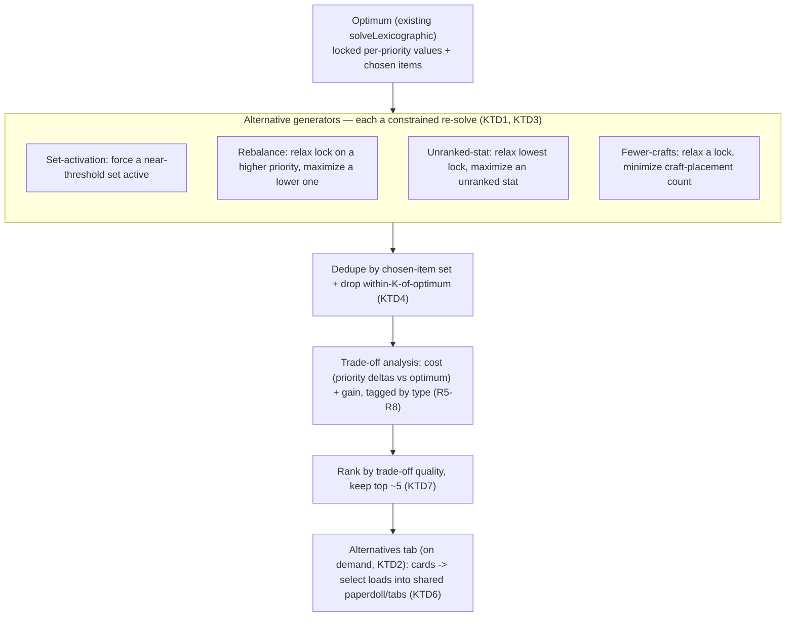

# Alternative Loadouts (Trade-off Driven) - Plan

> **Implementation-ready.** Product Contract (WHAT) enriched with a Planning Contract (HOW) on 2026-07-27. Run `/ce-work` on this file to build it.
>
> **Product Contract preservation:** unchanged — all requirement IDs (R1–R16), acceptance examples (AE1–AE6), and key decisions (KD1–KD5) are carried verbatim from the brainstorm. Planning added the Planning Contract only, and resolved four Outstanding Questions into decisions: the crafting-cost metric (KTD3), the generation trigger (KTD2), and the tolerance and count defaults (KTD7).

## Goal Capsule

- **Objective:** Alongside the single provably-optimal loadout, surface a handful of *near-optimal* alternatives that each give up a small, quantified amount on a lower-ranked priority to gain something meaningful, so a player can see the trade space instead of just the one answer.
- **Product authority:** The user, via the brainstorm dialogue. The solver and data model remain the authority for values; this adds a new *capability* (produce alternatives) plus presentation.
- **Open blockers:** None. Several tunable parameters are recorded as Outstanding Questions, not blockers.

---

## Product Contract

### Summary

The optimizer currently returns exactly one loadout: the provably-optimal build for the player's ranked priorities. This feature adds **trade-off-driven alternatives** — a small set of near-optimal builds that each sacrifice a little on a lower-ranked priority to gain something worthwhile, with the cost and benefit stated explicitly. Alternatives appear in a new **"Alternatives"** results tab; selecting one loads it into the same paperdoll and analysis views used for the optimum. The optimum stays the headline; alternatives are clearly secondary.

### Problem Frame

The strict lexicographic solve answers "what is the single best build for these priorities, in this order?" That is correct but narrow. In DDO, players routinely accept a small loss on one stat to gain a set bonus, a big spike in an unranked stat, or a cheaper build — and the current tool hides that entire trade space behind its one answer. A player who sees only the optimum can't tell whether a nearly-as-good build would suit their character better, and has no way to weigh the give-and-take. Surfacing a few meaningfully-different near-optimal builds, each annotated with what it trades and what it gains, turns a single verdict into a decision the player can actually make.

### Key Decisions

- **KD1 — Alternatives are trade-off driven** (session-settled: user-directed — chosen over "best build per committed set" and "next-best distinct builds (top-K by score)"). An alternative earns its place by trading a small, quantified amount on a lower-ranked priority for a meaningful gain, not merely by scoring second.
- **KD2 — Four gain types count, each tagged** (session-settled: user-directed — all four selected): (a) **activating a set bonus**, (b) **boosting a stat the player did not rank**, (c) **rebalancing among the ranked priorities** (more of a lower one at a small cost to a higher one), (d) **needing fewer/cheaper crafting steps**. An alternative may hit more than one; each gain is labeled.
- **KD3 — The analysis states the variance explicitly** (session-settled: user-directed). Every alternative shows its cost and benefit in concrete terms ("costs 4 Constitution, gains the 5-piece Dread Isle's Curse set" / "-3 on #1 Constitution, +18 on #3 Physical Sheltering" / "3 fewer augments to craft").
- **KD4 — Presentation is a new "Alternatives" result tab with selectable cards** (session-settled: user-approved). It sits alongside Ranked Priorities / Set Bonuses / Loadout Deep Dive. Each alternative is a compact card (trade-off summary + gain tags); selecting one loads it into the paperdoll and the other result tabs so it can be inspected exactly like the optimum, with a clear way back to the optimum.
- **KD5 — The optimum is unchanged and remains primary** (session-settled: user-approved). Alternatives are additive and clearly secondary; the provably-optimal build stays the default headline and its correctness/provability is untouched.

### Requirements

**Generating alternatives**

- R1. Alongside the optimal loadout, the tool produces a small set of **near-optimal alternatives**, each trading a quantified amount on a lower-ranked priority for a meaningful gain.
- R2. Each alternative is **meaningfully distinct** from the optimum and from the other alternatives (not a trivial one-item swap).
- R3. Alternatives are produced **deterministically** — the same query yields the same alternatives — consistent with the tool's "provably optimal, not a guess" framing.
- R4. The solver **capability is presentation-independent**: generating alternatives is a solver/model concern; the optimum's solve is unchanged (mechanism deferred to planning).

**Trade-off analysis (the variance)**

- R5. Each alternative is **tagged by gain type(s)**: set activation, unranked-stat boost, priority rebalance, and/or cheaper crafting (KD2).
- R6. Each alternative states its **cost** explicitly: how much it gives up, and on which ranked priority.
- R7. Each alternative states its **gain** explicitly and quantified where possible: the set gained, the unranked stat(s) boosted and by how much, the rebalanced priority delta, or the reduction in crafting steps.
- R8. When an alternative hits **multiple** gain types, all are surfaced, not just one.

**Presentation**

- R9. A new **"Alternatives"** tab appears in the results, alongside Ranked Priorities / Set Bonuses / Loadout Deep Dive.
- R10. Each alternative renders as a **compact card**: its trade-off summary (cost + gains) and gain-type tags, scannable at a glance.
- R11. **Selecting an alternative loads it** into the paperdoll and the other result tabs (Ranked Priorities, Set Bonuses, Deep Dive), so it can be inspected exactly like the optimum.
- R12. There is a **clear, always-available way to return to the optimum** from any selected alternative.
- R13. The **optimum remains the default and headline**; alternatives read as clearly secondary.
- R14. When **no meaningful alternative exists** (the optimum dominates, or nothing clears the trade-off bar), the tab says so plainly rather than showing weak or empty cards.

**Quality / consistency**

- R15. Alternatives **reuse the existing result surfaces** (paperdoll, attribution, deep dive) rather than a parallel rendering, so a selected alternative looks and behaves like the optimum.
- R16. Generating and presenting alternatives keeps the experience **interactive**; if alternative generation is materially slower than the base solve, it is clearly asynchronous or on-demand rather than blocking the optimum's result.

### Acceptance Examples

- AE1. **Set-activation alternative.** *(Covers R1, R5, R7.)* Given an optimum that is 2/5 of a strong set, when alternatives render, then at least one alternative completes that set, tagged "set bonus", stating "costs N of [priority], gains the 5-piece [set] bonus".
- AE2. **Unranked-stat alternative.** *(Covers R5, R7.)* Given an alternative that boosts a stat the player did not rank, then it is tagged "unranked stat" and states the stat(s) gained and by how much.
- AE3. **Rebalance alternative.** *(Covers R5, R6, R7.)* Given an alternative that shifts value between ranked priorities, then it states the signed deltas ("-3 on #1 Constitution, +18 on #3 Physical Sheltering") and is tagged "rebalance".
- AE4. **Cheaper-crafting alternative.** *(Covers R5, R7.)* Given an alternative that needs fewer crafting steps than the optimum, then it is tagged "cheaper crafting" and states the reduction (e.g. "3 fewer augments, no raid item").
- AE5. **Select and inspect.** *(Covers R11, R12, R15.)* Given the Alternatives tab, when the player selects an alternative, then the paperdoll and the other tabs update to that build, and a control returns them to the optimum.
- AE6. **No meaningful alternative.** *(Covers R14.)* Given a query where the optimum dominates, when the Alternatives tab is opened, then it states that no worthwhile trade-off build was found, with no empty or misleading cards.

### Scope Boundaries

**Outside this work**
- The optimum's solve, correctness, and provability are unchanged; alternatives are strictly additive.
- Not a full side-by-side build-diff/comparison tool beyond each alternative's trade-off summary and the ability to load one into the shared views (a richer diff view is possible later).
- No new query inputs or target types; alternatives derive from the same query as the optimum.
- Item/data model changes only if a "cheaper crafting" cost signal turns out to be missing (see Dependencies).

### Dependencies / Assumptions

- Builds on the existing solver (`web/solver.js`, HiGHS-WASM MILP, staged lexicographic) and program; the solver gains an alternative-generation capability.
- Reuses the just-shipped tabbed results UI and the paperdoll / attribution (`attributionByTarget`, `whyThis`) / Loadout Deep Dive renderers in `web/results.js`.
- The set-activation, unranked-stat, and rebalance gains are computable from data the solver already has (chosen items, per-target values, set membership, and the per-bucket contribution state the attribution readers already expose).
- **The "cheaper crafting" gain needs a crafting-cost / attainability signal.** The dataset carries craft prescriptions (augments, seals, Dino inserts, Nearly-Complete, Viktranium, raid items) but not necessarily a cost or rarity metric to compare builds by. Whether a usable signal exists, or a simple proxy (count of crafting steps / raid-sourced pieces) suffices, is a planning/data question (see Outstanding Questions). This is an unverified assumption, flagged rather than asserted.

### Outstanding Questions

- **Tolerance:** how near "near-optimal" must be (e.g. within a small percentage of the optimum on the top priority, or giving up at most a bounded amount on any higher-ranked priority). Needs a default and possibly a user-visible knob.
- **Count:** how many alternatives to surface (a handful; exact number TBD), and how to rank/pick which trades are most worth showing when many qualify.
- **Trigger:** compute alternatives automatically on every solve, or on demand (a button / opening the tab), depending on cost (R16).
- **Crafting-cost metric:** what defines "cheaper" for the crafting gain (count of augments/seals/raid items, a rarity weight, or a simpler proxy), and whether the data supports it (Dependencies).
- **Multi-gain ranking:** when an alternative hits several gains, how it is ordered/emphasized relative to single-gain alternatives.

### Sources / Research

- Brainstorm dialogue (this session): trade-off-driven definition, the four gain types, the explicit cost/benefit analysis, and the Alternatives-tab presentation.
- Current solver output surface: `web/solver.js` `solveLexicographic` (single optimum; `perTarget`, `effective`, `chosen`, the `*Placed` craft lists, `breakdown`, `program`).
- Current result surfaces (reused): the tabbed results + paperdoll + attribution + Loadout Deep Dive in `web/results.js` (shipped this session on branch `fix/ui-controls-paperdoll-hero`).
- Motivating context: the strict lexicographic optimum hides the trade space players actually reason about (sets, unranked stats, attainability).

---

## Planning Contract

### High-Level Technical Design

The optimum is found today by a staged lexicographic solve: `solveLexicographic` maximizes each ranked target in priority order, **locking** each achieved value before moving to the next, then a tie-break minimize. Every alternative reuses that exact machinery with two twists — **relax** one of those locks (allow a small, bounded give on a higher-ranked priority) and **re-optimize toward a gain** (force a set active, maximize a lower priority, maximize an unranked stat, or minimize crafting steps). Each generator is one deterministic re-solve. The results are deduped, tagged, and ranked; the tab computes them on demand.

Trigger: the optimum solves and renders as it does today; the generators run only when the player opens the Alternatives tab, so the base solve stays instant (KTD2).

### Key Technical Decisions

- **KTD1 — Alternatives are generated by relax-and-re-optimize, reusing the lexicographic solver.** Each alternative is one full re-solve of the existing program (`web/solver.js` `buildProgram`/`encodeStage`) with a relaxed lock plus a gain objective/constraint — not a generic top-K enumeration of the MILP. *(session-settled: user-directed — chosen over top-K enumeration; instantiates KD1.)*
- **KTD2 — Alternatives compute on demand when the Alternatives tab is opened**, not eagerly on every solve. Each generator is a ~300ms re-solve; deferring keeps the optimum's result instant. A brief "computing alternatives…" state covers the wait. *(session-settled: user-directed — chosen over eager per-solve generation.)*
- **KTD3 — Four gain generators; "cheaper crafting" = fewer crafting *steps*.** Set activation, priority rebalance, and unranked-stat gains are computable from existing solution state. "Cheaper crafting" is measured as the **count of craft placements** (augments + seals + Dino inserts + Nearly-Complete + Viktranium, from the `*Placed` lists), because the dataset has **no rarity / raid-tier / cost field** (verified: item fields are `location_quest`, `binding`, `source_item`, `tier_label`, `nc_tier` — none is a cost metric). Raid-item-attainability as a cost signal is a deferred follow-up. (AE4's "no raid item" phrasing is illustrative only; under the count-based metric the *demonstrated* signal is the reduction in craft-step count, e.g. "3 fewer augments" — the raid-item facet is deferred.) *(session-settled: user-directed; instantiates KD2 and resolves an Outstanding Question.)*
- **KTD4 — Distinctness is enforced post-hoc, not by exclusion constraints.** After generation, dedupe candidates by their chosen-item set and drop any within K different slots of the optimum or of a kept alternative. The gain objectives naturally produce different builds; post-hoc filtering is simpler and stays deterministic. **The dedupe threshold K (KTD4) and the give tolerance (KTD7) must be co-tuned:** the exact-equality lexicographic optimum already maximizes each lower priority within the higher locks, so a *small* give tends to re-solve near the optimum — which K then discards, and common queries could routinely yield zero surviving alternatives (the tab would read as broken). The rebalance/unranked/fewer-crafts gains and set-activation mitigate this, but the two constants pull against each other and must be measured together (U6). *(planning-derived.)*
- **KTD5 — Determinism is preserved *by design*, via the tie-break.** Each generator maximizes its gain **then runs the existing tie-break minimize** to pin the chosen build (U1) — the assignment is deterministic even when the gain objective is degenerate, not reliant on HiGHS being run-to-run reproducible. Ranking is a defined total order (per-type magnitude, a fixed interleave, then a stable tie-break — see U3). No randomness enters, consistent with the "provably optimal, not a guess" framing. *(planning-derived; instantiates R3.)*
- **KTD6 — The Alternatives tab reuses the shipped result surfaces.** It is a fourth result tab wired like the existing three (`wireResultTabs` in `web/results.js`). Selecting a card re-renders the paperdoll + Ranked Priorities + Set Bonuses + Loadout Deep Dive with the alternative as the "current" build; a persistent control returns to the optimum, which stays the default. *(session-settled: user-approved; instantiates KD4, KD5.)*
- **KTD7 — Defaults are named constants, tunable in one place.** Up to **5** alternatives surfaced; an alternative qualifies only if it gives up at most a **bounded amount on any higher-ranked priority** (a small percentage or absolute floor, set as a constant). These resolve the tolerance/count Outstanding Questions with sensible defaults without a user-facing knob for now. *(planning-derived; resolves Outstanding Questions.)*
- **KTD8 — This adds solver capability; it is NOT presentation-only.** Unlike the recent UI work, this feature extends `web/solver.js` with alternative generation. The optimum's solve, correctness, and provability are untouched (KD5), but the diff is not display-only.

### Implementation Units

### U1. Constrained re-solve primitive
- **Goal:** A single reusable function that solves the existing program with extra constraints (relaxed locks, forced binaries) and a chosen objective, returning a solution in the **same enriched shape `solveLexicographic` produces** (the `readSolution` fields **plus `breakdown` and `capped`**), so a selected alternative can drive the shared renderers unchanged.
- **Requirements:** R1, R3, R4; KTD1, KTD5.
- **Dependencies:** none.
- **Files:** `web/solver.js` (extend/wrap `encodeStage` to accept extra constraints, relaxed locks, and an arbitrary linear objective; add `solveConstrained(program, highs, opts)`), `tests/alternatives.test.js` (new).
- **Approach:** `encodeStage` already appends an `extraConstraints` list and takes `locks` + an objective. Add three things: **relaxed locks** (`stat >= value - give` instead of the exact lock); a passthrough for **forced constraints** (e.g. `set_active = 1`); and a **generalized objective** — today `encodeStage` builds its objective only from a single stat (`effectiveExpr(objectiveStat)`) or the tie-break, so extend it to accept an **arbitrary linear expression** (needed by the fewer-crafts generator, which minimizes the sum of the augment/dino/nc/vik/seal placement binaries that back the `*Placed` lists). **`solveConstrained` runs TWO solves, mirroring `solveLexicographic`'s final stage:** (1) maximize/minimize the gain objective under the constraints, then (2) lock the achieved gain value and run the existing tie-break minimize (`{ sense: "min", tieBreak: true, locks }`). Without step 2 the gain optimize is degenerate — maximizing a 0/1 set-active binary or an unranked stat leaves many builds tied and HiGHS returns an arbitrary one — so the *chosen item set* (which feeds dedupe, cost deltas, the paperdoll) would not be pinned. The tie-break makes the assignment deterministic by design. **The return must include `breakdown: breakdownByTarget(program, prim)` and `capped` (as `solveLexicographic` does)** — `readSolution` alone omits `breakdown`, and the shared attribution / Deep-Dive renderers read `result.breakdown`, so without it a selected alternative would render with empty attribution (R15/AE5). Reader/solver only; the optimum path is unchanged.
- **Patterns to follow:** `encodeStage` and its `extraConstraints`/`locks`/objective handling and the final tie-break stage of `solveLexicographic`; `readSolution` and `breakdownByTarget`/`computeScale`/`capped` assembly in `solveLexicographic` (`web/solver.js`).
- **Test scenarios:** *Covers R3.* a relaxed lock lets a target drop by up to the give and no more; a forced set-active binary yields a solution with that set active; **the returned object carries `breakdown` and `capped`** (so the shared renderers work for an alternative); the tie-break pins the identical item set across two runs (determinism); an infeasible forced constraint returns a clean "no solution" rather than throwing.
- **Verification:** `node tests/alternatives.test.js` green against the real HiGHS engine; the optimum solve is byte-identical to before (no regression in `tests/solver.test.js`).

### U2. The four gain generators
- **Goal:** Produce candidate alternatives, one family per gain axis, each via `solveConstrained`.
- **Requirements:** R1, R5, R7; KTD1, KTD3.
- **Dependencies:** U1.
- **Files:** `web/solver.js` (add `generateAlternatives(program, highs, optimum, opts)` dispatching the four generators), `tests/alternatives.test.js`.
- **Approach:** From the optimum and the program, build candidates:
  - **(a) set-activation** — for each set that is near threshold, force it active (`set_active = 1`) and re-solve. Reuse `nearMissSetHints` / the program's `setMeta`/`realPieces`. **Limitation (from the code):** the program only carries a `set_active` var for sets whose tier advances a *ranked* target (`nearMissSetHints` filters on the targets, and `buildProgram`'s `setMeta` skips tiers with no target contribution) — so a set that boosts only unranked stats has no binary to force and cannot be produced this way. Noted in Open Questions.
  - **(b) rebalance** — relax only the **one** higher-ranked priority lock being traded from (to `>= value - give`), **keep every other priority lock pinned at its exact optimum value**, and maximize a lower-ranked priority. Pinning the intermediates is essential: if they were dropped, maximizing a low priority could crater a middle one far past the tolerance bar (KTD7), yielding a bad build or nothing.
  - **(c) unranked-stat** — **first** maximize a promising unranked stat with **all locks intact** (a possible *zero-cost* strict improvement, since the optimum's tie-break minimizes item index, not free stats, so an unranked stat can often rise at no cost); only if that yields nothing, relax the lowest priority's lock and try again. Label a zero-cost result as a **strict improvement** ("gains +N [stat] at no cost"), not a "costs X" trade (candidate stats drawn from what the chosen pool can boost).
  - **(d) fewer-crafts** — relax a lock and **minimize the craft-placement count** via U1's generalized objective (the sum of the augment/dino/nc/vik/seal placement binaries backing the `*Placed` lists).
  Each returns `{ solution, perTarget, gainAxis }`. Bounds the number of re-solves per axis (rebalance is O(priority-pairs), unranked-stat O(candidate-stats)) so the tab stays responsive (KTD2, KTD7).
- **Execution note:** Start proof-first — write a `tests/alternatives.test.js` case per generator asserting the intended gain against a small real-HiGHS fixture, and watch it fail before implementing the generator.
- **Patterns to follow:** `nearMissSetHints` (`web/results.js`), `setMeta`/`realPieces` and the `*Placed` collection in `readSolution` (`web/solver.js`).
- **Test scenarios:** *Covers AE1, AE2, AE4.* set-activation returns a build with a near-threshold set now active; rebalance returns a build with a higher value on a lower priority at a bounded cost to a higher one; unranked-stat returns a build with a higher value on a stat not in `query.targets`; fewer-crafts returns a build with strictly fewer craft placements; a generator with no valid gain returns nothing rather than a degenerate copy of the optimum.
- **Verification:** each generator's intended gain holds on the fixtures; `node tests/alternatives.test.js` green.

### U3. Trade-off analysis, dedupe, and ranking
- **Goal:** Turn raw candidates into a ranked, de-duplicated, tagged set of alternatives with an explicit cost/benefit each.
- **Requirements:** R2, R5, R6, R7, R8; KTD4, KTD5, KTD7.
- **Dependencies:** U2.
- **Files:** `web/results.js` (or a small `web/alternatives.js`) — `analyzeAlternative(optimum, candidate, query)` and `rankAlternatives(candidates, optimum)`; `tests/alternatives.test.js`.
- **Approach:** For each candidate compute the **cost** (per-priority signed deltas vs the optimum, naming which priorities dropped and by how much) and the **gain** (the set gained, the unranked stat(s) and amounts, the rebalanced-priority delta, or the reduction in craft count), and the **gain-type tag(s)** — a candidate may earn several (R8). Dedupe by the chosen-item set; drop any within K different slots of the optimum or a kept alternative (KTD4). **Ranking is defined per gain type, then interleaved — there is no cross-type "gain magnitude" (a categorical set, a stat delta, and a craft-count reduction are not commensurable).** Rank *within* each type by a per-type magnitude — **set:** pieces completed; **unranked-stat:** summed stat delta (zero-cost strict improvements first); **rebalance:** gained lower-priority delta; **fewer-crafts:** craft-count reduction — then merge across types by a **fixed gain-type priority order** (a named constant), with `(cost ascending, stable variant-id key)` as the tie-break, and keep the top N (KTD7). Pure functions, deterministic.
- **Patterns to follow:** the attribution readers (`attributionByTarget`, `whyThis`) and `activeSetDetail` in `web/results.js` for reading per-target and set state.
- **Test scenarios:** *Covers R2, R6, R7, R8.* a candidate that completes a set is tagged "set" with "costs N [priority], gains the M-piece [set]"; a candidate that both rebalances and adds an unranked stat carries both tags; two candidates with the same item set dedupe to one; a candidate within K slots of the optimum is dropped; ranking is stable across runs (determinism); more than N qualifying candidates keep exactly the top N.
- **Verification:** analysis strings match the fixtures; dedupe/rank deterministic; `node tests/alternatives.test.js` green.

### U4. Alternatives result tab (on-demand generation)
- **Goal:** A fourth result tab that generates alternatives on first open and renders them as trade-off cards.
- **Requirements:** R9, R10, R14, R16; KTD2, KTD6.
- **Dependencies:** U3.
- **Files:** `web/results.js` (add the "Alternatives" tab + panel to the result-tabs markup and `wireResultTabs`; a `renderAlternatives` that lazy-generates on first open), `web/styles.css` (card styles), `web/query.js` (pass the `highs` instance / a re-solve capability through so the tab can generate).
- **Approach:** Add the tab alongside Ranked Priorities / Set Bonuses / Loadout Deep Dive. On first activation the tab has **three states**: (1) a brief "computing alternatives…" state during generation; (2) the rendered cards; (3) an **empty state** when none qualify (R14). Run `generateAlternatives` → `rankAlternatives`, then render each as a **compact card**: its cost/benefit summary and gain-type tags (R10). If generation **throws or a re-solve fails**, replace the computing state with a plain **error message + a retry control** (distinct from the R14 "no worthwhile trade-off" empty state) so the tab never hangs silently. Cache the computed alternatives so re-opening the tab is instant. Because generation needs the solver, thread the `highs` handle (or a bound re-solve function) from `web/query.js` into the render (the results currently receive only the finished result). **Mobile:** the cards stack single-column at ~390px and the trade-off summary + gain tags wrap without overflow (verified in U6 against this stated intent, not just a pass/fail overflow check).
- **Patterns to follow:** `wireResultTabs` and the tab markup in `web/results.js`; the `getHighs()`/solve wiring in `web/query.js`.
- **Test scenarios:** *Covers R10, R14.* the pure card-rendering function produces a card with the trade-off summary and gain tags for a given analyzed alternative; the empty-state renders when the alternative list is empty. (Tab interaction, lazy generation, and the computing state are browser-verified in U6.)
- **Verification:** opening the tab generates and shows cards; a second open is instant (cached); no-alternative case shows the empty state.

### U5. Select an alternative to inspect; return to optimum
- **Goal:** Selecting an alternative loads it into the shared result surfaces; a control returns to the optimum.
- **Requirements:** R11, R12, R13, R15; KTD6.
- **Dependencies:** U4.
- **Files:** `web/results.js` (a "current build" indirection so the paperdoll + Ranked/Sets/Deep Dive render either the optimum or a selected alternative; a persistent "back to optimum" control; a selected-state marker on the chosen card), `web/styles.css`.
- **Approach:** Introduce a lightweight "active build" concept: the paperdoll and the other three tabs render whichever build is active (optimum by default). Selecting an alternative card sets it active and re-renders those surfaces from the alternative's solution (it has the same shape as the optimum, so the existing renderers apply directly — R15). Selecting does not recompute; it reuses the cached alternative.
  - **Card a11y:** the alternative cards are a keyboard-operable single-select group — the list is `role="listbox"`, each card `role="option"` with `aria-selected` reflecting the active build, roving tabindex, and Enter/Space to select — mirroring the ARIA the existing result tabs use (they are a *new* interactive control `wireResultTabs` does not cover).
  - **Active-build indicator (R13):** when an alternative is active, the shared surfaces show a **persistent, globally-visible "Viewing alternative — return to optimum" banner/control** (placed with the result-tab strip so it is visible from every tab, not only the Alternatives tab), so a player reading Ranked Priorities / Set Bonuses / Deep Dive never mistakes an alternative's numbers for the optimum's. The optimum stays the default headline.
  - **Non-visual feedback:** selecting a card announces the active-build change via an `aria-live` region (and/or moves focus to the updated view) so screen-reader users perceive the swap.
- **Patterns to follow:** `renderResults` and the shared paperdoll/attribution/deep-dive renderers in `web/results.js`; the WAI-ARIA listbox pattern for the cards; the result-tab ARIA already in `wireResultTabs`.
- **Test scenarios:** *Covers AE5.* rendering with an alternative as the active build shows that build's items in the paperdoll and its values in Ranked Priorities; the active-build banner appears when an alternative is active and is gone for the optimum; the "return to optimum" path restores the optimum; the optimum is the initial active build; a card exposes `role="option"` + `aria-selected`. (Keyboard select, focus/announce, and banner visibility browser-verified in U6.)
- **Verification:** selecting a card swaps the paperdoll + tabs to the alternative; returning restores the optimum; optimum is default.

### U6. Quality gate
- **Goal:** Prove the solver capability and the UX end to end.
- **Requirements:** all; KTD5, KTD8.
- **Dependencies:** U1–U5.
- **Files:** `tests/alternatives.test.js` (real-HiGHS), `tests/results.test.js` (card/render helpers), browser verification.
- **Approach:** Unit suites green (Python + every `tests/*.test.js`, including the new `tests/alternatives.test.js` run in CI via the existing `for t in tests/*.test.js` loop). Serve `web/` and drive Chrome at desktop + a 390px viewport: run a real solve, open the Alternatives tab (verify the computing state then cards), confirm the optimum solve stayed instant, select an alternative by **keyboard** as well as click (paperdoll + tabs swap; the active-build banner appears and is visible from every result tab), return to the optimum (banner gone), confirm the **empty state** on a query with no worthwhile trade, and confirm the cards stack cleanly with no overflow at 390px. (The error/retry state is exercised by unit-testing the tab's error branch, since a live solver failure is hard to induce in-browser.) Then `ce-code-review`, PR, merge/deploy, live re-verify.
- **Execution note:** This unit is the gate; prefer runtime/browser verification over new unit coverage for the interaction paths.
- **Hit-rate + latency validation (from review):** before shipping, measure across a representative set of real queries (a) the **surviving-alternative hit-rate** — how often ≥1 alternative survives dedupe — and co-tune the give/K constants (KTD4/KTD7) so the feature is not routinely empty; and (b) the **aggregate first-generation time** across all four generators (the O(priority-pairs)/O(candidate-stats) re-solve counts), confirming the on-demand budget (R16) holds. Record the chosen constants and the observed hit-rate/timing.
- **Test scenarios:** *Covers AE3, AE5, AE6.* the browser checks above; the error/retry branch of the Alternatives tab (unit-tested); plus the determinism check (same query yields the same alternatives, same order, across two runs).
- **Verification:** is itself the gate.

### Sequencing
U1 → U2 → U3 (the solver + analysis pipeline, in order) → U4 → U5 (UI, in order) → U6 (last). U1–U3 are solver/logic and can be built and tested against real HiGHS before any UI; U4–U5 layer the tab and selection on top.

### Verification Contract
- **Unit (JS, `tests/*.test.js`, Node + `assert`):** `tests/alternatives.test.js` against the real HiGHS engine — the constrained re-solve (relaxed lock bound, forced set-active, determinism, infeasible-clean), each of the four generators' intended gain, and trade-off analysis + dedupe + ranking (tags, cost/gain strings, within-K drop, stable top-N). `tests/results.test.js` extended for the pure card/empty-state renderers. All existing JS + Python suites stay green, and the optimum solve is unchanged.
- **Integration / browser (the R16 gate):** localhost + Chrome at desktop and 390px. Checks: the base solve renders instantly (alternatives not computed until the tab opens); opening the tab shows the computing state then cards; a second open is instant; selecting a card swaps the paperdoll + Ranked/Sets/Deep Dive to the alternative; the "back to optimum" control restores it; the no-alternative query shows the empty state; no page overflow; no console errors.
- **CI:** the new `tests/alternatives.test.js` is picked up by `.github/workflows/deploy.yml`'s `for t in tests/*.test.js` loop.

### Definition of Done
- R1–R16 satisfied; AE1–AE6 demonstrated.
- All unit suites green (Python + every `tests/*.test.js`); browser-verified at desktop + 390px with observations recorded.
- The optimum's solve, correctness, and provability are unchanged; alternatives are additive and computed on demand.
- `ce-code-review` run and its P0/P1 findings resolved.
- Merged to `main`; deploy workflow succeeds; live site re-verified.

### Open Questions (deferred to implementation)
- **Exact tolerance and count constants (KTD7):** the precise "bounded give" (percentage vs absolute, per-priority) and N — pick sensible defaults at implementation and tune against real solves; a user-facing knob is out of scope for now.
- **Unranked-stat candidate selection (U2c):** which unranked stats are worth maximizing (all boostable stats vs a curated set) — resolve by what produces useful, non-noise alternatives on real data.
- **Per-axis re-solve budget:** how many re-solves each generator may run before the tab feels slow (KTD2) — measure and cap during implementation.
- **Multi-gain ranking:** when one alternative earns several gain tags (R8), how it is ordered/emphasized relative to single-gain alternatives — U3's tag-and-rank covers the mechanics; the emphasis heuristic is tuned at implementation.
- **Set-activation limited to ranked-target sets (from review):** the program only carries a `set_active` var for sets whose tier advances a ranked target, so a set boosting only unranked stats cannot be forced as a set-activation alternative. Whether to widen the program to add such vars (so those sets can be surfaced) is a follow-up, not in this scope.

### Deferred to Follow-Up Work
- **Raid-item / rarity attainability** as a "cheaper crafting" signal — needs a cost/rarity/source-tier field the dataset does not currently carry (KTD3); a data-enrichment effort of its own.
- **A user-facing tolerance/count knob** for how many alternatives and how much give to allow.
- **A side-by-side diff view** of an alternative against the optimum beyond the per-card trade-off summary.

