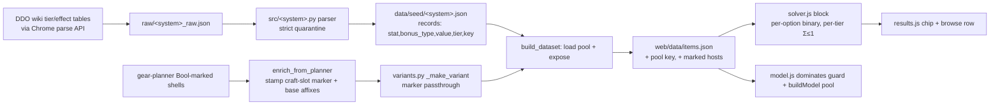
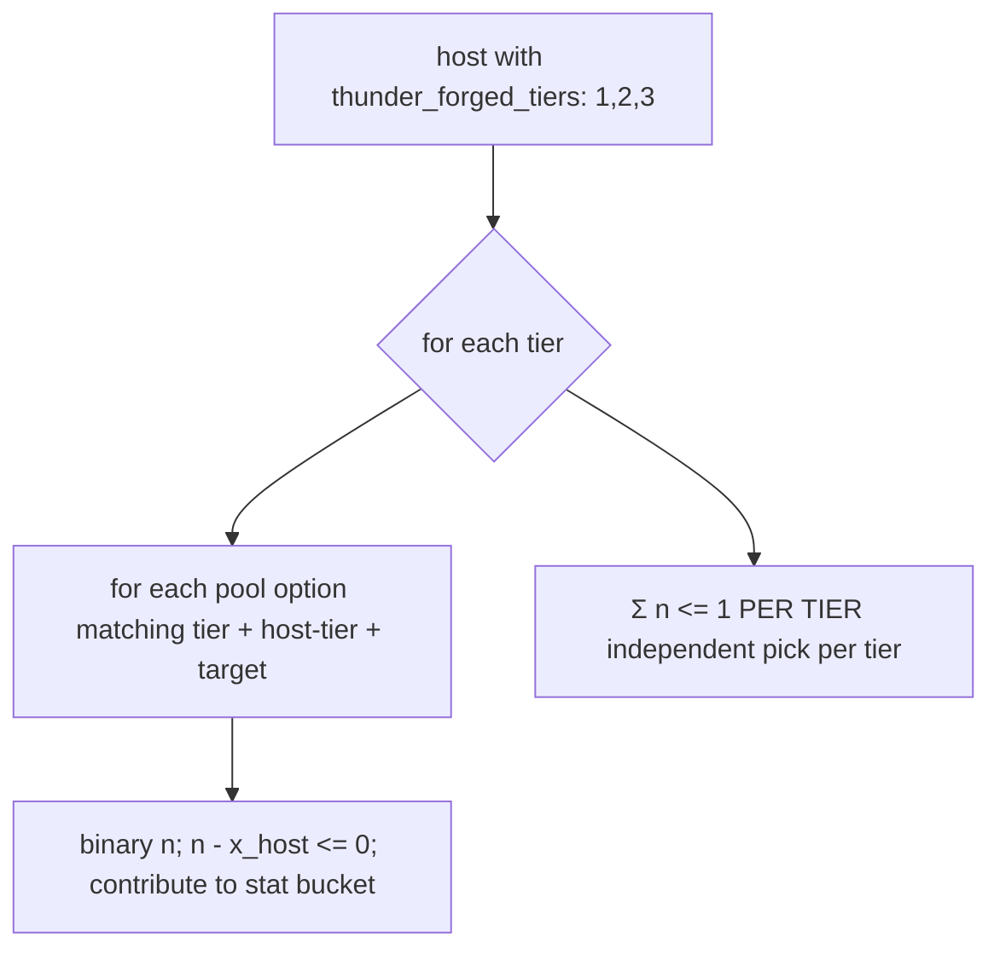

# Legendary Thunder-Forged + Green Steel — Endgame Crafting Choice-Slots - Plan

## Goal Capsule

**Objective.** Extend crafting coverage to the two older Legendary crafting systems that still win slots at ML30+ — **Legendary Thunder-Forged** and **Legendary Green Steel** — by modeling each as a **configurable choice-slot** on its host items, so the optimizer picks the craftable configuration that best serves a build's ranked targets. No new solver mechanism: both reuse the shipped gated-contribution choice-slot primitive.

**Why now.** The endgame band (ML30-36 named/raid gear) and the expansion crafts (Dino, Viktranium, Nearly Complete, Vecna) are solver-active, but Thunder-Forged and Green Steel — both endgame-relevant for their unique effects — are only browse-indexed (37 and 85 roster entries; no craftable options modeled). A build that would slot a Legendary Thunder-Forged weapon or a Legendary Green Steel item currently gets a result that silently omits those options.

**Product authority.** **Product Contract unchanged** (carried verbatim from the requirements brainstorm). This document adds the Planning Contract (HOW).

**Open blockers.** None. Both fit an existing primitive; the craftable option menus are wiki-sourced during implementation.

---

## Product Contract

### Primary actor & outcome
A DDO player theorycrafting an ML30+ build gets an optimizer result that accounts for the **craftable configurations** of Legendary Thunder-Forged and Legendary Green Steel gear — the solver picks the tier/option config that best advances the ranked targets and prescribes it — so results for builds that use these systems are genuinely optimal, every value wiki-traceable.

### In scope
- **Legendary Thunder-Forged** — a **multi-tier affix choice-slot**: each host item exposes Tier 1 / 2 / 3 picks; each tier is a single-pick over that tier's menu; the solver chooses the config best serving the ranked targets. Attach to the ~37 indexed TF items; source the tier menus from the wiki.
- **Legendary Green Steel** — a **choice-slot over an endgame-relevant option pool** (the SP/HP/Insightful/Quality/proc craftable effects that appear in real ML30+ builds), wiki-sourced, attached to the relevant Green Steel host items (~85 indexed). The solver picks the best craftable config per build.
- Both reuse the shipped **gated-contribution choice-slot primitive** (same shape as Nearly Complete / Viktranium / seal): a per-option binary gated by the host being equipped, single-pick per tier/slot, feeding the same `(stat, bonus_type)` buckets.

### Out of scope (deferred)
- **Slave Lords crafting** — heroic/mid, not endgame BiS. Its set bonuses already exist in the catalog; items stay browse-only.
- **Essence / Cannith crafting** — universal; generic Enhancement affixes rarely beat named BiS.
- **Full/exhaustive Green Steel combinatorial space** — only the endgame-relevant subset; niche configs disclosed as out-of-scope per result.
- **Thunder-Forged / Green Steel set bonuses** (equip-multiple) — if present, flow through the existing `set_active` machinery + catalog, separate from this choice-slot work (see Open Questions).

### Success criteria
- The ~37 Thunder-Forged and the relevant Green Steel host items are solver-active with their craftable choice-slots; a query whose targets favor a TF/GS config equips the host and the result prescribes the exact tier/option picks.
- Each craftable option is wiki-traceable; any option with no explicit magnitude is quarantined with a reason + `wiki_url`, never inferred.
- Bonus-type stacking holds across the crafted config and the rest of the loadout.
- Deterministic under the staged lexicographic solve; results disclose Green Steel's endgame-relevant cutline.
- No new solver primitive — the diff is data + choice-slot attachment + tests, mirroring the seal/Nearly-Complete pattern.

### Key decisions
- **Endgame-BiS driver** *(session-settled: user-directed — chosen over completeness and tractability-first).*
- **Both systems in scope** *(session-settled: user-directed — both still slot at ML30+; Slave Lords + Essence out).*
- **Choice-slot fit, no new mechanism** *(session-settled: user-approved).*
- **Green Steel = endgame-relevant subset** *(session-settled: user-directed — chosen over full menu / slot-class-first).*

---

## Research Summary

The three shipped choice-slot systems — **Nearly Complete**, **Viktranium/"Lamordia"**, **Seal** — share ONE gated-contribution solver primitive. **Viktranium is the exact structural template for multi-tier Thunder-Forged** (its `lamordia_slots` is a LIST, iterated with a per-slot `Σ≤1`); **Seal is the template for single-pick Green Steel** (a flat pool keyed by one field). Every layer below has a concrete template to mirror.

- **Item marker survives expansion via an explicit field list.** `src/variants.py:_make_variant` (`:40-75`) rebuilds each variant from a fixed field list; a marker not listed is silently dropped. Existing markers pass through at `:64-71` (`nearly_complete`, `nc_tier`, `lamordia_slots`, `seal_slots`). **Adding the new marker field here is the #1 trap** (`docs/solutions/design-patterns/milp-encoding-for-gear-optimization.md` guidance #6 — the recurring "value-carrying dimension not read" bug class).
- **Hosts are pre-marked in the gear-planner import.** `data/seed/compendium/raw/gearplanner_items.json` carries `{type:"Bool"}` marker affixes on the shells — 43 `Thunder-Forged Alloy *` (Bool `"Thunder-Forged"`) and 97 `Green Steel *` (Bool `"Green Steel"` / `"Legendary Taint of Shavarath"`). `scripts/enrich_from_planner.py:91-119` already detects the analogous seal Bool markers and stamps `seal_slots`; the exact same path stamps a TF/GS marker onto the enriched host in one step.
- **Option pools are greenfield.** `gearplanner_crafting.json` has NO Thunder-Forged / Green Steel keys (only Viktranium's `(slot_type, category)` pools). The craftable option magnitudes must be **freshly harvested from the wiki** (like Viktranium's raw tables), via the same-origin MediaWiki parse API in Claude-in-Chrome (`docs/gear-and-crafting-assessment.md`).
- **Parser + strict provenance.** Each system: seed JSON (`data/seed/<system>.json`) + parser (`src/<system>.py`) → `{records, quarantined, coverage}`, record shape `{stat, bonus_type, value, unit, + key fields}`. Common quarantine idiom: canonical key + `bonus_type ∈ affix_parser.BONUS_TYPES` + normalized `stat` (`vocab.normalize_stat`) + integer `value` + non-empty `wiki_url`; anything else → `quarantined` with a reason, never inferred (`src/seal.py:44-85`, `src/viktranium.py:208-255`).
- **Solver blocks** (`web/solver.js`, all in `buildProgram`): Viktranium `:284-316` iterates `lamordia_slots` (list) giving each slot its own `Σ≤1` — the TF multi-tier template; Seal `:318-352` is a flat single-field-keyed pool — the GS template. Host gate `n - x_item <= 0`, bucket contribution into `zByBucket`, meta map (`vikMeta`/`sealMeta` `:85-86`), `*Placed` extraction `:682-688`, tie-break coefficients `:657-659,:888-899`.
- **Dominance guards** (`web/model.js:dominates` `:64-129`): a choice-slot's value lives outside `variantBuckets`, so a slot-only host is pruned by any affix rival unless guarded. Viktranium multiset guard `:94-101` (`lamordiaSlotKeys`), Seal `:102-109`. Tier boundary is load-bearing and per-system: `lamordiaTier` uses **ML≥30** (not 35) because real Lamordia hosts are ML34 — **TF must pick its own boundary explicitly** (Legendary TF is ~ML28-29).
- **Threading + UI.** `buildModel` signature (`model.js:203`) + target-filtered pools (`:261-274`) + call site (`web/query.js:147`); results chips `web/results.js:craftChips` (`:277-295`) + browse rows (`web/browse.js`).
- **Test templates.** solver.test.js (Viktranium two-slot test `:738-752` for TF multi-tier; seal single-pick `:916` for GS), model.test.js dominance regressions (`:203-230`), python parser tests (`tests/test_viktranium.py`, `tests/test_seal.py`).

---

## Key Technical Decisions

### KTD1 — Mirror Viktranium for Thunder-Forged, Seal for Green Steel
No new solver mechanism. TF = a per-tier list marker + tier-keyed pool + per-tier `Σ≤1` (Viktranium shape). GS = a flat single-field-keyed pool + one `Σ≤1` per slot (Seal shape). *(instantiates the session-settled "choice-slot fit, no new mechanism".)*

### KTD2 — Enrich hosts from the gear-planner Bool-marked shells
Detect the existing `{type:"Bool"}` "Thunder-Forged" / "Green Steel" markers in `enrich_from_planner.py` (same path as seal Bool detection) and stamp the craft-slot marker; the shells carry base affixes too, so hosts become solver-active AND slot-marked in one step. Avoids a separate item-discovery/index effort.

### KTD3 — Thunder-Forged tier boundary chosen explicitly
Do not inherit Viktranium's ML≥30 boundary. Legendary Thunder-Forged is ~ML28-29; the tier derivation (a `tf_tier` field or an explicit ML boundary in a single-source-of-truth helper mirroring `lamordiaTier`) must be set from the wiki-confirmed TF tier structure, or every host mis-tiers.

### KTD4 — Green Steel option pool = endgame-relevant subset, disclosed
The pool seed contains only the wiki-sourced craftable effects that win ML30+ slots (Concordant Opposition, specific Insightful/Quality/Profane lines, top SP/HP/proc). The cutline + rationale is recorded in the seed metadata and disclosed per result. Strict provenance: no inferred values.

### KTD5 — New marker field added to `_make_variant` + dominance guard + regression test
Both markers (`thunder_forged_tiers`, `green_steel_slot`) added to the `src/variants.py:_make_variant` passthrough list, to `dominates()` in `web/model.js` (TF multiset by tier key, GS single-field), and each pinned by a `tests/model.test.js` regression (affix rival must NOT dominate a slot-only host). This is the recurring 3×-bug checklist from the MILP learnings doc.

---

## High-Level Technical Design

The end-to-end path for one choice-slot system (identical primitive for both; TF has N tier-slots, GS has one):

Thunder-Forged per-tier solver shape (mirrors Viktranium's `lamordia_slots` iteration):

---

## Implementation Units

### U1. Source the Thunder-Forged tier option pool
**Goal:** the craftable Tier 1/2/3 option menus for Legendary Thunder-Forged exist as parsed records.
**Requirements:** In-scope "Legendary Thunder-Forged … source the tier menus"; KTD3.
**Dependencies:** none.
**Files:** `data/seed/compendium/raw/thunder_forged_raw.json` (harvested wikitext staging, new), `data/seed/thunder_forged.json` (new), `src/thunder_forged.py` (new parser), `tests/test_thunder_forged.py` (new).
**Approach:** Harvest the Thunder-Forged crafting tier tables from the wiki via the Chrome parse API into `<pre>`→repo (server-side fetch blocked). Parse to records `{tier, stat, bonus_type, value, unit, wiki_url}` — key is `tier`. Confirm the tier structure + the Legendary tier boundary (KTD3) from the wiki. Strict quarantine (mirror `src/viktranium.py:parse_pools`): non-magnitude/proc lines flagged with reason, never inferred.
**Patterns to follow:** `src/viktranium.py:208-255` (per-tier records, quarantine), `src/nearly_complete.py:35-70`.
**Test scenarios:**
- A clean tier option parses to the right `(tier, stat, bonus_type, value)` tuple.
- A proc/non-magnitude tier line is quarantined with a reason, not minted.
- Coverage reports options-per-tier; sign captured on any negative line.
**Verification:** `parse` returns records across all tiers with a quarantine list; `python3 tests/run_tests.py test_thunder_forged` green.

### U2. Source the Green Steel endgame-relevant option pool
**Goal:** the endgame-relevant Green Steel craftable effects exist as a flat parsed pool, with the cutline recorded.
**Requirements:** In-scope "Green Steel … endgame-relevant option pool"; KTD4.
**Dependencies:** none.
**Files:** `data/seed/compendium/raw/green_steel_raw.json` (new), `data/seed/green_steel.json` (new), `src/green_steel.py` (new parser), `tests/test_green_steel.py` (new).
**Approach:** Harvest the Legendary Green Steel craftable effects from the wiki; select the endgame-relevant subset (KTD4) and record the cutline + rationale in the seed metadata. Parse to a flat pool keyed by a single field (mirror Seal): `{green_steel_type or slot, stat, bonus_type, value, unit, name, wiki_url}`. Strict quarantine.
**Patterns to follow:** `src/seal.py:44-112` (flat single-field pool, coverage/pending disclosure).
**Test scenarios:**
- Each endgame option parses to explicit tuples; a descriptive/proc line is quarantined.
- The seed metadata records the endgame cutline (disclosure honesty).
- Coverage counts options and any pending/empty sub-pools.
**Verification:** pool parses; cutline present in metadata; `test_green_steel` green.

### U3. Enrich TF + GS hosts and attach craft-slot markers
**Goal:** the ~37 TF and ~85 GS host items become solver-active hosts carrying `thunder_forged_tiers` / `green_steel_slot` markers.
**Requirements:** success criterion "host items solver-active with their craftable choice-slots"; KTD2, KTD5.
**Dependencies:** U1, U2.
**Files:** `scripts/enrich_from_planner.py` (Bool detection + marker stamp), `src/variants.py` (`_make_variant` passthrough), `build_dataset.py` (load pools + expose + Pass-2 graft), `tests/test_thunder_forged.py` / `tests/test_green_steel.py` (dataset wiring).
**Approach:** In `enrich_from_planner.build_record`, detect the `{type:"Bool"}` "Thunder-Forged" / "Green Steel" markers (mirror the seal Bool path `enrich_from_planner.py:106-110`) and stamp `thunder_forged_tiers` (a list `[{tier:1},{tier:2},{tier:3}]` per the host's real tiers) / `green_steel_slot`. **Filter to Legendary hosts only** — the gear-planner shells (43 TF / 97 GS) include both Heroic and Legendary items (e.g. "Green Steel Bastard Sword" heroic vs "Legendary Green Steel Bracers"); the endgame-BiS driver scopes this to the Legendary subset, so heroic shells are not marked. (The "~37 TF / ~85 GS indexed" counts in the Product Contract are the browse-roster index; the actual marked-host count is the Legendary subset of the gear-planner shells — confirm both during implementation.) Add both fields to `_make_variant`'s passthrough (`src/variants.py:64-71`) — **the #1 trap**. In `build_dataset`: load the two pools, expose as `thunder_forged` / `green_steel` output keys, and graft markers onto the winning record in Pass 2 (mirror the seal graft `build_dataset.py:156-166`) for hosts already active via another shard.
**Patterns to follow:** `scripts/enrich_from_planner.py:91-119`, `src/variants.py:64-71`, `build_dataset.py:135-167`.
**Test scenarios:**
- A gear-planner TF shell yields a host with `thunder_forged_tiers` (3 tiers) after enrich.
- A GS shell yields a host with `green_steel_slot`.
- The marker survives `expand_dataset` onto every tier variant (the passthrough works).
- A host already active via another shard still receives the marker via Pass 2 (no double-list).
- A **heroic** TF/GS shell is NOT marked (Legendary-only filter); only Legendary shells become choice-slot hosts.
**Verification:** `python3 build_dataset.py` exposes both pools + marked hosts; markers present on built variants.

### U4. Solver — Thunder-Forged multi-tier + Green Steel single-pick blocks
**Goal:** the solver builds per-tier TF picks and single-pick GS picks feeding the shared buckets.
**Requirements:** success criteria "solver picks the exact tier/option config"; KTD1.
**Dependencies:** U3.
**Files:** `web/solver.js`, `web/model.js` (thread pools + TF tier derivation helper).
**Approach:** Add a TF block mirroring Viktranium (`web/solver.js:284-316`): iterate `thunder_forged_tiers`, pool keyed by `(tier, host-tier)`, one `Σ≤1` per tier, `tfMeta` map. Add a GS block mirroring Seal (`:318-352`): flat pool, `Σ≤1` per slot, `gsMeta`. Append TF/GS pick vars to the tie-break minimize set (mirror joker/membership) so a craft fires only when load-bearing. Report `tfPlaced` / `gsPlaced` in `readSolution`. TF tier derivation via a single-source helper in `model.js` (mirror `lamordiaTier`), boundary per KTD3.
**Technical design (directional):** TF's `thunder_forged_tiers` list drives the same per-slot loop Viktranium runs over `lamordia_slots`; the only difference is the pool key includes `tier`.
**Patterns to follow:** `web/solver.js:284-316` (Viktranium), `:318-352` (Seal), meta maps `:85-86`, placed extraction `:682-688`.
**Execution note:** start from a failing end-to-end test that a TF host crafts the best per-tier option (mirror the Viktranium two-slot test).
**Test scenarios:** (owned by U7 end-to-end; unit-level here)
- A TF host with 3 tiers crafts one option per tier independently (3 picks).
- A GS host crafts exactly one option (single-pick).
- A pick is minimized to 0 unless it advances a locked target.
**Verification:** LP includes TF per-tier + GS pick vars; `node tests/solver.test.js` green.

### U5. Dominance guards + model threading
**Goal:** slot-only TF/GS hosts survive the Pareto pre-filter; pools thread into the model.
**Requirements:** KTD5; success criterion depends on hosts surviving.
**Dependencies:** U4.
**Files:** `web/model.js`, `web/query.js`, `tests/model.test.js`.
**Approach:** Add `dominates()` guards: TF multiset over `(tier||host-tier)` keys (mirror Viktranium `lamordiaSlotKeys` `:94-101`), GS single-field multiset (mirror Seal `:102-109`). Extend `buildModel` signature + target-filtered pools (`:261-274`) and the `web/query.js:147` call site with the two new pools. Consider an options-object refactor of `buildModel` if the positional list grows unwieldy (Open Question).
**Patterns to follow:** `web/model.js:94-109` (Viktranium/Seal guards), `:261-274` (pool filters).
**Test scenarios:**
- An affix rival does NOT dominate a slot-only TF host (multi-tier) or GS host — mirror `tests/model.test.js:203-230`.
- A TF host at a different host-tier is not matched (tier is part of the key).
- `buildModel` exposes target-filtered TF/GS pools.
**Verification:** `node tests/model.test.js` green; no slot-only host pruned end-to-end.

### U6. Results + browse rendering
**Goal:** TF (per-tier) and GS crafts render as chips in results and rows in browse.
**Requirements:** success criterion "result prescribes the exact tier/option picks".
**Dependencies:** U4, U3.
**Files:** `web/results.js`, `web/browse.js`, `web/styles.css`, `web/index.html` (cache-buster bump).
**Approach:** In `craftChips` (`web/results.js:277-295`) add TF chips (one per tier: "Thunder-Forged Tier N: <affix>") and a GS chip ("Green Steel: <affix>"), keyed by host via `byItemMap(build.tfPlaced)` / `gsPlaced`. Add browse rows (mirror `browse.js` vikRow/ncRow) + `.chip.thunderforged` / `.chip.greensteel` CSS. Bump `?v=` per the project convention.
**Patterns to follow:** `web/results.js:277-295,586-591`, `web/browse.js:83-142`.
**Test scenarios:** (JS)
- A TF result renders one chip per crafted tier with the right affix labels.
- A GS result renders its single craft chip.
- A non-host item renders no TF/GS chip.
**Verification:** `node tests/results.test.js` green; browser pass shows a TF host with 3 tier chips + a GS host chip.

### U7. End-to-end + parser tests
**Goal:** the choice-slot behavior for both systems is pinned by tests mirroring the seal/viktranium suites.
**Requirements:** all success criteria.
**Dependencies:** U4, U3.
**Files:** `tests/solver.test.js`, `tests/test_thunder_forged.py`, `tests/test_green_steel.py`.
**Approach:** solver.test.js: a TF multi-tier end-to-end (real dataset, host crafts best per-tier option — mirror Viktranium two-slot `:738-752`), a GS single-pick end-to-end (mirror seal `:916`), host-gating, determinism. Python: parser quarantine + dataset-wiring tests (mirror `test_viktranium.py` / `test_seal.py`).
**Test scenarios:**
- **TF multi-tier:** a TF host advances targets by crafting one option per tier; `tfPlaced.length === 3`.
- **GS single-pick:** a GS host crafts exactly one option; bonus-type stacking respected (picks a different-type tier when one is capped).
- **Real-dataset:** a real TF/GS host generates craft options in the built program.
- **Determinism:** identical inputs → identical craft assignment.
**Verification:** `node tests/solver.test.js` and `python3 tests/run_tests.py` green.

---

## Verification Contract
- `python3 build_dataset.py` regenerates `web/data/items.json` with the `thunder_forged` + `green_steel` pools and the ~37 TF + ~85 GS marked hosts — no errors, no double-listed names.
- `python3 tests/run_tests.py` + `node tests/solver.test.js` + `node tests/model.test.js` + `node tests/results.test.js` + `node tests/browse.test.js` all green.
- The TF multi-tier and GS single-pick behaviors each have a passing end-to-end test.
- Browser pass: a query favoring a TF/GS config equips the host and shows the per-tier / single craft chips; Green Steel's cutline is disclosed.
- Quarantine report lists any ambiguous tier/effect option with reason + `wiki_url`; nothing inferred.

## Definition of Done
- Both systems' craftable options are solver-active choice-slots or explicitly quarantined; success criteria met and tested.
- Dominance regressions (slot-only TF/GS host survives; tier-mismatch not matched) pass.
- Deterministic solve confirmed; TF tier boundary set explicitly (KTD3).
- No new solver primitive; no Slave Lords / Essence work; no set-bonus modeling (deferred).
- Live site regenerates cleanly (items.json is a gitignored artifact — edit pipeline + seed).

---

## Risks & Dependencies
- **Green Steel combinatorial scope creep.** The full craftable space is large; the endgame cutline (KTD4) must be held or the pool + solver option count balloons. Disclose the cut; resist "just add all."
- **Thunder-Forged tier structure unknown until harvested.** The exact tier menus + Legendary boundary drive KTD3; source them before finalizing the marker shape (a `tier` list vs a single slot).
- **buildModel positional-arg growth.** Adding two more pool args makes the signature unwieldy (already 7 params) — consider an options-object refactor (Open Question), scoped to not change behavior.
- **Set bonuses.** If TF/GS carry equip-multiple set bonuses, that's separate set-catalog work, not this choice-slot scope.

## Open Questions (for implementation)
- Do Legendary Thunder-Forged / Green Steel carry equip-multiple set bonuses? Source through the set catalog + `set_active` machinery if so (no Thunder/Green-Steel set currently resolves in `gearplanner_sets.json`).
- Green Steel's exact endgame cutline — which effects clear the ML30+ bar (decided at sourcing, recorded in seed metadata).
- Whether to refactor `buildModel` to an options object rather than add two more positional pool args.
- Green Steel tier-3 "dual-shard" effects: independent choice-slot options, or a combined pick constraining earlier tiers? Resolve against the wiki mechanics.

## Sources & Research
- DDO wiki (via Claude-in-Chrome parse API): Thunder-Forged crafting tier tables, Legendary Green Steel craftable effects, `docs/gear-and-crafting-assessment.md` (crafting-shape framework).
- Codebase templates: `web/solver.js` (Viktranium 284-316, Seal 318-352), `web/model.js` (guards 94-109, buildModel 203/261-274), `src/viktranium.py` / `src/seal.py` (parsers), `scripts/enrich_from_planner.py:91-119` (Bool-marker detection), `src/variants.py:64-71` (passthrough), `build_dataset.py:135-167` (dedup + Pass-2 graft).
- Learnings: `docs/solutions/design-patterns/milp-encoding-for-gear-optimization.md` (gated-contribution primitive + new-source-family checklist), `single-source-of-truth-for-set-definitions.md`, `parsing-ddo-wiki-affix-text.md`.
