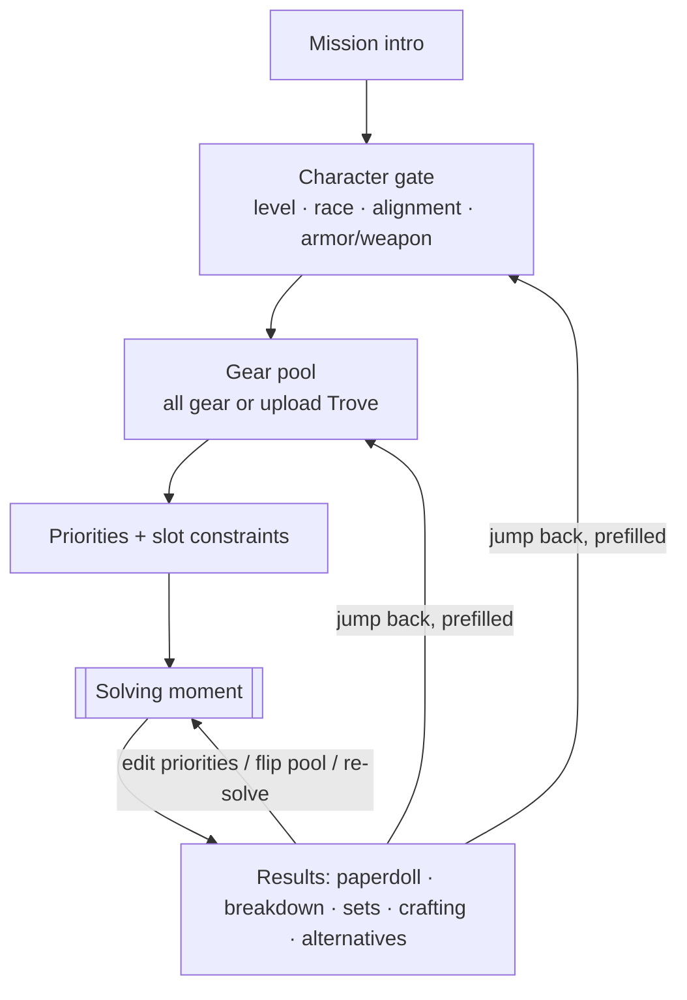
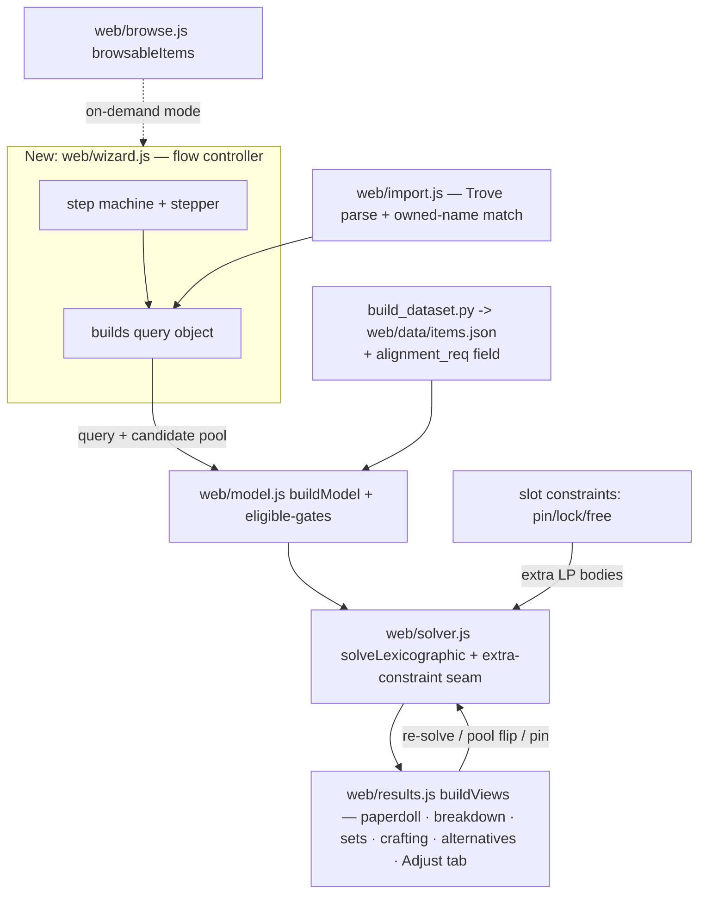

# Guided Workflow UI Re-Engineering - Plan

## Goal Capsule

**Objective.** Replace the optimizer's tabbed, form-over-table UI with one guided linear-wizard flow: a mission intro, a character gate that disqualifies ineligible gear up front, a gear-pool choice (all findable gear vs. an uploaded personal inventory), an elegant affix-priority builder with per-slot constraints, a deliberate "solving" moment, and an iterate-in-place results screen that presents the optimal loadout plus its crafting payoffs. Same exact engine — reshaped around an intuitive, UX-first workflow.

**Product authority.** This document is the single source of truth for WHAT across the whole re-engineering. It **supersedes** `docs/plans/2026-07-28-003-feat-inventory-aware-progressive-optimizer-plan.md`, absorbing that plan's progressive-flow, pool-toggle, and inventory-import intent while changing two of its decisions: the flow shape is now a linear wizard (not a progressive one-page), and inventory mode constrains base items only (augments come from the full catalog). Personalization persistence from 003 is deferred to a later slice.

**Open blockers.** None blocking the vision. Trove CSV parsing specifics and the wizard's mapping onto the existing `query.js`/`results.js` are inputs to planning the HOW, not to capturing the WHAT.

**Product Contract preservation.** Unchanged — `ce-plan` enrichment added the Planning Contract, Implementation Units, Verification Contract, and Definition of Done below without altering any R/A/F/AE ID or product-scope text.

---

## Product Contract

### Summary

A guided linear-wizard UI for the DDO Loadout Optimizer: mission intro → character gate (level · race · alignment · armor/weapon) → gear pool (all gear vs. owned Trove inventory) → ranked affix priorities with per-slot constraints → solve → an iterate-in-place results screen with paperdoll, per-stat breakdown, crafting steps, and alternatives. One level of navigation replaces today's two tab rows. Inventory mode constrains the base gear you own but shows its full build potential using the complete augment/crafting catalog.

### Problem Frame

The engine is mature — exact MILP, full crafting coverage, wiki-sourced data — but the interface undersells it. Two separate tab systems sit on different rows (top-level `Solver | Item Browser`, and a second results-detail row `Ranked | Sets | Deep Dive | Alternatives`), which reads as clutter rather than a path. The main surface is a bare form over a table: a new user gets no framing for what the tool does, and fields like a free-text "Class / race" box neither explain themselves nor actually filter anything, so nothing stops a Warforged from being shown body armor they can never wear. The natural progression a player wants — tell me about my character, decide which gear counts, say what I care about, then show me the answer and how to build it — isn't expressed anywhere. The result is a powerful solver that feels like a spreadsheet.

### Key Decisions

- **One umbrella plan superseding 003** (session-settled: user-directed — chosen over a separate companion plan or a fresh standalone plan). Keeps a single north-star for the whole re-engineering.
- **Linear wizard flow** (session-settled: user-directed via visual probe — chosen over a progressive one-page and a left-rail workspace, and over 003's earlier progressive-one-page decision). Most guided for first-timers; a dedicated solving screen carries the "powerful under the hood" moment.
- **Character gate on level + race + alignment + armor/weapon; class is not collected** (session-settled: user-directed — alignment is included because some gear carries alignment requirements; class-based filtering and full character-build modeling remain out of scope). Race is selected by name, and weapon setup includes an off-hand rune-arm option. Covers the real disqualifiers with the least onboarding friction.
- **UI grounded in named form/UX guidance** (session-settled: user-directed — the user asked for sourced best practice, not improvisation). Field width proportional to input, single-column layout, progressive disclosure (hide inapplicable/unachieved), no truncation of critical info, and drag-as-enhancement with an accessible button/keyboard fallback (WCAG 2.5.7).
- **Iterate from the results screen** (session-settled: user-directed — chosen over re-walking the wizard each time). Inline priority edits, pool flip, and re-solve keep repeat solves fast; the wizard is primarily the first-run experience.
- **Inventory mode = owned base items × full-catalog enhancements** (session-settled: user-directed — chosen over also constraining augments to the owned inventory). Augments and crafting resources are ancillary, so the result shows the full potential of a build achievable with the base gear the player already possesses.
- **Personalization persistence deferred; per-session slot constraints in** (session-settled: user-approved). Saved presets, item notes, and cross-session solve history move to a later slice; pin/lock/free slot constraints ship as solver inputs now.
- **CSV (Trove-native) is the v1 import format; `.xlsx` is a stretch** (session-settled: user-approved).

### Requirements

**Onboarding & framing**
- R1. The app opens on a brief mission intro stating what the tool does and what the user will get, before any input is requested.
- R2. Every input carries a clear label and one-line help text explaining what it affects; no free-text field substitutes for a structured, gating input.

**UI/UX craft**
- R3. Form fields use a single-column layout with each field sized in proportion to its expected input — a level cap gets a narrow field, not a full-width box — following established form-design guidance (Baymard Institute, Nielsen Norman Group), with touch targets at least 44px.
- R4. The UI applies progressive disclosure: inapplicable or unachieved options are hidden or de-emphasized rather than shown as noise (e.g., no explanatory text block under a disabled control, no unachieved set bonuses).

**Character gate**
- R5. Step one collects minimum-level (ML) cap, race (selected by name), alignment, armor type, and optional weapon setup, and uses them to exclude ineligible gear before optimizing.
- R6. Selecting a Forged race (Warforged/Bladeforged) switches the body slot to docents and disables armor-type selection cleanly — a brief inline marker on the field, not an explanatory text block.
- R7. The ML cap excludes higher-level items, and alignment excludes items whose alignment requirement the character does not meet.
- R8. Weapon setup offers two-handed, one-hand + shield, dual-wield, and one-hand + rune arm (off-hand rune arm).

**Gear pool & inventory import**
- R9. Step two lets the user choose the candidate pool: all findable game gear, or only items they own.
- R10. Choosing "what I own" accepts a Trove inventory export (CSV), parsed entirely client-side; the file never leaves the browser. An unparseable or non-Trove file shows an inline error and keeps the pool choice open rather than proceeding.
- R11. Owned items are matched to the dataset by name, and the result discloses the base-item match rate (matched vs. unrecognized), so inventory mode is honest about coverage. A very low or zero match rate warns the user before they proceed to solve against a near-empty owned pool.
- R12. The importer reads only the fields the optimizer uses (Name, Quantity, Location, Tab, Binding) and ignores the account-identifying `SubscriptionHash` and `Character` columns — never retaining, persisting, or logging them — so the "never leaves the browser" guarantee holds by construction, not incidentally.
- R13. In inventory mode only base items are constrained to the owned set; augments and each owned item's crafting transformations (unseal, awaken, Nearly-Complete pick, Dino insert) are evaluated from the full catalog, so results show the full potential of a build achievable with the owned base gear. Owned-mode results disclose that augment/crafting options are drawn from the full catalog and may still require resources the player must obtain.

**Affix-priority builder**
- R14. The priorities step lets the user add target affixes via a searchable picker and rank them; the order is the lexicographic objective (#1 maximized first, then #2 without sacrificing #1, and so on). At least one ranked affix is required before a solve can run — the solve control is disabled with a one-line hint until then.
- R15. Reordering is available by drag as an enhancement, but never drag-only: ↑/↓ (and keyboard) controls are always present as the cross-platform, touch-accessible path per WCAG 2.5.7 (Dragging Movements). Add, remove, and reorder give immediate, unmistakable feedback.

**Slot constraints**
- R16. The user can constrain any equipment slot: pin it to a specific item, lock it empty (excluded from the loadout), or leave it free for the solver. The control lives on the equipped paperdoll — a per-slot menu (pin the current item / lock empty / free) — and constrained slots carry a visible badge (pinned / locked empty).
- R17. The solver honors slot constraints as hard constraints and optimizes the remaining free slots around them; changing a constraint marks the loadout stale and prompts a re-solve. When a prefilled jump-back changes the gate (race/ML/alignment) so a pinned item is no longer eligible, that constraint is dropped to "free" and the change is flagged — a pin is never silently kept as an unwearable item.

**Solve moment**
- R18. The first-run solve triggers a distinct solving experience that conveys the scale and exactness of the search (count of variants considered; an exact solve, not a heuristic) before revealing results. In-place re-solves from the results screen use a lightweight progress indicator that preserves sub-second turnaround rather than replaying the full ceremony.

**Results & iteration**
- R19. Results present the optimal loadout as a paperdoll with set pieces highlighted, plus the ancillary payoffs: a per-stat breakdown with bonus-type attribution, set bonuses, the exact crafting/augment/awaken steps to build it, and near-optimal alternatives. The equipped view shows each item's full identity (name, tier, slot) without truncating critical information. When no loadout satisfies the current gate + pool + slot constraints, the results screen states this and names the binding constraint(s) so the user can relax level/alignment, widen the pool, or free a locked slot.
- R20. The set-bonus view lists only achieved sets; for each, it states the bonuses granted and which equipped pieces — and their slot locations — contribute. Unachieved sets are not shown.
- R21. Iteration lives in the results workspace as the last results sub-tab ("Adjust & re-solve"), inside the right panel with the equipped paperdoll still visible — not as a separate full-width strip. It holds the full priority editor (add, remove, reorder — the same control as the priorities step, not a single-affix input), fits the panel width by wrapping rather than truncating, and offers a fold-up toggle that collapses the editor to a one-line priority summary. From it the user flips the all-gear ↔ owned pool and re-solves in place; flipping to "owned" with no inventory loaded routes to the gear-pool upload step (context preserved) rather than re-solving an empty pool. Larger changes jump back to the relevant earlier step (prefilled) without restarting the wizard.

**Navigation & coverage honesty**
- R22. The UI is a single guided flow with one level of navigation; the two separate tab rows (top-level Solver/Item Browser and the results-detail tabs) are removed. A single sub-tab row within the results workspace is acceptable — the problem is two tab systems on different levels, not tabs as such.
- R23. The Item Browser remains available as an on-demand mode reachable from within the flow, not as a competing top-level tab row.
- R24. Results continue to disclose their own coverage, preserving the wiki-sourced, exclude-until-verified discipline.

### Key Flows

- F1. First-run solve
  - **Trigger:** A new user opens the app.
  - **Steps:** Read the mission intro; enter character basics (gate filters gear); choose the gear pool (optionally upload a Trove CSV); add and rank affix priorities; optionally constrain slots; submit to the solving screen; land on results.
  - **Outcome:** The provably-optimal loadout for their priorities over the chosen pool, with crafting steps and alternatives.
  - **Covers R1–R20.**
- F2. Iterate in place
  - **Trigger:** The user has results and wants a different answer.
  - **Steps:** From the results screen, use the full priority editor or flip the pool and re-solve in place; for a bigger change (race, level, alignment), jump back to that step prefilled, then re-solve.
  - **Outcome:** A recomputed optimal build without re-walking the whole wizard.
  - **Covers R21.**

### Acceptance Examples

- AE1. **Covers R6.** **Given** the user selects Warforged, **When** the character step renders, **Then** armor-type controls are disabled with a brief inline marker (no text block) and the solve searches docents for the body slot (never body armor).
- AE2. **Covers R7.** **Given** an item that requires a Lawful alignment, **When** the character's alignment is Chaotic, **Then** the item is excluded; **When** the alignment is Lawful, **Then** it becomes eligible.
- AE3. **Covers R13.** **Given** inventory mode with an owned item that has an empty augment slot, **When** the solve runs, **Then** it may fill that slot with any augment from the full catalog (not only augments in the Trove), while non-owned base items remain excluded.
- AE4. **Covers R16, R17.** **Given** the user, on the results paperdoll, locks the Trinket slot empty and pins the currently-equipped Belt, **When** they re-solve, **Then** the result has no trinket, keeps the pinned Belt, and every free slot is optimized around both constraints.
- AE5. **Covers R11.** **Given** an uploaded Trove file with items whose names are not in the dataset, **When** import completes, **Then** the match rate discloses how many owned items matched vs. went unrecognized.
- AE6. **Covers R20.** **Given** a loadout with 3 pieces of a set whose threshold is 2 and 1 piece of another set whose threshold is 3, **When** the set-bonus view renders, **Then** only the first set is shown — with its granted bonuses and each contributing piece and slot — and the second set is absent.
- AE7. **Covers R17.** **Given** the user pins a body-armor item and then jumps back and changes race to Warforged, **When** they re-solve, **Then** the now-ineligible pin is dropped to "free," the change is flagged, and the body slot is filled with a docent.
- AE8. **Covers R21.** **Given** a solve produced in all-gear mode with no inventory uploaded, **When** the user flips the results pool toggle to "owned," **Then** they are routed to the gear-pool upload step (context preserved) instead of re-solving an empty pool.

### Scope Boundaries

**Deferred for later**
- Personalization persistence: saved priority/query presets, personal item notes, and cross-session solve history.
- Excel/`.xlsx` inventory import (CSV/Trove-native is the v1 format).
- Class-based gear filtering and full character-build modeling (feats, deity, past lives). (Alignment filtering is now in scope; class is not.)

**Outside this effort's identity**
- Accounts, server-side storage, multi-device sync, and live-game inventory auto-sync — the app stays a static, client-side, browser-local tool.
- Changes to the optimization math or the HiGHS engine — this reshapes access to the solver (flow, pool, constraints, presentation), not the solver itself.

### Outstanding Questions

**Deferred to Planning**
- **Alignment gating data source (R7/AE2).** The dataset carries no structured alignment-requirement field — alignment appears only inside free-text enhancement strings, which are frequently conditional bonuses (e.g. "Required Trait: Lawful (UMD +20)") rather than equip gates. Planning must decide whether to extract and disambiguate a structured gating field or narrow R7's alignment scope. Also settle how character alignment is represented and matched (single value vs. Law/Chaos + Good/Evil axes) and add an acceptance example covering a non-Law/Chaos requirement.
- **Owned quantity semantics (R13).** Decide whether inventory mode respects the Trove `Quantity` column — e.g. a single owned copy of a ring cannot fill both ring slots — or intentionally treats ownership as boolean set-membership, and note why.
- Trove CSV parsing and name-normalization rules for matching (quoted fields, comma-in-name, binding column, duplicate rows).
- Drag reorder implementation under the no-build static-site constraint: hand-rolled pointer-events vs. a small library (e.g. SortableJS). The approach is decided (pointer-events-based with an always-present ↑/↓ + keyboard fallback per R14); the library-vs-hand-rolled pick is the open detail.
- Pre-solve pinning of a *specific, not-yet-chosen* item (the post-solve paperdoll pin/lock/free surface is decided per R15): pinning an arbitrary item before the first solve needs an item picker, which is not yet designed.
- How the wizard maps onto existing `web/query.js` and `web/results.js` without regressing sub-second re-solves.
- Where the "edit character/pool" jump-backs sit relative to the stepper on the results screen.
- A small synthetic Trove fixture (fake hash, a few rows) for tests, separate from the real gitignored export.

### Sources / Research

- Working flow prototype: `docs/prototypes/wizard-demo.html` (build 07292026.4) — a faithful, clickable preview of the wizard flow: proportioned single-column character gate (race by name, alignment, rune-arm, clean docent gating), pool upload, drag-plus-buttons priority builder, solving moment, and an iterate-in-place results screen (untruncated equipped view, achieved-only set-bonus detail with contributing pieces/locations, the "Adjust & re-solve" last tab holding a foldable full priority editor in the right panel, and per-slot pin/lock-empty/free constraints on the paperdoll honored by the solver on re-solve). A ~28-item mock catalog and a greedy lexicographic pick stand in for the real 7,658-item dataset and HiGHS engine; it proves the flow and interaction shape, not the math.
- UI/UX guidance applied: Nielsen Norman Group form-design and progressive-disclosure articles, Baymard Institute form-field research (field width proportional to input), Apple HIG / WCAG 2.5.5 touch-target sizing, and WCAG 2.5.7 (Dragging Movements) for the drag-with-fallback rule.
- Superseded plan: `docs/plans/2026-07-28-003-feat-inventory-aware-progressive-optimizer-plan.md`.
- Current UI touchpoints: `web/index.html` and `web/app.js` (the two tab rows), `web/query.js` (solver form + collapse-to-summary), `web/results.js` (results-detail tabs, paperdoll, alternatives).
- Sample inventory (gitignored, non-shipping): `data/samples/TroveExport.Inventory.csv` — schema `SubscriptionHash, Character, Location, Tab, Name, Quantity, Binding`.

---

## Planning Contract

### Key Technical Decisions

- KTD1. **A new `web/wizard.js` becomes the single flow controller** — it owns the step machine and renders each step into `#app`, orchestrating the existing engine and view modules. The top-level tablist in `web/app.js` and the second results-detail tablist in `web/results.js` are retired; `model.js`, `solver.js`, `results.js`, and `browse.js` stay as the engine + view layer they already are. *(session-settled: user-directed — linear wizard chosen over progressive-one-page/rail; see Key Decisions.)*
- KTD2. **All new character-gate filters are additive hooks in `eligible()` (`web/model.js`); the solver math is untouched.** Today `eligible()` gates only on `verification` and `minimum_level`, and `armorType` feeds only the dodge cap. Armor-type exclusion, the Forged→docent switch, weapon-setup capture, and alignment gating shrink the candidate set fed to `dominanceFilter`/`buildProgram` — they never alter the program. *(session-settled: inventory mode + slot constraints are solver inputs, not math changes.)*
- KTD3. **Slot constraints reuse the solver's existing `extra` raw-LP seam** (the mechanism alternatives already use, e.g. forcing `set_active = 1`): pin → the chosen variant's x-var `= 1`; lock-empty → `sum(slot x-vars) = 0`; free → default. No new solver primitive.
- KTD4. **Inventory mode filters only the `items` pool by owned name; the separate crafting/augment pools stay full.** The dataset exposes `items`, `dino_inserts`, `nearly_complete`, `viktranium`, `seal`, `membership_set_defs`, `thunder_forged`, and `green_steel` as separate top-level arrays, so owned-base-items × full-catalog-enhancements is a clean filter on one array. *(session-settled: user-directed — owned base × full-catalog over constraining augments to owned.)*
- KTD5. **Alignment gating is sourced from a curated seed of known alignment-restricted items, stamped as a structured `alignment_req` field by `build_dataset.py`** — not a full-text NLP extraction. Feasibility confirmed alignment appears only in free-text enhancement strings that are usually conditional bonuses ("Required Trait: Lawful (UMD +20)"), not equip gates. *(user-approved — chosen over full-text extraction (unreliable) and over narrowing R7 to captured-but-not-gated.)*
- KTD6. **All new UI logic is written as pure, DOM-free helpers, unit-tested via `node tests/*.test.js`, with DOM wiring guarded** — mirroring `browsableItems`/`activeTab`. Applies to the step machine, CSV parse, name-matching, eligibility, priority ordering, and constraint construction.
- KTD7. **Drag-reorder is hand-rolled pointer-events with the ↑/↓ + keyboard controls always present (WCAG 2.5.7); no CDN library.** Keeping it vendored/no-build preserves the page's trust boundary so a third-party script never shares memory with parsed Trove data. *(session-settled + security residual.)*
- KTD8. **`?v=` is bumped in lockstep across every tag in `web/index.html` on release; assets stay page-relative; the dataset is rebuilt in CI.** GitHub Pages has no content hashing, and `web/` is the site root, so a stale cache or a `/web/`-prefixed asset breaks the deploy.

### High-Level Technical Design

The controller is new; everything downstream of `buildModel` is the existing engine, unchanged. Gate filters live in `eligible()`; slot constraints enter through the `extra` seam; inventory mode is a filter on the `items` array before `buildModel`.

### Assumptions

- Owned ownership is **boolean for v1** — the Trove `Quantity` column is ignored, so a single owned copy of a dual-slot item (e.g. a ring) may appear in both slots. Quantity-aware constraints are follow-up work.
- Alignment is modeled as a single selection matched against `alignment_req`; a non-Law/Chaos (Good/Evil) axis example is added if the seed contains one.

### Sequencing

- **Phase 1 — shell & inputs:** U1 (shell) → U2 (character gate) and U4 (priorities) in parallel.
- **Phase 2 — data & pool:** U3 (alignment data) unblocks U2's alignment branch; U5 (import/inventory).
- **Phase 3 — constraints, solve, results:** U6 (slot constraints) and U8 (results) co-develop; U7 (solve moment).
- **Phase 4 — browser:** U9.

---

## Implementation Units

### U1. Wizard shell & navigation framework
- **Goal:** Replace the two tab rows with one guided linear-wizard shell (mission intro → 4 steps → results) with a pure step-state machine, stepper, Back/Next, and jump-back to any completed step; establish the field label+help and single-column proportioned-form conventions.
- **Requirements:** R1, R2, R3, R4, R22; KTD1, KTD6.
- **Dependencies:** none.
- **Files:** `web/wizard.js` (new), `web/index.html` (remove top tablist, load `wizard.js`, bump `?v=`), `web/app.js` (drop `activeTab`/`nextTab`/`TAB_IDS` tablist wiring; keep the `App.ready` dataset bus), `web/styles.css`, `tests/wizard.test.js` (new).
- **Approach:** `wizard.js` owns a pure `nextStep`/guard helper set mirroring the retired `activeTab`/`nextTab`, renders each step into `#app`, and orchestrates the engine. Mission intro is step 0. Completed steps are jump-back targets; incomplete required steps block advancing.
- **Patterns to follow:** `web/app.js` pure-helper + guarded-DOM split; `web/browse.js` `browsableItems` projection discipline.
- **Test scenarios:** forward/back transitions; jump-back allowed only to completed steps; guard blocks advancing past an incomplete required step; initial state is the intro. Covers R22 (single nav level).
- **Verification:** `node tests/wizard.test.js` green; local server shows intro → steps navigable.
- **Execution note:** build the step machine test-first (pure helper).

### U2. Structured character gate + eligibility filters
- **Goal:** The character step (ML, race by name, alignment, armor type, weapon incl. rune arm) plus the new additive filters in `eligible()`: armor-type exclusion, Forged→docent switch, weapon capture. Class is not collected.
- **Requirements:** R5, R6, R7 (ML + alignment-exclusion), R8; AE1, AE2 (alignment, once U3 lands); KTD2.
- **Dependencies:** U1; alignment branch consumes U3.
- **Files:** `web/model.js` (extend `eligible()`; consume `weaponSetup`), `web/wizard.js` (character step; extend the `query` object with `race`, `alignment`, `weaponSetup`; drop free-text `classRace`), `tests/model.test.js`.
- **Approach:** `eligible()` gains additive filters only. Forged race → require docent for the body slot, exclude body armor, disable armor-type UI. Armor-type excludes mismatched body armor (today it only feeds the dodge cap). Alignment excludes variants whose `alignment_req` the character doesn't meet. Query object: `{ mlCap, targets, armorType, weaponSetup, race, alignment }`.
- **Patterns to follow:** existing `eligible()` and the `armorType`→dodge-cap consumption in `web/model.js`.
- **Test scenarios:** Covers AE1 — Warforged → body candidates are docents only, armor excluded. `armor=cloth` excludes heavy body armor. Covers AE2 (after U3) — Lawful-required item excluded for Chaotic, eligible for Lawful. ML cap excludes higher-ML. Non-Forged race unaffected.
- **Verification:** `node tests/model.test.js` and `python3 tests/run_tests.py` green.
- **Execution note:** add characterization coverage of current `eligible()` behavior before extending (legacy gating).

### U3. Alignment requirement data source (build pipeline)
- **Goal:** Emit a structured `alignment_req` field on the curated set of alignment-restricted equippable items so `eligible()` can gate on it — resolving the deferred alignment data-source question.
- **Requirements:** R7 (alignment), AE2; KTD5.
- **Dependencies:** none (data); consumed by U2.
- **Files:** `build_dataset.py` + `src/` (stamp `alignment_req` from the seed), `data/seed/alignment_restrictions.json` (new curated seed), `tests/test_alignment_req.py` (new).
- **Approach:** A hand-verified seed lists wiki-confirmed alignment-gated items and required alignment(s); the build stamps `alignment_req` on matching variants and emits nothing for the rest (fail-open). Not a full-text extraction.
- **Patterns to follow:** seed-shard → `build_dataset.py` stamping (`data/seed/augments.json`, `seal.json`); single-source-of-truth discipline.
- **Test scenarios:** a seeded restricted item gets `alignment_req`; an item whose only alignment mention is a conditional bonus ("Required Trait: Lawful (UMD +20)") is NOT stamped; unrestricted items carry no field.
- **Verification:** `python3 build_dataset.py` then `python3 tests/run_tests.py` green; `web/data/items.json` shows `alignment_req` on seeded items only.
- **Execution note:** exclude-until-verified — seed only wiki-confirmed equip gates.

### U4. Affix-priority builder
- **Goal:** The priorities step — searchable affix picker + ranked list, drag reorder (pointer-events) with ↑/↓ + keyboard fallback, a ≥1-priority guard, and immediate feedback.
- **Requirements:** R14, R15; KTD6, KTD7.
- **Dependencies:** U1.
- **Files:** `web/wizard.js` (priorities step + pure add/move/remove helpers), `web/styles.css`, `tests/priorities.test.js` (new).
- **Approach:** pure array ops (add-unique, move up/down with bounds, remove) exported for tests; pointer-events drag as an enhancement over the same ops; ↑/↓/✕ always rendered; the solve control is disabled until ≥1 priority exists.
- **Patterns to follow:** `web/query.js` `ranked[]` + `bump()` feedback; `web/app.js` pure-helper split.
- **Test scenarios:** add dedupes; move up/down respect bounds; remove; empty list disables solve; order maps to `query.targets`.
- **Verification:** `node tests/priorities.test.js`; manual drag on desktop + button reorder on touch.

### U5. Trove CSV import + inventory-mode pool
- **Goal:** Client-side Trove CSV import (quoted-field parser), name-matching to `dataset.items`, match-rate disclosure, data-minimization, and the inventory-mode candidate-pool filter (owned base items only; crafting/augment pools stay full).
- **Requirements:** R9, R10, R11, R12, R13; AE3, AE5; KTD4, KTD6.
- **Dependencies:** U1.
- **Files:** `web/import.js` (new pure parser + matcher + pool filter), `web/wizard.js` (gear-pool step; wire the owned pool into `buildModel`'s candidate set), `tests/import.test.js` (new), `tests/fixtures/trove-sample.csv` (new synthetic, fake hash).
- **Approach:** the parser handles quoted commas in the `Name` column and reads only `Name`/`Quantity`/`Location`/`Tab`/`Binding` — `SubscriptionHash` and `Character` are never read, retained, or logged. Owned names match `dataset.items` → owned set; inventory mode filters only `items`; all crafting/augment pools pass to `buildModel` unchanged. Unparseable/non-Trove → inline error, pool choice stays open; zero/low match → warn before solve.
- **Patterns to follow:** `web/browse.js` `browsableItems` projection; the separate top-level pools in the dataset.
- **Test scenarios:** Covers AE5 — unmatched names disclosed in the match rate. Covers AE3 — owned mode keeps augment/crafting pools full. Quoted comma-in-name parses correctly. `SubscriptionHash`/`Character` never appear in parsed output. Malformed file → error, no crash. Boolean ownership (Quantity ignored) for v1.
- **Verification:** `node tests/import.test.js`; manual upload of the synthetic fixture shows the match rate.
- **Execution note:** assert `SubscriptionHash`/`Character` are absent from every parsed object and log path (security). Restricting the pool must not drop slot/membership-only variants — see the dominance re-audit gate.

### U6. Per-slot constraints (pin / lock empty / free)
- **Goal:** Per-slot solver constraints via the existing `extra` seam, with the results-paperdoll per-slot menu + badges, a stale/re-solve prompt, and gate-change invalidation.
- **Requirements:** R16, R17; AE4, AE7; KTD3.
- **Dependencies:** U1, U2 (gate, for invalidation); co-develops with U8 (paperdoll host).
- **Files:** `web/solver.js` (inject pin/lock via `extra`), `web/results.js` (paperdoll per-slot menu + badges), `web/wizard.js` (constraint state + invalidation on gate change), `tests/constraints.test.js` (new), `tests/solver.test.js`.
- **Approach:** a pure constraint builder maps `{slotKey → pin(variant) | empty | free}` to `extra` LP bodies (pin `= 1`; lock-empty `sum = 0`; free none), reusing `solveConstrained`/`encodeStage`. On a gate-affecting jump-back, a pinned variant that no longer passes `eligible()` drops to free and is flagged — never kept as an unwearable pin. A constraint change marks the loadout stale.
- **Patterns to follow:** `web/solver.js` `solveConstrained` / alternatives `extra` usage; x-var naming in `web/model.js`.
- **Test scenarios:** Covers AE4 — lock Trinket empty + pin Belt → no trinket, Belt kept, free slots optimized. Covers AE7 — pin body armor then switch to Warforged → pin dropped to free + flagged + docent chosen. Free = default. Lock-empty must not silently make a capped/threshold target infeasible (surfaces via U8).
- **Verification:** `node tests/constraints.test.js tests/solver.test.js`; manual pin/lock/free + re-solve.
- **Execution note:** run the new-source-family / dominance-soundness checklist — a pinned variant must survive the pre-filter.

### U7. Solve moment
- **Goal:** A first-run solving experience (scale + exactness messaging over the HiGHS load/solve) and a lightweight indicator for in-place re-solves.
- **Requirements:** R18; KTD1.
- **Dependencies:** U1, U4.
- **Files:** `web/wizard.js` (solve orchestration + overlay), `web/styles.css`.
- **Approach:** the first-run solve shows the ceremony (variants considered, exact MILP) around `getHighs()` + `solveLexicographic`; in-place re-solves use a lightweight indicator to preserve sub-second turnaround.
- **Patterns to follow:** `web/query.js` `getHighs()` lazy-load + solve timing; the prototype's solve overlay.
- **Test scenarios:** Test expectation: none — presentational orchestration; behavior is covered by the solver suite.
- **Verification:** manual — first solve shows the ceremony; re-solve is lightweight and sub-second.

### U8. Results re-engineering + iterate-in-place
- **Goal:** Collapse to a single results sub-tab row; paperdoll (no truncation), breakdown, achieved-only set bonuses (pieces + locations), crafting steps, alternatives, and the "Adjust & re-solve" last sub-tab (full priority editor + pool flip + re-solve + jump-back + fold-up); the infeasible/no-solution state; pool-flip-with-no-inventory routes to upload.
- **Requirements:** R18 (re-solve), R19, R20, R21, R23, R24; AE6, AE8; KTD1.
- **Dependencies:** U1, U4, U5, U6.
- **Files:** `web/results.js` (retire the second tablist → single sub-tab row incl. the Adjust tab; no-truncation paperdoll; achieved-only set-bonus view; infeasible state), `web/wizard.js` (iterate wiring, pool-flip guard), `web/styles.css`, `tests/results.test.js`.
- **Approach:** reuse build-agnostic `buildViews` for the optimum and alternatives; the equipped view shows full name/tier/slot; the set-bonus view renders only sets meeting threshold with contributing pieces + slot locations (set defs via `src/set_catalog.py` — no UI-side copy); the Adjust tab embeds the U4 editor; flipping the pool to owned with no inventory routes to the U5 upload step; an infeasible solve states no loadout fits and names the binding constraint(s).
- **Patterns to follow:** `web/results.js` `buildViews`/`wireResultTabs`/paperdoll; single-source set defs.
- **Test scenarios:** Covers AE6 — a 3-of-2 set is shown with pieces + locations, a 1-of-3 set is absent. Covers AE8 — pool flip to owned with no inventory routes to upload. Infeasible → named binding constraint. Paperdoll shows full item identity. The Adjust-tab editor mirrors the priorities step.
- **Verification:** `node tests/results.test.js`; manual full flow incl. infeasible + pool flip.

### U9. Item Browser as on-demand mode
- **Goal:** Fold the Item Browser into an on-demand mode reachable from the flow (not a top-level tab row); reuse `browsableItems`.
- **Requirements:** R23; KTD1.
- **Dependencies:** U1.
- **Files:** `web/browse.js` (unchanged projection; adjust mount), `web/wizard.js` (on-demand browser entry), `web/index.html`.
- **Approach:** browse stays the pure `browsableItems` projection; expose it via an on-demand entry (header link/overlay) rather than a competing tablist.
- **Patterns to follow:** `web/browse.js` `browsableItems` + `filterVariants`.
- **Test scenarios:** existing `tests/browse.test.js` stays green (projection unchanged); on-demand open/close.
- **Verification:** `node tests/browse.test.js`; manual open browser mid-flow.

---

## Verification Contract

| Gate | Command / action | Applies to |
|---|---|---|
| Rebuild dataset | `python3 build_dataset.py` | U3 and any data change |
| Python suite | `python3 tests/run_tests.py` | U3 + full |
| JS suite (full loop — never `\| tail -1`) | `for t in tests/*.test.js; do node "$t"; done` | all UI units |
| Manual app verify | `python3 -m http.server 8000` → drive `http://localhost:8000/web/` end to end | all |
| Dominance re-audit | end-to-end solve regression after pool/slot changes; confirm no slot/membership-only variant is wrongly pruned | U5, U6 |
| Cache-bust | bump `?v=` across every tag in `web/index.html` in lockstep | release |
| Post-deploy | `curl` the live site + a known asset for `200` | release |

---

## Definition of Done

- All of R1–R24 satisfied; AE1–AE8 covered by named test scenarios.
- The two tab rows are gone: one guided wizard + a single results sub-tab row.
- `eligible()` gates on ML + race/docent + armor type + alignment; solver math unchanged; the dominance re-audit passed.
- Trove import is client-side; `SubscriptionHash`/`Character` are never retained or logged; inventory mode is owned-base × full-catalog with the match rate disclosed.
- Slot pin/lock/free are honored as hard constraints; gate-change invalidation drops ineligible pins to free and flags them.
- The full JS test loop and the Python suite are green; the dataset rebuilds clean; `?v=` is bumped; the live site is verified.
- Deferred to follow-up (separate work): quantity-aware ownership, pre-solve arbitrary-item pin picker, Excel/`.xlsx` import, and swapping the drag reorder to a vendored library if pointer-events proves insufficient.
