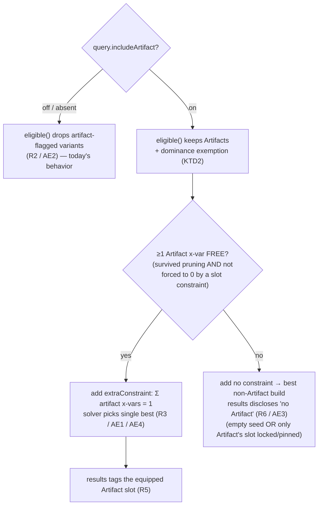

# Artifact Opt-In Inclusion - Plan

## Goal Capsule

**Objective.** Let a player opt in to using their one DDO **Artifact** item via a checkbox on the setup step. When on, the optimizer includes the single best-scoring Artifact in the build and marks its slot; when off, no Artifact is considered. This respects the DDO rule (at most one Artifact) as a clean on/off rather than a hidden cap.

**Product authority.** This document is the source of truth for WHAT (Product Contract below). The Planning Contract enriches it with HOW. Four connected seams — a data-pipeline `artifact` flag, a solver rule (exclude vs exactly-one) with a dominance exemption, a setup-step checkbox, and a results tag. Additive and backward-compatible: every seam no-ops until the query field and flagged data are present, exactly like the guided-wizard character gates (see `docs/plans/2026-07-29-001-feat-guided-workflow-ui-reengineering-plan.md`).

**Product Contract preservation.** Unchanged. The three Outstanding Questions from the requirements-only draft are resolved into KTD1–KTD3 below; no product scope, requirement, or acceptance example was rewritten.

**Open blockers.** None. The Artifact-flag data source is settled as a curated seed grown later (KTD1); a full wiki harvest is a deferred data track, not a v1 gate.

---

## Product Contract

### Summary

Add an **"Include an Artifact" checkbox** to the character/setup step (default off). When off, Artifact-type items are excluded from the search. When on, the loadout must contain **exactly one** Artifact-type item — the best one for the player's ranked priorities, in its native slot — and the results view **tags that slot as "Artifact"** so it stands out. Depends on a per-item `artifact` flag emitted by the data pipeline, sourced exclude-until-verified.

### Problem Frame

In DDO, "Artifact" is an item quality with a hard equip rule: only one Artifact at a time. A player often wants to build *around* their single Artifact — it's a deliberate choice, not something the optimizer should guess. Today the optimizer models none of it: no variant is flagged as an Artifact (no `category` value marks the Artifact quality — `category` distinguishes `item`/`weapon`/`runearm`/`augment`, not item quality — and the bulk data carries only the *bonus type* "artifact"), and the solver has no notion of the type. So a player who wants "the best build that uses my Artifact" cannot ask for it, and — separately — an unconstrained solver could even surface two Artifacts, an unbuildable loadout. An explicit opt-in resolves both: off means no Artifact, on means exactly the best one, and never two.

### Key Decisions

- **Opt-in via a setup-step checkbox, default off** (session-settled: user-directed). The box is the only way an Artifact enters the build.
- **Off excludes Artifacts entirely; on requires exactly one** (session-settled: user-directed — chosen over "allow up to one but don't force"). Clean on/off; the loadout holds 0 or 1 Artifact, never 2.
- **The equipped Artifact's slot is tagged "Artifact" in the results** so it stands out, alongside set-piece highlighting (session-settled: user-directed).
- **Per-item `artifact` flag, sourced exclude-until-verified** (session-settled: user-approved). Unflagged variants are treated as non-Artifact; the feature is only as complete as the flagged data.

### Requirements

- R1. The character/setup step shows an "Include an Artifact" checkbox, default unchecked, with a one-line explanation of what it does.
- R2. When unchecked, no Artifact-type item is considered — Artifact-flagged variants are excluded from the candidate pool. This is the default and matches today's behavior.
- R3. When checked, the loadout contains exactly one Artifact-type item, selected to maximize the ranked priorities like any other slot pick (the single best-scoring Artifact, placed in its native slot).
- R4. Each item variant carries an `artifact` flag indicating whether it is an Artifact-type item. The flag is sourced exclude-until-verified; an unflagged variant is treated as non-Artifact.
- R5. The results loadout visually tags the equipped Artifact's slot as "Artifact" so it is distinguishable from ordinary and set-piece slots.
- R6. When the box is checked but no eligible variant is flagged as an Artifact (e.g., the seed is empty or filtered out), the solver returns the best non-Artifact build and discloses that no Artifact could be included — it does not fail or hang.

### Acceptance Examples

- AE1. **Covers R3, R5.** **Given** the box is checked and at least one eligible Artifact exists, **When** the solve runs, **Then** exactly one Artifact is equipped (the best for the priority order) and its slot is tagged "Artifact" in the results.
- AE2. **Covers R2.** **Given** the box is unchecked, **When** the solve runs, **Then** no Artifact-type item appears in the loadout.
- AE3. **Covers R6.** **Given** the box is checked but no eligible variant carries the `artifact` flag, **When** the solve runs, **Then** the result is the best non-Artifact build with a disclosed note that no Artifact could be included.
- AE4. **Covers R3.** **Given** two Artifacts would each be strong picks in different slots, **When** the box is checked, **Then** only the single best-scoring one is equipped (never two).

### Scope Boundaries

**Deferred for later**
- A full wiki harvest of every Artifact item — the seed is curated and grows; complete coverage is a data track, not a v1 gate (see KTD1).
- Modeling a separate **Minor Artifact** tier or letting the user pick *which* Artifact (the solver picks the best-scoring one).

**Outside this effort's identity**
- Changes to the optimization math or the HiGHS engine — this is a candidate-pool filter plus one exactly-one constraint, and a results tag.

### Deferred to Follow-Up Work
- **Populate `data/seed/artifacts.json` via a Chrome-MCP wiki pass.** A separate data track that grows the seed; the mechanism ships in this plan and works the moment the seed carries names. Uses the established wiki-audit method (see `sooks-saga-scroll-wiki-audit-method`; plain `fetch` returns empty for ddowiki, so Chrome-MCP is required). The Artifact quality is identified by the item's quality/enchantment line on the DDO wiki.

---

## Planning Contract

### Key Technical Decisions

- **KTD1. `artifact` flag comes from a curated seed, grown later** (session-settled: user-directed — chosen over harvesting a starter set now). A new `data/seed/artifacts.json` holds a list of Artifact base-item names (`source_item`), mirroring `data/seed/alignment_restrictions.json`. `build_dataset.py` stamps `artifact: true` onto each variant whose `source_item` is in the seed. Exclude-until-verified: an empty or partial seed leaves the feature wired but inert (identical to how the alignment gate shipped), never wrong. Populating the seed is deferred follow-up work.
- **KTD2. When the box is on, exempt every eligible Artifact variant from the per-slot dominance pre-filter** (resolves the exactly-one soundness concern). An *exactly-one* requirement makes Artifact-ness a value dimension, so a non-Artifact that beats an Artifact on stats must not prune it — otherwise the solver could be handed a slot with no Artifact to satisfy the constraint. Reuse the existing `pinnedIds` exemption seam in `web/model.js buildModel` (the pin-exemption mechanism shipped by plan `2026-07-29-001` U6 — that U-ID is foreign to this plan, which enumerates only U1–U5): union the keys of all `artifact` variants into the exemption set when `query.includeArtifact` is true. Conservative (keeps a handful of extra candidates), sound, and requires no new dominance code path. Mirrors the set-contributor exemption already documented in the Dominance pre-filter concept. **Invariant the exemption relies on:** the augment-pool `dominanceFilter` call (`web/model.js:307`) is the one gear-relevant pruning path that does *not* receive `pinnedIds`, so an Artifact routed there would still be pruned. Safe today because Artifacts are equippable gear (`category` `item`/`weapon`/`runearm`), never `augment` — but if a future Artifact ever landed in the augment pool this exemption would not protect it.
- **KTD3. Exactly-one is a raw-LP `sum(artifact x-vars) = 1` body, added only when ≥1 Artifact x-var can still be selected under the active slot constraints** (this is also the R6 fallback mechanism). Emit it through the same `extraConstraints` seam in `web/solver.js buildProgram` that already hosts slot-cardinality and augment-supply limits. The guard is **not** merely "an Artifact x-var exists" — it is "an Artifact x-var is not already forced to 0." The live slot-constraint feature (`slotConstraintBodies`) forces a `= 0` on every x-var in an `empty`-locked slot and forces a foreign `pin` to `= 1` (which, with the slot's cardinality cap, drives the slot's other x-vars — including an Artifact — to 0). If **every** surviving Artifact x-var is forced to 0 that way, a blanket `sum = 1` is **infeasible**, not graceful. So: add the `= 1` body only when at least one Artifact x-var is free (not in an `empty` slot and not excluded by a foreign pin in its slot); otherwise add **no** constraint and let R6 fire (best non-Artifact build + disclosure). This also covers the zero-flagged-data case (empty seed). AE3 is then a natural consequence of the guard for both reasons — no Artifact in the data, *or* the only Artifact's slot locked/pinned away — never an infeasible model.
- **KTD4. The `artifact` flag rides on the variant object end-to-end**, so no new plumbing is needed to reach the results tag: the chosen variant already carries `artifact`, and `equippedRow` / the disclosure check read it directly (mirrors how `slotSetNames(v)` drives set-piece highlighting). The results tag is a badge plus an `is-artifact` row frame, mirroring the existing `pin` / `empty` badges and `is-set` frame.
- **KTD5. `includeArtifact` is a boolean on the query object**, defaulting to `false`/absent. `eligible()` and `buildProgram` treat absent as off, preserving today's behavior for every existing test and the live app until the box is wired.

### High-Level Technical Design

The whole feature is one decision gate over two inputs — the checkbox state and whether any eligible Artifact exists — producing three outcomes that map 1:1 to R2/R3/R6.



**Data-flow of the flag (KTD1, KTD4):**

```
data/seed/artifacts.json ──▶ build_dataset.py stamp_artifact() ──▶ web/data/items.json (v.artifact:true)
        (curated names)                                                     │
                                                                            ├─▶ eligible()   exclude/keep  (R2/R3)
                                                                            ├─▶ buildProgram Σ=1 constraint (R3/R6)
                                                                            └─▶ equippedRow  badge + frame  (R5)
```

Pseudo-code for the two solver seams (directional guidance, not implementation spec):

```
// model.js buildModel — extend the existing pinnedIds exemption
if (query.includeArtifact)
  for (v of elig) if (v.artifact) pinnedIds.add(variantKey(v));   // KTD2

// solver.js buildProgram — new body, alongside slotConstraintBodies()
if (model.query.includeArtifact) {
  const art = xVars.filter(xv => xv.variant.artifact);
  const free = art.filter(xv => !forcedToZero(xv, slotConstraints)); // empty-lock / foreign-pin
  if (free.length)                                                   // ≥1 selectable Artifact
    extraConstraints.push(`${art.map(xv => xv.name).join(" + ")} = 1`); // KTD3; else no-op → R6
}
```

---

## Implementation Units

### U1. Emit the per-item `artifact` flag from a curated seed

**Goal.** Give every variant a truthful `artifact` boolean so downstream seams have data to act on (R4). Ships the mechanism; the seed starts empty (KTD1).

**Requirements.** R4; enables R2, R3, R5, R6.

**Dependencies.** None.

**Files.**
- Create `data/seed/artifacts.json` — a JSON **array of Artifact base-item `source_item` names**, starting empty (`[]`). (Unlike `alignment_restrictions.json`, which is an *object* mapping name → restriction list with a `_README` key, the Artifact seed needs only set membership, so a flat name array is the right shape; `load_artifacts()` reads it into a `set`. Do not add a `_README` key to an array — a top-level array cannot carry one.)
- Modify `build_dataset.py` — add `ARTIFACT_SEED_PATH`, `load_artifacts()`, and `stamp_artifact(variants, names)`; call it in the build alongside `stamp_alignment_req` (near line 293).
- Modify `tests/run_tests.py` (or the appropriate Python test module it drives) — coverage for the stamp.

**Approach.** Mirror the alignment pattern exactly: `load_artifacts()` reads the seed into a `set` of names (returns empty set if the file is missing or empty); `stamp_artifact(variants, names)` sets `v["artifact"] = True` for each variant whose `v["source_item"]` is in the set and returns the count. Additive: a variant not in the seed carries **no** `artifact` field (JS treats absent as falsy), so nothing regresses. Do **not** overload `category` — `artifact` is a separate boolean flag; `category` stays `"item"`/`"weapon"`/etc.

**Patterns to follow.** `load_alignment_restrictions()` + `stamp_alignment_req()` in `build_dataset.py:127-150`; the empty curated seed `data/seed/alignment_restrictions.json`.

**Test scenarios** (`tests/run_tests.py`):
- Happy path: a variant whose `source_item` is in the seed gets `artifact == True`. **Covers R4.**
- Exclusion: a variant not in the seed has no `artifact` field (or falsy). **Covers R4 (exclude-until-verified).**
- Empty seed: `load_artifacts()` on an empty/missing file returns an empty set and `stamp_artifact` stamps nothing and returns 0 (the shipping state — R6 upstream).
- Multi-variant base item: all tiered variants of a seeded base item are stamped (the seed keys on `source_item`, which every tier shares).

**Verification.** `python3 build_dataset.py` runs clean; `python3 tests/run_tests.py` passes; with a one-name test seed, that item's variants show `artifact:true` in the rebuilt `web/data/items.json`.

### U2. Pool exclude + dominance exemption in the model

**Goal.** When the box is off, Artifacts never enter the candidate pool (R2); when on, no Artifact is wrongly pruned before the solver can pick one (KTD2).

**Requirements.** R2, R3 (candidate-availability half); KTD2. **Covers AE2, AE4 (availability precondition).**

**Dependencies.** U1 (variants must carry `artifact`).

**Files.**
- Modify `web/model.js` — `eligible()` (add the exclude branch) and `buildModel()` (union Artifact keys into `pinnedIds` when `query.includeArtifact`).
- Modify `tests/model.test.js`.

**Approach.** In `eligible()`, add one additive filter near the existing character gates (`isDocent`, `armorTypes`, `alignment_req` around `web/model.js:75-94`): `if (v.artifact && !query.includeArtifact) return false;`. In `buildModel()` (`web/model.js:266-277`, where `pinnedIds` is assembled), after the pin loop add: when `query.includeArtifact`, iterate `elig` and `pinnedIds.add(variantKey(v))` for every `v.artifact`. This threads the existing exemption param through the same `dominanceFilter(..., pinnedIds)` calls already in place for worn slots, Main Hand, and Rune Arm — no new argument, no new pruning path. Absent `includeArtifact` behaves exactly as today (KTD5).

**Patterns to follow.** The `pinnedIds` exemption already in `buildModel` and `dominanceFilter(slotVariants, targetSet, mlCap, cardinality, pinnedIds)` (`web/model.js:233-256`); the additive character-gate filters in `eligible()`.

**Test scenarios** (`tests/model.test.js`):
- Off/absent excludes: with `includeArtifact` unset, an `artifact` variant is absent from `eligible()` output. **Covers R2 / AE2.**
- On includes: with `includeArtifact:true`, the `artifact` variant is present in `eligible()` output.
- Exemption keeps a dominated Artifact: an `artifact` variant strictly dominated on all value dimensions by a non-Artifact peer in the same slot **survives** `buildModel` pruning when `includeArtifact:true` (would be dropped without the exemption). **Covers KTD2.**
- No exemption leakage: with `includeArtifact:false`, `pinnedIds` gains no Artifact keys and pruning is byte-for-byte unchanged vs. baseline (guard against KTD5 regression).
- Non-Artifact unaffected: ordinary variants prune identically whether the box is on or off.

**Verification.** `for t in tests/*.test.js; do node "$t"; done` passes; the exemption test fails if the union line is removed.

### U3. Exactly-one Artifact constraint + R6 no-Artifact fallback in the solver

**Goal.** Force exactly one Artifact into the loadout when the box is on and any Artifact is available (R3); return the best non-Artifact build with no constraint when none is available (R6).

**Requirements.** R3, R6; KTD3. **Covers AE1, AE3, AE4.**

**Dependencies.** U1, U2 (Artifact x-vars must exist and have survived pruning). Interacts with the live slot-constraint feature (`slotConstraintBodies`, plan `2026-07-29-001` U6): the exactly-one body must not collide with an `empty`-lock or foreign `pin` on the Artifact's slot (see KTD3's free-x-var guard).

**Files.**
- Modify `web/solver.js` — add the Artifact constraint body in `buildProgram`, alongside the `slotConstraintBodies` injection (`web/solver.js:104-109`).
- Modify `tests/solver.test.js` (real-HiGHS end-to-end).

**Approach.** After the `slotConstraintBodies` loop in `buildProgram`, add: if `model.query && model.query.includeArtifact`, collect the Artifact x-vars `xVars.filter(xv => xv.variant && xv.variant.artifact)`. Then determine which are still **free** under the active `slotConstraints` — exclude any whose slot is `empty`-locked, and any excluded by a foreign `pin` in a cardinality-1 slot (mirror the same slot bookkeeping `slotConstraintBodies` already computes; the cleanest form is to compute the forced-to-0 x-var set once and reuse it). If **≥1 Artifact x-var is free**, push `"<sum of ALL artifact x-var names> = 1"` into `extraConstraints` — summing across all slot groups so exactly one Artifact is chosen loadout-wide regardless of native slot (satisfies AE4 — two artifacts in different slots still yield one; the forced-to-0 ones simply cannot be the chosen one). If **no** Artifact x-var is free (empty seed, or the only Artifact's slot locked/pinned away), push nothing (R6/AE3 — the model stays feasible and returns the best non-Artifact build). The `x`-vars are already binary and already summed elsewhere the same way (e.g. augment-color bodies), so no new variable declarations are needed.

**Patterns to follow.** `slotConstraintBodies()` and its `${group...join(" + ")} = 0` / `${xv.name} = 1` bodies (`web/solver.js:39-59`); the augment `<= 1` and Dino-capacity bodies pushed into `extraConstraints` (`web/solver.js:189-206`, `247-256`).

**Execution note.** Prove this one end-to-end against real HiGHS before wiring the UI — it is the load-bearing correctness claim (exactly-one, never-two, and the feasible R6 fallback). Start from a failing solver test.

**Test scenarios** (`tests/solver.test.js`, real HiGHS):
- Exactly one, best pick: `includeArtifact:true` with two Artifacts of differing score → the solved loadout contains exactly one, and it is the higher-scoring for the ranked targets. **Covers R3 / AE1.**
- Never two: two Artifacts that would each be optimal in different slots → the solution equips exactly one. **Covers AE4.**
- Off → none: `includeArtifact:false` (or absent) with Artifacts in the pool → the solution contains zero Artifacts. **Covers R2 / AE2** (solver half).
- No-data fallback: `includeArtifact:true` but no variant carries `artifact` → the solve succeeds and returns a non-Artifact build (feasible, not infeasible/hung). **Covers R6 / AE3.**
- Locked/pinned-slot fallback: `includeArtifact:true` with exactly one flagged Artifact, but that Artifact's slot is locked `empty` (or pinned to a different item) via `slotConstraints` → the solve succeeds and returns a feasible non-Artifact build, **not** `status:"infeasible"`. Regression guard for the KTD3 free-x-var guard. **Covers R6** (second path).
- Non-conflicting pin coexists: `includeArtifact:true` plus a pin on a *non-Artifact* slot → exactly one Artifact is still equipped in its own free slot alongside the honored pin.
- Determinism: repeated solves with the constraint return the same canonical loadout (the lexicographic tie-break still holds with the added equality).

**Verification.** `for t in tests/*.test.js; do node "$t"; done` passes including `solver.test.js`; removing the `= 1` body makes the "exactly one" test fail; weakening the free-x-var guard back to "≥1 Artifact x-var exists" makes the locked/pinned-slot fallback test fail (solve returns infeasible).

### U4. "Include an Artifact" checkbox on the setup step

**Goal.** Give the player the opt-in control and thread its state into the query (R1).

**Requirements.** R1; provides the `includeArtifact` input for U2/U3.

**Dependencies.** None for rendering; pairs with U2/U3 which consume `query.includeArtifact`.

**Files.**
- Modify `web/wizard.js` — add `includeArtifact` to `state` (default `false`), render a checkbox field in `stepCharacter()`, wire its `onchange` in the character-step handler block, and set the field in `buildQuery()`.
- Modify `tests/wizard.test.js`.

**Approach.** Add `includeArtifact: false` to the `state` object (`web/wizard.js:64-65`). In `stepCharacter()` (`web/wizard.js:100-131`), append a full-width `wz-field` after the weapon-setup field containing a checkbox `<input type="checkbox" id="wz-artifact">` (reflecting `state.includeArtifact`), the label "Include an Artifact", and a `wz-help` one-liner (e.g. "Build around your one equippable Artifact — the optimizer picks the best-scoring one."). **Layout note:** the character step currently uses only number inputs, `<select>`s, and `wz-chip` toggle buttons — there is no checkbox precedent — so render this as an *inline label-beside-box* control (checkbox and label on one line, help text beneath) wrapped in a single `<label>` so the whole row toggles it and the tap target is adequate. This is deliberately distinct from the label-above `wz-field` block layout the ML/race/alignment fields use; a bare checkbox dropped into a block field would look inconsistent. Add the small CSS needed for the inline arrangement to the wizard styles. Wire `document.getElementById("wz-artifact").onchange = (e) => state.includeArtifact = e.target.checked;` in the `if (state.step === "character")` block (`web/wizard.js:373-382`) — no `render()` needed (the field doesn't restructure the form). In `buildQuery()` (`web/wizard.js:259-270`), add `includeArtifact: !!state.includeArtifact`.

**Patterns to follow.** The alignment `<select>` field + its `onchange` (`web/wizard.js:115-118`, `377`); `buildQuery()`'s existing field assembly.

**Test scenarios** (`tests/wizard.test.js`):
- `buildQuery()` reflects the flag: `state.includeArtifact = true` → `buildQuery().includeArtifact === true`; default → `false`. **Covers R1 (state→query).**
- Default off: a fresh `state` yields `includeArtifact:false`, so an unmodified run excludes Artifacts (R2 default).

**Verification.** `for t in tests/*.test.js; do node "$t"; done` passes; **browser pass** (per `browser-verify-against-real-data-not-just-unit-tests`): load the page, confirm the checkbox renders on the character step, toggling it changes `state`, and no load-time `SyntaxError` (all `web/*.js` share one global scope — watch for identifier collisions).

### U5. Results Artifact tag + R6 disclosure

**Goal.** Make the equipped Artifact's slot unmistakable (R5) and, when the box was on but no Artifact could be placed, say so (R6 disclosure).

**Requirements.** R5, R6 (disclosure half); KTD4. **Covers AE1 (tag), AE3 (disclosure).**

**Dependencies.** U1 (flag on variants), U3 (solver actually places one), U4 (query carries `includeArtifact` for the disclosure condition).

**Files.**
- Modify `web/results.js` — `equippedRow()` (Artifact badge + `is-artifact` frame), `loadoutDeepDive()` (mirror the Artifact cue on `dd-item`), and the `renderResults` / `buildViews` render path for the R6 disclosure (**not** `coverageNote(dataset)` — see Approach).
- Modify `web/index.html` — bump the `?v=` cache-bust.
- Modify `web/styles.css` (or the results CSS block) — `.pd-badge.artifact`, `.pd-row.is-artifact`, the `dd-item` Artifact cue, and the R6 disclosure callout styling.
- Modify the results test coverage (the module that asserts on rendered rows / disclosure).

**Approach.** In `equippedRow()` (`web/results.js`), when `v && !locked && v.artifact`, emit a `<span class="pd-badge artifact">Artifact</span>` and add `is-artifact` to `rowCls`, mirroring the existing `pin`/`empty` badges and the `is-set` frame. **Mirror the cue in `loadoutDeepDive()`** (`web/results.js:324`) on the equipped Artifact's `dd-item`, exactly as `is-set` is already mirrored across `equippedRow` and `dd-item`, so both result surfaces flag the Artifact consistently. Keep the Artifact frame visually distinct from the set-piece (`is-set`) frame so the two highlights coexist on a slot that is both.

**R6 disclosure (seam + prominence).** Do **not** hang the disclosure off `coverageNote(dataset)` — it receives only `dataset` and cannot see the query or the picks. Render it from the path that carries both: `renderResults(container, { model, result, query, dataset, highs })` / `buildViews(build, model, query)` have `query.includeArtifact` and `build.chosen` (`result.chosen`). When `query.includeArtifact` is true and no chosen variant has `v.artifact`, render a **distinct inline callout adjacent to the equipped loadout** — e.g. "No Artifact could be included — none is flagged in the current data." Make it visually separate from the dense comma-joined `scope-note` coverage footnote, not a line appended inside it. This matters concretely: with the seed shipping empty (KTD1), **every** user who checks the box hits R6, so a message buried in the coverage footnote would make the checkbox look broken; a callout by the loadout tells them plainly why their opt-in produced no Artifact. Bump `?v=` in `web/index.html` (currently `v=22` per the live app) so the new CSS/JS ships.

**Patterns to follow.** Set-piece highlighting via `slotSetNames(v)` → `is-set` + `pd-rset` in `equippedRow` (`web/results.js` set-piece block); the `pd-badge pin` / `pd-badge empty` badges; the isolate-prototype-styles discipline — style `.pd-badge.artifact` as a **token/blue** value, not a hardcoded literal, so it stays on-palette (see `isolate-prototype-styles-when-porting-into-a-project`).

**Test scenarios** (results render coverage):
- Tagged row: a chosen variant with `artifact:true` renders the `Artifact` badge and `is-artifact` class in `equippedRow`. **Covers R5 / AE1.**
- Deep Dive mirror: the same Artifact renders its cue on the corresponding `dd-item` in `loadoutDeepDive`. **Covers R5** (second surface).
- No false tag: a non-Artifact chosen variant renders no Artifact badge on either surface.
- Disclosure fires: `query.includeArtifact:true` and no chosen Artifact → the distinct disclosure callout is present (and is rendered from the query/chosen-bearing path, not the coverage footnote). **Covers R6 / AE3.**
- Disclosure silent when off: `includeArtifact:false` → no disclosure callout even though no Artifact is equipped.
- Both-frame coexistence: a slot that is both an Artifact and a set piece renders both cues without breaking the row layout.

**Verification.** `for t in tests/*.test.js; do node "$t"; done` passes; **browser pass** against the built `web/data/items.json` with a one-name test seed: run a solve with the box on, confirm the Artifact slot is visibly tagged; run with the box on and an empty seed, confirm the disclosure note appears and the build still returns.

---

## Verification Contract

Run before considering the feature done (the project's standard gates):

- `python3 build_dataset.py` — rebuilds `web/data/items.json` with the `artifact` stamp; clean exit.
- `python3 tests/run_tests.py` — Python suite green (currently ~253) including the U1 stamp tests.
- `for t in tests/*.test.js; do node "$t"; done` — **full loop, not `tail -1`** (per `verify-js-tests-with-full-loop-not-tail`); every JS test green, including real-HiGHS `solver.test.js` U3 scenarios.
- **Browser verification** (per `browser-verify-against-real-data-not-just-unit-tests`) with a temporary one-name Artifact seed and a localhost `http.server` + Claude-in-Chrome: (a) checkbox renders and toggles on the character step with no load-time `SyntaxError`; (b) box on → exactly one Artifact equipped and its slot tagged (AE1); (c) box on + empty seed → best non-Artifact build with the disclosure note (AE3); (d) box off → no Artifact anywhere (AE2). Revert the temporary seed before shipping.

## Definition of Done

- All six requirements (R1–R6) implemented and traced to the units above; all four acceptance examples (AE1–AE4) demonstrated by tests and the browser pass.
- The full Verification Contract passes.
- Default behavior unchanged when the box is off / query field absent (KTD5): existing tests and the live app are byte-compatible.
- `data/seed/artifacts.json` exists (empty or lightly seeded); the wiki-harvest to populate it is filed as the deferred data track, not blocking this ship.
- `?v=` cache-bust bumped in `web/index.html`.
- `CONCEPTS.md`'s "Artifact (item type)" entry already describes this model; confirm it still matches the shipped seams (it does as written) — no edit expected.

---

## Sources / Research

- Grounding (verified this session): the gear-planner bulk export (`data/seed/compendium/raw/gearplanner_items.json`, 8,091 items) has no per-item Artifact-quality field; "Minor Artifact" appears once. "Artifact" is otherwise a **bonus type** (~170 affixes, mostly Lunar/Solar Gems). No variant in `web/data/items.json` carries an Artifact type flag; `model.js`/`solver.js` model no Artifact concept.
- Seam confirmations (read this session):
  - `web/model.js` — `eligible()` additive gates at `:66-94`; `dominanceFilter(..., pinnedIds)` at `:233-256`; `buildModel` pin-exemption assembly at `:266-288`; exports `variantKey`, `isForgedRace`, `isDocent`.
  - `web/solver.js` — `slotConstraintBodies` at `:39-59`; `buildProgram` `extraConstraints` seam at `:101-109`, with existing summed bodies at `:189-206` / `:247-256`.
  - `web/wizard.js` — `state` at `:64-65`; `stepCharacter()` at `:100-131`; character-step `onchange` block at `:373-382`; `buildQuery()` at `:259-270`.
  - `web/results.js` — `equippedRow()` badges/`is-set` frame; scope-note at `:244`; `slotSetNames`-driven highlighting.
  - `build_dataset.py` — `load_alignment_restrictions()`/`stamp_alignment_req()` at `:127-150`, seed-path consts at `:41-50`, alignment stamp wired at `:293`.
- Data-pipeline pattern: the `alignment_req` stamp and its empty curated seed — the same exclude-until-verified shape applies to the `artifact` flag (KTD1).
- Related learnings: `docs/solutions/developer-experience/browser-verify-against-real-data-not-just-unit-tests.md` (global-scope collisions + real-data shape), `docs/solutions/design-patterns/isolate-prototype-styles-when-porting-into-a-project.md` (badge palette via tokens, not literals). Guided-wizard groundwork: `docs/plans/2026-07-29-001-feat-guided-workflow-ui-reengineering-plan.md`.
