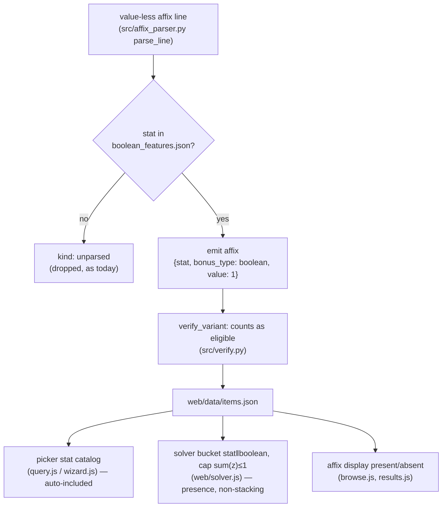

# Dataset Labeling & Set Transparency - Plan

## Goal Capsule

- **Objective:** Close two gaps that make optimizer results less trustworthy — the dataset silently drops or fails to label whole categories of item content (artifacts, boolean features), and the set/alternatives UI names bonuses it does not show or highlights sets it has not actually completed.
- **Product authority:** Owner (garage project).
- **Product Contract preservation:** changed R7 only — corrected its alternative gain-family enumeration to the axes the optimizer actually emits (set, rebalance, unranked, crafts); a clarification, not a scope change. All other R-IDs, Key Decisions, and scope boundaries unchanged.
- **Execution profile:** Two batches in one plan. Batch A (dataset & matching correctness, U1–U5) and Batch B (set & alternatives transparency, U6–U8) are independent and may land as two PRs. Data-pipeline units (U1, U2) rebuild `web/data/items.json`; UI units (U6–U8) do not.
- **Stop conditions:** Any solver-soundness regression (a boolean or artifact change that alters a non-target build's optimum), or a dataset rebuild that quarantines previously-verified items. Surface, don't work around.

---

## Product Contract

### Summary

Make every stat source the optimizer considers visible and correctly classified, and make the set UI honest. Batch A completes the dataset: harvest the empty artifact seed so the shipped opt-in goes live, and stop dropping value-less "boolean" features (Salt-style toggles) — model them as presence (value 1, non-stacking) and let players target them. Batch B fixes three UI honesty gaps: alternatives that add a set now show the actual affixes granted, an item glows as a set piece only once its set is genuinely satisfied, and the Set Bonuses tab lists only real set pieces instead of near-miss and non-set noise.

### Problem Frame

The optimizer's credibility rests on "we show our work." Three current behaviors quietly undercut that:

- A value-less affix line (a boolean feat like Salt, which has no magnitude) is dropped during parsing (`src/affix_parser.py` returns `kind: "unparsed"`) and never becomes solver-eligible. The item's real capability is invisible, and a player who cares about that toggle cannot ask for it.
- `data/seed/artifacts.json` is `[]`, so the already-shipped "Include an Artifact" opt-in has nothing to act on — the feature is inert.
- The set UI overstates: an alternative that completes a set is labeled `activates <Set Name>` with no indication of what that set grants; an equipped item glows as a set piece purely by membership even when the set threshold is unmet; and the Set Bonuses tab mixes near-miss hints and non-set items in with actual set pieces.

Each is a case of the UI or dataset claiming more (or less) than it can prove — the exact failure the project's exclude-until-verified, show-the-attribution discipline exists to prevent.

### Key Decisions

- **Boolean features use presence-bucket semantics, not `untyped`.** (session-settled: user-approved — chosen over a separate `features[]` array with parallel solver logic: presence reuses machinery.) A boolean feature is stored as an affix `{stat, bonus_type: "boolean", value: 1}`. The solver already keeps only the highest value per `stat‖bonus_type` bucket, so multiple sources of the same feature collapse to a single `1` — presence, never 2 — with no new solver primitive. Deliberately **not** modeled as `bonus_type: "untyped"`, because real untyped bonuses stack in DDO and would sum; boolean features must not.
- **Boolean features are fully targetable.** (session-settled: user-directed — chosen over preserve-and-display-only.) They appear in the priority/affix picker and the solver maximizes for their presence, in addition to rendering wherever affixes show.
- **Trove stays an identity/ownership list; magnitudes are always authoritative from our dataset.** (session-settled: user-directed — chosen over parsing per-item specs from the CSV export.) The import never trusts numbers from the export; the work is making the name→dataset match resolve the right variant/stats for every owned item.
- **Artifacts are labeled through the existing seed-stamp path, exclude-until-verified.** Harvesting populates `data/seed/artifacts.json`; `build_dataset.py` stamps `artifact: true` on matching variants; unharvested items carry no flag and are treated as non-Artifact. No new labeling mechanism.
- **The Set Bonuses tab groups by set; per-set accent color is de-prioritized.** (session-settled: user-directed — chosen over assigning each set its own color, and over grouping pieces by augment-slot color.) The load-bearing change is trimming to set-pieces only; a per-set color accent is an optional nicety, not a requirement.

### Requirements

**Batch A — Dataset & matching correctness**

- R1. Artifact-quality items are labeled in the dataset by harvesting the artifact base-item roster into the artifact seed, so the shipped "Include an Artifact" opt-in (exactly-one constraint, slot tag, disclosure) operates on real data. Harvest is exclude-until-verified: an item is flagged only when a trusted source states it is Artifact-quality.
- R2. A value-less feature (a boolean toggle such as Salt) is parsed and preserved instead of dropped, stored with presence semantics: value 1, marked boolean, non-stacking across multiple sources.
- R3. Boolean features are targetable in the ranked priority list, and the solver optimizes for their presence (1 if any equipped source grants it, else 0).
- R4. Boolean features render wherever affixes are shown — item browser, deep dive, and owned-item (Trove) matches — clearly distinguished as present/absent rather than as a magnitude.
- R5. Every owned item matched from an uploaded Trove resolves to the correct dataset variant and its authoritative stats, including items that are artifacts (R1) or carry boolean features (R2). The Trove file supplies identity and ownership only; magnitudes always come from the dataset.

**Batch B — Set & alternatives transparency**

- R6. When an alternative loadout adds a set bonus, the alternative shows the concrete affixes that set grants, not just the set name.
- R7. The transparency in R6 generalizes: every alternative gain family the optimizer emits (set, rebalance, unranked, crafts) states the concrete bonuses it adds, so an alternative is never a bare label.
- R8. An equipped item receives set-piece styling (the "glow"/highlight) only when its set is actually satisfied — enough pieces of that set are equipped to meet a threshold — not merely because the item belongs to a set.
- R9. The Set Bonuses tab shows only items that are actual pieces of a set, grouped by set, and omits near-miss hints and non-set items.

### Acceptance Examples

- AE1. **Covers R2.** Two equipped items each grant Salt (a boolean feature). **Then** the result reflects Salt as present (value 1), not 2; adding a second Salt source never increases its contribution.
- AE2. **Covers R3.** A player adds Salt to their priority list above a magnitude affix. **Then** the solver treats "has Salt" as a satisfiable target and prefers a loadout that includes a Salt source, breaking ties in Salt's favor at that priority rank.
- AE3. **Covers R8.** An item belongs to a 3-piece set but only 1 piece is equipped. **Then** the item does **not** glow as a set piece. **When** a later loadout equips enough pieces to satisfy the threshold, the contributing pieces glow.
- AE4. **Covers R6, R7.** An alternative reads "complete Legendary Might." **Then** the card also lists the affixes Legendary Might grants (concrete stat/type/value lines), so the player sees exactly what the trade buys.
- AE5. **Covers R9.** The current build satisfies one set and is one piece away from another. **Then** the Set Bonuses tab lists only the satisfied set's member pieces (grouped under that set), with no near-miss hint and no non-set items.

### Scope Boundaries

- Parsing per-item affix specs *from* the Trove CSV export — Trove remains name/ownership only.
- Any per-user inventory persistence beyond the existing session import.
- Filigrees, Green Steel, Thunder-Forged, and Essence crafting systems.
- Assigning each set a distinct accent color and recoloring the glow per set — deferred nicety (see Open Questions), not part of this scope unless promoted.

#### Deferred to Follow-Up Work

- Broadening the boolean-feature allowlist beyond the initial verified seed — new toggles are added to `data/seed/boolean_features.json` as they are verified, not planned here.

### Open Questions

**Resolve during planning (defaults stated, no blocker):**

- OQ1. On the trimmed Set Bonuses tab, show each satisfied set's **equipped contributing pieces** (default — the pieces currently forming the set, worn by definition), versus its **full member roster with worn pieces marked** (built from a reverse index of `dataset.items` by set). Default = equipped contributing pieces, since it directly serves the "trim the noise" intent; escalate to full roster only if the user wants the shopping-list view. Resolved in U8 unless the user redirects.
- OQ2. Whether to add a low-cost per-set accent color to the tab and glow (would satisfy the original "grouped by color" phrasing) or leave the single gold styling. Default: leave gold; treat color as a follow-up.
- OQ4. Exact boolean presence marker (U4) — default is a `✓`-prefixed feature label / small pill; the specific glyph or pill styling is a visual choice the implementer may adjust as long as it reads as present/absent, not as a magnitude.

**Deferred to implementation:**

- OQ3. Source and method for the artifact roster harvest (DDO wiki API vs gear-planner catalog), reusing the established DDO-wiki bulk-data bridge. Data-sourcing detail resolved in U1.

### Sources / Research

Current-state code pointers (repo-relative), confirmed during planning:

- **Artifacts:** `data/seed/artifacts.json` is `[]`; `build_dataset.py` `load_artifacts` (`:153`) returns a set of `source_item` names, `stamp_artifact` (`:169`) stamps `artifact: true` on matching variants, wired at `:328`. Opt-in gate `web/model.js:96`; exactly-one constraint `web/solver.js:112`; disclosure `web/results.js:485`. Shipped PR #51, inert.
- **Boolean parse seam:** `src/affix_parser.py` `parse_line` returns `kind: "unparsed"` at `:172-173` when `_parse_value_bearing` yields `[]` (`:120`); `_affix` shape at `:63`; `_NON_MAGNITUDE`/`_NOISE` guards at `:160-166`. `parse_enhancements` (`:186`) routes `kind:"affix"` into `out["affixes"]`. `src/verify.py` `verify_variant` (`:14`) counts eligibility by list length, bonus_type-agnostic, so a boolean affix auto-verifies its item.
- **Solver/objective:** `web/solver.js` buckets `${stat}||${bonus_type}` with `value > 0` guard (`:82`); objective `rawExpr`/`effectiveExpr` (`:621-664`) match on stat, never enumerate bonus_type; per-bucket cap `sum(z) <= 1` (`:676`). No bonus_type allowlist exists — `boolean` forms its own bucket. `web/model.js` `variantBuckets` (`:27`).
- **Picker:** targetable stats built from `dataset.items` affix/scaling/set stats in `web/query.js:7-15` and mirrored in `web/wizard.js:71-78`; boolean stats are auto-included once emitted into `affixes[]`.
- **Alternatives + set expander:** `web/alternatives.js` `analyzeAlternative` set gain is `activates ${meta.set}` (`:42`); `web/results.js` `activeSetDetail` (`:419`, exported `:761`) expands `parsed_set_bonuses` tiers to `{set, pieces, slots, affixes}`; `set-grants` render `:678-682`; `affixLabel` `:6`.
- **Glow + tab:** `web/results.js` `slotSetNames` (`:300`) keys `is-set` off `v.set_bonus` membership; applied at `:312/:337/:364/:404`. `result.setsActive` (`web/solver.js:816`) is solver-*activated* tiers (`prim(s) > 0.5`), a subset of threshold-met. Set panel `#rp-sets` content at `results.js:555`, built `:678-689`; `nearMissSetHints` `:86-113`.
- **Institutional learnings:** `docs/solutions/conventions/exclude-until-verified-data-gates.md` (R1/R2 harvest discipline), `docs/solutions/design-patterns/parsing-ddo-wiki-affix-text.md` (R2 parser), `docs/solutions/design-patterns/milp-encoding-for-gear-optimization.md` (R2/R3 solver soundness), `docs/solutions/design-patterns/single-source-of-truth-for-set-definitions.md` (set data), `docs/solutions/developer-experience/browser-verify-against-real-data-not-just-unit-tests.md` (UI verification).

---

## Planning Contract

### Key Technical Decisions

- KTD1. **Boolean features come from a curated allowlist seed, not from every value-less line.** (session-settled: user-directed — chosen over emitting all value-less lines as boolean: exclude-until-verified, and procs / on-hit effects / weapon dice are not toggles and would be misclassified.) A new `data/seed/boolean_features.json` (flat list of feature names, Salt seeded) gates the parser emit; a value-less line becomes a boolean affix only when its stat is on the list, otherwise it stays `unparsed` as today.
- KTD2. **Presence-bucket representation** — inherits Product Contract Key Decision. A boolean affix is `{stat, bonus_type: "boolean", value: 1}` and flows through the existing `stat‖bonus_type` bucket unchanged; multiple sources collapse to 1 via the existing highest-of-bucket rule. No solver code enumerates bonus_type, so no allowlist edit is needed there.
- KTD3. **Boolean parse emit lives in `parse_line`, between the value-bearing branch and the `unparsed` fallback** (`src/affix_parser.py:170-173`), after the `_NOISE`/`_NON_MAGNITUDE` guards so noise and genuine magnitude-bearing-but-unparsed lines are unaffected.
- KTD4. **Glow gates on threshold-met piece count, not `setsActive`.** `setsActive` lists only tiers the solver *activated* to advance a target; a set can be threshold-met yet not activated. R8 says "until it satisfies a set," so a small client-side helper computes satisfied sets from equipped `set_bonus` piece counts (`count(set) >= pieces_required`) and `is-set` consults that. This is a strict superset of `setsActive` and avoids under-glowing.
- KTD5. **One set-expansion path.** Both the alternatives fix (R6/R7) and the Set Bonuses tab reuse the exported `activeSetDetail` expander, so a set's granted affixes render identically everywhere and there is no parallel tier-expansion logic in `alternatives.js`.
- KTD6. **Trove matching is verified, not rebuilt.** R5 is satisfied transitively once artifacts (U1) and boolean features (U2) are in the dataset — `web/import.js` matches by `source_item` and the matched variant already carries the authoritative stats. The unit's work is confirming import does not filter out artifact-flagged or boolean-only-eligible variants, plus coverage; no new ingestion path.

### High-Level Technical Design

Boolean-feature data flow — the seed gate is the only new stage; everything downstream is existing machinery that already handles an arbitrary `(stat, bonus_type, value)`:

Glow signal distinction (KTD4) — three candidate signals, R8 selects the middle one:

- `v.set_bonus` membership (current glow basis) — glows too eagerly.
- **threshold-met piece count** (`count(set) >= pieces_required`) — R8's target.
- `result.setsActive` solver-activated tiers — too narrow; misses satisfied-but-unused sets.

---

## Implementation Units

### U1. Harvest and stamp the artifact seed

- **Goal:** Populate `data/seed/artifacts.json` with the verified Artifact-quality base-item roster so the shipped opt-in operates on real data.
- **Requirements:** R1. Inherits Key Decision "Artifacts labeled through existing seed-stamp path."
- **Dependencies:** none.
- **Files:** `data/seed/artifacts.json`, `tests/test_artifact_flag.py`.
- **Approach:** Harvest the Artifact-quality base-item names via the established DDO-wiki bulk-data bridge (OQ3), writing a flat JSON array of `source_item` strings. No code change — `load_artifacts`/`stamp_artifact` already consume this seed. Exclude-until-verified: include a name only when the source explicitly states Artifact quality; leave the rest unflagged. Rebuild `web/data/items.json`.
- **Patterns to follow:** `docs/solutions/conventions/exclude-until-verified-data-gates.md`; existing seed-shard format under `data/seed/`.
- **Test scenarios:**
  - Covers R1. After harvest, `stamp_artifact` flags at least one variant, and a variant whose `source_item` is on the seed carries `artifact: true`.
  - A variant whose `source_item` is absent from the seed carries no `artifact` field (non-Artifact default preserved).
  - With the opt-in on and a solver query, an Artifact is includable and tagged; with it off, no Artifact is chosen.
- **Verification:** `python3 build_dataset.py` rebuilds without new quarantines; `python3 tests/run_tests.py` green; the live opt-in yields an Artifact in a build that wants one.

### U2. Boolean-feature seed + parser emit

- **Goal:** Stop dropping allowlisted value-less features; emit them as presence affixes.
- **Requirements:** R2. Inherits KTD1, KTD2, KTD3.
- **Dependencies:** none.
- **Files:** `data/seed/boolean_features.json` (new), `src/affix_parser.py`, `src/variants.py`, `build_dataset.py`, `tests/test_affix_parser.py`, `tests/test_verify.py`.
- **Approach:** Add `data/seed/boolean_features.json` — a flat list of verified boolean-feature stat names (Salt seeded). Load it in `build_dataset.py` parallel to `load_artifacts`. The parser is not called from `build_dataset.py` directly — it is reached through `src/variants.py` (`expand_dataset → expand_item → parse_enhancements → parse_line`), so thread the allowlist set through those `variants.py` functions to `parse_line`, or set a module-level allowlist in `affix_parser` that `build_dataset.py` populates before `expand_dataset` runs. In `src/affix_parser.py` `parse_line`, after the value-bearing branch and the `_NOISE`/`_NON_MAGNITUDE` guards and before the `unparsed` fallback (`:170-173`), if the recognized stat is on the allowlist, return `kind: "affix"` with `[_affix(stat, "boolean", 1, "flat", raw)]`. Non-allowlisted value-less lines keep returning `unparsed`. Rebuild the dataset.
- **Execution note:** Add a failing `test_affix_parser` case for an allowlisted line first — the emit path is the whole behavior change.
- **Patterns to follow:** `_affix` helper (`src/affix_parser.py:63`); `load_artifacts` seed-loader shape (`build_dataset.py:153`); `docs/solutions/design-patterns/parsing-ddo-wiki-affix-text.md`.
- **Test scenarios:**
  - Covers R2. An allowlisted value-less line ("Salt") parses to `{stat:"Salt", bonus_type:"boolean", value:1}` with `kind:"affix"`.
  - A non-allowlisted value-less line (a named proc, an immunity, a weapon-dice line) still returns `kind:"unparsed"` — no boolean emitted.
  - `verify_variant` counts a boolean-only item's affix as eligible, so an item whose only content is Salt is `verified`, not `quarantined`.
  - An empty/missing `boolean_features.json` disables the emit entirely (no boolean affixes appear) — exclude-until-verified holds.
- **Verification:** `python3 tests/run_tests.py` green; rebuilt `web/data/items.json` contains Salt as a boolean affix on its items and nowhere else.

### U3. Boolean presence in solver + picker

- **Goal:** Confirm and lock in that a boolean affix is targetable and scores as non-stacking presence.
- **Requirements:** R3. Inherits KTD2.
- **Dependencies:** U2.
- **Files:** `tests/solver.test.js`, `web/query.js` and `web/wizard.js` (only if a guard rejects the new stat), `tests/wizard.test.js`.
- **Approach:** The picker builds its stat catalog from `dataset.items` affixes, so Salt is auto-selectable; the solver bucket is keyed by the raw `stat‖bonus_type` string with a `value > 0` guard, so `value:1` flows through and `sum(z) ≤ 1` enforces presence. This unit's real work is characterization: add solver tests proving the behavior and confirm no picker guard rejects a boolean stat. Add code only if a test reveals a gap (e.g. a stat-catalog filter that excludes `bonus_type:"boolean"`).
- **Execution note:** Test-first — write the presence and non-stacking assertions, then only touch code if they fail.
- **Patterns to follow:** existing bucket/objective handling (`web/solver.js:78-99`, `:621-680`); stat-catalog build (`web/query.js:7-15`).
- **Test scenarios:**
  - Covers AE1. Two equipped items each granting Salt yield a Salt contribution of 1, not 2.
  - Covers AE2. With Salt ranked as a target, the solver prefers a loadout containing a Salt source and breaks ties toward Salt at that rank; with Salt not a target, its presence never perturbs the optimum (soundness).
  - Salt appears in the targetable-stat list surfaced by the picker.
- **Verification:** `node tests/solver.test.js` and `node tests/wizard.test.js` green; adding Salt as a priority in the live app returns a Salt-bearing build.

### U4. Render boolean features as present/absent

- **Goal:** Show boolean features wherever affixes render, distinguished from magnitudes.
- **Requirements:** R4.
- **Dependencies:** U2.
- **Files:** `web/browse.js`, `web/results.js`, `tests/browse.test.js`, `tests/results.test.js`, `tests/attribution.test.js`.
- **Approach:** Special-case `bonus_type === "boolean"` to render the feature as a **presence marker** — a distinct "feature" pill or prefixed glyph (default `✓ Salt`), not a bare name, so it does not read as a broken `+N` magnitude sitting next to real magnitudes (OQ4). Apply it at **every** surface that formats an affix value, not only `affixLabel` (`web/results.js:6`) and the browse render (`web/browse.js:42-47`): the per-target attribution list and the "why this" line (`attributionList`/`whyThisLine` in `web/results.js`) build `+${value}` strings directly, so a *targeted* boolean would otherwise show "+1" there — route those through the same presence-aware formatter.
- **Patterns to follow:** existing `affixLabel` formatting; factor the present/absent decision into one shared formatter so all sites agree.
- **Test scenarios:**
  - Covers R4. A boolean affix renders as its presence marker (e.g. "✓ Salt"), not "+1 Salt", in browse and the deep dive.
  - Covers R4. A *targeted* boolean feature renders as present (no "+1") in the attribution list and the "why this" line, not only in the deep dive.
  - A magnitude affix on the same item still renders with its value and type.
- **Verification:** `node tests/browse.test.js tests/results.test.js` green; browser check shows Salt as a present/absent feature on a known item.

### U5. Confirm Trove matching resolves artifacts and boolean items

- **Goal:** Guarantee every owned item — including artifacts and boolean-only items — matches to the correct dataset variant with authoritative stats.
- **Requirements:** R5. Inherits KTD6 (Trove matching verified, not rebuilt) and the Product Contract "Trove stays an identity/ownership list" Key Decision.
- **Dependencies:** U1, U2.
- **Files:** `web/import.js` (only if a filter drops eligible variants), `tests/import.test.js`, `tests/test_planner_import.py`.
- **Approach:** `web/import.js` matches owned names to variants by `source_item`; the matched variant carries stats, so artifacts (U1) and boolean-bearing items (U2) resolve transitively. Verify `filterItemsToOwned` and the owned-name match do not exclude artifact-flagged or boolean-only-eligible variants, and add coverage. No new ingestion path; the export supplies identity only.
- **Test scenarios:**
  - Covers R5. An owned item that is Artifact-quality matches and its stats come from the dataset variant.
  - An owned item whose only eligible content is a boolean feature still matches and is retained in the owned pool.
  - The importer reads only the identity/ownership columns; magnitudes never come from the CSV.
- **Verification:** `node tests/import.test.js` and `python3 tests/run_tests.py` green; a sample Trove containing an artifact and a Salt item resolves both.

### U6. Gate set glow on threshold satisfaction

- **Goal:** An item glows as a set piece only when its set is actually satisfied.
- **Requirements:** R8. Inherits KTD4.
- **Dependencies:** none (Batch B).
- **Files:** `web/results.js`, `tests/results.test.js`.
- **Approach:** Add a helper that computes the set of satisfied sets for a build from equipped `set_bonus` piece counts (`count(set) >= pieces_required`, reading `pieces_required` from `parsed_set_bonuses`/set metadata). Change the `is-set` decision in `slotSetNames` (and its application sites — paperdoll `:312`, deep dive `:337`, equipped row `:364`, attribution `:404`) to intersect membership with the satisfied-set set, so only pieces of a satisfied set glow.
- **Patterns to follow:** `nearMissSetHints` (`web/results.js:86`) already counts equipped pieces per set — mirror that counting to derive satisfied sets; `activeSetDetail` for tier metadata.
- **Test scenarios:**
  - Covers AE3. 1 of 3 pieces equipped → no glow on that piece; enough pieces to meet the threshold → the contributing pieces glow.
  - A set that is threshold-met but not solver-activated still glows (satisfied ⊇ activated).
  - A single-piece set (threshold 1) glows immediately when worn.
- **Verification:** `node tests/results.test.js` green; browser check across a partial-set and a completed-set build.

### U7. Alternatives show the concrete bonuses they add

- **Goal:** Every alternative states the affixes it grants, not just a label.
- **Requirements:** R6, R7. Inherits KTD5.
- **Dependencies:** none (Batch B); shares the expander with U8.
- **Files:** `web/alternatives.js`, `web/results.js`, `tests/alternatives.test.js`, `tests/results.test.js`.
- **Approach:** Resolve the module boundary first: `web/alternatives.js` is pure data (no DOM) and does not import `web/results.js`, so the affix expansion happens at the **render layer**, not in `analyzeAlternative`. Keep `analyzeAlternative` carrying the set identity (`meta.set`); at the card render site (`web/results.js:697-698`) call the exported `activeSetDetail(sol)`, match the entry where `.set === meta.set`, and render `.affixes.map(affixLabel)` on a **dedicated affix detail line beneath the gain label** (not inline — a set can grant several affixes, and a dedicated line keeps card height consistent). Generalize the principle to the other gain families (rebalance, unranked, crafts) so each names the concrete affix delta it adds.
- **Patterns to follow:** `activeSetDetail` + `set-grants` rendering (`web/results.js:678-682`); reuse `affixLabel`. Do not re-derive tiers in `alternatives.js`.
- **Test scenarios:**
  - Covers AE4. A set alternative lists the set's granted affixes alongside its name.
  - A non-set alternative (augment/craft/rebalance) names the concrete stat delta it adds, not a bare tag.
  - Boolean features added by an alternative render as present, consistent with U4.
- **Verification:** `node tests/alternatives.test.js tests/results.test.js` green; browser check on the Alternatives tab.

### U8. Trim the Set Bonuses tab to set-pieces only

- **Goal:** The tab lists only actual set pieces, grouped by set, with no near-miss or non-set noise.
- **Requirements:** R9. Resolves OQ1. Inherits KTD4, KTD5.
- **Dependencies:** U6 (threshold-satisfied helper). Shares the `activeSetDetail` tier-affix expansion with U7, which is already exported — a render-consistency link, not a hard build dependency.
- **Files:** `web/results.js`, `tests/results.test.js`.
- **Approach:** In the `setsPanel` build (`web/results.js:678-689`), drop the `nearMissSetHints` block. Select which sets to show from the **U6 threshold-satisfied helper** (`count(set) >= pieces_required`), **not** from `activeSetDetail`/`setsActive` — `setsActive` is the solver-*activated* subset, so a threshold-met-but-unused set would glow via U6 yet vanish from the tab, and AE5's "satisfied" wording would go unmet. For each satisfied set, resolve its granted affixes at the satisfied tier (reuse `activeSetDetail`'s tier-affix map, keyed `set||pieces_required`) and list its **equipped contributing pieces** by item name grouped under the set (OQ1 default), keeping the granted-affixes line. Fall back to "no set bonuses active" when none. If the user promotes OQ1 to the full roster, build a reverse index of `dataset.items` by set to enumerate all members and mark the worn ones — hold that behind OQ1.
- **Patterns to follow:** `activeSetDetail` (already yields `slots` per set; extend to piece/item names); existing `set-card` markup.
- **Test scenarios:**
  - Covers AE5. With one satisfied set and one near-miss, the tab shows only the satisfied set's pieces grouped under it; the near-miss hint is absent.
  - Non-set equipped items never appear in the tab.
  - Each listed set shows its granted affixes (consistent with U7).
- **Verification:** `node tests/results.test.js` green; browser check confirms near-miss and non-set entries are gone.

---

## Verification Contract

| Gate | Command | Applies to |
|---|---|---|
| Dataset rebuild | `python3 build_dataset.py` | U1, U2 (must rebuild with no new quarantines) |
| Python suite | `python3 tests/run_tests.py` | U1, U2, U5 |
| Solver soundness | `node tests/solver.test.js` | U3 |
| Model/browse/results/alternatives/import/wizard | `node tests/model.test.js tests/browse.test.js tests/results.test.js tests/alternatives.test.js tests/import.test.js tests/wizard.test.js` | U3–U8 |
| Browser verification | localhost `python3 -m http.server 8000` + Claude-in-Chrome against real data | U4, U6, U7, U8 (per `docs/solutions/developer-experience/browser-verify-against-real-data-not-just-unit-tests.md`) |

**Soundness obligation (standing):** every boolean and glow change must leave a build's optimum unchanged when the affected feature is not a target. Assert this explicitly in U3.

## Definition of Done

| Unit | Done when |
|---|---|
| U1 | `artifacts.json` harvested; opt-in yields a tagged Artifact live; `test_artifact_flag.py` green; no new quarantines. |
| U2 | `boolean_features.json` seeded; allowlisted value-less lines emit boolean affixes, non-allowlisted stay dropped; `test_affix_parser.py`/`test_verify.py` green. |
| U3 | Salt is targetable; two sources = presence 1; non-target Salt never perturbs the optimum; `solver.test.js` green. |
| U4 | Boolean features render as present/absent in browse, deep dive, and Trove matches; browse/results tests green. |
| U5 | Owned artifacts and boolean items resolve to authoritative dataset stats; import tests green. |
| U6 | Only pieces of a threshold-satisfied set glow; `results.test.js` green; browser-confirmed. |
| U7 | Every alternative names the concrete bonuses it adds; alternatives/results tests green; browser-confirmed. |
| U8 | Set Bonuses tab shows only set pieces grouped by set, no near-miss/non-set noise; `results.test.js` green; browser-confirmed. |
