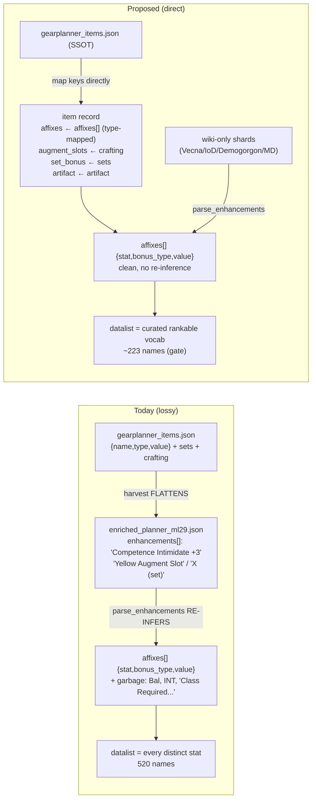

# refactor: Source gear-planner affixes structurally instead of re-parsing flattened text

## Summary

The priority-picker autocomplete the user ranks stats in is built from every distinct `affix.stat` in the dataset — **520 names today, ~159 used ≤2 times, riddled with parse garbage** (`Bal`, `INT`, `OL`, `DD`, `Craftable`, `Class Required: Wizard, Sorcerer, Bard (UMD`, `Improved Deception +17 (Bug: Provides +5 to bluff, not`, `Penalty Balance +`, leaked filigree/proc text). That garbage is **manufactured at build time**: for the ~8,091 gear-planner-sourced items (the bulk of the roster), the harvest step flattened the gear-planner dump's already-structured affixes (`{name, type, value}`) into free-text `enhancements[]` strings like `"Competence Intimidate +3"`, which `src/affix_parser.py` then re-infers back into `{stat, bonus_type, value}` — badly.

This plan makes `data/seed/compendium/raw/gearplanner_items.json` the **single source of truth for item affixes** (exactly as `gearplanner_sets.json` already is for set bonuses): `build_dataset.py` reads it directly and maps its separate `affixes` / `sets` / `crafting` / `artifact` keys onto item records, emitting structured affixes with no free-text round-trip. The lossy flattened shard (`enriched_planner_ml29.json`) is retired.

> **Two roster/data facts the plan resolves as settled decisions** (surfaced by review, verified against the data): (1) the retired shard holds a **curated 6,195-item subset**; the raw dump has **8,091 records / 7,947 distinct names**, so a full read **adds 1,752 names and drops 0** — including the deliberately-curated ML33–35 endgame band, and the 6,195 curation filter is *uncommitted*. **Resolved (KTD5):** own the growth — existing shards win collisions, net-new items are gated by `verify.py`; "zero-drift" is replaced by a no-dropped-names + accounted-count target. (2) **5,193 affixes carry a null/absent `type`** (Holy, Vampirism, procs/banes); the literal token `Untyped` appears **0 times**. The bonus-type reconciliation is specified against the *actual* token set. **Resolved (KTD6):** quarantine null-typed affixes by default (behavior-neutral for solves) with a verified allowlist. Wiki-only enriched shards (Vecna, IoD, Demogorgon, Myth Drannor) keep going through the parser, and a curated rankable-affix vocabulary — derived from the gear-planner source — gates the datalist so residual parser noise never reaches the user-facing suggestion list.

The item-record affix schema (`{stat, bonus_type, value, unit}`) is **unchanged**, so the solver, `model.js`, and `results.js` are untouched — the blast radius is the build pipeline plus three datalist call-sites.

---

## Problem Frame

**What's broken:** The affix vocabulary a user ranks is polluted and non-authoritative. The pollution is a build-time artifact of a lossy round-trip, not a data problem in the seed.

**Root cause chain:**
1. `gearplanner_items.json` carries clean structured affixes: `{name:"Intimidate", type:"Competence", value:"3"}`.
2. A one-shot harvest transform (not committed to the repo) flattened each affix to a free-text line (`"Competence Intimidate +3"`) in `enhancements[]`, and *also* crammed augment-slot and set-membership metadata — which the raw dump keeps in separate `crafting` / `sets` keys — into the same string list (`"Yellow Augment Slot"`, `"Forbidden Knowledge (set)"`). Result: `data/seed/compendium/enriched_planner_ml29.json`.
3. At build, `src.variants.parse_enhancements` (→ `src.affix_parser`) re-parses those strings back into `{stat, bonus_type, value}`. The re-parse tokenizes noise into fake stat names.
4. `web/wizard.js:84-92` (mirrored in `query.js`, `browse.js`) builds the datalist from the distinct set of resulting `affix.stat` values — garbage included.

**Why direct-read is the right lever:** The raw dump is strictly *richer* than the flattened shard (separate `affixes`/`sets`/`crafting`/`artifact` keys vs. one merged string list). Reading it directly both eliminates the re-inference and recovers structure the flatten had merged away. `verify.py` already marks any clean `{stat, bonus_type, value}` affix solver-eligible, so structured affixes pass verification trivially.

**In scope:** gear-planner-sourced items (the bulk). **Out of scope for structured sourcing:** wiki-only enriched shards — handled defensively by the datalist gate, and left for a follow-up to store structurally.

---

## Requirements

- **R1** — For gear-planner-sourced items, affixes come directly from `gearplanner_items.json`'s structured `{name, type, value}`, never from re-parsing a flattened `enhancements[]` string.
- **R2** — Augment slots, set membership, and artifact status for those items are sourced from the raw dump's `crafting`, `sets`, and `artifact` keys, not extracted from free-text.
- **R3** — The item-record affix schema (`{stat, bonus_type, value, unit}`) and every downstream consumer (solver, `model.js`, `results.js`, `browse.js` item rendering) are behavior-unchanged.
- **R4** — Gear-planner `type` tokens are reconciled to the project's canonical `BONUS_TYPES` with an explicit, reviewed mapping **built from the actual token set in the dump** (including a defined rule for the null/absent-type bucket); unknown/unmapped types are handled by an exclude-until-verified rule, never silently coerced into a wrong stacking bucket.
- **R5** — The priority-picker datalist (`wizard.js`, `query.js`, `browse.js`) is gated on a curated rankable-affix vocabulary derived from the gear-planner source. The solver still accepts any affix a user types — only the *suggestion list* is curated.
- **R6** — The flattened `enriched_planner_ml29.json` shard is retired with **no dropped names** and an **explicitly accounted roster membership** (per OQ1): either the read reproduces the curated 6,195 set, or the resulting growth is intentional, gated, and its new count stated. "No silent drift" — not "zero delta."
- **R7** — The build stays deterministic (stable ordering, stable tie-breaks) and the full test suite (Python + node) passes.
- **R8** — Exclude-until-verified discipline and per-result coverage disclosure are preserved.

---

## Key Technical Decisions

**KTD1 — `gearplanner_items.json` becomes the SSOT for item affixes, read directly at build.**
Rationale: parallels the existing `gearplanner_sets.json` SSOT convention; eliminates the lossy round-trip at the source rather than patching its output. *(session-settled: user-directed — chosen over regenerating a structured `enriched_planner_ml29.json` shard: fewer moving parts, no redundant intermediate file, recovers merged-away `crafting`/`sets` structure.)*

**KTD2 — Structured affixes bypass `affix_parser`; the parser is retained only for wiki-only shards.**
An item record may carry structured affixes directly; when present, `build_dataset`/`variants` use them as-is and skip `parse_enhancements`. `affix_parser.py` is **not** deleted — Vecna/IoD/Demogorgon/Myth Drannor enriched shards still carry free-text `enhancements[]` and still need it.

**KTD3 — Gear-planner `type` tokens reconcile via an explicit mapping table built from the dump's *actual* tokens.**
The mapping is derived by enumerating the distinct `type` values actually present in `gearplanner_items.json` — **not** an assumed list. Verified token facts: the largest non-Enhancement bucket is **null/absent `type`** (5,193 affixes: `Holy`, `Chilling`, `Vampirism`, `Maiming`, `*-Bane`, procs); the literal token `Untyped` does **not occur**; small unmapped tokens include `-` (18, DR), `Adamantine` (4), `Epic` (1). So:
- **Null/absent `type` → quarantine by default (KTD6)**, with a verified allowlist for genuinely-real typeless stats. Behavior-neutral for solves (these never match a ranked target); characterization-tested against the current flatten→parse output for one such item.
- Add the legit DDO stacking types actually present that the project lacks — from the observed set (e.g. `Deflection`, `Luck`, `Vitality`, `Implement`, `Natural`, `Determination`, `Armor`, `Shield`, `Orb`, `Maximum dexterity`, and the `X Natural` variants). Do **not** add phantom tokens (`Psionic`, `Artifact Natural`, `Profane Natural`) that don't appear in the data.
- Route `Bool` → the existing `boolean` presence mechanism. Keep `Penalty` sign-preserving. Coerce string values (`"3"`) to numbers.
- Damage/weapon-dice/alignment-bane descriptors are stored verbatim but **excluded from the rankable vocabulary** (not lexicographic-target-relevant).
- Any remaining unmapped token (`-`, `Adamantine`, `Epic`, …) is quarantined and disclosed — never guessed.

*(Adding new bonus types is solver-safe: the MILP treats each distinct `bonus_type` as its own stacking bucket, so new types add without touching solver code.)*

**KTD4 — Curated rankable vocabulary is derived at build and emitted into `items.json` metadata.**
The gate list = gear-planner affix `name`s with a real (mapped) bonus type and a numeric magnitude (~223 coherent names), unioned with the curated `CORE_STATS`/alias set in `vocab.py`. The three datalist call-sites read this list instead of "every stat present." Belt-and-suspenders: keeps wiki-only parser noise out of the user's view even before those shards are stored structurally.

---

## High-Level Technical Design

The two data flows converge on the identical `affixes[]` schema; only the *route* changes for gear-planner items, and the datalist gains a gate.

---

## Implementation Units

### U1. Structured-affix ingest path

**Goal:** Let an item record carry structured affixes directly and have the build use them verbatim, skipping `parse_enhancements`.
**Requirements:** R1, R3, R8.
**Dependencies:** none.
**Files:** `build_dataset.py`, `src/variants.py`, `tests/test_variants.py` (or the nearest existing variants/pipeline test module — confirm at implementation).
**Approach:** Introduce a recognized structured-affix carrier on item records (e.g. a `structured_affixes` list of `{stat, bonus_type, value, unit}`, or an already-parsed `affixes` field flagged so tier expansion knows not to re-parse). In `variants.py`, when a record carries structured affixes, use them as the base parsed affixes and run tier-variant expansion / vocab normalization on them directly; when it does not, fall back to `parse_enhancements(enhancements)` exactly as today. Ensure `normalize_stat` (existing `src/vocab.py`, extended in U2) is applied on the structured path so spellings unify. Preserve `scaling`, `roll_groups`, and per-affix `eligible` annotation semantics.
**Patterns to follow:** existing `parse_enhancements` → variant-expansion flow in `src/variants.py:103-111`; per-affix eligibility in `src/verify.py:15-18`.
**Test scenarios:**
- A record with structured affixes yields those affixes verbatim (post-normalization), and `parse_enhancements` is **not** invoked for it.
- A record with only `enhancements[]` (no structured affixes) parses exactly as today (characterization — snapshot a known wiki-only item's affixes before/after; must be identical).
- Tier expansion over a structured-affix base produces per-tier variants with correct ML/value scaling.
- A structured affix with a `%` unit and a negative (`Penalty`) value round-trips sign and unit intact.
- `verify.py` marks a structured-affix item solver-eligible (`eligible_affix_count > 0`, not quarantined).
**Execution note:** Add a characterization snapshot of one wiki-only item's parsed affixes *before* changing the branch, so the fallback path is proven unchanged.
**Verification:** Build runs; a spot item known to be gear-planner-sourced shows clean affixes with no fabricated stat names.

### U2. Bonus-type and stat vocabulary reconciliation

**Goal:** Map gear-planner `type` tokens onto the project's canonical `BONUS_TYPES`, extend the type set with the legit types the gear-planner surfaces, and quarantine the unknown (incl. the null-typed bucket per KTD6).
**Requirements:** R4, R8; implements KTD6.
**Dependencies:** none (consumed by U3).
**Files:** `src/vocab.py`, `src/affix_parser.py` (the `BONUS_TYPES` set), `src/colors.py` (only if augment-color mapping is touched — likely not), `tests/test_vocab.py` (or nearest existing vocab test).
**Approach:** First enumerate the **distinct `type` tokens actually present** in `gearplanner_items.json` (script it; do not assume). Build `GEARPLANNER_TYPE_MAP` from that observed set. Extend `BONUS_TYPES` with the legit stacking types the dump actually surfaces (e.g. `Deflection, Luck, Vitality, Implement, Natural, Determination, Armor, Shield, Orb, Maximum dexterity` and observed `X Natural` variants). Add the **null/absent-type rule** per KTD6: quarantine null-typed affixes by default (flagged, disclosed in coverage), with a small verified allowlist promoting genuinely-real typeless stats to live affixes. Route `Bool` into the existing boolean-presence path (`set_boolean_features` / `{bonus_type:"boolean", value:1}`). Coerce string values to numbers. Keep `Penalty` sign-preserving. An unmapped token (`-`, `Adamantine`, `Epic`, …) → the affix is quarantined (flagged, not emitted as a magnitude affix) and disclosed, never coerced.
**Patterns to follow:** the existing `STAT_ALIASES` / `normalize_stat` machinery in `src/vocab.py`; the exclude-until-verified boolean allowlist in `src/affix_parser.py:34-49`.
**Test scenarios:**
- Each mapped gear-planner type resolves to the expected canonical `BONUS_TYPES` member.
- `Bool` produces a `{bonus_type:"boolean", value:1}` presence affix, not a magnitude affix.
- A **null/absent-type** affix (e.g. a `Holy`/`Vampirism` weapon proc) is quarantined per KTD6; an allowlisted typeless stat is emitted live. A characterization test pins today-vs-after for one such item so the change is intentional, not accidental.
- A string value (`"3"`) is coerced to a number `3`.
- An `"X Natural"` affix that actually occurs maps to the intended natural-armor stacking type; a token that does not occur (`Psionic`, `Artifact Natural`) is **not** in the map.
- An unknown/unmapped token (`-`, `Adamantine`, `Epic`) is quarantined and surfaced in coverage, not emitted as a live affix.
- Two affixes of the same canonical type on one item collapse to the highest (stacking rule) in a solver spot-check.
**Verification:** No dataset affix carries a `bonus_type` outside `BONUS_TYPES ∪ {boolean, Untyped}`; unmapped types appear only in quarantine/coverage output.

### U3. Gear-planner raw-dump reader and shard retirement

**Goal:** Read `gearplanner_items.json` directly, map its keys onto structured item records, and retire the flattened `enriched_planner_ml29.json` without double-listing.
**Requirements:** R1, R2, R6, R7; implements KTD5.
**Dependencies:** U1, U2.
**Files:** new `src/planner_items.py` (reader/mapper), `build_dataset.py` (wire it into the merge; drop `enriched_planner_ml29.json` from the enriched glob or exclude by name), `data/seed/compendium/enriched_planner_ml29.json` (delete or neutralize — see approach), `tests/test_planner_items.py`.
**Approach:** New module reads `data/seed/compendium/raw/gearplanner_items.json` and maps each item → the pipeline's record shape: `affixes` ← `affixes[]` (type-mapped via U2, name-normalized via U3 vocab), `augment_slots` ← parse colors out of the `crafting[]` entries ("Yellow Augment Slot" → "Yellow"; pass non-augment crafting entries through to their existing handlers, e.g. seal slots), `set_bonus` ← `sets[]` (matched against the `gearplanner_sets.json` catalog — reuse `set_catalog`, do **not** re-harvest), `artifact` ← `artifact`, plus `slot` / subtype (`type`) / `minimum_level` (`ml`) / `wiki_url` (`url`). Feed these records into the existing merge/dedup flow (`build_dataset.py:229-261`) in place of the retired shard. Because base-seed and other enriched shards dedup by name with base-seed-wins, the direct-read records slot into the same "gear-planner shard sorts first" position the retired shard held — preserve that ordering so seal-carrier marker attachment (the KTD6 dedup trap noted in project memory) still lands on the right record. **Structured records must self-populate `set_bonus` from the `sets` key** — the existing enriched set-attachment block (`build_dataset.py:274-304`) only derives sets from `enhancements[] "(set)"` markers that structured records won't carry, so the reader wires `set_bonus` itself against the `gearplanner_sets.json` catalog. **Intra-source name collisions:** the raw dump has 144 duplicate-name groups; ~6 are genuinely distinct items sharing a name (e.g. "Chains" as both a Belt and a Necklace at ML8). Name-keyed first-wins dedup would silently drop one of each — disambiguate on `name+slot` or accept the drop explicitly with a coverage line. **Roster membership (KTD5):** admit all raw-dump items; existing base-seed/enriched shards (incl. the shipped R4 endgame band) win name collisions via the existing dedup, and net-new items flow through `verify.py`'s exclude-until-verified gate. Record the resulting post-dedup roster count as the new accounted target. Retire the flattened shard by deleting the file; if any other code references it by name, neutralize instead and note why.
**Patterns to follow:** `load_enriched_items` and the dedup passes in `build_dataset.py:200-261`; the set-catalog SSOT usage in `src/set_catalog.py`; augment-color parsing wherever `augment_slots_norm` is currently produced.
**Test scenarios:**
- A known gear-planner item (e.g. "Absorption Gauntlet") maps to the expected slot, ML, augment slots (`["Yellow"]`), and set membership (`Forbidden Knowledge`) with clean structured affixes.
- **No names are dropped** relative to the retired shard (assert the pre-change name set is a subset of the post-change name set), and the post-change roster count equals the KTD5 accounted-growth number — not a hard-coded zero delta. Net-new items with no verified affix land in quarantine (assert a sample does), not the live pool.
- A genuinely-distinct same-name pair (e.g. "Chains" Belt vs Necklace) both survive under the chosen disambiguation, or the drop is asserted intentionally.
- An item with a `sets` entry resolves its `set_bonus` from the `gearplanner_sets.json` catalog, identical to how an intrinsically-defined member resolves.
- A seal-carrier marker item still attaches to the correct live record after the ordering change (regression against the KTD6 trap).
- Build is deterministic: two runs produce byte-identical `items.json` (or identical after canonical sort).
**Execution note:** Land the reader and prove parity *before* deleting the shard; run the full build and diff roster size/slots against the pre-change dataset.
**Verification:** `python3 build_dataset.py` succeeds; roster size stable; distinct affix-stat count drops from ~520 toward the clean band; garbage names (`Bal`, `INT`, `Class Required...`) are gone.

### U4. Curated rankable vocabulary + datalist gate

**Goal:** Derive the rankable-affix vocabulary at build, emit it into `items.json`, and gate the three datalists on it.
**Requirements:** R4, R5.
**Dependencies:** U3.
**Files:** `build_dataset.py` (emit `metadata.rankable_affixes`), `web/wizard.js` (lines ~84-92, 218, 263), `web/query.js` (~15, 35), `web/browse.js` (~163), `tests/test_build_metadata.py`, `web` node test (`tests/browse.test.js` or a new small vocab test).
**Approach:** At build, compute the rankable vocab = gear-planner affix `name`s that carry a mapped bonus type **and** a numeric magnitude, unioned with `vocab.CORE_STATS` (post-alias). Exclude damage/weapon-dice/alignment-bane descriptors (per KTD3) and boolean-presence names (those get their own affordance, unchanged). Emit as a sorted list under `items.json` `metadata`. Change `wizard.js`/`query.js`/`browse.js` to build the datalist from `dataset.metadata.rankable_affixes` instead of walking every item's `affix.stat`. The solver/query input is **not** restricted — a user may still type any affix; only the autocomplete suggestions are curated. Browse's "Any affix" filter may keep the full set or adopt the curated set — default to the curated set for consistency, but preserve the ability to filter to a quarantined/rare affix if that path exists today (confirm at implementation).
**Patterns to follow:** existing `metadata` emission in `build_dataset.py`; the datalist render in `web/wizard.js:218`.
**Test scenarios:**
- `metadata.rankable_affixes` contains the expected core stats (Physical Sheltering, Doublestrike, the ability scores, Universal Spell Power) and **excludes** the known garbage (`Bal`, `INT`, `Class Required...`, `Penalty Balance +`).
- The list is sorted and de-duplicated.
- Typing a stat *not* in the curated list still solves (the solver accepts free input) — guards against over-restriction.
- Boolean-presence features are not injected as magnitude stats in the datalist.
- `wizard.js`, `query.js`, `browse.js` all read the same curated source (no divergence).
**Execution note:** Prefer a runtime smoke check — build, open `http://localhost:8000/web/`, confirm the priority autocomplete shows the clean list with no garbage entries.
**Verification:** The autocomplete list in the running app is clean (~200-odd coherent names); the solve path still accepts an off-list affix.

### U5. Regression and coverage hardening

**Goal:** Lock the behavior in with tests across both the Python pipeline and the node suites, and confirm coverage disclosure is intact.
**Requirements:** R3, R7, R8.
**Dependencies:** U1, U2, U3, U4.
**Files:** `tests/run_tests.py` (ensure new Python modules are covered), `tests/solver.test.js`, `tests/model.test.js`, `tests/browse.test.js`, `tests/results.test.js`.
**Approach:** Run the full suite; add/adjust fixtures so the solver, model, and results suites exercise a structured-affix gear-planner item end-to-end (query → solve → results render) and prove identical solver output to a pre-change baseline for a representative build. Confirm per-result coverage disclosure still reports what was and wasn't considered. Fix any test that hard-codes the old 520-name vocabulary or the retired shard.
**Patterns to follow:** existing node solver/model/results test structure.
**Test scenarios:**
- End-to-end: a query targeting a common stat returns a solved loadout whose winning items now carry structured affixes; the result is deterministic across runs.
- A solve over a small fixed pool produces the same optimal loadout before and after the change (no regression in the math).
- Coverage disclosure for a result names the systems considered and any quarantined affixes.
- `tests/run_tests.py` and all four node suites pass.
**Test expectation:** feature-bearing — full regression coverage required.
**Verification:** `python3 tests/run_tests.py` and `node tests/solver.test.js tests/model.test.js tests/browse.test.js tests/results.test.js` all green.

---

## Scope Boundaries

**In scope:** structured-affix sourcing for gear-planner items; bonus-type reconciliation; retirement of the flattened planner shard; curated datalist gate; regression coverage.

**Non-goals (this product's identity):** changing the solver math, the item-record affix schema, or any UI beyond the datalist source.

### Deferred to Follow-Up Work
- Storing the **wiki-only enriched shards** (Vecna, IoD, Demogorgon, Myth Drannor) with structured affixes so they too skip `affix_parser`. The datalist gate (U4) already shields the user from their parser noise, so this is a data-quality follow-up, not a blocker.
- Enriching additional gear-planner `crafting` entries beyond augment slots / seal slots into first-class crafting affordances, if any are currently dropped.
- Revisiting whether any excluded damage/weapon-dice descriptors should become rankable (e.g. weapon-damage builds) — out of scope until there's a target-relevance use case.

---

## Risks & Dependencies

- **R-risk-1 — Ordering regression breaks seal-carrier marker attachment (KTD6 trap).** The retired shard occupied a specific position in the dedup sort; the direct-read records must occupy the equivalent position or marker-only carrier shards attach to the wrong record. *Mitigation:* explicit test (U3) + preserve the "gear-planner shard sorts first" invariant.
- **R-risk-2 — Unmapped gear-planner types silently mis-stack.** *Mitigation:* KTD3 exclude-until-verified quarantine + U2 test that unknown types never emit as live affixes.
- **R-risk-3 — Uncontrolled roster growth on retirement.** The raw dump is a superset of the retired shard (+1,752 names, incl. endgame), so a naïve read silently enlarges the solver pool with unvetted items. *Mitigation:* OQ1 decision + U3 no-dropped-names subset assertion and an explicit post-change count; prove membership before deleting the shard. *(Note: `build_dataset.py:250-260` seal/lost_purpose grafts are already order-independent, so only Pass-1 body-winner selection is order-sensitive for R-risk-1.)*
- **R-risk-4 — Over-restricted datalist hides a legitimately rare-but-real stat.** *Mitigation:* solver accepts free input (U4 test); curated list is additive over `CORE_STATS`.
- **Dependency:** `gearplanner_sets.json` catalog remains the set SSOT (`set_catalog`) — do not re-harvest.

---

## Resolved Decisions

**KTD5 — Own the roster growth, gated by the existing merge + verify (resolves OQ1).** The raw dump becomes the source and all its items are admitted. Existing base-seed and enriched shards (including the curated R4 endgame band) win on name collision via the existing name-keyed first-wins dedup; genuinely-new items flow through `verify.py`'s exclude-until-verified gate — unverified ones are auto-quarantined and disclosed in per-result coverage. No opaque curation filter is reconstructed. U3 records the resulting post-dedup roster count as the new accounted target. *(session-settled: user-directed — chosen over reproducing the uncommitted 6,195-item filter: idiomatic to the project's "index everything, disclose coverage" posture; verify.py already protects solver soundness; reproducing an unsourced filter discards legitimately-indexable items.)*

**KTD6 — Quarantine null-typed affixes by default, with a verified allowlist (resolves OQ2).** The 5,193 null-`type` affixes are weapon-damage/proc descriptors (Holy, Vampirism, Maiming, elemental/alignment effects), not rankable ability affixes — a user never ranks them, so quarantining vs. emitting them is **behavior-neutral for solves**. Default: quarantine (flagged, disclosed in coverage), which removes dataset noise and keeps coverage honest. A small allowlist promotes any genuinely-real typeless stat (e.g. `Magical Efficiency`) to a live affix as it is verified. *(session-settled: user-directed — chosen over keeping today's Enhancement-default emission: no solve impact, cleaner dataset, matches exclude-until-verified; the datalist is separately shielded by U4's curated gate.)*

---

## Definition of Done

- `build_dataset.py` sources gear-planner item affixes structurally from `gearplanner_items.json`; `parse_enhancements` runs only for wiki-only shards.
- `enriched_planner_ml29.json` is retired with **no dropped names** (subset assertion) and the KTD5 accounted roster count stated; net-new items are gated by `verify.py`, not admitted live unverified.
- Null-typed affixes are quarantined per KTD6 (with the verified allowlist); the change is characterization-tested as solve-neutral.
- Distinct affix-stat count drops from ~520 to the clean band; the known garbage names are absent from the dataset and the autocomplete.
- All three datalists read `metadata.rankable_affixes`; the solve path still accepts off-list affixes.
- No affix carries a `bonus_type` outside the reconciled set; unmapped types are quarantined and disclosed.
- Build is deterministic; `python3 tests/run_tests.py` and the four node suites pass.
- A running-app smoke check confirms a clean priority autocomplete.

---

## Sources & Research

- Repo investigation (this session): `web/wizard.js:84-92` datalist source; `src/affix_parser.py` (build-time re-inference); `data/seed/compendium/enriched_planner_ml29.json` (flattened shard) vs. `data/seed/compendium/raw/gearplanner_items.json` (structured SSOT); `build_dataset.py:200-305` (enriched merge/dedup + set attachment); `src/verify.py:15-39` (per-affix eligibility).
- Measured: 520 distinct affix stats (159 used ≤2×) today vs. ~223 clean rankable names derivable from the gear-planner source.
- Project conventions (memory): gear-planner catalog is single-source-of-truth for sets — never re-harvest into a parallel file; `web/data/items.json` is a generated artifact — edit the pipeline + seed, never the JSON; KTD6 seal-carrier dedup trap.
