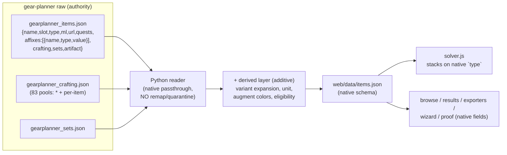
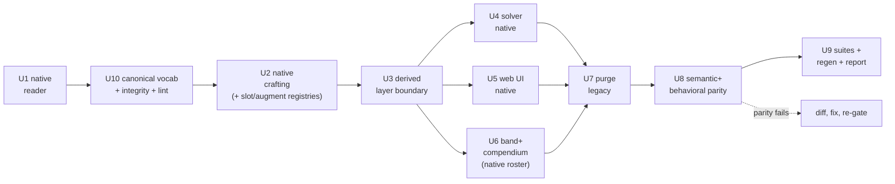

# refactor: Complete data overhaul — gear-planner native schema as the single source of truth

## Summary

This is a **complete data overhaul**, not an incremental migration. From this point forward the
[illusionistpm/ddo-gear-planner](https://github.com/illusionistpm/ddo-gear-planner) catalog is
**the authority**. Its native data schema becomes **the** schema, end-to-end — raw file → Python
pipeline → JS solver → web UI. Everything else is **legacy and is replaced**: the hand-curated base
seed (`ddo_items.json`), the wiki free-text-parsed `enriched_*.json` shards, the separate crafting
seeds, the remapped internal schema (`{stat, bonus_type, value, unit}`, `minimum_level`, normalized
slots, `["X (set)"]` markers), the `vocab` type-remap + quarantine layer, the precedence-flip /
union-merge machinery, and the `wiki_confirmed` override channel.

The gear-planner source was already refreshed to U81/Demogorgon-current (commit `ec3e595d`,
2026-08-01, level cap 36, `data/seed/compendium/raw/SOURCE.json`). This plan makes the *pipeline and
app* consume it natively and exclusively.

**Schema fidelity is the organizing principle.** The canonical item record is gear-planner's own
shape verbatim: `{name, slot, type, ml, url, quests, affixes:[{name, type, value}], crafting, sets,
artifact}`. gear-planner's affix `type` (Enhancement / Insight / Quality / Profane / Bool / Untyped /
…) is **the stacking bucket** — used directly, with no remap and no quarantine. The one deliberate
line: the solver's **variant expansion** (one item + its augment/crafting *options* → multiple solver
candidates) and its derived fields (percent-vs-flat unit, baked augment-slot colors,
character-eligibility) are an **additive layer built on top of** native records — clearly namespaced,
never a renaming of a native field. gear-planner stores an item and its options; the optimizer needs
the item × chosen options, so that expansion is necessary derived structure, not schema divergence.

Because the schema *intentionally changes*, byte-equivalence with the old output is no longer the
safety net. The net is **semantic + behavioral parity**: the same item roster (minus the 80
gear-planner-absent orphans, all manifested), the same effective affixes re-expressed natively, and a
battery of golden solver tests proving the optimizer still selects equivalent-value loadouts for a set
of character fixtures.

**The overhaul extends into a controlled-vocabulary layer.** Affixes are not free text: the affix
**names** (~1,441), the **bonus types** (43, the stacking buckets), the **crafting slots** (83), and
the **augments** are each a **fixed registry generated from gear-planner as the authority**. The many
affix occurrences noted on items are a **many-to-one** mapping into that registry — every item/pool/set
reference must resolve to **exactly one** registry entry, and an unknown fails the build. Because a scan of gear-planner's own data proved that similar names are frequently *distinct*
affixes (`Armor Class` vs `Armor Class (%)`, `Insight` vs `Insight Natural`, `Acid` vs `Acidic`) while
others are genuine redundancy (`Bloodrage`/`Blood Rage`, three casings of `Damage vs the Helpless`), an
ambiguity **lint** only *surfaces* near-duplicates and a **curated, human-adjudicated alias/distinct
table** resolves them — automatic fuzzy-merge is prohibited. (Note: the notorious "Insight vs
Insightful" hazard is a *legacy wiki-parser artifact* — "Insightful" is not a native gear-planner type —
so native sourcing + the fixed 43-type registry eliminates it outright.)

**Product Contract preservation:** N/A — greenfield `ce-plan-bootstrap`. Scope confirmed across this
session: single-source (user: "purge all other data with no exception"), then complete native-schema
overhaul (user: "perfect alignment with the gear planner … everything else is legacy and will be
replaced"), and the orphan disposition (user: "Purge all 80, log a manifest").

---

## Problem Frame

**Today.** The pipeline merges the base seed (wins all collisions), the wiki shards, and gear-planner,
then **remaps** gear-planner's native structure into a divergent internal schema and **remaps its
`type` tokens** through `vocab` into a curated bonus-type vocabulary with a quarantine gate. The JS
solver + web UI consume that remapped schema (`.stat`, `bonus_type`, `minimum_level` — 200+ references
across ~10 files). Crafting systems are fed by their own seed files. Markers are partly grafted from
the wiki shards.

**Why overhaul now.**
1. **One authority.** gear-planner is a near-daily wiki mirror and is already the de-facto source for
   ~all items. Making it *the* authority removes multi-source reconciliation entirely.
2. **The remap layer is the bug surface.** The document review found the internal remap is exactly
   where affixes get mistyped (Insight→Insightful), where a `wiki_url`/type quarantine silently drops
   real data, and where a vestigial "override" channel gives false confidence. Native schema deletes
   this whole class of defect.
3. **Re-import fidelity.** When gear-planner refreshes, a native schema means "drop in the new raw
   files" instead of "re-run a lossy remap and hope the vocab still maps."
4. **Simplicity.** One schema from raw file to rendered UI is less code, fewer concepts, easier to
   reason about.

**Goal state.** gear-planner's three raw files (`gearplanner_items.json`, `gearplanner_crafting.json`,
`gearplanner_sets.json`) + `SOURCE.json` provenance are the only seed inputs. The canonical dataset,
the solver, and the UI all speak gear-planner's native schema. All legacy sources, the remap/vocab
layer, and the reconciliation machinery are deleted. The 80 gear-planner-absent items are dropped and
manifested. Semantic + behavioral parity is proven.

**What this is NOT.** No wiki re-harvest. No change to the *optimization algorithm* (HiGHS MILP stays;
only the fields it reads change). No new items beyond gear-planner. No override channel — gear-planner
data is accepted as authoritative.

---

## Requirements

- **R1 — Native data schema, at rest.** The canonical item record mirrors gear-planner verbatim:
  `{name, slot, type, ml, url, quests, affixes:[{name, type, value}], crafting, sets, artifact}`. No
  `stat`/`bonus_type`/`minimum_level`/`structured_affixes`/`["X (set)"]` renamings in stored data.
- **R2 — Native schema, full-stack.** The JS solver and web UI (browse, results, exporters, wizard,
  proof panel, persistence) read gear-planner's native field names. One schema from raw file to UI.
- **R3 — `type` is the stacking bucket, verbatim.** gear-planner's affix `type` is used directly as
  the solver's stacking key. The `vocab` type-remap, `NON_RANKABLE_TYPES`, `NULL_TYPE_ALLOWLIST`, and
  the quarantine gate are removed.
- **R4 — Derived layer is additive and namespaced.** Variant expansion (`variant_id`, `source_item`),
  percent/flat `unit`, baked augment-slot colors, and character-eligibility are computed *on top of*
  native records under distinct names; they never overwrite or rename a native field.
- **R5 — gear-planner is authoritative; no override channel.** `wiki_confirmed` corrections and any
  other hand-override path are removed. gear-planner data is accepted as-is.
- **R6 — All crafting native.** Every crafting system (seal, Lamordia/Viktranium, Nearly-Complete,
  Dino, Lost Purpose, augment stones) is sourced from `gearplanner_crafting.json` (both the `"*"`
  menu-pool and per-item pool shapes) + each item's `crafting[]` markers. No separate crafting seeds.
- **R7 — Band coverage + compendium re-homed to the native roster.** No dependence on
  `enriched_*.json` shards or `roster_*.json` for band coverage or the browse index.
- **R8 — Purge all legacy.** All non-gear-planner seeds, all shards, all harvest intermediates, the
  remap/vocab layer, flip/union machinery, and dead internal-schema code are deleted.
- **R9 — 80 orphans dropped + manifested.** The base-seed items gear-planner lacks are removed and
  enumerated (name + class + reason) in a migration report.
- **R10 — Semantic + behavioral parity.** Same item roster (minus the 80), same effective affixes
  re-expressed natively, and golden solver tests proving equivalent loadout selection on character
  fixtures. Full Python + JS suites green; app smoke passes; regeneration deterministic.
- **R11 — Canonical vocabularies generated from the authority.** Build-time-generated fixed registries,
  sourced from gear-planner: the **affix-name** registry (~1,441 names), the **bonus-type** registry
  (43 types, verbatim), the **crafting-slot** registry (83 keys), and the **augment** registry. These
  are the authoritative controlled vocabularies; nothing outside them is valid.
- **R12 — Strict referential integrity (build-failing).** Every affix `name` and `type` on every item,
  crafting pool, and set — and every crafting-slot marker and augment — must resolve (directly or via
  the curated alias table, R13) to exactly one registry entry. An unresolved reference **fails the
  build**; there is no silent pass or free-text fallthrough.
- **R13 — Ambiguity defense via a curated alias/distinct table, never auto-merge.** An ambiguity lint
  flags redundant/near-duplicate registry entries (case/whitespace/punctuation collisions, tight
  prefix pairs like Insight/Insightful, high edit-similarity). Each flagged pair is **human-
  adjudicated** into a versioned decision table as either *alias* (variant → one canonical entry) or
  *distinct* (whitelisted pair). Automatic fuzzy-merge is prohibited — similar names are frequently
  distinct affixes (`Armor Class` vs `Armor Class (%)`, `Insight` vs `Insight Natural`).
- **R14 — Crafting slots + augments get the registry + integrity gate (not the full alias/lint).**
  The crafting-slot and augment vocabularies are generated and referential-integrity-checked like
  affixes, but as closed structural sets they carry no ongoing alias/lint machinery (inspected once at
  generation). Bonus types additionally carry the curated stacking-equivalence map (R3/KTD2). The
  human-adjudicated ambiguity table (R13) is affix-names-only.
- **R15 — Freshness assertion.** The build asserts the vendored raw mirror matches the intended
  upstream commit recorded in `SOURCE.json` (currently `ec3e595d` == upstream HEAD, verified this
  session); a mismatch is surfaced, not silently built.

---

## Key Technical Decisions

### KTD1 — gear-planner's native schema is canonical, full-stack
The item/affix/crafting/set schema is gear-planner's own, unchanged, from raw file through Python,
JS solver, and UI. Rationale: a single end-to-end schema is the whole point of "perfect alignment" —
it removes the remap layer (the review's bug surface), makes re-imports trivial, and collapses two
mental models into one. This is the overhaul's thesis; every unit serves it.

### KTD2 — gear-planner `type` is the stacking bucket, used verbatim (no remap, no quarantine)
The solver sums distinct `type` buckets to decide stacking. gear-planner already types every affix
(Enhancement/Insight/Quality/Profane/Bool/Untyped/None/Armor/Natural/Deflection/Luck/Vitality/…). We
use those tokens directly as stacking keys. The `vocab` type-**renaming** + **quarantine**
(`NON_RANKABLE_TYPES`, `NULL_TYPE_ALLOWLIST`, and the name-rewriting entries of `GEARPLANNER_TYPE_MAP`)
is deleted. This *fixes* the review's mistyping and silent-quarantine findings by removing the
translation that caused them. Non-numeric/`Bool` affixes (on/off effects, `value: 1`) and
`Untyped`/`None`/`-` are handled by the solver as native categories, not remapped away.

**Exception — stacking-equivalence is preserved (P1, do not blanket-delete).** Some
`GEARPLANNER_TYPE_MAP` entries collapse distinct native tokens into one bucket **because they do not
stack in-game** (`Insight Natural`→`Insight`, `Primal Natural`→`Primal`). Deleting those would let the
solver split the bucket and **double-count**. They survive as an explicit, reviewed
**stacking-equivalence map** on the type registry (U10) — real in-game rules, kept as curated data, not
as a rename. Only the renaming/quarantine half of `vocab` goes; the stacking-equivalence half stays.

### KTD3 — The derived solver layer is additive, never a renaming (the "as native as possible" line)
gear-planner describes an item **and its options** (augment slots, crafting choices). The optimizer
needs concrete candidates = item × chosen options, so **variant expansion is necessary derived
structure**, not schema divergence. Rule: native fields keep their native names everywhere; derived
structures get **new** names under a reserved prefix (e.g. `_derived`/`variant_*`). `variant_id`,
`source_item`, `unit`, baked augment colors, and eligibility live in that additive layer. A native
record round-trips to gear-planner's shape by dropping the derived layer.

### KTD4 — gear-planner is authoritative; the override channel is removed
*(resolves the review's KTD7-vestigial + no-fallback findings.)* `stamp_wiki_confirmed` only ever
wrote a date; its `corrections` array was never read — a false backstop. Per the user's directive
(gear-planner is the authority, everything else legacy), there is **no** hand-override: `wiki_confirmed`
and its stamping are deleted. If gear-planner has a data gap, the fix is upstream / a re-import, not a
local override. The risk is accepted explicitly rather than "mitigated" by a no-op.

### KTD5 — Safety net = semantic + behavioral parity (not byte-parity)
Because the schema changes on purpose, byte-equivalence is meaningless. The gate is: (a) **roster
parity** — same gear-planner item set present; (b) **semantic affix parity** — each item's effective
`{name, type, value}` set matches what the old pipeline produced for that item (modulo the remap's own
mistyping, which we *want* to drop — logged); (c) **behavioral parity** — a battery of **golden solver
tests** runs the optimizer on fixed character fixtures and asserts the selected loadout's total value
is equal (or explicitly-diffed-and-accepted) before vs after. Behavioral parity is the real proof the
schema swap didn't change outcomes.

### KTD6 — Native crafting handles both pool shapes
`gearplanner_crafting.json` has two option shapes (review-confirmed): **menu pools** keyed by `"*"`
(`Sealed in Undeath`) and **per-item pools** keyed by host name (`Nearly Finished`, `Almost There`,
`One of the following…`). The native crafting reader dispatches on shape per key. Family counts are
sourced from the file at build time, not hardcoded.

### KTD7 — Purge all legacy; 80 orphans manifested (user-directed)
*(session-settled: user-directed — chosen over "keep 13 named in a manual_additions.json" and
"wiki-verify the 13 first": user selected "Purge all 80, log a manifest", and subsequently "everything
else is legacy and will be replaced".)* Every non-gear-planner input and every dead internal-schema
code path is deleted. The 80 gear-planner-absent base-seed items are dropped; the migration report
enumerates each with class + reason (39 augment stones, 15 Cannith Crafted, 13 annotation/guide rows,
13 named items).

### KTD8 — Dino synthetic-body host pattern retained
The 8 Dinosaur Bone weapon hosts are synthetic bodies generated post-expansion (`dino_blanks`) and
excluded from the reader via `exclude_names` to avoid double-listing (the double-listing trap). The
pattern is preserved; only the *pool* it reads moves to `gearplanner_crafting.json` (`Claw/Fang/Horn/
Scale`). This is a solver-layer craftable-base concept, not a schema remap.

---

### KTD9 — Controlled vocabularies are generated from the authority, then frozen per build
The affix-name, bonus-type, crafting-slot, and augment registries are **generated** from the
gear-planner raw files and **checked in** so each build has a reviewed baseline. Scan output this
session: 1,441 affix names, 43 bonus types, 83 crafting-slot keys.

**The integrity gate checks against the FROZEN checked-in registry, not a freshly-regenerated one
(P1 — otherwise the gate is inert).** A registry regenerated from the same raw each build contains
every current name by construction, so validating that raw against it can never fail. To make "fails
on unknown" real (R12), the build validates the raw's affix/type/slot/augment references against the
**committed prior registry**; a name absent from it is a **build-blocking new-name event** that forces
regeneration + review (and, for affix names, adjudication). Regenerating the registry is thus a
deliberate, diff-reviewed step on re-import — not an automatic same-build passthrough. This is the only
configuration in which the strict gate has teeth.

### KTD10 — Ambiguity is resolved by a curated alias/distinct table, never by auto-normalization
The ambiguity lint (case/whitespace/punctuation collision, tight prefix pairs, edit-similarity ≥ 0.90)
only **surfaces** candidates. Resolution is a human-adjudicated, versioned decision table
(`data/seed/compendium/affix_aliases.json`) mapping each true redundancy to one canonical entry and
whitelisting each confirmed-distinct pair. **Auto-merge is prohibited** — this session's scan proved
similar names are routinely distinct affixes: `Armor Class` vs `Armor Class (%)` (flat vs percent),
`False Life` vs `False Life (%)`, `Insight` vs `Insight Natural`, `Acid` vs `Acidic`, `Summon Monster
II` vs `III`. A naive normalizer would corrupt data by collapsing these. The lint is the safety net;
the curated table is the authority on same-vs-distinct.

**Scope: the lint + curated alias table apply to affix NAMES only.** The ~1,441 free-text affix names
are where organic redundancy lives (`Bloodrage`/`Blood Rage`; three casings of `Damage vs the
Helpless`). The other three vocabularies are closed structural sets lifted verbatim from gear-planner
and get the generated registry + integrity gate but **no** ongoing alias/lint machinery: bonus types
carry only the small curated **stacking-equivalence map** (KTD2, the formerly-collapsed pairs); crafting
slots and augments are inspected once at generation. This trims the permanent hand-maintained surface.

**The lint is non-blocking by default (P2 — avoid a refresh toll).** Only exact normalized-form
collisions (case/whitespace/punctuation — unambiguous redundancy, e.g. `Greater Dragonmark
Charges`/`charges`) block the build. High-similarity-but-distinct candidates (`Alchemical Air` vs
`Alchemical Fire`, `1d4` vs `1d6`, `+66` vs `+108`) are **auto-seeded into the `distinct` whitelist**
and surfaced as a report, not a gate — so a routine upstream refresh does not hard-block on adjudicating
dozens of obviously-distinct pairs. Human adjudication is reserved for the handful of genuine
collisions.

### KTD11 — Freshness is asserted at build, not assumed
`build_dataset` verifies the vendored raw mirror's identity against `SOURCE.json`'s `upstream_commit`
and surfaces any drift. "Most updated available" is a checked property, not a hope. (Verified this
session: `ec3e595d` == upstream HEAD.)

## High-Level Technical Design

### One schema, end-to-end

### Native field mapping (legacy → native)

| Legacy internal field | Native gear-planner field | Where it lives now |
|---|---|---|
| `stat` | `name` (affix) | native |
| `bonus_type` | `type` (affix) | native, = stacking bucket |
| `minimum_level` | `ml` | native |
| `structured_affixes` / `enhancements` | `affixes` / `sets` | native |
| `["X (set)"]` markers | `sets: ["X", …]` | native |
| `unit` (pct/flat) | — | derived (additive) |
| `variant_id`, `source_item` | — | derived (variant expansion) |
| baked augment colors, eligibility | — | derived (additive) |

### Overhaul sequence (Python data → JS/web → replace + prove)

Phases: **A (U1-U3)** builds the native data + derived layer additively (legacy still present). **B
(U4-U6)** moves the app to the native schema. **C (U7-U9)** deletes legacy and proves parity. The
golden solver fixtures (U8) are captured from the *current* build in U1 so there is a before-baseline.

---

## Implementation Units

### U1. Native reader — emit gear-planner records verbatim; capture the parity baseline

**Goal:** Rewrite `src/planner_items.py` to emit records in gear-planner's native shape (`{name, slot,
type, ml, url, quests, affixes:[{name,type,value}], crafting, sets, artifact}`) with **no** remap to
`stat`/`bonus_type`/`minimum_level`/`structured_affixes` and **no** vocab quarantine. Capture a
pre-overhaul baseline (roster + per-item effective affixes + a solver-fixture snapshot) for U8.

**Requirements:** R1, R3, R5, R10.

**Dependencies:** none (additive; legacy still present).

**Files:** `src/planner_items.py`, `src/vocab.py` (mark remap/quarantine for removal in U7),
`tests/test_planner_items.py`, plus a baseline snapshot written to `docs/reports/` or a test fixture.

**Approach:**
- Reader becomes a near-passthrough: copy native fields; keep `slot`/`type`/`ml`/`url`/`quests`/
  `affixes`/`crafting`/`sets`/`artifact` as-is. Drop `_slot` normalization (Helm/Offhand) from the
  data layer — if the UI wants display normalization, that is a UI-layer concern (U5), not a data
  rename (KTD3).
- Affixes pass through as `{name, type, value}`. No `map_gearplanner_type`, no quarantine, no
  `structured_flagged`. `Bool` affixes (`value: 1`) stay native; the solver decides how to treat each
  `type`.
- Keep the reader's legitimate jobs: intra-dump name-collision collapse (disclosed), `exclude_names`
  for the dino host trap (KTD8).
- **Baseline capture:** snapshot the *current* built dataset's `{name → effective affix set}` and run
  the current solver on the U8 character fixtures, recording each fixture's selected loadout + total
  value. This is the before-image semantic + behavioral parity checks against.

**Patterns to follow:** current `planner_items.py` structure (keep the loop, drop the remap);
`SOURCE.json` provenance.

**Execution note:** Characterize first — capture the baseline snapshot *before* changing the reader,
so U8 has a real before-image.

**Test scenarios:**
- A known item emits native `{name, slot, type, ml, url, quests, affixes, crafting, sets}` with affix
  entries shaped `{name, type, value}` (not `{stat, bonus_type, value, unit}`).
- An affix gear-planner types `Insight` stays `Insight` (no Insight→Insightful drift; the mistyping
  class is gone).
- A `Bool` affix passes through natively; a previously-quarantined proc (e.g. `Holy`) is now present
  in native `affixes`, not dropped.
- Intra-dump name collisions still collapse to one, disclosed via stats.
- Dino host names still excludable via `exclude_names`.
- Baseline snapshot file is produced and non-empty.

**Verification:** Reader emits native records; baseline snapshot captured; no remap/quarantine remains
in the reader.

---

### U10. Canonical vocabulary foundation — registries, referential integrity, ambiguity lint, alias table

*(Phase A; runs after U1 and is a dependency of U2, U3, U4, U5. Placed here logically despite the
higher U-ID.)*

**Goal:** Generate the fixed controlled vocabularies from gear-planner (affix names, bonus types, and
— extended in U2 — crafting slots + augments), enforce strict referential integrity (unknown ⇒ build
fails), and add the ambiguity lint + curated alias/distinct decision table that defends against
redundant/ambiguous names without ever auto-merging.

**Requirements:** R11, R12, R13, R15.

**Dependencies:** U1 (native records to validate against).

**Files:**
- `src/vocabulary.py` (new — generate registries from the raw files; the referential-integrity
  validator; the ambiguity lint) — replaces the deleted `vocab` remap layer
- `data/seed/compendium/affix_registry.json`, `bonus_type_registry.json` (generated, checked-in as the
  **frozen baseline** the integrity gate validates against)
- `data/seed/compendium/affix_aliases.json` (the **curated** alias/distinct table — affix names only,
  hand-adjudicated, versioned; the one sanctioned curated survivor of the purge, U7)
- `data/seed/compendium/type_stacking_equivalence.json` (curated — the formerly-collapsed type pairs
  that must share a stacking bucket, KTD2)
- `build_dataset.py` (freshness assertion vs `SOURCE.json`; wire the integrity gate into the build)
- `tests/test_vocabulary.py` (new)

**Approach:**
- **Generate** the affix-name registry (all distinct `name` across items + crafting pools + sets;
  ~1,441) and the bonus-type registry (43 types, verbatim — incl. compounds like `Insight Natural`,
  `Artifact Shield` that are distinct buckets). Check them in as the **frozen baseline** (KTD9).
- **Integrity gate against the frozen baseline (R12/KTD9):** every item/pool/set affix `name` must
  resolve to a baseline registry entry or an `affix_aliases` key; every `type` to the type registry.
  A reference absent from the **checked-in** registry is a build-blocking new-name event (forces a
  reviewed regenerate + adjudication) — this is what makes "fails on unknown" real. No free-text
  fallthrough.
- **Ambiguity lint (affix names only):** three detectors — (a) normalized-form collisions
  (case/whitespace/punctuation), (b) tight prefix pairs (Insight/Insightful shape), (c) edit-similarity
  ≥ 0.90. The lint **never mutates data**. It is **non-blocking except for exact normalized-form
  collisions**; high-similarity-but-distinct candidates are auto-seeded into the `distinct` whitelist
  and reported (KTD10) so a refresh does not stall on dozens of obvious-distinct rulings.
- **Curated alias/distinct table** (`affix_aliases.json`): each *collision* candidate is adjudicated
  `alias` (`{"variant","canonical"}`) or `distinct`. Seed from this session's scan (collapse
  `Bloodrage`→`Blood Rage`, the three `Damage vs the Helpless` casings→one; keep `Armor Class` vs
  `Armor Class (%)`, `Insight` vs `Insight Natural` distinct). This is the ONLY sanctioned name rewrite.
- **Type stacking-equivalence map** (`type_stacking_equivalence.json`, KTD2): carry forward the
  `GEARPLANNER_TYPE_MAP` collapses (`Insight Natural`→`Insight`, `Primal Natural`→`Primal`) so the
  solver groups them into one bucket despite distinct native `type` tokens. Curated, small, reviewed.
- **Crafting slots + augments:** generated registry + integrity gate only; inspected once, no ongoing
  alias/lint (R14).
- **Freshness assertion** (R15/KTD11): compare the raw mirror's identity to `SOURCE.json.upstream_commit`;
  surface drift.

**Patterns to follow:** this session's scan script (the three detectors are already prototyped); the
deleted `vocab` module's call sites (the new validator replaces them).

**Execution note:** Build the lint + registry first and run it against the current raw to produce the
initial candidate list; adjudicate that list into `affix_aliases.json` before turning the integrity
gate to build-failing, so the first strict build starts from a clean, decided vocabulary.

**Test scenarios:**
- Registry generation: affix-name + bonus-type registries produced from the raw, non-empty, and
  deterministic across two runs.
- Integrity gate: an item affix whose name is not a registry entry or alias key → build raises a clear
  error naming the affix + item.
- Alias resolution: a `variant` name resolves to its `canonical` entry; a `distinct` whitelisted pair
  does NOT resolve to each other and does NOT re-trigger the lint.
- Ambiguity lint: detects the case/whitespace collisions, the tight prefix pairs, and the ≥0.90
  edit-similarity pairs; emits candidates without mutating data.
- Anti-false-merge: `Armor Class` and `Armor Class (%)` remain two distinct registry entries (never
  collapsed); `Insight` and `Insight Natural` remain distinct types.
- Freshness: a `SOURCE.json` commit mismatch is surfaced.
- New-name-on-refresh: an injected unknown affix name surfaces for adjudication (fails the build),
  not a silent pass.

**Verification:** Registries generated + checked in; integrity gate build-failing on unknowns; alias
table adjudicated; lint surfaces candidates without auto-merging; anti-false-merge cases hold;
freshness asserted.

---

### U2. Native crafting — consume `gearplanner_crafting.json` (both pool shapes) + item `crafting[]`

**Goal:** Source every crafting system from `gearplanner_crafting.json` natively, dispatching on the
two pool shapes (`"*"` menu vs per-item), and recover host markers from each item's `crafting[]`.
Retire the separate crafting seeds.

**Requirements:** R6, R14.

**Dependencies:** U1, U10 (vocabulary foundation — crafting pools' affixes are integrity-checked too).

**Files:** `src/crafting_catalog.py` (new — native pool reader), `src/seal.py`, `src/dino.py`,
`src/viktranium.py`, `src/nearly_complete.py`, `src/membership.py`, `src/vocabulary.py` (extend with
crafting-slot + augment registries), `data/seed/compendium/{crafting_slot_registry,augment_registry}.json`
(generated; integrity-gated, no alias/lint per R14), and their tests.

**Approach:**
- `crafting_catalog` loads the 83-key dict and exposes per-family pools, dispatching on shape:
  menu pools keyed `"*"` vs per-item pools keyed by host name (KTD6). It reads native affix payloads
  (`{name, type, value}`) directly — **no** `wiki_url` gate, **no** type remap (the review's F1
  finding is resolved by not reintroducing the gate).
- Each crafting module consumes the catalog. Where a module previously parsed a bespoke seed shape,
  it now reads the native pool; keep public entry signatures where cheap, but the parser gate is
  *removed*, not swapped (per review F1 this is a rewrite, not a loader swap).
- Host markers (which items host which slot) come from each item's `crafting[]` (`"Sealed in X"`,
  `"Melancholic (…)"`, `"Almost There"`/`"Nearly …"`, `"Lost Purpose"`, `"Claw (…)"`). Extend the
  native reader (U1) to surface all families, not just augment+seal.
- Family split (review F5): model `Nearly Complete: <category>` (6 category pools) via the category
  path; handle per-item `Nearly Finished`/`Almost There` pools separately by host name. Do not
  conflate them.
- Green Steel / Thunder-Forged (review A2): the `T1/T2/T3 (Weapon)/(Equipment)` pools **do** exist and
  49 Legendary Green Steel items reference them — wire them through the catalog like the other
  families (do **not** delete on a false "no pool" claim). Correct the earlier assumption.
- **Crafting-slot + augment registries (R14):** extend `src/vocabulary.py` (U10) to generate the
  crafting-slot registry (the 83 `crafting.json` keys) and the augment registry (the augment stones
  from `<Color> Augment Slot` pools), each with the same referential-integrity gate (an item's
  `crafting[]` marker or augment reference must resolve to a registry entry) and the same ambiguity
  lint + curated alias/distinct table.

**Patterns to follow:** existing `parse_seal`/`build_dino`/`build_nc`/`build_viktranium` call sites;
the native pool shapes verified this session.

**Execution note:** Rewire one family at a time, running that family's test after each, so a pool-shape
mismatch isolates to the family that introduced it.

**Test scenarios:**
- Seal `Undeath` pool resolves natively (typed affix choices); unverified type → no host.
- Dino Claw/Fang/Horn/Scale pools resolve; the 8 synthetic bodies still generate + exclude (KTD8).
- NC: 6 category pools resolve via category path; a `Nearly Finished` host resolves via its per-item
  pool; the two mechanics are not conflated.
- Lamordia/Viktranium Melancholic/Dolorous pools resolve.
- Lost Purpose set-membership resolves.
- Green Steel `T1/T2/T3` pools resolve for a Legendary Green Steel host (not deleted).
- Adapter: a per-item-shaped pool and a `"*"`-shaped pool both parse correctly; a malformed key errors
  loudly (no silent empty pool).

**Verification:** All crafting-module tests green against the native catalog; both pool shapes handled;
Green Steel wired; no `wiki_url`/type gate reintroduced.

---

### U3. Derived-layer boundary — variant expansion + solver fields as additive, native-preserving

**Goal:** Establish the additive derived layer (KTD3): variant expansion (`variant_id`, `source_item`),
`unit` (pct/flat), baked augment-slot colors, and eligibility are computed on top of native records
under reserved names, never renaming a native field. Make the built `web/data/items.json` carry native
fields + a clearly-namespaced derived section.

**Requirements:** R1, R4.

**Dependencies:** U1, U2.

**Files:** `build_dataset.py` (assemble native record + derived layer), `src/variants.py` (expansion
reads native `affixes`/`crafting`), tests.

**Approach:**
- `variants.py` expands each native item into solver candidates (augment fills, crafting choices) —
  each variant carries the native item fields plus a derived block (`variant_id`, `source_item`, chosen
  options). The native `affixes` array remains `{name, type, value}`; derived-only info (numeric value,
  unit, baked colors) sits beside it, not inside it.
- **Numeric value + unit are BOTH derived (P1 — a field rename alone breaks solver math).** Native
  `value` is a **string** (`"9%"`, `"3"`, `"-10"`); JS comparisons (`value > 0`, bucket-max `<`) and
  sums silently misbehave on strings (`"9%" > 0` is `false` → percent affixes vanish; `"3" < "10"` is
  lexically false → wrong max). So the build derives, per affix, a numeric `value` (strip `%`, signed
  int) **and** `unit` (pct/flat) into the derived block, mirroring today's `variants.py:_coerce_value`
  / `planner_items.py:_value_unit`. The solver and model read the **derived numeric**, never the native
  string. This applies equally to crafting-pool option affixes (solver reads `opt` numeric/unit).
- Augment-color baking + eligibility stamping stay, writing to the derived block.
- Document the boundary in a short schema note (what is native vs derived) so future readers know the
  round-trip rule.

**Patterns to follow:** current `variants.py` expansion; current augment-color bake + `stamp_*` steps
(rehomed to the derived block).

**Test scenarios:**
- A native item expands to the same set of variants as before (count + option identity), now carrying
  native affix fields.
- `unit` is derived correctly (`"5%"`→pct, `"3"`→flat) and lives in the derived block, not on the
  native affix.
- Dropping the derived block from a record yields a gear-planner-**shaped** structure (schema-shape
  check, enforces KTD3). Scope the check to shape, not record-identity: the ~2 source items that expand
  into multiple ML tiers (e.g. Ring of the Stalker → 4 records) don't round-trip 1:1 to one native item,
  so aggregate/exclude those rather than asserting record == native item.
- Augment colors + eligibility land in the derived block; native fields untouched.

**Verification:** Built records are native + additive-derived; the round-trip check passes; variant
expansion unchanged in count/identity.

---

### U4. Solver reads the native schema

**Goal:** Rewrite `web/solver.js` (and any solver-adjacent model code) to read native fields — stack on
affix `type`, read `ml`, iterate `affixes:[{name,type,value}]` — removing `bonus_type`/`.stat`/
`minimum_level` assumptions.

**Requirements:** R2, R3.

**Dependencies:** U3.

**Files:** `web/solver.js`, `web/model.js`, `web/query.js` (native field reads), plus JS tests.

**Approach:**
- Replace `affix.bonus_type` → `affix.type` and `affix.stat` → `affix.name` as the stacking key +
  label. Replace `item.minimum_level` → `item.ml`. Read the derived block for the **numeric value**,
  `unit`, augment colors, and eligibility (U3) — **not** the native string `value`.
- The MILP formulation is unchanged — only the field accessors change. `variant_id`/`source_item`
  (derived, KTD3) stay as-is (they were never legacy).
- **Type stacking-equivalence (P1 — verbatim-native can over-stack).** The deleted `vocab`'s
  `GEARPLANNER_TYPE_MAP` collapsed some native tokens into one bucket **on purpose** because they do not
  stack in-game (e.g. `Insight Natural`→`Insight`, `Primal Natural`→`Primal`). Using `type` verbatim
  (KTD2) would split them into separate buckets and **double-count**. Preserve those collapses as an
  explicit, reviewed **stacking-equivalence map** (a small curated table on the type registry, U10) —
  do not blanket-accept the split as a "mistyping correction." `Bool`/`Untyped`/`None`/`-` types are
  handled as native stacking categories; U8 asserts each formerly-collapsed pair behaves correctly.

**Patterns to follow:** current `solver.js` stacking logic (same algorithm, native accessors).

**Execution note:** This is the behavioral-risk unit — pair it tightly with U8's golden solver tests;
run them after each accessor swap.

**Test scenarios:**
- Solver stacks two `Enhancement` affixes as non-stacking and an `Enhancement`+`Insight` pair as
  stacking, reading native `type`.
- ML filtering reads `item.ml`.
- A `Bool` affix contributes as a presence, not a summed value.
- Golden fixture: a fixed character yields the same selected loadout + total value as the pre-overhaul
  baseline (U8 owns the battery; this unit must pass it).

**Verification:** Solver reads native fields; golden solver tests green (behavioral parity).

---

### U5. Web UI reads native fields (browse, results, exporters, wizard, proof, persistence)

**Goal:** Move the remaining `web/*.js` consumers to native field names so there is one schema through
the UI. Any display normalization (e.g. slot label grouping) lives here as a presentation concern, not
a data rename.

**Requirements:** R2.

**Dependencies:** U3 (native dataset shape available).

**Files:** `web/browse.js`, `web/results.js`, `web/exporters.js`, `web/wizard.js`,
`web/crafting-systems.js`, `web/alternatives.js`, `web/persist.js`, `web/import.js`, `web/app.js`, plus
their tests and any persisted-shape migration.

**Approach:**
- Swap `.stat`→`.name`, `bonus_type`→`type`, `minimum_level`→`ml` across the UI (measured: `.stat`
  111 hits/10 files, `bonus_type` 73, `minimum_level` 16). Proof/`whyThis` panel labels read native
  `name`/`type`.
- Slot display normalization (if desired for grouping) is applied at render time from the native
  `slot`, not stored.
- **Persistence migration (shadow path):** saved loadouts / backups reference `variant_id` (85 hits,
  9 files) — those are derived-layer IDs (KTD3) and stable, so persisted data should still resolve. If
  any persisted payload embedded a legacy field name, add a one-time load-time migration. Trace the
  nil/empty/error paths for load of a pre-overhaul saved loadout.

**Patterns to follow:** existing per-file field access; the `persist.js`/`backup.js` load paths.

**Test scenarios:**
- Browse renders items using native `name`/`type`/`ml`.
- Results + proof panel label affixes with native `name`/`type`.
- Exporters (MD/CSV/print) emit native field values.
- A pre-overhaul saved loadout loads without error (migration or stable `variant_id`); empty/missing
  persisted state degrades gracefully.

**Verification:** UI reads only native fields; JS tests green; a saved loadout round-trips.

---

### U6. Re-home band coverage + compendium browse index to the native roster

**Goal:** Make band coverage and the compendium browse index derive from the built native roster, not
from `enriched_*.json` shards or `roster_*.json`.

**Requirements:** R7.

**Dependencies:** U3 (native roster available).

**Files:** `src/band_frontier.py`, `src/compendium.py`, `build_dataset.py`, `tests/test_band_frontier.py`,
`tests/test_r4_reconciliation.py`, `tests/test_compendium.py`.

**Approach (grounded in the review's F3/F4 findings):**
- `band_coverage()` currently calls `build_worklist()` → `enriched_names()` (reads
  `solver_active_baseline.json`) + `_roster_lookup()` (reads `roster_*.json`). Refactor
  `band_coverage` to inline the ML-band attribution lookup and derive each item's slot from the built
  native roster (items carry `slot`), dropping the `build_worklist`/`enriched_names` call. Retire
  `build_worklist`, `enriched_names`, `band_worklist.json`.
- `compendium.build_compendium` reads `roster_*.json` for the browse index (review F4 — the plan must
  not silently empty it). Re-home the browse/slot lookup onto the native roster (single source). The
  ML30-36 band enumeration (`ml30_36_attribution.json`) is **regenerated from the native roster**
  (items carry `ml` + `sets`/`quests`), not kept as a static legacy file — consistent with U7's
  single-source purge (no gear-planner-independent survivors).

**Patterns to follow:** `band_coverage`'s existing roster-classification half; `compendium.py`'s
category shape.

**Execution note:** Confirm every `band_categories/` and `roster_*.json` file's consumer before
deleting; re-home consumers first, then delete in U7.

**Test scenarios:**
- Band coverage computed from a native-roster fixture with no shard files present → correct
  per-(expansion, slot) counts; full band covered.
- Compendium browse index is non-empty sourced from the native roster (not emptied).
- `test_r4_reconciliation` compares native roster vs band attribution, not shard vs band.
- Removing `enriched_*.json` does not change band coverage.

**Verification:** Band coverage + compendium derive from the native roster; their tests green with no
shard read.

---

### U7. Purge all legacy — seeds, shards, remap/vocab, flip/union, override, dead code; write the manifest

**Goal:** Delete every non-gear-planner input and every dead legacy code path; generate the 80-item
purged manifest.

**Requirements:** R5, R8, R9.

**Dependencies:** U4, U5, U6 (nothing reads legacy anymore).

**Files (delete):**
- `data/seed/ddo_items.json`; `data/seed/{seal,dino_crafting,viktranium,nearly_complete,green_steel,thunder_forged}.json`;
  `data/seed/wiki_confirmed.json`
- `data/seed/compendium/enriched_*.json`, `band_worklist.json`, `quarantined_r4.json`,
  `roster_*.json` (re-homed in U6), `band_categories/solver_active_baseline.json`
- `data/seed/{alignment_restrictions,joker_sets,artifacts,boolean_features}.json` (accepted losses /
  natively-sourced — see disposition below)
- `data/seed/compendium/raw/{batch*,seal_mechanics,dino_crafting,viktranium}.json`
**Files (delete legacy code):**
- `build_dataset.py`: `load_seed`/base-seed merge, `load_enriched_items`, Pass-2 graft,
  `FLIP_COLLISION_PRECEDENCE`, `union_gearplanner_affix_losses`, `load_wiki_confirmed`/
  `stamp_wiki_confirmed`, the separate crafting-seed loaders
- `src/vocab.py`: the type-remap + quarantine (`GEARPLANNER_TYPE_MAP`, `NON_RANKABLE_TYPES`,
  `NULL_TYPE_ALLOWLIST`) if nothing native needs them
**Files (disposition — STRICT: regenerate from the authority, else purge; no curated survivors):**
Per the user's confirmed directive ("all other content and data structures are obsolete unless matching
the new data authority"), no hand-curated non-gear-planner file survives. Each is regenerated from the
raw mirror or dropped:
- `data/seed/augments.json` — **regenerate** from `gearplanner_crafting.json` `<Color> Augment Slot`
  pools at build time (the frozen seed is deleted; the built augment set is the generated one).
- `data/seed/artifacts.json` — **delete**; source `artifact` natively from `item['artifact']` (101
  items).
- `data/seed/boolean_features.json` — **delete**; accept all gear-planner `Bool`-typed affixes natively
  (the allowlist curation is obsolete — gear-planner's typing is authoritative). Verified: no data loss,
  strictly more faithful.
- `data/seed/alignment_restrictions.json` — **delete**; verified the seed holds only `_README`/
  `_example` (0 curated gates) and `model.js` `eligible()` is fail-open, so deleting it is **no
  gameplay loss** and causes **no unequippable-recommendation regression**. The alignment
  `eligible()` branch stays as live-but-inert code (gear-planner carries no restriction field:
  `[affixes, artifact, crafting, ml, name, quests, sets, slot, type, url]`).
- `data/seed/joker_sets.json` (1 item: Legendary Gem of Many Facets) — **delete**; the wildcard-set
  mechanic is not in gear-planner's set model. **Accepted loss:** 1 item, logged in the manifest.
- `data/seed/compendium/band_categories/ml30_36_attribution.json` — **regenerate** the ML30-36 band
  enumeration from the native roster (items carry `ml` + `sets`/`quests`), rather than keep a static
  legacy file.
**Files (new):** `docs/reports/2026-08-01-gear-planner-overhaul.md` (report + 80-item manifest).

**Approach:**
- Generate the manifest programmatically (recompute base-seed − gear-planner at purge time): 80 items,
  classes 39 augment / 15 Cannith / 13 annotation / 13 named, each with a reason. Additionally log the
  **accepted gameplay-gate loss** — the 1 joker/wildcard entry (`joker_sets.json`: Legendary Gem of
  Many Facets) — as a separate manifest section. (`alignment_restrictions.json` is an empty seed → 0
  losses; noted for completeness, not a real loss.)
- Remove flip/union + remap symbols entirely; grep-clean.
- `wiki_confirmed` + its stamp are deleted (KTD4) — no override channel remains.

**Execution note:** Destructive commit; run the full suite immediately. Prefer `git rm` so deletions
are reviewable. Do not hand-author the manifest — derive it.

**Test scenarios:**
- Build succeeds with all deleted files absent (no `FileNotFoundError`).
- Grep finds no reference to any deleted file, to `FLIP_COLLISION_PRECEDENCE`/
  `union_gearplanner_affix_losses`, to the vocab remap symbols, or to `wiki_confirmed`.
- Manifest lists exactly 80 items with class + reason (the 13 named enumerated) PLUS the 1 joker
  gameplay-gate loss in a separate section.
- `data/seed/` contains ONLY: the 3 gear-planner raw files + `SOURCE.json`; the build-generated
  registries; and the **two sanctioned curated survivors** — `affix_aliases.json` (name adjudications)
  and `type_stacking_equivalence.json` (in-game stacking rules). These two are curated *metadata about*
  the authority's data (adjudication decisions), not alternative content — they cannot be regenerated
  because they encode human/in-game knowledge, so they are the one documented exception to "purge all
  curated files."

**Verification:** One source; suite green; report + manifest written; grep-clean of legacy symbols.

---

### U8. Semantic + behavioral parity gate (the safety net)

**Goal:** Prove the overhaul preserved outcomes: same roster, same effective affixes (re-expressed
natively), and equivalent solver loadouts on a battery of character fixtures — against the U1 baseline.

**Requirements:** R10.

**Dependencies:** U7 (final built dataset) — but authored against the U1 baseline captured before any
change.

**Files:** `tests/test_overhaul_parity.py` (roster + semantic affix parity),
`tests/test_solver_golden.py` or a JS golden-test harness (behavioral parity), the U1 baseline fixture.

**Approach:**
- **Roster parity:** the set of gear-planner item names in the new build == the U1 baseline's
  gear-planner names (the 80 orphans are expected-absent; assert exactly those 80 dropped).
- **Semantic affix parity:** for each item, the new native `{name, type, value}` effective set matches
  the baseline's effective affixes — *except* where the old remap mistyped an affix (Insight→Insightful
  etc.); those diffs are expected improvements, enumerated and accepted in the report, not failures.
  **Do NOT blanket-accept stacking-bucket diffs (P2):** every type pair the old `GEARPLANNER_TYPE_MAP`
  collapsed (`Insight Natural`→`Insight`, etc.) must be covered by the stacking-equivalence map (U10)
  or explicitly verified to stack in-game — a newly-*split* bucket that double-counts is a regression to
  fail on, not a correction to accept.
- **Behavioral parity (the real proof):** run the solver on a fixed set of character fixtures (a
  handful spanning classes/slots/ML bands incl. ML30-36) before (U1 baseline) and after; assert each
  fixture's selected loadout total value is equal, or the diff is explicitly reviewed and traced to an
  accepted semantic change (e.g. a formerly-quarantined affix now contributing).

**Patterns to follow:** the prior build-both-ways invariant technique; project memory's localhost +
browser verification for the JS side.

**Execution note:** Go/no-go for declaring the overhaul complete. A structural diff (missing item,
dropped affix family) is a bug in U1-U6; an accepted semantic diff (mistyping fixed, proc un-
quarantined) is logged in the report.

**Test scenarios:**
- Roster parity: exactly the 80 orphans absent, nothing else.
- Semantic parity: sampled items' native affixes match baseline effective affixes (modulo logged
  mistyping corrections).
- Behavioral parity: each character fixture's optimal loadout value matches baseline (or logged-and-
  accepted).
- Determinism: two builds → identical `web/data/items.json`.

**Verification:** Parity harness green; report records roster/semantic/behavioral results + the
accepted-diff list.

---

### U9. Full-stack suite overhaul, regeneration, app smoke, report + provenance close-out

**Goal:** Update the Python + JS test suites to the native schema, regenerate the dataset, smoke the
running app, and finalize the report + provenance.

**Requirements:** R8, R10.

**Dependencies:** U7, U8.

**Files:** `tests/*.py` (repoint/retire legacy-schema + shard + flip/union tests; keep native
invariants), `web/` JS tests, `web/data/items.json` (regenerated, gitignored), `SOURCE.json`,
`docs/reports/2026-08-01-gear-planner-overhaul.md`, memory.

**Approach:**
- Classify each Python test: native invariant (keep, repoint to native fields), legacy-schema/shard/
  flip test (retire with a migration note matching the repo's retirement style), crafting test (native
  catalog).
- Update JS tests to native field names; add/keep the golden solver tests (U8).
- Regenerate `web/data/items.json`; confirm item count ≈ gear-planner roster − 80; determinism.
- App smoke: localhost http server + browser — app loads, wizard runs, solver produces a loadout,
  results + proof render with native fields, an export works.
- Finalize report (sources before/after, native schema description + the KTD3 boundary, 80-item
  manifest, semantic/behavioral parity results, accepted-diff list, per-surviving-file provenance).
  Stamp `SOURCE.json` with the overhaul close-out. Update project memory.

**Test scenarios:**
- `python tests/run_tests.py` green; no test references a deleted file or legacy field name.
- JS suite green (incl. golden solver tests).
- Regenerated dataset deterministic; native schema; roster − 80.
- App smoke passes end-to-end with native fields in the UI.

**Verification:** Both suites green; app smoke passes; dataset regenerated native + deterministic;
report + provenance finalized; memory updated.

---

## Scope Boundaries

**In scope:** native gear-planner schema at rest + full-stack (Python + JS + web UI); native crafting
from `gearplanner_crafting.json`; derived-layer boundary; band/compendium re-home; purge of all legacy
inputs + code (remap/vocab, flip/union, override, shards, seeds); 80-item manifest; semantic +
behavioral parity; full suite + app smoke.

**Out of scope (non-goals):**
- The optimization algorithm itself (HiGHS MILP formulation unchanged — only fields read change).
- Any wiki re-harvest or a hand-override/correction channel (removed by KTD4).
- New items/gear beyond gear-planner.
- UI redesign (only field-name reads change; layout/feature set unchanged).

### Deferred to Follow-Up Work
- Re-adding any of the 13 purged named items (from the manifest) — a small `manual_additions` follow-up,
  explicitly outside this overhaul.
- An automated gear-planner-vs-wiki drift check (product-lens's suggestion) — a monitoring add-on, not
  part of the schema overhaul.
- Any cosmetic UI polish surfaced while touching `web/`.

---

## Risks & Dependencies

| Risk | Impact | Mitigation |
|---|---|---|
| Full-stack field rename breaks the solver's stacking behavior | High | U8 golden solver tests on character fixtures are the gate; pair tightly with U4 |
| Native `type` set includes values the old solver never saw (Untyped/None/Bool) → wrong stacking | Med/High | U4 explicitly maps each native `type` to a stacking behavior; U8 behavioral parity confirms |
| Removing the override channel (KTD4) leaves a real gear-planner data error unfixable | Med | Accepted per user directive (gear-planner is authority); fix path is upstream/re-import, documented in the report |
| Per-item vs `"*"` crafting pool shapes mis-parsed | Med | U2/KTD6 dispatches on shape; per-family tests |
| Deleting `roster_*.json` empties the compendium browse index | Med | U6 re-homes to the native roster before U7 deletes; test asserts non-empty |
| Persisted saved loadouts break on the schema change | Med | U5 persistence shadow-path: `variant_id` is stable (derived); load-time migration if any legacy field was embedded |
| Semantic diffs (un-quarantined procs, fixed mistyping) change some item values | Low/expected | U8 enumerates + accepts these as improvements in the report, not failures |
| Byte-parity safety net is gone (schema changes on purpose) | Med | Replaced by semantic + behavioral parity (KTD5) — the appropriate net for a schema overhaul |
| Ambiguity lint auto-merges two genuinely-distinct affixes (`Armor Class` vs `Armor Class (%)`) | High | KTD10: lint only surfaces; resolution is a curated human-adjudicated alias/distinct table; auto-merge prohibited; anti-false-merge cases are explicit tests (U10) |
| A gear-planner refresh introduces a new/renamed affix that silently mis-resolves | Med | R12 strict integrity fails the build on any unknown name; new names surface for adjudication, never silent-pass |
| Curated alias table drifts stale as upstream evolves | Low | Registries regenerate each build; unadjudicated lint candidates block (or explicit-defer), so drift is surfaced not hidden |

**Dependencies:** gear-planner raw mirror is at upstream `ec3e595d` (== upstream HEAD, U81-current;
vendored on branch commit `bf78d80`); `gearplanner_crafting.json` pool payloads + both shapes verified
this session. No network dependency (raw files vendored).

---

## System-Wide Impact

- **Python pipeline** (`build_dataset.py` + `src/*`): major simplification — native passthrough, no
  remap/vocab/quarantine, no flip/union, one source. Net code reduction.
- **JS solver + web UI** (`web/*.js`): field-name migration across ~10 files (~200+ references) to
  native schema; algorithm unchanged; proof/exports read native fields.
- **Data files:** `data/seed/` shrinks to the raw mirror + `SOURCE.json` + a few documented
  gear-planner-derivations.
- **Tests:** substantial churn (Python + JS) — legacy-schema/shard/flip tests retire; native invariants
  + golden solver tests added.
- **Persistence:** saved loadouts keyed on stable `variant_id`; a load-time migration guards any
  embedded legacy field.
- **Provenance:** `SOURCE.json` + the overhaul report are the authoritative record of the native schema
  and its source.

---

## Verification Contract

Complete when:
1. `python tests/run_tests.py` green (native invariants + crafting + parity).
2. JS/web suite green, incl. the golden solver tests (behavioral parity).
3. `web/data/items.json` regenerates deterministically, native schema, roster − 80.
4. App smoke passes: app loads, wizard runs, solver produces a loadout, results + proof render with
   native fields, an export works.
5. `data/seed/` is gear-planner-only: the 3 raw files + `SOURCE.json` + build-generated registries +
   the two sanctioned curated survivors (`affix_aliases.json`, `type_stacking_equivalence.json`); every
   surviving file has a documented reason.
6. Grep finds no legacy field name (`stat`/`bonus_type`/`minimum_level`) in stored data or the app, and
   no reference to a purged file or to flip/union/vocab-remap/`wiki_confirmed` symbols.
7. The overhaul report + 80-item manifest + accepted-semantic-diff list are complete.
8. Canonical registries (affix names, bonus types, crafting slots, augments) are generated and
   checked in as the frozen baseline; the referential-integrity gate fails the build on a reference
   absent from that baseline (new-name event); the affix-name ambiguity lint runs (blocking only on
   exact normalized-form collisions, obvious-distinct pairs auto-seeded); the anti-false-merge cases
   (`Armor Class` vs `Armor Class (%)`, `Insight` vs `Insight Natural`) hold; the type
   stacking-equivalence map groups the formerly-collapsed pairs; the freshness assertion passes.

---

## Definition of Done

- [ ] Native reader emits gear-planner records verbatim; baseline captured (U1).
- [ ] Canonical registries (affix names, bonus types, crafting slots, augments) generated from the authority; referential integrity build-failing on unknowns; ambiguity lint + curated alias/distinct table; freshness asserted (U10).
- [ ] All crafting sourced natively from `gearplanner_crafting.json`, both pool shapes; Green Steel wired; slot/augment registries produced (U2).
- [ ] Derived layer is additive + native-preserving; round-trip check passes (U3).
- [ ] Solver reads native fields; golden solver tests green (U4).
- [ ] Web UI/exports/persistence read native fields; saved loadouts survive (U5).
- [ ] Band coverage + compendium re-homed to the native roster (U6).
- [ ] All legacy inputs + code purged; 80-item manifest generated; no override channel (U7).
- [ ] Semantic + behavioral parity proven vs the U1 baseline (U8).
- [ ] Full Python + JS suites green; dataset regenerated native + deterministic; app smoke; report + provenance finalized (U9).
- [ ] `data/seed/` is gear-planner-only; one schema end-to-end.

---

## Sources & Research

- gear-planner source (this session): U81/Demogorgon-current per `SOURCE.json` (commit `ec3e595d`,
  2026-08-01, level cap 36); 101 Terror-of-Demogorgon items, 12 ML36 items present. Native item schema
  = `{name, slot, type, ml, url, quests, affixes:[{name,type,value}], crafting, sets, artifact}`;
  crafting pools carry native affix payloads in two shapes (`"*"` menu + per-item).
- Document review (this session) findings folded in: remap/quarantine removed (F1), pool shapes handled
  (F2/KTD6), band_coverage/compendium re-home (F3/F4), NC family split (F5), Green Steel pools exist
  (A2), `wiki_confirmed` override removed (A1/A3/KTD4), augments keep-with-provenance option (S1).
- JS schema embedding measured: `.stat` 111 hits/10 files, `bonus_type` 73/5, `variant_id` 85/9,
  `minimum_level` 16/5.
- Prior art: `docs/plans/2026-07-31-001` (PR #69), `docs/plans/2026-07-31-002`. Memory:
  `ddo-structured-affix-sourcing`, `ddo-optimizer-data-model`, `ddo-wiki-validation-loop`.
- Branch `feat/wiki-affix-precedence-flip` @ `bf78d80` (refresh + provenance) — this overhaul stacks on it.
