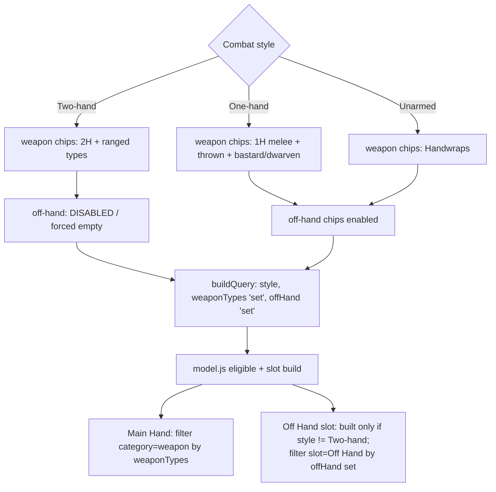

# Weapon-type, off-hand, and armor-oath solver constraints

**Product Contract preservation:** Product Contract unchanged — this enrichment adds the
Planning Contract, Implementation Units, Verification Contract, and Definition of Done to the
requirements settled in the brainstorm. Behaviors B1–B7, scope boundaries, and success criteria
are carried verbatim.

---

## Goal Capsule

Give the solver **precise, player-driven weapon and off-hand constraints** — lock the main-hand
weapon type, configure the off-hand (empty / orb / rune arm / shield subtypes), and approximate
armor oaths (druidic "no metal") — so an optimized loadout matches the build the player actually
plays. The same work closes a **correctness gap**: the solver today has no Off Hand slot, so 595
Off Hand items (shields, orbs, bucklers, and 167 rune arms) are un-equippable.

---

## Problem & Context

Grounding scan of the live code + dataset (`web/model.js`, `web/dataset.js`, `web/wizard.js`,
`web/data/items.json`):

- **No Off Hand slot exists.** `web/model.js` `WORN_SLOTS` runs Armor→Quiver; Main Hand
  (`category==='weapon'`, 3312 items) and a Rune Arm slot are appended separately. The Rune Arm
  slot filters `category==='runearm'` — which matches **exactly 1 item** (the Dino Bone Rune Arm).
  The **595 real Off Hand items** carry `category==='item'`, `slot==='Off Hand'` and are **never
  placed** by the solver.
- **The coarse `weaponSetup` (2h/swordboard/twf/runearm) is inert.** `buildQuery` emits it
  (`web/wizard.js:51`) but no solve-path code reads it — it constrains nothing today.
- **No weapon-type constraint.** Main Hand filters on `category==='weapon'` only — any of the **40
  weapon types** is eligible.
- **No handedness exclusivity.** Nothing prevents a two-handed weapon from co-existing with an
  off-hand item (moot today only because off-hand doesn't exist).
- **Armor-type gate already exists.** `eligible()` R7 gate (`web/model.js:109-112`) filters body
  armor by `query.armorTypes` against `v.armor_type`, which the normalizer derives from native
  `type` via `ARMOR_TYPE_MAP` (`web/dataset.js:30-35`, 83-84). Cloth/Light/Medium/Heavy armor all
  carry a populated `armor_type`. **The Druid oath rides this existing gate.**
- **`v.type` is the native type, preserved** — weapons carry `type` like "Long Swords", off-hand
  items carry "Orbs" / "Large shields" / "Rune Arms". The weapon/off-hand gates read `v.type`,
  mirroring the `armor_type` gate. There is **no material/metal field** — the oath stays an
  armor-*type* approximation.

---

## Settled Decisions

From the brainstorm and the plan-time scoping confirmation. Each is a labeled Key Technical
Decision below.

1. **Armor oath = approximate now, no new data.** Druid ≈ cloth + light (conservative — excludes
   undetectable non-metal medium), with an in-UI limitation note. `(session-settled: user-directed
   — chosen over material-data-harvest and armor-type-only: no material field exists in the data.)`
2. **Lock mode = permissive set that collapses to a pin.** None picked → any; one → hard pin;
   several → optimize within the allowed subset. `(session-settled: user-directed — chosen over
   exact-pin-only and allowed-set-without-pin-sugar.)`
3. **Off-hand scope = non-weapon only now; TWF deferred.** `(session-settled: user-directed —
   chosen over include-TWF-now.)`
4. **Picker layout = handedness-gated, progressive.** Style (One-hand / Two-hand / Unarmed) reveals
   only relevant weapon chips and drives the off-hand enable/disable. `(session-settled:
   user-directed — chosen over searchable-combobox and proficiency-category-tabs.)`
5. **Old-save migration = drop to unconstrained.** A pre-migration save loads with no weapon/off-hand
   constraint; the inert coarse flag is dropped, so an old save re-solves identically.
   `(session-settled: user-directed — chosen over best-effort-map and confirm-on-load.)`

---

## Product Contract

### Primary actor
A DDO player in the guided wizard who knows (or is deciding) their combat style and wants the
solver to optimize *within* that style, not pick an unrelated weapon/off-hand.

### Behaviors

- **B1 — Off Hand slot is solvable.** The solver gains a real Off Hand slot (cardinality ≤1) that
  can equip an orb, buckler, small/large/tower shield, or rune arm, optimizing its affixes. The
  vestigial `category==='runearm'` slot retires (rune arms are already in the Off Hand pool).
- **B2 — Combat-style gate.** The Character step offers One-hand / Two-hand / Unarmed; the choice
  filters weapon-type chips to that style and enables/disables the off-hand picker (Two-hand
  disables it).
- **B3 — Weapon-type lock (permissive set).** Within the style, any subset of weapon-type chips:
  none → any of that style; one → pin; several → allowed set. Constrains Main Hand eligibility.
- **B4 — Off-hand configuration (permissive set).** For One-hand / Unarmed, pick allowed off-hand
  kinds from {empty, orb, rune arm, buckler, small shield, large shield, tower shield}. "empty" is
  explicit and selectable.
- **B5 — Handedness exclusivity.** A Two-hand weapon forbids any off-hand item; the solver never
  co-equips them.
- **B6 — Armor oath approximation.** An oath control (Druid shortcut) restricts body armor to cloth
  + light via the existing `armorTypes` gate, shown with a data-limitation note. Composes with the
  armor-type chip.
- **B7 — Constraints flow to output.** The chosen style / weapon types / off-hand / oath appear in
  results and every Share export (Markdown / CSV / Print / BBCode).

### Scope Boundaries (non-goals)

- **Two-weapon fighting** (a second optimized weapon in the off-hand) — deferred follow-up.
- **A material/metal data harvest** — the oath stays an armor-type approximation.
- **Centered-monk mechanics** — not modeled.
- **Per-weapon-proficiency validation against class/feats** — the picker constrains the solver; it
  does not verify proficiency.
- **The pre-existing armor-proficiency hierarchy quirk** (heavy-proficient should imply lighter
  types; the gate is currently exact-match) — untouched here.
- **New weapon/off-hand items** — existing dataset only.

### Success Criteria

- One-hand → Long Swords + off-hand tower shield ⇒ Main Hand is a Long Sword, Off Hand is a Tower
  shield; nothing else appears.
- A Two-hand style ⇒ two-handed weapon and **no** off-hand item.
- Druid oath ⇒ no medium/heavy body armor in the result.
- Orbs/shields/bucklers — impossible before — are equippable and appear when chosen.
- Every export names the active weapon/off-hand/oath constraints.

---

## High-Level Technical Design

The style choice is the single gate that organizes the picker *and* drives eligibility:

The taxonomy module is the single source for the handedness map and the dataset-derived chip lists,
consumed by both the wizard (chips) and the model (allowed weapon types per style).

---

## Key Technical Decisions

- **KTD1 — Reviewed handedness/style map** keyed by the 40 dataset `type` strings, in a new
  `web/weapon-taxonomy.js`. Ranged buckets under **Two-hand** (a bow/crossbow forbids an off-hand;
  Quiver is a separate worn slot, unaffected); thrown buckets under **One-hand**; Bastard Swords &
  Dwarven War Axes → **One-hand** (feat-1H, keeps off-hand available); Handwraps → **Unarmed**.
  - Two-hand: Falchions, Great Axes, Great Clubs, Great Swords, Mauls, Quarterstaffs, Long Bows,
    Short Bows, Great/Heavy/Light Crossbows, Repeating Heavy/Light Crossbows.
  - One-hand: Battle Axes, Clubs, Daggers, Hand Axes, Heavy Maces, Heavy Picks, Kamas, Khopeshes,
    Kukris, Light Hammers, Light Maces, Light Picks, Long Swords, Morningstars, Rapiers, Scimitars,
    Short Swords, Sickles, War Hammers, Darts, Shurikens, Throwing Axes/Daggers/Hammers, Bastard
    Swords, Dwarven War Axes.
  - Unarmed: Handwraps.
- **KTD2 — Query shape.** `buildQuery` drops the inert `weaponSetup` and emits
  `{ style, weaponTypes: [], offHand: [] }`. Old saves load with these empty/absent (KTD5 of the
  brainstorm / Settled Decision 5) → unconstrained, identical re-solve.
- **KTD3 — Off Hand slot + rune-arm merge.** Build one Off Hand slot from
  `elig.filter(v => v.slot === 'Off Hand')` (dominance, cardinality ≤1); retire the
  `category==='runearm'` slot (its 1 item is a Dino Bone Rune Arm; rune arms proper are Off Hand
  `type==='Rune Arms'`). Confirm the 1-item vestige is either already in the Off Hand pool or
  intentionally dropped.
- **KTD4 — Empty off-hand.** The Off Hand slot is at-most-one (may be unfilled), so "empty" is the
  natural default state, not a phantom item. `offHand: ['empty']` alone ⇒ build **no** Off Hand
  slot (forbid all off-hand items). A non-empty allowed set with 'empty' included ⇒ build the slot
  from the allowed types (unfilled remains permissible).
- **KTD5 — Oath is generic under the hood, one named shortcut now.** Ship a "Druid" shortcut that
  sets `armorTypes = ['cloth','light']`; the mechanism is an armor-type allow-set, leaving room for
  other oaths without a schema change. Interaction with the single-select armor-proficiency chip:
  the oath is a distinct control that widens/overrides `armorTypes`; the dodge-cap `armorType`
  stays the proficiency selection.
- **KTD6 — Chip lists are dataset-derived.** Weapon/off-hand chip options come from the distinct
  `type` values for `slot==='Weapon'` / `slot==='Off Hand'` intersected with the static handedness
  map, so a new item type surfaces rather than silently missing (and an orphan in the map is
  detectable).

---

## Implementation Units

### U1. Weapon/off-hand taxonomy module

- **Goal:** A single source for the handedness map, style→allowed-types, and the off-hand type
  list, consumed by both wizard and model.
- **Requirements:** B2, B3, B5; KTD1, KTD6.
- **Dependencies:** none.
- **Files:** create `web/weapon-taxonomy.js` (dual-export, namespaced global like `dataset.js`);
  create `tests/weapon-taxonomy.test.js`.
- **Approach:** Export `STYLE_OF_TYPE` (map: type string → "one-hand" | "two-hand" | "unarmed") per
  KTD1; `weaponTypesForStyle(style, datasetTypes)` returning the intersection of the map's members
  for that style with the dataset's distinct weapon types; `OFF_HAND_TYPES` (the 6 canonical +
  "empty"); `offHandEnabledForStyle(style)` (false for two-hand). Keep the raw map keyed by the
  exact dataset strings ("Long Swords", etc.).
- **Patterns to follow:** the dual-export + namespaced-global pattern in `web/dataset.js` and
  `web/exporters.js`.
- **Test scenarios:**
  - Every one of the 40 dataset weapon `type` strings has a style assignment (no orphan) — drive
    from the actual `web/data/items.json` distinct types.
  - `weaponTypesForStyle("two-hand", …)` includes Falchions and Long Bows, excludes Long Swords and
    Handwraps.
  - `weaponTypesForStyle("one-hand", …)` includes Long Swords, Darts, Bastard Swords; excludes
    Great Axes, Long Bows.
  - `weaponTypesForStyle("unarmed", …)` is exactly [Handwraps].
  - `offHandEnabledForStyle` is false for "two-hand", true for "one-hand"/"unarmed".
  - `OFF_HAND_TYPES` matches the dataset's distinct Off Hand types plus "empty".

### U2. Off Hand slot + weapon/off-hand/style eligibility in the solver

- **Goal:** Make off-hand items solvable and enforce the weapon-type / off-hand / style constraints.
- **Requirements:** B1, B3, B4, B5; KTD3, KTD4.
- **Dependencies:** U1.
- **Files:** modify `web/model.js`; modify `tests/model.test.js` (and `tests/solver.test.js` if a
  real-dataset case is added).
- **Approach:** In `eligible()`, add: (a) a weapon-type gate — for `v.category==='weapon'`, when
  `query.weaponTypes?.length`, keep only `query.weaponTypes.includes(v.type)`; (b) an off-hand gate
  — for `v.slot==='Off Hand'`, when `query.offHand?.length` and not the empty-only case, keep only
  allowed `v.type`. In the worn-slot build: add an Off Hand slot from
  `elig.filter(v => v.slot === 'Off Hand')` with dominance + cardinality 1, **built only when the
  style is not two-hand and offHand is not `['empty']`** (KTD4/B5); retire the `category==='runearm'`
  slot. Gate all new branches additively (absent query field ⇒ no-op) exactly like the existing R6/R7
  branches, so an unconstrained solve is byte-for-byte unchanged except that off-hand items now
  become eligible.
- **Execution note:** Characterize first — add a test asserting an unconstrained solve equips no
  off-hand today, then a test that it *can* after the slot is added; keep the additive-no-op
  guarantee under test.
- **Patterns to follow:** the additive `query.armorTypes` gate (`web/model.js:109-112`) and the
  `mainHand`/`runeArm` slot construction (`web/model.js:330-333`); `dominanceFilter` usage.
- **Test scenarios:**
  - Covers B1. A solve with a shield-relevant priority (e.g. PRR) equips an Off Hand item; before
    the change the same solve equips none.
  - Covers B3. `weaponTypes: ['Long Swords']` ⇒ Main Hand candidates are all Long Swords; a
    Falchion is excluded.
  - `weaponTypes: ['Long Swords','Rapiers']` ⇒ both types remain eligible (permissive set).
  - Covers B4. `offHand: ['Tower shields']` ⇒ Off Hand candidates are all tower shields; an orb is
    excluded.
  - Covers B5. `style: 'two-hand'` ⇒ no Off Hand slot is built (solver cannot equip any off-hand).
  - KTD4. `offHand: ['empty']` ⇒ no Off Hand slot built. `offHand: ['orb','empty']` ⇒ slot built
    from orbs, unfilled still permitted.
  - Additive no-op: with none of `weaponTypes`/`offHand`/`style` set, weapon eligibility and every
    non-off-hand slot are identical to pre-change (regression guard).
  - Rune arm still equippable via the Off Hand slot (`type==='Rune Arms'`).

### U3. Wizard character-step picker: style gate + weapon-type + off-hand chips

- **Goal:** Replace the inert coarse weapon chips with the handedness-gated progressive picker and
  emit the new query fields.
- **Requirements:** B2, B3, B4; KTD2.
- **Dependencies:** U1, U2.
- **Files:** modify `web/wizard.js` (the `WEAPONS` const, character-step render ~`:257-260`, chip
  wiring ~`:858-864`, `buildQuery` `:43-51`, default `state` `:192`); modify `web/styles.css`
  (chip-group layout for the two-row weapon+off-hand picker); modify `tests/wizard.test.js`.
- **Approach:** Replace `state.weapon` (single coarse flag) with `state.style` (one of
  one-hand/two-hand/unarmed), `state.weaponTypes` (array), `state.offHand` (array). Render: a style
  segmented control; below it, weapon-type chips from `weaponTypesForStyle(state.style, …)`
  (multi-select, permissive); an off-hand chip row from `OFF_HAND_TYPES`, shown/enabled only when
  `offHandEnabledForStyle(state.style)`. Chip click toggles membership in the array (permissive-set
  behavior). Changing style resets `weaponTypes`/`offHand` to empty and re-renders. `buildQuery`
  emits `{ style: state.style || null, weaponTypes: state.weaponTypes || [], offHand: state.offHand
  || [] }` and drops `weaponSetup`.
- **Patterns to follow:** the existing armor-chip render/wiring and the composable-bundle
  multi-select chips already in `web/wizard.js`; `wz-seg`/`wz-chip` classes.
- **Test scenarios:**
  - Covers B2. `buildQuery` with `style:'two-hand'` emits no/empty `offHand` and the two-hand
    weapon set is available; switching to one-hand exposes the off-hand set.
  - Covers B3. Selecting two weapon-type chips puts both in `weaponTypes`; deselecting one removes
    it; selecting none yields `[]`.
  - Covers B4. Off-hand chips toggle into `offHand`; "empty" is selectable.
  - Changing style clears prior `weaponTypes`/`offHand` (no stale cross-style types).
  - `buildQuery` no longer emits `weaponSetup`.

### U4. Druid oath / anathema control

- **Goal:** A one-click oath that restricts body armor to cloth + light with an honest limitation
  note.
- **Requirements:** B6; KTD5.
- **Dependencies:** U3 (shares the character step).
- **Files:** modify `web/wizard.js` (character step render + wiring + `buildQuery`); modify
  `web/styles.css` (note styling); modify `tests/wizard.test.js`.
- **Approach:** Add `state.oath` (e.g. "" | "druid"). Render a small control near the armor chips;
  when "druid", `buildQuery` sets `armorTypes = ['cloth','light']` (overriding the single-chip
  `[state.armor]`), leaves the dodge-cap `armorType` as the proficiency selection, and shows a
  short note: metal-vs-non-metal medium/heavy is indistinguishable in the data, so this is a
  conservative approximation. No solver change — rides the existing R7 `armorTypes` gate.
- **Patterns to follow:** the existing armor-chip control and `wz-help` note text in
  `web/wizard.js`.
- **Test scenarios:**
  - Covers B6. `buildQuery` with `oath:'druid'` sets `armorTypes` to exactly `['cloth','light']`.
  - The oath overrides a conflicting single armor chip (e.g. armor='heavy' + druid oath ⇒
    `armorTypes` is `['cloth','light']`, not `['heavy']`).
  - Oath off ⇒ `armorTypes` behaves exactly as today.
  - The limitation note text is present in the rendered character step.

### U5. Persistence migration + export surfacing

- **Goal:** New constraint fields survive save/load, old saves migrate cleanly, and every export
  names the active constraints.
- **Requirements:** B7; KTD2, Settled Decision 5.
- **Dependencies:** U3, U4.
- **Files:** modify the character serialize/restore path (`web/wizard.js` restore ~`:688`, and the
  `CharacterStore.serializeCharacter` inputs); modify `web/exporters.js` (`constraintPairs` and the
  `WEAPON` label map ~`:22`); modify `tests/exporters.test.js`.
- **Approach:** Serialize `style`, `weaponTypes`, `offHand`, `oath` in the saved inputs. On restore,
  a pre-migration save (has `weapon`, lacks `style`) loads with the new fields empty/absent →
  unconstrained (Settled Decision 5); drop the old `weapon`/`weaponSetup` value silently. In
  `exporters.js`, replace the `WEAPON` coarse-flag label map with constraint lines derived from the
  new fields: a "Weapon" line (style + weapon types, or "Any"), an "Off hand" line (allowed set or
  "Any"), and an "Oath" line when set. All four exports (Markdown / CSV / Print / BBCode) inherit
  via `constraintPairs`.
- **Execution note:** Add a fixture for a pre-migration save to lock the unconstrained-migration
  behavior.
- **Patterns to follow:** `constraintPairs` (`web/exporters.js:26-38`) and the existing per-format
  consumers; the pre-overhaul-save migration pattern already in `web/dataset.js`.
- **Test scenarios:**
  - Covers B7. `constraintPairs` for a build with `style:'one-hand'`, `weaponTypes:['Long Swords']`,
    `offHand:['Tower shields']`, `oath:'druid'` yields Weapon / Off hand / Oath lines with those
    values; all four exporters surface them.
  - A build with no weapon/off-hand constraint renders "Any" (or omits the line), not the old coarse
    label.
  - A pre-migration saved character (old `weapon` flag, no `style`) restores to unconstrained and
    re-solves without error.
  - Existing exporter security tests (formula/markup/BBCode injection neutralization) still pass with
    the new fields.

---

## Verification Contract

- **Node suites (all must pass):** `tests/weapon-taxonomy.test.js`, `tests/model.test.js`,
  `tests/solver.test.js`, `tests/wizard.test.js`, `tests/exporters.test.js`. Run each independently
  (`node tests/<file>.js`) — do not trust an aggregate "green" claim.
- **`node --check`** on every modified `.js`.
- **Browser smoke (localhost http server + manual):** style gate reveals/hides the correct weapon
  chips; Two-hand disables the off-hand row; a full solve with `offHand:['Tower shields']` places a
  tower shield; a Two-hand solve places no off-hand; Druid oath removes medium/heavy armor from the
  result; no duplicate-global console error (watch the `const`-in-shared-global-scope trap).
- **Cache-bust + build stamp:** bump `?v=NN` in `web/index.html` for every changed JS/CSS file;
  stamp the footer build via the build-versioning skill (next after `08012026.2`).

## Definition of Done

- B1–B7 satisfied; all success criteria demonstrably hold in a browser solve.
- Off-hand items are equippable; the vestigial `runearm` slot is retired without regressing rune-arm
  equippability.
- An unconstrained solve is unchanged from pre-migration except for now-eligible off-hand items
  (additive no-op guard green).
- Old saves load unconstrained and re-solve without error.
- All node suites green (run individually), `node --check` clean, browser smoke passed, cache-bust
  bumped, footer build stamped.

---

## Scope Boundaries

### Deferred to Follow-Up Work
- **Two-weapon fighting** — a second optimized weapon in the off-hand (own type-lock, unique-item
  exclusion). Brainstorm-deferred; the cleanest next unit on top of this slot model.
- **Armor material harvest** — a metal/non-metal field from the wiki to make the oath exact.
- **Additional oaths/anathemas** — the mechanism (armor-type allow-set) already generalizes.

### Outside this change
- Centered-monk shield mechanics; per-class/feat proficiency validation; the pre-existing
  armor-proficiency hierarchy quirk (exact-match vs heavy⊇light).

---

## Sources & Research

- First-hand grounding this session: `web/model.js` (`WORN_SLOTS`, `eligible()`, worn-slot build),
  `web/dataset.js` (`ARMOR_TYPE_MAP`, `normalizeItem`), `web/wizard.js` (`buildQuery`, character
  step), `web/exporters.js` (`constraintPairs`), and `web/data/items.json` distinct
  category/slot/type counts (40 weapon types, 6 off-hand types, 595 Off Hand items, 1 vestigial
  runearm). No external research required — the constraints are fully determined by the local
  dataset and model.
- Origin: this file's requirements-only revision (same path), from `ce-brainstorm` on 2026-08-01.
