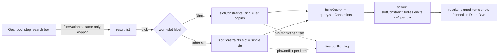

# Pre-solve item pinning - Plan

**Product Contract preservation:** Product Contract unchanged — this enrichment adds the
Planning Contract, Implementation Units, Verification Contract, and Definition of Done.
Grounding refined B5: two-ring pinning needs a small solver extension (user confirmed
including it), captured as KTD3.

---

## Goal Capsule

Let a player **search the item catalog and pin a specific item to its slot before running
the solver**, so the optimizer is forced to include gear they've already decided on (e.g.
Hydra's Heart trinket — a user-reported request). The solver already honors pins; this is
mostly UI, plus a small extension so two rings can be pinned.

---

## Problem & Context

- **The solver already supports pins.** `query.slotConstraints` maps a slot label to
  `{ type: "pin", variant_id }`; `web/solver.js` `slotConstraintBodies` emits `x = 1` for
  the pinned variant, `web/model.js` keeps pinned variants through the dominance filter
  (`pinnedIds`), and a pin whose variant isn't in the pool is a silent no-op. `buildQuery`
  already threads `state.slotConstraints` into the query.
- **But pins can only be created AFTER a solve** — the results "Loadout Deep Dive"
  (`web/results.js` `equippedRow`: *Pin this item / Lock empty / Free*, wired in
  `web/wizard.js`). You can only pin gear the solver already chose.
- **Reusable search:** `web/browse.js` `filterVariants(items, { query, slot, maxMl,
  verification, stat })` is a pure, unit-tested filter (matches `variant_id`/`source_item`/
  stats) — the Item Browser is built on it.
- **One-pin-per-slot model.** `slotConstraints` holds ONE constraint per slot LABEL.
  `slotConstraintBodies` groups xVars by `xv.slot`. The Ring slot is cardinality 2 but
  shares the label "Ring" (results tells the two rings apart by `ringIndex`, not by
  constraint) — so today only one ring can be pinned. B5 (two ring pins) needs the Ring
  constraint to hold a list and `slotConstraintBodies` to emit `x=1` per pinned ring.
- `state.slotConstraints` is serialized with saved characters (`INPUT_KEYS` in
  `web/persist.js`), and R17 (`web/wizard.js`) drops a pin whose item didn't land.

---

## Settled Decisions

1. **Placement = the Gear pool step.** A "Pin specific items" section in `stepPool()`,
   alongside the all-gear/owned selector. Keeps the flow at 5 steps. `(session-settled:
   user-directed — chosen over the Character step and a dedicated 6th "Pinned gear" step.)`
2. **Conflicts = allow any item, flag inline.** Search the full catalog; pin anything; if a
   pinned item isn't equippable under the current constraints, show an inline reason and
   keep the pin (the solver drops a truly-stuck pin, R17). `(session-settled: user-directed
   — chosen over restrict-search-to-equippable and allow-any-with-no-feedback.)`
3. **Two-ring pinning included.** Extend the Ring slot constraint to hold a list of pins so
   two different rings can be pinned. `(session-settled: user-directed — chosen over ship
   one-pin-per-slot and defer the second ring.)`

---

## Product Contract

### Primary actor
A player who already knows one or more specific items they want in the build and wants the
optimizer to work around them.

### Behaviors

- **B1 — Search the catalog.** A search field in the Gear pool step finds items by name
  (via the `filterVariants` search path). Results show item name + slot; picking one pins it.
- **B2 — Pin to slot.** Picking a result adds a pin to `state.slotConstraints`, keyed by the
  item's worn slot; the solver is then forced to equip that item in that slot.
- **B3 — Pinned list.** Pinned items render as a list — name, slot, remove (×). Removing
  clears that pin.
- **B4 — Conflict flags.** A pinned item not equippable under the current constraints (ML
  above cap / below floor, docent-vs-race, armor type outside proficiency/oath, weapon type
  outside the combat style, off-hand blocked by the style, artifact without the opt-in) is
  shown with an inline reason and stays pinned.
- **B5 — Rings take two pins.** Up to two *different* ring items may be pinned, each forced
  into a ring slot. Single-cardinality slots hold one pin (a new pick replaces it).
- **B6 — Consistent with post-solve pins.** Pre-solve pins feed the same
  `state.slotConstraints`, so they appear "pinned" in the results Deep Dive, the Deep-Dive
  pin/free actions edit the same set, and pins persist with saved characters.

### Scope Boundaries

- **No new solver pin logic beyond the two-pin list** — single-pin dominance exemption,
  R17 invalidation, and the pin `x=1` body already exist.
- **No augment-color pinning** — augments (Blue/Colorless/Moon/…) are a separate pool.
- **No "pin a set" or "pin by affix"** — pinning is per specific item (`variant_id`).

#### Deferred to Follow-Up Work
- Restrict-to-equippable search mode (a toggle) — decided against for now (KTD/Decision 2).

### Success Criteria

- Searching "Hydra's Heart", picking it, and solving yields a loadout equipping that exact
  item in its slot; a second solve keeps it; removing the pin frees the slot.
- Pinning an item above the ML cap shows a conflict flag and it doesn't appear in the result.
- Pinning two different rings equips both; pinning a second Trinket replaces the first.
- A saved-and-reloaded character keeps its pins.

---

## Key Technical Decisions

- **KTD1 — One gate list, two callers (no hand-mirrored copy).** Do **not** write a second
  helper that re-lists `eligible()`'s gates by hand — a parallel copy drifts (it would already
  omit `eligible()`'s alignment gate at `web/model.js:199-202`, so an alignment-blocked pin
  would be silently solver-dropped while the flag showed no reason — the exact confusion B4
  exists to prevent). Instead **extract** `eligible()`'s per-variant checks into one pure
  `variantConflict(variant, query)` that returns `null` (equippable) or a short reason string,
  and refactor `eligible()` to keep exactly the variants where `variantConflict(...) === null`.
  `pinConflict` is then just `variantConflict` re-exported for the UI (or a thin wrapper). One
  source of truth: every gate `eligible()` enforces is the same gate the B4 flag reports.
  Reason strings cover ML cap, ML floor, race/docent, armor type, weapon-type/style, off-hand
  block, artifact opt-in, **and alignment**. Verification is not a reason (the picker only
  surfaces verified items per KTD3, so the gate is unreachable from a pin). `eligible()` stays
  the solver's authority; the flag is advisory (the pin persists regardless).
- **KTD2 — Pin representation supports a list per slot.** `slotConstraints[label]` may be a
  single `{ type, variant_id }` (as today, for single-cardinality slots) OR, for the Ring
  slot, `{ type: "pin", variant_ids: [...] }` (or an array of pin objects — implementer's
  call, kept internal). `slotConstraintBodies` emits `x=1` for **each** pinned variant found
  in the slot group; `pinnedIds` collects all of them (so dominance keeps each); R17 drops
  any list member whose item didn't land. Backward-compatible: existing single-pin saves and
  the results Deep-Dive pin action still produce the single-object shape.
- **KTD3 — Name-only search, capped, with a truncation signal.** The catalog is ~9,000
  items; the picker matches **item name only** and caps results (e.g. ~30), ordering
  exact/prefix name matches first so it stays responsive. `filterVariants` also matches
  `variant_id`/`source_item`/stats, so the picker must post-filter its results to name
  matches before the cap (else a stat/id match surfaces an item the user didn't search for,
  breaking B1's "by name" promise). Filter to `verification === "verified"` (the solver
  ignores unverified anyway). **When matches exceed the cap, render a trailing "Showing top
  N of M — refine your search" affordance** — without it, a target item ranked past the cap
  looks absent and the user abandons the pin, defeating the feature.
- **KTD4 — Pin key is the WORN-slot label, not `variant.slot`.** `slotConstraintBodies`
  groups pick-vars by the worn-group slot label (`"Main Hand"` for weapons, `"Off Hand"`,
  `"Ring"`, etc.), which is **not** the same as a weapon item's own `variant.slot` (that is
  `"Weapon"`). Keying a weapon pin by `variant.slot` writes `slotConstraints.Weapon`, which
  matches no slot group and is a **silent no-op** — the pinned weapon is never forced in (B2
  fails for weapons). So the pin key is the worn-slot label derived from the item: any weapon
  (`category === "weapon"`) → `"Main Hand"`, an off-hand item → `"Off Hand"`, otherwise
  `variant.slot`. Augment-color "slots" are excluded from results (not worn slots).

---

## High-Level Technical Design

---

## Implementation Units

### U1. Extract a shared `variantConflict` core; expose `pinConflict`

- **Goal:** A single pure per-variant gate function that returns the reason a variant can't be
  equipped (or `null`), used by BOTH `eligible()` (the solver's filter) and the B4 inline flag
  — no hand-mirrored second copy that can drift.
- **Requirements:** B4; KTD1.
- **Dependencies:** none.
- **Files:** modify `web/model.js` (extract `variantConflict`, refactor `eligible()` to use
  it, export `pinConflict`); modify `tests/model.test.js`.
- **Approach:** Pull the per-variant checks currently inline in `eligible()` (`web/model.js`
  lines ~153-211, **including the alignment gate at ~199-202**) into one pure
  `variantConflict(variant, query)` that returns `null` when the variant passes every gate,
  else a short human reason ("above your ML 34 cap", "below your ML floor", "docents are for
  Forged races" / "Forged races equip a docent, not body armor", "armor type not in your
  proficiency", "not equippable with the <style> style", "off-hand blocked by the <style>
  style", "doesn't match your alignment", "needs the Include-an-Artifact option"). Refactor
  `eligible()` to `return variants.filter(v => variantConflict(v, query) === null)` — same
  behavior, one gate list. Export `pinConflict` as `variantConflict` (or a thin wrapper)
  under a stable name for the UI. It reads the same query fields `eligible()` reads (`mlCap`,
  `mlFloor`, `race`, `armorTypes`, `style`/`weaponTypes`/`offHand`, `alignment`,
  `includeArtifact`) and the same taxonomy/docent helpers. Verification is not a gate here
  (the picker only surfaces verified items, KTD3).
- **Execution note:** This is a behavior-preserving extraction of `eligible()`. Characterize
  first — the existing `eligible()` tests must stay green unchanged through the refactor; the
  new `variantConflict`/`pinConflict` reason tests are additive.
- **Patterns to follow:** `eligible()` in `web/model.js` (the exact gate order + the
  taxonomy/docent/alignment helpers it calls — the extraction must preserve all of them).
- **Test scenarios:**
  - Covers B4. An item at ML above the cap → reason mentions the ML cap; below the floor →
    the floor.
  - A docent with `race:"elf"` → a race reason; a non-docent body armor with `race:"warforged"`
    → a race reason.
  - An armor type outside `armorTypes` (e.g. heavy under a Druid oath) → an armor reason.
  - A weapon whose type is outside the chosen style/`weaponTypes` → a style reason; an off-hand
    item under a two-hand style → an off-hand reason.
  - An item failing the alignment gate → an alignment reason (guards against the drift KTD1
    calls out — the reason must exist because `eligible()` enforces it).
  - An artifact item with `includeArtifact` false → an artifact reason.
  - An equippable item under a permissive query → `null`.
  - **Parity:** `eligible(variants, query)` returns the same set before and after the
    refactor across the existing `eligible()` fixtures (behavior-preserving extraction).

### U2. Multi-pin (list) slot constraints in the solver

- **Goal:** Let a single slot (Ring) carry more than one pin so two different rings are both
  forced in.
- **Requirements:** B5; KTD2.
- **Dependencies:** none.
- **Files:** modify `web/solver.js` (`slotConstraintBodies`); modify `web/model.js`
  (`pinnedIds` collection); modify `web/wizard.js` (R17 stale-pin invalidation to handle a
  list); modify `tests/constraints.test.js` and/or `tests/solver.test.js`.
- **Approach:** Normalize a slot constraint to a list of pin variant_ids when reading it.
  `slotConstraintBodies` emits one `x=1` body per pinned variant present in the slot group
  (single-pin slots emit one, as today). `buildModel`'s `pinnedIds` set collects every pinned
  variant_id across all slot constraints (single or list) so dominance keeps each. R17
  invalidation, which today deletes a slot's pin if its item didn't land, must instead prune
  only the missing member from a list (and delete the key when the list empties). Keep the
  single-object shape as the default so the existing Deep-Dive pin action and old saves are
  unaffected.
- **Execution note:** Characterize first — add a solver test that pinning two different rings
  yields both equipped, and confirm the existing single-pin tests stay green.
- **Patterns to follow:** `slotConstraintBodies` (`web/solver.js:49`), `pinnedIds` build
  (`web/model.js` ~`:388`), R17 (`web/wizard.js` ~`:663`).
- **Test scenarios:**
  - Covers B5. Two different ring variants pinned → the program has an `x=1` body for each,
    and a solve equips both rings.
  - A single-pin slot (e.g. Trinket) still emits exactly one `x=1` (regression).
  - R17: a two-ring pin where one ring's item is ineligible → only the missing ring is pruned;
    the other stays.
  - `pinnedIds` includes every pinned variant across single and list constraints.

### U3. Gear pool "Pin specific items" UI

- **Goal:** Search the catalog and pin/unpin items in the Gear pool step.
- **Requirements:** B1, B2, B3, B4; KTD3, KTD4.
- **Dependencies:** U1 (conflict flag), U2 (list-pin for rings).
- **Files:** modify `web/wizard.js` (`stepPool()` render + wiring); modify `web/styles.css`;
  modify `tests/wizard.test.js`.
- **Approach:** Add a "Pin specific items" block to `stepPool()`: a search input that filters
  `dataset.items` via `filterVariants({ query, verification: "verified" })`, then name-only
  post-filter + cap + truncation notice per KTD3, excluding augment-color slots. A result row
  shows name + worn slot; picking it adds a pin keyed by the item's **worn-slot label** (per
  KTD4 — weapon → "Main Hand", off-hand item → "Off Hand", else `variant.slot`) — replacing
  the single-slot pin, or appending to the Ring list (up to 2, no duplicate variant). Below,
  a pinned-items list renders each pin's name, worn slot, an inline `pinConflict(...)` reason
  when present, and a remove (×). Search/pin/remove update state without a full re-render
  where practical, and set `state.constraintsDirty` so a re-solve is offered.
- **UI states (enumerate — do not leave to the implementer):** the existing chip/pick-list
  patterns are *static* lists with none of these live-search states, so each must be built
  explicitly:
  - **Search field** — zero-query: a hint row ("Type an item name to search"); no-match:
    "No items match '<query>'"; results present: rows + the KTD3 truncation notice when
    matches exceed the cap.
  - **Pinned list** — empty (first-run): a one-line empty state ("No pinned items yet —
    search above to force a specific item into the build"); populated: name + worn slot +
    optional conflict reason + remove (×).
  - **Conflict flag** — inline on the pinned row (not a separate area), showing the
    `pinConflict` reason string verbatim; visually distinct (e.g. a warning color/icon) but
    the pin stays and is removable.
- **Patterns to follow:** `stepPool()` (`web/wizard.js:352`), the pick-list/tag wiring added
  for the combat-style pickers (structure only — states are new), and the Deep-Dive pin
  action (`web/wizard.js` ~`:1076`).
- **Test scenarios:**
  - Covers B1/B2. `buildQuery` after pinning "Hydra's Heart" carries
    `slotConstraints.Trinket = { type:"pin", variant_id:"Hydra's Heart" }`.
  - Covers B2/KTD4. Pinning a weapon writes `slotConstraints["Main Hand"]` (the worn label),
    NOT `slotConstraints.Weapon` — and a solve equips it (guards the silent-no-op).
  - Covers B3. Removing a pin deletes that slot's constraint (or the list member).
  - Covers B5. Pinning two rings yields a two-member Ring list; pinning a second Trinket
    replaces the first; pinning the same ring variant twice does not duplicate.
  - Covers B4. A pinned item flagged by `pinConflict` renders its reason; an equippable one
    renders none.
  - The search matches by name only (a stat/id-only match is not surfaced), excludes
    augment-color slots and unverified items, and shows the truncation notice past the cap.

### U4. Results + persistence consistency

- **Goal:** Pre-solve pins behave identically to post-solve pins across the results Deep Dive
  and saved characters.
- **Requirements:** B6; B5.
- **Dependencies:** U2, U3.
- **Files:** modify `web/results.js` (`equippedRow` — take the row's `variant_id`/`ringIndex`;
  badge + menu keyed per row) and `web/wizard.js` (the Deep-Dive pin/free handler at ~`:1076`
  — list-aware writes); modify `tests/persist.test.js` and `tests/results.test.js` as needed.
- **Approach:** The Deep-Dive free/pin controls today are keyed only by the shared label
  `"Ring"` and the handler at `web/wizard.js:1076-1078` does `delete slotConstraints[slot]`
  (free) and `slotConstraints[slot] = {…}` (pin) on the whole slot. For a list-shaped Ring
  constraint that is **destructive**: Free on one ring row wipes *both* pins, and Pin on one
  row overwrites the entire list with a single object. Fix both sides:
  - **`equippedRow` (results.js):** pass the row's own `variant_id` (and `ringIndex` for
    rings) into the row so its menu buttons carry `data-variant`, and badge a row "pinned"
    only when *that row's* `variant_id` is the pin (single) or a member of the pin list
    (Ring) — not merely when the slot has any pin. Without this, both ring rows show "pinned"
    whenever either is.
  - **Pin/free handler (wizard.js):** on a list-shaped slot, Free **prunes the one
    `data-variant` member** (deleting the key only when the list empties) and Pin **appends /
    replaces that one member**, rather than clobbering the whole slot. Single-cardinality
    slots keep today's whole-slot write. This is the same list/single duality U2 introduces —
    reuse U2's normalize path so both editors agree.
  - Persistence already round-trips `slotConstraints` via `INPUT_KEYS`; add a test that a
    saved character with pins (incl. a two-ring list) reloads intact.
- **Dependencies note:** builds directly on U2's list-shape handling; do U2 first.
- **Test scenarios:**
  - Covers B6. A serialize→restore round-trip preserves single-slot pins and a two-ring pin list.
  - Covers B5/B6. With two rings pinned, Free on ring-row-1 leaves ring-row-2's pin intact
    (does NOT wipe both); Pin on ring-row-2 appends without dropping ring-row-1.
  - A two-ring pin badges each ring row per its own variant — not both rows when only one is
    pinned.
  - A results Deep Dive over a build with a pre-solve single-slot pin shows the "pinned"
    badge on that slot only.
  - Editing a pin from the Deep Dive and from the Gear pool step both mutate the same
    `state.slotConstraints` consistently (list stays a list).

---

## Verification Contract

- **Node suites (run each independently):** `tests/model.test.js`, `tests/constraints.test.js`,
  `tests/solver.test.js`, `tests/wizard.test.js`, `tests/persist.test.js`,
  `tests/results.test.js`. `node --check` on every modified `.js`.
- **Browser smoke (localhost + manual):** in the Gear pool step, search a known item, pin it,
  solve → it's equipped in its slot; pin two rings → both equipped; pin an above-ML item →
  conflict flag shown and item absent from the result; remove a pin → slot freed; no
  duplicate-global console error. Bump `?v=` in `web/index.html`; stamp the footer build.
- **Golden:** unconstrained parity fixtures set no `slotConstraints`, so the golden is
  unaffected; re-run to confirm.

## Definition of Done

- B1–B6 satisfied; all success criteria hold in a browser solve.
- Two different rings can be pinned and both equip; single slots replace on re-pin.
- A pinned **weapon** actually equips (worn-slot key, KTD4 — not a silent no-op).
- `eligible()` behavior is unchanged by the U1 extraction (parity tests green); the B4 flag
  reports the same gates the solver enforces, alignment included.
- Ineligible pins show a reason and are dropped from the result (not silently, not infeasible).
- Capped search results show the "top N of M" truncation notice; the pinned list shows its
  empty state.
- Editing one ring pin from the Deep Dive does not destroy the other.
- All node suites green (run individually), `node --check` clean, browser smoke passed,
  cache-bust bumped, footer stamped.

---

## Sources

- `web/model.js` (`eligible()`, `pinnedIds`, dominance), `web/solver.js`
  (`slotConstraintBodies`), `web/results.js` (`equippedRow`, `slotPosition` ring index),
  `web/wizard.js` (`stepPool`, `buildQuery` slotConstraints thread, R17, Deep-Dive pin wiring),
  `web/browse.js` (`filterVariants`), `web/persist.js` (`INPUT_KEYS`).
- Origin: `data/bug_reports.txt` ("pick pieces we definitely wanted … to be included").
