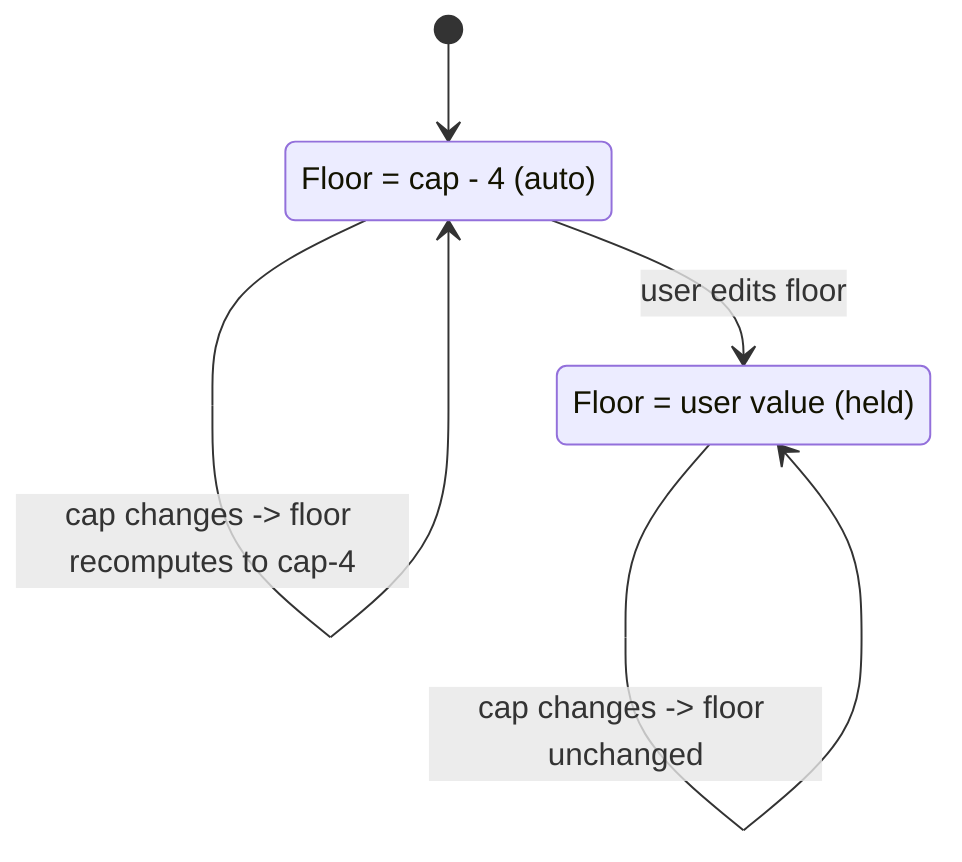

# Player-Like Gearing Constraints - Plan

## Goal Capsule

- **Objective:** Make the optimizer's output match how players actually assess gear — without giving up the "provably optimal" guarantee. Add optimality-preserving expressiveness (per-stat caps and floors, a sane leveling-gear floor default, and a fix for redundant same-stat slotting) that dissolves the "not player-like" complaints at their real root causes.
- **Product authority:** eddiefiggie (project owner).
- **Open blockers:** None. No decision is left that blocks planning.
- **Issues addressed:** #94 (stat floors + caps) fully; #91 (leveling-gear filter + redundancy fix, plus caps/floors as the elicitation fix for niche picks) with the holistic remainder measurement-gated.

---

## Product Contract

### Summary

Add per-stat **user-set caps** and **floors**, a **leveling-gear floor default** (`cap − 4`), and a fix for **redundant same-stat slotting**, so the optimizer stops recommending leveling gear at endgame, stops chasing stats past the point the player cares about, and stops spending slots on an already-maxed stat while ignoring the next priority. All four levers preserve strict optimality — they change the solver's *inputs and constraints*, not its objective. Soft/holistic "player-like" scoring stays deferred behind a measurement gate.

### Problem Frame

The optimizer is provably optimal under its model, yet testers report picks that "are not how players typically assess gearing": L18/L13 items recommended at ML36, a +2 exceptional bonus chased onto low-level gear, Kinetic Lore slotted four times while the next-ranked stat got nothing, and niche single-stat items (Memoriam-style) that win a stat but bring nothing else.

Decomposing those reports shows the optimization is rarely the problem. Three of the four causes are input/constraint gaps — the pool includes heroic gear, the solver has no cap-awareness, and the lexicographic descent stops short and re-serves a maxed bucket. The fourth (a genuinely niche item that *is* the best source of a stat the user ranked) is largely a priority-elicitation gap: the user did not actually value that stat as highly as the ranking implied, and had no way to say "enough." The cost is eroded trust in the headline promise even when the math is correct.

### Key Decisions

- **Keep provable-optimal; fix inputs and constraints, not the objective.** (session-settled: user-directed — chosen over relaxing optimality to a holistic objective: preserves the app's core differentiator, and the niche-pick complaints decompose mostly into pool/cap/redundancy causes that constraints fix.)
- **User-set caps only in v1.** No verified in-game cap table. (session-settled: user-directed — chosen over seeding or harvesting known caps: zero data dependency, ships fast.)
- **Leveling filter is an adjustable `cap − 4` default on the existing ML floor, never a silent exclusion.** (session-settled: user-directed — chosen over aggressive auto-exclusion and over a separate opt-in toggle: avoids dropping a genuinely best-in-slot low-ML item without disclosure, while still giving endgame users endgame gear by default.)
- **Floors are best-effort with a shortfall notice, not strict-infeasible.** (session-settled: user-directed — chosen over returning no result: never strands the user at an empty result.)

### Requirements

**Per-stat caps (user-set)**

- R1. Each priority stat accepts an optional maximum (cap). The solver clamps that stat's counted contribution at the cap, so value beyond the cap does not improve the objective — reusing the existing dodge-cap clamp (`d ≤ cap AND d ≤ raw`).
- R2. A cap changes *when a stat stops accruing value*, not its rank: the stat is still maximized in lexicographic order up to the cap.

**Per-stat floors (user-set, best-effort)**

- R3. Each priority stat accepts an optional minimum (floor), which the solver satisfies before the normal lexicographic maximize.
- R4. When a floor is unreachable given the pool, slots, and other constraints, the solver returns the best achievable loadout — never "no result" — and reports the shortfall (e.g. "couldn't reach 300 PRR — best achievable was 274").
- R5. When a floor is reachable, the loadout meets or exceeds it, then optimization of the remaining priorities proceeds normally.

**Leveling-gear floor default**

- R6. The existing ML floor input defaults to `cap − 4` (e.g. cap 36 → floor 32), so endgame queries exclude far-below-cap leveling gear by default.
- R7. The default is live: changing the ML cap moves the floor to stay at `cap − 4`, until the user manually edits the floor — after which their value is preserved and auto-follow disengages.
- R8. The floor stays visible and freely adjustable, including widening it below `cap − 4`; the results coverage disclosure states the ML band actually considered, so the promise reads honestly as "optimal over ML ≥ your floor."

**Lexicographic-redundancy fix**

- R9. Once a stat's bucket is maxed, the solver does not spend additional slots re-serving that stat while a lower-ranked priority is still unaddressed; it descends to the next priority.
- R10. The fix is optimality-preserving — it completes the lexicographic descent rather than changing the objective — and the result stays deterministic.

**UX and messaging**

- R11. Each priority row exposes optional min (floor) and max (cap) fields alongside the existing drag-to-reorder.
- R12. "Provably optimal" messaging is retained; results surface the considered ML band and any unmet floor, so the headline promise matches what was actually solved.

The floor-follows-cap default (R6–R7) has two states — tracking the default versus holding a manual value:

### Acceptance Examples

- AE1. Cap stops over-investment.
  - **Given:** heal-amp is a priority with a cap set 2 below its currently-reachable value.
  - **When:** the user solves.
  - **Then:** no item is chosen solely to push heal-amp past the cap; a slot that would only add capped-out heal-amp is free to serve another priority.
  - **Covers R1, R2.**
- AE2. Floor is best-effort with a notice.
  - **Given:** a PRR floor of 300 that is unreachable in the current ML band.
  - **When:** the user solves.
  - **Then:** the solver returns the best loadout it can, shows "couldn't reach 300 PRR — best achievable was 274", and still maximizes the other priorities.
  - **Covers R3, R4, R5.**
- AE3. Floor follows the cap until manually touched.
  - **Given:** cap 30 (floor auto = 26). The user raises the cap to 36.
  - **When:** the cap changes.
  - **Then:** the floor auto-moves to 32. But had the user first set the floor manually to 20, raising the cap leaves the floor at 20.
  - **Covers R6, R7.**
- AE4. No redundant same-stat slotting.
  - **Given:** priorities Impulse, Kinetic Lore, Kinetic Intensity, Intelligence.
  - **When:** the user solves.
  - **Then:** Kinetic Lore is not slotted redundantly past its maxed bucket; Kinetic Intensity receives sources (if any exist) before lower priorities are served.
  - **Covers R9, R10.**

### Scope Boundaries

**Deferred for later (measurement-gated)**

- Soft / holistic "player-like" utility scoring that down-weights single-stat items — built only if a residual of genuinely-niche picks survives R1–R10 (see Success Criteria). This is the deferred remainder of #91.
- Auto cap-awareness from a verified in-game cap table (doublestrike/dodge/fort at 100%, etc.) — a later exclude-until-verified data pass.
- DPS / build-aware stat weighting (the #94 stretch item) — requires build awareness the tool does not model.

**Outside this v1**

- Changing the "provably optimal" objective itself.
- A strict floor mode that returns no result on infeasibility (best-effort chosen instead).

### Success Criteria

- **Regression of the reported cases:** after R1–R10 ship, re-running the reported inputs (Kinetic Lore ×4; L18/L13 gear at ML36; the +2-exceptional chase; the ml7 human-THF case) no longer produces the leveling, redundant, or over-priority picks.
- **The measurement gate for soft-mode:** with inputs and constraints fixed, if a meaningful residual of expert-flagged niche picks still appears — an item that is best on a stated priority but brings nothing else and a player would swap out — that residual is the trigger to scope the deferred holistic follow-up on #91. If no such residual remains, close #91 on the constraint fixes alone.

### Outstanding Questions

**Resolve before planning**

- None blocking.

**Deferred to planning**

- Exact min/max field UX on priority rows (layout, validation, empty = unbounded).
- Whether caps and floors persist in saved characters — the persistence layer (`persist.js`) exists; recommend yes.
- Redundancy-fix mechanism: secondary-objective term versus a refinement of the deterministic tie-break in `solver.js`.
- Floor interaction with pins/locks, and with a manually-set `mlFloor`, when both are present.
- Whether floor auto-follow re-asserts if the user later clears a manually-set floor value back to empty.

### Sources / Research

- `web/solver.js` — staged lexicographic solve; the dodge-cap clamp (`d ≤ cap AND d ≤ raw`) that R1 reuses; the deterministic tie-break that R9–R10 refine.
- `web/model.js` — model builder, per-slot dominance pre-filter, existing `mlCap`/`mlFloor` handling that R6–R8 extend.
- `web/wizard.js` — the priorities step and ML cap/floor inputs where R11 adds min/max.
- `data/bug_reports.txt` — the verbatim user reports these requirements answer.
- Memory `ddo-optimizer-algorithm-limitations` — the four-cause decomposition and the per-slot-per-stat greedy analysis behind the Key Decisions.
