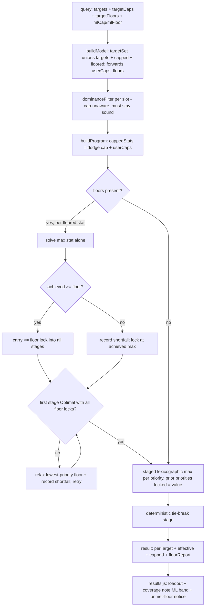

# Player-Like Gearing Constraints - Plan

## Goal Capsule

- **Objective:** Make the optimizer's output match how players actually assess gear — without giving up the "provably optimal" guarantee. Add optimality-preserving expressiveness (per-stat caps and floors, a sane leveling-gear floor default, and a characterization of redundant same-stat slotting) that dissolves the "not player-like" complaints at their real root causes.
- **Product authority:** eddiefiggie (project owner).
- **Open blockers:** None.
- **Issues addressed:** #94 (stat floors + caps) fully; #91 (leveling-gear filter + redundancy behavior, plus caps/floors as the elicitation fix for niche picks) with the holistic remainder measurement-gated.
- **Product Contract preservation:** Product Contract unchanged — R1–R12, AE1–AE4, and the four Key Decisions are carried verbatim; planning added the Planning Contract, Implementation Units, Verification Contract, and Definition of Done below.

---

## Product Contract

### Summary

Add per-stat **user-set caps** and **floors**, a **leveling-gear floor default** (`cap − 4`), and a fix for **redundant same-stat slotting**, so the optimizer stops recommending leveling gear at endgame, stops chasing stats past the point the player cares about, and stops spending slots on an already-maxed stat while ignoring the next priority. All four levers preserve strict optimality — they change the solver's *inputs and constraints*, not its objective. Soft/holistic "player-like" scoring stays deferred behind a measurement gate.

### Problem Frame

The optimizer is provably optimal under its model, yet testers report picks that "are not how players typically assess gearing": L18/L13 items recommended at ML36, a +2 exceptional bonus chased onto low-level gear, Kinetic Lore slotted four times while the next-ranked stat got nothing, niche single-stat items (Memoriam-style) that win a stat but bring nothing else, and an ml7 human two-hander query returning a level-4 chain shirt with no set.

Decomposing those reports shows the optimization is rarely the problem. Three of the four causes are input/constraint gaps — the pool includes heroic gear, the solver has no cap-awareness, and the lexicographic descent keeps spending slots on a stat whose distinct-bonus-type sources still add objective value. The fourth (a genuinely niche item that *is* the best source of a stat the user ranked) is largely a priority-elicitation gap: the user did not actually value that stat as highly as the ranking implied, and had no way to say "enough." The cost is eroded trust in the headline promise even when the math is correct.

### Key Decisions

- **Keep provable-optimal; fix inputs and constraints, not the objective.** (session-settled: user-directed — chosen over relaxing optimality to a holistic objective: preserves the app's core differentiator, and the niche-pick complaints decompose mostly into pool/cap/redundancy causes that constraints fix.)
- **User-set caps only in v1.** No verified in-game cap table. (session-settled: user-directed — chosen over seeding or harvesting known caps: zero data dependency, ships fast.)
- **Leveling filter is an adjustable `cap − 4` default on the existing ML floor, never a silent exclusion.** (session-settled: user-directed — chosen over aggressive auto-exclusion and over a separate opt-in toggle: avoids dropping a genuinely best-in-slot low-ML item without disclosure, while still giving endgame users endgame gear by default.)
- **Floors are best-effort with a shortfall notice, not strict-infeasible.** (session-settled: user-directed — chosen over returning no result: never strands the user at an empty result.)

### Requirements

**Per-stat caps (user-set)**

- R1. Each priority stat accepts an optional maximum (cap). The solver clamps that stat's counted contribution at the cap, so value beyond the cap does not improve the objective — reusing the existing dodge-cap clamp (`d ≤ cap AND d ≤ raw`).
- R2. A cap changes *when a stat stops accruing value*, not its rank: the stat is still maximized in lexicographic order up to the cap.

**Per-stat floors (user-set, best-effort)**

- R3. Each priority stat accepts an optional minimum (floor), which the solver satisfies before the normal lexicographic maximize.
- R4. When a floor is unreachable given the pool, slots, and other constraints, the solver returns the best achievable loadout — never "no result" — and reports the shortfall (e.g. "couldn't reach 300 PRR — best achievable was 274").
- R5. When a floor is reachable, the loadout meets or exceeds it, then optimization of the remaining priorities proceeds normally.

**Leveling-gear floor default**

- R6. The existing ML floor input defaults to `cap − 4` (e.g. cap 36 → floor 32), so endgame queries exclude far-below-cap leveling gear by default.
- R7. The default is live: changing the ML cap moves the floor to stay at `cap − 4`, until the user manually edits the floor — after which their value is preserved and auto-follow disengages.
- R8. The floor stays visible and freely adjustable, including widening it below `cap − 4`; the results coverage disclosure states the ML band actually considered, so the promise reads honestly as "optimal over ML ≥ your floor."

**Lexicographic-redundancy fix**

- R9. Once a stat's bucket is maxed, the solver does not spend additional slots re-serving that stat while a lower-ranked priority is still unaddressed; it descends to the next priority.
- R10. The fix is optimality-preserving — it completes the lexicographic descent rather than changing the objective — and the result stays deterministic.

**UX and messaging**

- R11. Each priority row exposes optional min (floor) and max (cap) fields alongside the existing drag-to-reorder.
- R12. "Provably optimal" messaging is retained; results surface the considered ML band and any unmet floor, so the headline promise matches what was actually solved.

**Guidance and safety (caps/floors are advanced controls)**

- R13. The cap and floor controls carry inline, mechanics-aware guidance: a floor is a hard demand — the solver trades away lower-ranked priorities to meet it, and if it is unreachable it chases that stat ahead of every priority; a v1 cap must be a value the player knows is the stat's real in-game breakpoint, because the tool does not validate caps against game mechanics.
- R14. Caps and floors are an optional, secondary affordance on each priority row: the default no-cap/no-floor behavior stays the norm, so a player opts in deliberately rather than stumbling into reshaping the solve.

### Acceptance Examples

- AE1. Cap stops over-investment.
  - **Given:** heal-amp is a priority with a cap set 2 below its currently-reachable value.
  - **When:** the user solves.
  - **Then:** no item is chosen solely to push heal-amp past the cap; a slot that would only add capped-out heal-amp is free to serve another priority.
  - **Covers R1, R2.**
- AE2. Floor is best-effort with a notice.
  - **Given:** a PRR floor of 300 that is unreachable in the current ML band.
  - **When:** the user solves.
  - **Then:** the solver returns the best loadout it can, shows "couldn't reach 300 PRR — best achievable was 274", and still maximizes the other priorities.
  - **Covers R3, R4, R5.**
- AE3. Floor follows the cap until manually touched.
  - **Given:** ML cap 30 (floor auto = 26). The user raises the ML cap to 36.
  - **When:** the ML cap changes.
  - **Then:** the floor auto-moves to 32. But had the user first set the floor manually to 20, raising the ML cap leaves the floor at 20.
  - **Covers R6, R7.**
- AE4. No redundant same-stat slotting.
  - **Given:** priorities Impulse, Kinetic Lore, Kinetic Intensity, Intelligence.
  - **When:** the user solves.
  - **Then:** Kinetic Lore is not slotted redundantly past its maxed bucket; Kinetic Intensity receives sources (if any exist) before lower priorities are served.
  - **Covers R9, R10.**

### Scope Boundaries

**Deferred for later (measurement-gated)**

- Soft / holistic "player-like" utility scoring that down-weights single-stat items — built only if a residual of genuinely-niche picks survives the levers here (see Success Criteria). This is the deferred remainder of #91.
- Auto cap-awareness from a verified in-game cap table (doublestrike/dodge/fort at 100%, etc.) — a later exclude-until-verified data pass.
- DPS / build-aware stat weighting (the #94 stretch item) — requires build awareness the tool does not model.

**Outside this v1**

- Changing the "provably optimal" objective itself.
- A strict floor mode that returns no result on infeasibility (best-effort chosen instead).

### Success Criteria

- **Regression of the reported cases:** after the levers ship, re-running the reported inputs (Kinetic Lore ×4; L18/L13 gear at ML36; the +2-exceptional chase; the ml7 human-THF case) no longer produces the leveling, redundant, or over-priority picks.
- **The measurement gate for soft-mode:** with inputs and constraints fixed, if a meaningful residual of expert-flagged niche picks still appears — an item that is best on a stated priority but brings nothing else and a player would swap out — that residual is the trigger to scope the deferred holistic follow-up on #91. If no such residual remains, close #91 on the constraint fixes alone.

---

## Planning Contract

### Key Technical Decisions

- KTD1. **User caps reuse the dodge-cap clamp via the `cappedStats` map.** `web/solver.js` already generalizes the clamp over `Object.keys(program.cappedStats)`; the single seam is where `cappedStats` is assembled (`web/solver.js:86-87`). Merge `model.userCaps` there. When a user Dodge cap co-exists with the armor-derived dodge cap, take the `min`. No change to bucket construction, the clamp constraint, the bounds, or the `min(cap, raw)` read-back. Grounds R1, R2. (session-settled: user-directed — keep provable-optimal; user-set caps only in v1.)
- KTD2. **Best-effort floors use a probe-then-decide phase, never a blind `≥floor` constraint.** A hard `≥floor` on an unreachable target makes the whole MILP `Infeasible` (`solveLexicographic` bails on any non-`Optimal` stage, `web/solver.js:908-909`). Instead, before the priority stages, solve `max(stat)` alone: if the achieved value ≥ floor, add a `≥floor` lock carried into all later stages; else record a shortfall and lock the stat at its achieved max. **Two individually-reachable floors can still be jointly infeasible** (e.g. a PRR floor and an MRR floor competing for the same defensive slots), so after assembling all floor locks the pre-pass verifies *joint* feasibility by solving the first priority stage with every lock active; if it is non-Optimal, floors are relaxed in reverse-priority order (each relaxed floor recording a shortfall) until it is Optimal. A stage must never bail to `infeasible` while eligible items exist. Grounds R3–R5. (session-settled: user-directed — best-effort with notice over strict-infeasible.)
- KTD3. **Floored and capped stats are unioned into `targetSet`.** Buckets are only built for `targetSet` stats (`web/solver.js:100-122`), so a floor or cap on a non-priority stat needs that stat added to `targetSet` in `buildModel`, or its buckets never exist. Grounds R1, R3.
- KTD4. **Per-target caps/floors are parallel stat-keyed maps, not a restructured targets array.** `query.targets` is a flat string array consumed as `targetSet`/`targetList`; restructuring into objects ripples through every consumer. Carry `query.targetCaps` / `query.targetFloors` as `{stat: n}` maps (like `dodgeCap`), keyed by stat name so they survive priority reordering. Grounds R11.
- KTD5. **Leveling floor is an adjustable `cap − 4` default with a manual-override flag, and fixes a latent persistence gap.** `state.mlFloor` gains a companion `state.mlFloorManual`; the ML-cap `oninput` recomputes the floor only while `!mlFloorManual`. `mlFloor` (and the new fields) must be added to `web/persist.js` `INPUT_KEYS` (`web/persist.js:34-38`) — it is absent today, so the input `mlFloor` already silently resets on reload. Grounds R6–R8. (session-settled: user-directed — adjustable default, never silent.)
- KTD6. **Redundancy (#4) is characterize-first.** Caps are the structural lever: a capped stat's stage objective saturates, so surplus slots fall to the next priority naturally. Reproduce the Kinetic-Lore-×4 case; ship a tie-break change only if a genuine zero-marginal pick survives caps. Otherwise the deliverable is a documented finding plus a regression test. Grounds R9, R10. (session-settled: user-directed this session — chosen over a guaranteed tie-break change and over dropping #4.)
- KTD7. **Dominance-pre-filter soundness under caps must be reasoned and end-to-end tested.** `dominanceFilter` runs before the model with no cap awareness (`web/model.js:385-408`), and `tests/model.test.js` runs downstream of the prune so it cannot catch a cap-vs-prune interaction. A pure clamp lowers a stat's marginal value monotonically, so the per-target-max dominance surface stays a superset of the objective — but confirm with a real HiGHS end-to-end test in `tests/solver.test.js`. Grounds R1.

### High-Level Technical Design

The two solver-side levers hook into the existing staged lexicographic solve at different points: caps are a per-stat clamp already emitted inside every stage; best-effort floors add a probe-then-decide pre-pass that resolves each floor to a carried lock before the priority stages run.

### Assumptions

- Caps and floors persist in saved characters (via `INPUT_KEYS`) — recommended yes, adopted here.
- Clearing a manually-set floor back to empty re-enables auto-follow (`mlFloorManual` returns to false). Documented behavior for AE3's boundary.
- A floor is expected to be ≤ its stat's cap when both are set; no cross-validation UI in v1 (an unreachable floor simply reports a shortfall).

### Sequencing

U1 (caps) is foundational — it owns the query-map plumbing and unblocks U4 and U6. U2 (floors) builds on the `targetSet` union from U1/KTD3. U3 (leveling default) is independent UI + persistence. U4 (per-row min/max UI) depends on U1/U2 for the query fields to have meaning. U7 (guidance) annotates U4's controls. U5 (disclosure) depends on U2/U3. U6 (characterize redundancy) depends on U1.

---

## Implementation Units

### U1. Per-stat user caps (solver + model + query)

- **Goal:** Clamp a target stat's counted contribution at a user ceiling, reusing the dodge-cap clamp machinery.
- **Requirements:** R1, R2 (KTD1, KTD3, KTD7).
- **Dependencies:** none.
- **Files:** `web/wizard.js` (initialize `state.targetCaps`/`state.targetFloors`; `buildQuery` emits the non-empty maps), `web/model.js` (buildModel forwards `query.targetCaps` → `model.userCaps`; union capped stats into `targetSet`), `web/solver.js` (merge `userCaps` into `cappedStats` at the assembly seam), `web/persist.js` (`INPUT_KEYS`), `tests/solver.test.js`.
- **Approach:** `query.targetCaps = {stat: n}`. This unit owns the query-map plumbing: initialize `state.targetCaps = {}` / `state.targetFloors = {}` (keyed by stat name so they survive reorder), emit the non-empty maps from `buildQuery`, and add both to `web/persist.js` `INPUT_KEYS` — U4 reuses this plumbing and only renders the row inputs that write the maps. In `buildProgram`, extend `cappedStats` from `{Dodge: model.dodgeCap}` to also include `model.userCaps`; when both hold a Dodge entry, keep the `min`. The clamp constraint (`web/solver.js:731-737`), bounds (`:750-751`), and `min(cap, raw)` read-back (`:853`) then apply unchanged. Ensure any capped stat that is not already a target is added to `targetSet` so its buckets exist.
- **Patterns to follow:** the existing `dodgeCap` flow (`web/model.js:495`, `web/solver.js:86-87`); the "cap is a clamp, not a ceiling" spec in `docs/solutions/design-patterns/milp-encoding-for-gear-optimization.md` (#3).
- **Execution note:** Add the dominance-soundness end-to-end test before finalizing — `tests/model.test.js` runs downstream of the prune and cannot catch it (KTD7).
- **Test scenarios:**
  - A capped stat reads back its cap when raw exceeds it (`effective[stat] === cap`, raw > cap). Covers AE1.
  - An uncapped stat is unaffected by another stat's cap.
  - A cap frees a slot: with a stat capped below its reachable max, a slot that would only add capped-out value serves the next priority instead. Covers AE1.
  - User Dodge cap co-exists with the armor-derived dodge cap → the `min` applies.
  - End-to-end (real HiGHS): a peer item made competitive only under the cap is still selectable — the cap-unaware dominance prune did not wrongly drop it (KTD7).

### U2. Best-effort per-stat floors (probe-then-decide phase)

- **Goal:** Enforce a stat minimum when reachable; otherwise return the best achievable loadout and report the shortfall.
- **Requirements:** R3, R4, R5 (KTD2, KTD3).
- **Dependencies:** U1 (shares the `targetSet` union and query-map plumbing).
- **Files:** `web/wizard.js` (buildQuery emits `targetFloors`), `web/model.js` (forward `query.targetFloors` → `model.floors`; union floored stats into `targetSet`), `web/solver.js` (`solveLexicographic` floor pre-pass; `encodeStage` emits a `≥floor` lock; result carries `floorReport`), `tests/solver.test.js`.
- **Approach:** Before the priority stages, for each floored stat solve `max(stat)` alone. If achieved ≥ floor, push a `≥floor` lock (extend the existing lock loop at `web/solver.js:739-748`, which already has a `>=` branch) carried into every later stage. Else record `{stat, floor, achieved}` in a `floorReport` and lock the stat at its achieved max. **Then verify *joint* feasibility:** solve the first priority stage with every floor lock active; if non-Optimal, relax floors in reverse-priority order (drop the lowest-priority floor to its achievable-under-the-others max, adding a shortfall) and retry until Optimal — a stage must never bail to `infeasible` while `program.xVars.length > 0`. Then run the normal priority stages. Return `floorReport` alongside `perTarget`/`effective`.
- **Patterns to follow:** the staged-solve loop (`web/solver.js:901-917`); the infeasibility trap documented in `milp-encoding-for-gear-optimization.md` (#7).
- **Execution note:** Start with a failing test for the unreachable-floor path (best-effort, never `infeasible`) before wiring the pre-pass.
- **Test scenarios:**
  - Reachable floor: loadout meets or exceeds it, then remaining priorities are maximized. Covers AE2 (met branch).
  - Unreachable floor: result is a valid loadout (never `status: infeasible`) with `floorReport` showing `achieved < floor`. Covers AE2.
  - Two floors each individually reachable but jointly infeasible (e.g. PRR + MRR competing for defensive slots) → best-effort, never `infeasible`; the lower-priority floor is relaxed with a recorded shortfall. Covers AE2.
  - A floored stat that is not in `targets` still has its buckets built and can be maximized.
  - Floor and cap on the same stat compose (floor ≤ cap; capped read-back honored).

### U3. Leveling-gear floor default (`cap − 4`, auto-follow, persistence)

- **Goal:** Default the ML floor to `cap − 4`, follow the cap until manually edited, and persist it across save/reload.
- **Requirements:** R6, R7 (KTD5); feeds R8.
- **Dependencies:** none.
- **Files:** `web/wizard.js` (state init, `wz-ml`/`wz-mlfloor` `oninput`, floor-input render), `web/persist.js` (`INPUT_KEYS`), `tests/wizard.test.js`, `tests/persist.test.js`.
- **Approach:** Initialize `state.mlFloor = Math.max(1, (state.ml || 36) - 4)` and add `state.mlFloorManual = false`. The `wz-ml` `oninput` (`web/wizard.js:1074`) sets `state.ml` and, while `!state.mlFloorManual`, recomputes `state.mlFloor = cap - 4` and refreshes the floor input. The `wz-mlfloor` `oninput` (`:1075`) sets `state.mlFloor` and `state.mlFloorManual = true`. Give the auto-follow visible feedback: while `!mlFloorManual`, show a small "auto (cap − 4)" hint beside the floor input and hide it once the user edits the floor; on clear-to-empty, reset `mlFloorManual = false` **and** repopulate the field to `cap − 4` (not blank) so the ML band is never silently unbounded. Add `mlFloor` and `mlFloorManual` to `INPUT_KEYS` (fixes the latent reset-on-reload bug).
- **Patterns to follow:** existing ML input state/handlers (`web/wizard.js:256-260, 303-308, 1074-1075`); the shared-classic-script `var`-not-`const` convention (`docs/solutions/conventions/`).
- **Test scenarios:**
  - Default floor equals `cap − 4` at init.
  - Raising the cap while auto moves the floor to the new `cap − 4`. Covers AE3 (auto branch).
  - The "auto (cap − 4)" hint shows while unpinned and hides after a manual edit; clearing the floor to empty repopulates it to `cap − 4` and re-enables auto-follow.
  - After a manual floor edit, changing the cap leaves the floor unchanged. Covers AE3.
  - Floor (and `mlFloorManual`) survive save → reload as inputs (`INPUT_KEYS`).
  - Floor is still adjustable below `cap − 4`.

### U4. Per-priority min/max UI fields

- **Goal:** Each priority row exposes optional, clearly-labelled min (floor) and max (cap) inputs, as an advanced secondary affordance, wired into the query maps U1 owns.
- **Requirements:** R11, R14 (KTD4); feeds R1, R3.
- **Dependencies:** U1, U2 (which own the `state.targetCaps`/`state.targetFloors` maps, `buildQuery` emission, and `INPUT_KEYS`).
- **Files:** `web/wizard.js` (`rankedHTML` row render + handlers), `web/styles.css` (row layout for the added inputs), `tests/wizard.test.js`, `tests/persist.test.js`.
- **Approach:** Reuse the `state.targetCaps`/`state.targetFloors` maps, `buildQuery` emission, and `INPUT_KEYS` from U1 — this unit adds only the per-row inputs. In `rankedHTML` (`web/wizard.js:725-732`) render two small number inputs per row whose `oninput` write `state.targetCaps[stat]` / `state.targetFloors[stat]` (delete the key when blank). Constrain both inputs to non-negative integers (`min=0`, `step=1`) and clamp out-of-range entries so a stray negative or decimal can't flow into the solver. Give each a stat-composed `aria-label` ("{stat} minimum" / "{stat} maximum") plus a visible "min"/"max" micro-label, since the values are stat-keyed and rows reorder. Scope drag initiation to an explicit handle (or the row minus the inputs) and stop pointer/touch propagation from the number inputs so focusing/typing never starts a reorder.
- **Patterns to follow:** the ranked-list renderer and its reorder/delete handlers (`web/wizard.js:725-752`); the existing `wz-help` inline-help pattern; stat-keyed maps over index-keyed so drag-reorder stays consistent.
- **Test scenarios:**
  - Setting a row's max populates `query.targetCaps[stat]`; min populates `query.targetFloors[stat]`.
  - Clearing a field removes the key from the map.
  - A negative or decimal entry is clamped/stripped, never emitted as a cap/floor.
  - Each input carries a stat-specific `aria-label`.
  - Reordering priorities preserves the maps; deleting a priority removes its cap/floor entry.
  - Caps/floors round-trip through save/reload.

### U7. Mechanics-aware guidance for caps/floors

- **Goal:** Warn players, at the point of use, that caps/floors are advanced controls that reshape the solve, so an uninformed player does not silently make their build worse.
- **Requirements:** R13, R14.
- **Dependencies:** U4 (the controls the guidance annotates).
- **Files:** `web/wizard.js` (inline help beside the min/max inputs), `web/results.js` (note when a floor/cap materially shaped or went unmet in the build), `tests/wizard.test.js`.
- **Approach:** Add `wz-help`-style microcopy under the min/max inputs stating that a **floor is a hard demand** — the solver sacrifices lower priorities to reach it, and chases it above every priority when it is unreachable — and that a **cap must be a breakpoint the player knows is real**, because the tool does not validate caps against game mechanics. Keep the controls visually secondary (advanced affordance) so the default rank-only flow stays primary. On results, when `floorReport` is non-empty or a cap bound the achieved value, surface a short "shaped by your floor/cap of X" line alongside the coverage disclosure (reusing `perTarget`/`capped`/`floorReport`).
- **Test scenarios:**
  - The floor/cap help text renders with the controls.
  - Test expectation: none for the microcopy strings themselves; assert the results note appears when `floorReport` is non-empty.

### U5. Results disclosure: ML band, unmet-floor notice, messaging

- **Goal:** Surface the considered ML band and any unmet floor; keep "provably optimal" honest.
- **Requirements:** R8, R12; surfaces R4.
- **Dependencies:** U2, U3.
- **Files:** `web/results.js` (coverage note ML band; per-result floor-shortfall notice), `tests/results.test.js`.
- **Approach:** Extend the results render to state the considered ML band (`ML ≥ floor`) and, when `result.floorReport` is non-empty, render a line per unmet floor ("couldn't reach {floor} {stat} — best achievable {achieved}") near the loadout summary. Capped stats already read back `min(cap, raw)` via `perTarget`/`capped`, so no new plumbing to the renderer is needed beyond the message.
- **Patterns to follow:** `coverageNote` (`web/results.js:177-248`) and the per-result empty/warning states (`web/results.js:686`).
- **Test scenarios:**
  - Coverage note reflects the query's ML band.
  - A non-empty `floorReport` renders the shortfall line; no notice when all floors are met.
  - A capped stat displays its capped value in the breakdown.

### U6. Characterize redundant same-stat slotting (#4)

- **Goal:** Reproduce the Kinetic-Lore-×4 case, determine whether a genuine zero-marginal pick survives caps, and fix the tie-break only if it does.
- **Requirements:** R9, R10 (KTD6).
- **Dependencies:** U1.
- **Files:** `tests/solver.test.js` (characterization + regression test); conditionally `web/solver.js` (tie-break) and `docs/solutions/` (finding).
- **Approach:** Build a model with several distinct-bonus-type sources of one stat plus a lower-priority stat, mirroring the reported priorities (Impulse, Kinetic Lore, Kinetic Intensity, Intelligence). Solve and observe: (a) with a cap on the over-served stat, confirm surplus slots serve the next priority (expected — caps are the lever); (b) without a cap, determine whether any equipped item adds zero bucket value while a lower priority goes unserved. If a genuine zero-marginal pick survives, refine the tie-break stage (`web/solver.js:686-699`) to drop objective-neutral `x` vars; otherwise document that caps/floors are the intended lever and keep the test as a regression guard.
- **Execution note:** Characterize first — write the observing test before any solver change; do not modify the tie-break unless the reproduction proves a genuine zero-marginal bug.
- **Test scenarios:**
  - Characterization: the 4-source case is reproduced deterministically.
  - With the over-served stat capped, the next priority receives sources (surplus slots freed). Covers AE4.
  - Conditional (only if a real bug is found): an objective-neutral item is not equipped while a lower priority is unserved.

---

## Verification Contract

| Gate | Command | Applies to |
|---|---|---|
| Solver suite (real HiGHS) | `node tests/solver.test.js` | U1, U2, U6 |
| Model / results / browse | `node tests/model.test.js tests/results.test.js tests/browse.test.js` | U1, U5 |
| Wizard / persistence | `node tests/wizard.test.js tests/persist.test.js` | U3, U4, U7 |
| Python suite | `python3 tests/run_tests.py` | regression guard (no data-pipeline change expected) |
| Syntax check | `node --check` on each edited `web/*.js` | all units |
| Browser smoke | serve `web/` on localhost; verify min/max fields (incl. invalid-value clamp, aria-labels, drag-vs-type), floor auto-follow + "auto (cap − 4)" hint (AE3), the caps/floors guidance copy, and the ML-band / unmet-floor notices render | U3, U4, U5, U7 |

No dataset rebuild is required — no seed or `build_dataset.py` change. `web/data/items.json` stays as generated.

---

## Definition of Done

- R1–R14 satisfied; AE1–AE4 each covered by an enumerated test.
- Floors are best-effort even when multiple floors are jointly infeasible — the solve never returns `infeasible` while eligible items exist, and unmet floors are reported (KTD2).
- Caps and floors round-trip through save/reload (`INPUT_KEYS`), and the latent `mlFloor` persistence gap is fixed.
- Min/max inputs reject invalid values (non-negative integers), carry stat-specific `aria-label`s, and do not trigger drag-reorder on focus/type.
- The floor auto-follow shows an "auto (cap − 4)" hint and repopulates on clear; caps/floors carry mechanics-aware guidance (R13) and read as an advanced secondary affordance (R14).
- Results disclose the considered ML band, any unmet floor, and when a floor/cap materially shaped the build; "provably optimal" messaging retained.
- Dominance-pre-filter soundness under caps confirmed by an end-to-end HiGHS test (KTD7).
- Redundancy behavior characterized: either a tie-break fix with a regression test, or a documented finding that caps/floors are the lever, plus a regression test.
- All listed test gates green; edited `web/*.js` pass `node --check`.

---

## Sources & Research

- `web/solver.js` — staged lexicographic solve (`:901-917`); dodge-cap clamp `cappedStats`/`effectiveExpr` (`:86-87, 663-676, 731-751, 853`); deterministic tie-break (`:686-699`); bucket construction (`:100-122`).
- `web/model.js` — `buildModel`, `ARMOR_DODGE_CAP`/`dodgeCap` (`:16, 495`), `mlFloor` item gate (`:159-160, 179-180`), `dominanceFilter` (`:385-408`).
- `web/wizard.js` — `buildQuery` (`:43-68`), state (`:256-260`), ML inputs + handlers (`:303-308, 1074-1075`), ranked priority rows (`:725-752`).
- `web/results.js` — `coverageNote` (`:177-248`), per-result empty/warning states (`:686`).
- `web/persist.js` — `serializeCharacter` / `query` persistence (`:60-70`); `INPUT_KEYS` (`:34-38`, missing `mlFloor`).
- `docs/solutions/design-patterns/milp-encoding-for-gear-optimization.md` — canonical spec: cap-is-a-clamp (#3), lexicographic staging (#4), dominance soundness (#1), hard-constraint infeasibility (#7).
- `data/bug_reports.txt` — the verbatim user reports (Kinetic Lore ×4, +2 exceptional, L18-at-36).
- Memory `ddo-optimizer-algorithm-limitations` — the four-cause decomposition behind the Key Decisions.
