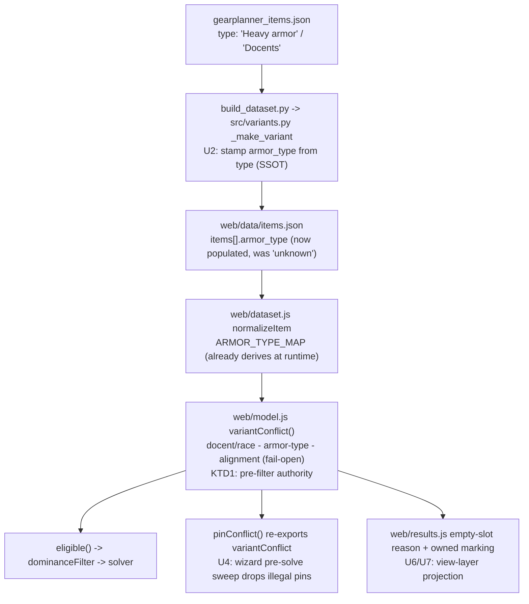

# Correctness Credibility Batch - Plan

## Goal Capsule

- **Objective:** One correctness-focused release that makes a first-time tester trust the results — no unequippable gear, no pointless duplicate picks, no misread recommendations.
- **Product authority:** Owner-directed. Priority lens (correctness & trust), anchor bug (#90 invalid loadouts), batch boundary, and empty-slot behavior were all chosen in this brainstorm.
- **Open blockers:** No blocker stops planning from starting, but the batch's hardest decision is deferred, not eliminated: fixing #90 requires populating armor-class data (the filter already exists but is data-inert), and that tagging overlaps the #93 data-currency work this batch scopes out. Planning must resolve whether to bring armor-class tagging in-scope or narrow R4's reach (see Dependencies / Outstanding Questions) before #90 can actually be fixed.

## Product Contract

### Summary

Fix the three correctness failures that most damage trust in a tool whose pitch is "proven by math": the solver recommends unequippable gear (#90), spends slots stacking a bonus type that can't stack further while lower priorities go unfilled (#91, clear-cut half), and — in owned-inventory mode — presents recommended augments as if the player already owns them (#106). Ship as one credibility batch.

### Problem Frame

The optimizer's entire value proposition is that its answer is *provably* the best legal loadout. Testers hit three failures that break that promise before they ever evaluate the math:

- A first-time tester picks Heavy armor or a Halfling and gets a robe or a docent back — gear the character cannot wear. This reads as "the tool is broken," and the tab closes.
- A theorycrafter ranks four stats, watches the solver slot the same Lore effect four times (two of which add nothing, since only the highest same-named bonus counts), and sees a stat they ranked never appear. The tool looks like it doesn't understand its own stacking rules.
- A player who imported their Trove inventory to solve over "items I have" reasonably assumes everything shown is in their possession — including the augments — and is misled about what they still need to craft.

These are distinct from the deeper accuracy work (bonus-type audit, set over-fitting, data currency), which stays queued. This batch targets the failures that cost trust on first contact.

### Key Decisions

- **Correctness & trust is the lens for this batch** (session-settled: user-directed — chosen over friction/UX, new-capability, and a broad mixed sweep). The batch fixes wrong or misleading results, not UX friction or new reach.
- **#90 (invalid loadouts) is the anchor** (session-settled: user-directed — chosen over the silly/ignored-picks cluster and the wrong-math cluster). Recommending unequippable gear is the most credibility-destroying failure and the most bounded to fix.
- **Empty slots are correct behavior needing explanation, not a bug** (session-settled: user-directed — chosen over "fill anyway, mark it" and "fill silently"). When no item in a slot improves the ranked priorities, leave the slot empty and show an inline note. This reclassifies the "no goggles / no rings" reports filed under #90 out of the solver-fix scope and into the clarity scope.
- **#91 is scoped to the redundant-stacking half, not a priority-coverage guarantee.** Stop spending slots on a same-named bonus type past where it can stack; do not promise that every ranked stat always appears (that is caps/floors, #94, out of scope here).

### Requirements

**Equip legality (#90)**

- R1. No returned loadout may contain a piece the character cannot wear, along the equip dimensions this batch enforces: armor-type proficiency (R2), the docent body-slot race gate (R3), and minimum level (R4). This is a scoped guarantee, not an absolute one. Out of scope for this batch — because the data or the collected inputs don't yet support them: alignment restrictions (no alignment-requirement data source; the model's alignment gate fails open), class and ability-score restrictions (the wizard collects neither), weapon-proficiency restrictions, and race-restricted non-docent items (the general `restrictions` field is data-inert — `"unknown"` on nearly the whole roster, so there is nothing to gate on, mirroring the armor_type gap). R1's guarantee does not extend to those dimensions until their data lands.
- R2. The selected armor type constrains the pool: when the character is set to Heavy (or any specific armor class), the solver must not recommend cloth/incompatible body-slot armor. Docents are the exception, not an instance, of this rule — they are governed by R3 (race), not by the armor-class filter: a construct set to Heavy still receives a docent.
- R3. Docents are recommended only for characters that can equip them (Warforged / Bladeforged); non-construct races never receive a docent in the body slot. R3 takes precedence over R2's armor-class exclusion for construct characters.
- R4. Equip-legality holds across the ML range and body slots, not only at endgame — the failure was reported at low level (ML4–8) and at ML36. The reach of this guarantee depends on the armor-class data decision (see Dependencies / Outstanding Questions): if armor-class tagging is not brought fully in-scope, R4 narrows to the tagged subset of the roster rather than the entire pool. Planning owns that scoping call.
- R4a. A user pin to an item that is illegal for the current character configuration (wrong armor type, docent on a non-construct, etc.) must be rejected or reconciled-to-free **before/at model-build**, so R1's guarantee holds even under pre-solve pinning. Two constraints on this: (1) it must run over a *working* eligibility check — an armor-illegal pin is undetectable until the same `armor_type` data gap blocking R2/R4 is closed, so R4a inherits that blocker and cannot ship ahead of it; (2) extend the eligibility gate at reconciliation time, not the existing post-solve stale-pin reconciliation — that runs a "did the pin land" test, and a forced pin always lands, so it can never catch a forced-in illegal pin.

**Priority efficiency (#91, clear-cut half)**

- R5. The solver must not spend a slot adding a same-named bonus type that cannot raise the effective total, when that slot could instead serve a lower-ranked priority — i.e., no redundant same-type stacking while ranked priorities remain unserved.
- R6. When a lower-ranked priority goes unfilled, it is because no legal slot could serve it without sacrificing a higher priority — never because a higher priority redundantly consumed a slot it did not benefit from.

**Clarity (#106 + empty-slot note)**

- R7. In owned-inventory ("items I have") mode, the results must make clear that assigned augments and crafted options are recommendations sourced from the full game catalog, not items confirmed in the imported inventory. Base items remain constrained to the owned pool.
- R8. When a slot is left empty, the results show an inline note stating the actual reason rather than a silently blank slot. The note must reflect the true cause, not a single generic reason: distinguish "no item here improves your ranked priorities" from — in owned-inventory mode — "you own no item for this slot." (A third cause, "the contributing bonus is already maxed by another slot," is noted in Outstanding Questions; whether R8 must name it separately depends on how "improves" is defined.)

### Acceptance Examples

- AE1. **Covers R2.** **Given** a character configured with Heavy armor, **when** the user solves, **then** no returned item is a robe, outfit, or other non-Heavy body-slot piece.
- AE2. **Covers R3.** **Given** a Halfling with Light armor selected, **when** the user solves, **then** the body slot is a valid Light-armor piece or empty — never a docent.
- AE3. **Covers R1, R4.** **Given** an ML7 Human THF heavy-armor build, **when** the user solves, **then** every recommended piece is equippable by that character at that level.
- AE4. **Covers R5, R6.** **Given** priorities ranked Impulse, Kinetic Lore, Kinetic Intensity, Intelligence, **when** the user solves, **then** Kinetic Lore is not slotted in a way that repeats a same-type bonus adding nothing, and the freed capacity is available to serve Kinetic Intensity where a legal slot exists.
- AE5. **Covers R8.** **Given** a solve where a slot's best available item contributes nothing to the ranked priorities, **when** results render, **then** that slot is empty and carries the "no item here improves your ranked priorities" note.
- AE5a. **Covers R8.** **Given** owned-inventory mode and a slot whose owned pool holds no eligible item, **when** results render, **then** the slot carries the "you own no item for this slot" note, not the generic improvement note. The render-time selection rule: owned-pool-empty → owned note; otherwise → improvement note.
- AE6. **Covers R7.** **Given** a solve run against an imported Trove inventory, **when** results render, **then** augment/craft lines are visibly marked as recommendations from the full catalog, distinct from the owned base item.

### Scope Boundaries

Out of scope for this batch (queued, not rejected):

- #88 — Bonus-type stacking accuracy audit (Insight/Insightful) + manual override UI.
- #92 — Set-bonus over-fitting (a single set presented as the only path to a stat).
- #93 — Data currency (pre-U80 Spell Focus values; items no longer in game).
- #89 — Missing & unscored affixes (rare effects, magnitude-less affixes, synonyms).
- #94 — Stat floors, caps, and cap-awareness. R5/R6 deliberately stop short of this.
- #95, #105 — Input UX and wizard navigation (friction lens, not correctness).
- Raid / event gear tagging & filtering (new-capability lens).

### Deferred to Follow-Up Work

- **Share-export parity for R7/R8.** Carrying the empty-slot note and the owned-vs-recommended augment marking into the Share exports (`web/exporters.js` — MD/CSV/print/BBCode) is deferred. `loadoutRows` iterates only `rec.snapshot.chosen`, so exports emit neither empty slots nor the solver-assigned augment/craft prescriptions today; adding both would require the exporters to iterate the full worn-slot list and recompute the assignment maps. R7/R8 in this batch cover the interactive results view only.

### Dependencies / Assumptions

- The armor-type filter already exists (`web/model.js`) but is **data-inert**: every Armor-slot item in `web/data/items.json` carries `armor_type: "unknown"`, and the filter fails open on `"unknown"`, so it never fires. The real armor class lives in a different field, `type` (`"Heavy armor"`, `"Cloth armor"`, `"Docents"`). The docent gate (R3) already works because it reads `type === "Docents"`. So #90 is not a missing code path — it is a data-population gap: R2/R4 cannot be satisfied until `armor_type` is stamped onto items (or the filter is repointed at `type`). Populating armor-class across the full ML range overlaps the data-currency work (#93) this batch scopes out; planning must decide whether to bring that tagging in-scope or narrow R4's "full ML range / all body slots" guarantee to the tagged subset.
- R5/R6 touch the solver's per-slot lexicographic maximization — the same behavior logged as an algorithm limitation. The fix is expected to be a redundancy guard on same-type contribution, not a redesign of the lexicographic solve.
- Empty-slot rendering (R8) is a results-layer change; it does not alter the solve.

### Outstanding Questions

Deferred to planning:

- Given the armor-type data-inertness (see Dependencies), will R1–R4 be delivered by stamping `armor_type` onto Armor-slot items in `build_dataset.py` from the existing `type` field, or by changing `model.js` eligibility to read `type` directly? And is the armor-class tagging brought in-scope (overlapping #93) or is R4's guarantee narrowed to the tagged subset?
- R5/R6 mechanism is contested — see the review-deferred item in Open Questions below.
- For R8, define "improves the ranked priorities" precisely (standalone contribution vs marginal contribution given the rest of the selection); this determines when the empty-slot note fires and whether it must distinguish a "bonus already maxed elsewhere" cause from a genuine "no item helps" cause.

## Deferred / Open Questions

### From 2026-08-02 review

- R5/R6 redundancy-guard framing may misdiagnose the mechanism (adversarial, confidence 75). The Dependencies note proposes "a redundancy guard on same-type contribution," but the solver already caps each `(stat, bonus_type)` bucket to one contributor (`sum(z) <= 1`) and the deterministic tie-break drops zero-contribution picks — so under a correct lexicographic solve, "redundant same-type stacking while lower priorities remain unserved" is not reachable from the objective/bucket model. Where #91 genuinely manifests, the likely cause is incomplete stacking-equivalence canonicalization (the same display name mapped to different internal `type` values, producing two buckets that both count), which is a bonus-type-equivalence correction adjacent to the out-of-scope #88 audit — not a new redundancy guard. **Resolution (planning):** confirmed against `docs/solutions/design-patterns/lexicographic-redundancy-is-not-a-bug.md` — same-type filler is already dropped by the tie-break and distinct-type stacking is correct output; the only honest lever for "objective-neutral picks" is a per-stat cap, which is #94 (out of scope). See KTD5. R5/R6 is delivered as verification, not a solver change (U5).

---

## Planning Contract

**Product Contract preservation:** unchanged during enrichment. (The Product Contract was refined across two `ce-doc-review` rounds *before* this planning pass — R1–R4a scoping, R2/R3 reconciliation, R8/AE5/AE5a, Dependencies, Outstanding Questions. Those are recorded in the Product Contract above; planning introduced no further product-scope changes.)

### Key Technical Decisions

- KTD1. **Enforce equip-legality as an eligibility pre-filter, never a solver hard constraint.** Add each legality predicate as an ordered block in `variantConflict(v, query, gates)` in `web/model.js` (the authority behind `eligible()`, `pinConflict()`, and the inline B4 flag), dropping ineligible variants *before* `dominanceFilter`. A legality rule expressed as a forcing constraint inside the MILP would trip the conditional-availability dominance trap and the hard-equality feasibility trap. Source: `docs/solutions/design-patterns/milp-encoding-for-gear-optimization.md`.
- KTD2. **Stamp armor-class at build time from the catalog `type` field (single source of truth); do not gate it behind an empty exclude-until-verified seed.** Armor class is intrinsic, cheap, and already in the dataset (`type`: `"Heavy armor"`, `"Docents"`, …). `src/variants.py` `_make_variant` currently hardcodes `armor_type: "unknown"` for Armor items; stamp the class there. **Vocabulary caution:** apply the `web/dataset.js` `ARMOR_TYPE_MAP` lowercase mapping explicitly (`cloth`/`light`/`medium`/`heavy`; Docents left unmapped for the race gate) so the stamped value matches `ARMOR_TYPE_MAP` and the wizard's `query.armorTypes`. Do **not** copy `src/compendium.py` `build_compendium` — it stamps the *raw* capitalized `type` (`"Heavy armor"`) for the browse array, and mirroring it (or `test_compendium.py`'s `"Heavy armor"` assertion) would produce a value the lowercase gate can't match. Exclude-until-verified is reserved for genuinely wiki-sourced restrictions (like `alignment_req`). Source: `docs/solutions/conventions/exclude-until-verified-data-gates.md`, `single-source-of-truth-for-set-definitions.md`.
- KTD3. **#90's runtime gate is closer to live than the requirements assumed — verify before fixing.** `web/dataset.js` `normalizeItem` already re-derives concrete `armor_type` from `type` at load, and the wizard already supplies `query.armorTypes`, so the armor gate is not inert at runtime (only at rest). The plan opens with a characterization unit (U1) to reproduce the reported cases and localize the *actual* residual gap; U2 hardens the data-at-rest parity; U3 closes whatever U1 finds. The stale "armor_type all 'unknown'" comment in `web/model.js` is removed. **Supersedes the Product Contract Dependencies note:** that section is preserved verbatim from the requirements phase and still reads that the filter "fails open … so it never fires" and that "R2/R4 cannot be satisfied until `armor_type` is stamped" — treat KTD3 as the corrected runtime understanding pending U1's characterization; the two are not coequal facts.
- KTD4. **Close the pin-legality hole with a NEW pre-solve reconciliation pass — reconciled against `variantConflict`.** The wizard's *only* existing pin sweep runs **after** `solveLexicographic` and is a post-solve "did it land" test; because a forced pin always lands, that sweep can never catch a forced-in illegal pin — and there is no pre-solve pin sweep to extend today (`candidateItems()` does not drop illegal pins; constraints reach `buildModel` unfiltered). So add a **new** reconciliation pass in `solve()` **before** `buildModel`: iterate `state.slotConstraints` and `removePinFrom` any pinned variant where `pinConflict(v, query)` (which re-exports `variantConflict`) is non-null, freeing the slot rather than letting the solver force `x=1` on an illegal item. Do not reuse the post-solve sweep and do not add a solver constraint (KTD1). Source: `milp-encoding-for-gear-optimization.md` guard #7.
- KTD5. **R5/R6 needs no solver change; the honest lever is a per-stat cap, which is #94 (deferred).** (session-settled: user-directed — chosen over pulling #94 caps into this batch: keeps the batch correctness-scoped.) Same-bonus-type filler is already dropped by the deterministic tie-break; distinct-bonus-type stacking that consumes slots is correct lexicographic output. Do **not** add a "drop objective-neutral picks" tie-break rule — it would demote legitimate distinct-type stacking and break the existing redundancy regression tests. Source: `docs/solutions/design-patterns/lexicographic-redundancy-is-not-a-bug.md`.
- KTD6. **Empty-slot and owned-vs-recommended notes are a pure view-layer projection; owned mode never implies crafting is limited.** Compute the empty-slot reason and the owned/recommended marking in `web/results.js` from the same gate authority. Three constraints: (1) the live paperdoll and the equipped list both render through `equippedRow` — `paperdollSlot` is dead code (no live call site) and must NOT be the edit site; (2) the reason note must **not** fire on a slot the user locked empty — `equippedRow` already renders that state separately; (3) the owned-mode flag and per-slot owned-pool-empty signal are not on `query`/`model` today (`buildQuery` omits `pool`/`ownedNames`), so plumbing them from wizard state through `renderResults`/`buildViews` is a prerequisite step (not a solver change). Owned-inventory mode constrains base items only — augments and crafting always come from the full catalog — so the copy must not imply otherwise.
- KTD7. **Any shared legality helper in `web/*.js` uses `var` or a single `model.js` global, and every browser-affecting change is smoke-tested with a `?v=` bump.** A top-level `const`/`let` shared across classic scripts throws in the browser while all Node tests stay green. Most of this batch extends the existing `variantConflict` rather than adding new globals, but any helper that is added follows the house `global : require("./model.js")` resolver shape. Node green ≠ browser loads. Source: `docs/solutions/conventions/shared-classic-script-globals-use-var-not-const.md`.
- KTD8. **Guard the false-green trap.** Because `armor_type` was inert at rest, the legality branch that reads it was never exercised by a data-backed test. Add fixture-seeded tests that run the *populated* legality path. If any pipeline change installs a module global, snapshot-and-restore it in `build()` and add a leak-regression assertion (the PR #53 boolean-features order-dependent failure). Source: `docs/solutions/conventions/exclude-until-verified-empty-seed-masks-consuming-bugs.md`.

### High-Level Technical Design

Equip-legality has one authority (`variantConflict`) fed by one data path. The batch's job is to make the data path honest at rest and route every consumer (solver filter, pin reconciliation, results note) through that single authority.

### Sequencing

- U1 (verify/localize) precedes U2 and U3.
- U2 (SSOT stamp) and U3 (residual fix) precede U4 (pin legality needs an accurate gate).
- U5 (R5/R6 verification) is independent.
- U6 (empty-slot note) precedes U7 (owned marking) — they share the owned-mode flag threading; both benefit from but are not blocked by U2/U3.

---

## Implementation Units

### U1. Reproduce and localize the residual #90 gap

- **Goal:** Determine whether unequippable-gear recommendations still occur given that `web/dataset.js` already re-derives `armor_type` at runtime and the wizard supplies `query.armorTypes` — and localize the actual residual gap.
- **Requirements:** R1, R2, R3, R4 (Covers AE1, AE2, AE3).
- **Dependencies:** none.
- **Files:** `tests/model.test.js` (add characterization tests), `web/model.js` (read `variantConflict`), `web/dataset.js` (read `normalizeItem` / `ARMOR_TYPE_MAP`), `web/wizard.js` (read `query.armorTypes` wiring).
- **Approach:** Drive `variantConflict`/`eligible` for the reported configs (Heavy human, Halfling light armor, Warforged heavy→docent) with dataset-normalized variants. Confirm whether mismatched body armor and race-illegal docents are excluded. If they are, localize the gap elsewhere: an Armor `type` value outside `ARMOR_TYPE_MAP` (falls open), an Armor item with no `type`, a wizard path that doesn't populate `query.armorTypes`, or a build/data-at-rest consumer. Record the localized cause; it scopes U3.
- **Execution note:** Characterization-first — reproduce the reported behavior before changing any gate logic.
- **Test scenarios:** Covers AE1 — Heavy config, a `cloth`/`light` body item is excluded once `armor_type` is concrete. Covers AE2 — Halfling + docent is excluded by the docent/race gate. Covers AE3 — an ML7 Human heavy build yields only equippable pieces. Edge: an Armor item whose `type` is outside `ARMOR_TYPE_MAP` currently fails open (candidate residual gap — assert current behavior). Confirm the existing `'armor-type filter fails open on "unknown"'` test still describes data-at-rest only.

### U2. Stamp armor-class at build time (SSOT) and remove the stale inertness

- **Goal:** Populate `items[].armor_type` at build from the catalog `type` so data-at-rest matches the runtime derivation; remove the stale "armor_type all 'unknown'" comment.
- **Requirements:** R2, R4 (Covers AE1). Implements KTD2.
- **Dependencies:** U1.
- **Files:** `src/variants.py` (`_make_variant`), `tests/test_variants.py`, `web/model.js` (delete the stale inertness comment), `tests/model.test.js` (populated-path fixture).
- **Approach:** In `_make_variant`, set `armor_type` from the raw `type` using the same normalization as `web/dataset.js` `ARMOR_TYPE_MAP` (lowercase `cloth`/`light`/`medium`/`heavy`; Docents left unmapped for the race gate), mirroring `src/compendium.py` `build_compendium`. `dataset.js` derivation stays (idempotent over the now-correct field). Keep the value vocabulary identical across build stamp, `dataset.js`, and `query.armorTypes`.
- **Execution note:** Guard the false-green trap (KTD8) — add a test that exercises the populated legality path, not just the presence of the field.
- **Test scenarios:** Each raw armor class → correct lowercase `armor_type` on the generated variant (`tests/test_variants.py`, mirroring `tests/test_compendium.py`). Docents → `armor_type` unset (race gate owns it). Covers AE1 — an Armor variant with populated `armor_type` is excluded by `variantConflict` for a mismatched proficiency set (fixture test in `tests/model.test.js`). If `build()` installs any module global for the stamp, snapshot-and-restore it and assert no leak across `build()` calls.

### U3. Close the localized residual #90 gap

- **Goal:** Fix whatever residual equip-legality gap U1 localizes, extending the `variantConflict` pre-filter (never a solver constraint).
- **Requirements:** R1, R2, R3, R4 (Covers AE1, AE2, AE3). Implements KTD1, KTD3.
- **Dependencies:** U1, U2.
- **Files:** `web/model.js` (`variantConflict`), and depending on U1's finding possibly `web/dataset.js` (`ARMOR_TYPE_MAP`) or `web/wizard.js` (`query.armorTypes` wiring).
- **Approach:** Add or extend the ordered legality block in `variantConflict` as the pre-filter seam. If the gap is an unmapped armor `type`, extend the map/stamp (KTD2 vocabulary). Keep every predicate a pool filter (dominance-safe), returning a short human reason string. **If U1 shows the runtime gate already fully handles the reported cases** and the only real gap was data-at-rest parity (closed by U2), record that outcome and reduce this unit to deleting the stale path — do not invent a fix for a bug that no longer reproduces.
- **Test scenarios:** Covers AE1/AE2/AE3 — the reproduced case(s) from U1 are now excluded. Regression: a Heavy-proficient character may still wear lighter armor. Regression: the P2-decoupling test (dodge-cap `query.armorType` does not gate the armor pool) stays green.

### U4. Close the pin-legality hole (R4a)

- **Goal:** Add a new pre-solve reconciliation pass that drops pins illegal for the current character config before the solve, so R1 holds under pinning.
- **Requirements:** R1, R4a. Implements KTD4.
- **Dependencies:** U2, U3 (needs an accurate gate).
- **Files:** `web/wizard.js` (new pre-solve reconciliation in `solve()`, before `buildModel`), `tests/constraints.test.js` (pin-reconciliation coverage).
- **Approach:** The wizard's existing pin sweep runs *after* `solveLexicographic` (a post-solve landed-test) and cannot catch a forced-in illegal pin, and no pre-solve pin sweep exists to extend. Add a new pass in `solve()` **before** `buildModel` that iterates `state.slotConstraints` and calls `removePinFrom` for any pinned variant where `pinConflict(v, query)` (which re-exports `variantConflict`) is non-null; the disclosure surfaces and the solver's forced `x=1` then never sees an illegal pin. Handle the two-ring shared-pin (`variant_ids[]`) path. Do not reuse the post-solve sweep; add no solver constraint (KTD1).
- **Test scenarios:** A pinned illegal item (docent on a Halfling; cloth robe on a Heavy build) is dropped-to-free before the solve, not forced into the result. A pinned legal item is preserved. Two-ring shared-pin: one illegal ring pin is dropped without affecting the legal one. Absent/stale pins still dropped (no regression).

### U5. Verify R5/R6 (no solver change) and record the #94 lever

- **Goal:** Confirm the redundant-stacking behavior is already correct and document that the ignored-priority lever is a per-stat cap (#94, deferred).
- **Requirements:** R5, R6 (Covers AE4). Implements KTD5.
- **Dependencies:** none.
- **Files:** `tests/solver.test.js` (confirm the existing redundancy regression tests, labeled `U6:` in that file, still pass; add a pointer comment referencing KTD5 if useful).
- **Approach:** No solver code change. Verify the two existing regression tests guard both properties (same-type filler dropped; distinct-type stacking preserved). The plan and Product Contract already record that R5/R6 is satisfied by existing behavior and the ignored-priority case is a cap concern (#94).
- **Test expectation:** none new — this unit verifies existing guards stay green; a new test here would duplicate the `U6:` regression tests in `tests/solver.test.js`.

### U6. Empty-slot reason note at the results view (R8)

- **Goal:** Render an inline note on an empty slot stating the true cause, distinguishing (in owned mode) an empty owned pool from a no-improvement result.
- **Requirements:** R8 (Covers AE5, AE5a). Implements KTD6.
- **Dependencies:** benefits from U2/U3; not blocked.
- **Files:** `web/results.js` (`equippedRow` empty branch — the live paperdoll and the equipped list both render through it; `paperdollSlot` is dead code and is NOT edited), `web/wizard.js` (plumb the owned-mode flag + per-slot owned-pool-empty signal — `buildQuery`/`renderResults` do not carry `pool`/`ownedNames` today), `tests/results.test.js`.
- **Approach:** Compute the empty-slot reason as a pure projection at the view layer, with a three-way render-time selection rule: (1) a slot the user locked empty → no reason note (or a distinct "locked by you" note) — `equippedRow` already renders locked-empty separately, so the reason note must not fire there; (2) owned mode AND no eligible owned item for the slot → "you own no item for this slot"; (3) otherwise → "no item here improves your ranked priorities." The owned-mode flag and per-slot owned-pool-empty signal are not on `query`/`model` today, so plumb them from wizard state through `renderResults`/`buildViews` as a small prerequisite step (not a solver change). Do not imply the owned pool limits crafting.
- **Execution note:** View-layer projection only; does not alter the solve.
- **Test scenarios:** Covers AE5 — an optimizer-left-empty slot with no contributing item shows the improvement note. Covers AE5a — owned mode with an empty owned pool for the slot shows the owned note, not the generic one. A user-locked-empty slot shows no improvement/owned note (or the distinct locked note), never a false reason. A filled slot renders no note. The note never states or implies that crafting/augments are limited by the owned pool.

### U7. Owned-vs-recommended augment marking at the results view (R7)

- **Goal:** In owned-inventory mode, mark assigned augments and crafted options as recommendations from the full catalog, visibly distinct from the owned base item.
- **Requirements:** R7 (Covers AE6). Implements KTD6.
- **Dependencies:** U6 (shares the owned-mode flag).
- **Files:** `web/results.js` (`equippedBody`, `craftSlotChips`/`craftChips`), `tests/results.test.js`.
- **Approach:** When owned mode is active, render a per-line "recommended (not owned)" marker on augment/craft lines, distinct from the owned base-item styling; the base item stays presented as owned. Reuse the owned-mode flag threaded in U6.
- **Test scenarios:** Covers AE6 — owned-mode results mark augment/craft lines as recommended while the base item is unmarked. Non-owned mode renders no marker. The marking visibly distinguishes the owned base item from the recommended augment/craft lines.

---

## Verification Contract

| Gate | Command / action | Applies to |
|---|---|---|
| JS unit tests | `node tests/model.test.js tests/solver.test.js tests/results.test.js tests/constraints.test.js tests/exporters.test.js` | U1, U2, U3, U4, U5, U6, U7 |
| Python pipeline tests | `python3 tests/run_tests.py` | U2 |
| Dataset rebuild | `python3 build_dataset.py` then confirm `web/data/items.json` armor items carry concrete `armor_type` | U2 |
| Browser smoke | serve `web/` on localhost, load in Claude-in-Chrome, bump `?v=NN` in `index.html`, confirm the app loads (no `const`-redeclare crash) and an equip-illegal config returns no illegal gear | U3, U4, U6, U7 (KTD7) |

Node-green is necessary but not sufficient — KTD7 requires a real browser smoke pass for any `web/*.js` change.

---

## Definition of Done

- Every Acceptance Example (AE1–AE6, AE5a) is covered by a passing test as traced in the units.
- U1's localized cause is recorded; U3 either fixes it or documents that #90 no longer reproduces at runtime (with U2 closing data-at-rest parity).
- The existing redundancy regression tests (`U6:` in `tests/solver.test.js`) stay green; no "drop-neutral-picks" tie-break rule was added.
- A fixture-seeded test exercises the populated `armor_type` legality path; any new pipeline global is snapshot-restored with a leak-regression assertion.
- The stale "armor_type all 'unknown'" comment is removed from `web/model.js`.
- Browser smoke passes with a bumped `?v=` cache-bust; the app loads and an equip-illegal configuration (and an illegal pin) returns no unequippable gear.
- No new absolute paths; no solver hard-constraint added for legality (equip-legality stays a pre-filter).
