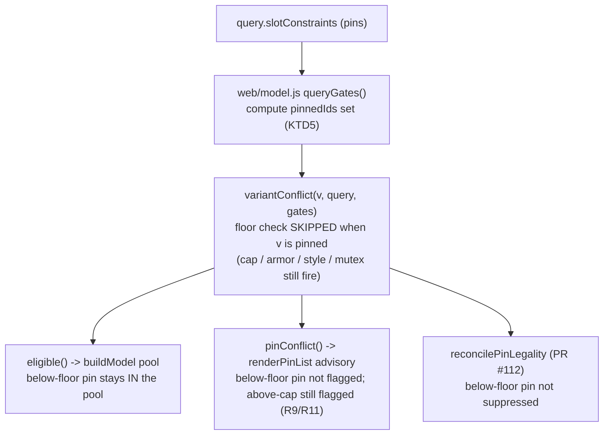

# Weapon/Off-Hand and Pinning Batch - Plan

## Goal Capsule

- **Objective:** Close the weapon/off-hand equip-legality gaps and add a sword-and-board style, so a tank's pinned shield stops pulling a two-handed weapon, a player can declare a sword-and-board build (one-handed main + shield off-hand), and a pinned item isn't silently dropped for being below the level floor.
- **Product authority:** Owner-directed. Batch boundary (all three together), the pin-vs-ML precedence, the above-cap exception, shields-only S&B, and the universal mutex were all chosen in this brainstorm.
- **Open blockers:** None block planning. The untyped Dino-host edge is resolved (treated as two-handed for the mutex — KTD3); one edge remains deferred to planning: whether selecting S&B suppresses vs. clears a pinned two-handed weapon (see Outstanding Questions).

## Product Contract

### Summary

Three fixes on the weapon/off-hand + pinning surface, shipped together. Add a **hand mutex** so a two-handed main-hand weapon and any off-hand item are mutually exclusive (#107). Add a **Sword & Board** combat style — one-handed main + shield off-hand — reusing the existing style and off-hand-type pickers (#111). Make an explicit **pin override the soft ML floor** while still respecting the hard ML cap (#108).

### Problem Frame

Off-hand blocking today is keyed on the chosen *combat style*, not on the weapon that actually lands in the main hand. So a player building a tank pins a shield to the off hand, selects no style, and the solver independently drops a quarterstaff into the main hand — a physically impossible loadout. There is no rule tying main-hand handedness to off-hand occupancy.

There is also no way to say "I'm a sword-and-board build": the closest is the one-hand style with a manually narrowed off-hand, which doesn't restrict the main hand to one-handed weapons or the off-hand to shields.

Separately, a pinned item can vanish for the wrong reason. The optimizer hides gear below an ML *floor* (a convenience filter defaulting to `cap − 4`), and that filter currently suppresses an explicitly pinned below-floor item — overriding the user's deliberate choice. A pin should beat the floor; the only ML case a pin can't beat is the *cap*, because an above-level item is genuinely unequippable (the equip-legality guarantee from the just-shipped correctness batch, PR #112).

### Key Decisions

- **All three ship as one batch** (session-settled: user-directed — chosen over splitting the S&B feature from the two bugs). They share the equip-legality/pinning surface.
- **A pin wins over ML for all legal cases** (session-settled: user-directed — chosen over the floor or cap winning). An explicit pin is honored below the floor and below the cap.
- **An above-cap pin is the exception** (session-settled: user-directed — chosen over honoring even above-cap, and over auto-raising the cap to fit). An above-cap item is unequippable, so it stays a conflicting pin rather than being forced in — preserving PR #112's equip-legality.
- **S&B off-hand is shields only** (session-settled: user-directed — chosen over including Orbs and Rune Arms). Orbs (caster) and rune arms (artificer) aren't "board"; a separate style could cover them later.
- **The hand mutex is universal** (session-settled: user-directed — chosen over enforcing it only under a selected style). The #107 repro had a pinned shield and no style, so the mutex must hold regardless of style.
- **Unclassifiable main-hand handedness is treated as two-handed for the mutex** (resolved during review — chosen over failing open). The untyped Dino Bone weapon host can be crafted two-handed, so failing open would let it coexist with an off-hand item and reproduce #107; the conservative default forces the off hand empty.

### Requirements

**Hand mutex (#107)**

- R1. A two-handed main-hand weapon and any off-hand item are mutually exclusive — the solver never equips both in one loadout.
- R2. The mutex holds regardless of whether a combat style is selected. Pinning an off-hand item (e.g., a shield) forces a one-handed (or empty) main hand; pinning a two-handed main-hand weapon forces the off hand empty.
- R3. Inherently two-handed main-hand weapons (great weapons, quarterstaves, bows) are all covered — including the no-style case the style-keyed gate misses today. A main-hand weapon whose handedness can't be classified (the untyped Dino Bone weapon host, which can be crafted two-handed) is treated **conservatively as two-handed** for the mutex — it forces the off hand empty — because failing open would reproduce #107 for that item.

**Sword & Board (#111)**

- R4. A "Sword & Board" combat style is selectable alongside the existing styles.
- R5. Under S&B, the main hand is restricted to one-handed weapons and the off hand to shields (Buckler, Small, Large, Tower); Orbs and Rune Arms are excluded.
- R6. Under S&B, the user can narrow the shield type with the existing off-hand-type picker, or leave it open for any shield.
- R7. S&B is consistent with the hand mutex (R1): a two-handed weapon is never offered for the main hand under S&B.

**Pin vs ML (#108)**

- R8. An explicit pin overrides the `mlFloor` ("hide low-ML gear") filter: a pinned item below the floor is honored, never silently dropped or replaced.
- R9. A pin does not override the ML cap: a pinned item above the character's ML cap stays invalid (unequippable) and is surfaced as a conflicting pin, not forced into the loadout.
- R10. Pins continue to honor every other equip-legality dimension — armor type, race/docent, combat style, and the new hand mutex; only the soft `mlFloor` filter is overridden.

**Pin conflict surfacing (generalizes #108/#107/#111)**

- R11. Any pin invalidated for an equip-legality reason — an above-cap ML (R9), the hand mutex, an incompatible combat style (e.g., a two-handed weapon or an orb pinned when Sword & Board is selected), armor type, or race — surfaces a conflicting-pin indicator that names the reason, reusing the existing pin-list advisory (PR #112), rather than being silently dropped. This generalizes R9's above-cap surfacing to every invalidation cause.
- R12. When two pinned items are mutually exclusive under the hand mutex (a two-handed main-hand weapon and an off-hand item both pinned), the solver does not force an illegal combination: it surfaces the conflict (both pins flagged) and solves without equipping the impossible pair, so the user chooses which to keep. Which pin the UI visually prefers is a planning/UX detail.

### Acceptance Examples

- AE1. **Covers R1, R2.** **Given** a shield pinned to the off hand and no combat style, **when** the user solves, **then** the main hand is a one-handed weapon or empty — never a two-handed weapon.
- AE2. **Covers R1, R2.** **Given** a two-handed weapon pinned to the main hand, **when** the user solves, **then** the off hand is empty.
- AE3. **Covers R5, R7.** **Given** the Sword & Board style, **when** the user solves, **then** the off hand is a shield (Buckler/Small/Large/Tower), never an Orb or Rune Arm, and the main hand is one-handed.
- AE4. **Covers R6.** **Given** S&B with "Tower shields" chosen in the off-hand picker, **when** the user solves, **then** the off hand is a Tower shield.
- AE5. **Covers R8.** **Given** an ML30 cap with the default floor (ML26) and a pinned ML20 item, **when** the user solves, **then** the ML20 item is equipped — the pin overrides the floor.
- AE6. **Covers R9.** **Given** an ML20 cap and a pinned ML30 item, **when** the user solves, **then** the ML30 item is not equipped and shows as a conflicting pin.
- AE7. **Covers R1, R2, R3.** **Given** no pins and no combat style, **when** the best main-hand weapon is two-handed, **then** the off hand is empty — the solver weighs (two-handed main, empty off hand) against (one-handed main + off-hand item), and a loadout that previously scored a two-handed main *alongside* an off-hand item no longer appears.
- AE8. **Covers R8, R10.** **Given** a pinned item below the ML floor that is *also* the wrong armor type for the character, **when** the user solves, **then** it is not equipped — the floor is overridden for the pin, but the armor-type legality still excludes it (only the floor is overridden, not other legality).
- AE9. **Covers R3.** **Given** an untyped Dino Bone weapon host in the main hand and an off-hand item available, **when** the user solves, **then** they do not coexist — the host is treated as two-handed, so the off hand is empty.
- AE10. **Covers R11, R12.** **Given** a two-handed weapon *and* an off-hand shield both pinned, **when** the user solves, **then** the mutually-exclusive pair is surfaced as a conflicting pin and neither is forced into an illegal loadout.

### Scope Boundaries

Out of scope for this batch:

- The pinning-correctness work already shipped in PR #112 (illegal-pin suppression, transient-config pin erasure) — done.
- Shield stat modeling (shield bonus, DR, shield-specific affixes) beyond equip-legality — this batch is constraints + style, not shield scoring.
- Orb/rune-arm combat styles (caster/artificer off-hands) — S&B is shields-only; a separate style can cover those later.
- Two-weapon-fighting changes — TWF already exists under the one-hand style.

### Dependencies / Assumptions

- The hand mutex must be a **solve-time constraint** that couples the Main Hand and Off Hand picks, mirroring the existing same-item `handVars` mutex in `web/solver.js` and reading the main-hand weapon's handedness (the two-handed set in `web/weapon-taxonomy.js`). A pre-solve pool-filter alone is **insufficient** for the unpinned/no-style case (#107's motivating repro), because whether the main hand is two-handed is chosen at solve time — a pool filter can only tighten a hand once the *other* hand is already pinned. Off-hand-gate pool-filtering is a valid optimization when a hand is pinned, not the whole mechanism.
- S&B extends the taxonomy `STYLES` and the per-style off-hand-type mapping (which currently special-cases only crossbow), plus the existing wizard style/off-hand pickers — no new UI primitive; shields already exist as off-hand types.
- #108: the below-floor drop happens at **pool build**, not just in the pin path. `buildModel` filters candidates through `eligible()` → `variantConflict`, and `variantConflict` returns only the *first* failing reason, checking the `mlFloor` ("below your ML floor") *before* armor/style/off-hand/hand-mutex; the pin-exemption only protects items already inside `dominanceFilter`, downstream of `eligible()`, and the solver emits nothing for a pinned id absent from the pool. So the fix must exempt the floor **at the gate level for pinned variants** — skip the floor check for pins so a pinned below-floor item stays in the pool, while the *next* real reason still surfaces (R10) — and that exemption must be threaded through the pool-build path (`eligible`/`queryGates`), not applied only in `reconcilePinLegality` and not by string-matching the reason after the fact.

### Outstanding Questions

Deferred to planning:

- When a user selects S&B while a two-handed weapon (or an orb/rune-arm) is pinned, does the pin get suppressed for the solve (consistent with PR #112's copy-based reconciliation and R11's surface-don't-erase) or actively cleared from state? Leaning suppress-and-surface: keep the pin in state, drop it only from the solve copy, and flag it via R11 so switching away from S&B restores it.
- A below-floor *pinned* item will appear in results while equally-low *unpinned* items stay hidden by the floor filter (intended per R8). Confirm the results UI presents this asymmetry without implying the floor filter is broken (e.g., a subtle "pinned" cue on the below-floor row).
- (Resolved this review: the untyped Dino weapon host is treated conservatively as two-handed for the mutex — see R3 and Key Decisions.)

---

## Planning Contract

**Product Contract preservation:** unchanged during enrichment. (The Product Contract was refined during a `ce-doc-review` pass before this planning run — R11/R12 added, R3/AEs extended, the Dependencies seams corrected; those are recorded above. Planning introduced no further product-scope changes.)

### Key Technical Decisions

- KTD1. **The hand mutex is a solve-time inequality, reusing the existing `handVars`/`extraConstraints` seam.** Emit `Σ(both-hands Main-Hand pick vars) + Σ(Off-Hand pick vars) ≤ 1` in `web/solver.js`'s program builder, next to the existing same-item TWF hand-mutex. **"Both-hands" is defined by off-hand enablement, not the THF bucket alone:** a main-hand weapon is in the mutex sum when `!offHandEnabledForStyle(styleOfType(v.type))` — this covers two-handed melee (THF), **bows (RANGED)**, and the unclassifiable Dino host (`styleOfType(undefined)`) in one predicate, while correctly *excluding* crossbows (whose rune-arm off-hand is legal) and one-handed/unarmed. Basing it on `=== THF` alone would miss bows and reproduce #107 for that class (R3/AE7). An inequality (not the Artifact-style `= 1`) is always satisfiable (both zero), so it needs no emission-time feasibility guard and avoids the hard-equality infeasibility trap. `web/solver.js` does not currently import `web/weapon-taxonomy.js`, so U1 adds the same cross-runtime resolve it uses for `model.js` helpers. Instantiates the settled "hand-mutex is universal, as a solve-time constraint" decision. Source: `docs/solutions/design-patterns/milp-encoding-for-gear-optimization.md`.
- KTD2. **The mutex is a mutual exclusion, so the Dominance pre-filter's third soundness obligation fires — this is the load-bearing part of U1, not the constraint itself.** A both-hands main-hand weapon (per KTD1's predicate) becomes *conditionally available* (forced off when an off-hand is equipped), so it must be (a) exempted from being pruned and (b) barred from pruning a one-handed peer it merely dominates — otherwise an affix-strong two-hander silently prunes a viable 1H that is the true best main-hand once an off-hand is taken. Extend `dominanceFilter`'s conditional-availability handling, reusing the existing `pinnedIds`/`includeArtifact` exemption seam, and apply the *same* off-hand-enablement predicate as KTD1. Pruning defects are invisible to unit tests that start downstream of the prune, so a dominance regression + an end-to-end real-HiGHS solve are mandatory. Source: same doc + the `Dominance pre-filter` entry in `CONCEPTS.md`.
- KTD3. **An unclassifiable main-hand weapon is treated as two-handed for the mutex** (session-settled: user-directed — chosen over failing open). This falls out of KTD1's predicate for free: `styleOfType(null)` is `undefined`, and `offHandEnabledForStyle(undefined)` is false, so the untyped Dino Bone weapon host (which can be crafted two-handed) is in the mutex sum and forces the off hand empty — failing open would reproduce #107 for that item.
- KTD4. **Sword & Board threads through the four per-style helpers in `web/weapon-taxonomy.js`; the shields-only off-hand is a fail-open restriction, not a forcing constraint.** Add `sword-board` to `STYLES` and thread it through `weaponTypesForStyle` (one-handed bucket), `offHandEnabledForStyle` (true), `offHandTypesForStyle` (the four shield types), and `twfWeaponAllowedForStyle` (false); the wizard's existing style + off-hand pickers consume these with no new UI primitive. A *known* non-shield off-hand type (Orb, Rune Arm) is excluded (R5); the fail-open direction applies only to an *unstamped/unclassifiable* off-hand type, which stays eligible rather than being wrongly dropped. No dominance obligation (it's a pool restriction, not a mutual exclusion). Sources: `exclude-until-verified-data-gates.md`.
- KTD5. **The floor exemption is a single pinned-id-aware floor-skip inside `variantConflict`, fed by a pin set computed in `queryGates`.** Skip *only* the `mlFloor` reason (not the cap, armor, style, or mutex) when a variant is pinned, so pool-build (`eligible`), the pin-list advisory (`pinConflict`), and pre-solve reconciliation (`reconcilePinLegality`) all honor a below-floor pin consistently. This introduces a *third* pin state alongside PR #112's model: *gone-from-catalog* (pruned), *transiently illegal* (suppressed), and now *legal-but-below-floor* (honored via bypass — never suppressed, never dropped by the post-solve "didn't land" sweep). Source: `docs/solutions/design-patterns/suppress-dont-erase-user-constraints-on-transient-invalidity.md`.
- KTD6. **R11 is largely existing behavior; the new advisory work is R12's dual-pin aggregate warning.** `renderPinList` already surfaces `pinConflict` (the first failing `variantConflict` reason) for *every* pin, so above-cap, S&B-incompatible, armor, and race causes already badge (R11). R12's mutex conflict is a *combination* — a 2H main and an off-hand each pass per-item legality — so it needs an aggregate pin-list warning that detects the pinned pair, mirroring the existing Artifact-count warning (`wz-pin-artwarn`); it flags both and forces neither (session-settled dual-pin behavior).
- KTD7. **Any shared top-level helper added to `web/*.js` uses `var` or a once-declared `function`, and every browser-affecting change is smoke-tested with a `?v=` bump and cleared session storage.** A shared top-level `const`/`let` crashes the browser at parse time while the node suite stays green (per PR #86). Source: `docs/solutions/conventions/shared-classic-script-globals-use-var-not-const.md`.

### High-Level Technical Design

The #108 floor exemption is a single seam feeding three consumers — getting it right in `variantConflict` keeps them consistent:

The #107 mutex is a solver constraint plus a dominance re-audit (KTD1/KTD2): `Σ(2H main vars) + Σ(off-hand vars) ≤ 1` emitted in `solver.js`, and `dominanceFilter` extended so a mutex-affected 2H main is exempt from pruning and from pruning its 1H peers.

### Sequencing

- U1 (hand mutex + dominance re-audit) is first — the riskiest, and U2/U4 depend on it.
- U2 (Sword & Board) depends on U1 (the mutex is what keeps a 2H off the main hand under S&B).
- U3 (floor exemption) is independent of U1/U2 and can land in any order.
- U4 (pin-conflict advisory) depends on U1 (the mutex defines the dual-pin conflict).
- The two correctness fixes (U1, U3) do not depend on S&B (U2); they form a shippable correctness increment if the feature is decoupled later, but this plan ships all four together (session-settled).

---

## Implementation Units

### U1. Hand mutex — solve-time constraint + dominance re-audit

- **Goal:** A two-handed main-hand weapon and any off-hand item are mutually exclusive in the solve, without a strong 2H weapon wrongly pruning a viable 1H peer.
- **Requirements:** R1, R2, R3 (Covers AE1, AE2, AE7, AE9). Implements KTD1, KTD2, KTD3.
- **Dependencies:** none.
- **Files:** `web/solver.js` (emit the mutex in the program builder, next to the `handVars` TWF mutex), `web/model.js` (`dominanceFilter` conditional-availability exemption for mutex-affected main-hand weapons), `web/weapon-taxonomy.js` (reuse `styleOfType`/`THF`), `tests/constraints.test.js` (body emission), `tests/solver.test.js` (end-to-end + dominance regression).
- **Approach:** In the program builder, collect the pick-var names of Main-Hand candidates that occupy both hands — `v.category === "weapon" && !offHandEnabledForStyle(styleOfType(v.type))` (KTD1: covers THF melee, bows, and the unclassifiable Dino host; excludes crossbows and one-handed) — plus all Off-Hand pick vars, and push `<those> ≤ 1` into `extraConstraints`. Add the cross-runtime taxonomy resolve to `web/solver.js` (it doesn't import `weapon-taxonomy.js` today). Then extend `dominanceFilter` so a both-hands main-hand weapon (same predicate) is kept through the filter and cannot prune a 1H peer it dominates (KTD2), reusing the `pinnedIds`/`includeArtifact` exemption seam.
- **Execution note:** Regression-first — write the dominance regression (a strong two-hander must not prune a viable 1H when the mutex can force it off) and an end-to-end real-HiGHS solve *before* the constraint; pruning defects are invisible to a hand-built-model unit test.
- **Test scenarios:** Body emission (`constraints.test.js`) — synthetic xVars with a two-handed Main Hand + an Off Hand emit a `<2H var> + <off var> <= 1` body; a one-handed Main Hand + Off Hand emit no such coupling. End-to-end (`solver.test.js`) — Covers AE2: a 2H main + a shield can't co-occur; **a bow main + an off-hand item can't co-occur** (bows are both-hands via RANGED, not THF); a crossbow main + a rune-arm off-hand *is* allowed (crossbow off-hand is legal); Covers AE1/AE7: a 1H main + shield can, and with no pins/style the solve weighs (2H main, empty off) vs (1H main + off-hand). Dominance regression: an affix-strong two-hander does not prune a viable 1H in the main-hand pool. Covers AE9: an untyped Dino main-hand host forces the off hand empty.

### U2. Sword & Board combat style

- **Goal:** A selectable "Sword & Board" style restricting the main hand to one-handed weapons and the off hand to shields.
- **Requirements:** R4, R5, R6, R7 (Covers AE3, AE4). Implements KTD4.
- **Dependencies:** U1.
- **Files:** `web/weapon-taxonomy.js` (`STYLES` + the four per-style helpers), `web/wizard.js` (the style picker already renders `STYLES` and resets sub-picks on select — verify S&B flows through), `tests/weapon-taxonomy.test.js`, `tests/model.test.js`, `tests/wizard.test.js`.
- **Approach:** Add `{ id: "sword-board", label: "Sword & Board" }` to `STYLES`; thread it through `weaponTypesForStyle` (the one-handed `STYLE_OF_TYPE === ONE` bucket), `offHandEnabledForStyle` → true, `offHandTypesForStyle` → `["Bucklers", "Small shields", "Large shields", "Tower shields"]`, `twfWeaponAllowedForStyle` → false. `model.js`'s `allowedWeaponTypes`/`allowedOffHandWeaponTypes`/`offHandGate` consume these via `_taxonomy()`. Known non-shield off-hand types (Orbs, Rune Arms) are excluded under S&B; only an unstamped/unclassifiable off-hand type stays eligible (fail-open). Any shared helper uses `var`/`function` (KTD7).
- **Test scenarios:** `weapon-taxonomy.test.js` — `offHandTypesForStyle("sword-board")` is the four shield types; `weaponTypesForStyle` is the 1H bucket; `twfWeaponAllowedForStyle` false; `offHandEnabledForStyle` true. `model.test.js` — Covers AE3: under an S&B query an Orb and a Rune Arm off-hand are excluded, a Tower shield kept, and a two-handed main excluded; Covers AE4: with "Tower shields" narrowed, only tower shields remain in the off-hand pool. `wizard.test.js` — `buildQuery` with `style: "sword-board"` emits the shields-only off-hand set; selecting S&B resets `weaponTypes`/`offHand`/`offHandWeapons`.

### U3. Pins override the ML floor at the pool-build gate

- **Goal:** A pinned item below the ML floor is honored (kept in the pool and equipped), while every other legality dimension — including the ML cap — still applies to pins.
- **Requirements:** R8, R9, R10 (Covers AE5, AE6, AE8). Implements KTD5.
- **Dependencies:** none.
- **Files:** `web/model.js` (`queryGates` computes the pinned-id set; `variantConflict` skips only the floor check for pinned variants; confirm `eligible`/`buildModel` consume it — build `pinnedIds` before `eligible`), `tests/model.test.js`.
- **Approach:** In `queryGates(query)`, compute a pinned-id set from `query.slotConstraints` (via `pinnedVariantIds`), and in `variantConflict` gate *only* the `mlFloor` line on "variant not pinned." Because this lives in `variantConflict`, the pool-build gate (`eligible`), the advisory (`pinConflict`), and pre-solve reconciliation (`reconcilePinLegality`) all honor the below-floor pin consistently. The cap check (`v.ml > cap`) is *not* exempted, so an above-cap pin still fails (R9). Do not mutate `state.slotConstraints`. The pinned-id set comes from `pinnedVariantIds` (`variant_id` / `variant_ids`), so the floor-skip must match on the same stable id the pin uses — confirm every variant reaching `variantConflict` carries a `variant_id`, or the skip silently no-ops for an id-less variant.
- **Execution note:** Characterization-first — drive a build-shaped below-floor item through `normalizeDataset` → `eligible` and confirm it is dropped *today*, then add the pinned-id exemption and assert the pin now survives.
- **Test scenarios:** Covers AE5 — a pinned below-floor item is eligible (in the pool); an *unpinned* below-floor item is still filtered (the floor still hides non-pins). Covers AE8 — a pinned below-floor item that is *also* the wrong armor type is still excluded (only the floor is exempt). Covers AE6 — an above-cap pin is still flagged/excluded (the cap is not exempt). A pinned at-floor item (ml == floor) is unaffected (strict `<` boundary).

### U4. Pin-conflict advisory: dual-pin aggregate + R11 coverage

- **Goal:** Surface a pin invalidated for any reason (R11) and warn when two mutually-exclusive items are pinned (R12).
- **Requirements:** R11, R12 (Covers AE10). Implements KTD6.
- **Dependencies:** U1.
- **Files:** `web/wizard.js` (`renderPinList` — verify the per-pin `pinConflict` badge covers the new causes; add an aggregate dual-pin warning mirroring `wz-pin-artwarn`), `tests/wizard.test.js`.
- **Approach:** R11 is largely existing — `renderPinList` already renders `pinConflict(it, query)` for each pin (naming the first failing reason: above-cap, S&B-incompatible weapon/orb, armor). Verify it fires for the new causes and, where useful, that the reason reads clearly. R12: because the mutex is a solve-time constraint, a pinned 2H main and a pinned off-hand each pass per-item `pinConflict`, so add an aggregate check in `renderPinList` (mirroring the Artifact-count warning) that detects a pinned two-handed main-hand weapon together with a pinned off-hand item and warns that the pair is unequippable — flag both, force neither. Any shared helper uses `var`/`function` (KTD7).
- **Test scenarios:** Covers AE10 — with a two-handed weapon and an off-hand shield both pinned, `renderPinList` shows the aggregate mutual-exclusion warning; with only one of them pinned, it does not. The per-pin badge shows the reason for an above-cap pin and for an S&B-incompatible pin (R11).

---

## Verification Contract

| Gate | Command / action | Applies to |
|---|---|---|
| JS unit tests | `node tests/solver.test.js tests/model.test.js tests/constraints.test.js tests/weapon-taxonomy.test.js tests/wizard.test.js` | U1, U2, U3, U4 |
| Dominance regression + end-to-end | Within `tests/solver.test.js`: a mutex-affected 2H must not prune a viable 1H, and a real-HiGHS solve enforces the mutex | U1 (KTD2) |
| Full regression | `python3 tests/run_tests.py` and the remaining `node tests/*.test.js` | all (no `src/` pipeline change expected; guard against regressions) |
| Browser smoke | serve `web/` on localhost, bump `?v=NN` in `index.html`, clear the wizard's session storage, load in Claude-in-Chrome; confirm no `const`-redeclare crash, the Sword & Board style appears and restricts to shields, an equip-illegal config (2H + shield) returns a legal loadout, and a below-floor pin appears in results without implying the floor filter is broken | U1, U2, U3, U4 (KTD7) |

Node-green is necessary but not sufficient — KTD2 requires the end-to-end dominance check, and KTD7 requires the real browser smoke.

---

## Definition of Done

- Every Acceptance Example (AE1–AE10) is covered by a passing test as traced in the units.
- The dominance regression is green — an affix-strong two-handed weapon does not prune a viable one-handed peer — and a real-HiGHS end-to-end solve enforces the mutex (KTD2).
- Sword & Board is selectable, restricts the main hand to one-handed weapons and the off hand to the four shield types, and excludes Orbs/Rune Arms; an unstamped off-hand type stays eligible (fail-open).
- A pinned below-floor item is equipped; an unpinned below-floor item stays hidden; a pinned above-cap item is still flagged and not forced; a pinned below-floor item that violates another dimension is still excluded.
- The dual-pin mutex conflict surfaces an aggregate warning; the per-pin advisory names the cause for above-cap and style-incompatible pins.
- Browser smoke passes with a bumped `?v=` (no `const` crash), cleared session storage, the new style visible, and no unequippable 2H + off-hand result.
- No new absolute paths; the mutex is a solve-time constraint (not a legality pool-filter); shared helpers use `var`/`function`.
