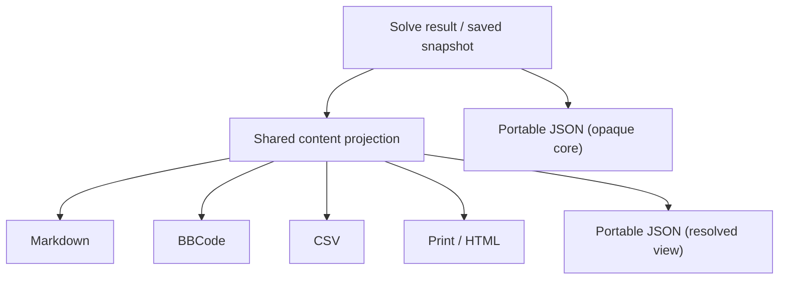

# Universal Exports + Round-Trip-Ready Portable Format - Plan

## Goal Capsule

- **Objective:** Make every loadout export render the same rich content from one shared projection, add visual cues (augment colors, Lunar/Solar, crafting) and a stat-attribution section, and ship a new versioned portable JSON export designed to be re-imported and compared later.
- **Product authority:** Project owner (this brainstorm).
- **Open blockers:** None. Import reader and compare/diff view are explicitly out of scope for this effort and are enabled — not built — here.

## Product Contract

### Summary

The four text exports (`toMarkdown`, `toBBCode`, `toCsv`, `toPrintHtml` in `web/exporters.js`) currently render a thin, drifted subset of a build: slot + item + worn affixes + augment slot *colors*, plus partial set bonuses. This effort makes all outputs render one **universal content model** — each equipped item's worn affixes, its *assigned* augments (with color and Lunar/Solar cues), and its crafting upgrades; the completed set bonuses and their granted affixes; and a **stat-attribution section** that traces each priority stat back to the item/set/augment/craft sources that build it. It also adds a fifth output: a versioned **portable JSON** (`ddo-loadout/v1`) built to round-trip back into the app later.

### Problem Frame

The share exporters were built (U12/U13) as a quick forum-and-spreadsheet convenience and have drifted apart in content and shape. They surface far less than the app already knows: the assigned augment-to-item reconstruction, the crafting prescriptions (Viktranium, seals, Dino inserts, Nearly Completed, set-membership), and the per-stat source attribution all live in `web/results.js` and are unreachable from the Node-testable `web/exporters.js`. So a shared loadout reads as a flat gear list with no craft steps, no augment placement, and no "why these numbers" — the exact information a reader needs to actually rebuild or evaluate the loadout. Separately, an exported loadout is a dead end: there is no representation stable enough to bring back in and compare against another build.

### Key Decisions

- **Portable JSON is the sole round-trip/compare vehicle.** (session-settled: user-directed — chosen over embedding structured data inside the human formats, and over reusing the save/backup format.) The four text formats stay presentation-only (read-only); only the portable JSON is designed to be re-imported.
- **Ship the portable format now; defer the import reader and compare/diff view.** (session-settled: user-directed — chosen over building import round-trip now, and over building the full compare view now.) The portable format is the forward-thinking enabler.
- **Portable shape = proven core + stable resolved view.** (session-settled: user-approved — chosen over a versioned save-snapshot alone, and over a clean public schema alone.) A versioned envelope carries an opaque `core` (the existing save-snapshot, which already round-trips via `web/backup.js`) plus a `resolved` view (the shared content projection). Round-trip rides on the already-proven snapshot, so the schema cannot be "unproven"; compare-later diffs the stable `resolved` view.
- **One shared content projection feeds all five outputs.** The augment-assignment, craft-mapping, and per-stat attribution logic in `web/results.js` is factored into a projection module that both `web/results.js` and `web/exporters.js` consume, so content parity is structural rather than hand-maintained. Node-testability of `web/exporters.js` is preserved.
- **Cue vocabulary is emoji + word, with a printed legend.** (session-settled: user-directed — chosen over emoji-only, and over text-labels-only.) Every cue is a glyph and its word (`🔴 Red`, `🌙 Lunar`, `☀️ Solar`, `⚒️ Viktranium`). BBCode additionally wraps the word in real `[color]`; print/HTML may use real color via CSS. Content is identical across formats; only cue rendering adapts.
- **Stat-attribution covers priority stats only.** (session-settled: user-directed — chosen over every-stat coverage, and over priorities-plus-all-stats-rollup.) It mirrors the in-app Ranked Priorities view.



### Requirements

**Shared content model**

- R1. A single content projection derives, from a solve result or saved snapshot, the universal content model: character/constraints header, per-slot loadout (item, ML, worn affixes, assigned augments, crafting upgrades), completed set bonuses with granted affixes, and priority-stat attribution.
- R2. All five outputs render from this one projection so their content is identical; only presentation and cue rendering differ per format.
- R3. The projection reuses the existing app reconstruction logic (augment-to-item assignment, craft mapping, per-target attribution) rather than reimplementing it, and `web/exporters.js` remains loadable and testable under Node.

**Per-item content**

- R4. Each equipped item shows its worn affixes, its assigned augments (not just slot colors), and its crafting upgrades (Viktranium, seals, Dino inserts, Nearly Completed, set-membership).
- R5. Each augment carries a color cue and, where applicable, a Lunar or Solar cue. Each crafting upgrade carries a craft cue and names the crafting system.

**Set bonuses**

- R6. Every set the build completes is listed with its piece count and the affixes it grants, including runtime-completed (joker/membership) sets.

**Stat attribution**

- R7. A stat-focused section lists each ranked priority stat with its achieved total and, when clamped, its cap; and attributes that total to its contributing sources (item / set / augment / craft) with each source's value and bonus type.
- R8. Attribution respects DDO bonus-type stacking (only the highest same-named type counts; different types add) and matches the in-app Ranked Priorities for the same build.

**Visual cues**

- R9. Cues render as emoji plus word in every format; a legend is printed once per document. BBCode additionally wraps the cue word in real `[color]`; print/HTML may use real color.

**Portable format**

- R10. A portable JSON export is added: a versioned envelope (`ddo-loadout/v1`) containing an opaque `core` (the current save-snapshot shape) and a `resolved` view (the shared content projection).
- R11. The `core` is the same shape `web/backup.js` restores today, so a future import reader can round-trip a build verbatim without a new persistence path.
- R12. User-derived text (character/item/affix names) stays escaped/neutralized in every format, preserving today's protections: HTML/markdown-metacharacter escaping, CSV formula-injection neutralization, and BBCode tag stripping — extended to the new cue and attribution content.

### Acceptance Examples

- AE1. **Covers R4, R5, R9.** A build with a Red-slot Deadly augment, a Lunar Insightful-Con augment, and a Viktranium craft on one item: every format shows that item with all three worn/augment/craft lines, each cued (`🔴 Red`, `🌙 Lunar`, `⚒️ Viktranium`), and the BBCode output additionally colors the cue words.
- AE2. **Covers R7, R8.** A priority stat whose total comes from an augment, a worn affix of a different bonus type, and a 5-piece set: the stat section shows the total and one attributed line per source with its value and bonus type, and the total equals the in-app Ranked Priorities value for that build.
- AE3. **Covers R7.** A priority stat clamped by a cap (e.g. Dodge at the armor-dependent cap): the section shows both the raw total and the cap.
- AE4. **Covers R2.** The same saved build exported to Markdown, BBCode, CSV, print, and portable JSON yields the same set of items, augments, crafts, sets, and attributed stats across all five — differences are limited to layout and cue rendering.
- AE5. **Covers R6.** A build that completes a set only via crafted membership (no natively-dropping member) still lists that set with its granted affixes.

### Scope Boundaries

- Import reader (loading a portable JSON back into the app) — deferred; enabled by R10/R11.
- Compare / diff view (two builds side by side, stat deltas) — deferred.
- The four text formats remain read-only; they are not made re-importable.
- Stat attribution stays priority-stats-only; no all-stats reference sheet.
- No new persistence fields — the snapshot already carries the needed placement data.
- No change to how augments/crafts are *chosen* (that stays in the solver); this is presentation and serialization only.

### Success Criteria

- All five outputs render from the shared projection with parity verified by AE4.
- The stat section's totals match the in-app Ranked Priorities for the same build (AE2).
- The portable `core` is byte-shape-compatible with what `web/backup.js` restores, so a later import reader needs no snapshot migration.
- The Node test suites (`node tests/*.test.js`) and Python suite still pass; new coverage exercises the projection and each renderer.

### Dependencies / Assumptions

- The saved snapshot already retains the placement data the projection needs: `RESULT_KEEP` in `web/persist.js` keeps `augmentsPlaced`, `dinoPlaced`, `ncPlaced`, `rollPlaced`, `vikPlaced`, `sealPlaced`, `jokerPlaced`, `membershipPlaced`, `tfPlaced`, `gsPlaced`, plus `perTarget`, `breakdown`, and `capped`. Exports run on a saved record (`rec`) via `selected()` in `web/wizard.js`, so both live and reloaded builds have the same data available.
- Crafting labels and systems come from `web/crafting-systems.js` (single source of truth); the projection must read craft display through it, not hardcode strings.

### Outstanding Questions

**Deferred to planning**

- Exact boundary and location of the shared projection module, and how it exposes reconstruction to `web/results.js` (which renders HTML chips) versus `web/exporters.js` (which renders text) without duplicating logic.
- CSV parity encoding: CSV is flat/tabular, so nested per-item augment/craft lists and the stat-attribution block render as the *same content* in additional labeled sections/rows (as CSV already does for set bonuses), not identical layout. Planning fixes the exact row/section shape.
- Legend placement and exact glyph set per format (including how CSV and older forum BBCode degrade emoji gracefully).
- **Deferred to the future import effort (not this scope):** the import reader should validate `core` per-record — reuse `BackupIO.sanitizeCharacter(core)` rather than `parseBackup`, which refuses any file lacking a top-level `characters` map. R11's "no new persistence path" means the per-record sanitizer is the intended reuse point.

### Sources / Research

- `web/exporters.js` — current `toMarkdown` / `toBBCode` / `toCsv` / `toPrintHtml`, the shared `constraintPairs` / `loadoutRows` / `setBonusDetail`, and the escaping helpers (`mdEsc`, `csvSafe`, `bbEsc`, `htmlEsc`).
- `web/results.js` — `assignAugments`, `attributionByTarget`, `whyThis`, `craftChips` / `craftSlotChips`, `satisfiedSets` (the reconstruction the projection must reuse).
- `web/persist.js` — `RESULT_KEEP`, `INPUT_KEYS`, `serializeCharacter` (the save-snapshot shape that becomes the portable `core`).
- `web/backup.js` — the existing restore path that proves the `core` round-trips.
- `web/crafting-systems.js` — craft label/system source of truth.
- `web/wizard.js` (~L719-L1007) — the Share tab: `sharePanelHTML()` (L719-737), `wireShareExports()`/`selected()` (L742-790), `downloadFile(name,text,mime)` (L983-990), `printLoadout()` (L998-1007).
- `web/results.js` exported primitives (L1056-1058) reusable as-is: `assignAugments` (L43-74), `assignDinoInserts` (L89-112), `attributionByTarget` (L120-150), `whyThis` (L159-175), `satisfiedSetDetail` (L618-648), `activeSetDetail` (L584-608), `affixLabel` (L10-19). Inline (must extract): the `byItemMap`/`jokerByHost`/`membershipByHost` builders in `buildViews` (L888-914); `craftLbl` (L294-296); the hardcoded craft-family label strings in `craftSlotChips` (L306-318).
- `web/backup.js` — `serializeAll` envelope (L76-84: `schema_version`/`exported_at`/`app_build_id`/`characters`) is the pattern to mirror.
- `tests/exporters.test.js` (custom `test()` + `node:assert`; fixtures `rec` L11-31, `setRec` L151-168); `tests/attribution.test.js` (requires `../web/results.js` as `R`, calls `R.attributionByTarget`/`R.whyThis`) — must keep passing after extraction.
- `docs/solutions/conventions/shared-classic-script-globals-use-var-not-const.md` — the new module must use `var`/`function`, not `const`, for its globals.

---

## Planning Contract

**Product Contract preservation:** Product Contract unchanged — no R-IDs were altered during planning. All decisions below are HOW, not WHAT.

### Key Technical Decisions

- KTD1. **New `web/projection.js` owns the shared content model.** It exposes a top-level `project(rec)` assembler returning the resolved view (character header, per-slot loadout with worn affixes + assigned augments + crafting upgrades, completed set bonuses with granted affixes, priority-stat attribution) and re-exposes the pure primitives. `project(rec)` reads the character header from `rec.name`/`rec.inputs` (reusing the existing `constraintPairs(rec)` helper) and everything else from `rec.snapshot`; the underlying loadout/set/attribution primitives each take the bare solve object so `results.js` can call them on its top-level `build`. (Instantiates Product Contract Key Decision "one shared content projection feeds all five outputs"; covers R1-R3.)
- KTD2. **Minimal `results.js` adoption.** (session-settled: user-directed — chosen over deep adoption: lowest regression risk to the live 6-tab views, with parity still guaranteed because the primitives have a single definition.) The pure primitives move to `projection.js`; `results.js` imports them and **re-exports them from its own `module.exports`** so its public/test surface (`R.attributionByTarget`, `R.whyThis`, `R.assignAugments`, …) is unchanged. Its HTML renderers keep their current shape, now calling the imported primitives. `results.js` is **not** re-pointed at the assembled `project()` view.
- KTD3. **Projection primitives take the bare solve object; the assembler takes `rec`.** The loadout/set/attribution primitives read `build`/`snapshot` (top-level `chosen`/`*Placed`); the top-level `project(rec)` assembler additionally reads `rec.name`/`rec.inputs` for the character header. `results.js` calls the primitives on its `build`; `exporters.js` calls `project(rec)`. `RESULT_KEEP` in `web/persist.js` guarantees every `*Placed` list is present, so a saved record projects standalone. **The character header is not derivable from `rec.snapshot` alone — `name`/`inputs` live on the record, not the stripped snapshot — which is why the assembler takes `rec`.**
- KTD4. **Portable JSON envelope mirrors `backup.js` and carries the format id.** `toPortableJSON(rec)` returns `{ format: "ddo-loadout/v1", schema_version: 1, exported_at, app_build_id, core: rec, resolved: Projection.project(rec) }`, pretty-printed. The `format` field carries the `ddo-loadout/v1` identifier named in R10 so a future import reader can distinguish a portable loadout from a plain `backup.js` file (both would otherwise show `schema_version: 1`). `core` is the verbatim `serializeCharacter` output (the proven round-trip shape); no import reader is built this effort. (Instantiates Product Contract Key Decision "proven core + stable resolved view"; covers R10, R11.)
- KTD5. **Cue vocabulary = emoji + word, legend once.** A single cue table maps augment color → glyph+word, Lunar/Solar → glyph+word, and craft family → glyph+word. Text formats render plain; BBCode additionally wraps the cue word in `[color]`; print/HTML may use CSS color. Each format keeps its own escaper (`mdEsc`/`csvSafe`/`htmlEsc`/`bbEsc`). (Instantiates the cue Key Decision; covers R5, R9.)
- KTD6. **One pure `craftLabel(placement)` function is the single label source — not "everything through the registry."** `crafting-systems.js` only has entries for the two membership stations; dino/nc/roll/vik/seal/tf/gs have no system/station there and the `nearly-completed` registry template (`Apply Nearly Completed option: …`) differs from the live chip text (`Nearly Completed: …`). So `craftLabel` routes **membership** through `CraftingSystems.systemForStation`/`actionLabel` and keeps the **other families' current literal templates** (moved verbatim from `craftSlotChips`) to preserve U2 byte-identity. The single source is one function both the JSON `resolved` view and (via KTD2) `results.js` chips call — not a claim that all families flow through the registry. `craftLabel` returns an **unescaped** string; `results.js` chips re-apply `esc()` at render (matching today's `craftLbl`), and each text exporter applies its own escaper. (Covers R4, R6.)
- KTD7. **Classic-script conventions.** `projection.js` uses `var`/`function` and dual-exports `window.Projection` + `module.exports`, mirroring the `CraftingSystems` `typeof`-guard pattern (`results.js:282-283`). `index.html` loads `projection.js` **before** `results.js` and `exporters.js`. `exporters.js` loses its dependency-free property and gains a guarded reference to `Projection`.

### High-Level Technical Design

```mermaid
flowchart TB
  CS[crafting-systems.js] --> PROJ[projection.js<br/>primitives + project&#40;rec&#41;]
  PROJ --> RES[results.js<br/>HTML renderers<br/>re-export primitives]
  PROJ --> EXP[exporters.js<br/>MD / BBCode / CSV / print / JSON]
  PERS[persist.js serializeCharacter<br/>= opaque core] --> EXP
  RES -.re-export shim.-> TESTS[attribution.test.js etc.]
```



Resolved view shape (directional, not a schema spec):

```text
project(rec) -> {                       // header from rec.name/rec.inputs; rest from rec.snapshot
  character: { name, constraints[] },
  loadout: [ { slot, item, ml, affixes[],
              augments: [ { color, lunarSolar?, label } ],
              crafting: [ { family, system, label } ] } ],
  sets:    [ { set, pieces, affixes[] } ],
  attribution: { [priorityStat]: { total, cap?, sources: [ { source, kind, value, bonusType } ] } }
}
```

### Assumptions

- **Lunar/Solar representation is confirmed at implementation time.** `augmentsPlaced` entries carry `color`/`slot_color`; whether Lunar/Solar is a color value, a name substring, or a separate flag is not settled from the recon. The projection detects it from the real augment data during U1; if absent, the Lunar/Solar cue simply does not render (presence-only, no fabrication).
- CSV renders the same content as the other formats but as additional labeled sections/rows (as it already does for set bonuses), not identical layout.
- **Legacy saved records degrade quietly.** A record persisted before `RESULT_KEEP` carried the `*Placed`/`breakdown`/`capped` fields projects with empty augment/craft/attribution sections. Existing exporters already tolerate empty lists, so this degrades silently rather than erroring — no migration is in scope.
- **Ranked-priority order tracks `breakdown` key order.** The attribution section reads priority order from the snapshot's `breakdown` (built in `program.targetList`/priority order today). AE2/AE4 parity assumes that order equals the user's `priorities`; it holds now and the projection must not re-sort.

### Sequencing

U1 → U2 → U3 → U4 → U5 → U6. U4 depends on U1 (projection) and U3 (cues); U5 depends on U1; U6 covers all.

---

## Implementation Units

### U1. Shared projection module

- **Goal:** Create `web/projection.js` with the pure reconstruction primitives (moved from `results.js`) plus a `project(rec)` assembler that returns the resolved content model.
- **Requirements:** R1, R2, R3, R4, R6 (KTD1, KTD3, KTD6).
- **Dependencies:** none.
- **Files:** create `web/projection.js`; new `tests/projection.test.js` (U6). Reads `web/crafting-systems.js` via the guarded global/require pattern.
- **Approach:** Move `affixLabel`, `contributingAffixes`, `assignAugments`, `dinoInsertKey`, `assignDinoInserts`, `attributionByTarget`, `whyThis`, `satisfiedSetDetail`, `activeSetDetail`, and extract the inline `byItemMap`/`jokerByHost`/`membershipByHost` builders from `buildViews` into `projection.js`. Add one pure `craftLabel(placement)` function (KTD6): membership routes through `CraftingSystems.systemForStation`/`actionLabel`; dino/nc/roll/vik/seal/tf/gs keep their current literal templates moved verbatim from `craftSlotChips`; returns an **unescaped** string. `project(rec)` builds the character header from `rec.name`/`rec.inputs` (via `constraintPairs`) and unwraps `rec.snapshot.chosen`/`*Placed` for the rest, assembling the resolved view shape above; the underlying primitives take the bare solve object. Detect Lunar/Solar from real augment data (Assumptions). Dual-export `window.Projection` + `module.exports`; `var`/`function` only.
- **Patterns to follow:** `results.js:282-283` guarded-import pattern; `crafting-systems.js` dual-export tail; `shared-classic-script-globals-use-var-not-const` convention.
- **Test scenarios:** (in U6) `project()` on a fixture snapshot returns each loadout item with its assigned augments and crafting upgrades; attribution totals equal `effective[stat]`; a crafted-membership-only set appears in `sets`; primitives return identical output to the pre-extraction `results.js` versions.
- **Verification:** `node tests/projection.test.js` passes; the module loads in Node (`require`) and exposes `project` + the primitives.

### U2. Rewire results.js to consume the projection

- **Goal:** Point `results.js` at the moved primitives and re-export them, with no change to the live in-app render.
- **Requirements:** R3, plus KTD2 (parity guarantee).
- **Dependencies:** U1.
- **Files:** `web/results.js`; `web/index.html` (load-order); existing `tests/attribution.test.js`, `tests/results.test.js`, `tests/tabs.test.js` must pass unchanged.
- **Approach:** Replace the moved primitives with a guarded `const Projection = (typeof … )` reference; call `Projection.assignAugments(...)` etc. Replace the inline `maps` builder in `buildViews` and the hardcoded craft-label strings in `craftSlotChips` with `Projection` calls (KTD6). Add the moved primitive names back into `results.js` `module.exports` (re-export shim) so `R.attributionByTarget`/`R.whyThis`/`R.assignAugments`/… still resolve. Add `<script src="projection.js?v=…">` before `results.js` in `index.html`.
- **Patterns to follow:** the existing `CraftingReg` guarded reference; the existing `module.exports` block (`results.js:1056-1058`).
- **Test scenarios:** (in U6) `tests/attribution.test.js` and `tests/results.test.js` pass with no assertion changes; a spot-check that `buildViews` output (chips, attribution HTML) is byte-identical for a fixture build before/after.
- **Execution note:** Add characterization coverage (or run the existing results/attribution suites) before moving code, so any drift in the live render is caught immediately.
- **Verification:** `node tests/results.test.js tests/attribution.test.js tests/tabs.test.js` all pass; browser smoke shows the 6 result tabs unchanged.

### U3. Cue vocabulary + legend layer

- **Goal:** A per-format cue renderer (emoji + word, with a printed legend) for augment colors, Lunar/Solar, and craft families.
- **Requirements:** R5, R9 (KTD5).
- **Dependencies:** U1 (consumes the resolved view's `color`/`lunarSolar`/`family` fields).
- **Files:** `web/exporters.js` (a small `cues` helper block, or `web/projection.js` if the mapping is format-agnostic data with per-format rendering in exporters).
- **Approach:** One cue table (color/lunar-solar/craft-family → `{glyph, word}`). A `cue(kind, key, fmt)` renderer returns `"🔴 Red"` for text formats and `"[color=red]🔴 Red[/color]"` for BBCode; each caller passes the format's escaper for the surrounding label. A `legend(fmt)` builder emits the one-time legend block. Keep the glyph set stable and ASCII-degradable words.
- **Patterns to follow:** the chip-class taxonomy in `results.js` `craftSlotChips` (`dino/nc/roll/lamordia/seal/thunderforged/greensteel/aug/joker/awaken/setbonus`).
- **Test scenarios:** (in U6) each cue renders glyph+word in MD/CSV/print; BBCode wraps the word in `[color]`; the legend appears exactly once per document.
- **Verification:** cue/legend unit assertions pass.

### U4. Rewrite the four text renderers

- **Goal:** `toMarkdown`/`toBBCode`/`toCsv`/`toPrintHtml` render the full universal content model from `Projection.project(rec)`.
- **Requirements:** R2, R4, R5, R6, R7, R8, R9, R12.
- **Dependencies:** U1, U3.
- **Files:** `web/exporters.js`.
- **Approach:** Add a guarded `Projection` reference. Replace `loadoutRows`/`setBonusDetail`/`fmtAffix` internals with `project(rec)` output (delete the duplicated `fmtAffix`/`setBonusDetail` or make them thin delegates). Each renderer emits: per-item worn affixes + assigned augments (cued) + crafting upgrades (cued); set bonuses + granted affixes; and a **stat-attribution section** (each priority stat: total, cap when clamped, ranked sources with value + bonus type). CSV encodes the augment/craft lists and the attribution block as additional labeled sections/rows. Preserve every existing escaper on all new user-derived text (R12): `mdEsc`/`csvSafe`/`htmlEsc`/`bbEsc`.
- **Patterns to follow:** existing renderer structure and escaping in `web/exporters.js`; the CSV set-bonus section pattern (`exporters.js:175-181`).
- **Test scenarios:** (in U6) see AE1-AE5 mapped in U6.
- **Verification:** `node tests/exporters.test.js` passes; browser smoke exports all four and shows augments/crafts/attribution + legend.

### U5. Portable JSON exporter + Share button

- **Goal:** Add `toPortableJSON(rec)` and a Share-tab button that downloads it.
- **Requirements:** R10, R11, R12 (KTD4).
- **Dependencies:** U1.
- **Files:** `web/exporters.js` (add `toPortableJSON` to the `api` object); `web/wizard.js` (`sharePanelHTML` button + `wireShareExports` handler).
- **Approach:** `toPortableJSON(rec)` returns `{ format: "ddo-loadout/v1", schema_version: 1, exported_at: <ISO>, app_build_id: <buildId|null>, core: rec, resolved: Projection.project(rec) }`; caller `JSON.stringify(payload, null, 2)`. Add `<button id="wz-share-json">JSON</button>` and a handler mirroring the MD handler: `const rec = selected(); if (rec) downloadFile(`${slug(rec.name)}.json`, LoadoutExport.toPortableJSON(rec), "application/json")`.
- **Patterns to follow:** `backup.js:76-84` envelope; `wizard.js` MD button handler (~L774) and `wireDataManagement` backup download (~L1134).
- **Test scenarios:** (in U6) `toPortableJSON` output has the envelope keys including `format: "ddo-loadout/v1"`, `core` deep-equals the input `rec`, and `resolved` matches `project(rec)`.
- **Verification:** `node tests/exporters.test.js` passes; browser smoke downloads a `.json` with `core` + `resolved`.

### U6. Tests + fixtures

- **Goal:** Cover the projection and all five outputs; prove parity and the preserved re-export surface.
- **Requirements:** R2, R7, R8, R10, R11 and AE1-AE5.
- **Dependencies:** U1-U5.
- **Files:** create `tests/projection.test.js`; extend `tests/exporters.test.js` (add augment/craft/membership placements to `rec`/`setRec` fixtures).
- **Approach:** Follow the existing custom `test()` + `node:assert` runner. Extend fixtures with `augmentsPlaced` (incl. a Lunar/Solar and a colored augment), a craft placement (e.g. `vikPlaced`), and a `membershipPlaced` set.
- **Test scenarios:**
  - Covers AE1. An item with a Red augment, a Lunar augment, and a Viktranium craft renders all three cued lines in every format; BBCode colors the cue words.
  - Covers AE2. A priority stat sourced from an augment + a different-typed worn affix + a 5-piece set shows one attributed line per source with value + bonus type; the total equals `effective[stat]`.
  - Covers AE3. A cap-clamped priority stat shows both raw total and cap.
  - Covers AE4. The same fixture across MD/BBCode/CSV/print/JSON yields the same items, augments, crafts, sets, and attributed stats.
  - Covers AE5. A crafted-membership-only set lists its granted affixes.
  - Covers R10/R11. `project(rec)` populates `character.name` and `character.constraints` from `rec.name`/`rec.inputs` (a snapshot-only input would leave them empty); `toPortableJSON` emits `format: "ddo-loadout/v1"`.
  - Re-export surface: `require("../web/results.js")` still exposes `attributionByTarget`/`whyThis`/`assignAugments`; `tests/attribution.test.js` passes unchanged.
- **Verification:** `node tests/projection.test.js`, `node tests/exporters.test.js`, `node tests/results.test.js tests/attribution.test.js tests/tabs.test.js`, and `python3 tests/run_tests.py` all pass.

---

## Verification Contract

| Gate | Command | Applies to |
|---|---|---|
| Projection suite | `node tests/projection.test.js` | U1, U6 |
| Export suite | `node tests/exporters.test.js` | U3, U4, U5, U6 |
| Regression (live render + re-export) | `node tests/results.test.js tests/attribution.test.js tests/tabs.test.js` | U2 |
| Full JS solver/model suites | `node tests/solver.test.js tests/model.test.js tests/browse.test.js` | all |
| Python suite | `python3 tests/run_tests.py` | all |
| Browser smoke | `python3 -m http.server 8000` → open `web/`, solve a build, export all five formats, confirm augments/crafts/attribution + legend render and the 6 result tabs are unchanged | U2, U4, U5 |

**Deploy note (at ship time, per repo convention):** add `web/projection.js` to `web/index.html` with a `?v=` bust before `results.js`; bump every changed `?v=` and the footer `BUILD` stamp in `web/app.js` together so the deployed footer never goes stale.

---

## Definition of Done

- All five outputs (MD, BBCode, CSV, print, portable JSON) render from `Projection.project()`; AE4 parity holds.
- Each equipped item shows worn affixes, assigned augments (color + Lunar/Solar cues), and crafting upgrades; set bonuses show granted affixes; the stat-attribution section matches the in-app Ranked Priorities (AE2) with cap handling (AE3).
- Cues render emoji + word with a one-time legend; BBCode adds `[color]` (AE1).
- `toPortableJSON` emits the `backup.js`-style envelope with a verbatim `core` and the `resolved` view (R10, R11); a Share-tab JSON button downloads it.
- `results.js` re-export surface is intact and all existing JS + Python suites pass; the live 6-tab render is unchanged.
- All user-derived text stays escaped/neutralized in every format (R12).
