# User-Reported Correctness & Feature Batch - Plan

## Goal Capsule

- **Objective:** Track and fix a batch of user-reported optimizer issues — a cluster of bonus-type / stacking-channel correctness bugs, one missing-affix data gap, and four feature/verification items — each correctness fix grounded in a cited DDO-wiki rule, never inferred.
- **Product authority:** Project owner (this brainstorm), relaying user reports.
- **Open blockers:** None to start. Several items are wiki-gated (see R4): an item whose mechanic cannot be confirmed against the wiki is quarantined and disclosed rather than shipped.

## Product Contract

### Summary

A batch of user reports, organized into one plan. Most are **bonus-type / stacking-channel modeling** bugs — the optimizer mis-buckets or double-counts stats because affix names or bonus types don't match DDO's real stacking rules (Sheltering, Negative Amplification, Solar/artifact spell lore). One is a missing affix (Insightful Spell Lore). The rest are features: adding Seeker to the Melee picker preset, verifying Gem of Many Facets' multi-set logic, investigating-and-designing the unmodeled "Augment Sets" mechanic (build deferred), and surfacing non-set "set-like" bonuses on the Set Bonuses tab.

### Problem Frame

The optimizer scores stats by an exact `affixName || equivType(bonusType)` bucket, keeping the highest value per bucket. This is correct only when the data's affix names and bonus types match DDO's real stacking channels — and several reported cases show they don't. Bare `"Sheltering"` sits in its own bucket instead of counting as both PRR and MRR; two Negative Amplification sources with mismatched types both count when only one should; Solar spell lore is treated as a plain named affix with no notion that it's a distinct stacking channel. Meanwhile players hit gaps the optimizer can't see: an affix it doesn't know (Insightful Spell Lore) scores as nothing, and there's no surface showing the solar/lunar "set-like" bonuses that compete with completing a set. Each wrong result erodes the tool's core promise — a *provably* optimal build — so the correctness items are gated on wiki confirmation, matching the app's existing exclude-until-verified data philosophy.

### Key Decisions

- KD1. **One themed plan, grouped by concern.** (session-settled: user-directed — chosen over two split plans and over tracking each item independently.) Correctness cluster / data gaps / features, so the shared-root-cause items are planned and sequenced together.
- KD2. **Hard wiki gate — quarantine if unconfirmable.** (session-settled: user-directed — chosen over best-effort-with-a-flag.) A correctness fix is done only when it cites a specific wiki statement AND the code is verified to match it; if the wiki is silent or contradictory, the item is quarantined and disclosed, never inferred. Mirrors the app's exclude-until-verified stance.
- KD3. **Augment Sets: investigate + design now, build deferred.** (session-settled: user-directed — chosen over full-build-now and over track-only.) The mechanic is unmodeled and the solver structurally prevents duplicate augments, so this batch confirms existence + the duplicate rule against the wiki, inventories the dataset, and writes the design; the structural solver change ships as its own follow-up plan.
- KD4. **Competing-bonus display = a "set-like bonuses" transparency section.** (session-settled: user-directed — chosen over channel-paired set-vs-competitor and over near-miss+competing.) The Set Bonuses tab gains a section listing active non-set solar/lunar-style bonuses; a simple listing, not a comparison or near-miss engine.

### Requirements

**Group A — Bonus-type / stacking-channel correctness (bugs)**

- R1. Bare `"Sheltering"` resolves to both Physical Sheltering (PRR) and Magical Sheltering (MRR), so an item or set granting bare Sheltering satisfies a PRR or MRR target — subject to R4. Today it is a separate fourth bucket satisfying neither. (relates to issue #88)
- R2. Two Negative Amplification sources of the same real stacking channel collapse to the single highest rather than both counting — subject to R4. The reported case (Hooves *Profane 61* + a Lamordia item both counting) traces to a mismatched or spurious bonus type (the bogus `Enhancement`-typed neg-amp of issue #109). (issue #109)
- R3. Solar spell lore is modeled as its own stacking channel, distinct from Universal spell lore; and individual artifact lore (e.g. Feywild Dreamer) stacks *with* universal artifact spell lore but *not* with the solar spell-lore augment — subject to R4. Today all spell-lore affixes are plain named buckets with no channel logic.
- R4. Every Group A fix (and R5) is accepted only when it cites a specific DDO-wiki statement (URL + quoted rule) and the code is verified to produce the matching result; an item whose mechanic cannot be confirmed is quarantined and disclosed in coverage, never shipped on an inferred value or behavior.

**Group B — Data gaps (bugs)**

- R5. `"Insightful Spell Lore"` is added to the affix vocabulary (wiki-confirmed name and bonus type) so items granting it — e.g. Pomura's — score it as a spell-lore contribution instead of an unknown affix — subject to R4. (issue #89)

**Group C — Features**

- R6. `"Seeker"` appears in the Melee preset bundle in the priority picker. It is already free-text selectable; it is only missing from the Melee grouping.
- R7. Gem of Many Facets' multi-set behavior is verified against the wiki and corrected if its `joker_set_groups` data or the wildcard multi-set logic diverges from the real rule. Multi-set handling already exists (one pick per group); this is verify-then-correct, subject to R4.
- R8. The "Augment Sets" mechanic is investigated and designed, not built: confirm against the wiki whether these set-bonus augments exist and the exact rule for using duplicates to complete a set, inventory the dataset for them, and produce a model-change design (how to relax the one-augment-per-`variant_id` constraint for set-bonus augments and count them toward set thresholds). The solver/build change is explicitly out of this batch.
- R9. The Set Bonuses results tab gains a "set-like bonuses" section listing the active non-set solar/lunar-style bonuses alongside satisfied sets — a simple transparency listing, not a set-vs-augment comparison or near-miss surface.

### Acceptance Examples

- AE1. **Covers R1.** A build with an item granting bare `"Sheltering" +30` and a user target of PRR (Physical Sheltering): the +30 counts toward the PRR target (and toward MRR if targeted), per the wiki rule cited under R4.
- AE2. **Covers R2.** A build where Hooves of the Nightmare and a Lamordia item each grant Negative Amplification 61 of the same wiki-confirmed stacking channel: the optimizer counts one 61, not 122, and the loadout picks at most one of the two for that stat.
- AE3. **Covers R3.** A build with a Solar spell-lore augment and a Feywild Dreamer artifact-lore item plus a universal spell-lore source: the solar aug and the universal source occupy different channels and both count; the individual artifact lore stacks with universal artifact spell lore but not with the solar aug — matching the cited wiki rules.
- AE4. **Covers R4 (quarantine path).** If the wiki cannot confirm the Solar-vs-Universal spell-lore stacking rule, R3 ships nothing for the unconfirmable part; the coverage disclosure states that solar/universal spell-lore stacking is unverified and excluded.
- AE5. **Covers R5.** A build equipping Pomura's (which grants Insightful Spell Lore) with a Spell Lore priority: the Insightful Spell Lore value is attributed to the stat, not dropped as unknown.

### Scope Boundaries

- **Augment Sets solver/build is out of scope** (R8 is design-only); the structural change ships in a separate plan.
- **R9 is a transparency listing** — no set-vs-augment "which wins" comparison, no near-miss / "complete this set" suggestions.
- No inferred values or behaviors anywhere in Group A/B — an unconfirmable mechanic is quarantined (R4), not approximated.
- Not re-opening the broader bonus-type equivalence audit beyond the specific channels these reports name (the general audit remains issue #88's scope).

### Dependencies / Assumptions

- **Wiki access is paced.** DDO-wiki confirmation uses the repo's Chrome-MCP method (plain fetch returns empty; the wiki 202-throttles after rapid calls). Wiki-gated items proceed in small, spaced batches.
- **Bonus-type machinery already exists.** Dedup is `affixName || equivType(type)` (`web/solver.js`, `web/model.js`); the curated remap is `data/seed/compendium/type_stacking_equivalence.json` (currently two unverified entries). The Group A fixes are expected to be data/typing + equivalence-table work plus, for R3, possibly new channel modeling — planning decides the exact mechanism.
- **R9 can identify solar/lunar bonuses today** from the existing Solar/Lunar augment families without waiting on the full R3 channel model; the two are only loosely coupled.
- Assumes bare `"Sheltering"` = both PRR and MRR (R1) and that the neg-amp double-count is a typing bug (R2) — both **must** be wiki-confirmed under R4 before the fix lands.

### Outstanding Questions

**Deferred to planning**

- Whether Seeker also belongs in bundles beyond Melee (e.g. a ranged or universal group).
- Whether the R2 neg-amp fix is pure data (retype the affix) or also needs a `type_stacking_equivalence.json` entry.
- Whether R3's channels are best modeled as new bonus types, equivalence entries, or a small dedicated channel table — a technical design choice for planning.
- Which items become new GitHub issues vs. fold into existing ones (#88/#89/#92/#109) at handoff.

### Sources / Research

- `web/solver.js` — bonus-type bucket key `affixName || _equivType(type)` and highest-per-bucket dedup (~L113-133); augment at-most-one-placement + unique-equipped `≤1` (~L213-295); set-threshold counting + joker `joker_set_groups` logic (~L596-714).
- `web/model.js` — shared `equivType` (~L26-36) used by solver + dominance guard.
- `data/seed/compendium/type_stacking_equivalence.json` — the curated dedup remap (two unverified entries today).
- `data/seed/compendium/affix_aliases.json` — PRR→Physical Sheltering / MRR→Magical Sheltering (~L63-79); no bare-Sheltering expansion.
- `web/wizard.js` — data-derived picker (`pickerVocabulary` ~L200-206) and `PRESET_BUNDLES` incl. the Melee group (~L222-245).
- `web/crafting-systems.js` (~L33-35) + `src/dino_parser.py` — the only augment-granted set mechanism today (Dino Bone Set Bonus augment, "pending activation").
- `web/results.js` (~L683-693) + `web/projection.js` (`satisfiedSetDetail` ~L213) — the Set Bonuses tab (satisfied sets only).
- `data/bug_reports.txt` — raw user-report log; existing issues #88 (stacking), #89 (missing/synonym affix), #92 (one set is the only path to a stat), #109 (neg-amp Enhancement typing).
- `data/seed/compendium/augment_registry.json` — Solar/Lunar augment families (incl. Negative Amplification gems); `vocab_registries.json` — spell-lore / universal-spell-lore / potency affix vocabulary (no Insightful Spell Lore).

---

## Planning Contract

**Product Contract preservation:** Product Contract unchanged — no R-IDs altered during planning. All decisions below are HOW, not WHAT.

### Key Technical Decisions

- KTD1. **One themed plan, grouped and sequenced by risk.** (session-settled: user-directed — chosen over two split plans and per-item tracking; instantiates Product Contract KD1.) Quick low-risk wins first (Seeker, then the data/typing fixes), then the harder channel modeling and the Augment Sets investigation, then the results-tab display. Units are independent except where noted, so partial merges are safe.
- KTD2. **Wiki citation is a manual per-unit verification gate; the fix mechanism is investigated, not pre-decided.** (session-settled: user-directed — chosen over best-effort-with-a-flag; instantiates KD2.) Each correctness unit (U2, U3, U4, U5) first confirms the mechanic against the DDO wiki (URL + quoted rule recorded in the PR/commit), then applies the mechanism the evidence supports — a data retype, an `affix_aliases.json` expansion, a `type_stacking_equivalence.json` entry, or a vocabulary add. If the wiki is silent or contradictory, the unit ships nothing for the unconfirmable part and discloses it in the coverage note. The plan does not hardcode which mechanism each fix uses.
- KTD3. **Correctness fixes are verified by data/solver tests on the corrected bucketing.** Every correctness unit adds a Node solver/model test asserting the post-fix bucket behavior (bare Sheltering counts toward PRR/MRR; two same-channel neg-amps collapse to the highest; the solar/universal channels stack or don't per the cited rule; Pomura's Insightful Spell Lore scores). The wiki citation itself is manual; the resulting numeric behavior is unit-tested.
- KTD4. **Augment Sets is design-only this batch.** (session-settled: user-directed — chosen over full-build-now and track-only; instantiates KD3.) U7 produces a findings + design document under `docs/plans/`, not code; the structural solver change is a deferred follow-up plan.
- KTD5. **Set-like bonuses display is a transparency listing.** (session-settled: user-directed — chosen over channel-paired comparison and near-miss; instantiates KD4.) U8 identifies active solar/lunar-family augment bonuses from the existing augment metadata and lists them in a new Set Bonuses-tab section; no set-vs-augment comparison.
- KTD6. **Bonus-type/channel work stays scoped to the reported channels.** The general equivalence audit (issue #88) is not reopened; U2/U3/U5 touch only Sheltering, the reported neg-amp sources, and spell-lore channels.
- KTD7. **Verify-first, in an interactive session — wiki evidence is a hard prerequisite artifact.** (session-settled: user-directed — chosen over inline per-unit lookup and over trusting autonomous execution.) The DDO wiki blocks plain `fetch` and 202-throttles, so it is only reachable via a paced Chrome-MCP session; autonomous `ce-work` coding subagents have no wiki access and MUST NOT confirm mechanics or infer values. Therefore a **wiki-verification pass runs first** (interactive, Chrome-MCP, paced with waits to avoid the throttle) and records, per correctness item, the URL + quoted rule into `docs/wiki-evidence/<item>.md`. Each correctness unit (U2-U6) is **blocked until its evidence entry exists**; the code change is then built strictly to the cited fact, and its commit references the evidence. An item whose rule cannot be confirmed is quarantined and disclosed — never built on a guess.

### High-Level Technical Design

The correctness cluster is one data-flow with three intervention points; each reported bug is a different point failing.

```mermaid
flowchart TB
  A[item/set/augment affix<br/>name + type + value] --> B[canonicalize name<br/>affix_aliases.json]
  B --> C[equivType&#40;type&#41;<br/>model.js + type_stacking_equivalence.json]
  C --> D["bucket key = name || equivType&#40;type&#41;<br/>solver.js: highest per bucket"]
  D --> E[target match + score]
  B -. U2 Sheltering: bare name -> both PRR+MRR .-> B
  C -. U3 neg-amp: collapse same channel / U5 spell-lore channels .-> C
  A -. U4: Insightful Spell Lore missing from vocab .-> A
```

- **U2 (Sheltering)** is a *name-canonicalization* fix: bare `"Sheltering"` must fan out to both `Physical Sheltering` and `Magical Sheltering` at the canonicalize step.
- **U3 (neg-amp) / U5 (spell lore)** are *bonus-type/channel* fixes: correct the `type` (data) or the equivalence remap so the right sources share/split a bucket.
- **U4 (Insightful Spell Lore)** is a *vocabulary* fix: the affix name never enters the pipeline because it's unknown.

### Assumptions

- **Wiki verification is manual and paced** (Chrome-MCP; the wiki 202-throttles), executed per unit at work time — not a planning-time scrape. The plan carries the verification as a unit step, satisfying the Product Contract's explicit wiki-confirmation requirement without pre-scraping.
- Bare `"Sheltering"` = both PRR and MRR (U2) and the neg-amp double-count being a typing bug (U3) are the working hypotheses — each **must** be wiki-confirmed before the fix lands (KTD2).
- `web/data/items.json` is a generated artifact; data fixes edit the seed/pipeline (`data/seed/`, `build_dataset.py`, `src/`), never the JSON directly.

### Sequencing

**Phase 0 — wiki-verification pass (interactive, blocks the correctness units):** confirm each correctness mechanic against the DDO wiki via paced Chrome-MCP and record the evidence (KTD7). Then: U1 (no wiki needed) and U8 (no wiki needed) can proceed anytime; (U2, U3, U4 data/typing fixes) → U5 (channel modeling) → U6 (Gem verify) each proceed only once its evidence entry exists; U7 (Augment Sets design) also needs a wiki existence check. U8 is loosely coupled to U5 but identifies solar/lunar augments from existing metadata without it.

---

## Implementation Units

### U1. Add Seeker to the Melee preset bundle

- **Goal:** `"Seeker"` appears in the Melee priority-picker preset.
- **Requirements:** R6.
- **Dependencies:** none.
- **Files:** `web/wizard.js` (`PRESET_BUNDLES` Melee array, ~L224); `tests/wizard.test.js`.
- **Approach:** Add `"Seeker"` to the Melee bundle array. `resolveBundle` (~L258) canonicalizes and drops anything the dataset's `vocab.known` lacks; Seeker is carried on ~192 built items, so it survives and no data change is needed.
- **Patterns to follow:** the existing `PRESET_BUNDLES` entries and `resolveBundle` test cases in `tests/wizard.test.js`.
- **Test scenarios:**
  - Covers R6. Resolving the Melee bundle includes `"Seeker"` and it survives `resolveBundle` (dataset carries it).
  - Seeker is not silently dropped as an unknown affix.
- **Verification:** `node tests/wizard.test.js` passes; the Melee preset offers Seeker in the picker.

### U2. Bare "Sheltering" resolves to both Physical (PRR) and Magical (MRR) Sheltering

- **Goal:** An item or set granting bare `"Sheltering"` satisfies a Physical Sheltering / PRR target and a Magical Sheltering / MRR target — once wiki-confirmed.
- **Requirements:** R1, R4 (KTD2).
- **Dependencies:** none.
- **Files:** the item-affix **expansion** seam — `build_dataset.py` (emit at build time) or the load-time normalizer `web/dataset.js` (pin the exact one during implementation); `web/data/items.json` is regenerated, not edited; a Node solver/model test (`tests/solver.test.js` or a new `tests/sheltering.test.js`). **Not** `affix_aliases.json` (structurally one→one — `{variant: canonical}`) and **not** the web picker (it canonicalizes user *targets*, not item affixes, so a fan-out there never reaches the solver's item bucketing).
- **Approach:** First confirm on the DDO wiki that in-game "Sheltering" grants both Physical and Magical Resistance Rating (record the URL + quoted rule). Then **expand** a bare `"Sheltering"` item affix into two affixes — `Physical Sheltering` and `Magical Sheltering`, same value and bonus type — before the solver buckets item affixes (`web/model.js` `variantBuckets` keys on the raw `a.name`, so bare Sheltering matches no PRR/MRR target today). The expansion belongs at build time (`build_dataset.py`) or the load normalizer, not in the alias table or the picker. Test scenario 2 (bare Sheltering collapses with an explicit Physical Sheltering) then falls out naturally, since both carry the same name + type.
- **Execution note:** Confirm the wiki rule and add the failing test (bare Sheltering does NOT satisfy PRR today) before changing the alias/pipeline.
- **Patterns to follow:** existing PRR→Physical Sheltering / MRR→Magical Sheltering entries in `affix_aliases.json`.
- **Test scenarios:**
  - Covers R1/AE1. A build with an item granting bare `"Sheltering" +30` and a PRR (Physical Sheltering) priority: +30 is scored toward that target; likewise MRR.
  - Bare Sheltering and an explicit Physical Sheltering source of the same bonus type collapse to one bucket (no double-count).
  - Covers R4. If the wiki cannot confirm the both-stats rule, no expansion ships and the coverage note discloses bare Sheltering as unresolved.
- **Verification:** the solver test asserts bare Sheltering counts toward both PRR and MRR; `python3 tests/run_tests.py` and the JS suites pass; the wiki citation is recorded.

### U3. Negative Amplification stops double-counting same-channel sources

- **Goal:** Two Negative Amplification sources of the same real stacking channel collapse to the single highest, so a loadout can't count both Hooves (Profane 61) and a Lamordia item's neg-amp 61 as 122.
- **Requirements:** R2, R4 (KTD2). (issue #109)
- **Dependencies:** none.
- **Files:** `data/seed/compendium/` neg-amp affix data (retype path) and/or `data/seed/compendium/type_stacking_equivalence.json` (equivalence path); `web/data/items.json` regenerated; a Node solver test.
- **Approach:** Confirm the correct bonus type(s) for Negative Amplification on the reported items against the wiki (Hooves = Profane per data; the Lamordia item's true type). If the double-count is a spurious/wrong type in the data (the bogus `Enhancement`-typed neg-amp of #109), retype it so the two sources share a bucket. If they legitimately differ in-game but should still not both count, add the appropriate `type_stacking_equivalence.json` entry. Decide retype-vs-equivalence from the wiki evidence, not up front.
- **Execution note:** Add a solver test that currently shows both neg-amp sources counting (the bug), then apply the data/equivalence fix.
- **Patterns to follow:** the two existing `type_stacking_equivalence.json` entries; the bug note in `data/bug_reports.txt:27,68` (#109).
- **Test scenarios:**
  - Covers R2/AE2. A build where Hooves and a Lamordia item each grant neg-amp 61 of the same wiki-confirmed channel: the solver scores one 61 and equips at most one for that stat.
  - A legitimately different-channel neg-amp (e.g. a genuine Quality source) still stacks with a Profane source.
  - Covers R4. If the wiki can't confirm the channel, the item is quarantined/disclosed, not retyped on a guess.
- **Verification:** the solver test asserts the collapse; suites pass; wiki citation recorded; cross-check against issue #109.

### U4. Add "Insightful Spell Lore" to the affix vocabulary

- **Goal:** Items granting Insightful Spell Lore (e.g. Pomura's) score it as a spell-lore contribution instead of an unknown affix.
- **Requirements:** R5, R4 (KTD2). (issue #89)
- **Dependencies:** none.
- **Files:** `data/seed/compendium/vocab_registries.json` (affix vocabulary); possibly `affix_aliases.json` if a synonym is involved; `web/data/items.json` regenerated; a Node/Python test asserting the affix is recognized.
- **Approach:** Confirm the exact affix name and bonus type on the DDO wiki (and the Pomura's augment's granted stat). Add `"Insightful Spell Lore"` to the vocabulary with the confirmed type so it enters the pipeline and matches a Spell Lore priority per the real stacking rules.
- **Execution note:** Confirm the wiki name/type; add a test showing Pomura's grant currently scores as unknown, then add the vocab entry.
- **Patterns to follow:** existing `Spell Lore` / `Universal Spell Lore` vocab entries in `vocab_registries.json`; the missing-affix class in `data/bug_reports.txt:11` (#89).
- **Test scenarios:**
  - Covers R5/AE5. A build equipping Pomura's with a Spell Lore priority attributes the Insightful Spell Lore value to the stat.
  - Insightful Spell Lore buckets by its confirmed bonus type (stacks or not vs plain Spell Lore per the wiki rule).
  - Covers R4. If the wiki can't confirm the name/type, the affix is not added on a guess and the gap is disclosed.
- **Verification:** a test shows Insightful Spell Lore recognized and scored; suites pass; wiki citation recorded.

### U5. Model Solar spell lore as its own stacking channel

- **Goal:** Solar spell lore is treated as a distinct channel from Universal spell lore; individual artifact lore (Feywild Dreamer) stacks with universal artifact spell lore but not with the solar spell-lore augment — per the cited wiki rules.
- **Requirements:** R3, R4 (KTD2).
- **Dependencies:** none (may inform U8).
- **Files:** `data/seed/compendium/type_stacking_equivalence.json` and/or the spell-lore affix typing in `data/seed/compendium/vocab_registries.json` / augment data; `web/model.js` / `web/solver.js` only if a new channel primitive is genuinely required; a Node solver test.
- **Approach:** This is the hardest item — confirm the actual stacking channels on the wiki first: is Solar spell lore a Potency-like separate channel, how does it interact with Universal spell lore, and the Feywild-Dreamer-artifact-lore stacking rule. Then model it with the least invasive mechanism the evidence supports: bonus-type assignment, a `type_stacking_equivalence.json` entry, or (only if unavoidable) a small dedicated channel concept. Prefer data/equivalence over solver changes. **Note the mechanism ceiling:** the bucket key is `name || equivType(type)`, so `type_stacking_equivalence.json` only merges affixes that share a *name* (differing types) — it cannot express "individual artifact lore stacks with universal artifact spell lore but NOT with the solar aug" when those three carry *different names*. That cross-name no-stack case needs name canonicalization (fold the names into one) or the dedicated channel primitive. Decide the mechanism from the wiki evidence at implementation time.
- **Execution note:** Wiki-confirm the channel rules before touching typing; add solver tests encoding the confirmed stack/no-stack pairs, then implement.
- **Patterns to follow:** the bucket-key stacking in `web/solver.js` (~L121); the equivalence remap in `type_stacking_equivalence.json`.
- **Test scenarios:**
  - Covers R3/AE3. A solar spell-lore aug + a universal spell-lore source occupy different channels and both count.
  - Individual artifact lore (Feywild Dreamer) stacks with universal artifact spell lore but not with the solar aug.
  - Covers R4/AE4. If the wiki can't confirm the solar-vs-universal rule, that part ships nothing and the coverage note states spell-lore stacking is unverified/excluded.
- **Verification:** solver tests encode the confirmed stacking pairs; suites pass; wiki citations recorded; no unconfirmed channel shipped.

### U6. Verify and correct Gem of Many Facets multi-set behavior

- **Goal:** The Gem's `joker_set_groups` data and the wildcard multi-set logic match the real rule; correct whichever diverges.
- **Requirements:** R7, R4 (KTD2).
- **Dependencies:** none.
- **Files:** the Gem's entry in the item/joker data (`data/seed/`, regenerated into `web/data/items.json`); `web/solver.js` joker logic (~L608-637) only if the logic (not the data) is wrong; `tests/solver.test.js`.
- **Approach:** Confirm on the wiki how many sets Gem of Many Facets can count toward and under what rule (one per group, total cap, which set pools). Compare against the Gem's actual `joker_set_groups` data and the solver's one-pick-per-group logic (which already exists). If the data's groups are wrong/incomplete, fix the data; if the logic diverges from the confirmed rule, fix the logic. The multi-set machinery already exists — this is verify-then-correct.
- **Execution note:** Reproduce the user complaint first (a build where the Gem's multi-set behavior is wrong), then correct data or logic to match the wiki.
- **Patterns to follow:** `docs/plans/2026-07-27-003-feat-wildcard-set-piece-plan.md` (the wildcard/joker design); the joker constraints in `web/solver.js`.
- **Test scenarios:**
  - Covers R7. A build with Gem of Many Facets counts toward the wiki-confirmed number of sets, one per group, matching the real rule.
  - The Gem does not double-count the same set across overlapping pools (the existing `hostSets` guard holds).
  - Covers R4. If the Gem's real multi-set rule can't be confirmed, no change ships and the current behavior is disclosed as unverified.
- **Verification:** a solver test encodes the confirmed multi-set behavior and the user-reported case is corrected; suites pass; wiki citation recorded.

### U7. Investigate and design the Augment Sets mechanic (no code)

- **Goal:** A findings + design document that answers whether set-bonus augments exist, the exact duplicate rule, whether they're in the dataset, and how the optimizer would model them — with the build deferred.
- **Requirements:** R8 (KTD4).
- **Dependencies:** none.
- **Files:** a new `docs/plans/YYYY-MM-DD-NNN-*-augment-sets-*.md` findings/design doc. No product code.
- **Approach:** Confirm against the DDO wiki whether "Augment Sets" (completing a set by slotting duplicate set-bonus augments) exist and the precise rule (how many, which augments, which sets). Inventory the dataset (`augment_registry.json`, `gearplanner_items.json`, `web/data/items.json`) for these augments. Then design the model change: how to relax the solver's one-augment-per-`variant_id` / unique-equipped constraint for set-bonus augments (`web/solver.js` ~L213-295) and count augment placements toward set thresholds (`web/solver.js` ~L596-714). Capture open questions and the estimated blast radius. Do not implement.
- **Execution note:** This unit's output is a document, not code; no product tests. Prefer a small proof-of-existence data query over prose where possible.
- **Patterns to follow:** the Dino Bone "Set Bonus augment" mechanism (`web/crafting-systems.js` ~L33-35, `src/dino_parser.py`) as the closest existing analogue; the set-threshold counting in `web/solver.js`.
- **Test scenarios:** Test expectation: none — deliverable is a design document, not code.
- **Verification:** the design doc states whether augment-sets exist (with wiki citation), whether the dataset carries them, and a concrete model-change design with open questions; reviewable as a standalone follow-up plan seed.

### U8. Add a "set-like bonuses" section to the Set Bonuses tab

- **Goal:** The Set Bonuses results tab lists active non-set solar/lunar-style bonuses alongside satisfied sets — a simple transparency listing.
- **Requirements:** R9 (KTD5).
- **Dependencies:** none (loosely informed by U5).
- **Files:** `web/projection.js` (extend the resolved view / a helper that gathers active solar/lunar-family augment bonuses); `web/results.js` (~L683-693, the Set Bonuses tab render); `tests/results.test.js` and/or `tests/projection.test.js`.
- **Approach:** The solar/lunar family cue is **already computed** — `web/projection.js` `lunarSolar(aug)` (~L311) runs per placed augment and is exposed via `augView` (~L371). So U8 is mostly a `web/results.js` render addition over existing projection data: gather the placed augments whose `lunarSolar` is set (plus any other non-set "set-like" families as they surface) and list them (name + granted affix) in a new "set-like bonuses" section on the Set Bonuses tab, clearly separated from completed sets. No new metadata plumbing; no set-vs-augment comparison; no near-miss logic.
- **Patterns to follow:** `satisfiedSetDetail` and the set-tab render in `web/results.js`/`web/projection.js`; the augment/cue handling already added for exports.
- **Test scenarios:**
  - Covers R9. A build with a Solar and a Lunar augment shows both under a "set-like bonuses" section on the Set Bonuses tab, separate from completed sets.
  - A build with no solar/lunar augments shows no empty/misleading section.
  - The section lists only non-set augment bonuses; completed sets stay in their own list.
- **Verification:** a results/projection test asserts the section renders the active solar/lunar bonuses; browser check shows the section on the Set Bonuses tab.

---

## Verification Contract

| Gate | Command | Applies to |
|---|---|---|
| Solver / model correctness | `node tests/solver.test.js tests/model.test.js` | U2, U3, U4, U5, U6 |
| Picker preset | `node tests/wizard.test.js` | U1 |
| Results / projection render | `node tests/results.test.js tests/projection.test.js` | U8 |
| Python suite (data pipeline + parsers) | `python3 tests/run_tests.py` | every seed-editing unit: U2, U3, U4, U5, U6 |
| Full JS suite | `node tests/*.test.js` | all code units |
| Wiki citation recorded | manual — URL + quoted rule in the commit/PR per correctness unit | U2, U3, U4, U5, U6 |
| Browser smoke | `python3 -m http.server 8000` → open `web/`, verify the Melee preset offers Seeker and the Set Bonuses tab shows the set-like section | U1, U8 |

**Deploy note (at ship time):** data fixes edit `data/seed/` + the pipeline, never `web/data/items.json` directly (it's regenerated by `build_dataset.py`). Bump the footer `BUILD` in `web/app.js` and every changed `?v=` in `web/index.html` together on the UI-touching units (U1, U8).

---

## Definition of Done

- U1: Seeker is in the Melee preset and resolves against the dataset.
- U2/U3/U4/U5: each ships only with its `docs/wiki-evidence/<item>.md` entry (URL + quoted rule) recorded in the verify-first pass (KTD7) AND a solver/data test asserting the corrected behavior; the commit references the evidence. Anything the wiki can't confirm is quarantined and disclosed in the coverage note — never inferred (R4).
- U6: the Gem's multi-set behavior matches the wiki-confirmed rule (data or logic corrected) with a solver test; or the gap is disclosed as unverified.
- U7: a standalone findings + design document exists stating whether augment-sets exist, dataset presence, and the model-change design — no product code.
- U8: the Set Bonuses tab shows a "set-like bonuses" section listing active solar/lunar augment bonuses, separate from completed sets.
- All JS + Python suites pass; UI-touching units bump BUILD + `?v=`.
- Batch reconciled with existing issues #88 / #89 / #92 / #109 (referenced, not duplicated).
