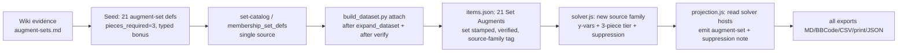

# Augment Sets - Plan

## Goal Capsule

**Objective:** Make the 21 DDO "Augment Sets" (Cauldron of Cadence set augments) first-class,
solver-active gear. Enrich the existing inert `Set Augment: X` entries with their wiki-sourced 3-piece
set bonuses, model them as a **new solver source family** where the *same* augment is slotted up to
three times to fire its bonus, assign each copy to a specific host item's Colorless slot and suppress
that host's own set, gate the whole thing by ownership, and surface it in all exports.

**Product authority:** eddiefiggie (DDO domain expert). Every mechanic wiki-confirmed —
`docs/wiki-evidence/augment-sets.md`. Hard project rule: confirm mechanics against the DDO wiki, never
infer.

**Open blockers:** none. KTD-1 (the feasibility of option-2 suppression) is **resolved** — see the
Planning Contract. Delivery shape confirmed as a **single PR** with dependency-ordered units.

**Product Contract preservation:** Product Contract (R1–R8) unchanged. KTD-1 moved from an open
question to a resolved technical approach during planning research; no product scope changed.

---

## Context / Why now

Users reported "Augment Sets" (issue #122 / U7). A prior note
(`docs/plans/2026-08-03-003-feat-augment-sets-design.md`) **misidentified** these as Filigree sets by
name-matching and inferring — the failure the "don't infer" rule guards against. This brainstorm
re-sourced the mechanic from the wiki: Augment Sets are their own system, distinct from filigrees.
That note is **superseded**. Today the 21 entries exist but are `verification: "quarantined"` (empty
affixes) and excluded from the solve, and the solver cannot use an augment more than once — so the
mechanic is unreachable.

---

## Product Contract

### The mechanic (wiki-confirmed — full evidence in `docs/wiki-evidence/augment-sets.md`)

- Each of 21 **Set Augments** is a **BtA Colorless augment, ML 30**, crafted at the **Cauldron of
  Cadence** (The Hut from Beyond) from **Thread of Fate ×50 + Empty Soul Vessel + one specific named
  "Original" item**.
- Each augment's **only** enchantment is its own single set membership — **no standalone stats**. A
  copy contributes exactly one set-piece.
- One tier only: **"3 Pieces Equipped"**, augment is the **sole** piece source → the bonus needs
  **3 copies of the same augment**. 0–2 copies grant nothing; 3 grant the bonus, applied once.
- Bonuses are almost all **Artifact-typed**; one is **Legendary** (Legendary Bulwark, +10% Max HP).
- **Suppression:** slotting a Set Augment into an item "overrides its Set Bonus" — the host item's own
  named set(s) are suppressed while the augment is slotted.

### Requirements

- **R1 — Enrich existing augments.** Populate the 21 `Set Augment: X` entries with wiki-sourced data:
  `set` name (already in raw), `pieces_required: 3`, and the correctly bonus-typed 3-piece stat. Do
  **not** mint new items. Model `pieces_required` as data so it generalizes to future 4/5-piece sets.
- **R2 — Wiki-seed the bonus payload, exclude-until-verified.** Bonus values come from the wiki
  (evidence file), seeded like joker/Vecna/Dino set defs; an augment whose bonus cannot resolve to a
  verified def stays inert rather than fabricated.
- **R3 — Allow duplicate placement for this class only.** 0–3 copies of a Set Augment; every other
  augment keeps ≤ 1.
- **R4 — Activate at exactly 3.** The bonus contributes only at 3 copies; feed each placed copy as one
  set-piece into the existing `setPieces`/`setTiers` engine so the Artifact-typed bonus stacks/collapses
  through the normal buckets.
- **R5 — Full placement + suppression (correctness).** The solver assigns each copy to a specific host
  item's Colorless slot and suppresses that host item's own named set(s) while slotted.
- **R6 — Ownership gate (v1).** A per-augment "I own / can craft this" selector; the solver considers
  only marked-available augments.
- **R7 — Export coverage.** Set Augments and their suppression flow through `web/projection.js` into
  all exports (MD, BBCode, CSV, print, portable JSON). Standing invariant: any new mechanic is
  export-covered by default.
- **R8 — Never degrade a higher-priority target when placing a copy.** Emergent from the staged
  lexicographic solve (`web/solver.js` `solveLexicographic` locks each ranked target before the next),
  **provided** suppression (R5) is encoded as a real MILP constraint. No new heuristic; a regression
  test proves it.

### Key Decisions

- **KTD-1 — Suppression via a Set-Augment-only per-item host binding (RESOLVED).**
  *(session-settled: user-directed — chosen over slot-agnostic/non-set-items-only: correctness per the
  wiki suppression rule.)* Research confirmed augments are modeled as **aggregate per-color capacity**
  with **no host binding** at solve time (`web/solver.js:213-295`; host attribution reconstructed
  post-solve in `web/projection.js`), so suppression cannot ride the existing augment path. But per-item
  **set membership** IS known at solve time (`setPieces` holds item x-vars, `web/solver.js:593-607`).
  Approach: introduce a binary `y[aug,i]` ("a copy of set-augment `aug` sits in item `i`'s Colorless
  slot"), **only for the 21 set augments** — so the "~100× program blowup" that forced the aggregate
  model (`web/solver.js:213-229`) does not apply. Suppression is then **linear**: replace item `i`'s
  piece term `xᵢ` with `(xᵢ − hostsᵢ)` in `i`'s own set threshold, where `hostsᵢ` is a per-item "hosts
  any set augment" binary (`hostsᵢ ≥ y[aug,i]`, `hostsᵢ ≤ 1`). Since `y ≤ xᵢ`, `(xᵢ − hostsᵢ) ∈ {0,1}`.
- **KTD-2 — Set Augments are a NEW source family, not an extension of the augment path.** Two hard
  reasons: the existing path values augments only by stat buckets (`augBest`, `web/solver.js:230-242`)
  and drops a stat-less augment; and it caps every augment at ≤ 1 (`web/solver.js:279`). Model parallel
  to the joker/membership blocks (`web/solver.js:608-684`), reusing the self-seeding set-threshold
  machinery.
- **KTD-3 — Set defs come from the gear-planner set-catalog path, never a hand-authored parallel file.**
  Per `docs/solutions/design-patterns/single-source-of-truth-for-set-definitions.md`. Seed the 21
  augment-set defs so they resolve through `src/set_catalog.py` / `build_membership_set_defs`
  (`src/membership.py:86`), giving identical stat vocabulary and correct bonus-type stacking.
- **KTD-4 — Bonus typing is the correctness hinge.** The 3-piece bonuses must carry the right type
  (Artifact for ~20, Legendary for Legendary Bulwark) so buckets collapse/stack correctly.
- **KTD-5 — Enrichment must un-quarantine.** The 21 records ship `verification: "quarantined"` and are
  rejected by `variantConflict` (`web/model.js:187`). Stamp set data AND flip to `verified`, attaching
  **after** the verify pass so empty affixes don't re-quarantine them — mirroring how Dino blanks are
  appended after verify (`build_dataset.py`).
- **KTD-6 — Placed hosts are solver-decided, so projection must NOT greedily reconstruct them.**
  `web/projection.js` `assignAugments` greedily assigns augment hosts post-solve; Set Augment hosts come
  from the `y` vars and must be read from the solve meta, or the displayed host could disagree with the
  suppressed item.
- **KTD-7 — Ownership gate reuses the Artifact opt-in shape.** A `query` flag + one gate line in
  `variantConflict` (template: `web/model.js:246`), persisted via the `web/persist.js` allowlist
  (`ownedNames` Set/array precedent). The owned-gear pool gates base items only, so this is a new
  explicit gate. *(session-settled: user-directed — ownership gate included in v1, chosen over defer.)*

### Scope Boundaries (out of scope)

- **Legendary Green Steel Augment sets** — separate augment-set family, not the 21.
- **Filigrees / Sentient Weapons** — separate system (the prior note's error).
- **4/5-piece tiers** — none exist for these sets today (data model still generalizes).
- **Quick wins #1 (farming shopping-list), #2 (placement/suppression attribution beyond the basic
  export line), #3 (own-N/3 nudge)** — deferred. Only #4 (export coverage, R7) is in this cut.
- **#106** (owned-mode "recommendations not owned" clarity) — recommended to fold in here but not yet
  approved; not built by this plan unless added.

### Success Signals

- Slotting 3 copies of a Set Augment yields exactly its 3-piece bonus, once; 1–2 copies yield nothing.
- The 3-piece Artifact bonus collapses against another Artifact bonus to the same stat (no double-count).
- Placing a Set Augment on a set-bearing item suppresses that item's set in the solve and in totals.
- A Set Augment copy is never placed where it reduces a higher-ranked target (R8 — regression test).
- The ownership gate excludes unmarked augments; the selection round-trips through save/import.
- Set Augments + suppression appear in every export format via `projection.js`.
- Golden solves re-ratified (`node tests/parity/capture_golden.js`) after confirming any changed
  optimal build is a correct improvement (guard is NOT in the ad-hoc sweep — see
  `docs/solutions/workflow-issues/golden-solve-guard-missing-from-local-test-sweep.md`).

---

## High-Level Technical Design

Data flow — where the new source family lands (directional):



Constraint sketch (directional guidance, not implementation spec) — added **only** for the 21 set
augments:

```
for each set-augment aug, member item i with a Colorless slot:
  y[aug,i] ∈ {0,1}                             # a copy of aug sits in item i
  y[aug,i] ≤ x_i                               # only if item i is equipped
  Σ_i y[aug,i] ≤ 3                             # own at most 3 copies
hosts_i ∈ {0,1};  hosts_i ≥ y[aug,i] ∀aug;  hosts_i ≤ 1    # item i hosts some set augment
# Colorless capacity: set-augment copies share the physical Colorless slots
Σ_aug y[aug,i] + (ordinary colorless demand on i) ≤ colorless_slots(i)·x_i
# 3-piece tier: push y into setPieces[augSet]; existing threshold fires at 3
pieces_required(augSet)·set_active - Σ_i y[aug,i] ≤ 0
# suppression: in item i's OWN set S threshold, replace x_i with (x_i - hosts_i)
# tie-break: minimize Σ y (place a copy only when the tier is genuinely won)
```

---

## Planning Contract

**Depth:** Deep. **Delivery:** single PR, units dependency-ordered (data → solver → suppression →
guard → ownership → exports → golden/build). **Execution direction:** proof-first on the solver units
(U3–U5, U8) — write the failing solver assertion (3-copy activation, suppression, no-degrade) before
changing the model, per the recurring-bug warning in the MILP-encoding learning.

### U1. Seed the 21 augment-set definitions (wiki → set-def catalog)

- **Goal:** A single-source seed of the 21 augment sets: name, `pieces_required: 3`, and the typed
  3-piece bonus affix, resolvable through the set-catalog like intrinsic/membership sets.
- **Requirements:** R1, R2, KTD-3, KTD-4.
- **Dependencies:** none.
- **Files:** `data/seed/compendium/augment_sets.json` (new, values from
  `docs/wiki-evidence/augment-sets.md`), `src/set_catalog.py` and/or `src/membership.py` (wire the
  defs into `build_membership_set_defs`), `tests/test_augment_sets.py` (new).
- **Approach:** One entry per set: canonical set name, `pieces_required: 3`, affix `{stat, bonus_type,
  value}` — bonus_type `Artifact` for ~20, `Legendary` for Legendary Bulwark. Exclude-until-verified:
  an entry that fails to resolve to a clean typed affix is omitted, not guessed.
- **Patterns to follow:** `src/membership.py build_membership_set_defs` (`:86`); the joker/Dino set-def
  seeding.
- **Test scenarios:** all 21 sets load with `pieces_required: 3` and a typed affix; Legendary Bulwark
  carries `Legendary` not `Artifact`; a malformed entry is excluded, not defaulted; the def resolves
  through the same catalog path intrinsic members use.
- **Verification:** `python -m pytest tests/test_augment_sets.py` green; defs enumerable from the
  catalog.

### U2. Enrich + un-quarantine the 21 Set Augment records (build_dataset attach)

- **Goal:** Stamp `set`, `pieces_required`, and a source-family tag onto the 21 `Set Augment: X`
  variants and lift them out of quarantine so they enter the solve.
- **Requirements:** R1, KTD-5.
- **Dependencies:** U1.
- **Files:** `build_dataset.py` (attach loop after `expand_dataset` **and** after `verify_mod.apply`),
  `src/augment_sets.py` (new attach fn mirroring `attach_dino_set_bonus_slots`),
  `tests/test_augment_sets.py`.
- **Approach:** Match the 21 by `source_item`/`variant_id`; stamp `set` (canonical), `pieces_required`,
  and a marker distinguishing them as the set-augment source family; set `verification: "verified"`.
  Attach after verify (Dino-blank pattern) so empty affixes don't re-quarantine.
- **Patterns to follow:** joker stamp loop and `attach_dino_set_bonus_slots` in `build_dataset.py` /
  `src/membership.py`; the "blanks added after verify" comment.
- **Test scenarios:** all 21 emerge `verified` with `set` + `pieces_required` set; they survive
  `verify_mod.apply`; `variantConflict` no longer rejects them for verification; count is exactly 21
  (no dupes, none dropped).
- **Verification:** rebuild `web/data/items.json`; the 21 appear verified with set data.

### U3. Solver — new Set-Augment source family (placement + capacity + 3-piece tier)

- **Goal:** Model the `y[aug,i]` placement family, its Colorless-slot capacity coupling, the ≤3 cap,
  and feed copies into the existing threshold so the bonus fires at exactly 3.
- **Requirements:** R3, R4, KTD-1, KTD-2.
- **Dependencies:** U2.
- **Files:** `web/solver.js`, `tests/solver.test.js`.
- **Approach:** Add `y[aug,i]` binaries for the 21 only; `y ≤ x_host`; `Σ_i y[aug,i] ≤ 3`; couple into
  the Colorless supply so set-augment copies and ordinary Colorless augments don't double-book the same
  physical slots (reserve from `supplyTerms['Colorless']`, `web/solver.js:246-254`); self-seed the
  augment-set tier and push each `y` into `setPieces[augSet]` so `web/solver.js:708` fires at 3. Emit a
  meta map (like `setMeta`) recording each placed copy's host for projection (KTD-6).
- **Execution note:** Start from a failing test asserting the bonus is absent at 2 copies and present at
  3, before adding the constraints.
- **Patterns to follow:** the chosen-membership block (`web/solver.js:651-684`) and threshold
  (`:686-712`).
- **Test scenarios:** bonus absent with 2 copies, present with 3; `Σ y ≤ 3` enforced; a copy requires
  its host equipped (`y ≤ x`); Colorless capacity not double-booked with an ordinary Colorless augment
  competing for the same slot; the 3-piece Artifact bonus lands in the right bucket and collapses vs a
  competing Artifact bonus to the same stat.
- **Verification:** `node tests/solver.test.js` green; a hand loadout with 3 owned copies shows the bonus.

### U4. Solver — suppression of the host item's own set

- **Goal:** When item `i` hosts a set-augment copy, remove `i`'s contribution to `i`'s own named set(s).
- **Requirements:** R5, R8, KTD-1.
- **Dependencies:** U3.
- **Files:** `web/solver.js`, `tests/solver.test.js`.
- **Approach:** Add `hosts_i` (`≥ y[aug,i]`, `≤ 1`); in each named set S's threshold, replace member
  item `i`'s piece term `x_i` with `(x_i − hosts_i)`. Tie-break-minimize `Σ y` so a copy is placed only
  when the tier is genuinely won (per the lexicographic-redundancy learning).
- **Execution note:** Proof-first — assert that placing a copy on a set-bearing item drops that set from
  the totals before implementing the term rewrite.
- **Test scenarios:** placing a copy on a set item removes that set's bonus from totals; placing on a
  set-less item suppresses nothing; **R8** — a copy is never placed where it reduces a higher-ranked
  target (the suppressed set served a higher priority ⇒ solver declines the placement); no
  double-suppression when an item hosts multiple copies (`hosts_i` clamped to 1).
- **Verification:** `node tests/solver.test.js` green including the R8 regression.

### U5. Dominance guard + new-source-family audit

- **Goal:** Ensure a Colorless-slot-bearing host isn't pruned before it can host a set augment, and the
  objective actually reads the new tier.
- **Requirements:** R4, R5 (soundness).
- **Dependencies:** U3, U4.
- **Files:** `web/solver.js` (`dominates()`), `tests/solver.test.js`.
- **Approach:** Walk the new-source-family checklist in
  `docs/solutions/design-patterns/milp-encoding-for-gear-optimization.md`: teach `dominates()` to count
  a host's set-augment-hosting value; confirm the objective builder reads the tier; audit that the
  3-copy/suppression coupling can't force a valid candidate off.
- **Test scenarios:** an item whose only marginal value is hosting a needed set-augment copy is not
  pruned; a build that must complete a 3-piece set is reachable (not dominated away).
- **Verification:** `node tests/solver.test.js` green; no regression in existing dominance tests.

### U6. Ownership gate — query flag, eligibility, UI, persistence

- **Goal:** A per-augment "I own / can craft" selector; the solver considers only marked set augments.
- **Requirements:** R6, KTD-7.
- **Dependencies:** U2 (needs the enriched records).
- **Files:** `web/model.js` (query flag + gate in `variantConflict`), the augment/wizard UI
  (`web/wizard.js` and the relevant selector surface), `web/persist.js` (allowlist),
  `web/backup.js` (import parity), `tests/model.test.js`, `tests/persist`/`tests/wizard` tests.
- **Approach:** Add `ownedSetAugments` (Set of names) to the query; gate set-augment variants on
  membership (shape mirrors the Artifact opt-in at `web/model.js:246`). Persist by adding the field to
  the `web/persist.js:37` allowlist with Set/array handling (`ownedNames` precedent).
- **Test scenarios:** unmarked set augments are excluded from the solve; marking one makes it eligible;
  the selection round-trips through save/load and through export/import (`backup.js` allowlist parity);
  default empty state considers no set augments.
- **Verification:** `node tests/model.test.js` + persistence tests green; UI selection persists across
  reload.

### U7. Projection + exports — placement and suppression across all outputs

- **Goal:** Show placed Set Augments (from solver-decided hosts) and annotate suppressed host sets in
  every export.
- **Requirements:** R7, KTD-6.
- **Dependencies:** U3, U4.
- **Files:** `web/projection.js` (new `craftLabel` family + read solver host meta, bypassing the greedy
  `assignAugments` for set augments), `web/results.js` (display), tests for projection/results.
- **Approach:** Emit a `augmentset` crafting family via `craftLabel` (mirror the existing `membership`
  case, `web/projection.js:303-306`); read each copy's host from the solve meta (KTD-6), not the greedy
  reconstruction; annotate the suppressed host set in the active-sets output. `exporters.js` needs no
  change (renders off `project()`).
- **Test scenarios:** a placed set augment appears in MD, BBCode, CSV, print, and portable JSON; the
  displayed host matches the solver-suppressed item; a suppressed host set is shown as suppressed, not
  active; portable JSON round-trips the placement.
- **Verification:** all five exports render the augment + suppression; byte-identity discipline holds
  where applicable.

### U8. Golden re-ratify + BUILD bump

- **Goal:** Re-ratify golden solves after the solver-affecting changes and stamp the deploy.
- **Requirements:** all (regression safety).
- **Dependencies:** U1–U7.
- **Files:** `tests/parity/golden.json`, `web/app.js` (BUILD stamp), `web/index.html` (`?v=` cache-bust).
- **Approach:** Run `node tests/solver_golden.test.js`; where fixtures change, confirm each is a correct
  improvement with no priority target regressed, then `node tests/parity/capture_golden.js`. Bump the
  footer BUILD stamp and the `?v=` together.
- **Test scenarios:** golden guard green after regeneration; no priority target regressed vs the prior
  baseline.
- **Verification:** `node tests/solver_golden.test.js` green; footer BUILD matches the new `?v=`.

---

## Verification Contract

- Full JS sweep **including** the golden guard: `node tests/solver_golden.test.js tests/solver.test.js
  tests/model.test.js tests/results.test.js` (+ any new test files); Python: `python -m pytest
  tests/test_augment_sets.py`.
- Rebuild `web/data/items.json` and confirm the 21 set augments are verified with set data.
- Manual smoke: a build with 3 owned copies of one set augment shows exactly its 3-piece bonus and the
  suppressed host set; exports render both.
- Golden re-ratified only after confirming changed fixtures are correct improvements.

## Definition of Done

- R1–R8 satisfied; all success signals met.
- Every feature-bearing unit's tests written and green; golden guard green post-regeneration.
- Set Augments flow through `projection.js` into all five exports (R7 standing invariant).
- BUILD stamp + `?v=` bumped together; deploy green.

---

## Sources & Research

- `docs/wiki-evidence/augment-sets.md` — wiki mechanic + all 21 bonuses (Cauldron of Cadence).
- Grounding: augment aggregate-per-color model (`web/solver.js:213-295`), set membership/threshold
  (`:593-714`), chosen-membership self-seed (`:651-684`), Colorless slot data
  (`web/model.js:526-543`), eligibility/opt-in (`web/model.js:183-249`), persistence allowlist
  (`web/persist.js:37`), exports (`web/projection.js:289-414`), attach pattern
  (`build_dataset.py` ~334-405, `src/membership.py:86,126,139`).
- Learnings heeded: `docs/solutions/design-patterns/milp-encoding-for-gear-optimization.md`
  (new-source-family checklist — bug recurred 3×),
  `.../single-source-of-truth-for-set-definitions.md`, `.../lexicographic-redundancy-is-not-a-bug.md`,
  `docs/solutions/conventions/exclude-until-verified-data-gates.md`,
  `.../data-at-rest-can-look-inert-while-runtime-normalizes-it.md`,
  `docs/solutions/workflow-issues/golden-solve-guard-missing-from-local-test-sweep.md`.
- Superseded: `docs/plans/2026-08-03-003-feat-augment-sets-design.md` (filigree misidentification).
