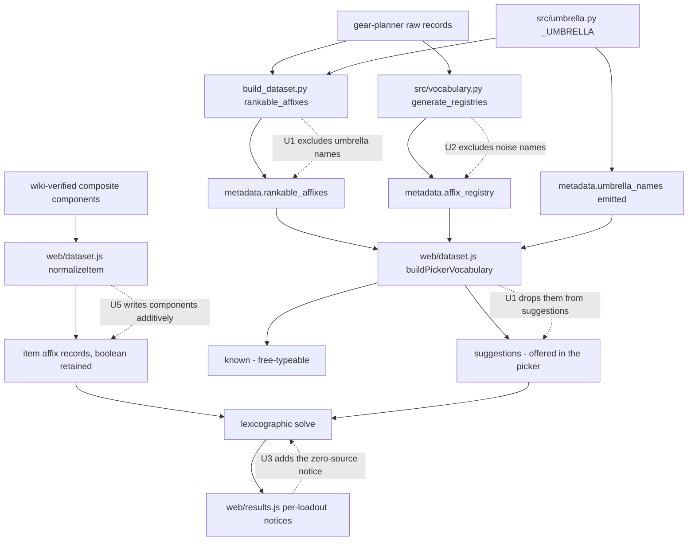

# Affix Vocabulary Hygiene - Plan

## Goal Capsule

- **Objective:** Make the priority picker offer names that can actually score, and offer the names players actually use. Close the gap between what the dataset stores and what a player types.
- **Product authority:** eddiefiggie (project owner).
- **Open blockers:** None.
- **Reports addressed:** 2026-08-05 batch reports 3 (Profane Well Rounded), 5 (solar spell crit naming), and the naming half of 7 (Parry/Riposte/Good Luck). Also the standing §3-C recommendation from `docs/reports/2026-08-01-bug-report-audit.md`.
- **Product Contract preservation:** Product Contract unchanged — R1–R11, AE1–AE4, and the three Key Decisions are carried verbatim. Planning added the Planning Contract, Implementation Units, Verification Contract, and Definition of Done below. Planning research found R4, R5, and R9 already satisfied by shipped code; they are recorded as verified rather than rewritten (KTD6).

---

## Product Contract

### Summary

Correct the picker vocabulary in three directions: stop offering names the pipeline expands away, start offering the build-around boolean effects players ask for, and write the magnitude the wiki states for boolean affixes that actually carry one. Alias work stays strictly limited to spelling and abbreviation variants, because the project has already ruled that merging distinct affixes is a bug.

### Problem Frame

Three of the 2026-08-05 reports are the same complaint from different angles: a player types the name of a real in-game effect and gets nothing.

The causes are not what they look like. `Well Rounded` is not missing — `src/umbrella.py` deliberately expands it into the six ability scores at build time, which is correct DDO behavior, and the 2026-08-01 audit already ruled it so. The defect is that the picker still offers the name, so the player ranks something the pipeline guarantees will never appear on an item. `Force Spell Crit Chance` matches nothing for the same class of reason: the effect exists under DDO's real names. The solar gems are not untyped either — `docs/wiki-evidence/spell-lore.md` documents `Solar Gem of Spell Critical Chance` as a legitimate Artifact lore channel.

Report 7 splits. `Crown of Summer` (×7) and `Greater Heroism` (×16) are stored as `Bool`, carrying presence but no magnitude, so the numeric effect the wiki states never scores — and the same is true of `Blurry` (×71) and `Lesser Displacement` (×69), which nobody reported. But `Parrying` (Insight, ×139), `Riposte` (Insight, ×35), and `Good Luck` (Luck, ×68) already score magnitude under their own names; the complaint there is only that the name a player types is not the stat the affix grants.

The standing audit calls the boolean-suggestion exclusion "the single most-repeated complaint" and recommends a curated build-around allowlist. That recommendation is unimplemented.

### Key Decisions

- **Aliases resolve spelling, never meaning.** An alias maps a variant spelling or abbreviation to a canonical name and nothing more. (user-approved — chosen over seeding aliases from reported player synonyms: the 2026-08-01 audit declined `Vitality → False Life` as a false merge citing the Blood Rage/Bloodrage lesson, and `affix_aliases.json` carries the rule that same-item co-occurrence implies distinct. A report-seeded alias table would re-introduce exactly the merge the project already rejected.)

- **A name the pipeline expands away is not offered.** Umbrella names are removed from suggestions rather than made scorable. (user-approved — chosen over parsing umbrella records back into the data: `umbrella.py` expanding them is correct DDO behavior, so the data is right and only the offer is wrong.)

- **Boolean decomposition is additive.** Writing a wiki-stated magnitude onto an item leaves the boolean affix in place. (user-approved — chosen over following the bare-`Sheltering` precedent, which replaces the affix and drops it from suggestions: a player who wants the effect merely present must keep being able to target it.)

### Requirements

**Offer only names that can score**

- R1. A name the build pipeline expands away — umbrella names such as `Well Rounded` and `All Ability Scores` — is not offered as a rankable priority, and the picker points the player at the concrete stats it expands into.
- R2. Strings that are not affixes are excluded from the generated affix registry at generation time, so they never reach the free-typed known set.
- R3. A priority the player ranks that no source in the active pool can contribute to is surfaced with a stated reason rather than scoring zero without explanation.

**Offer the effects players ask for**

- R4. A curated allowlist of build-around boolean affixes — those appearing on a small number of named items — is offered in picker suggestions, while one-off proc and flavor descriptions stay excluded.
- R5. The allowlist is curated and exclude-until-verified: entries are added deliberately, never by relaxing the presence filter wholesale.

**Score the magnitude a boolean hides**

- R6. A boolean-typed affix the wiki states grants a numeric effect has that effect written onto the carrying item's record as a typed affix, so it scores.
- R7. Each written component carries the bonus type the wiki states; a component whose bonus type the wiki does not state is excluded under the standing exclude-until-verified rule rather than written untyped.
- R8. Writing a component leaves the boolean affix on the item and in the presence set, so the effect remains targetable as presence.
- R9. A magnitude-carrying affix whose name differs from the stat it grants keeps its existing scorable bucket unchanged; only the vocabulary is corrected so players can find it.

**Alias discipline**

- R10. Alias entries resolve spelling and abbreviation variants only, and never merge two names.
- R11. A reported synonym is checked against the curated distinct records before any alias is added; the `Vitality`/`False Life` and `Spell Lore`/`Universal Spell Lore` rulings stand unless new wiki evidence overturns them.

### Acceptance Examples

- AE1. An expanded-away name stops being a dead end.
  - **Given:** `Well Rounded`, which the build pipeline expands into the six ability scores.
  - **When:** the player looks for it in the priority picker.
  - **Then:** it is not offered as a rankable priority, and the player is pointed at the ability scores it becomes.
  - **Covers R1.**

- AE2. A build-around boolean becomes reachable.
  - **Given:** a boolean effect carried by a small number of named items and present on the curated allowlist.
  - **When:** the player types its opening characters in the picker.
  - **Then:** it appears as a suggestion, while one-off proc descriptions do not.
  - **Covers R4, R5.**

- AE3. A hidden magnitude scores without losing presence.
  - **Given:** a boolean affix the wiki states grants a numeric effect.
  - **When:** the dataset is rebuilt and a player ranks that effect's stat.
  - **Then:** the carrying item contributes the wiki-stated value at its wiki-stated bonus type, and the affix is still targetable as presence.
  - **Covers R6, R7, R8.**

- AE4. A reported synonym is refused when the project has ruled it distinct.
  - **Given:** a player-reported synonym naming two affixes the curated records mark distinct.
  - **When:** the alias table is updated.
  - **Then:** no alias is added and the existing ruling stands.
  - **Covers R10, R11.**

### Scope Boundaries

- Reports 1, 2, 4, and 6 — covered by the sibling plans for data reconciliation and off-hand dual-wield.
- A general silent-zero audit across the whole vocabulary. R3 covers the player-facing case; a repeatable census is a later idea, not this batch.
- Changing how the solver buckets stats. R9 explicitly leaves working buckets alone.
- Relaxing the boolean suggestion filter wholesale, which is what R5's curation exists to prevent.

### Success Criteria

- A player who ranks `Well Rounded`, or types a build-around boolean the allowlist covers, gets either a usable priority or a stated reason — never an accepted priority that silently scores zero.
- No alias added by this batch merges two affixes the project has recorded as distinct.
- Every written magnitude traces to a wiki citation; none is inferred.

### Outstanding Questions

**Deferred to planning**

- Which surface carries R3's stated reason, given the existing coverage note is a dataset-level function with no render call site and the per-loadout notices take the query and result.
- Whether the allowlist lives beside the existing boolean-features seed or as its own curated file.
- How many boolean affixes the wiki confirms carry magnitude, which sets the real size of R6.

### Dependencies and Assumptions

- The DDO Wiki is the sole source of truth for every value, per the standing exclude-until-verified rule, and throttles after roughly eight rapid calls.
- `src/umbrella.py` expanding umbrella names is correct behavior and is not changed by this batch.
- The rulings in `docs/wiki-evidence/spell-lore.md` and §2 of the 2026-08-01 audit stand as recorded.

### Sources and Research

- `docs/reports/2026-08-01-bug-report-audit.md` — §2 rules `Well Rounded` and `False Life`/`Vitality` already-correct; §3-C recommends the build-around allowlist; §3-E records that the reported spell-crit terms match nothing.
- `docs/wiki-evidence/spell-lore.md` — the lore channel model, the Solar Gem as an Artifact lore channel, and the ruling that `Spell Lore` and `Universal Spell Lore` are correctly distinct.
- `src/umbrella.py` — the build-time umbrella expansion that is why no `Well Rounded` record exists.
- `web/dataset.js` — the picker vocabulary builder, its suggestion and known sets, the presence filter, and the noise-affix filter.
- `src/vocabulary.py` — affix registry generation and the curated alias/distinct records.
- `data/bug_reports.txt` — the verbatim 2026-08-05 reports.
- `web/dataset.js` `buildPickerVocabulary` — the shipped `suggest.delete("Sheltering")` precedent that U1 generalizes, and the `PRESENCE_ALLOW`/`PRESENCE_DENY`/`_isPresenceTargetable` path that already satisfies R4/R5.
- `build_dataset.py` `rankable_affixes()` — where `Well Rounded` enters `metadata.rankable_affixes`.
- `web/results.js` — `artifactNotice(result, query)` and `boundNotice(query, result)` rendered together, the per-loadout notice family U3 joins; `coverageNote(dataset)` is dataset-scoped with no render call site and is not U3's home.
- `docs/solutions/design-patterns/bonus-type-vocabulary-collides-with-bare-stat.md` — prior vocabulary-collision learning.

---

## Planning Contract

### Key Technical Decisions

- KTD1. **R1 is fixed at generation time, with the client-side delete as defense in depth.** The authoritative fix excludes umbrella names from `rankable_affixes()` in `build_dataset.py` so the name never reaches `metadata.rankable_affixes`. `buildPickerVocabulary` additionally drops them from suggestions, generalizing its existing one-off `suggest.delete("Sheltering")`. Both because an older cached dataset would otherwise keep offering the name. Grounds R1.
- KTD2. **Umbrella names get their own emitted metadata field; `_UMBRELLA` and the shipped `Sheltering` line are both left untouched.** `build_dataset.py` emits `metadata.expanded_away_names` from `src/umbrella.py`'s umbrella set, and `buildPickerVocabulary` reads it. `_UMBRELLA` is **read-only for this purpose and must not gain `"Sheltering"`** — it drives `_expand_affix`, so adding a name there rewrites every matching affix into the six ability scores at build time. Bare `Sheltering` is a different mechanism with a different expansion target (Physical + Magical Sheltering at the JS seam), and its shipped `suggest.delete("Sheltering")` line stays exactly as it is: retiring a working one-off is scope none of the three reports asked for, and folding it in here would undo recent verified work. `web/dataset.js` keeps a small hardcoded fallback constant used **only** when the metadata field is absent, which is the stale-cached-dataset path KTD1's rationale depends on. Grounds R1.
- KTD3. **R3 renders as a new per-loadout notice, not in the coverage note.** `coverageNote(dataset)` takes only the dataset, is dataset-scoped, and has no render call site — it is invoked solely from tests. The zero-source disclosure needs the query and the solve result, which is exactly the signature the `artifactNotice`/`boundNotice` family already takes, rendered together in the loadout view. Grounds R3.
- KTD4. **Composite decomposition is additive and deliberately diverges from the `Sheltering` precedent.** The shipped bare-`Sheltering` expansion *replaces* the affix and deletes it from suggestions. Composite decomposition must keep the boolean on the item and in the presence set, so the effect stays targetable as presence per R8. The divergence is intentional and must be stated in the code comment so a future reader does not "fix" it into consistency. Grounds R6, R8. (session-settled: user-approved — chosen over following the Sheltering precedent.)
- KTD4b. **A written component stat is made rankable through `CORE_STATS`, and that touches no solver code.** Writing a component onto an item is not enough — the picker vocabulary is generated Python-side and never sees a JS-written affix, so `Concealment` would be unrankable and AE3 could not pass. Union each U4-verified component name into `CORE_STATS` in `build_dataset.py`, the existing "always included regardless of item count" hook that flows into `rankable_affixes` and the picker. **Blast radius is zero for existing solves:** `web/solver.js` and `web/model.js` never read `CORE_STATS` or `rankable_affixes`, and every bucket site is gated on `targetSet.has(...)`, so an affix written onto an item contributes nothing unless a player ranks that stat. A player who never asks for the component gets a byte-identical solve. Grounds R6.
- KTD5. **Component bonus types are exclude-until-verified.** A component whose bonus type the wiki does not state is not written at all, rather than written untyped. An untyped or novel-typed component would land in its own bucket and stack on top of a same-stat affix already on the item, converting an under-counting bug into an over-counting one. Grounds R7.
- KTD6. **R4, R5, and R9 are already satisfied; no work is planned for them.** Verified against the built dataset: `buildPickerVocabulary` returns 1,038 suggestions with 801 presence-flagged, and `Blurry`, `Lesser Displacement`, `Greater Heroism`, and `Crown of Summer` are each `suggested=Y presence=Y`. The curated allowlist mechanism (`PRESENCE_ALLOW` / `PRESENCE_DENY` / `_isPresenceTargetable`) shipped in PR #71 as the §3-C follow-up. `Parrying`, `Riposte`, and `Good Luck` are each `suggested=Y` and score under their own magnitude buckets. U6's guard test pins these so a later change cannot silently regress them.

### High-Level Technical Design

Each fix lands at a different stage of the vocabulary pipeline. The stages already exist; no new layer is introduced.

### Assumptions

- `metadata` is a suitable carrier for the umbrella-name list; if the build already emits an equivalent, U1 reuses it rather than adding a second field.
- The four boolean composites in scope for U4 are `Crown of Summer`, `Greater Heroism`, `Blurry`, and `Lesser Displacement`. If the wiki shows any of them grants no numeric magnitude, that one drops out of U5 and is recorded as verified-boolean rather than forced.
- `data/seed/compendium/vocab_registries.json` is a committed generated seed, so U2's fix must regenerate and commit it — a hand edit to the built dataset would not survive the next build.
- R10/R11 may add zero alias entries. Their value is the guard, not new data.

### Sequencing

U1 and U2 are independent generation-time fixes and can land together. U3 is independent and is the only unit needing a new UI surface. U4 gates U5 — no component is written before the wiki states it. U6 is independent and can land first as a characterization guard, which is the recommended order since it pins the R4/R5/R9 verification before any other change touches the vocabulary.

---

## Implementation Units

### U1. Retire umbrella names from picker suggestions

- **Goal:** Stop offering a name the build pipeline guarantees will never appear on an item, and point the player at the concrete stats instead.
- **Requirements:** R1 (KTD1, KTD2).
- **Dependencies:** none.
- **Files:** `build_dataset.py` (exclude umbrella names in `rankable_affixes()`; emit `metadata.expanded_away_names`), `src/umbrella.py` (read-only — expose the umbrella set for the generator; **do not add `"Sheltering"`**), `web/dataset.js` (`buildPickerVocabulary` reads the emitted set and drops those names from `suggestions`, **in addition to** the existing `suggest.delete("Sheltering")`, which stays unchanged), `web/wizard.js` and `web/query.js` (the redirect on the free-typed path), `tests/dataset.test.js`, `tests/test_build_metadata.py`.
- **Approach:** The generator is authoritative — an umbrella name should never enter `metadata.rankable_affixes`. The client-side drop stays as defense in depth for a stale cached dataset, reading the emitted field when present and falling back to a small hardcoded constant when it is absent. Removing the name from suggestions is not sufficient on its own: `addPriority` validates typed input against `known`, which carries umbrella names via `affix_registry` independently, so an umbrella name must also be refused on the free-typed path — refused with the redirect, not silently accepted as a priority guaranteed to score zero. `buildPickerVocabulary` returns an `expandedAway` map from each retired name to its replacement stats so the redirect has a data channel; the message renders through the existing `#wz-status` element that `addPriority` already uses to report an unknown affix.
- **Patterns to follow:** the existing `suggest.delete("Sheltering")` block and its comment in `web/dataset.js` — same reasoning, extended to a data-driven set alongside it rather than replacing it.
- **Test scenarios:**
  - `Well Rounded` is absent from `metadata.rankable_affixes` after a rebuild. Covers AE1.
  - `Well Rounded` is absent from `buildPickerVocabulary().suggestions`. Covers AE1.
  - `All Ability Scores` is likewise absent from both.
  - The shipped `suggest.delete("Sheltering")` line is still present and `Sheltering` is still absent from suggestions — the new data-driven path sits alongside it, not in place of it.
  - `"sheltering"` is absent from `src/umbrella.py`'s umbrella set, so `_expand_affix` still leaves Sheltering affixes alone (guards against the six-ability-score corruption).
  - Typing `Well Rounded` into the priority input is refused with the redirect rather than accepted, even though the name is still in `known`.
  - The redirect names the six ability scores for `Well Rounded`.
  - The six ability scores remain present and rankable, so the redirect target exists.
  - A dataset lacking the emitted umbrella metadata still drops the names, exercising the defense-in-depth path.

### U2. Exclude noise names from the generated affix registry

- **Goal:** Stop a parse-failure string from being free-typeable as a priority.
- **Requirements:** R2.
- **Dependencies:** none.
- **Files:** `src/vocabulary.py` (`generate_registries()` filter), `data/seed/compendium/vocab_registries.json` (regenerated and committed), `tests/run_tests.py`.
- **Approach:** Filter noise names at generation time so they never enter `affix_registry`. `web/dataset.js` already drops them from item affixes at normalize time via `NOISE_AFFIX_NAMES`, and they are already absent from suggestions — the registry is the one surface still leaking them into the free-typed `known` set. Keep the noise definition aligned with the shipped `isNoiseAffix` rule (the named string plus bare-number names) so the two filters cannot drift.
- **Execution note:** The registry is a committed seed. Regenerate and commit it in the same change; a fix that only edits the generator leaves the shipped artifact stale.
- **Test scenarios:**
  - `See the item description page for details.` is absent from the regenerated `affix_registry`.
  - It is absent from `buildPickerVocabulary().known`.
  - A bare-number name (e.g. `+14`) is likewise absent from the registry.
  - A legitimate affix name that merely contains digits is retained, guarding against an over-broad filter.

### U3. Zero-source priority disclosure

- **Goal:** A priority no source in the active pool can contribute to is named as such, rather than reporting zero without explanation.
- **Requirements:** R3 (KTD3).
- **Dependencies:** none.
- **Files:** `web/results.js` (new notice function beside `artifactNotice`/`boundNotice`, rendered in the same block), `tests/results.test.js`.
- **Approach:** Add a per-loadout notice that takes the query and the solve result, determines which ranked priorities received no contributing source from the active pool, and names them with a stated reason. Render it alongside the existing artifact and bound notices rather than inside `coverageNote`, which is dataset-scoped and has no render call site. Distinguish "nothing in the pool supplies this" from an ordinary low result — the notice fires only on genuinely zero contributing sources.
- **Patterns to follow:** `artifactNotice(result, query)` and `boundNotice(query, result)` in `web/results.js` — same signature shape, same render site, same "distinct callout, not buried in the coverage note" convention their comments establish.
- **Test scenarios:**
  - A priority with zero contributing sources renders the notice naming that priority. Covers the R3 half of the never-silent guarantee.
  - A priority with sources that simply lost slots to higher priorities does **not** fire the notice — it is a different case and must not be conflated.
  - Multiple zero-source priorities are all named, not just the first.
  - No notice renders when every priority has at least one contributing source.
  - The notice renders alongside an artifact notice without either suppressing the other.

### U4. Wiki-harvest the four boolean composites

- **Goal:** Establish, with citations, what numeric effect each in-scope boolean composite actually grants and at what bonus type.
- **Requirements:** R6, R7 (KTD5).
- **Dependencies:** none.
- **Files:** `docs/wiki-evidence/boolean-composites.md` (new) — the sole deliverable. U5 transcribes the verified components into its constant table from this document.
- **Approach:** Harvest `Crown of Summer`, `Greater Heroism`, `Blurry`, and `Lesser Displacement` from the DDO Wiki, recording the quoted rule and the URL per the existing wiki-evidence format. For each, record every component as `(stat, bonus_type, value)`. A component whose bonus type the wiki does not state is recorded as excluded with the reason, not written. If a composite turns out to grant no numeric magnitude, record it as verified-boolean and drop it from U5.
- **Execution note:** The wiki throttles after roughly eight rapid calls with multi-minute blocks. Pace the harvest across four pages with waits; do not batch.
- **Patterns to follow:** `docs/wiki-evidence/sheltering.md` and `docs/wiki-evidence/spell-lore.md` — quoted rule, source URL, explicit ruling, status line.
- **Test scenarios:**
  - Test expectation: none — this unit produces evidence and seed data, not behavior. U5 carries the behavioral coverage.

### U5. Write composite components onto item records, additively

- **Goal:** Make the wiki-stated magnitude score, without losing the boolean's presence targetability.
- **Requirements:** R6, R7, R8 (KTD4, KTD5).
- **Dependencies:** U4.
- **Files:** `web/dataset.js` (`normalizeItem` seam, plus a constant table keyed by composite name to its `{stat, bonus_type, value}` components, transcribed from U4's evidence document exactly as the shipped Sheltering expansion stores its verified values), `build_dataset.py` (union the verified component names into `CORE_STATS` per KTD4b), `tests/dataset.test.js`, `tests/solver.test.js` for the end-to-end scoring proof.
- **Approach:** At the same seam that expands bare `Sheltering`, write each wiki-verified component affix onto an item carrying an in-scope boolean composite — but **additively**, leaving the boolean affix in place so it stays in the presence set. State the divergence from the `Sheltering` precedent in the comment: that expansion replaces and deletes; this one adds and retains. Skip a component the item already carries explicitly, matching the shipped Sheltering behavior, so no duplicate browse line appears. Idempotent on a second pass.
- **Execution note:** Write a failing end-to-end test first — an item carrying only the boolean contributes zero to the component stat today, and should contribute the wiki value after. That failure is the proof the unit exists to fix.
- **Patterns to follow:** the bare-`Sheltering` expansion block in `web/dataset.js` `normalizeItem` — same seam and same skip-if-already-present guard, opposite retention behavior.
- **Test scenarios:**
  - An item carrying an in-scope boolean composite contributes the wiki-stated component value at the wiki-stated bonus type. Covers AE3.
  - The boolean affix is still present on the item after normalization, and still appears in `buildPickerVocabulary().presence`. Covers AE3.
  - A second normalization pass is a no-op — no duplicated component affixes.
  - An item that already carries a component explicitly does not gain a duplicate line.
  - A component excluded by U4 for an unstated bonus type is not written.
  - Each written component stat is present in `metadata.rankable_affixes`, `buildPickerVocabulary().suggestions`, and `.known` after a rebuild — otherwise the player cannot rank it (KTD4b).
  - End-to-end (real HiGHS): ranking the component stat now selects the composite-carrying item where it previously scored zero. Covers AE3.
  - End-to-end (real HiGHS): a solve that does **not** rank any written component returns the same loadout as before the change — the no-regression guard for KTD4b's zero-blast-radius claim.

### U6. Alias-discipline and vocabulary regression guard

- **Goal:** Pin the rulings that make this area safe, so a later change cannot silently re-introduce a known-bad merge or regress the already-satisfied requirements.
- **Requirements:** R4, R5, R9, R10, R11; verifies KTD6.
- **Dependencies:** none.
- **Files:** `tests/vocabulary.test.js` or the nearest existing vocabulary test, `tests/run_tests.py` for the seed-side assertion.
- **Approach:** Assert that no alias entry maps between two names recorded as a distinct pair in the curated alias table, and that the specific rulings hold — no `Vitality` → `False Life` alias, no `Spell Lore` → `Universal Spell Lore` alias. Separately pin the KTD6 verification: `Blurry`, `Lesser Displacement`, `Greater Heroism`, and `Crown of Summer` are suggested and presence-flagged; `Parrying`, `Riposte`, and `Good Luck` are suggested and carry magnitude buckets.
- **Execution note:** Land this first. It characterizes the current good state before any other unit touches the vocabulary.
- **Patterns to follow:** the co-occurrence-implies-distinct rule recorded in the curated alias table, and the ruling in `docs/wiki-evidence/spell-lore.md`.
- **Test scenarios:**
  - No alias entry maps either direction between a recorded distinct pair. Covers AE4.
  - No alias exists from `Vitality` to `False Life`. Covers AE4.
  - No alias exists between `Spell Lore` and `Universal Spell Lore`. Covers AE4.
  - The four in-scope composites are each suggested and presence-flagged (KTD6).
  - `Parrying`, `Riposte`, and `Good Luck` are each suggested and score into a magnitude bucket, not a presence bucket (KTD6).

---

## Verification Contract

| Gate | Command | Applies to |
|---|---|---|
| Dataset / picker-vocabulary suite | `node tests/dataset.test.js` | U1, U2, U5, U6 — this is where `buildPickerVocabulary` and `normalizeItem` are exercised |
| Model suite | `node tests/model.test.js` | U5 |
| Browse suite | `node tests/browse.test.js` | U5 |
| Results suite | `node tests/results.test.js` | U3 |
| Solver suite (real HiGHS) | `node tests/solver.test.js` | U5 |
| Python suite | `python3 tests/run_tests.py` | U1, U2, U6 |
| Dataset rebuild | `python3 build_dataset.py` | U1, U2, U5 — all three change generated metadata |
| Syntax check | `node --check` on each edited `web/*.js` | all JS units |
| Browser smoke | serve `web/` on localhost; confirm `Well Rounded` is no longer offered, the four composites still appear as on/off targets, and a zero-source priority renders its notice | U1, U3, U5 |

`web/data/items.json` is a generated artifact — U1 and U2 change the generator and the committed seed, never the built JSON directly.

---

## Definition of Done

- R1, R2, R3, R6, R7, R8, R10, and R11 satisfied; R4, R5, and R9 verified already-satisfied and pinned by U6's guard.
- AE1–AE4 each covered by an enumerated test.
- `Well Rounded` and `All Ability Scores` are absent from both `rankable_affixes` and picker suggestions, are refused with the redirect on the free-typed path, and the six ability scores remain rankable.
- `src/umbrella.py`'s umbrella set is unchanged and the shipped `suggest.delete("Sheltering")` line still stands — no recently-verified behavior was undone to deliver R1.
- Every written composite component is rankable in the picker after a rebuild, and a solve that ranks no written component returns the same loadout as before the change.
- The noise string is absent from the regenerated, committed `affix_registry` and from the free-typed `known` set.
- A zero-source priority renders a distinct per-loadout notice; a merely-outranked priority does not.
- Every written composite component traces to a citation in `docs/wiki-evidence/boolean-composites.md`; components with an unstated bonus type are recorded as excluded, not written untyped.
- Composite decomposition is additive — the boolean affix survives on the item and in the presence set — and the divergence from the `Sheltering` precedent is stated in the code.
- The alias guard passes, including the `Vitality`/`False Life` and `Spell Lore`/`Universal Spell Lore` rulings.
- All listed gates green; edited `web/*.js` pass `node --check`; the dataset rebuilds cleanly.
