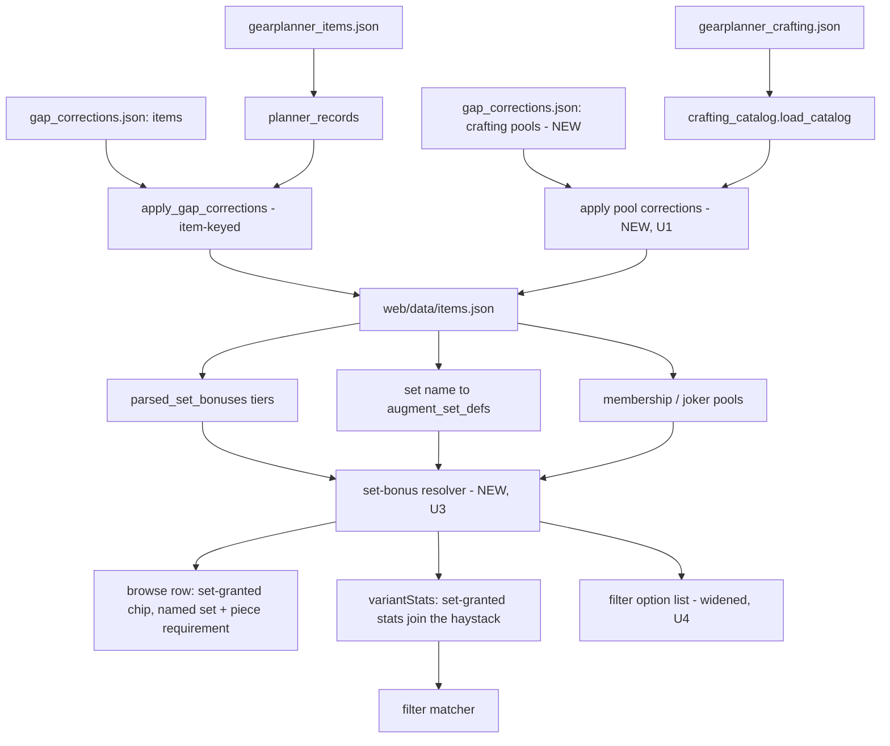

# Data Reconciliation and Set Visibility - Plan

## Goal Capsule

- **Objective:** Fix the two reported data defects and make set-granted value visible where players look for it. Narrow, evidence-backed work with a small wiki cost.
- **Product authority:** eddiefiggie (project owner).
- **Open blockers:** None.
- **Product Contract preservation:** Product Contract requirements, acceptance examples, and Key Decisions unchanged — R1–R9, AE1–AE3, and the two Key Decisions are carried verbatim; Sources and Research was extended with planning research. Planning added the Planning Contract, Implementation Units, Verification Contract, and Definition of Done below. Planning research found the Topaz records live in a crafting pool rather than an item record, so the sanctioned correction path does not reach them today (KTD1); and that only the Legendary Gem tier carries wildcard wiring, resolved by harvesting the other two (KTD4).
- **Reports addressed:** 2026-08-05 batch reports 1 (Topaz of Swiftness), 2 (set bonuses absent from the item view), and 6 (Gem of Many Facets).

---

## Product Contract

### Summary

Restore the missing Melee Alacrity value on `Topaz of Swiftness 15%` and sweep its sibling augment pools for the same defect class. Render set bonuses in the item browse view and make set-granted stats filterable. Reconcile the Gem of Many Facets set-pool data against the wiki evidence the project already holds, without touching the solver.

### Problem Frame

`Topaz of Swiftness 5%` carries `Melee Alacrity 5` and the 10% variant carries `Melee Alacrity 10`, but the 15% variant carries only `Speed 30`. The value is simply absent. These three are separate records in an augment pool distinguished by a numeric suffix, not tier variants of one item, so nothing in the existing tooling compares them to each other.

`Set Augment: Perfect Silence` reports zero eligible affixes because its value routes through a set definition rather than affixes, and the browse view renders no set content at all. The item reads as empty, and a player filtering browse for the stat the set grants finds nothing, because the filter's stat list is derived from item affixes.

Gem of Many Facets is the best-documented of the three and the least understood in the reports. `docs/wiki-evidence/gem-of-many-facets.md` confirms the mechanic — the Gem grants one set membership from each of two independent pools — and rules that the machinery is correct and the fix is data. It also warns that the Heroic pools may not carry to the endgame tiers. In the built dataset only the Legendary variant carries any joker wiring at all.

### Key Decisions

- **Reconcile data; do not touch the solver.** The two-pool mechanic is confirmed and the `joker_set_groups` model already expresses it. (user-approved — chosen over re-characterizing the Gem from scratch: the wiki evidence and the ruling already exist, and re-deriving them would re-spend a throttled budget on a settled question.)

- **Sibling differencing keys on the numeric suffix, not the tier label.** (user-approved — chosen over reusing variant-family grouping: a variant family here is item plus tier label, which groups none of the `Topaz of Swiftness 5%/10%/15%` records, so tier-based differencing would miss the reported case entirely.)

### Requirements

**Augment-pool data gaps**

- R1. `Topaz of Swiftness 15%` carries the Melee Alacrity value the wiki states, consistent with its 5% and 10% siblings.
- R2. Whether `Speed` feeds Melee or Ranged Alacrity is settled against the wiki, and the data reflects the answer rather than leaving the two unrelated by assumption.
- R3. Augment-pool records whose names differ only by a numeric suffix are differenced against one another, and any sibling missing an affix its peers carry is reported for wiki confirmation.

**Set-bonus visibility**

- R4. The item browse view shows the set bonuses an item carries or can grant, so an item whose value routes through a set definition no longer reads as empty.
- R5. A set-granted stat is visually distinguishable in the browse row from an affix the item carries by itself, naming the set and its piece requirement.
- R6. Set-granted stats participate in browse's stat filter and text search, including appearing in the filter's selectable option list.

**Gem of Many Facets**

- R7. The Gem's `joker_set_groups` data is reconciled against the wiki-documented pools for every tier the optimizer offers.
- R8. A tier with no joker wiring is either wired from wiki-sourced pools or excluded from the pool with a stated reason, rather than silently present and inert.
- R9. The solver's wildcard set-membership logic is changed only if the two-set behavior is still wrong after the data is correct.

### Acceptance Examples

- AE1. A sibling gap is caught and closed.
  - **Given:** `Topaz of Swiftness` records at 5%, 10%, and 15%, where only the 15% record lacks a Melee Alacrity affix.
  - **When:** the sibling differencing runs.
  - **Then:** the 15% record is reported as missing an affix its peers carry, and once wiki-confirmed the value is present in the dataset.
  - **Covers R1, R3.**

- AE2. A set-routed item is visible and findable.
  - **Given:** `Set Augment: Perfect Silence`, whose value routes through a set definition rather than affixes.
  - **When:** the player browses, then filters by the stat that set grants.
  - **Then:** the row shows the set bonus marked as set-granted with its piece requirement, and the item appears in the filtered results.
  - **Covers R4, R5, R6.**

- AE3. The Gem's tiers are honest about their wiring.
  - **Given:** Gem of Many Facets variants across the tiers the optimizer offers.
  - **When:** the dataset is rebuilt after reconciliation.
  - **Then:** every offered tier carries wiki-sourced pools for both groups, or is excluded with a stated reason.
  - **Covers R7, R8.**

### Scope Boundaries

- Reports 3, 5, and the naming half of 7 — covered by the affix vocabulary hygiene plan.
- Report 4 — covered by the off-hand dual-wield plan.
- Set over-fitting (#92). R4–R6 are display and discovery only. If U6's reproduction shows the solver's *selection preference* across sets is wrong, that routes to #92; a defect in the Gem's own wildcard membership **counting** (one-pick-per-group, or the host-set guard) stays in scope under R9, documented before any change.
- A general audit of every augment pool. R3 is scoped to numeric-suffix siblings, which is where the reported defect lives.

### Success Criteria

- Re-running the three reported cases no longer reproduces the reported behavior, or the report is answered with wiki evidence that current behavior is correct.
- No solver change ships for the Gem unless the reconciled data demonstrably still fails.
- Every value added or changed traces to a wiki citation.

### Outstanding Questions

**Resolved during planning**

- Row placement and the phone breakpoint — settled in U3 (Affixes cell, relabelled header and `data-label`).
- Which set shapes R4 renders — all three, via one resolver in `browsableItems` plus a new emitted `set_defs` table (KTD2).
- Where R3's differencing lives — a report-only helper in `src/vocabulary.py`, never a build gate (U2).

**Deferred to implementation**

- Whether browse's pseudo-variant rows (Dino inserts, Nearly-Complete, Viktranium, compendium) need set resolution, or whether it is item-variants only.
- Whether the "N of M items" status line should distinguish item-affix matches from set-bonus matches once both groups exist.

### Dependencies and Assumptions

- The DDO Wiki is the sole source of truth, per the standing exclude-until-verified rule, and throttles after roughly eight rapid calls.
- The wiki evidence already recorded for the Gem is current and does not need re-harvesting; only the endgame-tier pools need confirmation, as that document itself flags.
- The browse stat filter's option list derives from an item-affix-sourced vocabulary today, so R6 requires widening that list and not only the match predicate.

### Sources and Research

- `docs/wiki-evidence/gem-of-many-facets.md` — the confirmed two-pool mechanic, the ruling that the fix is data rather than solver, and the caveat that Heroic pools may not carry to endgame tiers.
- `data/seed/joker_sets.json` — the wildcard pools as currently seeded.
- `docs/plans/2026-07-27-003-feat-wildcard-set-piece-plan.md` — the KTD that deferred the non-Legendary Gem tiers, which U5 now reverses.
- `web/browse.js` — the row renderer and the stat list and filter, which read item affixes and scaling only.
- `web/data/items.json` (generated) — confirms the `Topaz of Swiftness` sibling gap and `Set Augment: Perfect Silence` at zero eligible affixes.
- `data/bug_reports.txt` — the verbatim 2026-08-05 reports.
- `data/seed/compendium/raw/gearplanner_crafting.json` — the `Yellow Augment Slot` pool holding the three `Topaz of Swiftness` records; sole-authority and re-imported, so corrections never edit it.
- `data/seed/gap_corrections.json` + `build_dataset.apply_gap_corrections` — the sanctioned single-source exception, additive with an anti-double-count guard. Currently item-keyed only.
- `src/crafting_catalog.py` `load_catalog()` — the 83-pool catalog seam the crafting-pool correction hooks into.

---

## Planning Contract

### Key Technical Decisions

- KTD1. **Crafting-pool corrections extend the sanctioned exception; the raw gear-planner file is never edited.** The three `Topaz of Swiftness` records live in `gearplanner_crafting.json` under `Yellow Augment Slot`. That file is sole-authority and re-imported, so a direct edit is overwritten on the next import. `gap_corrections.json` is the one sanctioned override, but `apply_gap_corrections` matches on **item** name against `planner_records` and never sees crafting pools. Add the pool corrections under a **reserved top-level key `crafting_pools`**, and exclude that key in `load_gap_corrections()` so the item pass is unchanged — that loader returns every non-`_` top-level key as an item-name correction today, so an unreserved key would be handed to `apply_gap_corrections` as if it were an item name and break `tests/test_gap_corrections.py::test_overlay_is_empty`. A new `load_pool_corrections` reads the reserved key, and a matching apply pass reuses the same additive semantics and `(name, type)` anti-double-count guard. Grounds R1.
- KTD2. **Browse resolves all three set-carrying shapes through one resolver.** Set value reaches an item three ways: `parsed_set_bonuses` threshold tiers on ordinary items, a `set` name resolving through `augment_set_defs` (which is what report #135 hit — `Set Augment: Perfect Silence` carries `set: "Perfect Silence"` with empty affixes), and membership/joker pools. A player filtering by a stat does not know which mechanism carries it, so one resolver feeds both the row renderer and the filter.

  Two things the resolver needs that do not exist today. First, **placement**: `augment_set_defs` is a top-level dataset key, but `variantStats(v)`, `affixText(v)` and `filterVariants(items, c)` all receive variants only, and `tests/browse.test.js` calls them directly in ~15 places. The resolver therefore runs inside `browsableItems(dataset)` — the one function already handed the dataset — and stamps resolved content onto each row, so every existing signature and test import is unchanged. Second, **the joker shape has no definition source**: `joker_set_groups` holds bare set names that appear in neither `membership_set_defs` nor `augment_set_defs`, and ordinary named-set tiers exist only as `parsed_set_bonuses` copies on member items, so no name-to-tiers lookup exists. U3 emits a browse-facing `set_defs` table from the 282-entry `src/set_catalog.py`. Grounds R4, R5, R6.
- KTD3. **The stat filter needs its option list widened, not just its matcher.** `web/browse.js` builds the dropdown from `metadata.rankable_affixes`, which is derived from item affixes. Teaching `variantStats` about set bonuses makes a set-routed item *match*, but the stat is still not *selectable*, so AE2's second half fails. Both halves ship together.

  **The two match modes stay separate.** Merging set-granted stats into the existing predicate regresses the filter's primary job: `Melee Power` returns 16 items today and roughly 625 after, with about 97% of rows not carrying the stat at all. The dropdown therefore renders two labeled groups — *Item affix* (today's `rankable_affixes`, matching item-carried affixes and scaling, behavior unchanged) and *Set bonus* (set-granted stats, matching set-routed items). A selection never silently changes meaning. (session-settled: user-directed — chosen over one merged list and over leaving set stats free-text-only.)

  **The widening stays local to browse.** `metadata.rankable_affixes` also feeds `buildPickerVocabulary` in `web/dataset.js`, so unioning set-granted names at build time would widen the *priority picker* too. Browse composes its own option list at render time. Grounds R6.
- KTD4. **The heroic and Epic Gem tiers are harvested and wired, not excluded.** (session-settled: user-directed — chosen over excluding them and over reconciling Legendary alone: only the Legendary variant carries `joker_set_groups` today, deliberately deferred by the wildcard set-piece plan; the report named no tier, so wiring all three makes the item behave consistently at every ML rather than leaving a heroic player without it.)
- KTD5. **The Gem's solver logic is untouched unless reconciled data still fails.** `docs/wiki-evidence/gem-of-many-facets.md` already rules the two-independent-pool mechanic CONFIRMED and the `joker_set_groups` model correct, so the fix is data. Grounds R9. (Inherits the Product Contract's "reconcile data; do not touch the solver" decision.)

### High-Level Technical Design

Two independent seams. The correction path adds a pool-keyed pass beside the existing item-keyed one; the browse path fans three set shapes into one resolver feeding both the row and the filter.

### Assumptions

- The pool-correction entries are keyed by pool name plus option name, since option names are unique only within a pool.
- `Speed` and `Melee/Ranged Alacrity` are separate affixes in the data today. If the wiki rules them equivalent rather than a data gap, that is an **equivalence** and belongs in plan 001's table, not here — U1 records the ruling and routes it accordingly.
- The heroic Gem's two pools are already recorded in `docs/wiki-evidence/gem-of-many-facets.md`; U5 verifies them against the live page rather than re-deriving, and harvests only the Epic tier fresh.
- Browse rendering changes do not touch the solver; a set-granted stat shown in browse is display only until the set is actually completed in a solve.

### Sequencing

U1 and U2 are the data seam and can land together. U3 gates U4 — the filter cannot offer a stat the resolver does not produce. U5 gates U6. The two clusters (data corrections, browse visibility) are independent and can proceed in either order.

---

## Implementation Units

### U1. Crafting-pool correction seam and the Topaz family fix

- **Goal:** Restore the missing `Melee Alacrity` on `Topaz of Swiftness 15%` through a correction path that survives re-import, and settle the `Speed` question.
- **Requirements:** R1, R2 (KTD1).
- **Dependencies:** none.
- **Files:** `data/seed/gap_corrections.json` (reserved `crafting_pools` key), `build_dataset.py` (`load_gap_corrections` excludes the reserved key; new `load_pool_corrections` + apply pass hooked after `crafting_catalog_mod.load_catalog()`), `docs/wiki-evidence/` (the Topaz/Speed ruling), `tests/test_gap_corrections.py`.
- **Approach:** Add a crafting-pool section to the sanctioned corrections file keyed by pool name plus option name, and a parallel apply pass mirroring `apply_gap_corrections` — additive only, never overwriting a gear-planner affix, with the same `(name, type)` skip guard so a later upstream fix cannot double-count. Wiki-confirm the 15% variant's Melee Alacrity value before adding it. Separately rule whether `Speed` feeds melee or ranged alacrity: if the wiki says they are the same stat under different names, that is an equivalence for plan 001's table and is recorded, not fixed here.
- **Execution note:** Confirm the value on the wiki before writing the correction — the whole point of the sanctioned exception is that it stays sourced. The pool correction mutates the shared catalog object, so it reaches only builders passed that object; `build_thunder_forged()` and `build_green_steel()` are currently called without one and reload from disk, and must be passed the corrected catalog before any future correction targets a `T*` pool.
- **Patterns to follow:** `apply_gap_corrections` in `build_dataset.py` — additive append, first-wins name map, anti-double-count guard, coverage dict returned for the metadata.
- **Test scenarios:**
  - `Topaz of Swiftness 15%` carries a `Melee Alacrity` affix after a rebuild, at the wiki-confirmed value. Covers AE1.
  - The 5% and 10% variants are unchanged.
  - A pool correction naming an affix the pool option already carries is skipped, not duplicated.
  - A pool correction naming an option absent from the catalog is a no-op, not an error.
  - `data/seed/compendium/raw/gearplanner_crafting.json` is unmodified — the correction lives in the seed overlay.
  - `test_overlay_is_empty` still holds for the item section: `load_gap_corrections()` returns `{}` while the `crafting_pools` key carries the Topaz entry.

### U2. Numeric-suffix sibling differencing

- **Goal:** Report augment-pool options that differ only by a numeric suffix where one sibling lacks an affix its peers carry, so this defect class is found rather than reported.
- **Requirements:** R3.
- **Dependencies:** none.
- **Files:** `src/vocabulary.py` (report-only helper beside `lint_affix_names`), `tests/test_vocabulary.py`.
- **Approach:** Group crafting-pool option names by their name with a trailing numeric/percent suffix stripped, and within each group report any affix `name` present on some siblings but absent from others. Report only — a finding is a candidate for wiki confirmation, never an automatic correction, since a sibling legitimately gaining an affix at a higher tier is normal. It ships as a helper beside `lint_affix_names` and is **not** wired into `build_dataset.py` as a gate: a finding never fails the build.
- **Patterns to follow:** the near-duplicate name lint already in `src/vocabulary.py` — same report-don't-mutate posture.
- **Test scenarios:**
  - A fixture pool holding `Topaz of Swiftness 5%/10%/15%` where the 15% record lacks `Melee Alacrity` is reported, naming the missing affix. Covers AE1. (Fixture-based so it holds regardless of whether U1 has landed.)
  - The same fixture with the affix present produces no finding.
  - A family where every sibling carries the same affix names produces no finding.
  - A group of one (no siblings) produces no finding.
  - Grouping is not fooled by a name whose digits are not a tier suffix.

### U3. Set bonuses rendered in browse rows

- **Goal:** An item whose value routes through a set definition stops reading as empty, and the set-granted line is distinguishable from an affix the item carries by itself.
- **Requirements:** R4, R5 (KTD2).
- **Dependencies:** none.
- **Files:** `web/browse.js` (resolver inside `browsableItems`, row rendering), `build_dataset.py` (emit the browse-facing `set_defs` table from `src/set_catalog.py`), `web/styles.css` (set-granted chip), `tests/browse.test.js`.
- **Approach:** Add one resolver returning the set-granted stats for a variant across all three shapes — `parsed_set_bonuses` tiers, a `set` name resolved through `augment_set_defs`, and membership/joker pools. Render them as a chip whose **visible text** carries the distinction, not only a CSS class — the existing `.chip.setbonus` style separates by colour alone, which fails for colourblind players, in print, and for screen readers. Phrase the requirement as a condition (`Set: Perfect Silence (with 3 pieces) — Sneak Attack Dice +3`), not a bare label, and do **not** reuse the `✓` prefix, which `affixText` already means "boolean presence".

  **Granularity and volume:** one chip per (set, tier), never per granted stat — 1,381 items carry threshold tiers and five carry twelve, so per-stat chips would flood the cell. Item-carried chips render first; beyond three set-granted chips the remainder collapses behind a "+N more set bonuses" toggle.

  **Wildcard shape:** a joker pool renders one chip per pool group stating the choice (`Wildcard set: 1 of 13`) with the candidate list in the chip's title — never one chip per candidate set, which would render 22 chips on the Legendary Gem and produce exactly the misreading the chip exists to prevent.

  **Placement:** chips go inside the existing Affixes cell after the item-carried ones, and that column header and its `data-label` both become "Affixes & set bonuses" so the sub-620px card breakpoint labels the grouped content correctly. The resolver is the single source both this unit and U4 consume.
- **Patterns to follow:** `affixText` and the chip rendering already in `web/browse.js`; the existing presence checkmark convention for a non-magnitude line.
- **Test scenarios:**
  - `Set Augment: Perfect Silence` renders its set bonus rather than a blank affix list. Covers AE2.
  - An ordinary item with `parsed_set_bonuses` renders its threshold tier with the piece requirement named.
  - A set-granted chip's visible text differs from an item-carried affix chip's — the set name and piece condition appear in the text, not only in the class.
  - A Gem of Many Facets variant renders two wildcard group chips, not 22 candidate-set chips.
  - An item with twelve set tiers renders three chips plus a "+9 more set bonuses" toggle.
  - The card breakpoint labels the cell "Affixes & set bonuses".
  - An item with no set involvement renders exactly as before.
  - An item carrying both its own affixes and a set bonus shows both, without the set line implying it is unconditional.

### U4. Set-granted stats in the browse filter and search

- **Goal:** A set-routed item is findable by the stat its set grants, without changing what an item-affix search means.
- **Requirements:** R6 (KTD3).
- **Dependencies:** U3.
- **Files:** `web/browse.js` (`variantStats`, the filter option list, the text-search haystack), `tests/browse.test.js`.
- **Approach:** Render the stat dropdown as two labeled `optgroup`s — *Item affix* (today's `rankable_affixes`, matching item-carried affixes and scaling exactly as now) and *Set bonus* (set-granted stats from U3's resolver, matching set-routed rows). Set-granted names are normalized through the same vocabulary that produces `rankable_affixes` before joining the option list; an unmapped name is excluded from the dropdown while still matching free text, so the curated list does not regain the parser noise it was built to exclude. The set-granted names join the free-text haystack unconditionally, including the set's own name so a player can search "Perfect Silence". The option list is composed at render time and stays **local to browse** — `rankable_affixes` also feeds `buildPickerVocabulary`, so widening it at build time would widen the priority picker too.
- **Test scenarios:**
  - Filtering by the stat a set grants returns the set-routed item. Covers AE2.
  - That stat appears as a selectable option in the filter dropdown.
  - Free-text search on the set-granted stat name matches the item.
  - Selecting a stat from the *Item affix* group returns the same rows as before this change — for a stat that exists both ways (e.g. `Melee Power`), the count is unchanged.
  - Selecting the same stat from the *Set bonus* group returns the set-routed rows instead.
  - A set-granted stat name with no vocabulary mapping does not appear as a dropdown option, but still matches free text.
  - Free-text search on the set's own name (`Perfect Silence`) matches the item.

### U5. Harvest and wire the heroic and Epic Gem tiers

- **Goal:** Every offered Gem of Many Facets tier carries wiki-sourced wildcard pools, so the item behaves consistently at every ML.
- **Requirements:** R7, R8 (KTD4).
- **Dependencies:** none.
- **Files:** `data/seed/joker_sets.json`, `docs/wiki-evidence/gem-of-many-facets.md` (extend with the Epic and re-verified heroic pools), `tests/test_joker_sets.py` (retire the now-inverted guard).
- **Approach:** Verify the heroic pools already recorded in the evidence doc against the live page, harvest the Epic tier fresh, and seed both alongside the existing Legendary entry. Pace the wiki calls — two pages with work between, per the standing throttle constraint.
- **Execution note:** The evidence doc's own caveat is that the Heroic lists may not carry to other tiers; treat each tier's pools as independent until the page says otherwise.
- **Patterns to follow:** the existing Legendary entry in `data/seed/joker_sets.json` — same two-group shape, same wiki-URL provenance field.
- **Test scenarios:**
  - Every Gem of Many Facets variant the optimizer offers — including the `[Crafted]` twins, which resolve from the same name-keyed seed entry — carries two non-empty `joker_set_groups`. Covers AE3.
  - Each seeded pool entry carries its source wiki URL.
  - The Legendary groups are unchanged by this unit.
  - `test_non_legendary_gem_tiers_are_not_attached` is replaced: all six Gem variants — heroic, Epic, Legendary, each plus its `[Crafted]` twin — carry two non-empty `joker_set_groups`. KTD4 closed R8's exclusion branch, so a harvest gap escalates as a plan change rather than a silently inert entry.

### U6. Reproduce Gem selection after reconciliation

- **Goal:** Establish whether the reconciled data resolves the report, before any solver change is considered.
- **Requirements:** R9 (KTD5).
- **Dependencies:** U5.
- **Files:** `tests/solver.test.js`; conditionally `web/solver.js` and `docs/solutions/` (a finding).
- **Approach:** With correct per-tier pools, build a solve where completing one set from each of the Gem's two groups is the best available answer, and confirm the Gem is selected and counts toward both. If it is, the report resolves on data and the test stays as a regression guard. Only if it still fails does the solver's wildcard logic come into scope — and that finding is documented before any change.
- **Execution note:** Characterize first. Do not modify solver logic unless the reproduction proves the data-correct case still fails.
- **Patterns to follow:** `docs/solutions/design-patterns/lexicographic-redundancy-is-not-a-bug.md` — reproduce, rule, and keep the test as a guard rather than changing the solver on suspicion.
- **Test scenarios:**
  - With reconciled pools, a solve where two set completions are available selects the Gem and counts it toward one set from each group. Covers AE3.
  - The Gem does not double-count within a single group.
  - The stale comment at the joker block in `tests/solver.test.js` declaring the feature retired is corrected — it contradicts this unit's premise. (The "no set completable" case is vacuous: the solver only creates joker options for sets having both an equipped fixed member and a parsed tier, so it guards nothing.)
  - Conditional (only if reproduction fails): the documented finding names which of the one-pick-per-group or host-set guard is wrong.

---

## Verification Contract

| Gate | Command | Applies to |
|---|---|---|
| Python suite | `python3 tests/run_tests.py` | U1, U2, U5 |
| Dataset rebuild | `python3 build_dataset.py` | U1, U5 — both change generated data |
| Browse suite | `node tests/browse.test.js` | U3, U4 |
| Solver suite (real HiGHS) | `node tests/solver.test.js` | U6 |
| Dataset / picker suite | `node tests/dataset.test.js` | U1 regression guard |
| Syntax check | `node --check` on each edited `web/*.js` | U3, U4, U6 (if `web/solver.js` is edited) |
| Browser smoke | serve `web/` on localhost; confirm a Set Augment shows its set bonus, the chip's text carries the set and its piece condition, the two filter groups behave differently for the same stat name, and the chip renders correctly at the sub-620px card breakpoint | U3, U4 |

**Gate ordering:** for U1 and U5, run `python3 build_dataset.py` **before** `python3 tests/run_tests.py` — `tests/test_joker_sets.py` asserts against the generated `web/data/items.json` on disk, so an unrebuilt dataset produces a false failure on the first run and a false pass afterwards.

`web/data/items.json` is a generated artifact — U1 and U5 change seed data and the generator, never the built JSON directly, and `gearplanner_crafting.json` is never edited.

---

## Definition of Done

- R1–R9 satisfied — with R2 met either by the data fix landing here or by the wiki ruling being recorded and routed to plan 001's equivalence table; AE1–AE3 each covered by an enumerated test.
- `Topaz of Swiftness 15%` carries its wiki-confirmed `Melee Alacrity`, added through the sanctioned correction overlay with the raw gear-planner file untouched.
- The `Speed` versus alacrity question is answered against the wiki and recorded — as a data fix here, or routed to plan 001 as an equivalence.
- Numeric-suffix sibling differencing reports a Topaz-shaped fixture family with a missing affix and stops reporting it once the affix is present.
- A Set Augment shows its set bonus in browse with the set and its piece condition in the chip's visible text, and is findable via the dropdown's *Set bonus* group — while an *Item affix* selection returns exactly what it returned before.
- Every offered Gem of Many Facets tier carries two wiki-sourced pools, each with its source URL.
- The Gem's selection behavior is reproduced against reconciled data, and the solver is unchanged unless that reproduction fails.
- All listed gates green; edited `web/*.js` pass `node --check`; the dataset rebuilds cleanly.
