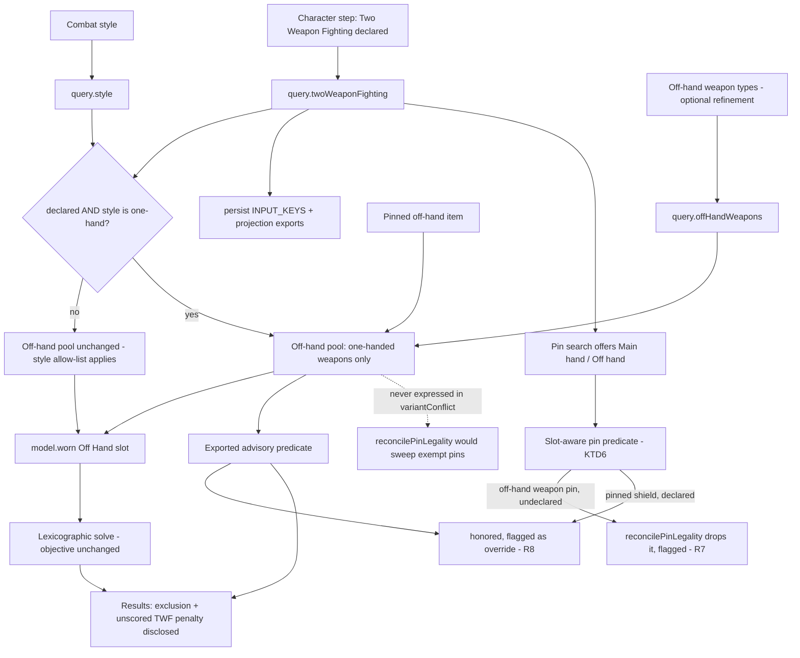

# Off-Hand Dual Wield Declaration - Plan

## Goal Capsule

- **Objective:** Let a player who dual-wields say so, and have the off hand follow. Replace an undiscoverable gear-control side effect with an explicit character-level declaration.
- **Product authority:** eddiefiggie (project owner).
- **Open blockers:** None.
- **Product Contract preservation:** Product Contract unchanged — R1–R11, AE1–AE4, and the four Key Decisions are carried verbatim. Planning added the Planning Contract, Implementation Units, Verification Contract, and Definition of Done below.
- **Reports addressed:** 2026-08-05 batch report 4 (a longsword cannot be pinned to the off hand; shields and rune arms keep filling the slot).

---

## Product Contract

### Summary

Add a Two Weapon Fighting declaration to the character step, alongside race, armor, and weapon setup. Off-hand weapon candidacy follows the declaration rather than switching on when a player happens to add a weapon type to the off-hand control. Give the pin flow a hand target so a one-handed weapon can be pinned to either hand.

### Problem Frame

Dual-wield is implemented but unreachable by default. It activates only when a player adds a second weapon type to the off-hand control, which nothing signposts, so the off hand fills with shields, orbs, and rune arms and the player concludes the tool does not support dual-wielding.

Pinning does not rescue it. Every weapon pin is routed to the main hand regardless of intent, so a longsword pinned as an off-hand pick silently lands in the main hand instead. The reported behavior therefore has two independent causes, and fixing only the gate would leave the pin path still wrong.

The gate exists for a real reason: DDO penalizes off-hand attacks without the Two Weapon Fighting feat chain, and the optimizer does not model feats. Making dual-wield automatic for one-handed styles would hand players builds they cannot execute. A declaration states the feat honestly instead of hiding a feat requirement inside a gear control.

### Key Decisions

- **Dual-wield is a character-level feat declaration.** (session-settled: user-directed — chosen over keeping the opt-in and making it discoverable, over auto-enabling for one-handed styles, and over honoring a pin alone: the optimizer does not model feats, so an automatic rule would produce unexecutable builds, and a declaration models the requirement rather than concealing it.)

- **The declaration is character state, not gear state.** Changing combat style never clears it. (user-approved — chosen over folding it into the existing style reset that clears weapon and off-hand selections: silently un-declaring a feat the character has would contradict its persistence and surprise the player.)

- **A declared build excludes shields, orbs, and rune arms from the off hand.** Declaring Two Weapon Fighting means the off hand holds a weapon, not that weapons merely compete for it. (session-settled: user-directed — chosen over letting one-handed weapons compete on merit: the solver has no weapon-versus-shield value model, and a shield usually carries more ranked stats than a longsword, so "compete" would return a shield and the reported behavior would survive the fix. The player keeps an escape hatch — pinning a shield overrides the exclusion, flagged inline per R8 — and R10 discloses that the comparison was narrowed.)

- **Per-style off-hand rules are preserved.** The declaration governs styles that permit a second weapon; every other style keeps its existing allow-list. (user-approved — chosen over a single global off-hand rule: shipped styles already restrict the off hand to shields, to rune arms, or to nothing, and a global rule would regress those constraints.)

### Requirements

**The declaration**

- R1. Two Weapon Fighting is declared on the character step alongside race, armor, and weapon setup, rather than switching on as a side effect of the off-hand control.
- R2. The declaration is a character property: changing combat style never clears it.
- R3. Under a style that permits a second weapon, a declared build fills the off hand with a one-handed weapon: shields, orbs, and rune arms leave off-hand candidacy unless the player pins one.
- R4. Under a style that forbids a second weapon, the control stays set but renders inert with a stated reason.
- R5. Every other style keeps its existing off-hand type allow-list unchanged.

**Pinning**

- R6. A one-handed weapon can be pinned to either hand, with the pin flow offering a hand target rather than routing every weapon to the main hand.
- R7. An off-hand weapon pin made without the declaration is accepted, flagged inline with a stated reason, and suppressed from the solve, matching the existing warn-don't-block pin convention.
- R8. A pin that overrides the declaration's off-hand rule is flagged inline with its reason, so the player is never left to wonder why the off hand holds what it holds.

**Persistence and disclosure**

- R9. The declaration persists with the saved character and travels with a shared or exported loadout.
- R10. Results disclose both limits of a declared build: shields, orbs, and rune arms were excluded from the off hand (and a pin restores them), and the optimizer does not score the Two Weapon Fighting penalty itself.
- R11. The declaration control and the pin flow's hand target are keyboard-operable, focus-managed, and announced.

### Acceptance Examples

- AE1. The off hand follows the declaration.
  - **Given:** a style that permits a second weapon, with Two Weapon Fighting undeclared.
  - **When:** the player pins a longsword to the off hand.
  - **Then:** the pin is accepted, flagged with a stated reason, and suppressed from the solve; after declaring Two Weapon Fighting, the same pin is honored.
  - **Covers R3, R6, R7.**

- AE2. The declaration survives a style change.
  - **Given:** a character with Two Weapon Fighting declared.
  - **When:** the player switches to a style that forbids a second weapon, then back.
  - **Then:** the declaration is still set throughout, rendering inert with a stated reason while the forbidding style is active.
  - **Covers R2, R4.**

- AE3. Other styles are unaffected.
  - **Given:** a style whose off hand is restricted to shields, and another restricted to rune arms.
  - **When:** the player declares Two Weapon Fighting.
  - **Then:** each style keeps its existing off-hand allow-list.
  - **Covers R5.**

- AE4. The declaration travels.
  - **Given:** a saved character with Two Weapon Fighting declared.
  - **When:** the player reloads it and exports the loadout.
  - **Then:** the declaration is present on load and appears in the exported loadout.
  - **Covers R9.**

### Scope Boundaries

- Feats other than Two Weapon Fighting. This plan declares one feat because a report demanded it; a general feat model is its own scope.
- Modeling the Two Weapon Fighting penalty numerically. R10 discloses the limit rather than closing it.
- Reports 1, 2, 3, 5, 6, and 7 — covered by the sibling vocabulary-hygiene and data-reconciliation plans.
- Sword-and-board combat style (#111), which remains a separate enhancement.

### Success Criteria

- A player who dual-wields can express it without discovering an undocumented control, and the off hand holds what they asked for.
- No existing combat style's off-hand behavior changes for a player who never declares Two Weapon Fighting.
- A player never sees an off-hand item without an available account of why it is there.

### Outstanding Questions

**Resolved during planning**

- Whether a declared build excludes shields or merely lets weapons compete — **excluded** (see Key Decisions). Noted honestly: DDO does permit an off-hand shield with the feat chain trained, so this models the character more narrowly than the game does. The pin escape hatch and R10's disclosure are what keep that honest rather than hidden.

**Deferred to planning — now answered (see Planning Contract)**

- Whether the declaration replaces the existing off-hand weapon-type control or sits above it, and what a saved character already carrying off-hand weapon types resolves to on load. — **Replaces the opt-in *trigger*** (KTD3); the picker control itself survives as optional refinement. A saved character carrying off-hand weapon types is **migrated to declared** and told (KTD4).
- What shape the pin flow's hand target takes, and what the default is for a one-handed weapon. — A one-handed weapon's search hit offers **both hands, with Main hand as the default action**; every other pinnable item keeps its single slot-labelled action (U5).
- Whether the declaration renders in the results paperdoll as a character attribute alongside race and armor. — **Not in this plan.** R10's disclosure carries the player-facing account; a paperdoll character-attribute row is presentation polish outside R1–R11.

### Dependencies and Assumptions

- The optimizer does not model feat effects; the declaration gates candidacy only, which is why R10 discloses the limit.
- The shipped per-style off-hand allow-lists are correct and are preserved rather than re-derived.
- The existing pin convention is warn-don't-block, with illegal pins flagged and suppressed for the current solve rather than refused outright.

### Sources and Research

- `data/bug_reports.txt` — report 4 verbatim, including that the current logic keeps putting a shield or rune arm in the off hand.
- `web/model.js` and the weapon taxonomy — the off-hand gate, the opt-in condition that makes dual-wield unreachable, and the per-style allow-lists.
- `web/wizard.js` — the combat-style selector and its reset of adjacent gear state, the pin search and its routing of every weapon to the main hand, and the pin-legality reconcile path that drops conflicting pins.
- `docs/plans/2026-08-01-002-feat-weapon-armor-offhand-constraints-plan.md` — the shipped weapon and off-hand constraint work this plan extends.
*Added during planning (research only — no requirement changed):*

- `web/weapon-taxonomy.js` — `twfWeaponAllowedForStyle` (true for `one-hand` only), `offHandTypesForStyle` (crossbow → rune arms; sword-board → the four shield types), and `offHandEnabledForStyle`.
- `web/persist.js` `INPUT_KEYS` — the saved-character input allowlist the declaration must join.
- `web/projection.js` — the single content source every share export reads.

---

## Planning Contract

### Key Technical Decisions

- KTD1. **The declaration is a query field; the off-hand exclusion is a candidacy filter, deliberately NOT part of `variantConflict`.** `reconcilePinLegality` drops any pin whose `variantConflict` is non-null, so expressing "a declared build excludes shields" there would sweep the very shield pins R3's escape hatch exists to protect — the feature would delete its own escape. The exclusion applies where the off-hand pool is assembled in `web/model.js`, after eligibility, so a pinned shield is never a conflict and never reconciled away. Grounds R3, R8. (Inherits the Product Contract's shield-exclusion decision.)
- KTD2. **"A style that permits a second weapon" resolves to exactly `one-hand`.** `twfWeaponAllowedForStyle` already returns true only for that style, and `offHandTypesForStyle` already restricts crossbow to rune arms and sword-and-board to the four shield types. R4 and R5 need no new style logic — they are satisfied by leaving the shipped taxonomy alone and scoping the declaration's effect to the one style it applies to. Grounds R4, R5.
- KTD3. **The declaration replaces the current opt-in trigger rather than sitting beside it.** Dual-wield activates today when `query.offHandWeapons` is non-empty. Keeping both would leave two ways to turn the same behavior on, which is the discoverability problem this plan exists to fix. After this, the declaration is the switch and the weapon-type picker is optional refinement narrowing which one-handed types compete. Grounds R1, R3.
- KTD4. **A saved character with off-hand weapon types picked is migrated to declared, and told.** Those players had dual-wield on under the old trigger; leaving them inert would silently return a shield on their next solve. Migration happens on load and is disclosed through the existing stale-build bar, so the declaration never appears on a character sheet without the player being able to see it arrived and turn it off. Grounds R9. (session-settled: user-directed — chosen over leaving it inert-and-flagged and over migrating silently.)
- KTD5. **Pin routing becomes slot-aware in one place.** `pinWornSlotOf` is a single unconditional line sending every `category === "weapon"` to `"Main Hand"`. R6's hand target is the only pin *routing* change required; the rest of the pin machinery (`applyPinId`, `removePinFrom`, the cardinality rules) is unchanged. Grounds R6.

- KTD6. **Pin legality gains a slot-aware layer beside `variantConflict`, and it is the single source for both pin flags and the results disclosure.** `variantConflict` is per-variant and slot-blind: an undeclared off-hand weapon pin is a one-handed weapon that passes `mainHandWeaponOk`, so it returns null and nothing suppresses the pin — but with the declaration off, `allowedOffHandWeaponTypes` returns null and the weapon never enters the off-hand pool, so the pin becomes a constraint on a variant absent from its own slot: a no-build, not the graceful suppression R7 asks for. Add a slot-aware predicate in `web/model.js` taking `(variant, slotKey, query)`, layered *on top of* `variantConflict` rather than inside it, and consult it from `reconcilePinLegality` alongside the existing check. It returns a reason for an off-hand weapon pin without the declaration (R7 — dropped and flagged) and **null for a pinned shield on a declared build** (R8 — honored, flagged separately as an override), which is exactly what keeps KTD1's escape hatch intact. Export the declared-build exclusion itself as one advisory predicate from the same module so U5's inline flag and U6's disclosure read the same authority — the shipped inline flags report exactly `variantConflict` precisely so no hand-mirrored copy can drift, and a second flag source invented in the view layer would reintroduce that drift. Grounds R7, R8, and R10's exclusion sentence.

### High-Level Technical Design

The declaration enters as one query field and reaches three places: the off-hand pool (candidacy), the pin flow (hand target), and the results disclosure. Nothing touches the solver's objective.

### Assumptions

- **"Inert" means settable but without effect, with a stated reason — not `disabled`.** Under a style that forbids a second weapon the control still accepts a click, so declaring is possible from any style (AE3's flow) and no state is destroyed. What changes is that the declaration has no candidacy effect and says so.
- The declaration is a boolean on the character step. Modelling the TWF feat *chain* (Two Weapon Fighting / Improved / Greater) is not required — R3's candidacy gate is binary, and the optimizer does not score the feat's numeric effects (R10).
- The stale-build bar is the right surface for KTD4's migration notice; it already exists for catalog-change disclosure and carries a re-solve action.
- A pinned off-hand item overrides the exclusion for that slot only — it does not re-enable shields as general candidates.
- `query.offHandWeapons` keeps its current meaning (a narrowing list), so no persisted value changes shape.

### Sequencing

U1 introduces the declaration and its persistence, and everything else depends on it. U2 (candidacy) follows, and it exports the advisory predicate KTD6 needs. U3 (style-state behavior, refines U1's control) and U4 (migration, depends on U1's persistence) are independent of U2 and of each other. U5 (pin hand target and slot-aware legality) depends on U1 and U2 — R8's override flag has nothing to describe before U2 exists. U6 (disclosure) depends on U2, since it describes what U2 excluded.

Order: U1 → U2 → {U3, U4, U5, U6}.

---

## Implementation Units

### U1. Two Weapon Fighting declaration on the character step

- **Goal:** Give the player one explicit control that says "this character dual-wields", persisted with the character.
- **Requirements:** R1, R2, R9, R11 (KTD3).
- **Dependencies:** none.
- **Files:** `web/wizard.js` (character-step control, `state.twoWeaponFighting`, `buildQuery` emission), `web/persist.js` (`INPUT_KEYS`), `web/projection.js` (carry the declaration into the shared content projection so exports see it), `tests/wizard.test.js`, `tests/persist.test.js`, `tests/projection.test.js`, `tests/exporters.test.js`.
- **Approach:** Add the declaration beside race, armor, and weapon setup on the character step, and emit it as `query.twoWeaponFighting`. It is character state, not gear state: the combat-style change handler currently clears `weaponTypes`, `offHand`, and `offHandWeapons` together, and the declaration must **not** join that reset (R2). Add it to `INPUT_KEYS` so it round-trips, and route it through the shared projection so every share export carries it alongside the other character attributes rather than being solve-visible and share-invisible.
- **Patterns to follow:** the existing race/armor/oath character-step controls and their `INPUT_KEYS` entries; the projection-as-single-content-source rule that keeps results and exports from drifting.
- **Test scenarios:**
  - Declaring Two Weapon Fighting sets `query.twoWeaponFighting`; not declaring leaves it absent or `false`.
  - Changing combat style leaves the declaration set, while the adjacent gear fields still reset. Covers AE2.
  - The declaration survives save → reload as an input. Covers AE4.
  - The declaration appears in the shared content projection and in a shared/exported loadout. Covers AE4.
  - A character saved before this unit loads without the field and defaults to undeclared.
  - The declaration control is keyboard-operable, focus-managed, and announced. Covers R11.

### U2. Off-hand candidacy follows the declaration

- **Goal:** A declared build fills the off hand with a one-handed weapon; shields, orbs, and rune arms leave candidacy unless pinned.
- **Requirements:** R3, R5 (KTD1, KTD2, KTD3).
- **Dependencies:** U1.
- **Files:** `web/model.js` (`allowedOffHandWeaponTypes` keys on the declaration; off-hand pool assembly applies the exclusion), `tests/model.test.js`, `tests/constraints.test.js`, `tests/solver.test.js` for the end-to-end selection proof.
- **Approach:** `allowedOffHandWeaponTypes` currently returns null unless `query.offHandWeapons` is non-empty — that opt-in becomes the declaration, with the picked types narrowing the allowed list when present and every one-handed type allowed when absent (KTD3). At off-hand pool assembly, when the declaration holds under the `one-hand` style, drop the off-hand **items** (shields, orbs, rune arms) from the pool, keeping any that are pinned to that slot. The exclusion lives here and **not** in `variantConflict`, because `reconcilePinLegality` drops pins whose `variantConflict` is non-null and would sweep the exempt pins (KTD1). Export the exclusion test as the advisory predicate KTD6 names, so U5's pin flag and U6's disclosure both read this one authority rather than re-deriving it.
- **Execution note (guard):** the `one-hand` guard is load-bearing beyond the tested styles — `unarmed` is the other style whose off-hand allow-list is null (unrestricted), so a declaration-keyed exclusion that forgets to check the style would silently empty its off hand. Test it explicitly.
- **Execution note:** Start from a failing end-to-end solve — a declared one-hand build whose best off-hand item is a shield should return a weapon after this unit and a shield before it. That failure is the reported bug.
- **Patterns to follow:** the existing off-hand pool assembly and its TWF concat in `web/model.js`; the hand-mutex guard in `web/solver.js` that already stops one item filling both hands.
- **Test scenarios:**
  - Declared + `one-hand`: a shield that would otherwise win the off hand is not a candidate; a one-handed weapon fills it. Covers AE1.
  - Undeclared + `one-hand`: the off hand still offers shields, orbs, and rune arms exactly as before.
  - Declared + `sword-board`: the four shield types still apply — the declaration does not override another style's allow-list. Covers AE3.
  - Declared + `crossbow`: rune arms still apply. Covers AE3.
  - Declared + `unarmed`: orbs, shields, and rune arms remain off-hand candidates — the exclusion is keyed on `one-hand`, not on the declaration alone.
  - Declared with specific off-hand weapon types picked: only those types compete.
  - A shield pinned to the off hand survives the exclusion and is equipped. Covers AE1.
  - End-to-end (real HiGHS): a declared build returns a one-handed weapon in the off hand where the same query returned a shield before.

### U3. Declaration behavior across style states

- **Goal:** The control reads sensibly in every combat-style state rather than silently doing nothing.
- **Requirements:** R4 (KTD2).
- **Dependencies:** U1.
- **Files:** `web/wizard.js` (control render + inert state), `tests/wizard.test.js`.
- **Approach:** Three states, and in all three the control **accepts input** — "inert" here means *no candidacy effect, with a stated reason*, not `disabled` (see Assumptions). With no style chosen, the declaration is settable and simply has no effect until one is. Under `one-hand`, it is active. Under a style that forbids a second weapon — two-handed, bow, crossbow, sword-and-board, unarmed — it stays settable and stays set, renders its reason, and has no effect, so switching styles never destroys the declaration (R2), never silently ignores it, and never blocks a player from declaring ahead of a style change (AE3).
- **Patterns to follow:** the existing inline-help conventions on the character step; the shipped warn-don't-block posture, which explains rather than disables.
- **Test scenarios:**
  - With no style chosen, the declaration is settable and the off-hand pool is unchanged.
  - Under `one-hand`, the control is active.
  - Under `thf`, `ranged`, `crossbow`, `sword-board`, and `unarmed`, the control renders its reason, the declaration remains set, and off-hand candidacy is unchanged. Covers AE2, AE3.
  - The declaration can be *newly set* while a forbidding style is active, and takes effect on switching to `one-hand`. Covers AE3.
  - Switching from an inert style back to `one-hand` re-activates it with the declaration intact. Covers AE2.

### U4. Migrate saved characters that used the old opt-in

- **Goal:** A player who had dual-wield on under the old trigger keeps it, and can see that the declaration arrived.
- **Requirements:** R9 (KTD4).
- **Dependencies:** U1.
- **Files:** `web/wizard.js` — the saved-character load path, which is where the shipped one-time pre-overhaul migration and the `wz-stale` bar both already live (not `web/persist.js`, which cannot reach either) — plus `tests/wizard.test.js` and `tests/persist.test.js`.
- **Approach:** On load, a saved character with no `twoWeaponFighting` field but a non-empty `offHandWeapons` gets the declaration set — those players had dual-wield active under the old trigger, and leaving them undeclared would silently return a shield on their next solve. Disclose it through the existing stale-build bar so the declaration never appears on a character sheet unannounced, and so it can be turned off. Idempotent: a character already carrying the field is untouched.
- **Execution note:** This is a one-time read-path migration, not a data rewrite — mirror how the pre-overhaul loadout migration is handled rather than mutating stored saves.
- **Patterns to follow:** the existing one-time load migration for pre-overhaul persisted loadouts.
- **Test scenarios:**
  - A save with `offHandWeapons` set and no declaration loads with the declaration set, and the notice renders.
  - A save with neither loads undeclared, with no notice.
  - A save already carrying the declaration is unchanged, with no notice.
  - Re-loading a migrated character does not re-fire the notice.

### U5. Hand target in the pin flow

- **Goal:** A one-handed weapon can be pinned to either hand, so an off-hand weapon pin is expressible at all.
- **Requirements:** R6, R7, R8, R11 (KTD1, KTD5, KTD6).
- **Dependencies:** U1, U2 — R8's "overrides the exclusion" flag has nothing to describe until U2's exclusion exists.
- **Files:** `web/wizard.js` (`pinWornSlotOf`, the pin-search hit render, the pin-list inline flags, `reconcilePinLegality`), `web/model.js` (KTD6's slot-aware pin predicate), `tests/wizard.test.js`, `tests/model.test.js`.
- **Approach:** `pinWornSlotOf` sends every `category === "weapon"` to `"Main Hand"` unconditionally, so an off-hand weapon pin cannot be expressed today — which is half the reported bug. Make it slot-aware: a one-handed weapon's search hit offers both hands, with Main hand as the default action so existing muscle memory is unchanged; every other pinnable item keeps its single action labelled with its worn slot. Then add KTD6's slot-aware pin predicate in `web/model.js` and consult it from `reconcilePinLegality` beside the existing `variantConflict` check, so two inline flags follow the shipped warn-don't-block convention rather than refusing: an off-hand weapon pin made without the declaration is accepted, flagged, and **dropped by reconcile** — the mechanism R7's "suppressed from the solve" needs, and the one that stops the pin becoming a constraint on a variant absent from its own pool; a shield pinned on a declared build returns null from that predicate, so it is honored, and the exclusion-override flag (R8) reads U2's exported advisory predicate rather than a view-layer copy.
- **Patterns to follow:** the shipped pin-list inline conflict flags and the "warn, don't block — the pins are the player's choice" convention; `applyPinId`'s cardinality handling, which is unchanged; the `variantConflict`-as-single-authority discipline, which KTD6 extends rather than forks.
- **Test scenarios:**
  - A one-handed weapon's search hit offers Main hand and Off hand; Main hand is the default action.
  - A two-handed weapon, a shield, and a non-weapon each keep a single action labelled with their worn slot.
  - An off-hand weapon pin without the declaration is accepted, flagged with a reason, dropped by `reconcilePinLegality`, and **the solve still returns a build**. Covers AE1.
  - The same pin with the declaration set is honored. Covers AE1.
  - A shield pinned on a declared build returns null from the slot-aware predicate, is honored, and is flagged as overriding the exclusion.
  - Pinning the same weapon to both hands is handled without the hand-mutex producing an unsolvable query.
  - The pin flow's hand target is keyboard-operable, focus-managed, and announced. Covers R11.

### U6. Disclose what a declared build narrowed

- **Goal:** A declared build states both of its limits, so "provably optimal" stays truthful about what it solved over.
- **Requirements:** R10 (KTD6).
- **Dependencies:** U2.
- **Files:** `web/results.js` (extend the bound-disclosure notice), `tests/results.test.js`.
- **Approach:** Extend the existing bound notice — the surface whose stated job is naming what was and was not solved over — to cover both limits of a declared build: shields, orbs, and rune arms were excluded from off-hand candidacy and a pin restores them, and the optimizer does not score the Two Weapon Fighting penalty itself, so the off-hand comparison is over item value only. Read the exclusion state from U2's exported advisory predicate (KTD6), not from a re-derivation here, so the notice and U5's pin flag cannot disagree.
- **Patterns to follow:** `boundNotice` in `web/results.js` and its `role="status"` convention; the zero-source notice added alongside it.
- **Test scenarios:**
  - A declared build renders both disclosures.
  - An undeclared build renders neither.
  - A declared build with a pinned shield states that the pin overrode the exclusion.
  - The notice carries `role="status"`.
  - The notice's exclusion wording is driven by the shared advisory predicate — a build where the predicate reports no exclusion renders no exclusion sentence.

---

## Verification Contract

| Gate | Command | Applies to |
|---|---|---|
| Wizard / persistence | `node tests/wizard.test.js` then `node tests/persist.test.js` | U1, U3, U4, U5 |
| Projection / exports | `node tests/projection.test.js` then `node tests/exporters.test.js` | U1 |
| Model / constraints | `node tests/model.test.js` then `node tests/constraints.test.js` | U2, U5 |
| Solver (real HiGHS) | `node tests/solver.test.js` | U2, U5 — including that a dropped illegal pin still returns a build |
| Results | `node tests/results.test.js` | U6 |
| Golden guard | `node tests/solver_golden.test.js` | U2 — candidacy changes can shift a ratified loadout |
| Full JS sweep | every file in `tests/*.test.js`, one invocation each | all units |
| Python suite | `python3 tests/run_tests.py` | regression guard (no pipeline change expected) |
| Syntax check | `node --check` on each edited `web/*.js` | all units |
| Browser smoke | serve `web/` on localhost; declare Two Weapon Fighting, confirm the off hand takes a weapon, pin a shield and confirm it is honored and flagged, pin an off-hand weapon *without* declaring and confirm it is flagged and the solve still returns a build, switch to a forbidding style and confirm the control keeps its state and states its reason, then load a pre-declaration save carrying off-hand weapon types and confirm the migration notice | U1, U2, U3, U4, U5, U6 |

`node a.test.js b.test.js` runs only the first file — invoke each separately. No dataset rebuild is required: this plan changes no seed data or generator.

---

## Definition of Done

- R1–R11 satisfied; AE1–AE4 each covered by an enumerated test.
- A declared build under `one-hand` fills the off hand with a one-handed weapon, and a pinned shield still overrides that.
- Every other combat style's off-hand allow-list is unchanged, verified for `sword-board`, `crossbow`, and `unarmed` specifically — `unarmed` being the other style whose allow-list is unrestricted, and therefore the one a missing style guard would silently empty.
- The declaration survives a combat-style change, a save/reload, and a share export.
- A saved character that used the old off-hand-weapon-types opt-in loads with the declaration set and the migration disclosed.
- A one-handed weapon can be pinned to either hand; an off-hand weapon pin without the declaration is flagged and dropped by reconcile — and the solve still returns a build — rather than silently landing in the main hand or producing a no-build.
- Results disclose both limits of a declared build — the exclusion and the unscored Two Weapon Fighting penalty — reading the same advisory predicate the pin flag reads.
- The shield exclusion is never expressed through `variantConflict`, so `reconcilePinLegality` cannot sweep an exempt pin; the slot-aware pin predicate returns null for a pinned shield on a declared build.
- The declaration control and the pin hand target are keyboard-operable, focus-managed, and announced (R11), covered in `tests/wizard.test.js`.
- All listed gates green, including the golden guard; edited `web/*.js` pass `node --check`.
