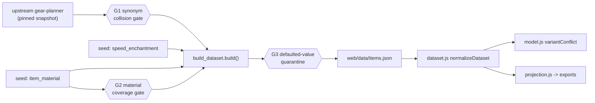

# Speed Enchantment Split and Shield Material Gate - Plan

## Goal Capsule

Close #154 and #162 by sourcing the two fields upstream never carried, then add three
build gates so a future gear-planner re-import cannot silently reintroduce either gap.

**Authority hierarchy:** exclude-until-verified outranks completeness — never infer a
value. The DDO wiki is the source of truth for both harvests. `web/data/items.json` is
generated; edit the pipeline and seed, never the JSON. Gear-planner's set catalog stays
the single source of truth for set definitions.

**Stop conditions:** stop and surface if a harvested field contradicts an existing
`docs/wiki-evidence/` ruling, if the material harvest finds shields the wiki does not
state a material for (that is a quarantine case, not an invention case), or if the
golden solver fixture shifts in a way not explained by alacrity newly appearing on
Speed-enchantment items.

**Tail ownership:** this plan owns implementation and local verification through a green
full test sweep. Branch, PR, and CI are the caller's.

---

## Product Contract

### Summary

Split our single `Speed` affix back into the two game mechanics upstream merged, harvest
shield and body-armor material from the wiki to make the druid oath a real metal
restriction, and gate the build so both gaps stay closed on re-import.

### Problem Frame

Our item roster is a copy of the gear-planner's, and the gear-planner is a stat
calculator: it transcribes the enchantment list from a wiki item page and takes only
minimum level, slot, and item type from the header block. Everything else in that header —
material, proficiency, race and alignment locks — is absent by construction. The
optimizer, unlike the planner, also has to answer "can this character equip this?", and
that answer lives entirely in the half of the tooltip nobody copied. #162 is one instance.

#154 is a different failure inside the half that *was* copied. Upstream's
`affix-synonyms.json` folds `Striding` into `Speed`. DDO has two distinct enchantments
here: `{{Striding|N}}` grants N% movement and nothing else, while `{{Speed|MAG}}` grants
movement **and** melee/ranged attack speed. Both feed the same movement number, so the
planner filed them under one name. The attack-speed half was lost, and the stored value
became ambiguous — `Speed 11` on *Goatskin Boots (level 19)* is a Roman-numeral **rank**
(`{{Speed|XI}}`, rendering as "Speed XI"), not an 11% movement bonus.

The original triage on #154 read those odd values (7, 11, 28 — none a valid movement
percentage) as corruption and concluded the magnitude was unrecoverable. It had the
inference backwards: those numbers *are* the attack-speed values, mislabeled.

Both issues nominated "a gear-planner import that captures the field" as the fix. For
material that is impossible — the full field union across all 8,188 upstream items is
`{affixes, ml, name, quests, slot, type, url, crafting, sets, artifact}`. The wiki route
is the only one, for both.

### Requirements

**Speed correctness (#154)**

- R1. An item whose wiki enchantment is `{{Striding|N}}` contributes N% movement speed and nothing to attack speed.
- R2. An item whose wiki enchantment is `{{Speed|MAG}}` contributes its movement bonus plus melee and ranged attack speed at the wiki-stated magnitude.
- R3. A Speed magnitude whose attack-speed value `Template:Speed` defaults rather than records is quarantined — the item keeps its movement bonus and contributes nothing to alacrity.
- R4. The movement stat carries an unambiguous name in the priority picker, and a saved character that ranked the previous name still resolves to it.
- R5. `Topaz of Swiftness 15%` receives no Melee Alacrity correction.

**Equip legality — material (#162)**

- R6. Shields and body armor carry a wiki-sourced `material`.
- R7. A druidic oath excludes metal shields and metal body armor, replacing the current cloth+light approximation.
- R8. An item with no sourced material fails open — it stays eligible rather than being silently excluded.

**Standing import guards**

- R9. A change to upstream's affix-synonym table fails the build until a human confirms the folded names are the same game mechanic.
- R10. A shield or body-armor item with no material in the seed fails the build, listed by name, and the check is delta-only on re-import.
- R11. Coverage for both harvested fields is disclosed in dataset metadata.

**Harvest operability and parity**

- R12. The wiki harvest is resumable and delta-only — a re-import surfaces only genuinely new items.
- R13. Alacrity components and material flow through `web/projection.js` into all five export outputs.

### Scope Boundaries

In scope: the `Speed`/`Striding` split, the `material` field on shields and body armor,
the druid-oath tightening that material makes possible, and the three build guards.

**Deferred to follow-up work**

- Proficiency, race, alignment, and class-lock fields — the same class of gap, not yet verified as populated on the wiki.
- The inert Alignment selector (`alignment_req` fails open against an empty seed). Same root cause; separate issue.
- Re-harvesting material for non-shield, non-armor slots.

**Outside this plan**

- Any correction to `Topaz of Swiftness 15%`. The wiki's augment table genuinely omits Melee Alacrity for it; writing the value would be inference. It is also strictly dominated by the 10% variant (same movement, no alacrity, higher ML), so the solver never picks it.
- Re-deriving set definitions. Gear-planner's catalog stays authoritative.

### Sources

- `Template:Speed` usage notes — magnitude is a Roman numeral I–XX **or** any integer, and *"the formula by which the attack speed percentage of this enchantment is calculated is unknown, so it must be added to the template manually for new values. If no value has been recorded for an integer, the percentage defaults to 5%."* This is why R3 exists.
- https://ddowiki.com/page/Speed — `+(5*X)%` movement (max 30%), `+X` melee and ranged attack speed; explicitly notes the same effect is obtainable by combining Striding with the alacrities.
- `Raw data/Item augments` — the page gear-planner scrapes for augments. Rows: Swiftness 5% and 10% state `Melee Alacrity`; 15% states only `Speed +30%`.
- Upstream `site/src/assets/affix-synonyms.json` at pinned commit `ec3e595d`: `{"name": "Speed", "synonyms": ["Striding", "movement speed"]}`.
- `docs/solutions/conventions/data-at-rest-can-look-inert-while-runtime-normalizes-it.md` — trace raw → build stamp → artifact → load-time normalizer → consumer before concluding anything is inert.
- `docs/solutions/conventions/exclude-until-verified-empty-seed-masks-consuming-bugs.md` — an empty seed is a false green; test the populated path and restore any module global `build()` installs.
- `docs/solutions/design-patterns/auto-legality-constraints-need-a-pin-conflict-escape-hatch.md` — informs U5's pin interaction.

---

## Planning Contract

### Key Technical Decisions

- KTD1. **Speed components are stamped at build from a per-item seed, not derived at load.** `COMPOSITE_COMPONENTS` in `web/dataset.js` is a static affix-name → fixed-value table and cannot express a per-item magnitude. The rank is sourced data, not derivable logic, so it belongs in a seed the build reads.
- KTD2. **`Striding` becomes an alias of a renamed `Movement Speed`; `Speed` becomes an expanded-away umbrella over movement + melee alacrity + ranged alacrity.** *(session-settled: user-approved — chosen over keeping the "Speed" label: the ambiguous label is what made the original report read as a solver failure.)* The two halves are different mechanisms because the two words mean different things. `Striding` and `Movement Speed` are the same stat, so the alias table canonicalizes one to the other silently. `Speed` is not a stat at all — in game it names an enchantment granting three of them, which is why ranking it looked broken. That is precisely the umbrella case `src/umbrella.py` and `metadata.expanded_away_names` already handle for the ability-score umbrellas (#136): drop the name from suggestions and redirect the player to the three concrete stats. Offering `Speed` as a rankable priority would otherwise guarantee a partial score against the player's actual intent.
- KTD3. **The material gate lives in `variantConflict`, beside the R7 armor-type gate.** It is a per-variant eligibility filter of exactly that shape, not a MILP constraint, so the pin-escape-hatch learning does not apply directly — but a pinned metal shield under a druid oath must surface through `pinConflict` as a suppressed pin, never a no-build.
- KTD4. **The three guards hard-fail the build.** *(session-settled: user-approved — chosen over warn-and-ship: a warning on a generated artifact is invisible by the time the dataset reaches the solver.)*
- KTD5. **A defaulted attack-speed value quarantines the component, not the item.** *(session-settled: user-approved — chosen over dropping the item from the roster: the movement bonus is still sourced and correct.)*
- KTD6. **Two new seed shards, not `gap_corrections.json`.** That overlay's scope rule is narrow and deliberate — affixes gear-planner under-parsed on items it already carries. `material` is a new item field and the Speed split re-interprets an existing affix; neither fits, and overloading the overlay would blur the rule that keeps it safe. (It currently holds only `_meta` — its one entry was reverted.)
- KTD7. **Freeze upstream `affix-synonyms.json` as a checked-in registry.** Mirrors the frozen crafting-slot and augment registries that `assert_crafting_vocab()` already diffs, so the new gate is a second instance of an established pattern rather than a new mechanism.
- KTD8. **Backfills and guards ship as one plan.** *(session-settled: user-directed — chosen over building guards first or closing the two tickets first: the guards' coverage gate needs the backfilled seed to have something to assert against.)*
- KTD9. **Legality gating covers `material` only, on shields and body armor.** *(session-settled: user-directed — chosen over gating all equip-legality fields now: material is the only one verified as populated on the wiki.)*

### High-Level Technical Design

How a `Speed` affix is classified. The three outcomes are distinguished by what the wiki
states, never by inference from the stored number:

```mermaid
flowchart TD
  A["gear-planner affix: Speed = N"] --> B{"wiki template<br/>on the item page"}
  B -->|"{{Striding&#124;N}}"| C["Movement Speed N%<br/>no alacrity"]
  B -->|"{{Speed&#124;MAG}}"| D{"attack-speed value<br/>recorded for MAG?"}
  D -->|"yes — stated"| E["Movement Speed + <br/>Melee Alacrity X + Ranged Alacrity X"]
  D -->|"no — template default 5%"| F["Movement Speed only<br/>alacrity quarantined (R3)"]
  B -->|"page missing / no template"| F
```



Where each guard sits in the pipeline, and what it protects:



### Assumptions

- The wiki states a material for the large majority of shields. Any that lack one fail open per R8 and are listed by the coverage gate as known-unsourced rather than blocking forever — U7 defines that allowlist.
- Body-armor material values map cleanly onto a metal / non-metal classification. Values already observed: Mithral, Steel, Dwarven Iron, Leather. The classification table is itself seed data subject to exclude-until-verified.

### Risks & Dependencies

- **The harvest needs a working Chrome extension.** ddowiki returns empty to server-side fetch, and the extension disconnected mid-investigation. Units U2 and U4 are blocked on it; every other unit is not. Sequence accordingly.
- **ddowiki throttles.** Rapid bursts trigger a persistent 202-empty Cloudflare block. The established pacing (20 titles per POST, ~1.5s between requests, backoff on non-JSON) is in U1.
- **Golden solver drift is expected, not a regression.** Alacrity newly appears on Speed-enchantment items, so any build ranking Melee or Ranged Alacrity may legitimately change. Re-ratify `tests/solver_golden.test.js` deliberately and record why.
- **Druid results change for existing users.** Tightening the oath from cloth+light to a real metal test makes Darkleaf and Dragonhide medium/heavy armor newly eligible. This is the correction, but it will look like a behavior change.

### Open Questions

- Deferred: whether the metal / non-metal classification should treat an unrecognized material as metal (conservative, matches today's oath) or non-metal (fails open, matches R8). R8 argues fail-open; the current oath is conservative. Resolve during U5 against the actual harvested value distribution — the answer only matters for values the harvest turns up that are not in the seed classification table.

---

## Implementation Units

### U1. Wiki harvest driver and provenance model

**Goal:** A resumable, delta-only harvest that turns wiki item pages into a validated seed shard, stamping every value as stated or defaulted.

**Requirements:** R12, R3.

**Dependencies:** none.

**Files:**
- `scripts/merge_harvest.py` (new) — validate a raw harvest dump into a seed shard; idempotent, delta-aware, provenance-stamping.
- `docs/wiki-evidence/harvest-method.md` (new) — the browser-side method.
- `tests/test_merge_harvest.py` (new)

**Approach:** The harvest itself runs in the browser (same-origin MediaWiki API from a
ddowiki tab); this unit owns the repo-side half. `merge_harvest.py` takes a raw dump keyed
by wiki title, validates each record against a schema, and merges into the target shard
without clobbering existing entries. Every value carries `provenance: stated | defaulted`
and the harvest date. Delta support is a `--missing-only` mode that reads the current shard
plus the item roster and emits the titles still unharvested — that list is what makes a
re-import cheap.

Record in `harvest-method.md`: POST to `/api.php` (a GET with 50 titles exceeds the URL
limit and returns an HTML error page), 20 titles per request, ~1.5s spacing, retry with
backoff on non-JSON, accumulate keyed by title so the loop is resumable, and strip
`| = & ?` before returning anything (the privacy guard reads raw wikitext as query-string
data and blocks it).

**Patterns to follow:** the shard-loading and coverage-returning shape of
`load_gap_corrections` / `apply_gap_corrections` in `build_dataset.py`.

**Test scenarios:**
- Merging a dump with two new records into an empty shard produces both, each with provenance and harvest date.
- Re-merging the same dump is a no-op — no duplicates, no date churn.
- Merging a dump whose record contradicts an existing shard entry raises rather than silently overwriting.
- A record missing its provenance field is rejected.
- `--missing-only` against a shard covering 2 of 5 roster items emits exactly the 3 unharvested titles.
- A dump containing a title absent from the roster is ignored, not merged.

**Verification:** `python3 tests/run_tests.py` passes; `--missing-only` on the empty shard emits the full 194 / 316 target lists.

---

### U2. Speed enchantment seed shard

**Goal:** Classify all 194 items carrying a gear-planner `Speed` affix as Striding, recorded Speed rank, or defaulted.

**Requirements:** R1, R2, R3, R5.

**Dependencies:** U1.

**Blocked on:** a working Chrome extension.

**Files:**
- `data/seed/compendium/speed_enchantment.json` (new)
- `docs/wiki-evidence/speed-and-alacrity.md` (rewrite)

**Approach:** Harvest each item's wikitext and record which template it carries and the raw
argument. Roman numeral means rank: movement is `min(5*rank, 30)`, attack speed is the rank.
An Arabic argument is the movement percentage, and its attack-speed value comes from
`Template:Speed`'s hand-maintained switch — anything landing on the `#default` 5% is
`provenance: defaulted` and yields no alacrity. Store the raw template argument verbatim
alongside the derived values so a future reviewer can re-derive without re-harvesting.

Rewrite the evidence doc: its "the magnitude is not recoverable" conclusion is superseded,
and its Topaz section's "site search returns nothing" check was unreliable — `insource:`
search is disabled on this wiki and returns empty even for strings that demonstrably exist.
The Topaz 15% verdict itself stands, on the stronger augment-table citation.

**Execution note:** Harvest a first batch of ~20 and hand-check several against rendered
pages before committing to the full run — the Roman/Arabic split is the load-bearing
assumption and it is cheap to falsify early.

**Test scenarios:**
- A Roman-rank fixture (`{{Speed|XI}}`) yields movement 30 and alacrity 11.
- A low Roman rank (`{{Speed|IV}}`) yields movement 20, not the 30 cap.
- A Striding fixture (`{{Striding|30}}`) yields movement 30 and no alacrity key at all.
- An Arabic magnitude present in the template switch (21) yields its recorded attack-speed value with `provenance: stated`.
- An Arabic magnitude absent from the switch yields `provenance: defaulted` and no alacrity.
- Every shard entry's raw template argument round-trips to its derived values.
- No shard entry names `Topaz of Swiftness 15%`.

**Verification:** shard covers all 194 roster items; the stated/defaulted split is recorded in the evidence doc.

---

### U3. Speed split at build, and the Movement Speed rename

**Goal:** Emit movement and alacrity affixes from the shard, and make the movement stat unambiguous in the picker.

**Requirements:** R1, R2, R3, R4, R13.

**Dependencies:** U2.

**Files:**
- `build_dataset.py` — load the shard, expand affixes
- `src/verify.py` — quarantine reason for a defaulted component
- `data/seed/compendium/affix_aliases.json` — `Striding` → `Movement Speed`
- `src/umbrella.py` — register `Speed` as an umbrella over the three concrete stats
- `web/projection.js`, `web/exporters.js` — carry the components into exports
- `web/app.js`, `web/index.html` — `BUILD` and `?v` bump
- `tests/test_speed_enchantment.py` (new)
- `tests/projection.test.js`, `tests/exporters.test.js`

**Approach:** At build, an item present in the shard has its `Speed` affix rewritten to
`Movement Speed` at the derived movement value, and — when the rank is stated — gains
`Melee Alacrity` and `Ranged Alacrity` at the rank, both Enhancement type. This is additive
in the spirit of the existing composite expansion: the movement affix survives, so a
movement-speed target still finds it. Never emit an alacrity affix the item already carries
explicitly (`Jorgundal's Collar` and the Mithral Full Plate Striding version both already
carry Melee Alacrity from upstream) — the anti-double-count guard in `apply_gap_corrections`
is the precedent.

The picker vocabulary is `metadata.rankable_affixes`, built in `rankable_affixes()`, which
already drops umbrella names — registering `Speed` there removes it from suggestions, and
`expandedAwayMessage` supplies the redirect. `Striding` resolves through `canonical()` on the
alias table. A persisted loadout that ranked either name routes through the existing
`migrateLoadout`. Verify at runtime rather than assuming — trace seed → build stamp →
`normalizeDataset` → picker, per the data-at-rest learning.

**Execution note:** Bump `BUILD` in `web/app.js` and the `?v` query on every changed
`web/*.js` — four prior PRs shipped browser changes without it and the footer under-reported
for two days.

**Test scenarios:**
- A stated-rank item emits movement + both alacrities; a Striding item emits movement only.
- A defaulted item emits movement, no alacrity, and a quarantine reason naming the template default.
- An item already carrying `Melee Alacrity` from upstream does not receive a second one.
- Expansion is idempotent — a second build pass adds nothing.
- Ranking `Melee Alacrity` now attributes points to a Speed-enchantment item that previously contributed none.
- Typing `Striding` in the picker resolves silently to `Movement Speed`.
- `Speed` is absent from picker suggestions and typing it returns a redirect naming all three concrete stats.
- A saved character that ranked `Speed` or `Striding` loads with its priority order intact and no dropped entry.
- The alacrity components appear in the Markdown, CSV, and print exports and in the portable loadout JSON.

**Verification:** full JS sweep green; `tests/solver_golden.test.js` re-ratified with the alacrity shift explained in the commit.

---

### U4. Item material seed shard

**Goal:** Harvest `| material =` for all 316 shield variants and body armor.

**Requirements:** R6, R12.

**Dependencies:** U1.

**Blocked on:** a working Chrome extension.

**Files:**
- `data/seed/compendium/item_material.json` (new)
- `docs/wiki-evidence/item-material.md` (new)

**Approach:** Harvest the infobox `material` field per item page. Record the raw value
verbatim — do not normalize case or collapse synonyms at harvest time; classification is U5's
job and keeping the raw value means a reclassification never needs a re-harvest. Items whose
page states no material are recorded explicitly as unsourced rather than omitted, so U7's
coverage gate can distinguish "not yet harvested" from "harvested, wiki is silent".

**Test scenarios:**
- Four known shields land their observed materials: Aegis of Flame → Mithral, Adherence → Steel, Azure Buckler → Steel, Alchemical Light Shield → Dwarven Iron.
- An item page with no material field records as unsourced, not absent.
- The shard covers every shield and body-armor variant in the roster or lists it as unsourced.

**Verification:** shard entry count plus unsourced count equals the roster's shield + armor variant count.

---

### U5. Material gate and druid oath tightening

**Goal:** Exclude metal shields and metal body armor under a druidic oath, replacing the cloth+light approximation.

**Requirements:** R6, R7, R8, R13.

**Dependencies:** U4.

**Files:**
- `src/variants.py` — stamp `material` onto variants from the shard
- `build_dataset.py` — load the shard
- `data/seed/compendium/material_classification.json` (new) — material → metal / non-metal
- `web/model.js` — the gate in `variantConflict`
- `web/wizard.js` — oath wiring and help text; check `web/query.js`, which builds its own query and carries the same armor field
- `web/projection.js` — surface material in exports
- `tests/test_material.py` (new), `tests/model.test.js`, `tests/wizard.test.js`

**Approach:** Stamp `material` in `_make_variant` alongside `armor_type`, so the artifact is
honest at rest. The gate sits next to the R7 armor-type branch and follows its failure
posture exactly: fail open on absent or unsourced material. The oath stops passing
`armorTypes: ["cloth","light"]` and instead declares a metal restriction that the gate
applies to both body armor and the off hand. Replace the wizard's approximation note — it
currently tells the user Darkleaf and Dragonhide are indistinguishable, which stops being
true.

A pinned metal shield under an active oath must surface through `pinConflict` as a
suppressed pin with a readable reason, not silently produce a no-build.

**Execution note:** Add a populated-seed test, not just the empty-seed default — an
exclude-until-verified seed that ships empty is a false green, and this exact class of bug
bit the boolean-feature allowlist.

**Test scenarios:**
- A druid oath excludes a Steel large shield and a Mithral tower shield.
- A druid oath admits a Darkleaf medium body armor that the cloth+light approximation previously excluded.
- An item with unsourced material stays eligible under an oath (fail open, R8).
- A non-druid character is unaffected by material entirely.
- Pinning a metal shield with the oath on reports a pin conflict rather than producing a no-build.
- `material` survives `normalizeDataset` onto the consumer — asserted end-to-end, not on the artifact at rest.
- Material appears in all five export outputs, not only the loadout deep dive (R13).

**Verification:** full JS sweep green; a druid solve returns a legal loadout with no metal off-hand.

---

### U6. Synonym-collision gate

**Goal:** Fail the build when upstream changes which affix names it folds together.

**Requirements:** R9.

**Dependencies:** none.

**Files:**
- `data/seed/compendium/affix_synonyms_frozen.json` (new)
- `build_dataset.py` — `assert_affix_synonyms()`
- `src/vocabulary.py` — the diff helper
- `tests/test_overhaul_invariants.py`

**Approach:** Freeze upstream's synonym table and diff the live copy against it at build,
mirroring `assert_crafting_vocab()`. A new, removed, or changed mapping raises with the
specific names, so the reviewer's question is concrete: are these the same game mechanic?
Confirming a change means updating the frozen registry in the same commit that handles its
consequences. Seed the frozen copy with the current table — including the `Speed` ←
`Striding` entry this plan is a consequence of, which is what the gate exists to have caught.

**Test scenarios:**
- An unchanged table passes and returns the count of mappings validated.
- Adding a synonym to a live fixture raises, naming the added mapping.
- Removing one raises, naming the removed mapping.
- Re-pointing an existing synonym to a different canonical name raises.
- The raised message names both sides of the fold, not just a count.

**Verification:** `python3 build_dataset.py` succeeds against the pinned snapshot; a mutated fixture fails with a readable message.

---

### U7. Material coverage gate and metadata disclosure

**Goal:** Fail the build when a shield or body armor arrives with no material, and disclose coverage.

**Requirements:** R10, R11.

**Dependencies:** U4, U5.

**Files:**
- `build_dataset.py` — `assert_material_coverage()` and metadata coverage
- `data/seed/compendium/item_material.json` — extended (created in U4) with the known-unsourced allowlist
- `tests/test_overhaul_invariants.py`, `tests/test_build_metadata.py`

**Approach:** Every roster item whose slot is a shield or body armor must resolve in the
material shard, either to a value or to an explicit known-unsourced entry. Anything in
neither bucket fails the build, listed by name — that list is the harvest work order, and it
is delta-only by construction, since previously harvested items already resolve. The
known-unsourced allowlist is what keeps a wiki page that genuinely states no material from
blocking the build forever; it is a deliberate, reviewed entry, not a silent skip.

Surface both harvests' coverage in `metadata` — counts of stated, defaulted, and unsourced —
so results keep disclosing what was and wasn't considered.

**Test scenarios:**
- A roster with full material coverage passes.
- A new shield absent from the shard fails, and the message names it.
- A shield in the known-unsourced allowlist passes without a value.
- The failure lists only the unresolved items, not the whole roster.
- Metadata carries stated / defaulted / unsourced counts for both fields.

**Verification:** removing one shield entry from the shard fails the build naming exactly that shield.

---

### U8. Close out the evidence trail

**Goal:** Leave the rulings and issues consistent with what was actually found.

**Requirements:** R5, R11.

**Dependencies:** U3, U5, U7.

**Files:**
- `docs/wiki-evidence/README.md`
- `docs/wiki-evidence/speed-and-alacrity.md`
- `docs/wiki-evidence/item-material.md`

**Approach:** Record on #154 that the premise was a name collision rather than a dropped
import, and that Topaz of Swiftness 15% is resolved with no correction. Record on #162 that
the upstream-import route is impossible — with the field union as evidence — and that the
wiki route shipped. Note the follow-up gap explicitly: these guards catch regressions in
fields we already know to ask for; a mechanic upstream never modeled and we never thought to
look for still requires a player to notice.

**Test expectation:** none — documentation only.

**Verification:** both issues carry a closing comment stating the corrected root cause.

---

## Verification Contract

```
python3 build_dataset.py                 # must succeed; exercises all three gates
python3 tests/run_tests.py               # Python suite
node tests/solver.test.js                # real HiGHS engine
for f in tests/*.test.js; do node "$f"; done   # all 19 — `node a.js b.js` runs only the first
```

Gates that must hold:

- All 19 JS test files pass individually. `tests/solver_golden.test.js` catches tie-break drift nothing else does; expect it to shift here and re-ratify it deliberately.
- Both new guards fail on a mutated fixture and pass on the real snapshot — a gate that cannot fail is not a gate.
- The material gate is proven on a **populated** seed, not only the empty default.
- Browser pass against a local server for the druid oath and the priority picker, per the project's browser-verify convention.

## Definition of Done

- #154 and #162 both closed with the corrected root cause recorded.
- All 194 Speed items classified; all shields and body armor either carry a material or sit in the reviewed known-unsourced allowlist.
- The three guards are live and each demonstrably fails on a mutated fixture.
- Coverage for both fields appears in dataset metadata.
- The wizard's oath note no longer claims materials are indistinguishable.
- `BUILD` and `?v` bumped for the shipped `web/*.js` changes.
- Alacrity components and material appear in all five export outputs.
- Golden fixture re-ratified with the reason recorded in the commit.
- No exploratory harvest scripts, scratch dumps, or dead-end classification tables left in the diff.
