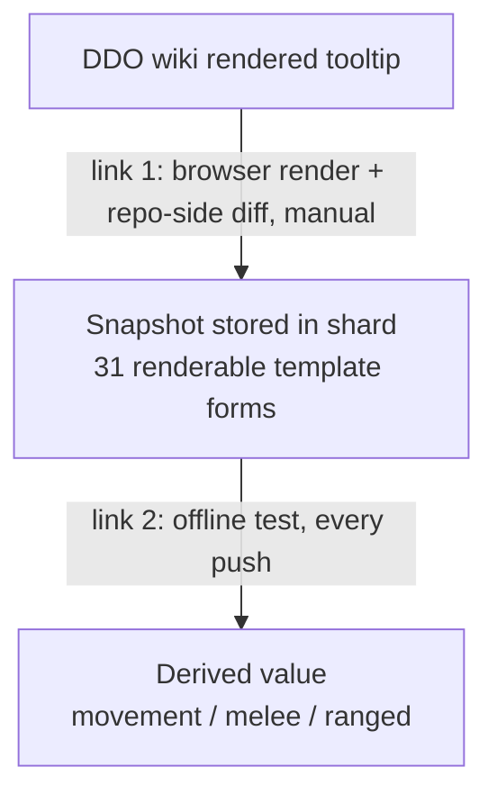

# Augment Speed Alacrity - Plan

## Goal Capsule

- **Objective:** Give the augment pool the same wiki-evidenced Speed/Striding classifier the item pool already has, so `Topaz of Swiftness 15%` grants the melee and ranged alacrity the wiki states — and add a two-link verification chain that keeps our derived numbers tied to the wiki's own rendered text.
- **Product authority:** The DDO wiki. `Raw data/Item augments` and `Template:Speed`, read 2026-08-08 via an interactive browser session. The rendered tooltip is the authoritative magnitude.
- **Open blockers:** None.

---

## Product Contract

### Summary

Augments get the shard-driven Speed/Striding classifier that items already use, correcting `Topaz of Swiftness 15%` to grant Melee Alacrity 15 and Ranged Alacrity 15. Each harvested entry gains a verbatim tooltip snapshot, letting an offline test assert our derived values against the wiki's own rendered text on every push, backed by a paced refresher that detects the wiki moving underneath the snapshots.

### Problem Frame

`Topaz of Swiftness 15%` has been ruled on twice and got a different wrong answer each time. On 2026-08-05 the magnitude was declared unrecoverable. On 2026-08-07 that was superseded by a ruling that the augment grants no alacrity at all and is "strictly dominated by the 10%" — which closed issue #134 as needing no correction. A player reported it a third time.

Both misses share one cause: the effect cell was read as visible text and the tooltip behind it was never opened. The cell renders `Speed +30%`, which looks like a bare movement stat. The tooltip states `+30% enhancement bonus to movement speed, 15% bonus to attack speed`. The augment is not dominated by the 10% — it beats it, and grants ranged alacrity the 10% does not.

The defect is structural, not a bad data point. Items resolve this correctly: `data/seed/compendium/speed_enchantment.json` holds 194 harvested entries and `apply()` in `src/speed_split.py` runs a real classifier against them, producing `{movement: 30, melee: 15, ranged: 15}` for all 73 items using `{{Speed|30}}`. Augments have no shard and no classifier — `apply_to_augments()` is a hardcoded rename whose docstring asserts all three Swiftness tiers render `Striding +30%`, which the wiki contradicts. The augment path cannot express alacrity at all, so the one augment that needs it silently gets zero.

The upstream catalog cannot settle this. gear-planner folds `Striding` into `Speed` and scrapes visible cell text, so five of the seven affected augments arrive carrying `Speed: 30`. Three of those five — Topaz of Striding 30%, Sapphire of Snowpeaks Speed, and Topaz of Swiftness 15% — arrive as a bare `Speed: 30` with nothing else and are genuinely indistinguishable; Topaz of Swiftness 5% and 10% keep a separate explicit Melee Alacrity, and the 10% and 20% Striding tiers keep a distinguishing magnitude. Only the wiki cell and its tooltip separate the three that collide.

### Key Decisions

- **Augments get a shard and the item classifier, not a patch.** (session-settled: user-directed — chosen over a one-augment data correction: the hardcoded path would reintroduce the bug the next time a `{{Speed}}` augment appears, and leaving six augments unevidenced keeps the double-count trap live.) The existing shard is the proven architecture; the gap is that augments never got one.

- **The tooltip becomes a cross-check, not a value source.** Replacing the derivation would swap a working mechanism for an equivalent one, so the tooltip's job is to make the derivation continuously falsifiable instead. One caution: only one of the switch table's nine recorded rows has actually been checked against a tooltip (`{{Speed|30}}` derives 15% and the tooltip reads 15%). Every derived value in the shard came from the same hand-transcription, so the shard is not independent evidence that the transcription is right — the first snapshot harvest is the real test, and R8a says what to do when a row disagrees.

- **Both guards ship, chained.** (session-settled: user-directed — chosen over either guard alone: the offline test catches our derivation drifting, the refresher catches the wiki changing; neither covers the other's direction.) Together they assert `wiki -> snapshot -> derived value` as two independently checkable links.

- **Snapshots key on template invocation, not item.** The tooltip is a pure function of the wikitext, so 194 entries collapse to 31 distinct renderable invocations once R5a lands. This is what makes the live refresher affordable against a throttled wiki.

- **The refresher rides the existing wiki-validation loop.** (session-settled: user-directed — chosen over a scheduled job and over a DDO-update trigger: standing automation against a throttled third-party wiki needs an owner when it goes red, and an update trigger still depends on remembering it.) Adding a step to a workflow that already exists and is already throttle-aware beats inventing a cadence that has to be sustained on its own.

### Requirements

**Augment data correctness**

- R1. `Topaz of Swiftness 15%` grants Melee Alacrity 15 and Ranged Alacrity 15, Enhancement-typed, alongside its Movement Speed 30.
- R2. The other six augments carrying the folded affix stay movement-only, and none gains an alacrity it does not already carry explicitly.
- R3. The augment path derives alacrity from harvested wiki evidence using the same classifier as the item path, not from a hardcoded name list.
- R4. `src/speed_split.py` no longer asserts that all Swiftness tiers render `Striding +30%`.

**Evidence record**

- R5. The wiki's rendered tooltip text is stored verbatim once per distinct template invocation, and each harvested entry resolves to its snapshot through that invocation key.
- R5a. `Item:Belt of the Ram` is corrected from its false `unsourced` reading to `{{Speed|15}}`, provenance `defaulted`, movement 15. The wiki states `Speed +15%` with a tooltip of "+15% enhancement bonus to movement speed, 5% bonus to attack speed" — a placeholder 5%, so no alacrity, but the item currently loses its movement bonus entirely. After the correction no entry lacks an invocation, and the guard fails if any entry does.
- R5b. `docs/wiki-evidence/harvest-method.md` records opening the rendered tooltip as a non-negotiable for any field whose value comes from a bundled-enchantment template, and its Speed row is updated from "Record the template name and its argument verbatim" to also require the rendered tooltip text.
- R6. Tooltip snapshots are keyed by distinct template invocation rather than per item.
- R7. Augment entries are distinguishable from item entries.

**Offline guard**

- R8. A test asserts that every `stated` entry's derived alacrity equals the magnitude its tooltip states.
- R8a. When the first snapshot harvest shows a recorded switch row disagreeing with its derived value, the shard's derived value is corrected to match the tooltip and the correction is recorded in `docs/wiki-evidence/speed-and-alacrity.md` §2. A mismatch is a transcription defect, not a guard defect.
- R9. The same test asserts that every `defaulted` entry uses an Arabic argument outside the recorded switch table and grants no alacrity, regardless of the 5% its tooltip renders. A Roman-numeral invocation labelled `defaulted` fails the guard — the 5% default belongs to the Arabic branch only, and `{{Speed|V}}` legitimately states 5%.
- R10. The guard runs in the standard suite with no network access.

**Live refresher**

- R11. The refresher is the repo-side half of a manual same-origin browser loop: the browser re-renders the invocations from a ddowiki tab, and a repo-side script diffs the returned render against the stored snapshots. Server-side HTTP is not a usable transport — see Dependencies.
- R12. The refresher never runs in CI or the deploy path.
- R13. The refresher reports drift; it does not silently rewrite snapshots.
- R14. The refresher is registered as a step in a wiki-validation tracker named by exact repo path. If no such file exists, this work creates it, recording each distinct invocation, its stored snapshot, and the date it was last re-rendered.

**Record correction**

- R15. The superseded ruling in `docs/wiki-evidence/speed-and-alacrity.md` §3 is corrected in place with the tooltip evidence and dated, following the supersession pattern the document already uses.
- R16. Issue #134 is reopened and closed by this work, and the row for #134 in tracking issue #141 is updated to reflect the corrected ruling. #141 itself stays open — it tracks seven reports, and #138 and #140 are still unresolved.

### Acceptance Examples

- AE1. The reported defect
  - **Covers R1, R3.**
  - **Given:** `Topaz of Swiftness 15%`, ML 20, wiki cell `Speed +30%`, tooltip stating 15% attack speed.
  - **Then:** the built dataset carries Movement Speed 30, Melee Alacrity 15, Ranged Alacrity 15, and the augment is solver-eligible for both alacrity targets.

- AE2. The double-count trap
  - **Covers R2.**
  - **Given:** `Topaz of Swiftness 5%`, whose cell is `Striding +30% Melee Alacrity 5%` and which already carries an explicit Melee Alacrity 5 from upstream.
  - **Then:** it keeps Movement Speed 30 and Melee Alacrity 5, and gains no Ranged Alacrity. Pointing the item classifier at augments without correct per-augment evidence would grant a phantom Ranged Alacrity 15 here, because the existing anti-shadow guard blocks only the melee duplicate.

- AE3. The name trap
  - **Covers R2.**
  - **Given:** `Sapphire of Snowpeaks Speed`, whose name contains "Speed" but whose cell is `Striding +30%`.
  - **Then:** it stays movement-only. Classification follows the template in the cell, never the augment's name.

- AE4. The placeholder inversion
  - **Covers R9.**
  - **Given:** an entry whose invocation is outside the wiki's recorded switch table, such as `{{Speed|17}}`, whose tooltip renders 5% attack speed.
  - **Then:** it keeps its movement bonus and grants no alacrity, and the offline guard passes. A guard asserting tooltip-equals-value would demand the opposite and reintroduce inference across the 12 `defaulted` entries.

- AE5. The narrowed type
  - **Covers R8.**
  - **Given:** `{{Speed|XV|Ranged}}`, present on one item today and correctly modelled as ranged-only.
  - **Then:** the guard confirms ranged 15 with no melee component, so the Type parameter's handling stays asserted rather than incidental.

### Scope Boundaries

- Replacing the switch-table derivation with a tooltip-derived formula. Individual rows are corrected under R8a; the mechanism stays the switch table.
- Crafting-option records outside the augment pools. `The Changestone` and the six `Skullduggery Kit` levels in `gearplanner_crafting.json` also carry the folded `Speed` affix, but they sit outside `augment_pool_records()` and are reached by neither the item path nor the augment path. They keep the folded name after this work; splitting them is a separate pass.
- Re-harvesting the 194-entry item shard. Existing derived values are unchanged by this work except where R8a corrects a transcription defect.
- Auditing other affix families for the same read-the-cell-not-the-tooltip loss. A real question, deliberately not folded in.
- The 12 `defaulted` entries stay non-contributing. Their tooltips state a placeholder, not a value.

### Dependencies and Assumptions

- **ddowiki has no server-side transport.** `docs/wiki-evidence/harvest-method.md` records that server-side `curl`/WebFetch return empty behind Cloudflare, and that only Claude-in-Chrome works, same-origin from a ddowiki tab. `src/harvest.py` carries no network code for exactly this reason. The refresher inherits that constraint and its privacy guard — anything returned must have `|`, `=`, `&`, and `?` stripped, which the `{{Speed|30}}` invocation keys contain.
- The wiki's `action=parse` API renders arbitrary wikitext, so all 31 renderable invocations can be rendered in roughly one browser-side request. Verify before building the refresher around it; if it does not batch, the refresher costs 31 paced calls per run and will not be run in practice.
- No `web/` change is needed, and this was verified: no file under `web/` references Speed, Striding, or Movement Speed; both alacrities are already first-class in `web/wizard.js`; and `web/app.js` fetches the dataset with `cache: "no-cache"`, so a data-only ship reaches returning users without a `?v` bump. The inverse of the usual rule applies instead — the footer `BUILD` stamp will under-report a data-only ship unless it is bumped deliberately.
- Parity and golden baselines shift when the 15% augment starts scoring. Expect `tests/parity/baseline.json` to need re-ratification, and treat a golden diff as expected here rather than as a regression.

### Outstanding Questions

**Deferred to implementation**

- Whether `action=parse` batches all 31 invocations into one render. KTD5 assumes it does; U2 verifies it on the first baseline harvest and falls back to paced chunks if not.
- `{{Speed|24}}` is a recorded switch row that appears on zero harvested entries, so the offline guard cannot assert it. It stays unasserted until an item using it enters the roster.

### Sources and Research

Wiki evidence for all seven affected augments, read 2026-08-08 from `Raw data/Item augments`:

| Augment | ML | Template | Rendered cell | Attack speed |
|---|---|---|---|---|
| Topaz of Striding 10% | 1 | Striding | `Striding +10%` | none |
| Topaz of Striding 20% | 4 | Striding | `Striding +20%` | none |
| Topaz of Striding 30% | 8 | Striding | `Striding +30%` | none |
| Sapphire of Snowpeaks Speed | 8 | Striding | `Striding +30%` | none |
| Topaz of Swiftness 5% | 12 | Striding | `Striding +30% Melee Alacrity 5%` | none |
| Topaz of Swiftness 10% | 16 | Striding | `Striding +30% Melee Alacrity 10%` | none |
| Topaz of Swiftness 15% | 20 | Speed | `Speed +30%` | 15% |

The `Topaz of Swiftness 15%` tooltip, verbatim: `Speed +30%: +30% enhancement bonus to movement speed, 15% bonus to attack speed.`

Code and data locations:

- `src/speed_split.py` — `apply()` holds the working item classifier; `apply_to_augments()` is the hardcoded gap.
- `data/seed/compendium/speed_enchantment.json` — 194 entries, 31 renderable invocations, provenance split 181 stated / 12 defaulted / 1 unsourced before R5a and 181 / 13 / 0 after.
- `scripts/merge_harvest.py` — `FIELDS` registry maps a field name to its shard; `roster()` derives item titles from URLs. Its merge already refuses to overwrite a differing value and raises instead, which is the drift semantic R13 reuses.
- `docs/wiki-evidence/harvest-method.md` — the browser-loop contract R11 must follow (POST `/api.php`, 20 titles, ~1.5s pacing, strip `| = & ?`). Its worked-example list correctly records Belt of the Ram as `{{Speed|15}}`, which is how the shard defect surfaced.
- `docs/solutions/conventions/prove-a-guard-fails-before-trusting-it.md` — the material coverage gate passed on deliberately corrupted input because its predicate matched a different spelling of the same field across two representations. Directly applicable: the item path keys by title-from-URL, the augment path must key by name.
- `build_dataset.py` — the item path runs at the planner-record seam; the augment path runs against the augment pool.
- `docs/wiki-evidence/speed-and-alacrity.md` — §2 holds the correct classifier, §3 holds the superseded ruling.
- `data/seed/compendium/raw/gearplanner_crafting.json` — upstream source showing all seven augments folded to the `Speed` name, five of them at value 30.

Incidental findings worth carrying: `{{speed|V}}` appears lowercase twice, so any re-render must tolerate case variance; `{{Speed|XV|Ranged}}` confirms the Type parameter occurs in live data.

**Product Contract preservation:** changed — R5a replaced. Its original premise (a genuine no-template sentinel) was invalidated during planning by reading `Item:Belt of the Ram` on the wiki: it renders `Speed +15%`, so the shard's `unsourced` entry is a harvest miss and the item is losing its movement bonus today. Confirmed with the user before implementation units were written. Counts in Key Decisions and Sources were restated to match. All other Product Contract text and every other R-ID are unchanged.

---

## Planning Contract

### Key Technical Decisions

- KTD1. **Augments get a sibling shard, not a key inside the item shard.** `merge_harvest.py`'s `FIELDS` registry is already per-shard, and `roster()` joins items by title-derived-from-URL — but augments have no item page and all share one `Augment_Slot` URL, so they must join by name. Holding two join keys in one file is the exact shape that silently defeated the material coverage gate (see Sources). A `speed_augment` field with its own shard keeps each join key in its own file.

- KTD2. **`apply_to_augments()` reuses `apply()`'s classifier through a shared helper, not a copy.** The two callers differ only in how a record resolves to a shard entry — by title for items, by name for augments. Extract that resolution to a parameter and the alacrity logic, the anti-shadow `present` guard, and the provenance gate stay single-sourced. Instantiates the settled decision "Augments get a shard and the item classifier, not a patch."

- KTD3. **`defaulted` → `stated` promotion is a review event, not an automatic upgrade.** `merge_harvest.py` already refuses to overwrite a differing value and raises. The refresher reuses that semantic: drift is reported and a human re-harvests, so R9's hard assertion and R13's no-silent-rewrite rule stay consistent instead of deadlocking.

- KTD4. **The baseline renders all 31 invocations once; the recurring refresh covers only the 12 Arabic rows.** Roman forms derive from a documented stable formula (`movement = min(5 × rank, 30)`, `attack speed = rank%`); only the Arabic switch is hand-maintained and can change. Rendering everything once establishes the snapshot; refreshing only the mutable half more than halves the recurring cost against a throttled source.

- KTD5. **Snapshot keys normalize case; snapshot comparison normalizes whitespace only.** `{{speed|V}}` and `{{Speed|V}}` resolve to one snapshot, so the two lowercase entries do not fork the key space. Comparison collapses runs of whitespace but preserves wording and punctuation, so a meaning-changing edit still reports drift while a reflow does not.

- KTD6. **The offline guard extends `tests/test_speed_split.py`.** It targets the same module, shares the existing `_rec` / `_shard` fixtures, and lands in the file an implementer already opens when touching this code.

### Assumptions

- The tooltip is reachable as rendered text on the augment/item page (confirmed this session on both `Raw data/Item augments` and `Item:Belt of the Ram`). Extraction reads `#mw-content-text` via `javascript_tool` — `get_page_text` returns "no text content" on pages that loaded fine, per the harvest-method traps.
- Correcting Belt of the Ram changes only that item's movement contribution. It is `defaulted`, so it adds no alacrity and cannot change any alacrity-driven solve.

### Sequencing

U1 lands first so every later count is honest. U2 establishes the snapshot store the guard reads. U3 and U4 both depend on U2 but not on each other. U5 depends on U2's snapshot shape. U6 records the outcome and closes the paper trail, so it lands last.

---

## Implementation Units

### U1. Correct the false `unsourced` entry and make it hard to recur

- **Goal:** Fix `Item:Belt of the Ram` and add the check that would have caught it.
- **Requirements:** R5a.
- **Dependencies:** none.
- **Files:** `data/seed/compendium/speed_enchantment.json`, `src/speed_split.py`, `tests/test_speed_split.py`.
- **Approach:** Set the entry to `{"value": {"movement": 15}, "provenance": "defaulted", "raw": "{{Speed|15}}"}`, joining the seven existing `{{Speed|15}}` entries. Add a build-visible check that reports any `unsourced` entry as a harvest suspect rather than accepting it silently — an `unsourced` reading means the harvester found no template on a page that may well have one, which is what happened here.
- **Patterns to follow:** the coverage-stats shape `apply()` already returns (`stats["uncovered"]`); surface the suspect count the same way.
- **Test scenarios:**
  - An entry with provenance `unsourced` is reported as a suspect, and the reported count is non-zero.
  - After the correction the shard holds zero `unsourced` entries and the suspect count is zero.
  - Belt of the Ram derives movement 15 and no alacrity.
  - Provenance totals are 181 stated / 13 defaulted / 0 unsourced.
- **Verification:** `python3 tests/run_tests.py` passes and a rebuild shows Belt of the Ram carrying Movement Speed 15.

### U2. Tooltip snapshot store and baseline harvest

- **Goal:** Give every distinct invocation a verbatim tooltip snapshot.
- **Requirements:** R5, R6.
- **Dependencies:** U1.
- **Files:** `data/seed/compendium/speed_enchantment.json`, `scripts/merge_harvest.py`, `tests/test_merge_harvest.py`.
- **Approach:** Add a snapshot map at the shard's top level, keyed by case-normalized invocation, each holding the verbatim rendered tooltip and its harvest date. Entries keep their existing `raw` and resolve to a snapshot through it — no per-entry duplication. Render the 31 invocations from a ddowiki tab via `action=parse`; if it does not batch, fall back to paced chunks per the harvest-method loop and strip `| = & ?` from anything returned.
- **Execution note:** Verify the `action=parse` batching assumption on the first call before building the loop around it.
- **Patterns to follow:** `merge_harvest.py`'s existing `--field` / `--dump` shape and its idempotent, refuse-to-overwrite merge.
- **Test scenarios:**
  - `{{speed|V}}` and `{{Speed|V}}` resolve to the same snapshot key.
  - Every entry's `raw` resolves to a present snapshot; a shard with one missing snapshot fails.
  - Re-merging an identical dump changes nothing, including the harvest date.
  - Merging a dump whose tooltip differs from the stored snapshot raises rather than overwriting.
- **Verification:** all 31 invocations carry a snapshot and the merge is idempotent on a second run.

### U3. Sibling augment shard and the shared classifier

- **Goal:** Give augments real evidence and the item path's classifier.
- **Requirements:** R1, R2, R3, R4, R7.
- **Dependencies:** U2.
- **Files:** `data/seed/compendium/speed_augment.json` (new), `src/speed_split.py`, `scripts/merge_harvest.py`, `build_dataset.py`, `tests/test_speed_split.py`.
- **Approach:** Seed the new shard with the seven wiki-evidenced augments from Sources — six `{{Striding|N}}`, one `{{Speed|30}}`. Register a `speed_augment` entry in `FIELDS`. Extract the entry-resolution step from `apply()` so both callers share the alacrity logic, the anti-shadow `present` guard, and the provenance gate, then point `apply_to_augments()` at the new shard through it. Delete the docstring claim that all Swiftness tiers render `Striding +30%`.
- **Patterns to follow:** `apply()`'s `present`-seeded anti-shadow loop, which is what stops the phantom ranged grant in AE2.
- **Test scenarios:**
  - Covers AE1. Topaz of Swiftness 15% gains Melee Alacrity 15 and Ranged Alacrity 15 alongside Movement Speed 30.
  - Covers AE2. Topaz of Swiftness 5% keeps Melee Alacrity 5 and gains no Ranged Alacrity.
  - Covers AE3. Sapphire of Snowpeaks Speed stays movement-only despite its name.
  - Topaz of Striding 10% and 20% keep movement 10 and 20, not 30.
  - An augment absent from the shard keeps the folded affix and increments an uncovered count.
  - Applying twice is idempotent.
- **Verification:** a rebuild shows the 15% augment solver-eligible for both alacrities and the other six unchanged.

### U4. The offline guard, proven to fail

- **Goal:** Assert derived values against the snapshots on every push.
- **Requirements:** R8, R9, R10.
- **Dependencies:** U2, U3.
- **Files:** `tests/test_speed_split.py`.
- **Approach:** For each `stated` entry, parse the attack-speed magnitude from its snapshot and assert it equals the derived melee and ranged values. For each `defaulted` entry, assert the invocation uses an Arabic argument outside the recorded switch table and that no alacrity is granted. Refuse to run on zero records. Offline only — the snapshots are already on disk.
- **Execution note:** Before trusting the guard, corrupt a shard value deliberately and confirm it goes red. A guard that has never been observed to fail is not yet a guard.
- **Patterns to follow:** `docs/solutions/conventions/prove-a-guard-fails-before-trusting-it.md`, including its refuse-to-inspect-nothing rule.
- **Test scenarios:**
  - Covers AE5. `{{Speed|XV|Ranged}}` asserts ranged 15 with no melee component.
  - Covers AE4. A `defaulted` Arabic entry whose tooltip reads 5% grants no alacrity and the guard passes.
  - A Roman-numeral invocation labelled `defaulted` fails the guard.
  - `{{Speed|V}}` at `stated` 5/5 passes — its 5% is stated, not a placeholder.
  - A shard whose derived melee is altered away from its snapshot fails the guard.
  - The guard raises rather than passing when given zero records.
  - The guard makes no network call.
- **Verification:** the suite is green, and red on a deliberately corrupted shard.

### U5. Refresher and tracker

- **Goal:** Make wiki drift detectable and give the check a home.
- **Requirements:** R11, R12, R13, R14.
- **Dependencies:** U2.
- **Files:** `scripts/merge_harvest.py`, `docs/wiki-evidence/speed-tooltip-tracker.md` (new), `tests/test_merge_harvest.py`.
- **Approach:** Add a compare mode that takes a browser-rendered dump and reports differences against stored snapshots without writing. Scope the recurring refresh to the 12 Arabic invocations per KTD4. Create the tracker as the named registration point R14 requires, listing each invocation, its snapshot, and its last re-render date, and record the browser half of the loop there.
- **Patterns to follow:** the existing refuse-to-overwrite merge semantics, reused as the drift report.
- **Test scenarios:**
  - A dump matching stored snapshots reports no drift and writes nothing.
  - A dump with one changed tooltip reports exactly that invocation and still writes nothing.
  - A dump showing a recorded magnitude for a currently-`defaulted` invocation is reported as a review event, not applied.
  - Compare mode makes no network call and is absent from the deploy path.
- **Verification:** the tracker exists at a real path, and compare mode leaves the shard byte-identical.

### U6. Correct the record

- **Goal:** Fix the documents and issues that carry the wrong ruling.
- **Requirements:** R5b, R8a, R15, R16.
- **Dependencies:** U1, U2, U3, U4, U5.
- **Files:** `docs/wiki-evidence/speed-and-alacrity.md`, `docs/wiki-evidence/harvest-method.md`.
- **Approach:** Supersede §3 of `speed-and-alacrity.md` in place with the tooltip evidence, dated, matching the supersession pattern that section already uses on its own predecessor. In `harvest-method.md`, update the Speed row to require the rendered tooltip, add the bundled-template non-negotiable, and delete the stale "No Speed records have been merged yet" paragraph — 194 are merged. Record any R8a transcription correction in §2. Reopen and close #134; update #141's row for #134 and leave #141 open.
- **Test expectation:** none — documentation and issue hygiene, no behavior change.
- **Verification:** no document still asserts the superseded ruling, and `harvest-method.md` no longer contradicts the shard.

---

## Verification Contract

| Gate | Command | Applies to |
|---|---|---|
| Python suite | `python3 tests/run_tests.py` | U1-U5 |
| Solver + golden | `node tests/solver.test.js` | U3 |
| Full JS suite | glob `tests/*.test.js` and run each file separately | U3 |
| Dataset rebuild | `python3 build_dataset.py` | U1-U3 |
| Guard negative test | corrupt a shard value, confirm U4 goes red, revert | U4 |

`node a.js b.js` runs only the first file — the JS suite must be globbed and each file run on its own, or `solver_golden` silently never executes. Expect `tests/parity/baseline.json` to need re-ratification once the 15% augment becomes alacrity-eligible; a golden diff here is expected, not a regression.

---

## Definition of Done

- Topaz of Swiftness 15% grants Melee Alacrity 15 and Ranged Alacrity 15 in the built dataset, and the other six folded augments are unchanged.
- Belt of the Ram carries movement 15; the shard holds zero `unsourced` entries.
- Every distinct invocation has a verbatim tooltip snapshot, and the offline guard asserts derived values against them with no network access.
- The guard has been observed to fail on a deliberately corrupted shard and refuses to run on zero records.
- The refresher reports drift without writing, and its tracker exists at a real committed path.
- `speed-and-alacrity.md` §3 and `harvest-method.md` no longer assert anything the wiki contradicts.
- #134 closed; #141's row updated with #141 still open.
- The full Python suite and every `tests/*.test.js` file pass, with any golden shift re-ratified deliberately.
