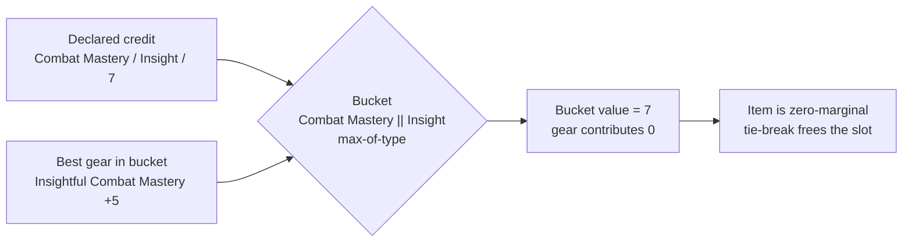

# Declared Stat Credits - Plan

## Goal Capsule

- **Objective:** Let a player tell the optimizer what they already have from outside their gear, so the solver stops spending slots on items that cannot beat it.
- **Product authority:** The player. A declared credit is an assertion about their own character, not a wiki-sourced value.
- **Open blockers:** None.

---

## Product Contract

### Summary

A player declares a stat they already receive from a non-gear source — a Battle Trance, a past life, a filigree, a ship buff — as a `(stat, bonus type, value)` credit. The credit participates in its stacking bucket exactly as an item would, so gear that cannot beat it becomes worthless and the freed slot serves the next priority. The credit also counts toward the player's totals and can satisfy a floor.

### Problem Frame

The optimizer only knows about gear. Every character input it collects today — minimum level, race, alignment, armor, druid oath, fighting style, the Two Weapon Fighting declaration, artifact opt-in, owned set augments — narrows *which items are eligible*. Two do a little more: `armorType` sets the Dodge cap, and `mlCap` resolves ML-scaling affixes to a value. None of them contributes a stat the player already holds, and `rawExpr` in `web/solver.js` builds each stat as a sum of item-gated terms with no constant to put one in.

That gap shows up as wasted slots. A character running a Battle Trance already receives an Insight bonus to tactical feat DCs. Because buckets are max-of-type, an Insightful Combat Mastery item on top of that trance adds nothing — but the solver cannot see the trance, so it equips the item and reports it as part of an optimal loadout. The player is left hand-correcting an answer the tool just proved.

The same shape recurs well beyond trances. Past lives, filigrees, ship buffs, and enhancement-tree bonuses all supply stats the optimizer treats as absent.

### Key Decisions

- **A general credit, not a trance model.** (session-settled: user-directed — chosen over harvesting a trance catalog: there is no data to maintain, and it sidesteps a circular magnitude.) A trance's value is derived from an ability modifier — Divine Might is half the player's Charisma modifier, and 47 items carry Insight Charisma — so computing it inside the solve would make the trance's value depend on the loadout while the loadout depends on the trance's value. Asking the player for the number takes the loop out of the solver; it does not eliminate it. The loadout returned can move the ability score the credit was derived from, so a declared value can be invalidated by the answer displayed beside it. What the decision buys is a solvable program and no catalog to maintain, not a resolved dependency. It also covers every other non-gear source at no extra cost, and it absorbed three bonus types, three stat families, and two different magnitude formulas during this brainstorm without any change.

- **A credit is a full participant, not a suppression filter.** (session-settled: user-directed — chosen over using credits only to suppress gear: totals and floors should describe the real character.) The credit counts toward the displayed total and helps satisfy a floor, so the solver stops chasing a threshold the player has already partly met. The cost is that a headline number now rests partly on a value the player typed, which R8 and R9 exist to make visible.

- **A credit competes in its bucket; it is never added on top.** (session-settled: user-approved — chosen over an additive constant: adding would double-count.) Buckets are max-of-type. A constant term added to a stat's expression would credit the player twice whenever gear in the same bucket is equipped. This repo has already removed one Insightful/Insight double-count; the same trap applies here.

- **Bucket resolution is inherited; the disclosure is not.** The solver already drops a zero-marginal same-type duplicate and reassigns the slot to the next priority, pinned by "U6: a zero-marginal same-type duplicate is dropped for the next priority" and "U6: distinct-type stacking consumes slots (correct); a cap is the lever" in `tests/solver.test.js`. That inheritance carries R5 and R6 once a credit is visible in its bucket. It does not carry R8 or R10: both tests construct only item-gated contributions, and a credit is the first bucket contribution with no gating pick var, so the attribution path — which resolves a contribution's source from its first gate — needs a declared-source branch before a credit can be shown as a distinct contributor.

### Requirements

**Declaring a credit**

- R1. A player can declare a credit as a stat, a bonus type, and a value.
- R2. A player can declare more than one credit, and more than one credit against the same stat when the bonus types differ.
- R3. Declaring a credit is optional; a character with no declared credits solves exactly as it does today.

**How a credit participates in the solve**

- R4. A credit participates in the `(stat, bonus type)` bucket its declaration names, resolved through the same stacking-equivalence rules gear uses.
- R5. A bucket holding a credit resolves to the larger of the credit and the best eligible gear in that bucket, never their sum.
- R6. Gear that cannot beat a credit in its bucket contributes nothing to the objective, so the existing tie-break leaves the slot free for a lower priority.
- R7. A credit counts toward the stat's reported total and toward satisfying a floor on that stat.

**Disclosure and attribution**

- R8. A stat total that includes a credit shows the credit as a distinct contributor, labelled as declared by the player rather than sourced from gear.
- R9. The result distinguishes a declared credit from a proven value wherever it reports confidence in its answer, so the tool never presents a player-supplied number as one it verified.
- R10. When a credit causes an item to be excluded that would otherwise have been chosen, the result can explain that exclusion.

**Persistence and sharing**

- R11. Declared credits persist with a saved character and restore on load.
- R12. Declared credits travel with every share export, so a recipient can reproduce the loadout. A shared loadout that omits them is not reproducible.

### Key Flows

- F1. Declaring a credit and seeing it take effect
  - **Trigger:** the player knows they hold a stat from a non-gear source.
  - **Steps:** the player declares the stat, bonus type, and value. The solve treats the credit as a contributor in that bucket. Gear that cannot beat it drops out and its slot serves the next priority. The result reports the total with the credit shown as a declared contributor.
  - **Outcome:** the loadout reflects the character the player actually has, and no slot is spent on gear that adds nothing.

### Acceptance Examples

- AE1. A credit displaces weaker gear
  - **Covers R4, R5, R6.**
  - **Given:** the player declares Combat Mastery / Insight / 7 and ranks Combat Mastery. The best Insightful Combat Mastery item available grants 5.
  - **Then:** the bucket resolves to 7, the item contributes nothing, and its slot goes to the next priority.

- AE2. Stronger gear still wins
  - **Covers R5.**
  - **Given:** the same declaration of 7, with an Insightful Combat Mastery item granting 9 available.
  - **Then:** the bucket resolves to 9 and the item is equipped. The declared 7 contributes nothing.

- AE3. A credit satisfies part of a floor
  - **Covers R7.**
  - **Given:** the player declares Combat Mastery / Insight / 7, sets a floor of 10 on Combat Mastery, and an Enhancement-typed Combat Mastery item granting 5 is available.
  - **Then:** the floor is met at 12 — the credit's Insight 7 plus the item's Enhancement 5, which occupy different buckets and so stack. Insight-typed gear could not have closed the gap, because the credit already holds that bucket.

- AE4. A credit in a bucket with no competing gear is purely additive
  - **Covers R4, R7.**
  - **Given:** the player declares Devotion / Sacred / 12 from Might's Reward. No item in the catalog carries Sacred-typed Devotion.
  - **Then:** the credit stacks with all existing Devotion gear, raises the total, and displaces nothing.

- AE5. A credit on an unranked stat changes nothing
  - **Covers R3.**
  - **Given:** the player declares a credit for a stat they have not ranked.
  - **Then:** the solve is unchanged, because an unranked stat contributes to no stage objective. The reason is the objective, not the bucket build — buckets are built for every targeted, capped, or floored stat, so a bucket can exist for a stat that is not a ranked priority.

### Scope Boundaries

- Modelling trances. No catalog, no computed magnitudes, no wiki harvest. The inventory below is evidence for this brief, not data the project takes on.
- Validating that declared credits are achievable together. Battle Trances are mutually exclusive in game, and nothing will stop a player declaring two. The mechanism is source-agnostic and does not know what a trance is.
- Deriving a credit's value from the player's ability scores. That is the circular dependency the general credit exists to keep out of the solver — the residue, that a returned loadout can invalidate a declared value, sits with the player and is not resolved here.
- Attack and Damage. Neither is a rankable stat and no item carries a bare affix of either name, so a trance's Insight bonus to them has no gear to displace.

### Dependencies and Assumptions

- Buckets are max-of-type and capped at one contributor per `(stat, bonus type)`. R5 and R6 rest entirely on this.
- The existing tie-break reassigns a slot whose item became zero-marginal. R6 depends on it and does not reimplement it — but that holds only on the optimum path. Every alternatives generator solves with the tie-break disabled, so a zero-marginal item is not dropped there and R6's slot-freeing does not currently reach the Alternatives surface.
- The player supplies a correct value. The tool does not verify it, which is why R8 and R9 require it to be labelled.
- Sacred-typed Devotion and Morale-typed gear do not currently exist in the catalog. If either is added, the credits that target those buckets become displacing rather than additive with no change to this feature.

### Outstanding Questions

**Deferred to planning**

- Whether a credit's bonus type is chosen from the known type vocabulary or free-typed, and how an unrecognized type behaves.
- Where declared credits are entered relative to the existing per-priority min/max controls, which are the nearest existing surface keyed by stat.
- Whether a credit for an unranked stat is surfaced as a hint, given AE5 makes it inert.

### Sources and Research

All wiki reads 2026-08-08, same-origin per `docs/wiki-evidence/harvest-method.md`.

**Trance inventory.** Recorded so this does not need re-deriving; it is not data the project maintains.

| Family | Sources | Grants | Bonus type | Magnitude |
|---|---|---|---|---|
| Battle Trance | Warpriest, War Soul, Henshin Mystic / Dragon Disciple, Knight of the Chalice, Dragon Lord (Draconic Conviction, Might in Order), Harper Agent, Falconry, Horizon Walker | Attack and Damage and Tactical feat DC; universal trees omit Attack | Insight | half an ability modifier — Cha, Wis, Int, Str, or Dex by source |
| Might's Reward (Beacon of Hope) | 1 | Positive Spell Power | Sacred | 5 plus Str, Wis, or Cha modifier |
| Spell Song Trance (Bard Spellsinger) | 1 | Spell DCs, granted to the inspiration's target | Morale | flat 1 |

`Trance` redirects to `Battle Trance`, whose members share one antirequisite group. `Animal Trance` is a Blighter and Druid spell targeting foes and grants the caster nothing.

**Where each collides with gear.** Verified against the built dataset.

| Grant | Modelled | Same-bucket gear | Effect |
|---|---|---|---|
| Insight to Tactical feat DC | yes, as Combat Mastery, Shield Bashing, Assassinate | 54, 19, 13 Insight-typed instances | displaces |
| Insight to Attack and Damage | no — neither is rankable | none; the dataset carries `Enhancement Bonus (Weapon)` instead | none |
| Sacred to Positive Spell Power | yes, as Devotion | none Sacred-typed | additive |
| Morale to Spell DCs | yes, as the Focus family | no Morale-typed gear anywhere | additive |

`Combat Mastery` is the item-side name for tactical feat DCs: "+X bonus to the DC to resist the character's Trip, Improved Trip, Sunder, Improved Sunder, Stunning Blow, and Stunning Fist attempts."

**Code anchors.** Verified against the current tree.

- `web/solver.js` — `buildProgram` constructs the solver's buckets, keyed by stat and equivalent bonus type, and `encodeStage` emits the one-contributor-per-bucket cap over them. That construction is the site a credit must join, and it is the gap R4 fills. `rawExpr` only reads those buckets back out; adding a credit there would bypass the cap and produce exactly the additive double-count the third Key Decision forbids.
- `web/model.js` — `variantBuckets` and `equivType` form the same key and keep the max per key, but they serve only the dominance pre-filter and never feed the solver. A credit added there would change which gear survives pruning and nothing else.
- `web/wizard.js` — `buildQuery` emits the character inputs; each is consumed as an eligibility gate, except `armorType` (sets the Dodge cap) and `mlCap` (also resolves ML-scaling affix values).
- `tests/solver.test.js` — "U6: a zero-marginal same-type duplicate is dropped for the next priority" pins the slot reassignment, and "U6: distinct-type stacking consumes slots (correct); a cap is the lever" pins cap saturation. Cite them by name: four tests in this file carry a `U6:` prefix, and the other two are about wildcard set completion.
- `docs/solutions/design-patterns/lexicographic-redundancy-is-not-a-bug.md` — the standing ruling that redundancy handling already works, and that a cap is the lever for over-investment. A cap is not the lever here: a cap says stop valuing past N, while a credit says the first N are already yours.
- `docs/solutions/design-patterns/milp-encoding-for-gear-optimization.md` — defines a contribution as a `(stat, bonus_type, value)` whose `z` is available when all its gates hold. A credit is that primitive with an empty gate list.
- `docs/wiki-evidence/negative-amplification.md` — the cross-channel bucket collapse verified live for this exact key shape; the reason KTD2 reuses `_equivType` rather than matching type strings.
- `docs/solutions/logic-errors/bonus-type-vocabulary-collides-with-bare-stat.md` — one of two shipped Insight/Insightful double-counts in this repo; the evidence behind KTD3.
- `docs/solutions/workflow-issues/golden-solve-guard-missing-from-local-test-sweep.md` — why U7 exists as its own unit.
- `docs/solutions/design-patterns/best-effort-constraints-need-a-joint-feasibility-pass.md` — floors probe individually then joint-verify; a credit routes through the same path rather than a special case.
- `docs/solutions/design-patterns/suppress-dont-erase-user-constraints-on-transient-invalidity.md` — a restored saved character is not re-solved on load, so displacement must be read from live state.

**Product Contract preservation:** unchanged. Planning added the Planning Contract and below; no requirement, decision, acceptance example, or scope boundary was rewritten. Two are narrowed by explicit planning assumptions rather than by editing them: **R10** by A3 (name the gear value the credit beat, rather than establishing what a credit-free solve would have chosen), and **AE5** by A1 (a credit on an unranked stat is *removed with its row* rather than persisting inertly, so AE5 is satisfied by removal). Both narrowings are stated at their assumption and covered by a tagged test scenario.

---

## Planning Contract

### Key Technical Decisions

- KTD1. **A credit is a zero-gate contribution, not a new solver concept.** (Instantiates the Product Contract decision "A credit competes in its bucket; it is never added on top".) `docs/solutions/design-patterns/milp-encoding-for-gear-optimization.md` already defines a contribution as a `(stat, bonus_type, value)` whose `z` is available when every gate in its list holds — a worn affix has one gate, an augment adds a placement binary, a set-piece adds a threshold binary. A credit is the same primitive with an **empty** gate list, so it is always available. Joining it to the bucket map `buildProgram` already constructs means R5 and R6 are inherited rather than implemented. The corollary matters as much as the rule: if R6 misbehaves, the defect is in bucket construction, never in the tie-break objective — do not modify `encodeStage`'s tie-break to chase it.

  **"Available" is not "taken", and the difference is a real defect.** `encodeStage` bounds a contribution's binary `z` with `sum(z) <= 1` per bucket plus one `z - gate <= 0` per gate. An empty gate list is well-formed — it simply emits no gate constraint — but it also leaves `z_credit` a **free** binary that nothing forces to 1. Only an objective pulls it up. On the optimum path that always happens, because each stage maximizes its stat and then locks it exactly. On every `tieBreak: false` path — which is every alternatives generator — a credited stat that is not the current gain objective is bounded only by `>= value - give`, so `z_credit` carries no objective coefficient and is free to settle at 0. `readSolution` computes `effective[stat]` by summing `value * z`, so the alternative would display a stat total that omits a bonus the player unconditionally holds. This is the one invariant a credit does **not** inherit from gear: `z = 0` truthfully means "not equipped" for an item, but for a credit it asserts something false about the character. U1 therefore emits an explicit per-bucket lower bound for every credit-bearing bucket. Without it the feature is wrong on the Alternatives surface, not merely incomplete there.

- KTD2. **The bucket key is built by the same code gear uses, not a parallel match.** The stat half is the raw name; the type half goes through `_equivType`, which reads the curated stacking-equivalence map. `docs/wiki-evidence/negative-amplification.md` verified this collapse live across worn, augment, and Viktranium channels for this exact key shape. A credit that formed its key any other way would drift from gear the moment the equivalence table changes.

- KTD3. **Bonus type is chosen from a closed vocabulary, never free-typed.** (Resolves the Product Contract's deferred question.) This repo has shipped an Insight/Insightful double-count twice — once from a parser splitting a type word onto a bare stat name, once from seal data typed one word off. A player who types "Insightful" meaning "Insight" lands the credit in a different bucket, where it silently fails to displace the gear it should and stacks with gear it should not. That is precisely the failure the Product Contract's third Key Decision exists to prevent, arriving through the input field instead of the arithmetic.

  **The vocabulary is curated and shipped with the feature — it is not derived from the dataset.** No bonus-type vocabulary exists today; `buildPickerVocabulary` yields affix *names*, not types. Deriving one by enumerating the built dataset's `type` column is wrong in both directions. It over-generates: the column carries 40 tokens, including `Bool` (8,036 boolean presence affixes), `null`, `None`, `-`, `Penalty`, `Maximum dexterity`, `Determination`, and material and damage tokens such as `Adamantine`, `Piercing`, and `Slashing` — a selector populated from it would offer nonsense buckets. It also under-generates: `Morale` appears nowhere in the dataset, because no gear carries it, so a dataset-derived list would make the Spell Song Trance credit the Product Contract explicitly enumerates undeclarable. That is the exact case AE4 generalizes — a credit in a bucket with no competing gear is the additive case the feature is meant to support, and it is precisely the case a dataset-derived vocabulary cannot express. Curate the list from the real stacking types instead, and keep it beside `_equivType`'s equivalence map so the two are maintained together.

- KTD4. **The stat name is canonicalized before it reaches the query.** The solver matches the stat half of a bucket key by exact string and applies no aliasing. The wizard's add-a-priority path already canonicalizes, refuses expanded-away names, and validates against the known-affix set; a declared stat runs the same three gates. A non-canonical name does not error — it forms an orphan bucket that silently contributes nothing.

- KTD5. **R9's disclosure lives in the existing bound-notice surface.** `boundNotice` in `web/results.js` already exists to keep "provably optimal" truthful by naming what was and was not solved over — it discloses the ML band, unmet floors, and held caps. A declared credit is the same class of qualifier, so it extends that notice rather than introducing a second honesty surface next to it. **But the notice is not the whole surface.** `boundNotice` returns app HTML and is not part of the shared content model every export renders from, while the exports head their text with an optimal-loadout claim. R9 says "wherever it reports confidence in its answer" — a shared build carrying a player-typed number in its totals with no qualifier violates it. The qualifier therefore lives in the projection's shared content model, and both the bound notice and every exporter render it from there. Solve-visible but share-invisible is a standing failure mode in this repo, not a new risk.

- KTD6. **Displacement is read from live solve state, never inferred from a rendered result.** A restored saved character is displayed without being re-solved. Reading "a credit displaced this item" off the rendered artifact would misreport on every load, which is the defect shape recorded in `docs/solutions/design-patterns/suppress-dont-erase-user-constraints-on-transient-invalidity.md`.

### Assumptions

- A1. Credits are declarable only for stats the player has ranked. The min/max controls are the only stat-keyed per-stat surface, they render per priority row, and a bound is removable only through its row — the repo already recorded the orphaned-bound defect that follows when a keyed input outlives its row. AE5 (a credit on an unranked stat is inert) therefore describes a state reachable only by ranking a stat, declaring a credit, then unranking — U2 handles that by dropping the credit with the row, exactly as bounds are dropped today.

  **This narrows AE5, and the narrowing is deliberate.** AE5 asserts that a credit on an unranked stat sits inert and harmless; A1 means it is *removed* rather than left inert, so the state AE5 describes never persists to be observed. AE5 is satisfied by removal, not by persistence, and U2's row-deletion scenario is what covers it. AE5's stated reasoning — that a bucket can exist for a stat that is not a ranked priority, since buckets are built for every targeted, capped, or floored stat — remains true of the solver and is simply not reachable through the UI A1 describes. If credits are ever extended to unranked stats, AE5 becomes live as written and U1's `targetList` caveat becomes load-bearing.
- A2. A credit's value is a positive integer, and `(stat, bonus type)` is unique per character. Gear affixes are filtered to `value > 0` before entering a bucket; a credit gets the same floor at declaration rather than being silently absorbed by the one-contributor-per-bucket cap. **Magnitude is not validated, and the blast radius of a wrong one is wide:** a fat-fingered 70 for 7 zeroes an entire bonus-type bucket, silently changing which items are equipped across several slots, and the result still renders as optimal. The Product Contract's answer is labelling (R8, R9) plus the narrowed R10 naming the beaten gear value, which is a partial tell. A plausibility ceiling derived from the largest known value in that bucket would bound it further, but that is new product behavior beyond the preserved Product Contract and is **not** in scope here. Recorded so the gap is a known one rather than an oversight.
- A3. R10 is satisfied by naming the best eligible gear value in the bucket that the credit beat, not by establishing what a credit-free solve would have chosen. The literal counterfactual needs a second full lexicographic solve; the narrowed form is derivable from the bucket's non-selected contributions in the solve already run. Recorded here rather than by rewriting R10.
- A4. No new floor machinery. Floors probe individually, then joint-verify and relax in reverse-priority order; a credit routes through that same probe path so a floor's achievable maximum accounts for it.

### Sequencing

U1 first — every other unit needs a credit to exist in the model, and its per-bucket lower bound is what makes a credit's contribution unremovable on every solve path, so building anything on top of an unpinned credit means re-testing it later. U2 makes it reachable. U3 and U4 are independent of each other and both depend on U1. U5 depends on U2 *and* U4: it persists the declaration from one and the disclosure from the other, and the disclosure half is easy to miss because the feature still solves correctly without it. U5 precedes U6 because the portable-JSON envelope carries the saved record verbatim, so persistence lands the credit in one export for free. U7 last, because it re-ratifies fixtures against the finished behavior — including the export parity fixtures U6 moves.

Baseline capture is a prerequisite, not a step: the no-credit-equivalence gate compares against pre-feature output, so capture that baseline before U1 lands or there is nothing to compare to.

---

## Implementation Units

### U1. Credit as a zero-gate bucket contribution

- **Goal:** A declared credit participates in its `(stat, bonus type)` bucket exactly as gear does, resolving max-of-type.
- **Requirements:** R4, R5, R6. Cites KTD1, KTD2.
- **Dependencies:** none.
- **Files:** `web/solver.js`, `web/model.js`, `tests/solver.test.js`.
- **Approach:** Carry declared credits from the query into the model beside `userCaps` and `floors`, and widen the solver's target set with their stats the same way capped and floored stats already widen it. In `buildProgram`, emit one contribution per credit into the bucket map using the same key construction gear uses — raw stat name, `_equivType`-resolved bonus type — with an empty gate list so no gate constraint is emitted for it. The one-contributor-per-bucket cap then produces max-of-type with no further work. Do not touch the tie-break objective.

  Then, for every bucket that received a credit, emit one additional constraint pinning the bucket's stacked value at or above the credit: `sum(value_i * z_i) >= creditValue` over that bucket's contributions. This is always feasible — the credit's own `z` satisfies it — and it is what makes the credit's contribution unremovable on solve paths that give `z_credit` no objective coefficient. See KTD1 for why the empty gate list alone is not sufficient. Note that `program.targetList` is `model.targets`, not the widened `targetSet`; a credit on a stat that is bucketed but not a target would never surface in `effective` or `breakdown`. A1 keeps that unreachable today, but assert it rather than assuming it.
- **Execution note:** Start from a failing solver test that puts a credit and a weaker same-bucket item in play and asserts the item is not equipped. Write a second failing test on the `tieBreak: false` path before writing the lower bound — the free-binary defect is invisible on the optimum path, so a suite that only exercises the default solve will go green over it.
- **Patterns to follow:** the existing gated-contribution emission in `buildProgram` for worn affixes, augments, and set tiers; `docs/solutions/design-patterns/milp-encoding-for-gear-optimization.md` for the gate-list generalization.
- **Test scenarios:**
  - Covers AE1. A credit of 7 and a same-bucket item of 5: the bucket resolves to 7, the item is not equipped, and the freed slot serves the next priority.
  - Covers AE2. A credit of 7 and a same-bucket item of 9: the item is equipped and the bucket resolves to 9.
  - Covers AE4. A credit in a bucket with no competing gear stacks with a different-bucket item on the same stat; the total is the sum across buckets, never within one.
  - A credit and an item of exactly equal value: the bucket resolves to that value once, and the total does not double.
  - Two credits on the same stat in different bonus-type buckets both contribute.
  - A credit whose bonus type is stacking-equivalent to an item's (the curated equivalence pair) lands in the same bucket and competes rather than stacks.
  - Covers R3. A solve with no declared credits produces byte-identical output to the same solve before this unit.
  - A credited stat solved through `solveConstrained(..., { tieBreak: false })` reports a total no lower than the declared credit, for both a stat that is the gain objective and one that is not.
  - Every alternative loadout returned by the Alternatives generators reports a credited stat at or above its declared credit — the surface where the free-binary defect shows.
  - A credit on a stat that is bucketed but not in `targetList` either surfaces in the breakdown or is proven unreachable; it never contributes silently.
- **Verification:** the real-engine solver suite passes, a credit demonstrably changes which items are equipped only in the bucket it occupies, and no solve path — optimum or alternative — reports a credited stat below its credit.

### U2. Declaration input, canonicalization, and query plumbing

- **Goal:** A player can declare, edit, and remove a credit on a ranked stat, and it reaches the solve.
- **Requirements:** R1, R2, R3. Cites KTD3, KTD4, A1, A2.
- **Dependencies:** U1.
- **Files:** `web/wizard.js`, `tests/wizard.test.js`.
- **Approach:** Extend the per-priority row beside the existing min/max inputs with a credit control: a value field and a bonus-type selector populated from the curated bonus-type list KTD3 defines. One render function serves both the priorities step and the in-results adjust panel, so the control appears in both without a second implementation. Canonicalize the stat name through the picker vocabulary before the credit enters the query, and sanitize values on the way out the way the bound maps are sanitized.

  **Key the state map by `stat||bonusType`, not by stat, and make the control repeatable.** R2 allows more than one credit against the same stat when the bonus types differ, and A2 makes `(stat, bonus type)` the uniqueness key — a stat-keyed map holds exactly one credit per stat and cannot express either. A single fixed value-plus-selector pair per row has the same ceiling. Render a repeatable credit sub-row inside the priority `<li>` — one per declared `(stat, type)` pair, plus an add-a-credit affordance — and on row deletion drop every entry whose key names that stat. Note there is no repeatable-sub-row precedent in `renderRankedList` to copy; the bounds inputs are fixed per row, so this is new structure rather than a variation on an existing one.
- **Execution note:** The bound inputs carry drag-suppression that is load-bearing — a new input inside a draggable row starts a row drag without it. Mirror it, but do not mirror it literally: the working guard is `ondragstart` testing `e.target.tagName === "INPUT"`, which a `<select>` does not match. `draggable="false"` on a child does not stop the nearest draggable ancestor from becoming the drag source, and `stopPropagation` on `pointerdown` does not suppress the native drag either — the tagName test is the part that works. Broaden it to match `SELECT` as well, or test `e.target.closest("input, select")`.
- **Patterns to follow:** the `.wz-bounds` inputs and their input handler in the ranked-row renderer; the delete branch that drops a removed stat's bounds; `cleanBoundMap` for the sanitize-on-the-way-to-the-query seam; the add-a-priority path for the canonicalize-then-validate sequence.
- **Test scenarios:**
  - A declared credit reaches the built query with its stat canonicalized.
  - An empty, non-numeric, zero, or negative value removes the credit rather than storing it.
  - Covers AE5. Deleting a priority row drops every credit on that stat, leaving no orphan — the resolution A1 gives to a credit on an unranked stat.
  - The bonus-type selector offers `Morale`, which no gear carries, so the additive-only credit case is declarable.
  - Dragging a row by its bonus-type selector does not start a row reorder.
  - Editing a credit's value replaces it; editing to empty removes it.
  - A second credit on the same stat with a different bonus type is kept; the same bonus type replaces rather than duplicating.
  - The bonus-type control offers only known types — a value outside the vocabulary cannot be submitted.
  - Covers R3. With no credits declared, the built query is unchanged from today.
  - The credit control is announced and keyboard-operable, matching the existing declaration control's accessibility assertions.
- **Verification:** declaring a credit in the browser changes the solve; clearing it restores the previous result exactly.

### U3. Declared contributions are attributed as declared

- **Goal:** A credit shows in a stat's breakdown as a distinct contributor, labelled as declared rather than gear-sourced.
- **Requirements:** R8. Cites KTD1, KTD6.
- **Dependencies:** U1.
- **Files:** `web/solver.js`, `web/projection.js`, `web/results.js`, `web/exporters.js`, `tests/attribution.test.js`, `tests/results.test.js`.
- **Approach:** The source resolver reads a contribution's first gate to decide its kind; a credit has no gate and currently falls through to the unlabelled branch. Add a declared kind resolved from the contribution itself rather than from a gate, and carry it through the projection's contributor shape. Render it in the results contributor list and in the export source string — the same kind reaches both, so the label is written once per surface and not per format. A credit resolves to no slot, so the slot column needs a declared-source case rather than an empty dash.
- **Patterns to follow:** the existing source-kind branches in the resolver; the set and augment cases in the contributor renderer, which are the two kinds that already get their own presentation; the boolean-contribution rendering test as the closest precedent for a new contributor kind.
- **Test scenarios:**
  - A credit appears in its stat's contributor list with its value and bonus type, marked declared.
  - It is visually and structurally distinguishable from a gear contributor with the same stat, type, and value.
  - It carries no slot and does not render an empty slot cell.
  - A credit that lost its bucket to stronger gear does not appear as a contributor.
  - The contributor sum including a credit still reconciles with the reported total, including when the stat is capped and the total is clamped below the sum. Note that under a cap nothing forces a contributor's `z` to 1 once the stat reaches its bound; this is pre-existing for gear, but a *credit* dropping out of a clamped breakdown will read to a player as a new bug. U1's per-bucket lower bound keeps the credit's own `z` pinned — assert that it holds under a cap too.
  - The equipped-item explanation path does not attribute a credit to any item.
- **Verification:** a solve with a credit renders a breakdown a reader can tell apart from an all-gear one without consulting the plan.

### U4. Floor participation and credit-aware disclosure

- **Goal:** A credit counts toward a floor, and the result says so rather than reporting a floor quietly met.
- **Requirements:** R7, R9, R10 (narrowed per A3). Cites KTD5, KTD6, A3, A4.
- **Dependencies:** U1.
- **Files:** `web/solver.js`, `web/results.js`, `web/persist.js`, `web/projection.js`, `web/exporters.js`, `tests/solver.test.js`, `tests/results.test.js`.
- **Approach:** Because a credit is a bucket contribution, the floor machinery already reads it — the achievable-maximum probe and the floor locks both resolve through bucket values, so no floor-specific code changes. The disclosure does change: the floor report is populated only for unmet floors, so a floor met with a credit's help produces no message today. Extend the bound notice to name a floor a credit contributed to and the gear-only shortfall behind it, alongside the ML band, unmet floors, and held caps it already discloses. Add the narrowed R10 line there too: when a credit wins its bucket, name the best eligible gear value it beat.

  **Emit the disclosure as data on the result, not as a render-time read of `program`.** Both facts the notice needs — the gear-only shortfall behind a floor, and the best gear value the credit beat — live only in `program.zByBucket`, and `program` is deliberately excluded from the saved snapshot as cyclic and non-JSON. Rendering them at display time therefore makes the disclosure vanish the moment a saved character is restored, because KTD6 correctly forbids re-solving on load. Have the solver emit a plain-JSON `creditReport` on the result — per entry: stat, bonus type, credited value, best gear value beaten, floor shortfall — and have `boundNotice` render from that. U5 then adds `creditReport` to the result allowlist so it survives the load path R11 creates. Without this the honesty surface R9 exists to guarantee is silently absent on exactly the path the feature adds.

  **The qualifier must reach exports, not just the app.** `boundNotice` returns HTML from `web/results.js` and is not part of the shared content model in `web/projection.js` that every export renders from, while `web/exporters.js` heads shared text with an optimal-loadout claim. A build shared with a player-typed number folded into its totals and no statement that the number was unverified is solve-visible but share-invisible — the failure mode this repo holds as a standing invariant. Put the qualifier in the projection's shared content model so the notice and every exporter render it from one source.
- **Execution note:** Read displacement and floor contribution from the solve result, not from rendered output — a restored character is displayed without re-solving.
- **Patterns to follow:** the bound notice's existing parts and its empty case; the floor report's population site.
- **Test scenarios:**
  - Covers AE3. A credit of 7 against a floor of 10 with a different-bucket item of 5 available: the floor is met at 12 and the solver does not chase 10 from gear alone.
  - A floor met partly by a credit is disclosed, naming the credit and the gear-only shortfall.
  - A floor met entirely by gear produces no credit disclosure.
  - A floor that remains unmet with a credit still reports as unmet, with the credit counted in what was achieved.
  - When a credit wins its bucket, the result names the best gear value in that bucket it beat.
  - When no credit is declared, the bound notice is byte-identical to today's.
  - `creditReport` is plain JSON on the result — no reference to `program` — and the notice renders identically from a result read back off the allowlist as from a live solve.
  - Every export that claims an optimal loadout carries the declared-credit qualifier; an undeclared build's exports carry no qualifier.
- **Verification:** no floor verdict influenced by a credit is reported without the credit being named, in the app or in any export, on a fresh solve or a restored one.

### U5. Persist declared credits with the character

- **Goal:** Credits survive save, load, export, and import.
- **Requirements:** R11, and the load-path half of R9 and R10.
- **Dependencies:** U2, U4.
- **Files:** `web/persist.js`, `web/wizard.js`, `tests/persist.test.js`, `tests/backup.test.js`.
- **Approach:** Add the credit map to the saved-input allowlist, which is the single source of truth the backup path imports so the two cannot drift. The value is plain JSON and needs no special serialization. On load, rehydrate with a pre-feature default so a character saved before this feature loads as having no credits — and restore it before any priority migration runs, since the migration cleans stat-keyed maps and would otherwise be overwritten.

  **Two allowlists, not one.** The input allowlist carries the declaration; the *result* allowlist carries the disclosure. Add U4's `creditReport` to the result allowlist as well, or the credit still solves correctly on load while the honesty line R9 requires goes quiet. The migration's cleanup loop iterates a hardcoded array of the stat-keyed bound maps — widen it to include the credit map, or a credit whose stat the migration drops survives as an orphan.
- **Patterns to follow:** the allowlist and the existing restore ordering constraint, which is pinned by a source-order test; the result allowlist's existing entries for the shape `creditReport` should match.
- **Test scenarios:**
  - A character with credits round-trips through save and load unchanged.
  - A character saved before this feature loads with no credits and solves identically.
  - Credits survive the backup export and import round-trip.
  - Credits are restored before the priority migration runs.
  - A credit whose stat is dropped by the priority migration does not survive as an orphan.
  - A restored credit-bearing character still renders the credit disclosure and the displacement line, without re-solving.
- **Verification:** save, reload the page, load the character — the solve reproduces exactly, and the credit disclosure reads the same as it did before the save.

### U6. Carry credits into every share export

- **Goal:** A shared loadout carries the credits it was solved with.
- **Requirements:** R12.
- **Dependencies:** U3, U5.
- **Files:** `web/projection.js`, `web/exporters.js`, `tests/projection.test.js`, `tests/exporters.test.js`.
- **Approach:** The shared content model is the single source every text format renders from, so credits enter once. Add them to the character-constraints list that heads every export, using the established omit-when-unset idiom so an undeclared build's output is unchanged. The declared contributor kind from U3 already reaches the export source string, so per-stat attribution needs nothing further. The portable JSON carries the saved record verbatim, so U5 already puts credits there.
- **Patterns to follow:** the constraints list and its filter; the gearset export's per-priority bounds loop, which is the precedent for folding a stat-keyed input into a priority listing; the existing all-format parity test.
- **Test scenarios:**
  - A declared build carries its credits into every text format and the portable JSON.
  - An undeclared build's exports are byte-identical to today's.
  - A credit appears in per-stat attribution in every format that renders attribution.
  - The portable JSON's verbatim record includes credits without an exporter change.
  - Every export asserting an optimal loadout carries the declared-credit qualifier from U4.
- **Verification:** the portable JSON's `core.inputs` carries the credits verbatim, and the backup export/import round-trip restores them.
- **Execution note:** Do not write a round-trip test against the portable envelope. There is no reader for `ddo-loadout/v1` — `web/import.js` parses the Trove inventory CSV, `web/backup.js` reads the backup format, and `web/exporters.js` records import/compare as deferred future work (**tracked as #190**). Assert the envelope's contents directly, and use the backup path for the round-trip.

### U7. Re-ratify golden and parity fixtures

- **Goal:** Fixture movement is reviewed deliberately, and uncredited fixtures are proven not to move.
- **Requirements:** none directly; protects R3, R5, R6.
- **Dependencies:** U1, U3, U4, U6.
- **Files:** `tests/parity/golden.json`, `tests/solver_golden.test.js`.
- **Approach:** Run the golden guard explicitly — it sits outside the hand-run per-file sweep and has previously merged un-deployed. R3 supplies the criterion that makes review tractable: a fixture with no declared credits must not move at all. Any movement there is a regression, not a re-ratification. Only a fixture a test deliberately gives a credit may move, and each such change is attributed before acceptance.
- **Execution note:** Run every JS test file as its own invocation; a combined invocation runs only the first and has silently skipped this guard before.
- **Patterns to follow:** `docs/solutions/workflow-issues/golden-solve-guard-missing-from-local-test-sweep.md` for the review discipline.
- **Test scenarios:**
  - No golden fixture moves when no credit is declared.
  - A fixture given a credit moves only in the stat that credit occupies.
- **Verification:** the golden guard passes, and every changed fixture value is attributed to a deliberately declared credit.

---

## Verification Contract

| Gate | Command | Applies to |
|---|---|---|
| JS suite, file by file | glob `tests/*.test.js`, run each as its own `node` invocation | U1-U7 |
| Golden guard | `node tests/solver_golden.test.js` | U1, U7 |
| Python suite | `python3 tests/run_tests.py` | regression only; this feature is browser-side |
| Dataset rebuild | `python3 build_dataset.py` | regression only; no seed data changes |
| No-credit equivalence | a solve with zero declared credits matches pre-feature output, against a baseline captured before U1 lands | R3, U1, U4, U6 |
| Credit floor on every solve path | a credited stat's reported total never falls below its credit, on the optimum solve and on every Alternatives generator | R7, U1 |

`node a.js b.js` runs only the first file. Glob and run each separately, or the golden guard silently never executes.

---

## Definition of Done

- A declared credit participates in its bucket, and gear that cannot beat it is not equipped; the freed slot serves the next priority **on the optimum solve**. The Alternatives surface solves with the tie-break disabled and so does not free the slot — a known, tested gap, not an untested claim. A credited stat's *total* is correct there regardless, enforced by U1's per-bucket lower bound.
- A credit never sums with gear inside one bucket, and never suppresses gear in a different bucket on the same stat.
- Bonus type is chosen from a closed vocabulary; a stat name is canonicalized before it reaches the query.
- A credit counts toward its stat's total and toward satisfying a floor, and no floor verdict a credit influenced is reported without naming it.
- When a credit wins its bucket and displaces gear, the result names the best eligible gear value in that bucket it beat.
- A credit renders as a distinct, declared-labelled contributor wherever a stat's contributors are shown, in the app and in every export.
- Credits persist with a saved character, survive backup import, and travel with every share export; a character saved before this feature loads and solves unchanged. The credit disclosure survives the load path too — a restored character reads the same as it did before the save.
- Bonus type is offered from a curated list that includes types no gear carries, so an additive-only credit is declarable.
- With no credits declared, the solve, the exports, and the bound notice are unchanged from today.
- The golden guard passes, and every moved fixture is attributed to a deliberately declared credit.
