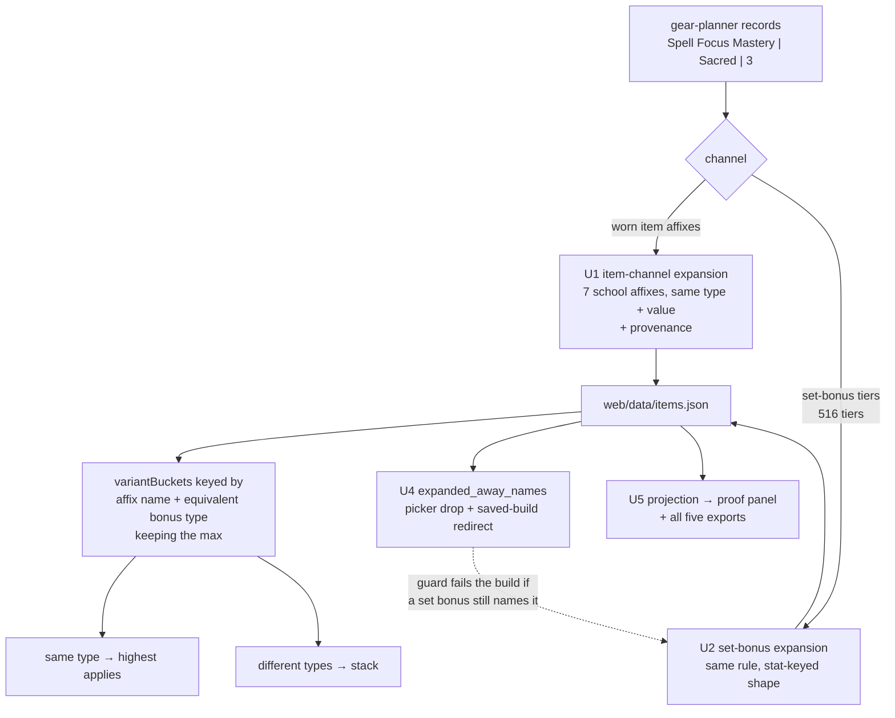

# Universal Spell DC Expansion - Plan

## Goal Capsule

**Objective.** Make a spell-school priority mean *"get the highest Necromancy DC
possible"* rather than *"get the highest Necromancy-specific effects possible"*.
Universal DC sources — Spell Focus Mastery and bare Spell Focus, in every bonus
type they come in — are invisible to school priorities today, so the solver never
picks the sacred, quality, or insightful focus gear that a real DC build is built
around.

**Product authority.** GitHub issue #205 (user-reported, necromancer build).
Mechanics verified directly against the DDO Wiki on 2026-08-09; see Evidence.
Product Contract unchanged by this planning pass.

**Stop conditions.** Stop and surface rather than guessing if: a universal-DC
candidate name has no wiki quote stating it applies to all spells; the golden
diff contains a change the wiki rules below do not explain; or expansion would
require altering `name||equivType(type)` bucketing (that would mean the model is
wrong, not that the rule needs an exception).

**Tail.** Standard repo flow — branch, PR, squash-merge. `main` deploys on push,
so a red build blocks the site.

---

## Product Contract

### Summary

Expand wiki-confirmed universal DC affixes into the seven spell schools at build
time, across both the worn-item and set-bonus channels, carrying the original
enchantment name so the receipts still match the item.

### Problem Frame

A player ranked Nullification, Void Lore, Void Intensity, Necromancy,
Enchantment, Illusion, and Conjuration, and got a loadout with **no sacred,
quality, or insightful focus effects at all**. That is not a data gap. Every one
of those effects is present and correctly typed in the dataset; the solver simply
cannot see them from a school priority.

`web/model.js:51` credits an affix only when its **name** exactly matches a
ranked target:

```js
const put = (stat, type, val) => {
  if (!targetSet.has(stat)) return;
```

So ranking `Necromancy Focus` makes all 232 `Spell Focus Mastery` affixes and all
19 bare `Spell Focus` affixes worth exactly zero. The solver has no reason to
select the item carrying them, and reports a total far below the achievable DC.

There is no UI workaround. Ranking both `Necromancy Focus` and `Spell Focus
Mastery` does not help, because strict lexicographic priority maximizes the first
bucket completely before considering the second — it never maximizes the sum.

### Evidence

Verified from the DDO Wiki, 2026-08-09, same-origin from a ddowiki tab.

[Increasing spell DCs](https://ddowiki.com/page/Increasing_spell_DCs), Items:

> Items with Spell Focus Mastery apply to all spells. School-specific effects,
> such as Evocation Focus items, apply only to a single school of spells, but
> they scale faster.
> The effects come in several bonus types. Effects with the same bonus type
> don't stack, only the highest applies.

[Spell Focus Mastery](https://ddowiki.com/page/Spell_Focus_Mastery):

> Spell Focus Mastery adds Equipment bonus to the DC of all your spells. Does
> not stack with other Spell Focus item enchantments, stacks with Spell Focus
> feats.

Two rules follow, and they are the whole mechanic:

1. A universal DC source applies to **every** school.
2. Within one bonus type, universal and school-specific do **not** stack — only
   the highest applies. Across bonus types, they stack.

Bare `Spell Focus` is confirmed universal by the same page's worked example,
which credits `Stormreaver's Napkin` — stored as `Spell Focus | Equipment | 1` —
as "+1 to her DCs", plural.

[I:Legendary Argonnessen Eye Band](https://ddowiki.com/page/Item:Legendary_Argonnessen_Eye_Band)
confirms `Sacred Spell Focus Mastery +3`, matching our stored
`Spell Focus Mastery | Sacred | 3`.

### Requirements

**Expansion**

R1. Each affix named `Spell Focus Mastery` or `Spell Focus` expands into the
seven school focus affixes — Abjuration, Conjuration, Enchantment, Evocation,
Illusion, Necromancy, Transmutation — at the same value and the same bonus type.
Expansion happens at the data layer so the objective, the dominance pre-filter,
set-threshold evaluation, browse, and exports see the real per-school
contribution without any of them knowing the rule exists.

R2. Stacking falls out of the existing `name||equivType(type)` bucketing, not new
code. Same bonus type collapses to the highest; different bonus types stack. A
change to stacking logic means the expansion is wrong.

R3. Expansion covers both affix channels: worn item affixes and set-bonus tier
affixes.

**Receipts**

R4. Each expanded affix carries the originating enchantment name. The proof panel
credits the contribution to the ranked school while displaying what is on the
item — `Sacred Spell Focus Mastery +3`, not `Necromancy Focus +3`.

R5. Provenance reaches every share export, not only the live proof panel.

**Picker and saved builds**

R6. `Spell Focus Mastery` and `Spell Focus` join the expanded-away names, so no
player can rank a name no item carries. Saved characters that ranked either are
redirected to the concrete school stats through the existing mechanism.

**Verification**

R7. The golden diff is re-ratified per changed build with a written rationale,
never blanket-accepted.

### Scope Boundaries

**In:** `Spell Focus Mastery` (232 item affixes: Quality 69, Insight 59,
Equipment 41, Profane 39, Sacred 16, Exceptional 6) and bare `Spell Focus` (19
item affixes), plus 516 set-bonus tiers granting universal spell focus in Profane
and Artifact types.

**Out, with reasons:**

| Excluded | Why |
|---|---|
| `Rune Arm Focus` | The wiki states it "isn't directly tied to a Spell School but to the Rune Arm itself." Expanding it would fabricate a DC. |
| `Deific Focus` (3 items, Sacred) | https://ddowiki.com/page/Deific_Focus does not exist. Quarantined under the exclude-until-verified gate and disclosed in the coverage note. Ships only if a future lookup states the rule outright. |
| Spell **lore** (`Universal Spell Lore`, `Void Lore`, element lores) | `docs/wiki-evidence/spell-lore.md` already ruled universal and element lore genuinely **stack** — different stats, not an umbrella. Expanding lore would collapse two stacking sources. |
| Non-spell focuses | Breath Weapon, Equipoised, Raging, `Weapon Focus: *`, `Dragonshard Focus: *`. |

#### Deferred to Follow-Up Work

- No-op augment recommendations — issue #206. Different defect class: the
  arithmetic is right, the recommendation wastes a slot. Expect it to become
  **more** visible after this ships, since expansion creates more
  same-name-same-type collisions.
- Stale gear-planner values — issue #207. The Legendary Argonnessen Eye Band
  reads `Spell Focus Mastery +8` on the wiki and `+5` in gear-planner.

### Success Criteria

1. A ML 34 solve ranking `Necromancy Focus` selects gear carrying universal DC
   sources wherever they beat school-specific alternatives, including the
   Legendary Argonnessen Eye Band's `Sacred Spell Focus Mastery +3`.
2. The proof panel credits that +3 toward Necromancy while displaying the string
   `Sacred Spell Focus Mastery`.
3. A loadout holding both a universal and a school-specific source of the same
   bonus type reports the higher of the two, not the sum.
4. A loadout holding sources of different bonus types reports the sum.
5. `Spell Focus Mastery` and `Spell Focus` are absent from the picker, and a
   saved build that ranked either loads with the school stats instead.
6. `Rune Arm Focus` and spell lore stacking are unchanged, proven by a test that
   fails if either is expanded.

### Outstanding Questions

- **Deferred.** Is a spell-focus tooltip-snapshot guard worth building — the
  `speed_split` pattern applied to DC values — or is #207 better served by a
  sampling audit of gear-planner values against wiki item pages? Owned by #207.
- **Deferred.** `Deific Focus` stays quarantined until a wiki source states its
  behavior. If the article appears, revisit the allowlist.

---

## Planning Contract

### Key Technical Decisions

**KTD1 — A school target absorbs universal sources; the universal name leaves the
picker.** Ranking `Necromancy Focus` means "maximize my Necromancy DC".
(session-settled: user-directed — chosen over keeping a separate all-schools
picker entry: no item would carry the raw name after expansion, so that entry
would need a mechanism beyond the expanded-away path.)

**KTD2 — Expand at build time, not at solve time or the `web/dataset.js` load
seam.** Solve-time target aliasing would require the same knowledge in
`variantBuckets`, the Pareto pre-filter, set thresholds, browse, and exports —
the per-consumer duplication `src/umbrella.py` was written to eliminate, and the
exact shape of the bug being fixed. The load seam is reserved for `Sheltering`,
and `web/dataset.js:416-418` warns against conflating the two.

**KTD3 — A new sibling module, not an extension of `_UMBRELLA`.**
`src/umbrella.py` documents that its set "is deliberately NOT extended" and that
a mechanism with a different expansion target "must never be added to this set" —
abilities expand to six, spell focus expands to seven. The correct precedent is
the sibling-module shape already used three times: `src/speed_split.py`,
`src/parrying_split.py`, and `src/heightened_awareness.py`, each exporting an
`EXPANDED_AWAY` map and a set-bonus expander.

**KTD4 — Provenance is a field on the expanded affix.** Required by R4, and the
only genuinely new plumbing. `src/umbrella.py` discards the origin name, which is
verifiable in the built dataset: `Band of Insightful Commands` carries `Well
Rounded | Profane | 1` in gear-planner and six `Profane | 1` ability affixes in
`web/data/items.json`, with the original name gone.

**KTD5 — Receipts flow through the shared projection, so exports inherit them.**
`web/projection.js` is the single content source — `results.js` binds its
primitives and `exporters.js` calls it for all five outputs. Adding provenance
there satisfies R5 without touching each exporter.

**KTD6 — The golden diff is re-ratified per build with written rationale.**
(session-settled: user-directed — chosen over re-baselining with a few targeted
DC assertions: the audit trail is the reason the golden guard exists.)

### High-Level Technical Design

Two affix channels reach the solver, with different key shapes. Both must be
expanded, and the picker registration is what forces the second.



The dashed edge is the sequencing constraint: `build_dataset.py` raises on any
set-bonus affix naming an expanded-away stat, and the known-orphan allowlist is
empty by design so a new orphan fails rather than going quiet. Registering the
names (U4) without U2 in place breaks the build.

### Assumptions

- Set-bonus tiers carry universal spell focus only in Profane and Artifact types
  in the current catalog. The expander keys on the name, not the type, so a new
  type in a future harvest flows through without a code change.
- The ~1,750 added item-affix rows and ~3,600 added tier-affix rows are
  immaterial against 9,045 items and 10,485 existing tier affixes. If the solve
  time regresses measurably, that is a finding worth surfacing, not a tuning
  exercise to absorb silently.

### Sequencing

U1 before U2 (U2 uses U1's allowlist). U4 must not land before both — see the
build-guard constraint above. U3 rides with U1/U2. U5 depends on U3. U6 is last,
after the dataset shape is final.

---

## Implementation Units

### U1. Item-channel expansion module

**Goal.** Expand `Spell Focus Mastery` and `Spell Focus` into the seven school
focus affixes on worn item affixes, at the same value and bonus type.

**Requirements.** R1, R2 (via existing bucketing), KTD3.

**Dependencies.** None.

**Files.**
- `src/spell_focus.py` (new)
- `build_dataset.py` (call the expander alongside `umbrella_mod.expand_variants`)
- `tests/test_spell_focus.py` (new)

**Approach.** Mirror the contract of `src/umbrella.py` and the three sibling
split modules: an explicit allowlist constant, a predicate, an `EXPANDED_AWAY`
map from universal name to the seven schools, and a variant expander. The
allowlist is the single source of truth for what counts as universal; adding a
name requires a wiki quote stating it applies to all spells. Do not add these
names to `_UMBRELLA` — different expansion target.

**Patterns to follow.** `src/umbrella.py` for the expander shape;
`src/parrying_split.py` and `src/heightened_awareness.py` for the
`EXPANDED_AWAY` + set-bonus-expander pair.

**Test scenarios.**
- `Spell Focus Mastery | Sacred | 3` on an item becomes seven affixes, one per
  school, each `Sacred | 3`, and the original name is absent.
- Bare `Spell Focus | Equipment | 1` expands identically (Stormreaver's Napkin
  shape).
- `Rune Arm Focus | Equipment | 4` passes through untouched.
- `Void Lore` and `Universal Spell Lore` pass through untouched — guards the
  standing spell-lore ruling.
- A non-spell focus (`Breath Weapon Focus`) passes through untouched.
- The expander never mutates its input list.
- Covers success criterion 6.

**Verification.** The built dataset contains zero item affixes named
`Spell Focus Mastery` or `Spell Focus`, and the Legendary Argonnessen Eye Band
carries a `Necromancy Focus | Sacred | 3` among its expanded affixes.

### U2. Set-bonus channel expansion

**Goal.** Apply the same expansion to set-bonus tier affixes, where 516 tiers
grant universal spell focus in Profane and Artifact types.

**Requirements.** R3.

**Dependencies.** Shares U1's allowlist constant, so U1 lands first if both are
split across commits; otherwise they are one change.

**Files.**
- `src/spell_focus.py`
- `build_dataset.py`
- `tests/test_spell_focus.py`

**Approach.** Tier affixes use `{stat, bonus_type, raw, unit, value}` while item
affixes use `{name, type, value}`. A name-keyed predicate run over a tier affix
matches nothing — the failure mode recorded in `build_dataset.py:592-598`, where
Protector's Heart granted an expanded-away `Parrying` until the set channel was
handled. Follow `expand_set_bonuses` from the parrying and heightened-awareness
modules rather than reusing the item-channel function.

**Execution note.** Write the failing set-channel test first. This is the exact
bug class the sibling modules exist to prevent, and the item-channel test passing
proves nothing about this channel.

**Test scenarios.**
- A set tier granting `Spell Focus Mastery | Profane | 1` expands to seven school
  affixes at `Profane | 1`.
- A set tier granting `Spell Focus Mastery | Artifact | 2` expands the same way.
- A set tier granting `Evocation Focus` (six exist) is untouched.
- The set expander reads the `stat`/`bonus_type` shape, proven by a tier fixture
  that would silently no-op under a name-keyed predicate.

**Verification.** No set-bonus tier in the built dataset names a universal spell
focus.

### U3. Provenance on expanded affixes

**Goal.** Carry the originating enchantment name on every expanded affix and emit
it in the dataset.

**Requirements.** R4, KTD4.

**Dependencies.** U1, U2.

**Files.**
- `src/spell_focus.py`
- `build_dataset.py` (emit the field through affix normalization)
- `tests/test_spell_focus.py`

**Approach.** Add one field naming the source enchantment as the player sees it,
including its bonus-type prefix where the wiki uses one (`Sacred Spell Focus
Mastery`). School-specific affixes carry no such field, so a consumer can tell
expanded from native by its presence. Keep the field on the emitted item and tier
affixes — `web/data/items.json` is generated, so this is a pipeline change, never
a hand edit.

**Test scenarios.**
- An expanded affix carries the source name including the bonus-type prefix.
- A native `Necromancy Focus` affix carries no provenance field.
- Provenance survives the item-affix normalization that renames `stat`/`bonus_type`
  to `name`/`type`.

**Verification.** The Legendary Argonnessen Eye Band's expanded Sacred affixes
name `Sacred Spell Focus Mastery` in the built dataset.

### U4. Picker removal and saved-build redirect

**Goal.** Register both universal names as expanded-away so the picker stops
offering them and saved builds redirect to the school stats.

**Requirements.** R6.

**Dependencies.** U1 **and** U2 — see the sequencing constraint below.

**Files.**
- `build_dataset.py` (add the module's `EXPANDED_AWAY` to the two merge sites)
- `web/dataset.js` (fallback constant for a stale cached dataset)
- `tests/test_vocabulary.py`, `tests/dataset.test.js`

**Approach.** Both merge sites take the same map: the rankable-name filter and
the emitted `metadata.expanded_away_names`. The redirect path built for #136
already covers every add-a-priority surface and the saved-character load check,
so no bespoke migration is needed.

**Execution note.** Landing this before U2 fails the build rather than degrading
quietly — `_KNOWN_SET_BONUS_ORPHANS` is empty by design so a new orphan is fatal.
Do not add the universal names to that allowlist to get past it; that would
recreate the reported bug inside the set channel.

**Test scenarios.**
- Neither universal name appears in the picker's suggestion list.
- Each maps to the seven schools in `expanded_away_names`.
- A saved build ranking `Spell Focus Mastery` loads with the school stats.
- The set-bonus orphan guard passes with the names registered — the regression
  test for the sequencing constraint.
- Covers success criterion 5.

**Verification.** Build completes; the picker offers no name that zero items
carry.

### U5. Attribution shows the real enchantment name

**Goal.** Display the source enchantment in the proof panel and every share
export while crediting the contribution to the ranked school.

**Requirements.** R4, R5, KTD5.

**Dependencies.** U3.

**Files.**
- `web/projection.js` (`attributionByTarget`, `whyThis`)
- `tests/projection.test.js`, `tests/attribution.test.js`, `tests/exporters.test.js`

**Approach.** Read the provenance field where the contributor row is built.
`results.js` binds these primitives and `exporters.js` calls the projection for
all five outputs, so one change reaches the live view and the exports together —
the standing rule that a new mechanic is never solve-visible but share-invisible.
Fall back to the affix name when provenance is absent, so native school affixes
render unchanged.

**Test scenarios.**
- A Necromancy contribution sourced from the ring renders `Sacred Spell Focus
  Mastery` and not `Necromancy Focus`.
- A native `Necromancy Focus` contribution renders its own name.
- The markdown export carries the source name for an expanded contribution.
- The CSV and portable-JSON exports carry it too.
- Covers success criterion 2.

**Verification.** A solved necromancer build shows the ring's real enchantment
text in the proof panel and in the forum-ready markdown.

### U6. Golden re-ratification and coverage disclosure

**Goal.** Re-ratify the changed golden builds with written rationale and disclose
the `Deific Focus` quarantine.

**Requirements.** R7, and the `Deific Focus` scope boundary.

**Dependencies.** U1-U5.

**Files.**
- `tests/solver_golden.test.js`
- `docs/wiki-evidence/spell-focus-universal.md` (new — the harvest record and the
  two rules, alongside `spell-lore.md`)

**Approach.** Every caster golden build that ranks a school will change. For each,
record which universal source entered the loadout and which of the two wiki rules
explains the delta. A diff that neither rule explains is a stop condition, not a
line to accept. Add the quarantine to the per-result coverage disclosure so a
player ranking a DC sees that three Sacred `Deific Focus` items are excluded
pending a wiki source.

**Execution note.** A golden diff after a data change is expected here; the work
is the ratification record, not silencing the guard.

**Test scenarios.**
- A same-bonus-type pair (universal Equipment vs school Equipment) reports the
  higher value — covers success criterion 3.
- A cross-type pair (universal Sacred plus school Equipment) reports the sum —
  covers success criterion 4.
- A ML 34 necromancer solve selects the Legendary Argonnessen Eye Band — covers
  success criterion 1.

**Verification.** Golden suite green with a rationale line per changed build; the
coverage note names the quarantine.

---

## Verification Contract

```
python3 build_dataset.py                       # regenerate web/data/items.json
python3 tests/run_tests.py                     # Python suite, stdlib-only runner
for t in tests/*.test.js; do node "$t"; done   # JS suite — one file per invocation
```

Run the JS tests **file by file**. `node a.js b.js` executes only the first,
which has silently skipped the golden solver check before.

Gates:
- Build completes — the set-bonus orphan guard is the load-bearing check for U4.
- Both suites green, with the golden diff re-ratified rather than re-baselined.
- Zero item affixes and zero set-bonus tiers name a universal spell focus in the
  built dataset.
- A browser pass on a ML 34 necromancer solve, served locally, confirming the
  proof panel text.

## Definition of Done

- All six success criteria hold.
- Both suites green; the golden diff carries a written rationale per changed
  build.
- The picker offers no expanded-away name, and a saved build ranking one loads
  redirected.
- The `Deific Focus` quarantine is disclosed in the per-result coverage note.
- `docs/wiki-evidence/spell-focus-universal.md` records the harvest and the two
  rules.
- `?v=` and the footer `BUILD` are bumped, since `web/` ships.
- No dead-end or experimental code from approaches that did not pan out remains
  in the diff.
- Issue #205 is closed by the PR with a closing keyword.
