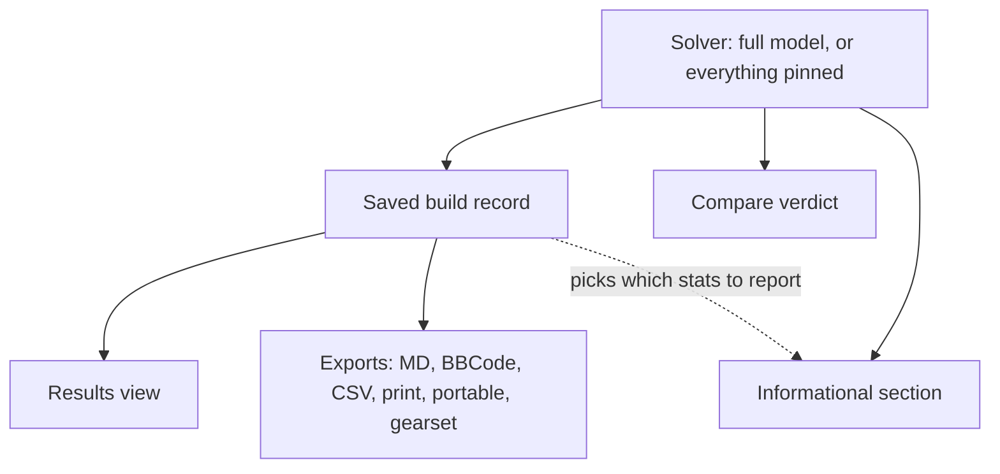
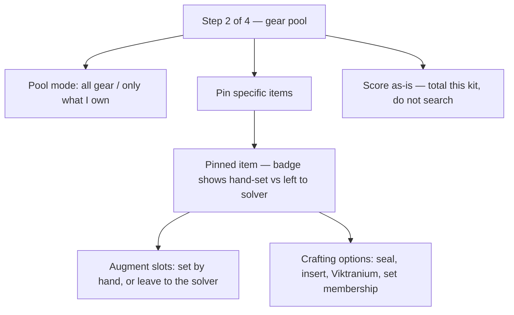
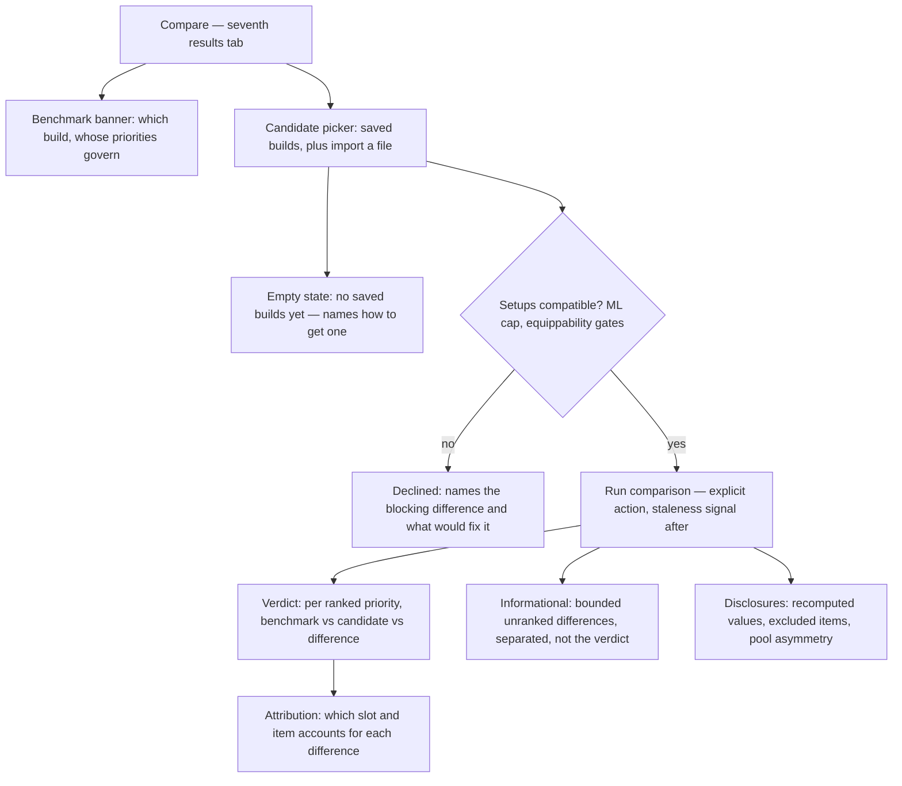

# Loadout Library, Compare, and Manual Building - Plan

## Goal Capsule

- **Objective:** Turn the app from a one-solve-at-a-time optimizer into a build library: one saved record per loadout, shareable and re-importable, comparable against each other under the benchmark's priorities, and hand-buildable down to individual augments and crafts.
- **Product authority:** This document. Requirements and Key Decisions here are settled unless a later plan supersedes them in place.
- **Sequencing:** This effort is queued behind the open player-reported correctness issues — #88 (bonus-type stacking), #91 (niche gear over holistic value), #92 (set-bonus over-fitting), #93 (data currency). A build library is built on top of the optimizer's core claim, and that claim is what players are currently disputing. Plan and ship those first.
  - **Gate status (checked 2026-08-17):** #91, #92 and #93 are CLOSED; only #88 remains open. Three quarters of this gate has lifted since the plan was written, so re-read the sequencing before assuming the effort is blocked. The plan itself was never committed — it sat in a git stash on a since-deleted branch until this recovery, which is why the note went stale unnoticed.
- **Open blockers:** None. The effort ships whole rather than staged (KD12).

---

## Product Contract

### Summary

One saved-build record that is both the character and the loadout, written only at the end of a solve and holding everything needed to reload, export, or compare it. Loadouts become shareable and re-importable, with a Compare tab — reachable by importing a file or picking from saved builds — that scores those against whatever build is currently loaded, judged on that build's priorities. Pinning grows teeth: a pinned item expands to its augment slots and craft options, so pinning everything is a hand-built loadout.

### Problem Frame

The app can already compare one loadout against another: the Alternatives tab scores a near-optimal alternative against the current optimum, reports a per-ranked-target delta (`web/alternatives.js:21`), and renders per-target contributor attribution (`web/results.js:427-470`). What it cannot do is take the other loadout from anywhere but its own solver. A build the player saved last month, or one another player sent them, has no way in. So comparison happens by exporting two builds and reading them side by side by eye — the workaround the site's owner uses today.

Three things block the library the app is one step away from being.

**Saving is confusing at the point of entry and lossy at the point of storage.** The intro step offers a "Character name" field whose help text reads *"Name this character to save its build and reload it later"* (`web/wizard.js:882`), implying a save that does not happen there. The real save is a second name input at the results step (`web/wizard.js:1098`). Beneath that, everything persisted passes through a hand-maintained twenty-field allowlist (`web/persist.js:15`), while a freshly-solved build renders from the full unstripped result. The same renderer therefore receives two different shapes — the full result on a solve (`web/wizard.js:1619`), the stripped snapshot on a reload (`web/wizard.js:1797`) — so anything nobody remembered to add to the allowlist appears on screen and then vanishes on reload. That has already happened: the comment at `web/persist.js:20` records `creditReport` being added after the declared-credit honesty disclosure went quiet on reload while still solving correctly.

**Sharing is a dead end.** The app writes a versioned `ddo-loadout/v1` envelope carrying the verbatim saved record plus a stable projection (`web/exporters.js:356`), designed for exactly this effort and deferred twice. Nothing reads it back — issue #190. A player can hand the file to someone; neither of them can load it.

**The solver cannot be told about an ordinary augment it did not choose.** Per-host binding already exists for the crafting families and for Set Augments: each crafting option is a per-option binary gated by its host item, and a Set Augment copy is a `y[aug,i]` binary tied to a specific host with a per-host Colorless cap (`web/solver.js:396-404`). Ordinary augments are the exception — they use aggregate per-colour capacity, with the physical placement reconstructed after the solve. That exception is deliberate and documented: a variable per physical slot "scaled with the candidate-item count and blew the program up ~100×" (`web/solver.js:277-278`). So the gap is narrower than "the model cannot bind an augment to a host", and harder than it looks: the binding pattern exists, and extending it to the full augment pool is what runs into a recorded performance wall.

### Key Decisions

- KD1. **One record is both the character and the loadout.** There is no separate character entity; the record's name is the only identity, and a player who wants several builds names them separately. (session-settled: user-approved — chosen over grouping several loadouts under a character: two name inputs already confuse the entry flow, and a single record lets reload, export, and compare read one shape.)

- KD2. **The compare verdict is strictly on the benchmark's ranked priorities, with a separate labelled section for everything else.** (session-settled: user-directed — chosen over a ranked-only view: strict priority scoping is structurally blind to an unexpected strength, which is one of the three things the comparison exists to surface.)

- KD3. **The benchmark is whatever build is currently loaded.** Importing or picking a saved build puts it in the wizard and makes it the working build; solving replaces it. There is no separate designation step. (session-settled: user-directed — chosen over an explicitly pinned reference: it adds a concept the wizard does not need.)

- KD4. **Priorities come only from the working build.** An import contributes gear and character setup, never a ranking — at either import point. A comparison candidate's own priorities are ignored. (session-settled: user-directed — chosen over inheriting an imported build's ranking: an import contributes gear, never judgment.)

- KD5. **An imported loadout is re-resolved against the current catalog.** Its items are looked up in today's dataset and scored with today's values, not the values embedded in the file. (session-settled: user-directed — chosen over scoring from the file's embedded item objects: a build exported before a value correction would otherwise win on numbers the app knows are wrong, and the `Parrying` correction makes that a live case rather than a hypothetical.)

- KD6. **Manual building extends the pin list rather than adding a mode.** A pinned item expands to its augment slots and crafts; pinning all fourteen slots is a complete manual build. The pin list therefore carries two meanings — a deliberate user override and a recorded loadout — which R30 requires be kept distinguishable. (session-settled: user-directed — chosen over a separate build-it-myself pool mode: a second mode creates two ways to say "this item is fixed" that must then be kept consistent with each other.)

- KD7. **Scoring a fixed loadout runs through the solver, not beside it — with no exceptions.** "Score this, do not search" is the existing model with everything pinned: same objective, same bonus-type bucketing, same lexicographic stages. The informational section is included: its totals come from bounded extra solver stages over the already-pinned loadout, not from a projection. (session-settled: user-approved — chosen over totalling the affixes directly in a projection: that would be a second implementation of DDO's stacking rules, and a comparison that disagreed with a solve would be indistinguishable from a real finding. The projection carve-out was considered and rejected because a player who re-ranks a stat surfaced there and re-solves could get a different number back — the exact failure this decision exists to prevent — so the section is bounded to the largest N differences instead, which caps the cost that made a projection tempting.)

- KD8. **The results view renders from the saved-record shape.** The hand-maintained result allowlist stops being the seam between what is shown and what is kept. (session-settled: user-approved — chosen over keeping the allowlist and adding fields as they are missed: that mechanism has already dropped a disclosure once, and it fails silently.)

- KD9. **The don't-solve control is named "Score as-is."** (session-settled: user-approved — chosen over "Use my picks exactly" and "Skip the solve": it is succinct, says what it does rather than what it declines, and reads directly against the existing Solve action.)

- KD10. **Guidance uses the app's existing badge-and-glow vocabulary.** A badge asserts a fact about a slot or record — `pinned`, `locked empty`, `Artifact`, `verified` / `quarantined`. A glow (`is-set`, driven by `contribGlow`) asserts that something is contributing or satisfied. Every state this effort adds — hand-set versus solver-chosen, imported versus your own, verdict versus informational — extends that system rather than introducing a parallel one.

- KD11. **A comparison runs only between compatible character setups; otherwise it is declined.** Two builds are compared under one shared frame or not at all. (session-settled: user-directed — chosen over scoring the candidate under the benchmark's setup, and over scoring each under its own. Scoring under the benchmark's setup silently drops items the benchmark's character cannot wear; scoring each under its own puts two differently-scaled columns side by side, since affix values scale at each build's own ML cap. Both produce a number that looks comparable and is not, which is the failure mode the project's disclosure culture exists to prevent. Declining is the honest third answer, and it narrows what Compare can be pointed at — see R22.)

- KD12. **The effort ships whole rather than staged.** (session-settled: user-directed — chosen over shipping the record rework and envelope reader first: two reviewers independently proposed staging, and it was declined so that import, Compare, and manual building arrive as one coherent capability rather than an intermediate state where a build can be imported but not compared.)

The single-source consequence of KD7 and KD8 together:

Verdict numbers come from the solver so a comparison cannot disagree with a solve. Everything displayed or shared comes from the record so live, saved, and shared cannot disagree with each other. The informational section reads from the record only to decide which stats to report; its totals come from the solver like every other number, which is what keeps a single stacking implementation in the app.

### Requirements

**The saved build record**

- R1. A saved build is one record holding the character setup, the priorities, the gear pool choice, every pin and manual pick, and the solved loadout. Reloading it restores the build without a re-solve.
- R2. Saving happens only from the results view, after a loadout exists.
- R3. The first wizard step offers a picker that loads a previously saved build; it does not offer to name or save one. Picking a build that already has a solved loadout goes straight to its results, preserving today's fast-reload path, with the wizard steps still reachable for editing.
- R4. The results view, every export, and the compare view read the same saved-record shape for everything they display about a build. A comparison's scored values are the exception: they are recomputed by the solver per KD5 and KD7, never read from a candidate's stored solve.
- R5. When a save cannot be written because browser storage is full, the app says so and declines the save without disturbing existing builds.

**Sharing and import**

- R6. A saved build exports as a portable file that this app can read back.
- R7. Import is offered in exactly two places: the first wizard step and the compare view.
- R8. A build imported at the first wizard step becomes the working build — its gear, character setup, and manual picks load as pins. The working build's priorities are left unchanged.
- R9. A build imported in the compare view is stored alongside saved builds and becomes available as a comparison candidate. It never becomes the working build.
- R10. An imported file is untrusted third-party input and is refused whole — with a message, and nothing written to storage — unless it passes a size gate, carries the expected format identifier and a supported schema version, and its record sanitizes cleanly through the existing backup reader's pollution-key and allowlist defences. This whole-file refusal is distinct from R33's per-item partial acceptance, which applies only after a file has been accepted.
- R11. An import whose build name collides with an existing saved build never overwrites it. The app discloses the collision and stores the incoming build under a distinct name.
- R12. An imported record stores its provenance, and that provenance is shown wherever the record appears — the first step's picker, the results view, and any re-export — so a build received from another player is never presented as one the player solved.

**Compare**

- R13. Compare is a results tab that compares the working build against one or more builds picked from storage.
- R14. The player chooses which saved builds take part in a comparison.
- R15. Every comparison is scored under the benchmark's priorities; a candidate's own priorities are ignored.
- R16. A candidate is scored exactly as given — its items, augments, and crafting choices are all fixed, and nothing is searched for or substituted.
- R17. The verdict reports, for each ranked priority, the benchmark's value, the candidate's value, and the difference.
- R18. A separate section below the verdict reports the largest differences in stats neither build ranked. Its totals come from the solver per KD7, it is bounded to a fixed number of differences, and it is labelled informational and excluded from the verdict.
- R19. A comparison attributes each difference to the slot and the item or set bonus that accounts for it.
- R20. A comparison runs on an explicit action rather than on opening the tab, and a computed verdict carries a staleness signal once the working build changes underneath it.
- R21. When the benchmark was solved over a pool the candidate is not drawn from, the verdict says so — a candidate that cannot in principle exceed a lexicographic optimum on its own priorities is labelled as such rather than reported as simply worse.
- R22. A comparison runs only when the two builds' character setups are compatible enough that their numbers mean the same thing. When they are not, the app declines the comparison and names the specific incompatibility rather than producing a number.
- R23. Compatibility is judged on what would actually corrupt the comparison: a differing ML cap, because affix values scale to it, and any character gate that would make one build's items unequippable for the other. Differences that change neither are not grounds to decline.

**Manual building in the gear pool**

- R24. A pinned item can be expanded to show its augment slots and its crafting options.
- R25. Any augment slot or crafting option on a pinned item can be set by hand or left for the solver.
- R26. A loadout with every slot pinned and every augment and craft chosen is a complete manual build. No separate mode exists to create one.
- R27. A "Score as-is" control totals the loadout exactly as picked instead of searching for a better one.
- R28. With "Score as-is" off, the solver fills only what was left unset and never changes what was set.
- R29. A hand-set augment or craft is preserved in the result, the record, and every export even when it contributes nothing to the ranked priorities.
- R30. A recorded or scored loadout is carried in a channel distinguishable from the player's explicit pins, so per-item escape hatches and pin-provenance disclosures continue to read only deliberate user overrides.
- R31. A manually built loadout saves, exports, and compares through the same path as a solved one.

**Honesty and disclosure**

- R32. An imported build's affix values come from the current catalog, not from the file.
- R33. A pinned item excluded from a scored loadout for any reason — pool mode, ML cap, equippability, or catalog resolution — is named in the result rather than silently omitted. The pool-mode filter never removes an explicitly pinned item.
- R34. Every comparison candidate, imported or saved, discloses that its numbers were recomputed against the current catalog and may differ from what its own saved result shows.

**Guidance and legibility**

- R35. Every state this effort adds is expressed in the existing badge-and-glow vocabulary per KD10, not a parallel one.
- R36. A pinned item shows how much of it is set by hand and how much is left to the solver without being expanded.
- R37. Every slot, augment, and craft in a displayed loadout is attributable to whoever chose it — the player or the solver.
- R38. "Score as-is" states what it will do before it runs, and its state remains visible on the result, so a totalled loadout is never mistaken for an optimized one.
- R39. Compare states which build is the benchmark and that its priorities govern the verdict, at the point of comparison.
- R40. The verdict and the informational section are distinguishable at a glance, so a difference outside the verdict is never read as a win.
- R41. Every empty state this effort introduces names the action that fills it.
- R42. A candidate declined under R22 says which setup difference blocked it and what would make the two builds comparable, rather than reading as a failure.

The gear pool step's new composition, for R24–R28:

The Compare tab's region composition, for R13–R23 and R39–R42:

### Key Flows

- F1. Save a build
  - **Trigger:** A solve completes and the player wants to keep it.
  - **Steps:** The player names the build in the results view and saves. The record captures inputs, pins, manual picks, and the loadout.
  - **Outcome:** The build appears in the first step's picker and in the compare view's candidate list.
  - **Covered by:** R1, R2, R3, R4, R5

- F2. Load a shared build and beat it
  - **Trigger:** A player receives a portable loadout file that another player exported per R6.
  - **Steps:** Import at the first wizard step; the file is validated and refused whole if it does not pass. Gear and character setup load as pins; the priority ranking is untouched. The player sets or keeps their own priorities, then solves — either freeing the pins to let the solver search, or keeping them and using Score as-is to total the kit as received.
  - **Outcome:** A working build, benchmarked on the player's own priorities.
  - **Covered by:** R6, R7, R8, R10, R27, R28, R32, R38

- F3. Compare against saved builds
  - **Trigger:** The player opens Compare on a solved build.
  - **Steps:** They pick candidates from storage, or import a file that is stored as a new candidate under a non-colliding name. Each candidate is checked for setup compatibility and declined with a reason if it fails. They run the comparison explicitly; each surviving candidate is scored with everything pinned, under the benchmark's priorities and the current catalog.
  - **Outcome:** A per-priority verdict with attribution, a bounded informational section for unranked differences, and disclosure of recomputation, excluded items, and pool asymmetry.
  - **Covered by:** R9, R11, R12, R13, R14, R15, R16, R17, R18, R19, R20, R21, R22, R23, R33, R34, R39, R40, R42

- F4. Hand-build a loadout
  - **Trigger:** The player already knows the kit they want and wants its totals.
  - **Steps:** They pin each item in the gear pool step, expand each to choose its augments and crafts, and turn on Score as-is. Each pinned item shows at a glance what is still unset.
  - **Outcome:** A totalled loadout — not an optimized one, and labelled as such — that saves, exports, and compares like any solved build.
  - **Covered by:** R24, R25, R26, R27, R29, R30, R31, R36, R37, R38

### Acceptance Examples

- AE1. Partial manual picks
  - **Covers R25, R28.**
  - **Given** a pinned item with a blue slot set to a chosen augment and a colourless slot left unset, and Score as-is off,
  - **When** the player solves,
  - **Then** the blue slot holds exactly the chosen augment and the colourless slot holds whatever the solver picked.

- AE2. A hand-set augment that wins nothing still survives
  - **Covers R29.**
  - **Given** a hand-set augment that advances none of the ranked priorities,
  - **When** the loadout is solved, saved, and exported,
  - **Then** the augment appears in all three, rather than being dropped as contributing nothing.

- AE3. Score as-is leaves gaps empty
  - **Covers R26, R27.**
  - **Given** a loadout with eleven of fourteen slots pinned and Score as-is on,
  - **When** the player solves,
  - **Then** the three unpinned slots stay empty and the result totals only the eleven pinned items.

- AE4. A candidate is judged on the benchmark's ranking
  - **Covers R15, R17.**
  - **Given** a benchmark ranked Melee Power then Doublestrike, and a candidate whose own saved ranking is Constitution then Dodge,
  - **When** the two are compared,
  - **Then** the verdict reports Melee Power and Doublestrike for both builds and the candidate's own ranking is not shown as the basis of the comparison.

- AE5. An unexpected strength surfaces without contaminating the verdict
  - **Covers R18, R40.**
  - **Given** a candidate carrying materially more Fortification than the benchmark, and neither build ranks Fortification,
  - **When** the two are compared,
  - **Then** Fortification appears in the informational section with a solver-produced total, visually separated and labelled as outside the verdict, and the verdict itself is unchanged by it.

- AE6. An item that no longer resolves
  - **Covers R33, R34.**
  - **Given** an imported build whose belt does not resolve against the current catalog,
  - **When** it is scored,
  - **Then** the comparison runs on the remaining items, names the belt as excluded, and discloses that the candidate's numbers were recomputed.

- AE7. A pinned item the pool mode would have dropped
  - **Covers R33.**
  - **Given** an owned-only gear pool and a pinned item the player does not own,
  - **When** the loadout is scored,
  - **Then** the pin is honored rather than filtered away, or the item is named as excluded — never silently absent from the total.

- AE8. A hostile or malformed import
  - **Covers R10.**
  - **Given** a file that is not a valid portable loadout, or one carrying a newer schema version than the app supports,
  - **When** the player imports it,
  - **Then** the app refuses the whole file with a message and writes nothing to storage.

- AE9. An import that collides with an existing name
  - **Covers R11.**
  - **Given** a saved build named "Sook — Reaper" and an imported file carrying the same name,
  - **When** the import is accepted,
  - **Then** the existing build is untouched, the incoming build is stored under a distinct name, and the collision is disclosed.

- AE10. Storage is full
  - **Covers R5.**
  - **Given** browser storage that cannot accept another record,
  - **When** the player saves,
  - **Then** the app reports that the save failed and every previously saved build is still intact.

- AE11. Import on a fresh session
  - **Covers R8.**
  - **Given** a new session with no priorities set,
  - **When** the player imports a build at the first wizard step,
  - **Then** the gear and character setup load, the priority list stays empty, and the player is routed through the priorities step before anything can be scored.

- AE12. Compare with an empty library
  - **Covers R41.**
  - **Given** a player who has never saved or imported a build,
  - **When** they open Compare,
  - **Then** the tab explains that a comparison needs a saved or imported build and names how to produce one, rather than showing an empty picker.

- AE13. The benchmark changes under a computed verdict
  - **Covers R20.**
  - **Given** a comparison the player has already run,
  - **When** they re-solve and the working build changes,
  - **Then** the displayed verdict is marked stale rather than continuing to read as current.

- AE14. Incompatible setups are declined, not scored
  - **Covers R22, R23, R42.**
  - **Given** a benchmark capped at ML 30 and a candidate saved at ML 34,
  - **When** the player selects that candidate,
  - **Then** the comparison is declined, the differing ML cap is named as the reason, and the player is told what would make the two comparable — no verdict numbers are shown.

- AE15. A harmless setup difference still compares
  - **Covers R23.**
  - **Given** two builds at the same ML cap whose only difference is one the character gates do not act on,
  - **When** the player compares them,
  - **Then** the comparison runs normally rather than being declined.

### Scope Boundaries

**Deferred for later**

- The "what would I change to catch up" shopping list — turning a comparison into a set of swaps that would close the gap. It needs a real re-solve against the candidate's totals as floors, which is a different piece of work.
- A whole-kit paperdoll view of all fourteen slots. Worth revisiting once host-bound augments and crafts are proven through the pin list.

**Outside this effort**

- Making the four presentation exports (Markdown, BBCode, CSV, print) re-importable. They stay read-only; the portable envelope is the round-trip vehicle.
- Server-side sharing, accounts, or any hosted build library. This is a standing non-goal in `AGENTS.md`, not a deferral.

### Dependencies / Assumptions

- Depends on issue #190, the reader for the `ddo-loadout/v1` envelope. That envelope was designed for this effort and its `core` is the verbatim saved record, so no new persistence path is needed — but the envelope must be deep-cloned or treated as read-only, or an import would edit the user's saved build in place (`docs/plans/2026-08-03-001-feat-universal-exports-portable-round-trip-plan.md:352`). That plan also named the reader's validation contract, which R10 carries: validate the record per-record through the backup reader's sanitizer rather than through its whole-file parser.
- Assumes ordinary augments gain per-host binding. Crafting families and Set Augments already have it (`web/solver.js:396-404`), so the pattern exists; ordinary augments are the exception, and the recorded ~100× program blowup from per-physical-slot variables (`web/solver.js:277-278`) is the constraint any extension has to answer. This is the largest single piece of the effort and the shared prerequisite under compare-scoring and hand-set augments alike.
- Assumes every saved and imported build lives in browser storage. Records carry a denormalized snapshot with full item objects, so a library plus imports consumes storage quickly.
- Assumes existing saved records remain loadable. Whether they need migrating depends on how far the record shape moves under R1 and KD8.
- `variant_id` is a natural key — the item name plus an optional tier label (`src/variants.py:111`) — so it survives a dataset rebuild by construction and is a sound re-resolution key for R32 and R33. It moves only when gear-planner renames an item or changes a tier label, which is the same fragility the `.gearset` exporter already lives with. That failure mode is what R33's disclosure exists for.

### Outstanding Questions

**Deferred to planning**

- Whether per-host placement for ordinary augments replaces the aggregate per-colour capacity model or sits alongside it, and how either answer avoids re-triggering the recorded ~100× blowup. Replacing it touches the dominance pre-filter's soundness obligations; sitting alongside it risks two placement models double-booking the same physical slot, which the shared per-colour capacity constraint currently prevents.
- How many differences the informational section reports (R18's bound), and how the candidate stats are chosen before the solver stages run — the union of both builds' affixes is too large to stage exhaustively.
- What threshold makes two character setups incompatible under R23. The ML cap is exact, but "a gate that would make one build's items unequippable for the other" needs a concrete test — likely a dry-run of the candidate's items through the benchmark's equippability filter, declining when any would drop.
- Whether existing saved records need a migration, and what a record from before this effort renders as in Compare.
- How large the storage budget actually is in practice, and whether the snapshot needs slimming before a library of builds is realistic.
- How Compare and Alternatives are distinguished for the player, given that Alternatives already answers "how does another loadout differ from mine" for solver-generated candidates.
- Whether a hand-set augment becomes a hard equality constraint or a preference, since only the former survives the settle stage's placement minimization.

### Sources / Research

- `web/persist.js:15` — the `RESULT_KEEP` allowlist; `web/persist.js:20` carries the `creditReport` incident that motivates KD8.
- `web/persist.js:41` — `INPUT_KEYS`, the persisted-input allowlist that `web/backup.js` imports so the two cannot drift.
- `web/persist.js:131` — the store writes by record name, which is why R11 needs a collision rule.
- `web/wizard.js:882` and `web/wizard.js:1098` — the two character-name inputs behind R3.
- `web/wizard.js:1619` and `web/wizard.js:1797` — the two shapes `renderResults` receives, full result versus stripped snapshot.
- `web/solver.js:90-107` — `slotConstraintBodies`, which today understands only `pin` and `empty`, and treats a pin whose variant is absent from the pool as a silent no-op.
- `web/solver.js:277-278` — the recorded ~100× program blowup that forced the aggregate per-colour augment model.
- `web/solver.js:396-404` — Set Augment per-host binding (`y[aug,i]`, host-gated, per-host Colorless cap), the existing pattern host-bound placement extends.
- `web/solver.js:583-727` — the host-gated crafting families (Nearly Completed, Viktranium, seal, Green Steel, joker, chosen set-membership).
- `web/solver.js:302` and `web/solver.js:1064` — the "only augments advancing a target" admission rule and the settle stage's `dropNoOpAugments`, the two mechanisms R27 has to survive.
- `web/model.js:616-626` — the TWF escape hatch that reads explicit pins as user intent, the precedent behind R28.
- `web/alternatives.js:21` and `web/results.js:427-470` — the existing per-ranked-target delta and per-target attribution that R17 and R19 build on.
- `web/results.js:248` and `web/results.js:323` — `contribGlow` and the `pd-badge` family, the visual vocabulary KD10 extends.
- `web/results.js:711-716` — the six existing results tabs; Compare is a seventh.
- `web/backup.js` — the existing reader for the saved-record shape: schema-version window, allowlist shared with `persist.js`, prototype-pollution reviver, size cap. The closest precedent for R10.
- `web/import.js` — the Trove CSV reader, cited only as the pure-parser-with-browser-global pattern.
- `src/variants.py:111` — `variant_id` construction, the natural key an imported build re-resolves against.
- `web/exporters.js:356` — `toPortableJSON` and the `ddo-loadout/v1` envelope.
- `CONCEPTS.md` — Augment (aggregate per-colour capacity), Lexicographic solve (the settle stage already pins a loadout), Gated contribution, Bonus-type bucket, Benchmark loadout.
- `docs/solutions/design-patterns/where-a-per-item-gate-may-live-in-the-solver.md` — the documented incident behind R28.
- Issue #190 — the deferred envelope reader this effort depends on.
