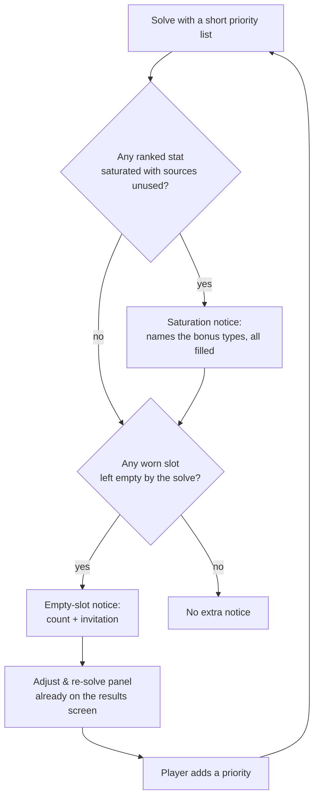
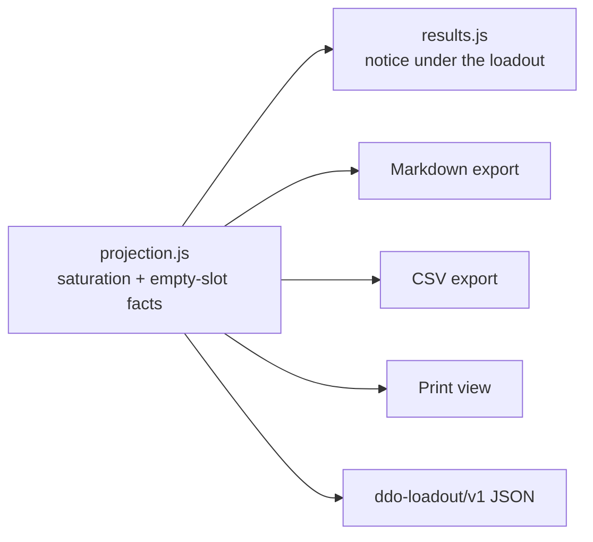

# Stat Saturation and Empty Slots - Plan

## Goal Capsule

- **Objective:** Tell a player why a ranked stat cannot go higher, name how many worn slots their priorities left empty, and invite them to say more about the build they want — without changing which loadout the solver returns.
- **Product authority:** This document. Requirements and Key Decisions here are settled unless a later plan supersedes them in place.
- **Product Contract preservation:** unchanged. Planning decided both parked Outstanding Questions (see KTD3 and KTD5) and added no product scope.
- **Open blockers:** None.

---

## Product Contract

### Summary

When a ranked stat is maxed, the loadout says so in DDO's own terms — which bonus types carry that stat, and that all of them are already filled. When the solve leaves worn slots empty, it names how many and offers to use them. The player supplies more priorities; the tool re-solves. The solve itself is untouched.

### Problem Frame

A player who ranks one stat gets a provably optimal answer that reads as a broken one.

Ranking a single priority at ML 34 — say `Kinetic Lore`, the force spell-crit stat — fills 3 of 14 worn slots and leaves the other **eleven empty**. It could not do otherwise: lexicographic stage 1 maxes the top priority, and with nothing ranked below it there is no objective left, so no other slot has a reason to be filled. To the player that is a nearly bare character sheet, indistinguishable from the tool giving up, and #91 collects five reports of exactly this shape.

*(Corrected during implementation. This plan originally described the leftover slots as filled with tie-broken gear. They are not filled at all — `chosen` carries only slots where an item contributes. The first implementation counted filler picks and returned zero on this exact scenario.)*

The ceiling itself is also invisible. `Kinetic Lore` reaches a character through two doors: items grant it as an `Equipment` bonus, named sets grant it as an `Artifact` bonus. Same bonus type does not stack, so one item plus one set is the maximum — a second `Kinetic Lore` item competes with the first and adds nothing, the same way a second +6 Constitution item does. A player asking why no other force-lore gear appears is asking for the second Constitution ring, and the tool currently says nothing.

The mirror of this already ships. `zeroSourceNotice` (`web/results.js:637`) tells a player when nothing in the active pool carries a stat they ranked, because scoring zero with no explanation "reads as the tool being broken." This is the same complaint from the other end.

### Key Decisions

**Invite, do not auto-fill.** The tool names the empty slots and offers to use them; it never picks gear for them. Filling them with broadly useful gear would serve a beginner better, but the moment the tool prefers Physical Sheltering over Melee Power in a slot nobody ranked, it holds an opinion about good gear — which is what `AGENTS.md` declines weighted-sum modes to avoid. *(session-settled: user-directed — chosen over disclosure-only, which diagnoses without remedying, and auto-fill, which smuggles a house build style under a proof.)*

**The solver is untouched, and needs to be.** A slot is left empty precisely because nothing available for it could raise a ranked stat — anything that could would already have been chosen. So the fix lives entirely above the solve, and strict lexicographic priority is preserved by construction rather than by care.

**Saturation and empty slots are independent notices.** A player ranking six stats can max the top one with every slot filled; a player can have empty slots with nothing saturated. Coupling them into one message would suppress each fact in the case where only the other holds.

**A slot the player locked empty is not reported.** They made that choice deliberately; reporting it back as "nothing could improve your priorities" would be both wrong and patronising. This replaces an earlier rule about set pieces, which the corrected premise makes moot — there are no filler picks to exclude.

**The facts are authored in `projection.js`, not `results.js`.** `boundNotice` returns HTML and is not part of the content model, which `web/projection.js:694-699` records as the reason `creditNoticeLines` was lifted into projection: a qualifier written only in `results.js` is solve-visible but share-invisible. Saturation follows `creditNoticeLines`, not `boundNotice`.

### Key Flow

A player solves with a short priority list, learns why the answer looks thin, and fixes it without leaving the results screen.



Both notices are authored once and fan out to every surface:



### Requirements

**Saturation disclosure**

- **R1.** When no source in the active pool can raise a ranked stat further, the result says the stat is maxed and names the bonus types that carry it.
- **R2.** The saturation notice does not attribute the ceiling to any single cause the tool cannot verify. Naming the ML band is specifically forbidden: the dominance pre-filter prunes gear before the solver sees it, and blaming the band was already wrong once for an ML 29 item well inside a cap of 34.
- **R3.** Saturation is computed against the active pool, following the precedent set by `poolStatNames` (`web/results.js:600`), not against the whole dataset.

**Empty slots**

- **R4.** The result names how many worn slots the solve left empty.
- **R5.** A slot the player locked empty is not reported — they chose that, and naming it back reads as the tool second-guessing them.
- **R6.** The two notices fire independently; neither suppresses the other.

**Invitation**

- **R7.** When empty slots exist, the result offers a path to add priorities and re-solve, pointing at the existing Adjust & re-solve panel (`web/wizard.js:1144`) rather than introducing a second surface.
- **R8.** The tool does not choose gear for the empty slots and does not suggest that it could.

**Distribution and safety**

- **R9.** Both facts are authored in `web/projection.js` and reach the Markdown, CSV, print, and `ddo-loadout/v1` outputs as well as the app.
- **R10.** The returned loadout does not change. The golden solver guard (`tests/solver_golden.test.js`, 11 fixtures) stays green without re-ratification; a golden diff is a failure, not an accepted drift.
- **R11.** A restored saved character discloses identically without re-solving, reading plain JSON on the result rather than the live program.

### Acceptance Examples

- **AE1.** ML 34, sole priority `Kinetic Lore`. The result reports the stat maxed at 30, names `Equipment` and `Artifact` as the two carrying bonus types with both filled, counts the worn slots left empty, and offers to add priorities.
- **AE2.** A ranked stat nothing in the pool supplies still produces the existing zero-source notice, and no saturation notice. The two describe different facts.
- **AE3.** Enough ranked priorities that every worn slot is filled. No empty-slot notice appears; the saturation notice may still fire for the top stat.
- **AE4.** The Markdown export of the AE1 build carries the same two facts as the app.
- **AE5.** All 11 golden fixtures produce byte-identical `perTarget` and `chosen` values.

### Scope Boundaries

**Deferred to follow-up work**

- Surfacing near-ties between sets in the Alternatives tab — Legendary Arcsteel Battlemage (3 pieces) grants the same 6 `Artifact` `Kinetic Lore` as Biting Sands (2 pieces), and the solver correctly takes the cheaper one. File before this plan's PR merges.
- Expanding a one-stat request into a full ranked list via presets, which addresses the under-specified question rather than its symptom. Lives in #95.

**Outside this product's identity**

- Filling the empty slots with gear the tool judges broadly useful. Declined above; it requires the tool to hold an opinion about good gear.
- Any change to strict lexicographic priority, including weighted-sum or Pareto modes. Listed in `AGENTS.md` Non-goals.
- The solver-behavior half of #91: holistic item value, niche and leveling picks, and re-spending slots on an already-satisfied stat.

### Sources

- Issue #239 — the narrow framing this plan reopened.
- Issue #91 — the parent, carrying five verbatim player reports.
- Issue #92 — closed as already-correct; carries the reproduction and the independently computed ceiling (30 with Minor Artifacts excluded, 32 with the opt-in on).
- `web/results.js:600-680` — `poolStatNames`, `datasetHasStat`, and `zeroSourceNotice`, the mirror mechanism this follows.
- `web/results.js:512-580` — the `artifactNotice` / `boundNotice` family and its render site under the loadout.
- `web/projection.js:688-712` — `creditNoticeLines` and the recorded reason projection, not `results.js`, is where an exported qualifier must be authored.
- `web/wizard.js:1144-1152, 1532` — the Adjust & re-solve panel and `addPriority`.
- `AGENTS.md` — Non-goals, and the standing rule that a mechanic reaching the solver must reach the exports.

---

## Planning Contract

### Key Technical Decisions

**KTD1 — Both facts are computed in the solver beside `buildCreditReport` and persisted.** *(Corrected during implementation: the original decision derived the slot count in projection, which only works if the count comes from the result alone.)* Saturation needs the candidate pool and the empty-slot count needs `model.worn`; both live on `model`, which `persist.js`'s `RESULT_KEEP` allowlist drops (`web/persist.js:14-27`), so neither can be recomputed on a restored build. Both therefore follow `creditReport` exactly: built where the result is assembled (`web/solver.js:1307`), plain JSON by construction, added to the allowlist. That is what satisfies R11.

**KTD2 — Reuse `equivType` for bucket identity; do not widen it.** The census keys a stat's sources by `` `${stat}||${equivType(type)}` `` — the same seam `variantBuckets` uses (`web/model.js:35,56`). Read it; do not change it. Widening this exact function to serve one caller is the defect documented in `docs/solutions/conventions/close-a-defect-at-the-narrow-control-not-the-shared-rule.md`, which cost a revert last week: an absent bonus type and an explicit `Untyped` are two buckets that legitimately sum across 30 stats.

**KTD3 — Saturation fires only when the pool still holds unused sources for that stat.** *(decides the parked Outstanding Question on how "maxed" should read.)* Priority 1 is maxed by construction — stage 1 maximizes it globally — so "no source can raise this" is trivially true for the top stat on every solve, and an ungated notice would be noise on every result. The informative case is the one that generates complaints: the pool holds other sources for the stat that went unused because they would share a filled bucket. `Kinetic Lore` at ML 34 has 57 `Equipment` sources and uses one. Gating on unused sources also sidesteps the second half of the parked question — a stat limited by slot competition rather than bucket occupancy simply does not present as saturated, because its unused sources were not excluded by a filled bucket.

**KTD4 — Empty slots are `model.worn` minus `chosen`, computed in the solver.** *(Corrected during implementation; the original decision reused `whyThis` to find tie-broken filler, which does not exist.)* `chosen` carries only slots where an item contributes, so the leftover worn slots are simply absent from it. This needs `model.worn`, and `model` is dropped from the saved snapshot, so it is built at solve time as plain JSON beside the saturation report rather than derived in projection.

**KTD5 — The invitation names stats the current loadout already supplies incidentally.** *(decides the parked Outstanding Question on whether to name stats.)* A bare count leaves a beginner no better off; a curated suggestion list makes the tool hold the opinion about good gear that KTD-level decision "Invite, do not auto-fill" exists to avoid. Naming stats the player's own equipped items already carry is derived from their build rather than from taste, and each one is verifiably already in hand. Cap the list so the notice stays a sentence, and order by the number of equipped items supplying the stat.

**KTD6 — Neither notice names a cause for the ceiling.** R2 forbids attributing saturation to the ML band. The wording states only what is checkable: which bonus types carry the stat, and that each is filled. `zeroSourceNotice` already refuses cause-naming for the same reason (`web/results.js:650-658`), and the comment there records the misattribution that shipped.

### Assumptions

- The golden fixtures do not move. Nothing in this plan reaches the solver's objective, constraints, or tie-break — the new report is written onto the result after the solve completes. Verify rather than assume: a golden diff means something was wired into the solve path by mistake, and is a defect to fix rather than a change to re-ratify.
- `RESULT_KEEP` is the only allowlist the saturation report must join. `backup.js` imports the input allowlist, not this one; the comment at `web/persist.js:28-30` records that pairing.
- No Python-side change is required. Nothing in `build_dataset.py`, `src/`, or `data/seed/` is touched, so `web/data/items.json` is unchanged and the dataset guards are unaffected.

### Sequencing

U1 and U2 are independent and can land in either order. U3 depends on both — it exposes them through the content model. U4 depends on U3 for both facts and on U1 for saturation. U5 verifies everything in the browser and moves the build stamps.

---

## Implementation Units

### U1. Build the saturation report on the solver result

**Goal:** each ranked stat that is saturated with unused sources remaining is recorded as plain JSON on the result, and survives a save/restore round trip.

**Requirements:** R1, R2, R3, R11; KTD1, KTD2, KTD3, KTD6

**Dependencies:** none

**Files:**
- `web/solver.js` — a `buildSaturationReport` beside `buildCreditReport`, wired into the result object at the `creditReport` call site
- `web/persist.js` — add the report key to `RESULT_KEEP`
- `tests/solver.test.js` — census and gating scenarios
- `tests/persist.test.js` — round-trip scenario

**Approach:** walk the active pool the way `poolStatNames` does — worn variants and their `parsed_set_bonuses`, then the augment, dino, nearly-complete, viktranium, seal, thunder-forged and green-steel pools, then both set-def maps — but collect `(bucket, value, sourceName)` per ranked stat rather than names alone. Bucket identity comes from reading `equivType`; do not modify it (KTD2).

A stat is saturated when every bucket carrying it in the pool is filled at that bucket's pool-best value in the chosen loadout. Emit an entry only when at least one pool source for the stat went uncredited (KTD3). Each entry carries the stat, its achieved total, the carrying bonus types, and the count of unused sources — facts only, no cause and no remedy prose (KTD6).

**Execution note:** write the gating test before the census. The easy bug here is a report that fires for every top priority, and it is invisible unless a test pins the negative case.

**Test scenarios:**
- Covers AE1. A pool where a stat has two buckets, both filled at their best value, and additional same-bucket sources unused → one entry naming both bonus types and the unused count.
- A pool where a stat has exactly one source, used → no entry, because nothing went unused.
- A stat whose second bucket is reachable but unfilled → no entry; it is not saturated.
- A stat with an absent bonus type on an item and an explicit `Untyped` on an augment → two distinct buckets, proving `equivType` was read and not widened.
- Covers AE2. A stat no pool source carries → no entry, and the existing zero-source path is unaffected.
- A saved character round-trips through `stripResult` and the report survives byte-identical.

**Verification:** the report appears on a real ML 34 single-priority `Kinetic Lore` solve naming `Equipment` and `Artifact`; a six-priority solve produces entries only for stats that actually saturated; a restored save shows the same report without re-solving.

### U2. Report the worn slots the solve left empty

**Goal:** the result carries how many worn slots came back empty, and which.

**Requirements:** R4, R5; KTD4

**Dependencies:** none

**Files:**
- `web/solver.js` — an empty-slot report beside the saturation report
- `web/persist.js` — add the key to `RESULT_KEEP`
- `tests/solver.test.js` — counting scenarios driven by real solves

**Approach:** `model.worn` minus the slots present in `chosen`, excluding any slot the player locked empty via `slotConstraints[slot].type === "empty"`. Plain JSON on the result, for the same reason as the saturation report: it needs `model`, and `model` is dropped from the snapshot.

**Execution note:** drive these tests through `solveLexicographic` against a real model. The first version of this unit was tested against hand-built `chosen` arrays holding filler items — a shape no solve produces — so it passed every test and returned zero on the live dataset.

**Test scenarios:**
- Three worn slots, one contributing → count of two, naming the other two.
- Covers AE3. Every worn slot contributing → count of zero.
- A slot locked empty by the player → not reported.
- The report survives a stringify round trip and the save path.

**Verification:** a real single-priority `Kinetic Lore` solve at ML 34 reports 11 empty slots of 14 worn.

### U3. Expose both facts through the content model and every export

**Goal:** the saturation and empty-slot facts ride in `project()`'s return value and render in all four export surfaces.

**Requirements:** R6, R9

**Dependencies:** U1, U2

**Files:**
- `web/projection.js` — add both to the object `project()` returns, alongside `character.creditNotice`
- `web/exporters.js` — render them in the Markdown, CSV, print, and `ddo-loadout/v1` outputs
- `tests/projection.test.js`, `tests/exporters.test.js`

**Approach:** follow `creditNotice` exactly — it is the precedent for a qualifier that must reach a recipient who cannot re-solve. Carrying the facts through the model is necessary but not sufficient: each renderer must print them, which is the failure `web/projection.js:665-671` records for set `members`. The two facts render independently; neither suppresses the other (R6).

**Test scenarios:**
- Covers AE4. A build with both facts exports Markdown containing both.
- A build with saturation but no empty slots exports only the saturation fact, and vice versa.
- The `ddo-loadout/v1` envelope carries both, so a re-imported build discloses identically.
- CSV and print outputs carry both.
- A build with neither fact exports cleanly with no empty headers or stray separators.

**Verification:** all four exports of the AE1 build name the bonus types and the empty-slot count.

### U4. Render the two notices and wire the invitation

**Goal:** a player sees both facts under their loadout and can act on the empty slots without leaving the results screen.

**Requirements:** R6, R7, R8; KTD5, KTD6

**Dependencies:** U1, U3

**Files:**
- `web/results.js` — two notices joining the `artifactNotice` / `boundNotice` render family
- `tests/results.test.js`

**Approach:** render both beside the existing notices at the loadout, not in the dataset-scoped coverage note — `artifactNotice`'s comment records why this family sits with the loadout. Read the facts from the content model rather than recomputing them.

The invitation names stats the equipped items already supply incidentally, ordered by how many equipped items carry each, capped so the notice stays one sentence (KTD5). It points at the existing Adjust & re-solve fold-up (`web/wizard.js:1144`) rather than adding a surface, and it never suggests the tool could pick gear itself (R8).

**Test scenarios:**
- Covers AE1. A saturated single-priority build renders a notice naming both bonus types, with no mention of the ML band or any other cause.
- A build with empty slots renders the count and an invitation naming at least one incidentally-supplied stat.
- A build with empty slots whose equipped items supply nothing outside the ranked stats renders the count and the invitation without naming any stat.
- Covers AE3. A build with no empty slots renders no empty-slot notice; a saturation notice still renders if one applies.
- Both notices render together when both apply, and neither suppresses the other.
- A restored saved character renders both notices identically without re-solving.

**Verification:** the AE1 build shows both notices under the loadout; clicking through to Adjust & re-solve and adding a named stat produces a build that fills some of the previously empty slots.

### U5. Verify in the browser and ship

**Goal:** the whole path works against real data and the build stamps move together.

**Requirements:** R7, R10

**Dependencies:** U1, U2, U3, U4

**Files:**
- `web/index.html` — `?v=` cache-busts
- `web/app.js` — footer `BUILD`
- `README.md` — `**Current build:**` line

**Approach:** run both suites, then a browser pass over a local server. Unit tests prove the facts; only the browser proves the invitation actually lands a player back in a better build.

Confirm the golden guard is green **without** re-ratification. Per the Assumptions, a golden diff here means something reached the solve path and is a defect to fix, not a change to accept.

**Test scenarios:**
- Solve at ML 34 with the sole priority `Kinetic Lore`; confirm the reported total is 30, both bonus types are named, and the empty-slot count matches the paperdoll.
- Add a stat the invitation named, re-solve in place, and confirm the empty-slot count drops.
- Open the Share tab and confirm all four exports carry both facts.
- Save the character, reload, and confirm both notices render from the restored snapshot.
- Confirm `tests/test_build_stamp.py` passes, which means the three stamps agree.

**Verification:** the full suite is green including the golden guard unchanged; the browser pass shows both notices and a working invitation; the three build stamps agree.

---

## Verification Contract

```
python3 tests/run_tests.py                     # Python suite (baseline: 514 passed, 0 failed)
for t in tests/*.test.js; do node "$t"; done   # JS suite — one file per invocation
python3 -m http.server 8000                    # then browser-verify at /web/
```

`build_dataset.py` does not need to run — no seed, shard, or pipeline file changes — but `web/data/items.json` must already exist or the JS suite crashes, and a crash reads as a pass.

Run the JS tests file by file. `node a.js b.js` executes only the first and has silently skipped the golden solver check before.

Gates:
- `tests/solver_golden.test.js` is green with **no** re-ratification. A diff is a defect in this plan, not a data change.
- Every new test has been shown to fail against the pre-change tree; copy the gitignored generated data in first.
- The saturation gate has been shown to stay silent on a stat whose sources were all used — the negative case, not just the positive one.

## Definition of Done

**Global**

- A saturated ranked stat is named with its carrying bonus types, and no cause is attributed for the ceiling.
- The saturation notice stays silent when no pool source for the stat went unused.
- The empty-slot count excludes slots the player locked empty.
- The invitation names incidentally-supplied stats and routes to the existing Adjust & re-solve panel.
- Both facts appear in the Markdown, CSV, print, and `ddo-loadout/v1` outputs.
- A restored saved character discloses both without re-solving.
- `perTarget` and `chosen` are unchanged on all 11 golden fixtures, re-ratified nowhere.
- `equivType` is unmodified.
- Full suite green; the three build stamps agree and `tests/test_build_stamp.py` passes.
- The Alternatives near-tie deferral in Scope Boundaries is filed as an issue before the PR merges, per the Open work rule in `AGENTS.md`.
- The PR body writes `Closes #239` — a bare `#N` links without closing.
- No dead-end or experimental code left in the diff.

**Per-unit**

- **U1** — the report is on the result, in `RESULT_KEEP`, and survives a round trip; the gating negative case is pinned by a test.
- **U2** — the count is `model.worn` minus `chosen`, proven against a real solve rather than a hand-built loadout.
- **U3** — every one of the four exports renders both facts, proven by test rather than by the model carrying them.
- **U4** — both notices render with the loadout, independently, and the invitation names a stat the build already supplies.
- **U5** — browser-verified end to end; stamps moved together.
