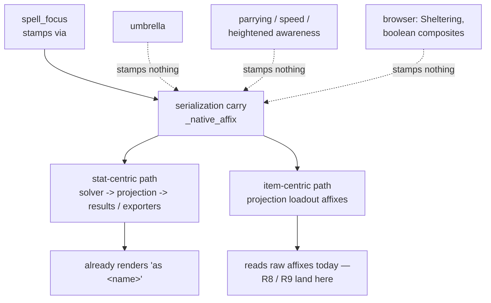

# Expanded Affix Atomicity and Provenance - Plan

## Goal Capsule

- Objective: make an expanded affix behave as one effect in the solver and read as one enchantment in the UI, render Viktranium crafting instructions in the order a player performs them in game, and close the compound-absorption blind spot the same expansion machinery already knows how to fix.
- Product authority: the maintainer, from a player report dated 2026-08-11. The Product Contract below is authoritative for behavior; the Planning Contract is authoritative for how it is built.
- Product Contract preservation: unchanged by this enrichment. R1-R16 and AE1-AE6 carry forward verbatim.
- Open blockers: none. The `Elemental Absorption` ruling is recorded in `docs/wiki-evidence/compound-absorption.md`; four of the thirteen per-item Sonic flags are read from sibling tier rows rather than their own item pages, and R7 treats those as unconfirmed until the harvest opens each page.
- Execution profile: data-pipeline plus browser changes, shipped behind the repo's existing build guards. `web/data/items.json` is generated and gitignored — edit the pipeline and the seed, never the JSON.
- Stop conditions: stop and surface rather than guessing when a wiki value is not stated outright, when the golden diff moves a fixture's top-priority stat, or when the fan-out audit finds a container the plan did not anticipate.
- Tail ownership: this plan does not own the commit, PR, or deploy. `main` deploys on push, so a red build blocks the live site.

---

## Product Contract

### Summary

A Viktranium craft will grant all seven spell schools as it does in game, rather than forcing the solver to pick one of seven. Compound absorption names will stop scoring zero against the elemental absorption a player actually ranked. And every affix the pipeline expanded will display under the enchantment engraved on the item, with that enchantment name also becoming rankable, so the results and the picker share one vocabulary.

### Problem Frame

The universal spell-DC expansion shipped in #205 turns one affix into seven school affixes. On an item that is correct — all seven co-exist, and the existing max-per-(stat, bonus type) bucketing reproduces the wiki's stacking rules with no new code.

Applied to a **choice slot**, it is not. The Viktranium pool is flat: one affix per record. Expanding it produced seven records where the game offers one option, and the per-slot `Σ ≤ 1` constraint then makes them mutually exclusive. Crafting "Woeful Spell Focus Mastery +2" grants +2 to every school at the Viktranium Experiment and +2 to exactly one school in the optimizer.

The player who reported it saw the shape without the mechanism: a Woeful slot credited for Enchantment on one item and a second Woeful slot credited for Necromancy on the off-hand. Two crafts bought what one craft gives. The loadout is not merely mis-labelled — it is mis-solved, and it under-credits by six schools per slot.

The same report carried a second, unrelated instance of the older blind spot #211 names: `Fire and Cold Absorption` on the Crown of Ioun is a different string from `Fire Absorption`, so a player ranking fire absorption scores nothing from it. Seventeen affix records are invisible this way. The reporter suspected it, tested it, and could not confirm it because ranking absorption alone surfaced the Lamordia insightful-absorb helms and masked the gap.

Underneath both sits a presentation problem the reporter articulated directly: what the model needs (fourteen separate effects) and what the player should read ("Sacred Spell Focus Mastery +3") have diverged, and the UI is showing the model's shape.

### Key Decisions

- **A choice-slot option is atomic; expansion happens inside it, never across it.** (session-settled: user-approved — chosen over expanding at solve time or grouping seven binaries with a shared option id: it keeps the seven-school family in one place instead of duplicating it in the browser, and it matches the Dino insert shape already proven in this codebase.) Viktranium pool records become multi-affix, so one record is one real craft. The distinction that matters is not which pool an affix lives in but whether its container is a single-pick — Dino inserts are believed safe because expansion runs inside a multi-affix insert, which R3 verifies rather than assumes.

- **Provenance is a display contract, not a spell-focus special case.** (session-settled: user-directed — chosen over fixing spell focus alone: the other seven expansion families inherit the behavior at no extra cost.) Any affix the pipeline expanded renders under its originating enchantment name on the item-centric surfaces. `spell_focus.PROVENANCE_KEY` is the only writer of that name today, and it is already consumed by the stat-centric path (`web/solver.js` carries it into the bucket, `web/projection.js` surfaces it, `web/results.js` and `web/exporters.js` render it as the attribution source). No item-centric surface consumes it, and the six sibling expansion families stamp nothing for one to read — so inheriting the behavior costs a stamping change per family, which R12 makes explicit.

- **The stat-centric surface keeps stat-led receipts.** Ranked Priorities answers "where did this point come from", so it continues to lead with the ranked stat and name the enchantment as its source. That is the #205 contract and it does not change. Only the item-centric surfaces collapse.

- **A displayed name must be a rankable name.** (session-settled: user-directed — chosen over a tooltip hint or leaving the mismatch: the collapse would otherwise print names that `expanded_away()` deliberately removed from the picker.) An umbrella name becomes a legitimate shorthand priority that resolves to its parts, and this applies to every expanded-away name, not only spell focus.

- **This round is correctness and presentation.** The blocklist and the Sealed-in-X harvest are each large enough to earn their own plan and already have issues holding them.

### Requirements

**Choice-slot atomicity**

- R1. A Viktranium slot crafting a universal spell-DC option grants that option's bonus type and value to all seven schools at once.
- R2. A player who ranks two schools does not have to spend two Viktranium slots to receive both from a universal option.
- R3. Every single-pick choice-slot container — the crafting pools and item-level roll groups alike — is audited for the same fan-out defect, and any container that expands an affix across its option boundary is corrected or recorded as verified-safe. A build gate then fails if an expansion pass is ever wired to a flat one-record-per-affix container, so the class stays closed without refactoring the containers that are currently unreachable.

**Compound affix coverage**

- R4. Ranking `Fire Absorption` credits the fire component of `Fire and Cold Absorption` at the compound's full magnitude, not a split; ranking `Cold Absorption` credits the cold component the same way. The same holds for `Electricity and Acid Absorption` over Electric and Acid.
- R5. The compound absorption names are registered as an expansion family in the existing umbrella style, not as a bespoke module, and are filed as an instance under #211. Expansion preserves bonus type, since both compounds take Insight, Quality, and Artifact variants even though only Enhancement carriers exist today.
- R6. `Elemental Absorption` expands per item, keyed to a wiki-sourced shard recording whether each carrier includes Sonic. The name covers Acid, Cold, Fire, and Electric on every carrier; Sonic is carried by five of the thirteen records and gear-planner stores nothing that distinguishes them.
- R7. A carrier whose Sonic flag is absent from the shard, or was inferred from a sibling tier row rather than read from its own item page, is treated as unconfirmed: its compound affix is quarantined rather than left in place, and its exclusion is disclosed in the result's coverage note. Quarantine rather than pass-through is required because registering the family removes the name from the picker globally, so a carrier left unexpanded would otherwise ship a name no player can rank.

**Provenance display**

- R8. On the item-centric surfaces — Loadout, Loadout Deep Dive, and every share export (Markdown, BBCode, CSV, print HTML, portable JSON, and the DDOBuilder `.gearset`) — a set of affixes produced by one expansion renders as a single line naming the originating enchantment. Where the members share one magnitude the line carries that value; where they do not, it lists the member values inline rather than inventing a single number the data does not have.
- R9. A crafted choice-slot option whose affixes come from one expansion renders the same way on those surfaces, naming the enchantment rather than a single member stat. This is the surface the original report came from, and it is a different render path from a worn affix.
- R10. The collapse is driven from the single content source that feeds the exports, so no export can show the expanded shape while the UI shows the collapsed one.
- R11. Ranked Priorities continues to attribute each ranked stat individually and name the originating enchantment as its source.
- R12. Every expansion family stamps the originating enchantment name on each affix it emits, using the key `spell_focus.py` already writes, so R8 and R9 have a name to group on for all of them and not for spell focus alone.

**Rankable vocabulary**

- R13. Every enchantment name the item-centric surfaces display as an expansion's origin is selectable in the priority picker and resolves to the stats it becomes. That set is the bonus-type-prefixed provenance labels, not only the bare expanded-away names.
- R14. Such a name appears in the picker's suggestion list, not merely accepted when typed exactly, so a player who reads it off the results can find it.
- R15. Selecting one inserts its component stats as consecutive priorities in the expansion's declared order, displacing lower-ranked priorities, and discloses the substitution inline. It never becomes a single combined objective term — that would be the weighted-sum mode the Non-goals list declines.

**Ordering**

- R16. Viktranium crafting slots render in their in-game order — Melancholic, Dolorous, Miserable, Woeful — wherever more than one appears.

### Acceptance Examples

- AE1. Covers R1, R2.
  - **Given:** a caster at ML 34 ranking Necromancy Focus then Enchantment Focus, with a Viktranium host in Main Hand and another in Off Hand.
  - **When:** the solve runs.
  - **Then:** each Woeful slot credits both ranked schools rather than one. The Main Hand crafts the universal Exceptional option and the off-hand crafts the universal Quality option — a different bonus type, so the two genuinely stack and a correct solver takes both. The observable change is per-craft crediting, not fewer slots consumed.

- AE2. Covers R4.
  - **Given:** a player ranking `Fire Absorption` with the Crown of Ioun in the pool.
  - **When:** the solve runs.
  - **Then:** the Crown of Ioun's `Fire and Cold Absorption` contributes to the fire absorption total and appears in the Ranked Priorities attribution under that enchantment name.

- AE3. Covers R8, R11.
  - **Given:** an item carrying `Sacred Spell Focus Mastery +3`, with Necromancy ranked.
  - **When:** the results render.
  - **Then:** the Loadout and Deep Dive show one line reading `Sacred Spell Focus Mastery +3`, and Ranked Priorities shows Necromancy Focus +3 attributed to `Sacred Spell Focus Mastery` on that item.

- AE4. Covers R13, R14, R15.
  - **Given:** a player who reads `Sacred Spell Focus Mastery` off the results and looks for it in the picker.
  - **When:** they add it as a priority.
  - **Then:** the picker suggests it, and selecting it inserts the seven schools as consecutive priorities in declared order with the substitution disclosed inline.

- AE5. Covers R9, R16.
  - **Given:** an item whose Woeful Viktranium slot crafts the universal Exceptional option, and whose Melancholic slot crafts something else.
  - **When:** the results render.
  - **Then:** the Woeful craft reads `Exceptional Spell Focus Mastery +2` rather than a single school, and the Melancholic craft is listed above the Woeful one.

- AE6. Covers R8, R10.
  - **Given:** the loadout from AE3.
  - **When:** the player takes the Markdown share export.
  - **Then:** it renders the same single collapsed line `Sacred Spell Focus Mastery +3` that the Loadout tab renders, not the seven expanded school lines.

### Scope Boundaries

Deferred for later:

- Forbid specific items, augments, or crafted options. Widening #110 into a single blocklist over anything the solver can place is the agreed shape; it is its own round.
- Harvesting the Sealed in Fire, Gloom, and Mist pools (#195). The Sealed in Fire pool natively contains `Legendary Ash` and `Legendary Vacuum`, which is why an Undying Age weapon never answered a query ranking them. This round does not change that.
- The generic umbrella-affix detector (#211). Compound absorption goes in as an instance under it.

Outside this round's identity:

- The Lamordia over-selection ruling (#245). R1 makes a Viktranium slot strictly more valuable to a caster, which pushes that issue up the queue rather than resolving it.

### Dependencies / Assumptions

- The Dino insert pool is assumed safe because its expansion runs inside a multi-affix option rather than across a flat record list. R3 verifies rather than assumes this.
- The 14 focus-stat records in the Nearly Complete pool carry no provenance key, so they are native school-specific options that were never expanded. R3 confirms.
- Correcting R1 changes the result of every school-ranked solve. The golden fixtures will move, and the diff is re-ratified deliberately rather than blanket-accepted.
- R12's stamping requirement lands in six producers that emit nothing today — the umbrella ability expansion, the parrying, speed, and heightened-awareness splits, and the browser-side Sheltering and boolean-composite expansions. The new compound-absorption family stamps at birth in U5 instead, since U7's scope is retrofit.
- A multi-affix Viktranium record combines two solver primitives that exist but have never been combined — the Dino all-or-nothing multi-affix gate inside the per-slot single-choice constraint. Both the solver's Viktranium loop and the pool prefilter read a single `stat` per option today, and the crafted-option path carries no provenance for R9 to render.

### Outstanding Questions

Deferred to planning:

- Whether the per-item Sonic flag lives in its own shard or as a field on an existing compendium shard.
- Whether R13's alias resolution belongs in the picker vocabulary or at query-expansion time. R15 settles what it does; this is where it lives.
- What happens to a min/max bound or declared credit a player attaches to an aliased name before R15 expands it into components.
- How a collapsed line reads when an expansion is only partially relevant to the ranked priorities.
- Whether the Deep Dive still needs the member stats visible after a heterogeneous family collapses, given those members are what a ranked priority actually matches.
- Whether a multi-affix Viktranium option needs the set-piece exemption the solver already grants multi-pick slots, so the Viktranium dominance prefilter stays sound.

### Sources / Research

- `src/spell_focus.py` — the expansion module, its allowlist, and `PROVENANCE_KEY`.
- `build_dataset.py:753` — where the expansion is applied to the flat Viktranium record list.
- `build_dataset.py:659` — the Dino insert path, where expansion runs inside an option's affix list.
- `web/solver.js:637` — the per-slot `Σ ≤ 1` constraint that makes the seven expanded records mutually exclusive.
- `web/crafting-systems.js:50` — the correct in-game Viktranium slot order, already declared and not yet used by the results path.
- `web/projection.js` — the single content source the exports read; where R10 lands. `craftLabel(o, "vik")` is the crafted-slot path R9 covers, distinct from the worn-affix path.
- `web/exporters.js` — the six share exports R8 must cover.
- `web/query.js` and `web/dataset.js` — the picker vocabulary gate and `migratePriorities`, whose existing substitution-with-disclosure behavior R15 mirrors.
- `src/seal.py` — `VERIFIED_SEAL_TYPES` limits seal slots to Undeath, which is why an Undying Age weapon carries no active Sealed in Fire slot.
- `docs/wiki-evidence/compound-absorption.md` — the ruling behind R4-R7, including the per-item Sonic table and the two rendered tooltips that prove one stat name covers four elements on some items and five on others.
- Issues #211 (umbrella detector), #245 (Lamordia over-selection), #195 (Sealed-in-X pools), #110 (forbid items).

---

## Planning Contract

### Key Technical Decisions

- KTD1. **A Viktranium pool record becomes one multi-affix option, mirroring the Dino insert.** (session-settled: user-approved — chosen over expanding at solve time or grouping seven binaries under a shared option id: it keeps the seven-school family in the pipeline instead of duplicating it in the browser. Instantiates the Product Contract Key Decision of the same name.) `src/dino.py` already produces `{category, dino_type, affixes: [...], name}` and `web/solver.js` already gates a whole insert on one binary with a single-affix back-compat fallback. Viktranium copies both shapes, so the per-slot single-choice constraint stays exactly as it is — it was never the defect.

- KTD2. **The fan-out has two sites and both must close.** `src/viktranium.py` fans a native multi-affix option into one record per affix *before* the spell-focus pass runs, and `build_dataset.py` then fans the universal affix seven ways. Its own docstring records the first: the native path replaced a strict parser that quarantined multi-affix options outright, and removed the gate without adding a container. Fixing only the spell-focus site leaves every other genuinely multi-affix Viktranium option still split.

- KTD3. **Run the new-source-family checklist even though the dominance prefilter looks unaffected.** `docs/solutions/design-patterns/milp-encoding-for-gear-optimization.md` records this failure class recurring three times — a new value-carrying dimension added to the variant model without updating `dominates()`, invisible to unit tests over an already-built model and caught only by an end-to-end solve. Viktranium's dominance keys count `type||category||tier` slot multisets and never read option stats, so the comparator is structurally untouched; that is a conclusion to verify with a regression test, not to assume.

- KTD4. **Provenance stamping is six producers plus two carry points, not one.** The umbrella ability expansion, the parrying / speed / heightened-awareness splits, and the two browser-side expansions stamp nothing today. Two places drop an unrecognized affix key, and the shard splits hit the earlier one: they run over the planner records *before* variant expansion, and the native-parsed converter rebuilds each affix from a fixed whitelist, so a stamp added there dies before serialization is ever reached. Spell focus escaped this only because it expands after that conversion. A stamp must therefore survive both the variant-expansion whitelist and the native-affix serialization mapper; carrying it through only the second reproduces the exact silent degradation this decision exists to prevent.

- KTD5. **The Sonic flag lives inside the shard entry's `value` object.** The shared shard merge persists only `value`, `provenance`, `raw`, and `harvested`; a field written beside them is dropped without warning. The compound-absorption shard therefore stores `value: {sonic: true|false, ...}` and joins by item name, matching the parrying and heightened-awareness shards rather than the wiki-title join the speed shard uses.

- KTD6. **One machinery: an umbrella-style module that reads the shard directly.** The compound-absorption family is its own expander — allowlist, predicate, expanded-away map — and consults the U4 shard itself for the Sonic flag and the stated-required gate, reusing the parrying counter vocabulary. It does not run through the shared shard rewriter, because that rewriter reads each component's magnitude out of the shard entry and this shard stores only a Sonic flag; magnitude comes from the affix, which is what R4's full-magnitude rule requires. An inferred-from-sibling-row flag is recorded with a non-`stated` provenance, and both unconfirmed and absent carriers are removed and counted quarantined.

- KTD7. **R15 mirrors `migratePriorities` / `migrationMessage` rather than inventing picker semantics.** The load path already substitutes an expanded-away name for its components in declared order, preserves rank position, dedupes across families, and reports what it dropped. Bounds are dropped rather than remapped — a minimum on `Parrying` is not a minimum on Armor Class — and declared credits need their own matcher because they key on stat plus bonus type. The picker path reuses that function and that message rather than a parallel implementation.

- KTD8. **R10 extends the existing single-content-source seam; it does not re-architect it.** `web/projection.js` already owns the one unescaped craft-label function that `web/results.js` wraps in a single escape and every exporter re-escapes with its own escaper. Landing the collapse there reaches all six exports without touching them individually. The Dino branch of that function already implements the `affixes || [option]` collapse the Viktranium branch needs.

- KTD9. **New picker vocabulary gets a collision check before it ships.** `docs/solutions/logic-errors/bonus-type-vocabulary-collides-with-bare-stat.md` records a past incident where adding bonus-type-prefixed tokens silently destroyed a bare stat of the same name, and the suite did not catch it — code review did. R13's provenance labels are exactly that shape.

- KTD10. **Newly-reachable paths need new fixtures, not confidence in a green suite.** `docs/solutions/conventions/close-a-defect-at-the-narrow-control-not-the-shared-rule.md` records that when a change makes a path reachable, the tests that pass are the ones that do not cover it. R1 makes Viktranium crafts newly valuable to casters and R13-R15 make provenance names newly rankable; neither has an existing fixture.

### High-Level Technical Design

The defect and the fix, as data shape:

```mermaid
flowchart TB
  subgraph now["Today — one craft becomes seven options"]
    A["Native option:<br/>Woeful / Weapon / Legendary<br/>Exceptional Spell Focus Mastery +2"] --> B["src/viktranium.py<br/>one record per affix"]
    B --> C["build_dataset.py<br/>spell-focus expansion"]
    C --> D["7 flat records<br/>one per school"]
    D --> E["solver: 7 binaries<br/>Sigma n &lt;= 1 per slot"]
    E --> F["one school credited"]
  end
  subgraph fix["After — one craft stays one option"]
    G["Native option"] --> H["src/viktranium.py<br/>keep affixes[] on the record"]
    H --> I["build_dataset.py<br/>expand inside affixes[]"]
    I --> J["1 record<br/>affixes: 7 schools"]
    J --> K["solver: 1 binary<br/>gates all 7 bucket terms"]
    K --> L["all seven credited"]
  end
```

The provenance contract, showing why the collapse is producer-side work:

### Assumptions

- The compound-absorption shard joins by item name. The thirteen `Elemental Absorption` carriers are tier variants whose names carry the level, so a name join is unambiguous. If a future carrier collides, the join key moves to wiki title as the speed shard does.
- Collapsing Viktranium records changes the crafted-record count. A browse test asserts the pseudo-variant count equals the pool length, and the persisted snapshot carries the placed-Viktranium list — both are contract surfaces, not incidental.
- Off-target affixes on a multi-affix option ride along without objective terms, matching the Dino insert behavior. This is correct: the player receives them, they just do not advance a ranked target.

### Sequencing

U1 and U2 land before U8, whose crafted-slot collapse needs a multi-affix record to collapse. U4 through U6 are the compound-absorption track and are independent of both. U10 and U11 follow U5's and U7's stamping, since the label set is incomplete without the compound-absorption family. U3 follows U1 but gates nothing else, and U9 is independent of everything — either can land whenever. U12 closes the ship and depends on all of them.

---

## Implementation Units

| U-ID | Title | Key files | Depends on |
|---|---|---|---|
| U1 | Viktranium pool records become multi-affix | `src/viktranium.py`, `build_dataset.py` | — |
| U2 | Browser reads a multi-affix Viktranium option | `web/model.js`, `web/solver.js`, `web/dataset.js`, `web/browse.js` | U1 |
| U3 | Fan-out audit and build gate | `src/container_registry.py`, `build_dataset.py` | U1 |
| U4 | Per-item Sonic shard | `data/seed/compendium/`, `src/` | — |
| U5 | Compound-absorption expansion family | `src/`, `build_dataset.py` | U4 |
| U6 | Quarantine and coverage disclosure | `src/`, `web/projection.js`, `web/exporters.js` | U5 |
| U7 | Stamp provenance in every expansion family | `src/umbrella.py`, `src/enchantment_split.py`, `src/parrying_split.py`, `src/speed_split.py`, `src/heightened_awareness.py`, `src/variants.py`, `web/dataset.js`, `build_dataset.py` | — |
| U8 | Collapse expanded affixes on item-centric surfaces | `web/projection.js`, `web/results.js` | U1, U2, U7 |
| U9 | Viktranium slot ordering | `web/projection.js` | — |
| U10 | Provenance labels enter the picker vocabulary | `build_dataset.py`, `web/dataset.js`, `web/wizard.js` | U5, U7 |
| U11 | Picker substitution with disclosure | `web/wizard.js`, `web/dataset.js` | U10 |
| U12 | Golden re-ratification and build stamp | `tests/parity/`, `web/index.html`, `web/app.js`, `README.md` | U1-U11 |

### U1. Viktranium pool records become multi-affix

- **Goal:** one native Viktranium option produces one record carrying an `affixes` list, and the spell-focus expansion runs inside that list rather than across records.
- **Requirements:** R1, R2. Implements KTD1 and KTD2.
- **Dependencies:** none.
- **Files:** `src/viktranium.py`, `build_dataset.py`, `tests/test_viktranium.py`, `tests/test_spell_focus.py`.
- **Approach:** Replace the per-affix inner loop in the native record builder with a single record carrying the mapped affix list, keeping `slot_type`, `category`, `name`, `tier`, and `wiki_url` on the record. Mirror `src/dino.py`'s native insert builder. Then change the Viktranium line in `build_dataset.py` so the spell-focus expansion is applied to each record's `affixes` list, as the Dino insert path already does, rather than to the record list.
- **Patterns to follow:** `src/dino.py`'s `_native_insert_records`; the Dino insert expansion call in `build_dataset.py`.
- **Execution note:** Start by asserting the current count of Viktranium focus records so the collapse is measurable — ten genuine options currently emit seventy records.
- **Test scenarios:**
  - A native option with one affix produces one record whose `affixes` list has one entry.
  - A native option with several affixes produces one record, not one per affix.
  - Covers R1. A universal spell-DC option produces one record whose `affixes` list holds all seven schools at the option's bonus type and value.
  - The record retains `slot_type`, `category`, `tier`, and `name`.
  - The whole-dataset walk still finds no surviving universal stat name anywhere.
  - Legacy seed parsing and the base-seed Lamordia marker parser are unaffected.
- **Verification:** the built dataset holds ten Viktranium focus records rather than seventy, each carrying seven school affixes.

### U2. Browser reads a multi-affix Viktranium option

- **Goal:** the model prefilter, the solver gate, the picker vocabulary, and the browse view all handle a Viktranium option that carries several affixes.
- **Requirements:** R1, R2.
- **Dependencies:** U1.
- **Files:** `web/model.js`, `web/solver.js`, `web/dataset.js`, `web/browse.js`, `tests/model.test.js`, `tests/solver.test.js`, `tests/browse.test.js`, `tests/dataset.test.js`.
- **Approach:** Give the Viktranium prefilter the same shape as the Dino predicate — an option advances the query when any of its affixes matches a ranked target with positive value. In the solver's Viktranium loop, resolve the option's affix list with the same single-affix back-compat fallback the Dino loop uses, create one binary per option, and push a bucket term per on-target affix gated on that one binary. The per-slot single-choice constraint is unchanged. Extend the crafting-vocabulary collector's Viktranium branch to iterate affixes the way its Dino branch already does, and update the browse pseudo-variant row to render an option's full affix list.
- **Patterns to follow:** the Dino insert branches in each of these four files — every one already implements the multi-affix shape beside the Viktranium single-affix shape.
- **Execution note:** the back-compat fallback matters: a stale cached dataset can still deliver flat records, and the Dino loop's fallback is the reference.
- **Test scenarios:**
  - Covers R1, R2 / AE1. A caster ranking two schools with two Viktranium hosts receives both schools from each host's craft.
  - One binary gates every on-target affix of an option — selecting the option credits all of them.
  - Off-target affixes on a selected option produce no objective term.
  - The per-slot single-choice constraint still admits at most one option per slot, and an item with two slots still gets two independent choices.
  - The prefilter admits an option whose match is on a non-first affix.
  - A flat legacy record still solves through the back-compat fallback.
  - The browse view lists one row per option with its full affix list, and the row count matches the pool length.
  - The picker vocabulary includes stats reachable only through a multi-affix Viktranium option.
- **Verification:** the AE1 solve credits both ranked schools from each craft; the browse count assertion passes against the new pool length.

### U3. Fan-out audit and build gate

- **Goal:** every single-pick choice-slot container is recorded as corrected or verified-safe, and a build gate prevents an expansion pass from being wired to a flat container again.
- **Requirements:** R3. Implements the user's chosen scope: fix Viktranium, record the rest, gate the class.
- **Dependencies:** U1.
- **Files:** `src/container_registry.py` (new), `build_dataset.py`, `tests/`.
- **Approach:** Add a declarative registry module under `src/` in which every single-pick container declares whether its records are flat and which expansion passes run over it. `build_dataset.py` asserts the cross-product — a flat container with an expansion pass fails the build — refuses an empty registry, and pins the registered container count so a new container added without a declaration fails rather than passing unnoticed. The registry replaces prose as the audit's output: the four unreached pools are flat but declare no expander, so they are recorded verified-safe and the gate holds them there.
- **Patterns to follow:** the existing set-bonus orphan guard, whose known-orphan allowlist is empty by design; the anti-vacuity rules in the parrying snapshot guard, which reports what it compared and raises when it compared nothing.
- **Execution note:** prove the gate fails before trusting it. Wire an expander to one flat pool, confirm the build goes red, then restore. Make it refuse to inspect zero containers.
- **Test scenarios:**
  - The gate raises when an expansion pass is applied to a flat container.
  - The gate raises when it inspects zero containers.
  - The gate raises when a container exists that the registry does not declare.
  - The gate passes on the shipped configuration.
  - The audit record names every single-pick container and its verdict.
- **Verification:** the gate is observed failing on a deliberately corrupted configuration and passing on the real one.

### U4. Per-item Sonic shard

- **Goal:** a wiki-sourced shard records, per `Elemental Absorption` carrier, whether the enchantment includes Sonic, with the four sibling-row inferences marked unconfirmed.
- **Requirements:** R6, R7. Implements KTD5.
- **Dependencies:** none.
- **Files:** `data/seed/compendium/` (new shard), `src/`, `build_dataset.py`, `tests/`.
- **Approach:** Create a shard in the established shape — a meta block, a snapshots block holding the verbatim rendered tooltip per distinct template invocation, and a harvested block keyed by item name. Store the Sonic flag inside each entry's `value` object. Harvest each of the thirteen carriers from its own item page; the nine already opened are recorded `stated`, and the four read from sibling tier rows are recorded with a non-`stated` provenance until their own pages are opened. Add a snapshot guard comparing each derived flag against the rendered tooltip text.
- **Patterns to follow:** the parrying and heightened-awareness shards and their guards; the harvest loop and pacing rules in `docs/wiki-evidence/harvest-method.md`.
- **Execution note:** ddowiki throttles persistently after rapid bursts. Pace requests and harvest same-origin from a ddowiki tab; server-side fetches return empty.
- **Test scenarios:**
  - The guard raises when a derived Sonic flag disagrees with its snapshot tooltip.
  - The guard raises when it compares zero entries.
  - The guard raises when the shard is empty.
  - A negative test moves an entry's flag and its cited source together and is still caught — a sibling-row inference mis-attributed to the wrong tier must not pass.
  - A carrier absent from the shard is counted uncovered rather than defaulted.
- **Verification:** the guard is observed failing on each corruption shape above, including the value-and-source-together case, then passing on the real shard.

### U5. Compound-absorption expansion family

- **Goal:** the three compound absorption names expand into their component elements at full magnitude, preserving bonus type.
- **Requirements:** R4, R5, R6, R12. Implements KTD6's architectural half — the family reads the shard directly rather than running through the shared rewriter.
- **Dependencies:** U4.
- **Files:** `src/`, `build_dataset.py`, `tests/`.
- **Approach:** Register the family the way the existing families register: an allowlist of folded names, a predicate, an expanded-away map, and passes over both the item and set-bonus channels. `Fire and Cold Absorption` and `Electricity and Acid Absorption` expand unconditionally to two components each at the compound's full value. `Elemental Absorption` expands per item, reading the Sonic flag from the U4 shard to decide four components or five. Add the family to both unions that build the expanded-away name set, and to the browser-side fallback used when a cached dataset is stale. Stamp each emitted affix with the originating compound name using the same provenance key the spell-focus module writes — this family is born here rather than retrofitted, so U7's scope (producers that emit nothing today) does not reach it. File the family as an instance under the umbrella-detector issue.
- **Patterns to follow:** the umbrella and spell-focus modules for registration shape; the wiki ruling in `docs/wiki-evidence/compound-absorption.md` for what each name covers.
- **Test scenarios:**
  - Covers R4 / AE2. Ranking fire absorption credits the fire component of the compound at the compound's full value, not half.
  - Ranking cold absorption credits the cold component of the same record independently.
  - Expansion preserves bonus type — an Insight-typed compound expands to Insight-typed components.
  - A Sonic-included carrier expands to five components; a Sonic-excluded carrier expands to four.
  - The set-bonus orphan guard still passes, since no set-bonus tier names a compound absorption stat.
  - Covers R12 / AE2. An expanded compound affix carries the originating compound name, so the attribution reads "as Fire and Cold Absorption".
  - The whole-dataset walk finds no surviving compound name after expansion.
- **Verification:** the seventeen previously invisible records are credited to a matching elemental priority, minus any quarantined by U6.

### U6. Quarantine and coverage disclosure

- **Goal:** an unconfirmed carrier is quarantined rather than left carrying an unrankable name, and its exclusion is disclosed in the result.
- **Requirements:** R7. Implements KTD6.
- **Dependencies:** U5.
- **Files:** `src/`, `build_dataset.py`, `web/solver.js`, `web/persist.js`, `web/projection.js`, `web/results.js`, `web/exporters.js`, `tests/`.
- **Approach:** Require `stated` provenance, so an affix whose shard entry is unconfirmed is removed and counted quarantined — the parrying path. Absence needs its own removal: the shared rewriter treats a missing shard entry as merely uncovered and leaves the affix in place, which is precisely the state R7 forbids, so this family removes and counts an absent carrier too rather than falling through that branch. Quarantine is decided in Python against the seed shard, and neither the solver nor the model receives dataset metadata — so the build stamps a per-variant quarantine marker on each excluded carrier, the way material is already stamped, and emits a coverage block into metadata for the dataset-level note. The solver reads the marker off the worn variants to build its report, leaving the model-building signature unchanged. From there the exclusion follows the per-result disclosure chain: a plain report on the result, the persistence allowlist carrying it so a restored character discloses without re-solving, projection turning it into sentences, and each renderer printing them.
- **Patterns to follow:** the saturation and empty-slot disclosure chain, which is the four-link reference implementation; the shared rewriter's stated-required mode.
- **Execution note:** carrying the note through the content model is necessary but not sufficient — the four text exports each print it separately, the portable JSON inherits it through its resolved block, and the `.gearset` carries no prose notices.
- **Test scenarios:**
  - A carrier with unconfirmed provenance has its compound affix removed and the quarantine counted.
  - A carrier absent from the shard has its compound affix removed, counted quarantined, and named in the disclosure — not left in place as merely uncovered.
  - The disclosure names what was excluded and why, stating no inference about what the build would have scored.
  - The note appears in the app and in each export that carries prose notices.
  - A restored saved character discloses without re-solving.
- **Verification:** a solve ranking fire absorption with an unconfirmed carrier in the pool excludes it and says so.

### U7. Stamp provenance in every expansion family

- **Goal:** every expansion produces affixes carrying the originating enchantment name, and that name survives serialization.
- **Requirements:** R12. Implements KTD4.
- **Dependencies:** none.
- **Files:** `src/umbrella.py`, `src/enchantment_split.py`, `src/heightened_awareness.py`, `src/parrying_split.py`, `src/speed_split.py`, `src/variants.py`, `web/dataset.js`, `build_dataset.py`, `tests/`.
- **Approach:** Give each producer the same provenance key the spell-focus module already writes, carrying the enchantment name as the wiki writes it — bonus-type-prefixed where the family has typed variants, bare otherwise. Extend the shared split rewriter so its emitted affixes carry the folded name. Add the same stamp to the two browser-side expansions. Then extend both carry points so the key survives into the built dataset: the native-parsed converter's affix whitelist in `src/variants.py`, which the shard splits hit first because they run before variant expansion, and the native-affix serialization mapper. Mirror the existing eligibility-flag carry-through at each. Carrying only the second silently drops every shard-split stamp.
- **Patterns to follow:** the spell-focus module's expansion function and its source-label helper; the existing serialization carry for the same key.
- **Test scenarios:**
  - Each family's expanded affixes carry the originating name.
  - The name matches what the wiki engraves, including the typed prefix where one applies.
  - The key survives variant expansion for a shard-split family, not only serialization — assert it after the expansion step, since that is the earlier drop point.
  - The key survives into the built dataset for every family, not only spell focus.
  - The two browser-side expansions stamp the key, exercised by the JS suite.
  - A native school-specific affix carries no provenance key, so a consumer can still tell expanded from native.
  - The overhaul-invariants test, which allows exactly one such key, is updated deliberately rather than incidentally.
- **Verification:** the built dataset carries a provenance name on expanded affixes from every expansion family — the six retrofitted here, the spell-focus family that already stamped, and the compound-absorption family that stamps at birth in U5.

### U8. Collapse expanded affixes on item-centric surfaces

- **Goal:** a set of affixes produced by one expansion renders as one line naming the enchantment, on the item surfaces and every export, including the crafted-slot path.
- **Requirements:** R8, R9, R10, R11. Implements KTD8.
- **Dependencies:** U1, U2, U7.
- **Files:** `web/projection.js`, `web/results.js`, `tests/projection.test.js`, `tests/results.test.js`, `tests/exporters.test.js`, `tests/spell-focus-receipts.test.js`.
- **Approach:** Group an item's affixes by provenance name when building the loadout content model, emitting one entry per group. A uniform-magnitude family renders the enchantment and its value; a heterogeneous one lists its members inline, because parrying, speed, and the boolean composites each grant different magnitudes to different members. Suppress the bonus-type suffix on a collapsed entry — the label helper appends it, which would render a typed enchantment name twice. Export the grouping from projection as a pure primitive alongside the existing label helper, and have both the content model and the app's equipped-item body and Deep Dive call it on a variant's affix array. The app renders a live solve result and has no saved record, so it cannot call the record-shaped projection entry point — binding a primitive is the shape it already uses for every other shared piece. Today both surfaces render `v.affixes` directly and never touch the content model, so grouping in projection alone would fix every export and leave the two surfaces R8 names first still printing seven lines. Extend the craft-label function's Viktranium branch to resolve an option's affix list the way its Dino branch does, and to collapse a group sharing one provenance name to the enchantment rather than joining member stats. Leave the stat-centric attribution untouched — it already names the enchantment as the source of a ranked stat, which is R11.
- **Patterns to follow:** the Dino branch of the craft-label function; the single-unescaped-label rule that lets one change reach all six exports.
- **Test scenarios:**
  - Covers R8 / AE3. An item carrying a typed universal spell-focus affix shows one line naming the enchantment, not seven school lines.
  - Covers R11 / AE3. Ranked Priorities still attributes the ranked school individually and names the enchantment as its source.
  - Covers R9 / AE5. A Viktranium craft of a universal option reads as the enchantment, not a single school.
  - Covers R8 / AE6. The Markdown export renders the same collapsed line the app renders.
  - Markdown, BBCode, CSV, print HTML, and the portable JSON's resolved block each render the collapsed line. The `.gearset` export carries no worn-affix channel, so it is asserted through its crafting line instead.
  - Covers R8. A heterogeneous family collapses to one line listing its member values, not to a single invented magnitude.
  - A collapsed typed enchantment renders its name once, without a duplicated bonus-type suffix.
  - A partially-relevant expansion still collapses to one line.
  - An item carrying a native school-specific affix is unaffected.
- **Verification:** the reported symptom is gone — a Woeful craft names the enchantment on every item-centric surface.

### U9. Viktranium slot ordering

- **Goal:** Viktranium crafts render in the in-game order wherever more than one appears.
- **Requirements:** R16.
- **Dependencies:** none.
- **Files:** `web/projection.js`, `tests/projection.test.js`, `tests/crafting-systems.test.js`.
- **Approach:** Sort grouped Viktranium placements by the slot-type order the crafting registry already declares, rather than leaving them in solver-emission order.
- **Patterns to follow:** the crafting registry entry that already declares the order.
- **Test scenarios:**
  - Covers R16 / AE5. An item with a Melancholic and a Woeful craft lists Melancholic first.
  - The order matches the registry's declared order for all four slot types.
  - The ordering holds in the exports as well as the app.
- **Verification:** results list Melancholic, Dolorous, Miserable, Woeful in that order.

### U10. Provenance labels enter the picker vocabulary

- **Goal:** the enchantment names the item surfaces display are offered in the picker and accepted when added.
- **Requirements:** R13, R14. Implements KTD9.
- **Dependencies:** U5, U7.
- **Files:** `build_dataset.py`, `web/dataset.js`, `web/wizard.js`, `tests/dataset.test.js`.
- **Approach:** Emit the set of provenance labels into dataset metadata alongside the existing expanded-away names, mapping each label to the stats it becomes. Add those labels to the picker's suggestion set instead of removing them, and make the add-a-priority gate accept them. A bare expanded-away name that is *also* a shipped provenance label stays suggested and routes through U11's substitution — for an untyped or Enhancement-carrier family such as parrying, speed, the ability umbrella, and the compound absorptions, the provenance label and the bare name are the same string, so suppressing it would hide exactly what U8 prints. Removal-and-redirect survives only for expanded-away names no item surface displays as an origin.
- **Patterns to follow:** the existing expanded-away lookup with its own-property guard; the suggestion-building path.
- **Execution note:** before shipping, grep the existing rankable vocabulary for exact and near collisions with each new label. A past incident destroyed a bare stat this way and the suite did not catch it.
- **Test scenarios:**
  - Covers R13, R14 / AE4. A typed provenance label is suggested by the picker and accepted when added.
  - The label maps to the stats it becomes, in the family's declared order.
  - No new label collides with an existing bare stat name or bonus-type token.
  - A bare name that is also a shipped provenance label is suggested and substitutes rather than being refused.
  - An expanded-away name no surface displays as an origin remains absent from suggestions and still returns the redirect message.
  - The browser fallback used with a stale cached dataset carries the new labels.
- **Verification:** typing an enchantment name read off the results finds it in the picker.

### U11. Picker substitution with disclosure

- **Goal:** selecting an aliased name inserts its components as consecutive priorities in declared order and says so.
- **Requirements:** R15. Implements KTD7.
- **Dependencies:** U10.
- **Files:** `web/wizard.js`, `web/dataset.js`, `tests/dataset.test.js`.
- **Approach:** Route a picker add of an aliased name through the same substitution function the load path uses, so rank position is preserved, components arrive in declared order, and duplicates are dropped. Surface the same disclosure message. Drop any bound the player attached to the aliased name rather than remapping it, and clear a declared credit keyed to it, matching the load path.
- **Patterns to follow:** the load-path substitution and its message builder; the wizard's existing call site, which already handles dropped bounds and credits.
- **Test scenarios:**
  - Covers R15 / AE4. Adding an aliased name inserts its components as consecutive priorities in declared order.
  - A priority ranked below the alias is displaced, not dropped.
  - The substitution is disclosed inline.
  - A bound attached to the alias is dropped and reported, not remapped onto a component.
  - A declared credit keyed to the alias is cleared and reported.
  - Adding an alias whose components are already ranked does not duplicate them.
  - No single combined objective term is created — the components occupy separate lexicographic tiers.
- **Verification:** ranking an enchantment name produces the same solve as ranking its components in order.

### U12. Golden re-ratification and build stamp

- **Goal:** the golden fixtures reflect the corrected solve, deliberately ratified, and the shipped build is stamped consistently.
- **Requirements:** R1, R2, R13, R14, R15 through its own fixtures; the golden regeneration re-verifies every other requirement's existing per-unit coverage rather than implementing it anew. Implements KTD3 and KTD10.
- **Dependencies:** U1 through U11.
- **Files:** `tests/parity/fixtures.json`, `tests/parity/golden.json`, `tests/solver_golden.test.js`, `web/index.html`, `web/app.js`, `README.md`.
- **Approach:** Add fixtures that exercise the newly-reachable paths — a caster query whose Viktranium hosts carry a universal option, and a query ranking a provenance label and an elemental absorption. Add a dominance regression asserting that an affix-bearing rival does not dominate a Viktranium host on the new multi-affix shape. Then re-run the golden guard, inspect the diff fixture by fixture, and regenerate only after confirming no fixture's top-priority stat regressed — only lower-priority or tied stats may move. Bump the cache-bust, the footer build, and the README build line together.
- **Patterns to follow:** the golden regeneration script; the guard's practice of asserting fixture inputs as well as outputs.
- **Execution note:** run the JS suite one file per invocation. Running several files in one command executes only the first and has silently skipped the golden check before. Prove each new test fails against the pre-change tree, copying the generated dataset into the scratch export first so a crash is not mistaken for a pass.
- **Test scenarios:**
  - The new caster fixture credits all seven schools from one Viktranium craft.
  - The new vocabulary fixture solves identically whether the player ranks the alias or its components.
  - A rival variant does not dominate a Viktranium host carrying a multi-affix option.
  - The guard's fixture count assertions are updated in all three places it pins them.
  - The build-stamp test passes with the three markers agreeing.
- **Verification:** the golden diff is contained to expected fixtures with no top-priority regression, and the full suite is green file by file.

---

## Verification Contract

| Gate | Command | Applies to |
|---|---|---|
| Dataset builds | `python3 build_dataset.py` | U1, U3, U4, U5, U6, U7, U10 |
| Python suite | `python3 tests/run_tests.py` | U1, U3, U4, U5, U6, U7 |
| JS suite, one file per invocation | `for t in tests/*.test.js; do node "$t"; done` | U2, U6, U7, U8, U9, U10, U11 |
| Golden solve guard, run explicitly | `node tests/solver_golden.test.js` | U12 |
| Golden regeneration, after inspection only | `node tests/parity/capture_golden.js` | U12 |
| Build stamp agreement | covered by the Python suite | U12 |
| Visual pass | `python3 -m http.server 8000`, then the wizard at `/web/` | U8, U9, U11 |

Guard discipline, from the repo's standing rules: prove a new guard fails before trusting it, prove a new test fails against the pre-change tree, and never blanket-accept a golden diff.

---

## Definition of Done

Global:

- Every requirement R1-R16 is implemented or explicitly deferred with a filed issue.
- Every acceptance example AE1-AE6 has a passing test.
- The three build markers agree: the cache-bust, the footer build, and the README build line.
- The golden diff is re-ratified deliberately, with the inspection recorded in the PR body.
- Each new guard has been observed failing on a deliberate corruption and passing on the real input.
- No dead-end or experimental code from abandoned approaches remains in the diff.
- Issues are closed with a closing keyword in the PR body, not a bare reference, each mapped to the work that closes it: #248 (Viktranium fan-out) by U1-U3, #249 (compound absorption) by U4-U6, #250 (provenance display and rankable names) by U7, U8, U10, U11, and #251 (slot ordering) by U9.

Per unit: the unit's own Verification line holds, and its test scenarios are covered by tests that were proven to fail against the pre-change tree.
