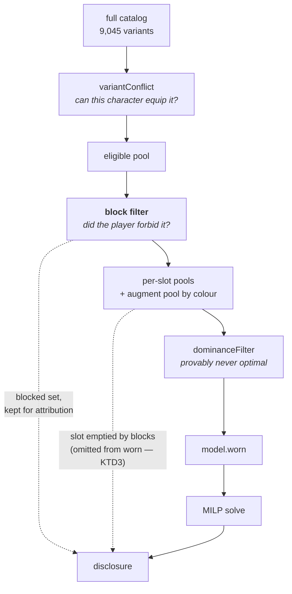

# Blocklist - Plan

## Goal Capsule

- Objective: let a player forbid specific gear so the solver never recommends it, and say so when a block changed the answer.
- Product authority: the maintainer, from a player report and scope decisions taken 2026-08-11. The Product Contract is authoritative for behavior; the Planning Contract for how it is built.
- Product Contract preservation: changed — **R2** and **R9**. **R9**'s "names what the blocks cost" was ambiguous between an attribution and a counterfactual; the counterfactual reading needs a second block-free solve, which this project has already rejected once with a test pinning that the credit-free solve is not computed. R9 now states the attribution reading the author confirmed. **R2** changed during the deepening pass: it assumed a search could match the target family, and measurement against the built dataset showed none does (KTD5) — so "block all matches of a search" became "block all variants the player selected", which preserves the one-action intent the session-settled decision required. R1, R3-R8, and R10 are unchanged.
- Open blockers: none.
- Execution profile: browser-only. No pipeline or dataset change; `web/data/items.json` is untouched.
- Stop conditions: stop and surface rather than guessing if the exclusion cannot be expressed without widening `variantConflict`'s meaning, or if a blocked slot cannot be distinguished from an ordinarily-empty one.
- Tail ownership: this plan does not own the commit, PR, or deploy. `main` deploys on push.

---

## Product Contract

### Summary

A per-character list of things the solver must never place. Entries are exact and added by search; a player ticks the variants they want gone across one or more searches and one action blocks the whole selection, expanding into individual entries they can see and prune. The list saves and travels with the character, and a solve a block changed reports itself as optimal given the exclusions rather than plain optimal.

### Problem Frame

A player kept being handed gear they did not want. The report named the case precisely: "I would like to forbid the many pointless +4 [school] DC solar and lunar augments." Those are **28** real variants — `Lunar Gem of Abjuration (Heroic)` through `Solar Gem of Transmutation (Legendary)`: seven schools x two gem types x two tiers — and each one is a legitimate contribution the solver is right to consider and the player has already decided against.

The dataset holds **33** solar/lunar gems granting a school-DC affix, not 28. The other five are `Lunar Gem of Spell Difficulty` (Heroic/Epic/Legendary) and `Solar Gem of Spell DCs` (Heroic/Legendary), each granting **all seven** schools at once. Those are not what the report called pointless — a gem giving every school is the opposite of the single-school gems the player is rejecting — so the motivating family is the 28, and the five universal gems are a separate thing a player may well want to keep. Any test asserting an exact count must say which of the two sets it means.

The optimizer answers the question it is asked, exhaustively. What it cannot currently accept is the player's own judgment that a specific thing is not worth a slot. Pinning forces something in; there is no way to force something out, so the same rejected augment reappears on every re-solve and the player either re-reads past it or stops trusting the result.

The absence also blocks the natural response to two other reports. A player who does not own an expansion has no way to say so, and a player who finds one item dominating every solve has no way to take it off the table while the underlying question is worked out.

### Key Decisions

- **One blocklist over anything the solver can place.** (session-settled: user-directed — chosen over separate item and augment lists: a player thinks "never give me this", not "which of my two lists does this belong in".) Items and augments share one mechanism. Augments are already variants in the same collection, so this costs no special case for them.

- **A block is an exact entry; a family is blocked in one action.** (session-settled: user-directed — chosen over exact-entries-only and over saved rules: exact-only makes the motivating case cost 28 separate searches, which is enough friction that nobody would do it; rules can silently exclude something the player wanted and make "why did this disappear" hard to answer.) Blocking a family expands into individual entries rather than storing a pattern, so the list always states exactly what it excludes.

- **The blocklist is character state.** (session-settled: user-directed — chosen over a global per-browser list and over a global-seeds-character hybrid: a shared build must carry the constraints that shaped it, or a reader re-solving gets a different answer with no explanation.) It saves, restores, and travels in a shared character alongside priorities, pins, and declared credits.

- **This is a precision tool, not an ownership filter.** (session-settled: user-directed — chosen over serving both: "I do not own Lamordia" is ~350 variants and a different question shape, and conflating them would put hundreds of entries in every saved character and share export.) Content-pack and ownership filtering stays with its own issue.

- **A block that changed the answer is disclosed.** The product's claim is provable optimality; a blocked solve is optimal *given the exclusions*, which is a different and weaker claim. Saying so follows the existing per-result disclosure convention rather than introducing a new one.

### Requirements

**Blocking**

- R1. A player can block a specific item or augment so the solver never places it, chosen by search from the full roster.
- R2. The player can select multiple variants — accumulated across one or more searches — and block them all in one action, and the result is individual entries they can review and remove.
- R3. A blocked entry can be removed, restoring the variant to candidacy.
- R4. Blocking and pinning the same variant is prevented when the second one is added, with a message naming the conflict.

**Persistence and sharing**

- R5. The blocklist saves and restores with the character, alongside priorities, pins, and declared credits.
- R6. A shared or exported build carries its blocklist, so a reader re-solving reaches the same answer.
- R7. An entry that no longer matches anything after a dataset rebuild is reported to the player rather than silently dropped or silently kept.

**Disclosure**

- R8. A result whose solve was changed by a block reports itself as optimal given the exclusions, not as plain optimal.
- R9. The result names which blocks applied and, where a block removed the best available candidate for a slot, says so. This is an attribution computed from the eligible-but-blocked set — never a claim about what a block-free solve would have produced, which would require a second solve this project deliberately does not run.
- R10. A block that makes a slot unfillable, or the whole query infeasible, is surfaced as that rather than as an ordinary empty slot.

### Acceptance Examples

- AE1. Covers R1, R8.
  - **Given:** a caster whose solve places `Lunar Gem of Enchantment (Legendary)`.
  - **When:** the player blocks it and re-solves.
  - **Then:** the augment is absent from the loadout, and the result states the solve was optimal given the exclusions.

- AE2. Covers R2.
  - **Given:** a player who has searched the blocklist picker and ticked the +4 school-DC gems across several searches.
  - **When:** they take the block-selected action.
  - **Then:** the list holds one entry per selected variant, each individually removable, and none is stored as a pattern.

- AE3. Covers R4.
  - **Given:** a player who has pinned an item to a slot.
  - **When:** they try to block that same item.
  - **Then:** the block is refused with a message naming the pin, and neither the pin nor the list changes.

- AE4. Covers R6.
  - **Given:** a shared build whose owner blocked several augments.
  - **When:** a reader imports it and re-solves.
  - **Then:** they reach the same loadout, and the blocks are visible to them.

- AE5. Covers R7.
  - **Given:** a saved character blocking a variant that a later dataset rebuild renamed or removed.
  - **When:** the character is loaded.
  - **Then:** the stale entry is reported by name, and the player is told it no longer matches anything.

- AE6. Covers R10.
  - **Given:** a query where blocks remove every candidate for a slot.
  - **When:** the solve runs.
  - **Then:** the slot is reported as emptied by the player's own exclusions, distinguishable from a slot with nothing worth wearing.

### Scope Boundaries

Deferred for later:

- Content-pack and ownership filtering — "exclude gear I cannot access" is a different question with a different answer shape, tracked separately. It should feed the same solver gate this work creates rather than adding a second one.
- Rarity or attainability filtering. Blocking is a deliberate per-variant judgment; "too hard to farm" is a property of the item, and treating attainability as a solver input by default is a standing non-goal.

Outside this feature's identity:

- Rule-based blocks that match future gear automatically. A rule silently excludes things the player never saw, which is the opposite of what a blocklist is for.
- A global cross-character list. It would let a shared build omit a constraint that shaped it.

### Dependencies / Assumptions

- Augments are variants in the same collection as items, so one identity handle covers both. Verified against the current dataset: 1,000 augment variants, including the 223 solar and lunar gems the report names.
- Crafted options — a Viktranium, seal, Dino, or Nearly Complete option — carry a name and pool key but no variant id, so covering them needs a second identity handle. See Outstanding Questions.
- The exclusion is expected to sit early enough to remove a variant from candidacy rather than to penalise it in the objective, so a blocked variant cannot be chosen at any price.
- Reporting a stale entry mirrors the existing saved-character migration, which already reports substituted priorities and dropped bounds rather than failing quietly.

### Outstanding Questions

Resolved during planning:

- **Crafted options do not ship in round one.** Items and augments share one identity handle and one gate, and they cover both motivating cases. Crafted options need a composite key — and `nearly_complete` and `seal` records carry no usable name today — so they become a follow-up with the identity question stated. Filed as [#270](https://github.com/eddiefiggie/ddo-loadout-optimizer/issues/270).
- **A family is derived from what the player selected, not from structure or from the search query.** `variant_id` equals `source_item` on all 9,045 records and `tier_label` is unused, so no structural family axis exists — and no single query returns the motivating 28 either (KTD5). The block action operates on the ticked selection, which accumulates across searches.
- **The blocklist lives in the gear-pool step**, beside the existing pin box, because it is a pre-solve pool question rather than a per-slot adjustment.

Deferred to implementation:

- Whether the blocked-slot reason rides on the existing empty-slot report or a sibling report, once the `worn`-omission fix in **U8** lands.
- How the 30-row cap is disclosed. The cap itself is settled — the block picker inherits the pin picker's 30, and U4's accumulated selection is what makes it survivable, since the player narrows and ticks rather than needing all matches visible at once.
- Whether the block picker inherits the pin picker's `verification: "verified"` restriction. Nearly inert either way — all 1,000 augments and all 223 solar/lunar gems are verified, and 1 record of 9,045 is quarantined — but the picker should state which it does rather than leaving it to a reader of the call site.

### Sources / Research

- Issue #110 — the original request, and the widening from items-only to anything placeable.
- Issue #246 — content-pack ownership filtering, which owns the "I do not own this" case this feature deliberately declines.
- Issue #245 — Lamordia over-selection. Note this feature is **not** its workaround: that reading assumed the blocklist would serve ownership-scale exclusions, which the scope decision removed.
- `web/model.js` — `pinnedVariantIds` and the per-slot `slotConstraints` shape, the closest existing constraint machinery. Pins are per-slot; a blocklist is global to the query, so it is not the mirror image of pinning.
- `web/persist.js` and `web/backup.js` — the saved-character field allowlist a new piece of character state has to join.
- `web/dataset.js` — `migratePriorities` and `migrationMessage`, the established pattern for reporting saved state that no longer resolves.
- The saturation and empty-slot disclosure chain — the reference implementation for carrying a per-result fact through to the app and every export.

---

## Planning Contract

### Key Technical Decisions

- KTD1. **The exclusion filters the candidate pool; it does not go in `variantConflict`.** The two research passes disagreed here, and the repo settles it: `web/model.js` already carries the comment *"Candidacy is a pool question, not an equippability question"* beside the two-weapon-fighting off-hand exclusion, which lives in pool assembly for exactly this reason. `variantConflict` means *this character can never equip this*, and `reconcilePinLegality` deletes any pin whose `variantConflict` is non-null — so a block placed there would let a corrupted import silently destroy a pin. `eligible()` runs once over the whole catalog before every pool and before `dominanceFilter`, so filtering there removes a variant from candidacy everywhere at once.

- KTD2. **No dominance-comparator change is needed, and that is a verified conclusion rather than an assumption.** `docs/solutions/design-patterns/milp-encoding-for-gear-optimization.md` records a failure class that has recurred three times: a new value-carrying dimension added without updating `dominates()`. A block is value-*removing* and sits strictly upstream of dominance, which re-runs fresh each solve — so a blocked winner simply leaves the runner-up as the pool's new best. The checklist is discharged by placement, not by editing the comparator.

- KTD3. **A blocked variant's slot can vanish, and that is the hard part of R10.** A worn slot whose candidate list empties is omitted from `model.worn` entirely, and the empty-slot report iterates `model.worn` — so a fully-blocked slot is currently reported as neither filled nor empty. R10 cannot be satisfied by reading the existing report; the omission has to be captured where it happens.

- KTD4. **The pin picker cannot be reused; the browse search can.** `isPinnable` excludes augments outright, and an augment's slot is its colour rather than a worn slot, so the pin picker fails on both halves for the motivating case. `web/browse.js`'s variant filter is the only existing search that reaches augments, and it already matches names, ids, affix stats, and set names.

- KTD5. **A family is what the player selected, not what the search matched.** `variant_id` equals `source_item` on all 9,045 records and `tier_label` is unused, so no structural family axis exists — the Heroic/Legendary distinction lives inside the name string. The tempting design is block-all-over-the-result-set, and it does not work: `filterVariants` ANDs one lowercase substring across id, name, affix stats, and set names, and **no query returns the 28**. Measured against the built dataset, the tightest covering query `gem of` returns 229, `lunar gem of` 77, `solar gem of` 146, `focus` 747; the 28 also straddle two augment colours (Moon and Sun), so no colour facet separates them either. A block-all over `gem of` would add 229 entries the player never asked for. **The mechanism is therefore per-row selection:** each result row carries a checkbox, and one `Block selected (N)` action adds exactly the chosen variants. This keeps the one-action property the session-settled decision requires while making the set the player's, not the search's — and it stays self-explanatory, because the player blocks what they ticked.

- KTD6. **Blocks are stored as an array of id strings.** Item names are untrusted data and an object keyed by them lands in the prototype-pollution surface the backup reviver exists to guard — there is a recorded incident where a priority named `constructor` made a character permanently unloadable. An array needs no new guard.

- KTD7. **Persistence is one array entry, and the load path must reset it.** Adding the key to the saved-input allowlist is sufficient; the backup path imports that same list, so an import round-trip cannot silently strip it. The wizard's state object is long-lived, so a per-character field not explicitly reset on load stays live from the previous character — a hazard the load path already documents.

- KTD8. **A stale entry is kept and reported, not dropped.** The pin precedent fails open on an unresolvable id, and the post-solve sweep prunes only when the target is genuinely gone from the catalog. For a block, failing open is harmless — it blocks something that no longer exists — while failing closed would silently un-block. Reporting reuses the substitution-message pattern the priorities migration already established.

- KTD9. **R9's attribution is computed from data the solve already has.** (session-settled: user-directed — chosen over a second block-free solve and over dropping the cost claim: the counterfactual reading needs a comparison run this project already rejected for the declared-credit floor, with a test pinning that the credit-free solve is not computed.) The eligible-but-blocked set is real data; what a block-free solve would have produced is not.

### High-Level Technical Design

Where the block sits, relative to the gates that already exist:

The block sits after equippability and before candidacy, so it removes a variant from every slot at once without claiming the character cannot wear it.

### Assumptions

- The blocked set is retained past the filter so R9's attribution can name what was removed. Discarding it at filter time would force a second pass to reconstruct it.
- A pre-existing saved character has no blocklist key, and the loader's absent-to-default branch covers that. Verified: the sanitiser copies only defined keys.
- A shared build reproduces through the backup path, which round-trips the saved-input allowlist today. The portable JSON envelope carries the field too, but nothing reads that envelope back — that reader is a separate open issue, so R6 is satisfied via backup rather than via the envelope.

### Sequencing

U1 and U2 are the spine and land first — state without a gate does nothing, and a gate without state has nothing to read. U3 makes it reachable; U4 makes it bearable for the motivating case. U5 must land before U6, because the stale-entry path needs a settled conflict rule to report against. U7 and U8 are the disclosure pair and depend on U2 retaining the blocked set. U9 and U10 close the ship.

---

## Implementation Units

| U-ID | Title | Key files | Depends on |
|---|---|---|---|
| U1 | Blocklist state and persistence | `web/wizard.js`, `web/persist.js` | — |
| U2 | Exclude blocked variants from candidacy | `web/model.js` | U1 |
| U3 | Blocklist picker | `web/wizard.js` | U1 |
| U4 | Block a family in one action | `web/wizard.js` | U3 |
| U5 | Pin and block are mutually exclusive | `web/wizard.js`, `web/model.js` | U1, U3 |
| U6 | Report a stale blocked entry | `web/dataset.js`, `web/wizard.js` | U5 |
| U7 | Optimal-given-exclusions and its attribution | `web/solver.js`, `web/persist.js`, `web/projection.js`, `web/results.js`, `web/exporters.js` | U2 |
| U8 | A slot emptied by blocks says so | `web/model.js`, `web/solver.js`, `web/projection.js`, `web/results.js` | U2, U7 |
| U9 | A shared build carries its blocklist | `web/projection.js`, `web/exporters.js` | U1 |
| U10 | Golden fixture and build stamp | `tests/parity/`, `tests/solver_golden.test.js`, `web/index.html`, `web/app.js`, `README.md` | U1-U9 |

### U1. Blocklist state and persistence

- **Goal:** the character holds a blocklist that saves, restores, and reaches the solver.
- **Requirements:** R5. Implements KTD6, KTD7.
- **Dependencies:** none.
- **Files:** `web/wizard.js`, `web/persist.js`, `tests/persist.test.js`, `tests/backup.test.js`, `tests/wizard.test.js`.
- **Approach:** Add the blocklist to the saved-input allowlist as an array of variant-id strings; the backup path imports that list, so no separate wiring is needed there. Restore it in the wizard load path with an explicit absent-to-default branch, and reset it unconditionally — the state object outlives a character, so a field left unreset re-enters the next solve. Carry it into the query the solver receives.
- **Patterns to follow:** the owned-names and owned-set-augments fields, which are the two precedents for a collection field in the allowlist; the two-weapon-fighting field, which is the precedent for always emitting the key so a loader can tell "saved as empty" from "saved before the feature".
- **Test scenarios:**
  - A blocklist survives a save and load round trip.
  - A character saved before this feature loads with an empty blocklist and no error.
  - Loading a character with no blocklist after one that had entries leaves none live — the reset actually fires.
  - The saved-input allowlist and the backup path agree on the field.
  - The field reaches the built query.
- **Verification:** a saved character round-trips its blocklist, and switching characters does not leak entries.

### U2. Exclude blocked variants from candidacy

- **Goal:** a blocked variant is absent from every pool the solver sees, and the blocked set survives for the disclosure to read.
- **Requirements:** R1, R3. Implements KTD1, KTD2.
- **Dependencies:** U1.
- **Files:** `web/model.js`, `tests/model.test.js`, `tests/solver.test.js`.
- **Approach:** Filter the eligible pool by the blocklist, after equippability and before the per-slot, off-hand, and augment pools are assembled. Do **not** put the rule in `variantConflict` — that would claim the character cannot equip the item and would let the pin-legality reconciler delete a pin. Retain the removed set on the model so U7 can attribute without recomputing. **Default an absent `query.blocklist` to empty, explicitly.** `buildModel` has three call sites — two in `web/wizard.js` and one at `web/query.js:157`, the legacy Solver tab, whose query will not carry a blocklist. Placing the filter inside `buildModel` keeps it correctly inert there only if a missing key means "filter nothing"; a truthiness slip that treats absent as an empty allow-set would empty every pool on that tab.
- **Patterns to follow:** the two-weapon-fighting off-hand exclusion, which lives in pool assembly under the comment that candidacy is a pool question rather than an equippability question.
- **Execution note:** the dominance comparator is deliberately untouched — assert that placement is upstream of it rather than assuming it, since this repo has hit the comparator failure class three times.
- **Test scenarios:**
  - Covers R1 / AE1. A blocked variant is absent from its slot pool. Paired with U7's AE1 bullet, which asserts the qualified optimality claim — together they cover AE1's two-part Then-clause.
  - A blocked augment is absent from its colour pool — augments are filtered by the same gate, not a parallel one.
  - Covers R3. Removing a block restores the variant to the pool.
  - Blocking the dominant variant leaves the runner-up selectable, proving the block is upstream of dominance.
  - An equippability-failing variant and a blocked variant are both absent, but only the former reports an equippability reason.
  - A blocked variant that is also pinned does not reach the pool — the pin does not override a block.
  - The blocked set is retained on the model for the disclosure to read.
- **Verification:** a solve ranking a stat that a blocked variant provides no longer places it, and picks the next-best instead.

### U3. Blocklist picker

- **Goal:** a player can find any item or augment by search and block it, and see what they have blocked.
- **Requirements:** R1, R3. Implements KTD4.
- **Dependencies:** U1.
- **Files:** `web/wizard.js`, `tests/wizard.test.js`.
- **Approach:** Add a block box to the gear-pool step beside the existing pin box. Source candidates from the browse-side variant filter rather than the pin picker's — the pin picker excludes augments outright and keys on worn slots, which an augment does not have. **Run `filterVariants` over `dataset.items`, not `browsableItems(dataset)`:** the browsable list adds 464 display-only pseudo-variants (Dino inserts, Nearly-Complete options, Viktranium options, compendium index rows) whose synthetic ids never reach a solver pool, so blocking one stores an id that can never match and U6 would report it stale on every load. `filterVariants` is pure over whatever list it is handed, so "the browse-side filter" does not settle this by itself; the pin picker already models the right source. Mirror the pin box's shape: a search input, a ranked result list with one action per row, and a list of current entries each with a remove control. Keep the add and remove decisions in exported pure helpers so they are unit-testable, since the render path is DOM-bound.
- **Patterns to follow:** the pin box's markup and its exact/prefix/contains ranking; the pin mutation helpers, which are pure, exported, and tested while their renderers are not.
- **Test scenarios:**
  - Covers R1. Searching a gem name returns it, and blocking it adds one entry.
  - An augment is findable — the case the pin picker cannot serve.
  - Blocking the same variant twice does not duplicate the entry.
  - Covers R3. Removing an entry leaves the rest intact.
  - A result already blocked renders as such rather than offering a second block.
  - Result ranking puts an exact name match above a substring match.
- **Verification:** the +4 school-DC gems are findable and blockable from the gear-pool step.

### U4. Block a family in one action

- **Goal:** blocking the 28 school-DC gems costs one block action, and produces 28 visible entries.
- **Requirements:** R2. Implements KTD5.
- **Dependencies:** U3.
- **Files:** `web/wizard.js`, `tests/wizard.test.js`.
- **Approach:** Give each result row a checkbox and add one `Block selected (N)` action naming the count it will add. Selection **accumulates across searches** — ticking four rows under `gem of abjuration`, then refining to `gem of conjuration` and ticking four more, keeps all eight staged — so the block action fires once over a set the player assembled, which is what makes the 28 reachable at all (see KTD5: no single query returns them, and the picker's 30-row cap would truncate a wider one). Show the running selection count outside the result list so it survives a search that displays none of the ticked rows. Blocking expands to individual entries at add time rather than storing a pattern, so the list always states exactly what it excludes and a later dataset addition is never silently caught.
- **Patterns to follow:** the pin picker's result cap and its explicit truncation notice, which exists so a target ranked past the cap is not silently absent; the same 30-row cap applies here, and accumulated selection is what makes it survivable.
- **Test scenarios:**
  - Covers R2 / AE2. `Block selected` over a ticked set adds one entry per selection, each individually removable.
  - Covers R2 / AE2. No pattern is stored — the list holds concrete ids only.
  - Selection survives a search refinement that hides the ticked rows, and the count still reads correctly.
  - A variant already blocked is not duplicated by `Block selected`.
  - `Block selected` names the count before acting, and is inert at a count of zero.
  - Ticking a row, then unticking it, leaves the staged set unchanged.
- **Verification:** the 28 per-school gems are selectable across successive searches and blocked by one action, and each can be removed individually afterwards.

### U5. Pin and block are mutually exclusive

- **Goal:** the two states can never co-exist on one variant, by any path.
- **Requirements:** R4.
- **Dependencies:** U1, U3.
- **Files:** `web/wizard.js`, `web/model.js`, `tests/wizard.test.js`.
- **Approach:** Refuse the second state at add time with a message naming the conflict, and enforce it at **every** mutation path — the block picker, both pin surfaces, and the saved-character load. Load matters: a hand-edited or corrupted import carrying both states would otherwise reach the pin-legality reconciler and have its pin silently deleted, which is the erasure this refusal exists to prevent. Treat a loaded character holding both as a migration case reported to the player, not a silent drop.
- **Patterns to follow:** the pin-legality reconciler and the post-solve sweep, which together establish that a user constraint is only pruned when its target is genuinely gone.
- **Test scenarios:**
  - Covers R4 / AE3. Blocking a pinned variant is refused, and neither state changes.
  - Pinning a blocked variant is refused symmetrically.
  - A loaded character holding both states is reported rather than silently resolved.
  - The refusal message names which state already exists.
  - A Ring pin holding two variants conflicts only on the one being blocked.
- **Verification:** no sequence of UI actions or a hand-edited save produces both states on one variant without disclosure.

### U6. Report a stale blocked entry

- **Goal:** an entry that no longer matches anything is reported by name rather than silently kept or dropped.
- **Requirements:** R7. Implements KTD8.
- **Dependencies:** U5.
- **Files:** `web/dataset.js`, `web/wizard.js`, `tests/dataset.test.js`, `tests/wizard.test.js`.
- **Approach:** On load, reconcile the blocklist against the current roster **on a copy**, and distinguish genuinely gone — the id resolves to nothing in the dataset — from merely inapplicable right now, such as a variant above the character's ML cap. Only the former is reported as stale; the latter stays blocked silently, because it is still a real variant the player excluded. Surface the sentence the way the priorities migration does, on the page rather than in an alert.
- **Patterns to follow:** the priorities migration pair — a function returning the cleaned state plus what changed, and a separate function rendering the sentence, with a distinct lead for the load path versus the picker.
- **Execution note:** reconcile against a copy. Mutating the saved array while deciding what still resolves is the shape that once left a character half-rewritten and unloadable.
- **Test scenarios:**
  - Covers R7 / AE5. A block on a variant absent from the dataset is reported by name.
  - A block on a variant that exists but is ML-gated for this character is not reported and stays blocked.
  - The reconciliation does not mutate the saved list while computing.
  - No stale entries produces no message at all, rather than an empty one.
  - An entry named like a JavaScript built-in resolves safely.
- **Verification:** loading a character whose blocked variant was renamed upstream names it in a message and leaves the rest untouched.

### U7. Optimal-given-exclusions and its attribution

- **Goal:** a solve a block changed says so, and names which blocks applied and where one removed a slot's best candidate.
- **Requirements:** R8, R9. Implements KTD9.
- **Dependencies:** U2.
- **Files:** `web/solver.js`, `web/persist.js`, `web/projection.js`, `web/results.js`, `web/exporters.js`, and their tests.
- **Approach:** Build a plain report at solve time from the blocked set U2 retained, persist it so a restored character discloses without re-solving, turn it into sentences once in the projection layer, and print it in the app and each export that carries prose notices. Qualify the optimality claim in the result banner. The attribution states what was excluded and, where the blocked variant would have been the slot's best available pick, says so — computed from the eligible-but-blocked set. It never states what a block-free solve would have produced.

  **Name the predicate; do not invent a superlative.** "Best available" is asserted only when `dominates(blocked, survivor, targetSet, mlCap)` — already exported from `web/model.js`, this project's only value comparator — holds against **every** surviving candidate in the same pool. For a worn item that pool is the slot; an augment has no worn slot, so it is the intrinsic colour pool (`aug_color.color`) instead. When domination does not hold against all survivors, the attribution names the block with **no** superlative at all. Two constraints on the comparison: it runs against the pool as the blocklist filter left it, which is upstream of `dominanceFilter`, so it is not the list the solve finally saw — say which list was compared in the code, not just in the sentence. And an unqualified "best" that the data cannot support is precisely the overclaim `docs/solutions/conventions/never-infer-a-claim-about-your-own-results.md` exists to forbid.
- **Patterns to follow:** the saturation, empty-slot, and absorption-quarantine chain, which is the reference implementation for exactly this five-stage shape; the wording convention that a user-facing claim must be derivable from the data that produced it.
- **Execution note:** carrying the fact through the content model is necessary but not sufficient — four export surfaces print prose notices individually, and the gearset export prints none.
- **Test scenarios:**
  - Covers R8 / AE1. A solve with an active block qualifies its optimality claim; an unblocked solve does not.
  - Covers R9. The attribution names a block that removed a slot's best available candidate — asserted only where `dominates` holds against every survivor in the pool.
  - A block that does **not** dominate every survivor is named without a superlative.
  - An augment block compares against its colour pool, not a worn slot.
  - The attribution never contains a counterfactual phrasing about what would have been.
  - A restored character discloses without re-solving.
  - Each prose export surface carries the notice, asserted per surface rather than through the model alone.
  - A block that changed nothing produces no notice.
- **Verification:** AE1 renders the qualified claim in the app and in the Markdown export, with matching wording.

### U8. A slot emptied by blocks says so

- **Goal:** a slot the player emptied through blocking is distinguishable from a slot with nothing worth wearing.
- **Requirements:** R10. Implements KTD3.
- **Dependencies:** U2, U7.
- **Files:** `web/model.js`, `web/solver.js`, `web/projection.js`, `web/results.js`, and their tests.
- **Approach:** A worn slot whose candidates are all blocked is omitted from the model's worn collection entirely, and the empty-slot report only iterates that collection — so the omission must be captured where it happens rather than inferred downstream. Record the slot and the reason at pool-assembly time, and give the empty-slot disclosure a reason value so the sentence can distinguish the two cases.

  **R10's second clause resolves to "cannot happen", and that is the implementation.** A block cannot make the whole program infeasible, so do not build a disclosure path for a state the model cannot reach: every worn, hand, and augment gate is at-most-one, the single `= 1` equality is the Artifact constraint and `web/solver.js` already declines to emit it unless some Artifact pick variable survives, and a pinned id absent from the pool is a documented silent no-op. Assert this rather than assuming it — the test below blocks every Artifact under the include-Artifact opt-in and checks the solve falls through to the existing best-non-Artifact disclosure instead of failing to build.
- **Patterns to follow:** the empty-slot report's existing exclusion of player-locked-empty slots, which already establishes that a slot the player chose to empty is not reported as a gap.
- **Test scenarios:**
  - Covers R10 / AE6. A slot whose every candidate is blocked is reported as emptied by exclusions.
  - A slot empty for ordinary reasons keeps its existing wording.
  - A slot the player locked empty is still not reported at all.
  - The distinction survives into the exports.
  - Blocking every candidate for one slot does not make the whole solve infeasible.
  - Covers R10's second clause. Blocking every Artifact under the include-Artifact opt-in falls through to the existing best-non-Artifact disclosure rather than a no-build.
- **Verification:** blocking every candidate for a slot produces a distinct sentence from an ordinarily-empty slot.

### U9. A shared build carries its blocklist

- **Goal:** a reader of a shared build can see what was excluded and reproduce the solve.
- **Requirements:** R6.
- **Dependencies:** U1.
- **Files:** `web/projection.js`, `web/exporters.js`, `tests/projection.test.js`, `tests/exporters.test.js`.
- **Approach:** Add a blocklist row to the shared constraint list the prose exports already print, so a reader sees the exclusions beside the priorities and pins. Reproduction rides the backup path, which round-trips the saved-input allowlist today; the portable envelope carries the field too, but nothing reads that envelope back yet.
- **Patterns to follow:** the constraint-pair list, which already renders the character's setup and omits unset lines.
- **Test scenarios:**
  - Covers R6 / AE4. Each prose export names the blocklist when one is set.
  - An empty blocklist adds no line at all.
  - A backup round trip reproduces the blocklist.
  - A long blocklist renders readably rather than as one unbroken line.
- **Verification:** a shared build states its exclusions, and a backup round trip reproduces the same solve.

### U10. Golden fixture and build stamp

- **Goal:** the blocklist has end-to-end coverage, and the shipped build is stamped consistently.
- **Requirements:** R1, R8, R9 — the requirements the golden A/B pair actually exercises at the solve level. R2-R7 and R10 are covered by their owning units' own test scenarios, not by this fixture pair.
- **Dependencies:** U1 through U9.
- **Files:** `tests/parity/fixtures.json`, `tests/parity/golden.json`, `tests/solver_golden.test.js`, `web/index.html`, `web/app.js`, `README.md`.
- **Approach:** Add an A/B fixture pair — the same query with and without a blocklist — proving the block changed the answer, mirroring the existing declared-credit baseline pair. Guard the fixture's integrity the way the declared-credit fixture is guarded, so removing the field cannot silently demote it to an ordinary solve. Prefer blocking an augment, since an augment is a gated placement rather than a plain worn affix, which exercises a different selection path. Then bump the cache-bust, the footer build, and the README line together.
- **Patterns to follow:** the declared-credit baseline pair and its fixture-integrity guard; the golden re-ratification discipline.
- **Execution note:** run the JS suite one file per invocation. A crashing file prints neither a pass nor a fail summary, so confirm exit status as well as output before calling anything green.
- **Test scenarios:**
  - The blocked fixture differs from its baseline on the expected stat, and only there.
  - The fixture-integrity guard fails if the blocklist field is removed.
  - Existing fixtures are unchanged.
  - The build-stamp test passes with all three markers agreeing.
- **Verification:** the golden diff is confined to the new pair, and the three build markers agree.

---

## Verification Contract

| Gate | Command | Applies to |
|---|---|---|
| JS suite, one file per invocation | `for t in tests/*.test.js; do node "$t" \|\| echo "FAILED($?): $t"; done` | U1-U10 |
| Golden guard, run explicitly | `node tests/solver_golden.test.js` | U10 |
| Golden regeneration, after inspection only | `node tests/parity/capture_golden.js` | U10 |
| Python suite (build stamp) | `python3 tests/run_tests.py` | U10 |
| Visual pass | `python3 -m http.server 8000`, then the wizard at `/web/` | U3, U4, U7, U8 |

No dataset rebuild is required — this plan changes no pipeline input.

A test file that crashes prints neither a pass nor a fail summary. Treat a green claim as unverified unless it confirms a zero exit **and** a pass summary.

---

## Definition of Done

Global:

- R1-R10 are implemented, and AE1-AE6 each have a passing test.
- The exclusion is proven to sit upstream of the dominance filter rather than assumed to.
- Pin and block cannot co-exist by any path, including a hand-edited save.
- Every prose export surface carries the disclosure, asserted per surface.
- The three build markers agree, and the golden diff is confined to the new fixture pair.
- No dead-end or experimental code from abandoned approaches remains in the diff.
- Issue #110 is closed with a closing keyword, and the crafted-option follow-up is filed before the PR merges.

Per unit: the unit's own Verification line holds, and its test scenarios are covered by tests proven to fail against the pre-change tree.
