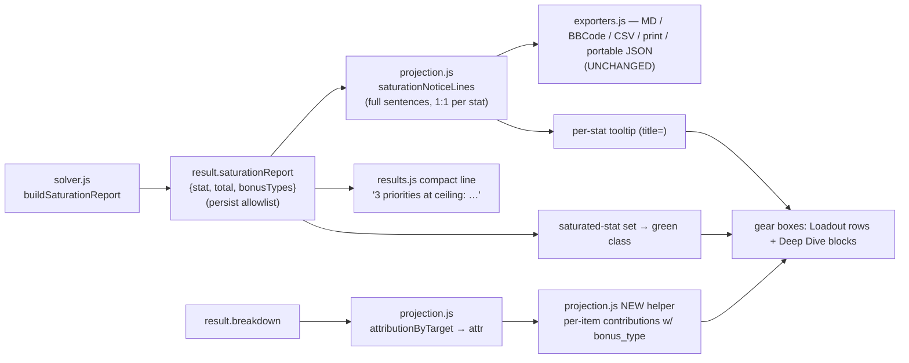

# Gear-Box Priority Summaries - Plan

## Goal Capsule

- Objective: move the ceiling analysis from a dense paragraph above the result tabs onto the gear boxes it describes — each item shows its ranked-priority contributions, green when the stat is at its ceiling — and shrink the paragraph to a one-line count.
- Product authority: the maintainer, from design decisions taken 2026-08-12 (per-item summaries, compact one-liner, ceiling-only scope). The Product Contract is authoritative for behavior; the Planning Contract for how it is built.
- Open blockers: none.
- Execution profile: browser-only (`web/results.js`, `web/projection.js`, `web/styles.css` + ship stamps). No pipeline, dataset, or solver change; `tests/solver_golden.test.js` must not move.
- Stop conditions: stop and surface rather than guessing if the per-item coloring cannot be derived from `result.saturationReport` alone (a claim needing new solver output is out of scope), or if any export's saturation sentences would change.
- Tail ownership: this plan does not own the commit, PR, or deploy. `main` deploys on push.

---

## Product Contract

### Summary

Each occupied gear box gets a summary at the bottom naming the item's contributions to the ranked priorities — stat, value, bonus type — with a contribution rendered green when that stat is at its ceiling and neutral otherwise; the full "reaches you as … all filled" sentence moves into a tooltip. The paragraph block above the tabs becomes "3 priorities at ceiling: Intelligence 37, Constitution 40, Doublestrike 33." Shared builds are untouched: every export keeps the full sentences from the same shared source.

### Problem Frame

The saturation disclosure (#239) renders as one dense paragraph above the result tabs: "Intelligence is at its ceiling of 37 — it reaches you as a Profane bonus, an Insight bonus, an Enhancement bonus, a Quality bonus, a Festive bonus, and all of them are filled…" — repeated per saturated stat and joined into a single `
`. The facts are right and the player reported them unreadable: the analysis is about specific stats arriving through specific items, but it is presented as a wall of prose far from the gear it describes. Meanwhile the Loadout tab's gear boxes carry no priority information at all — a player cannot see which box is doing the work for which ranked stat, or that a stat is already maxed, without decoding the paragraph.

### Key Decisions

- **The paragraph becomes a compact one-liner; the detail moves to the boxes.** (session-settled: user-directed — chosen over removing the stat-level notice entirely and over keeping the full paragraph behind a collapsed toggle: the count-plus-list keeps the at-a-glance fact without the wall of prose.)
- **Only the ceiling/saturation analysis localizes.** (session-settled: user-directed — chosen over also moving the empty-slot, absorption, blocklist, and crafting-excluded notices: those are already short or slot-specific; they stay as they are.)
- **The per-item summary is ranked-stat contributions with green-for-at-ceiling and a tooltip.** (session-settled: user-directed — chosen over explicit status words per contribution and over full mini-sentences per box: value + bonus type is the compact form; the tooltip carries the sentence.)
- **Exports keep the full sentences.** A shared build's recipient cannot hover a tooltip or read a color; the existing sentence disclosures stay in all five formats, fed by the same shared source as today.

### Requirements

**Per-item summary**

- R1. Each occupied gear box on the Loadout tab shows, at the bottom of the box, that item's contributions to the ranked priorities — stat, value, and bonus type (e.g. "Intelligence +22 Insight") — in the player's ranked order.
- R2. A contribution whose stat is at its ceiling renders green; every other contribution renders neutral.
- R3. An at-ceiling contribution's tooltip carries the full existing sentence for that stat ("Intelligence is at its ceiling of 37 — it reaches you as … and all of them are filled, so no other item in your pool can raise it.").
- R4. The Loadout Deep Dive blocks carry the same summary with the same coloring, replacing the plain "wins …" line's content on that surface.
- R5. An item with no ranked contribution keeps its existing presentations: "included to complete the loadout", and the craft-carried "here only for its crafts" variant.

**Compact notice**

- R6. The saturation paragraph above the tabs is replaced by one line: a count and list, e.g. "3 priorities at ceiling: Intelligence 37, Constitution 40, Doublestrike 33." — singular form correct, absent entirely when nothing is saturated, full sentences available on its tooltip.
- R7. The line states facts only: no cause attribution and no unused-source count, matching the standing wording rules of the sentence it replaces.

**Shared source and restore**

- R8. Every export (Markdown, BBCode, CSV, print, portable JSON) keeps the full sentences unchanged, still read from the shared content model.
- R9. The compact line, per-item coloring, and tooltips derive only from `result.saturationReport` and the existing attribution data on the result, so a restored saved character renders identically without re-solving.

### Acceptance Examples

- AE1. Covers R1, R2, R3.
  - **Given:** a solve where Intelligence is at its ceiling and Doublestrike is not; an item contributes Intelligence +22 as an Insight bonus, another contributes Doublestrike +15.
  - **When:** the Loadout tab renders.
  - **Then:** the first box shows "Intelligence +22 Insight" in green with the full ceiling sentence as its tooltip; the second shows "Doublestrike +15 Enhancement" neutral, no ceiling tooltip.
- AE2. Covers R6.
  - **Given:** the same solve, one stat saturated.
  - **When:** the notices render.
  - **Then:** the block reads "1 priority at ceiling: Intelligence 37." — no "reaches you as" paragraph in the app.
- AE3. Covers R8.
  - **Given:** the same solve exported to Markdown.
  - **When:** the export renders.
  - **Then:** it contains the full "is at its ceiling of" sentence exactly as today.
- AE4. Covers R9.
  - **Given:** a character saved from that solve, restored in a fresh session.
  - **When:** results render from the snapshot.
  - **Then:** the same boxes are green and the same compact line appears, with no re-solve.

### Scope Boundaries

- The empty-slot, absorption-quarantine, blocklist, crafting-excluded, bound, and zero-source notices are untouched.
- Export wording is untouched. The per-item green fact does not need a new export channel: it restates two facts every export already carries (the attribution names each item's contributions with bonus types; the saturation sentences name the at-ceiling stats), and the portable JSON already carries `saturationReport` raw. This ruling is deliberate, not a default — recorded so the exports-cover-all-new-mechanics invariant is satisfied by decision.
- No solver or dataset change of any kind.

#### Deferred to Follow-Up Work

- Coloring the at-ceiling stats on the Ranked Priorities tab's receipt cards — a natural extension the maintainer held out of scope. Per the repo's Open-work rule, file this as a GitHub issue before this plan's PR merges.

---

## Planning Contract

### Key Technical Decisions

- **KTD1 — Green means "feeds a stat at its ceiling", never "this item maxed the stat".** `saturationReport` establishes a stat-level fact (all live bonus-type buckets filled). Per-item green is that fact restated at the contribution: *this contribution feeds a stat that is at its ceiling*. No wording (visible or tooltip/title text) may claim a per-item cause — that is the exact failure class `docs/solutions/conventions/never-infer-a-claim-about-your-own-results.md` documents. Membership test is simply `saturationReport.some(e => e.stat === stat)`.
- **KTD2 — The per-item contribution data comes from a new projection.js helper, not a results.js loop.** `whyThis` (web/projection.js) sums per stat and drops `bonus_type`, so it cannot produce "Intelligence +22 Insight". Add a sibling helper in `web/projection.js` that walks `attr[stat]` entries whose `hostIds` include the item's `variant_id` (the same matching `whyThis` uses — preserving the rings behavior pinned by the host-id test) and keeps `(stat, value, bonus_type, viaSet, boolean)` per contribution, ordered by the ranked targets. It lives in projection so it stays export-reachable and joins the results.js re-export parity test.
- **KTD3 — One wording, one field.** `saturationNoticeLines` stays the single sentence source: its per-stat line (the array maps 1:1 to report rows) is reused verbatim as the tooltip for that stat and for the compact line's tooltip; exporters keep reading `view.character.saturationNotice` unchanged. The compact line is a count/list derived from the same `saturationReport` rows — never a second sentence corpus that can drift. Update the "ONE source for the app notice and every export" docstrings in `web/projection.js` and `web/results.js` to state the new contract (sentences: exports + tooltips; compact count-line: app), so the comment does not become a lie.
- **KTD4 — Threading, not recomputation.** `buildViews` already computes `attr` (`attributionByTarget`) and has `query`; extend the `equippedRow`/`equippedBody` call chain to pass the attribution, the ranked targets (`query.targets` — attribution object keys are not rank-ordered), and the saturated-stat set. Maps-less pure-test callers must keep working: every new argument is optional and its absence renders no summary, matching the existing tolerance.
- **KTD5 — Distinct ceiling styling.** `.pd-why` is already `var(--optimal)` green, so green-for-ceiling on the same line would be invisible. The summary line renders in muted/base text with per-contribution ``s; only an at-ceiling contribution's span gets the ceiling class (using `--optimal`). Single dark theme — no `prefers-color-scheme` handling exists or is added. Tooltips are plain `title=` attributes per app convention.
- **KTD6 — Classic-script hygiene.** Any new top-level identifier shared between the browser files uses `var`, not `const` (`docs/solutions/conventions/shared-classic-script-globals-use-var-not-const.md`); node tests do not catch this class of breakage, the browser pass does.

### High-Level Technical Design

Everything the app newly renders derives from two persisted result fields (`saturationReport`, `breakdown`); nothing reads the live program, so restore parity (R9) holds by construction.

---

## Implementation Units

### U1. Projection helpers: per-item contributions and per-stat sentences

**Goal:** the data layer for both surfaces — per-item ranked contributions preserving bonus type, the saturated-stat membership set, and per-stat access to the existing sentences — in `web/projection.js`.

**Requirements:** R1, R2, R3, R9. Implements KTD1, KTD2, KTD3 (docstring update).

**Dependencies:** none.

**Files:** `web/projection.js`, `web/results.js` (re-export only), `tests/projection.test.js` (holds the KTD2 re-export parity assertion), `tests/results.test.js`.

**Approach:** add a `whyThis`-shaped helper returning per-contribution `(stat, value, bonus_type, viaSet, boolean)` matched by `hostIds`, ordered by a caller-supplied ranked-target list; a `saturatedStats(result)` set built from `saturationReport`; and a keyed accessor mapping a stat to its exact `saturationNoticeLines` sentence (the array is 1:1 with report rows — derive, don't re-word). Rewrite the "ONE source" docstring per KTD3. Re-export the new helpers through `web/results.js`'s module block so the parity test covers them.

**Test scenarios** (`tests/projection.test.js` unless noted):
- Happy path: an item with two contributions to ranked stats returns both with correct bonus types, ranked order (not breakdown order).
- Rings: two different rings, one carrying a set win — contributions do not cross-attribute between hosts (mirror the existing host-id test with bonus types).
- Boolean contribution: a presence affix returns `boolean: true`, no magnitude.
- Saturated set: report rows → membership set; empty/missing report → empty set.
- Per-stat sentence: the accessor returns exactly the line `saturationNoticeLines` produces for that stat; a stat not in the report returns nothing.
- Parity: the new helpers appear in the results.js re-export parity assertion (`tests/projection.test.js`, the KTD2 re-export-surface test).

**Verification:** new tests fail against the pre-change tree (export base commit to scratch, copy generated `web/data/items.json` in first), pass after; `tests/exporters.test.js` untouched and green.

**Execution note:** prove each new test red against the base tree before trusting it — an aborted run reads as a pass.

### U2. Compact one-liner replaces the saturation paragraph

**Goal:** the app's notice block shows "N priorities at ceiling: Stat total, …" instead of the full paragraph; sentences survive on its tooltip; exports untouched.

**Requirements:** R6, R7, R8. Implements KTD3.

**Dependencies:** U1 (per-stat sentence accessor for the tooltip).

**Files:** `web/results.js` (`saturationNotice`), `web/styles.css`, `tests/results.test.js`.

**Approach:** rewrite `saturationNotice(result)` to render the count + "Stat total" list from `saturationReport`, with the joined full sentences as the element's `title`. Keep the `scope-note`/`saturation-note` class family (add a modifier class if styling needs it) and the `role="status"`. Singular/plural handled; empty report renders nothing, as today.

**Test scenarios** (`tests/results.test.js`, adapting the existing saturation assertions):
- One saturated stat → "1 priority at ceiling: X 30." — singular, stat and total present.
- Two saturated stats → count 2 and both "Stat total" entries, in report order.
- The paragraph phrases ("reaches you as", "is at its ceiling of") no longer appear in the visible text but DO appear in the `title` attribute.
- The existing no-cause assertion survives: no `ML`/`level`/`cap` cause words in the visible line.
- Empty report → empty string.

**Verification:** `tests/exporters.test.js` still asserts every format carries "at its ceiling" — proving R8 without modification.

### U3. Per-item summary on the gear boxes and Deep Dive blocks

**Goal:** one shared renderer puts the contribution summary (with green-at-ceiling spans and tooltips) at the bottom of each occupied Loadout row and into each Deep Dive block.

**Requirements:** R1, R2, R3, R4, R5. Implements KTD1, KTD4, KTD5, KTD6.

**Dependencies:** U1.

**Files:** `web/results.js` (`whyThisLine`, `equippedRow`, `equippedBody`, `loadoutDeepDive`, `buildViews`), `web/styles.css`, `tests/results.test.js`.

**Approach:** upgrade `whyThisLine` (or a successor it delegates to) to render per-contribution spans — `Stat +N BonusType` — from the U1 helper, ceiling class + per-stat sentence `title` on saturated spans, keeping the existing empty-state and craft-carried branches verbatim. Thread `attr`, ranked targets, and the saturated set from `buildViews` into `equippedRow` → `equippedBody` (new trailing optional args) and render the summary at the bottom of `.pd-rbody`; `loadoutDeepDive` already receives `attr` and `query` and swaps to the same renderer in place. New CSS: base summary line muted, ceiling span in `--optimal`; do not reuse `.pd-why`'s all-green styling for the new line.

**Test scenarios** (`tests/results.test.js`):
- Loadout row for a contributing item contains the summary with stat, value, and bonus type, in ranked order.
- A saturated stat's span carries the ceiling class and a `title` containing "is at its ceiling of"; a non-saturated span carries neither.
- Boolean contribution renders as `✓ Stat`, no `+value`.
- Empty state: an item with no ranked wins still renders "included to complete the loadout"; craft-carried item still renders the ⚒ line.
- Rings: the summary matches by host `variant_id` — the non-contributing ring shows no cross-attributed set win.
- Pure-test tolerance: `equippedRow`/`equippedBody` called without the new args render no summary and no crash.
- Deep Dive block carries the same summary content as the Loadout row for the same item.

**Verification:** new tests proven red against base; all 19+ JS test files pass run one-per-invocation; `tests/solver_golden.test.js` unchanged — a golden diff means display work leaked into the solve.

### U4. Ship gate: stamps, full sweep, browser pass

**Goal:** the change ships per repo convention with visual proof from the real page.

**Requirements:** supports all; repo conventions.

**Dependencies:** U1–U3.

**Files:** `web/index.html` (all `?v=` refs, currently 114, bumped together), `web/app.js` (footer `BUILD`), `README.md` (`**Current build:**` line).

**Approach:** bump the three stamps together (`tests/test_build_stamp.py` enforces agreement); run the Python suite and every JS test file separately; browser pass against the built dataset on `python3 -m http.server` via Claude-in-Chrome — solve a query known to saturate a stat, verify the compact line, green spans, tooltips, Deep Dive parity, and a save→reload restore (AE4). Node tests cannot catch classic-script/global breakage; the browser pass is the guard.

**Test scenarios:** none new — this unit executes the Verification Contract. `Test expectation: none -- ship/verification unit; coverage lives in U1–U3.`

**Verification:** all gates in the Verification Contract green; the deferred Ranked-tab issue filed before the PR merges.

---

## Verification Contract

- `python3 tests/run_tests.py` — Python suite, includes `tests/test_build_stamp.py` (three stamps agree).
- `for t in tests/*.test.js; do node "$t"; done` — every JS file separately; `node a.js b.js` runs only the first and has silently skipped the golden check before.
- `tests/solver_golden.test.js` must pass **unchanged**. This plan is display-only; any golden drift is a defect in the change, not a re-ratification candidate.
- `tests/exporters.test.js` saturation assertions must pass **unmodified** — they are the proof of R8.
- New-test proof: export the base commit to a scratch dir, copy the gitignored `web/data/items.json` in, run the new U1–U3 tests there, and confirm each fails (a crash is not a fail — check the assertion actually fired).
- Browser pass (U4): real solve on localhost with Claude-in-Chrome covering AE1, AE2, AE4 visually.

## Definition of Done

- R1–R9 implemented; AE1–AE4 demonstrably hold (AE1/AE2/AE4 in the browser pass, AE3 by the untouched exporter tests).
- All Verification Contract gates green; golden and exporter tests unchanged.
- The three build stamps bumped together in the shipping commit.
- The Ranked Priorities follow-up filed as a GitHub issue and linked from the PR before merge.
- No dead or experimental code left in the diff; docstrings updated per KTD3 so no comment claims the old single-wording contract.
