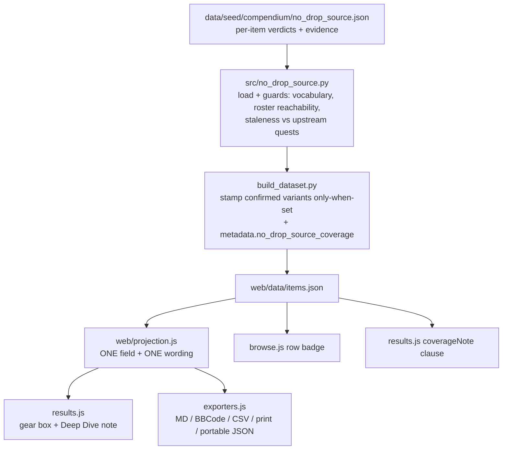
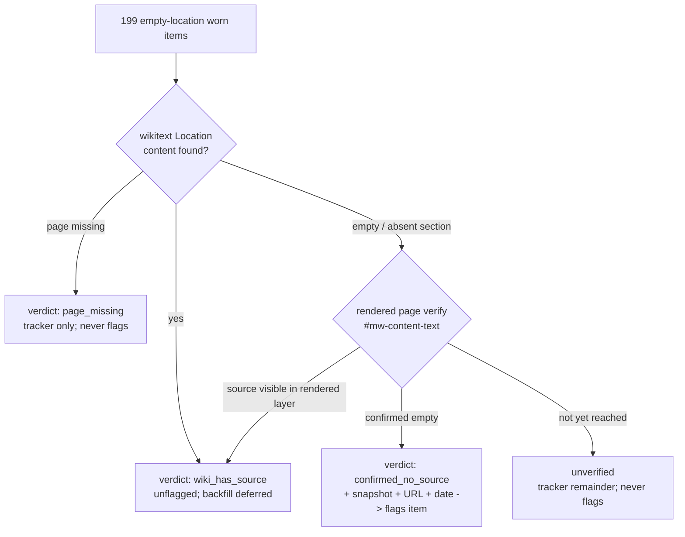

# No-Known-Drop-Source Detection and Disclosure - Plan

## Goal Capsule

- **Objective:** Items the wiki confirms have no live drop source carry a dataset flag and a player-facing "no known live drop source" disclosure on every surface an item renders — solver results, Deep Dive, browse, the wizard's pin/block search rows, and all six share exports. Closes #262; closes #244 as a special case.
- **Authority:** This plan; the repo's standing rules in the project instructions (never-infer, prove-a-guard-fails, generated-dataset, harvest rules) override anything here that conflicts.
- **Stop conditions:** Surface, don't guess: if the wiki triage finds the Location signal is expressed inconsistently across page classes (banner vs section vs category) in a way the two-stage classifier cannot settle, record the ambiguous items as unverified and continue — do not widen the verdict bar. If a shard guard contradicts a golden expectation, stop and re-check rather than re-ratifying.
- **Execution profile:** Mechanism first (U1–U4, safe with an empty seed), data second (U5, browser-dependent). The data track requires a Chrome session with a ddowiki tab and is resumable — partial completion is a valid ship state provided the tracker records the remainder.
- **Tail ownership:** The implementing session owns PR, CI, and issue closures (#262, #244) plus filing the deferred-work issues named in Scope Boundaries.

---

## Product Contract

### Summary

Add a wiki-evidence-backed "no known live drop source" flag: a curated seed shard records per-item verdicts harvested from the DDO wiki, the pipeline stamps confirmed items, and one projection field carries the disclosure to every player-facing surface. The solver is untouched — flagged items stay candidates, and exclusion remains the player's move via the shipped blocklist.

### Problem Frame

Players report gear the optimizer recommends that no longer drops: "Bracers of the Spider Queen doesn't drop, or is there a better way to handle things no longer available in quest loot?" (data/bug_reports.txt:106); "according to wiki this is not available - its only in the test Dojo?" (#244). The dataset has 210 worn variants with an empty `location_quest`, but that absence is a candidate signal, not a verdict — some are event items whose source the harvest simply lacks, and 11 are synthetic crafting hosts with no drop source by design. Two items are wiki-confirmed unobtainable so far. Today nothing in the web layer reads `location_quest` at all, so a player learns an item is farmable only by trying to farm it.

### Requirements

**Detection and data**

- R1. A worn variant wiki-confirmed to have no live drop source carries a flag in the built dataset, stamped by the pipeline from a curated evidence shard. The field is emitted only when set; absence is the default and the signal (the `absorption_quarantined` only-when-set precedent).
- R2. Only wiki-confirmed items are flagged. An empty `location_quest` alone never flags an item, and an unverified item shows nothing player-facing.
- R3. The 11 synthetic Dinosaur Bone crafting blanks (`source: "dino_crafting_blank"`, `src/dino.py`; they carry no `location_quest` key at all) are crafted by design — excluded from triage and never flagged. The triage universe is selected strictly by `location_quest == ""`, which yields exactly the 199 candidates; ~1,063 augment records in the same items array carry `location_quest: null` and must never enter the universe.

**Disclosure**

- R4. A flagged item discloses "no known live drop source" everywhere it renders: the loadout results list, Loadout Deep Dive, the browse tab, the wizard's pin and block search result rows, and all six share exports (Markdown, BBCode, CSV, print, portable JSON, DDOBuilder `.gearset`) — all surfaces reading one projection field or its one wording constant.
- R5. The wording claims exactly what the evidence establishes. The wiki proves its page records no source; it cannot prove "unobtainable" — that word never appears.
- R6. No solver behavior changes: flagged items remain candidates and equippable; exclusion stays with the blocklist. With an empty seed the inert path is fully inert — no per-variant flags AND no coverage metadata block — so the built dataset and every solve are byte-identical to baseline.
- R7. Dataset metadata carries a coverage block (confirmed / wiki-has-source / unverified counts, harvest dates), and the results coverage note gains a clause when confirmed items exist.

**Triage and evidence**

- R8. The 199-item triage runs against the wiki in two stages: batched wikitext classification of the Location signal, then rendered-page verification of every item that would be flagged — a "no source" verdict is never issued from wikitext alone. Progress is resumable and recorded in a tracker; each shard entry carries its verbatim evidence snapshot, wiki URL, and harvest date.
- R9. A shard entry goes stale loudly: if the item's upstream `quests` array becomes non-empty, the build fails for review. Un-flagging is a deliberate review event, never automatic.
- R10. Cataclysmic Buckler's verdict is recorded during the triage either way, and #244 closes with that evidence.

### Scope Boundaries

- **No solver-side exclusion or penalty** — "attainability as a solver input" is a recorded non-goal; opt-in exclusion already exists (blocklist).
- **No #197 dependency** — the rarity/source-tier field remains future work; this flag is a boolean fact, not a tier.

#### Deferred to Follow-Up Work

- **Location backfill for wiki-has-source items.** Triage will find items whose wiki page records a source our data lacks; record the verdict, but backfilling `location_quest` is a separate enrichment (file an issue at ship with the count).
- **Re-check cadence.** Confirmed verdicts are falsifiable by game updates; the tracker doc records when to re-run (the speed-tooltip-tracker precedent), but no automation is built now.

### Acceptance Examples

- AE1. **Given** `Legendary Bracers of the Spider Queen` confirmed in the shard, **when** a solve selects it, **then** its gear box and Deep Dive entry show "no known live drop source", and all six exports (Markdown, BBCode, CSV, print, portable JSON, `.gearset` commentary) each carry the same note on that item.
- AE2. **Given** an empty seed shard, **when** the dataset builds and the golden suite runs, **then** `web/data/items.json` is byte-identical to baseline and every golden fixture passes unchanged.
- AE3. **Given** an unverified empty-location item (triage not yet reached), **when** it appears in results or browse, **then** no disclosure renders.
- AE4. **Given** a shard entry for an item whose upstream `quests` later becomes non-empty, **when** the dataset builds, **then** the build fails naming the stale entry.

---

## Planning Contract

### Key Technical Decisions

- KTD1. **Disclose, never drop.** (session-settled: user-approved — chosen over auto-excluding confirmed items: exclusion is a recorded non-goal as a default solver input, and the blocklist already gives players opt-in exclusion.)
- KTD2. **Confirmed-only disclosure.** (session-settled: user-directed — chosen over a softer "source unrecorded" note on all 199: event items would generate noisy false alarms, violating the never-infer output-side rule.)
- KTD3. **Full triage during implementation, resumable.** (session-settled: user-directed — chosen over shipping the mechanism seeded with only the 2 confirmed items: the batched API technique makes the bulk pass cheap, and partial completion is a valid ship state.)
- KTD4. **Shard mirrors `ml36_augments.json`; loader is a new `src/no_drop_source.py`.** Flat name-keyed `harvested` map, per-entry verdict + evidence + date + URL, `_meta` carrying the vocabulary and guard rules; `stated` provenance vocabulary from the absorption/enchantment discipline. **Deliberate divergence from ml36:** an absent or empty shard is fully inert (the exclude-until-verified empty-seed pattern), not a build failure — it emits neither per-variant flags nor the `metadata.no_drop_source_coverage` block, preserving AE2's byte-identity; the coverage block is attached only when the shard has entries (true for the shipped 2-entry seed). Disclosure is fail-safe-absent, and the mechanism and data land as separable tracks. Once entries exist, the guards fire.
- KTD5. **Verdict classes:** `confirmed_no_source` (flags the item), `wiki_has_source` (recorded so re-triage skips it; item stays unflagged; feeds the deferred backfill issue), `unverified` / `page_missing` (tracker-only quarantine — cannot confirm, never flags). Three claim strengths stay distinct: "empty Location section" (the observation), "no known live drop source" (the disclosable claim), "unobtainable" (never claimed).
- KTD6. **Two-stage triage; 20 titles per POST.** Bulk wikitext classification via batched same-origin `prop=revisions` calls, then rendered-page (`#mw-content-text`) verification of every flag candidate before its verdict is issued — the bundled-template lesson says the rendered layer is authoritative and wikitext can hide the Location in templates/categories. The recorded harvest-method rule of 20 titles per POST wins over the API's 50-title limit.
- KTD7. **Disclosure threads exactly like #245's `craftCarried`.** One field computed in `web/projection.js`, carried on every `view.loadout` entry and the browse/deep-dive projections, one wording constant consumed by app render and all five exporters — never a per-surface re-derivation.
- KTD8. **Staleness keys off `quests` (the list), not `location_quest` (the derived joined string).** The raw array is the primary field; the string is presentation.

### High-Level Technical Design

Data flow — mechanism track:

Triage decision gates — data track (per empty-location item):

### Assumptions

- The Dino-blank carve-out is by the pipeline-side `source: "dino_crafting_blank"` marker (`src/dino.py`) — it is not observable in the built JSON, so the carve-out keys off pipeline records, not `web/data/items.json`. The blanks fall outside the `location_quest == ""` universe filter anyway (they carry no such key), so the carve-out is belt-and-suspenders for the coverage count.
- `web/dataset.js normalizeItem` does not currently touch `location_quest` or the new field; U2 verifies this on the real runtime path rather than assuming data-at-rest is what runs.

---

## Implementation Units

### U1. Evidence shard + loader with proven guards

- **Goal:** `data/seed/compendium/no_drop_source.json` exists (seeded with the two confirmed items' evidence) and `src/no_drop_source.py` loads and validates it.
- **Requirements:** R1, R2, R9; KTD4, KTD5, KTD8.
- **Dependencies:** none.
- **Files:** `src/no_drop_source.py`, `data/seed/compendium/no_drop_source.json`, `tests/test_no_drop_source.py`.
- **Approach:** Mirror `src/ml36_augments.py`'s load/check split. Guards: verdict vocabulary is closed (KTD5 classes only); every entry names an item present in the roster (the `assert_all_reached` anti-orphan pattern from `src/type_corrections.py`); a `confirmed_no_source` entry must carry snapshot + URL + date; staleness — entry's item has non-empty upstream `quests` → SystemExit naming the entry. The raw `quests` array lives on planner records (`src/planner_items.py`), not on variants — wire the staleness check in `build_dataset.py` where planner records are in scope, pre-variant-expansion. Absent/empty shard returns the inert no-op (KTD4 divergence, labeled in a comment).
- **Patterns to follow:** `src/ml36_augments.py` (load/check/SystemExit), `src/absorption_split.py` (refuse-to-compare-nothing discipline once entries exist), `src/type_corrections.py` (`assert_all_reached`).
- **Test scenarios:**
  - Happy: the shipped 2-entry shard passes all guards against the real roster; `confirmed_no_source` entries surface in the loader's output keyed by item name.
  - Covers AE4. Staleness: a fixture entry whose item carries non-empty `quests` fails the build naming the entry.
  - Guard-proving (corrupt-and-restore, value and its snapshot together): unknown verdict class → red; entry naming a roster-absent item → red; confirmed entry missing its snapshot or URL → red.
  - Edge: absent shard file → no-op; empty `harvested` → no-op (labeled deliberate — the empty-seed exception).
- **Verification:** New tests fail against the pre-change tree (except the labeled empty-seed no-op guards); Python suite green.

### U2. Pipeline stamping + coverage block

- **Goal:** Confirmed items carry the flag in `web/data/items.json`; metadata reports coverage.
- **Requirements:** R1, R3, R6, R7.
- **Dependencies:** U1.
- **Files:** `build_dataset.py`, `src/variants.py`, `tests/test_no_drop_source.py` (extend).
- **Approach:** Stamp a `no_drop_source: true` field on matching variants only-when-set (the `QUARANTINE_FIELD` precedent in `src/variants.py` — the null-stamping 353KB lesson is documented there). When (and only when) the shard has entries, attach `metadata.no_drop_source_coverage` beside the existing coverage blocks in `build_dataset.py`; compute the counts (confirmed / wiki_has_source / unverified, triage universe size, carve-out count) from the dataset at build time rather than hardcoding constants, so harvest refreshes cannot drift them.
- **Test scenarios:**
  - Covers AE2. Empty-seed full inertness: building with an empty fixture shard yields a dataset with zero `no_drop_source` fields AND no `no_drop_source_coverage` metadata block — byte-identical to baseline.
  - Happy: a fixture shard confirming one real item stamps exactly that variant (and its tier siblings only if the entry names them — key by variant-source name, decide exact-match semantics at implementation) and the coverage block counts it.
  - Edge: a `wiki_has_source` entry stamps nothing.
- **Verification:** Python suite green; golden JS suite unchanged (the flag is solver-inert — any golden diff is a defect, not a re-ratification).

### U3. Projection field + results + exports disclosure

- **Goal:** One projection field carries the disclosure to the gear box, Deep Dive, and all six exports.
- **Requirements:** R4, R5, R6; KTD7.
- **Dependencies:** U2.
- **Files:** `web/projection.js`, `web/results.js`, `web/exporters.js`, `tests/projection.test.js`, `tests/results.test.js`, `tests/exporters.test.js`.
- **Approach:** Clone the `craftCarried` threading (`projection.js` compute + carry on `view.loadout` entries; `results.js` renders the note in the gear box / Deep Dive item block near the existing `dd-artifact` tag; `exporters.js` one wording helper consumed by toMarkdown/toBBCode/toCsv/toPrintHtml; toPortableJSON inherits via `Proj.project`; toGearset appends the disclosure line for flagged items to its commentary record block, honoring its single-physical-line invariant). The wording constant is exactly "no known live drop source". Add the coverage-note clause in `results.js coverageNote` when confirmed items exist.
- **Patterns to follow:** `projection.js craftCarried` + `exporters.js carriedStr` (#245); `results.js` artifact badge render.
- **Test scenarios:**
  - Covers AE1. `project()` carries the flag on a loadout entry for a flagged fixture item, and each of the six exports contains the wording exactly once for it.
  - Covers AE3. An unflagged item produces no disclosure in any surface (assert absence, not just presence elsewhere).
  - The app render test: the results item block shows the note for a flagged item (mirror the `equippedRow` artifact-badge test shape).
  - Wording guard: the string "unobtainable" appears nowhere in the new surfaces.
- **Verification:** All JS test files pass individually; new tests proven red against the pre-change tree.

### U4. Browse badge + wizard search-row notes

- **Goal:** Flagged items are list-visible everywhere a player picks items pre-solve: browse rows show a badge, and the wizard's pin and block search result rows carry the note.
- **Requirements:** R4.
- **Dependencies:** U2.
- **Files:** `web/browse.js`, `web/wizard.js`, `tests/browse.test.js`, `tests/wizard.test.js`.
- **Approach:** Surface the flag in the browse row projection (the browse-visibility-for-separate-source-pools lesson: a non-affix fact is invisible unless projected into the row) — a badge beside the existing `verification` badge. In `web/wizard.js`, append the same wording constant to flagged items' pin-search and block-search result rows beside the existing per-row state notes (`· pinned`, `· blocked`) — the moment of choosing an item is where the disclosure matters most.
- **Test scenarios:** flagged fixture item's browse row carries the badge and its pin-search and block-search rows carry the note; unflagged rows carry neither.
- **Verification:** `tests/browse.test.js` and `tests/wizard.test.js` green; visual pass via localhost + browser optional.

### U5. Wiki triage: populate the shard, close #244

- **Goal:** The 199-item triage is executed and recorded; every reached item has a verdict class; #244's evidence is captured.
- **Requirements:** R8, R9, R10; KTD3, KTD5, KTD6.
- **Dependencies:** U1 (shard format); interleaves with U2–U4.
- **Files:** `data/seed/compendium/no_drop_source.json` (populate), `docs/wiki-evidence/no-drop-source.md` (new evidence doc + resumable tracker), `data/bug_reports.txt` (annotate the report disposition if that is the existing convention).
- **Approach:** Same-origin from a ddowiki tab (Chrome MCP), POST to `/api.php`, 20 titles per request, ~1.5s pacing, strip `| = & ?` from returns; bulk `prop=revisions` wikitext classification first, then rendered-page (`#mw-content-text`) verification of every flag candidate before issuing `confirmed_no_source` (KTD6). Browser→repo bridge via the `<pre>`-staging `get_page_text` technique. The evidence doc follows `docs/wiki-evidence/ml36-augment-tier.md`'s structure (verified date, method, sources, the rule, guards proven) plus a `speed-tooltip-tracker.md`-style resumable tracker table. An `insource:` search returning empty is never evidence of absence.
- **Execution note:** This unit is data, not code — expect throttling; partial completion ships cleanly (unverified remainder counted in coverage). Validate the wikitext classifier against the rendered pages of the two known-confirmed items before the bulk pass.
- **Test scenarios:** `Test expectation: none` beyond U1's guards — the shipped shard passing U1's full guard set (roster reachability, evidence completeness, staleness) IS the data verification.
- **Verification:** Coverage block reflects the final counts; #244 closed citing the recorded Cataclysmic Buckler verdict; the deferred backfill issue filed with the `wiki_has_source` count.

---

## Verification Contract

| Gate | Command | Applies to |
|---|---|---|
| Python suite (stdlib runner) | `python3 tests/run_tests.py` | U1, U2, U5 |
| JS suite, one file per invocation | `for t in tests/*.test.js; do node "$t"; done` | U3, U4 |
| Golden solver parity | `node tests/solver_golden.test.js` — must pass **unchanged**; the flag is solver-inert, so any golden diff is a defect | U2 |
| Prove-fails-against-base | new behavioral tests red on `git archive` of the base tree (copy `web/data/items.json` in first); labeled no-op guards exempt | U1–U4 |
| Build-stamp trio | `?v=` in `web/index.html` + `BUILD` in `web/app.js` + README current-build line bumped together (`tests/test_build_stamp.py`) | any `web/` change |

## Definition of Done

- All five units complete; both suites green; golden unchanged.
- AE1–AE4 demonstrably hold (AE1 verified in the running app for a confirmed item, not only in unit tests).
- The shard's shipped entries all pass the proven guard set; the evidence doc + tracker exist with final counts (a recorded unverified remainder is acceptable; zero-progress on triage is not).
- #262 and #244 closed with `Closes` keywords and evidence; the location-backfill deferral filed as an issue before merge.
- No dead-end or experimental code in the diff; build stamp bumped per the trio rule.
