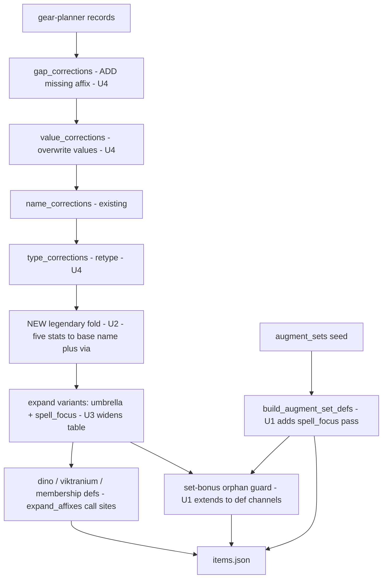

# User-Report Batch — Affix Credit Gaps and U81 Data Drift — Plan

## Goal Capsule

- **Objective:** One batch PR that (a) folds the five Legendary-prefixed numeric stats into their base stats so a plain-name priority finds them (#287), (b) corrects the wiki-drifted U81 Reign artifact values and sweeps the six ML32 Unholy Defiler artifacts (#288), (c) makes the Esoterica augment set solver-visible by running the universal-DC expansion over the augment-set-def channel and guarding it (#289), and (d) expands Potency into the element spellpowers so universal-spellpower gear credits element priorities (#290, Potency half only). Closes #287, #288, #289; comments on #290 and leaves it open for the Spell Lore half.
- **Authority:** This plan; the repo's standing rules in the project instructions (never-infer, prove-a-guard-fails, prove-a-test-fails-against-the-pre-change-tree, generated-dataset, harvest rules) override anything here that conflicts.
- **Stop conditions:** If a rendered wiki tooltip disagrees with the raw-template values already harvested into #288, the tooltip wins — re-verify rather than shipping the issue table on faith. If the Spell power page's "Affected damage types" table cannot be read cleanly (throttle), ship U1/U2/U4 and hold U3 for a later session rather than guessing the expansion target list. If a golden diff appears that a unit's rationale does not explain, stop and investigate — never blanket-accept.
- **Execution profile:** Mechanism units (U1, U2) are browser-free and land first. U3 and U4 each need a ddowiki Chrome session (evidence quotes and rendered tooltips); both are resumable and U4 is data-only.
- **Tail ownership:** The implementing session owns the PR (`Closes #287`, `Closes #288`, `Closes #289` — a bare `#290` reference plus an explanatory comment on the issue), CI to green, deploy verification, and the build-stamp triple bump.

---

## Product Contract

### Summary

Fix the four verified user reports from 2026-08-13 in one batch: two priority-reachability defects (Legendary-prefixed stat names, the unexpanded Esoterica set bonus), one evidence-gated crediting gap (Potency vs element spellpower priorities), and one data-currency correction (post-U81-nerf artifact values), using the existing correction-shard and expansion-family machinery.

### Problem Frame

A player reported four defects, all verified against the dataset and the DDO wiki (issues #287–#290 carry the evidence):

1. `Legendary Accuracy/Armor-Piercing/Deadly/Conditioning/Spell Penetration` are stored as distinct stat names, so a plain `Accuracy` priority scores zero on that gear. The wiki writes them as the base enchantment with `Legendary` as the bonus-type parameter (`{{Accuracy|2|Legendary}}`), and the `Legendary` bonus type is already ruled real — stacking is coincidentally correct; reachability is broken.
2. Seven of nine ML35 "Reign" minor artifacts carry pre-nerf values (Orcus' Reign confirmed by the player; the batch sweep found six more, including one missing affix and one wrong bonus type).
3. The Esoterica augment set's bonus is stored as stat `Spell DCs` — a name no item carries, not in the universal-DC allowlist, granted through the one set-def channel that never gets the spell-focus expansion pass and that no orphan guard watches.
4. A `Nullification`/`Void Lore` priority gets zero credit from the Solar Gems of Spellpower/Spell Critical Chance because their stats are the universal names `Potency` and `Spell Lore`. Potency is wiki-evidenced as an all-type spellpower bonus and can expand like Spell Focus Mastery did (#205); Spell Lore has a standing do-not-merge ruling and stays open.

### Requirements

- R1: A priority on `Accuracy`, `Armor-Piercing`, `Deadly`, `Conditioning`, or `Spell Penetration` credits the Legendary-typed affixes currently stored under the `Legendary `-prefixed names; totals for a player who ranked both names do not change. (#287)
- R2: Item surfaces (proof panel, deep dive, browse, exports) still display the engraved enchantment name (`Legendary Accuracy +2`), per the #205 provenance convention.
- R3: The seven drifted Reign artifacts score the wiki's current values, each correction carrying its verbatim rendered tooltip and a stale guard; the six ML32 Unholy Defiler artifacts are swept the same way and corrected if drifted. (#288)
- R4: A school priority (e.g. `Necromancy Focus`) credits the Esoterica augment set at +3 Artifact per school, and the Set Bonuses tab shows it when chosen. (#289)
- R5: Any future set-def tier affix naming an expanded-away or unrankable universal stat fails the build instead of shipping silently — the augment-set-def and membership-set-def channels join the orphan guard. (#289)
- R6: An element spellpower priority (e.g. `Nullification`) credits `Potency` sources at the same bonus type, reproducing the wiki's highest-of-type rule through the existing per-(stat, type) bucketing; `Universal Spell Power` is untouched (it is a separate, fully-stacking stat). (#290)
- R7: The Spell Lore half of #290 is recorded as deferred with the quarantine citation, not silently dropped.
- R8: Every new correction and expansion is wiki-evidenced (rendered tooltip or explicit page statement) — nothing lands on the raw-template read alone.

### Scope Boundaries

**In scope:** the four issues as scoped above; golden re-ratification the changes force; the build-stamp triple bump; evidence-doc updates the changes make stale (`docs/wiki-evidence/bonus-type-equivalence.md` §2 Legendary bullet, new spellpower evidence doc).

**Out of scope (non-goals for this batch):**
- The Spell Lore credit mechanism (blocked on the quarantined solar-vs-artifact stacking claim in `docs/wiki-evidence/spell-lore.md` §U5 and on a credit-without-merging model design; #290 stays open for it).
- A generic umbrella-affix detector (#211) — this batch adds instances, not the detector.
- Set-bonus surfaces rendering the engraved enchantment for expanded affixes (#252).
- A full gear-planner snapshot refresh (rejected in scoping — see KTD1).
- `Spell Intensity` (universal spell-crit damage) and any other universal name not listed here — filed as #292, not silently included. The Universal Spell Power cross-add is #291; the dino-set umbrella/compound gap found during U1 is #293.

#### Deferred to Follow-Up Work

- If the ML32 sweep or the correction work surfaces additional U81-era drifted items beyond the 13 named here, file a follow-up issue rather than expanding this batch mid-flight.

---

## Planning Contract

### Key Technical Decisions

- **KTD1 — #288 lands via the corrections family, not a gear-planner refresh.** *(session-settled: user-directed — chosen over a full snapshot refresh: smaller reviewable diff, per-entry stale guards, no unreviewed unrelated drift.)* The family already covers every needed operation, each changing exactly one field: `src/value_corrections.py` (#207) for numeric drift, `data/seed/gap_corrections.json` (additive, skips existing `(name,type)`) for Orcus' Reign's missing `False Life | Quality | 15`, and `src/type_corrections.py` (#259) for Juiblex's `Acid Absorption` Enhancement→Insight. Do not widen any one module to do another's job — the separation is documented as deliberate in each module's docstring.
- **KTD2 — #290 ships the Potency half only.** *(session-settled: user-directed — chosen over attempting both halves: the lore half is evidence-blocked.)* `docs/wiki-evidence/spell-lore.md` §U5 quarantines the precise solar-vs-artifact interaction and confirms universal and element lore are different stats that both apply — so a same-type expansion of Spell Lore would collapse real stacking. Potency has the opposite evidence shape: the Spell Power page distinguishes "single-type Equipment bonus" from "all-type Potency bonus" per bonus type, i.e. the highest-of-type rule the per-(stat, type) max bucket already reproduces.
- **KTD3 — one batch PR.** *(session-settled: user-directed — chosen over PR-per-issue: one golden re-ratification pass, one deploy.)*
- **KTD4 — #287 gets a dedicated fold module with an explicit five-stat allowlist, not `name_corrections` and not a blanket prefix rule.** `name_corrections` hard-fails when the canonical name is already native — `Accuracy` is — and that guard is load-bearing for its own use case; do not weaken it. A blanket "strip `Legendary ` when type is `Legendary`" rule would silently fold a future unverified stat, violating never-infer. Instead: allowlist the five wiki-verified stats, stamp `spell_focus.PROVENANCE_KEY` with the engraved name (`Legendary Accuracy`), and add a guard that fails the build when a NEW numeric `Legendary *` stat with bonus type `Legendary` appears un-adjudicated — future instances get verified, not guessed either direction.
- **KTD5 — the Potency expansion extends `src/spell_focus.py` with a second universal table rather than adding a sibling module.** The module already has exactly the right call sites wired: `expand_variants` (items + item-attached set bonuses), and `expand_affixes` at the dino-insert, Viktranium-option, membership-set-def, and (after U1) augment-set-def sites. A sibling module would need every one of those call sites re-plumbed and a new `EXPANSION_PASSES` entry threaded through `src/container_registry.py` declarations; extending the table keeps coverage automatic and the registry stable. Internally: a `{universal stat (lowercased): target stat list}` map replaces the single `_UNIVERSAL` set + `SCHOOLS` constant; `is_universal`, `expanded_away`, and `source_label` cover both families. The module docstring's framing ("universal spell-DC") widens to "universal-stat expansion" — update it.
- **KTD6 — the Potency target list is harvested, not recalled.** The element spellpower stats to expand into come from the Spell Power page's "Affected damage types" table intersected with stats actually present in the dataset (`Combustion, Corrosion, Devotion, Glaciation, Impulse, Magnetism, Nullification, Radiance, Reconstruction, Resonance` are present under Equipment/Insight/Quality types — confirm the list and any missing member against the table during work). `Universal Spell Power` is explicitly excluded: the wiki states it is "fully stacking — it flat adds to all of your other Spell Powers", a different mechanic in its own buckets.
- **KTD7 — `Spell DCs` joins the universal-DC allowlist; the augment-set seed keeps its harvested wording.** Evidence: the wiki-evidence table records Esoterica as "+3 Artifact **all** Spell DCs" (`docs/wiki-evidence/augment-sets.md`), and gear-planner's own catalog stores the same bonus as `Spell Focus Mastery | Artifact | 3` (`data/seed/compendium/raw/gearplanner_sets.json`). Renaming the seed instead would fix one entry; the allowlist fixes the wording anywhere a future harvest emits it.
- **KTD8 — Juiblex correction ordering.** `value_corrections.apply` runs at `build_dataset.py:477`, `type_corrections` at `:494-495`. So the value entry targets the affix at its *current* type (`Acid Absorption | Enhancement`, from 16 → to 15) and the type entry then retypes it (Enhancement → Insight) with `value: 15` as its evidence binding. Verify the type module asserts the post-value-correction value; if it asserts the pre-correction one, swap to the order that satisfies both guards and record why.

### Assumptions

- The web layer's expanded-away redirect handles a new family without bespoke code: `web/dataset.js` builds `provenance_labels` from a live scan of stamped `via` data ("an eighth family is included the moment it stamps its first affix"), so `Legendary Accuracy` and `Potency` become redirecting picker entries once the fold/expansion stamps receipts. U2/U3 carry a test scenario to prove this rather than trust it.
- Saved builds ranking `Potency` load through the same redirect/stale-save path that #136/#280 built. If work finds saved priorities bypass the redirect, that becomes an in-scope fix for U3 (a priority that silently scores zero is the defect class this batch exists to remove).

---

## High-Level Technical Design

Where each fix sits in the dataset build (all in `build_dataset.py`'s `build()` unless noted):

The fold (U2) runs *before* variant expansion so one corrected affix block flows into vocabulary, verification, the picker, the solver, and exports from one place — the same stage argument `affix_name_corrections.json`'s README makes. The widened universal table (U3) needs no new call sites precisely because of KTD5; U1 adds the one call site that was always missing.

---

## Implementation Units

### U1. Esoterica: universal-DC expansion over the augment-set-def channel, plus the def-channel orphan guard (#289)

**Goal:** A school priority credits Esoterica's +3 Artifact bonus; no set-def channel can silently grant an unrankable universal stat again.

**Requirements:** R4, R5, R8.

**Dependencies:** none.

**Files:** `src/spell_focus.py`, `src/membership.py`, `src/enchantment_split.py` (or a sibling walker), `build_dataset.py`, `tests/test_spell_focus.py`, `tests/test_augment_sets.py` (the file that owns `augment_set_defs` coverage today; `tests/test_membership.py` exists but covers the membership-def side).

**Approach:** Add `"spell dcs"` to the universal-DC allowlist with a docstring citation of the two evidence quotes (KTD7). In `src/membership.py:build_augment_set_defs`, run tier affixes through `spell_focus.expand_affixes` after the existing `umbrella.expand_affixes` call — mirroring the membership-def site at `build_dataset.py:807-811`. Extend the orphan guard: `set_bonus_orphans` walks only `variant.parsed_set_bonuses`; add a def-channel walk (augment_set_defs + membership_set_defs tiers, `{stat, bonus_type}` shape) wired into the existing orphan check in `build_dataset.py` with an empty allowlist.

**Execution note:** Prove the new guard fails first — hand it a def whose tier names an expanded-away stat and confirm the build goes red, then restore (`docs/solutions/conventions/prove-a-guard-fails-before-trusting-it.md`). Prove the new tests fail against the pre-change tree.

**Test scenarios:**
- Built `augment_set_defs.Esoterica` tier carries the seven school affixes at `Artifact`, each stamped `via` with the source label, and no `Spell DCs` affix remains.
- Guard: a synthetic def tier naming `Spell Focus Mastery` (or any expanded-away stat) raises `SystemExit` naming the set and stat; the same walk over the shipped defs finds zero orphans.
- Guard refuses vacuous passes: walking zero defs is an error, not a pass.
- Membership defs (already expanded at the build_dataset site) are not double-expanded — an already-expanded tier passes through unchanged (expansion is idempotent because school stats are not universal).
- Solver-level: with augment sets available and a `Necromancy Focus` priority, the model credits an Esoterica 3-piece tier (unit test against the model/crediting layer, not a full golden fixture).

**Verification:** Python suite green; the rebuilt dataset shows Esoterica expanded (spot-check with a one-liner); guard-failure proof recorded in the work log/PR body.

### U2. Legendary prefix fold (#287)

**Goal:** The five wiki-verified `Legendary *` numeric stats score under their base names at bonus type `Legendary`; receipts still show the engraved name; a sixth such stat cannot appear silently.

**Requirements:** R1, R2, R8.

**Dependencies:** none (schedule before U3 to keep `spell_focus.py` edits sequential).

**Files:** new `src/legendary_fold.py` (name per repo taste), `build_dataset.py`, `src/container_registry.py` (only if pools carry the five names — see below), `docs/wiki-evidence/bonus-type-equivalence.md`, `tests/test_legendary_fold.py`, plus a receipts/vocabulary assertion in the owning existing test file.

**Approach:** Module with an explicit allowlist of the five stats, each entry citing its wiki template/tooltip evidence (all five captured 2026-08-13: `{{Accuracy|2|Legendary}}` + Balorskin tooltip "+2 Legendary bonus to attack rolls"; `{{Deadly|1|Legendary}}`; `{{Armor-Piercing|5|Legendary}}`; `{{Conditioning|5|Legendary}}` ×2 items; Artblade docent tooltip "+2 Legendary bonus to Spell Penetration checks"). Apply to planner records and the augment pool at the correction stage (after `type_corrections`, before variant expansion — see HTD). For each folded affix: rename to the base stat, keep type `Legendary`, stamp `PROVENANCE_KEY` with the engraved name. Add the unknown-instance guard per KTD4: scan for affixes matching `^Legendary ` with bonus type `Legendary` and a numeric value that are NOT in the allowlist; fail the build listing them. `Legendary <proc>` Bool affixes are out of scope by construction (type is `Bool`, not `Legendary`). Update the `bonus-type-equivalence.md` §2 bullet (type stays real; the stat names merged). Work-time check: grep the craft pools (dino inserts, Viktranium, seal, NC, set defs) for the five names — if any pool carries one, fold there too and update the pool's `container_registry` declaration; if none do, record that and leave the registry untouched.

**Execution note:** Prove the unknown-instance guard fails (inject a fake `Legendary Vitality | Legendary | 3` record) before trusting it. Prove new tests fail against the pre-change tree — copy the gitignored generated data into the scratch checkout first or the crash reads as a pass.

**Test scenarios:**
- Fold: a record with `Legendary Accuracy | Legendary | 2` emerges as `Accuracy | Legendary | 2` with `via: "Legendary Accuracy"`; all five stats covered; a `Legendary Slime | Bool` affix passes through untouched.
- Built dataset carries zero affixes named `Legendary Accuracy/Armor-Piercing/Deadly/Conditioning/Spell Penetration`, and the picker vocabulary no longer offers them.
- Guard: the injected unknown `Legendary * | Legendary` numeric affix fails the build naming the stat; the shipped dataset passes.
- Stacking preserved: an item with `Accuracy | Competence` and a folded `Accuracy | Legendary` occupies two buckets (sum), two folded `Accuracy | Legendary` sources collapse to the max — assert at the model/bucketing layer.
- Receipts: the surface label for the folded affix renders the engraved name (existing `spell-focus-receipts.test.js` conventions); `Legendary Accuracy` resolves in the picker as a redirect (provenance-label scan), not a dead name.

**Verification:** Python + JS suites green (JS file-by-file); golden diff expected only if a fixture ranks one of the five base stats at a Legendary carrier's ML — explain or confirm no diff.

### U3. Universal spellpower expansion: Potency → element spellpowers (#290, Potency half)

**Goal:** `Potency` affixes credit element spellpower priorities at the same bonus type; `Potency` leaves the picker as a redirect; the lore half is recorded as deferred.

**Requirements:** R6, R7, R8.

**Dependencies:** U1 (the augment-set-def channel must be running `expand_affixes` so Potency-granting set defs, if any, expand), U2 (sequential edits to `spell_focus.py`).

**Files:** `src/spell_focus.py`, new `docs/wiki-evidence/spellpower-universal.md`, `build_dataset.py` (expanded_away/orphan maps pick the new family up via `expanded_away()` — verify, don't assume), `tests/test_spell_focus.py`, `tests/parity/fixtures.json` + `tests/parity/golden.json` (re-ratification), `data/seed/compendium/vocab_registries.json` only if the registry pins stat names (work-time check).

**Approach:** Per KTD5/KTD6: harvest the "Affected damage types" table and the stacking statements from `https://ddowiki.com/page/Spell_power` plus the Potency enchantment page ("Passive: +N Equipment bonus to Spell Power") into the new evidence doc with verbatim quotes; then add `potency → [element spellpower stats]` to the widened universal table. Expansion emits one affix per element at the same bonus type, stamped `via` with `source_label` output (`Potency`, `Insightful Potency`, `Quality Potency`, … — confirm the wiki's prefix conventions for Insight/Quality Potency variants during harvest). `Universal Spell Power` excluded (KTD6). Dataset today: 255 Potency affixes across Equipment/Insight/Quality/Artifact/Profane/Exceptional types. Record the #290 lore-half deferral: a paragraph in the evidence doc pointing at `spell-lore.md` §U5, and (at ship time) a comment on #290.

**Execution note:** Harvest before code — the target list is an input, not a constant to recall. Then prove new tests fail pre-change.

**Test scenarios:**
- A `Potency | Equipment | 163`-style affix expands to every element spellpower at `Equipment` with `via: "Potency"`; an `Insight`-typed one keeps type `Insight`.
- `Universal Spell Power` affixes pass through unexpanded (both `Implement` and `Exceptional` types).
- Highest-of-type: an item with native `Nullification | Equipment | 114` plus an expanded `Nullification | Equipment (via Potency)` collapses to the max in one bucket; an `Insight` Potency stacks with an `Equipment` Nullification — assert at the bucketing layer.
- Picker: `Potency` is absent from rankable names, present as a redirect (expanded-away/provenance-label path); a saved build with a `Potency` priority loads without silently scoring zero (redirect or the #280 stale-save disclosure — whichever path fires, assert it is not silence).
- Set-bonus channel: if any set tier grants `Potency` (work-time grep), its tiers expand identically; if none, record the zero-count in the test so a future one is noticed.

**Verification:** The two golden fixtures ranking `Potency` will drift — this is the intended behavior change; re-ratify with `node tests/parity/capture_golden.js` only after confirming each diff is explained by Potency now crediting element buckets (or by the picker-level redirect changing fixture semantics — if fixtures encode raw solver input, decide deliberately whether the fixtures should rank an element instead, and record the decision in the PR body). Full JS suite file-by-file.

### U4. U81 artifact corrections (#288)

**Goal:** The seven drifted Reigns score current wiki values with per-entry stale guards; the six ML32 Unholy Defiler artifacts are swept and corrected the same way.

**Requirements:** R3, R8.

**Dependencies:** none (data-only; schedule anytime a browser session is available).

**Files:** `data/seed/compendium/item_value_corrections.json`, `data/seed/gap_corrections.json`, `data/seed/compendium/affix_type_corrections.json`, `tests/test_value_corrections.py` / `tests/test_gap_corrections.py` (extend counts/entries if they pin them), `tests/parity/golden.json` (if fixtures touch these items).

**Approach:** Browser session per the harvest method (same-origin, paced ~1.5s, strip `| = & ?`, backoff on non-JSON). For each of the 13 items (7 drifted Reigns + 6 ML32), capture the **rendered tooltip** per affected enchantment — the raw-template values in #288 are the work order, not the evidence; every correction entry's `tooltip` field is verbatim rendered text (bundled-template rule). Then write entries: value drifts → `item_value_corrections.json` (with `from` guards); Orcus' missing `False Life | Quality | 15` → `gap_corrections.json`; Juiblex's `Acid Absorption` → value entry at the current type then a type entry per KTD8. Two special cases to verify extra-carefully: Fraz-Urb'luu's `Command` moves UP (2→8) and its semantics interact with open question #192 — correct the value only, change nothing about how Command is modeled; and confirm on the rendered page whether Juiblex's absorption type is `Insight` or `Insightful` as displayed (the equivalence doc says gear-planner emits `Insight` only — store what the correction machinery expects, cite the tooltip).

**Execution note:** Resumable — land whatever subset is tooltip-verified if the wiki throttles; the issue table records the remainder. Every entry follows the existing Argonnessen entry's shape (evidence fields filled, `verified:` dated).

**Test scenarios:**
- Each correction applies: rebuilt dataset shows the corrected values/type and Orcus' new False Life affix (assert per item, not in aggregate).
- Stale guards: mutate one `from` value in a scratch copy and confirm the build fails naming the entry (prove-the-guard, one representative per shard touched).
- Gap entry does not double-add: rebuilding twice, or an item already carrying `False Life | Quality`, results in exactly one affix.
- No collateral: Baphomet's and Yeenoghu's Reigns (verified unchanged) carry no entries and their built affixes are byte-identical to before.

**Verification:** Python suite green; golden diffs only where a fixture's solve touches a corrected item — explain each in the PR body and re-ratify deliberately.

### U5. Ratification, stamps, and ship tail

**Goal:** One deliberate re-ratification and a clean deploy.

**Requirements:** supports all; Definition of Done items.

**Dependencies:** U1–U4.

**Files:** `tests/parity/golden.json` (regenerated), `web/index.html` (`?v=` bumps), `web/app.js` (footer `BUILD`), `README.md` (`**Current build:**` line and, if the "What it knows" table row for spellpower/DC crediting changed meaningfully, that row).

**Approach:** Full suite: `python3 tests/run_tests.py` and every `tests/*.test.js` file individually (the golden guard only runs when its file runs — `docs/solutions/workflow-issues/golden-solve-guard-missing-from-local-test-sweep.md`). Re-ratify goldens once, with every diff attributed to a unit (U3's Potency fixtures, U4's item values, possibly U2). Triple stamp bump (`tests/test_build_stamp.py` enforces agreement). PR body: `Closes #287`, `Closes #288`, `Closes #289`; reference #290 without a closing keyword and comment on the issue with what shipped and the recorded lore-half deferral. Watch CI/deploy to green.

**Test expectation:** none — this unit is verification and packaging; its proof is the suite itself.

---

## Verification Contract

- **Gates:** Python suite (`python3 tests/run_tests.py`); JS suite file-by-file (`for t in tests/*.test.js; do node "$t"; done` — never multi-file `node`); golden re-ratification via `node tests/parity/capture_golden.js` only after per-diff attribution; `tests/test_build_stamp.py` agreement.
- **New-test honesty:** every feature-bearing new test proven to fail against the pre-change tree (export base commit to scratch, copy generated data in first).
- **Guard honesty:** each new guard (U1 def-channel orphans, U2 unknown-Legendary, U4 stale `from`s) proven to fail on corrupted input before trust.
- **Evidence honesty:** every correction entry and both expansion allowlist additions carry verbatim wiki text (rendered tooltip or page statement) with URL and date.

## Definition of Done

- All U1–U5 landed on one branch, squash-merged via a PR that closes #287/#288/#289 and comments on #290.
- Player-visible: plain-name priorities find Legendary-typed gear; Esoterica applies; element spellpower priorities credit Potency gear; the Reigns score current wiki values.
- Goldens re-ratified with each diff explained in the PR body; CI green; site deployed; footer BUILD, `?v=`, and README build line agree.
- `docs/wiki-evidence/bonus-type-equivalence.md` updated; `docs/wiki-evidence/spellpower-universal.md` created; #290 carries the deferral comment.

---

## System-Wide Impact

The units change the *dataset contract*, and five downstream surfaces consume it. Per surface:

- **Picker vocabulary** (`build_dataset.py` rankable names → `web/dataset.js`): U2 removes five names, U3 removes `Potency`. Both must reappear as redirects via the provenance-label scan, not vanish (U2/U3 test scenarios assert this).
- **Saved builds / persistence** (`web/persist.js`, #280 stale-save path): only U3 can strand a saved priority (`Potency` is commonly ranked; the five Legendary names were near-unrankable). U3's scenario asserts a non-silent load path.
- **Receipts and item surfaces** (proof panel, deep dive, browse, exports via `projection.js`): U2 and U3 stamp `via`, which these surfaces already render for six families; the exports invariant (#119 — every mechanic flows through projection) is satisfied by construction since nothing bypasses the affix block. U4 changes displayed values only.
- **Solver totals**: U2 is total-neutral for players who ranked both names; U3 and U4 intentionally change totals (that is the fix). No unit touches the bucketing or stacking model itself — if any unit seems to need a `model.js` change, per the #205 rule the unit is wrong, not the model.
- **Golden fixtures** (`tests/parity/`): U3 (two fixtures rank Potency) and U4 (ML35 solves) move goldens; U1 can only move a solve that now picks Esoterica; U2 should be neutral. U5 owns the single deliberate re-ratification with per-unit attribution.

---

## Risks

- **Golden churn conflation.** Three units can move goldens. Mitigation: run the golden guard after each unit lands locally; attribute diffs per unit before the single re-ratification in U5.
- **Saved-build Potency priorities.** If the redirect path doesn't cover persisted priorities, players' saved casters silently lose their spellpower ranking. U3 carries an explicit test scenario; if it fails, the fix is in scope (see Assumptions).
- **ddowiki throttle.** Both browser-dependent units are resumable; a 202-empty run pauses, it doesn't guess.
- **`Command` semantics (Fraz-Urb'luu).** Value moves up, and #192 questions how Command should be modeled at all. This batch corrects the number only; anything semantic routes to #192.

## Sources & Research

- Issues #287, #288, #289, #290 (filed 2026-08-13 with the verification evidence; the wiki diff table for #288 lives in that issue).
- Wiki evidence captured during planning (2026-08-13): Balorskin Gauntlets and Docent of the Artblade rendered tooltips (Legendary bonus wording); `{{Conditioning|5|Legendary}}` on Buckler of the Fallen Age; Spell Power page ("single-type Equipment bonus" vs "all-type Potency bonus"; "Universal Spell Power — fully stacking"); Potency enchantment page ("+N Equipment bonus to Spell Power").
- Repo: `src/value_corrections.py`, `src/type_corrections.py`, `src/name_corrections.py` docstrings (corrections-family contracts); `src/spell_focus.py`; `src/membership.py:125,180`; `build_dataset.py:470-500, 725-860, 1109`; `src/container_registry.py`; `web/dataset.js:675-730`; `tests/solver_golden.test.js`.
- Standing rulings: `docs/wiki-evidence/spell-lore.md` (§U5 quarantine), `docs/wiki-evidence/bonus-type-equivalence.md` (§2 Legendary), `docs/wiki-evidence/augment-sets.md` (Esoterica row), `docs/wiki-evidence/harvest-method.md`.
- Process note: the two planning research subagents failed on server-side API overload; their research was performed inline by the planning session instead (same questions, direct reads). No external-research gap remains.
