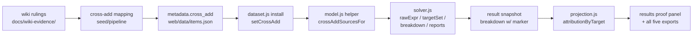
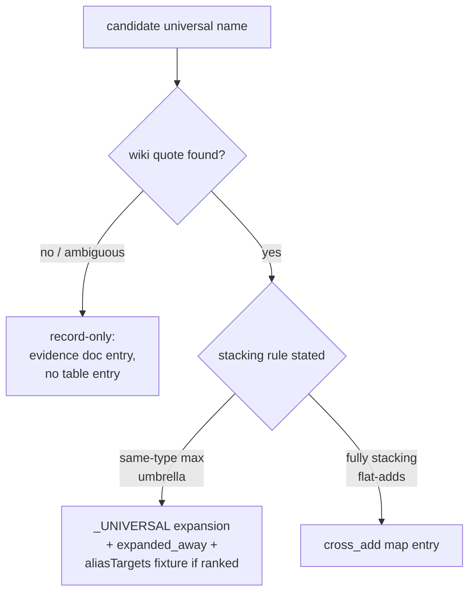

# Universal-Stat Cross-Add Crediting - Plan

---

## Goal Capsule

Give element-named priorities credit from universal stats that the wiki says fully stack — Universal Spell Power into element spellpowers (#291), universal lore into element lores (the open half of #290) — via a new cross-add mechanism, then sweep the remaining universal names (#292). Authority order: recorded wiki-evidence rulings in `docs/wiki-evidence/` > the three issue bodies > this plan. Stop conditions: a harvest result that contradicts a recorded ruling (surface it, do not reconcile silently); a golden diff that cannot be attributed to the cross-add; any temptation to make a bucketing change inside the expansion machinery (the recorded invariant says the expansion is wrong at that point). Tail: single PR, squash-merged, closes all three issues with evidence.

---

## Product Contract

### Summary

Add a solver/model cross-add: an element spellpower or lore priority also sums designated universal-stat buckets, while every bucket keeps its own per-(stat, bonus-type) max. Ship the dino-channel spelling normalization, the wiki-gated evidence work (solar-vs-artifact lore re-check, Spell Intensity, universal-name sweep), and receipts/exports coverage for the new crediting. The Potency expansion (already live from PR #294) is untouched.

### Problem Frame

A player ranking `Nullification` gets zero credit from 590 `Universal Spell Power` affixes and 500 set tiers, and a player ranking `Void Lore` gets zero from `Spell Lore`/`Universal Spell Lore` sources — even though the wiki states these universal stats add to every element ("Fully stacking. It flat adds to all of your other Spell Powers"). Crediting is exact-name, and the same-type expansion that fixed Potency is the wrong tool here: expansion would put fully-stacking sources into max-competition with the element sources they add to. This is the reported Solar-Gems gap (#290) minus its already-shipped Potency half.

### Requirements

Crediting mechanism:
- R1. An element-spellpower priority (the ten Potency targets: Combustion … Resonance) also credits `Universal Spell Power` buckets additively; no bucket merging — same-type USP sources still collapse to their highest among themselves.
- R2. An element-lore priority also credits `Spell Lore` and `Universal Spell Lore` buckets additively, per the recorded ruling that universal and element lore are distinct stats that both apply; the two universal lore names stay distinct from each other (same-item co-occurrence ruling).
- R3. Cross-added credit is attributed: the proof panel / Ranked Priorities receipts name the source stat, and the attribution flows through `web/projection.js` into all five exports (standing invariant: never solve-visible but share-invisible).

Data hygiene:
- R4. The `dino_sets` channel spells `Universal Spell Power` canonically; a per-channel guard keeps the misspelling from returning. (The live `membership_set_defs` def is already correct — this is pipeline hygiene, not a live-crediting fix.)

Evidence gates:
- R5. The quarantined solar-vs-artifact lore stacking claim is re-checked at the wiki; it ships only if stated outright, otherwise the general lore cross-add ships and the exception stays disclosed as unverified (quarantine note re-dated, not silently dropped).
- R6. Every remaining dataset stat whose wiki definition says all-spells/all-elements — at minimum `Spell Intensity`, `Elemental Spell Power`, `Greater Elemental Spell Power` — is classified with a verbatim wiki quote as expansion-shaped (same-type max umbrella → `_UNIVERSAL` table), fully-stacking (→ cross-add map), or record-only (quote absent or contrary → evidence doc entry, no table entry). No entry lands without its quote.

Verification and release:
- R7. An A/B fixture pair proves the cross-add arithmetic (element priority with universal gear in pool vs. the hand-summed expectation); golden drift is attributed per fixture and deliberately re-ratified.
- R8. The deploy bumps `?v=`, the footer BUILD, and the README build line together; the PR closes #290, #291, and #292 with closing keywords and evidence.

### Success Criteria

- The original report's scenario resolves: a Nullification/Void-Lore-ranked caster solve at ML 30+ now selects universal-stat sources (e.g. the Solar Gems) when they win, with receipts explaining the credit.
- Measured before/after per-target deltas at a representative ML (as #205 did: "Necromancy 26→31") recorded in the PR body.

### Scope Boundaries

- The Potency/Spell-DC same-type expansion is complete and untouched; no lore name enters `_UNIVERSAL` (recorded do-not-expand ruling).
- The Alchemical imbue column names (Inferno/Erosion/…) are recorded-not-expanded; do not re-litigate.
- #211 (automated umbrella-affix detector) stays open — this batch is the manual sweep it would automate. #293 (dino set defs bypass ability-umbrella expansion) is a sibling defect, not covered here.
- Deferred to follow-up work: none new — deferrals discovered during implementation get filed as issues before the PR merges, per the standing rule.

---

## Planning Contract

### Key Technical Decisions

- KTD1. **Cross-add is a new browser-side primitive at the shared bucket seam, not an expansion-table entry.** The expansion contract ("if the expansion seems to require a bucketing change, the expansion is wrong") rules the table out; the cross-add hooks where priorities map to buckets. (session-settled: user-approved — chosen over per-stat one-off crediting: one shared mechanism prevents drift across the five bucket-prefix call sites.)
- KTD2. **One helper, all call sites.** A single `crossAddSourcesFor(stat)`-shaped helper lives in `web/model.js` and is require-bridged into `web/solver.js` (the `equivType` pattern). Every site that filters buckets by the `stat||` prefix consults it: `rawExpr`, `breakdownByTarget`, `buildSaturationReport`, `buildCreditReport`, and the `targetSet` assembly in both `buildModel` and `buildProgram` (both must widen, or dominance prunes universal-only items and their buckets never exist).
- KTD3. **The mapping ships as dataset metadata** (a `cross_add` table emitted by the pipeline and installed at load through `web/dataset.js`, mirroring the `stacking_equivalence` install path) — chosen over a browser constant so the pipeline, its guards, and tests read the same table, and because `model.js`/`solver.js` deliberately never fetch metadata themselves.
- KTD4. **Attribution uses a marker field mirroring `via`.** Cross-added breakdown parts carry a marker naming the source stat; `projection.js attributionByTarget` forwards it exactly as it forwards `via`, so results and all exporters inherit. A cross-add is not an expansion — it does not get `via` receipts for free.
- KTD5. **Display semantics follow the game's summary screen.** Cross-added credit counts in the element priority's total (the wiki says element values shown in-game are final after universal is added). A player ranking both an element and the universal stat sees the universal contribution in both totals; receipts make the shared source visible. Caps/floors on an element stat now clamp element + universal, matching in-game values.
- KTD6. **Partial-ship on unconfirmable evidence.** A wiki claim that cannot be quoted ships as disclosed-unverified rather than blocking the batch; the never-infer rule still bars implementing the unquoted piece. (session-settled: user-approved — chosen over blocking the whole chain on one quote.)
- KTD7. **Sweep breadth is the full vocabulary.** Candidates are enumerated from the built dataset's stat names plus the wiki's spell-power/lore pages and each is harvest-verified in this batch. (session-settled: user-approved — chosen over verifying only Spell Intensity and filing the rest.)
- KTD8. **The dino spelling is fixed at the parser channel** by routing `src/dino_parser.py` stat names through the existing vocabulary synonym folds (`affix_synonyms_registry.json` already maps `Universal Spellpower` → `Universal Spell Power`) — chosen over the value-correction shard (values-only, wrong tool) and over widening `name_corrections` coverage (that channel's rot-guards assume planner records). The verbatim `raw` text stays untouched.

### High-Level Technical Design

Data flow of the cross-add, from ruling to export:

Sweep classification per candidate stat (U6):

### Assumptions

- The lore cross-add's target list (which element/named lore stats receive universal-lore credit) is derivable from the dataset's lore vocabulary cross-checked against the wiki Spell Lore page during U5; the exact roster is an implementation-time verification, not a new ruling.

---

## Implementation Units

### U1. Cross-add mapping: pipeline emission and browser install

**Goal:** A `cross_add` metadata table reaches the browser through the conventional load seam.
**Requirements:** R1, R2, R6 (the table is where sweep results land).
**Dependencies:** none.
**Files:** `src/spell_focus.py` or a new sibling module under `src/`, `build_dataset.py`, `web/dataset.js`, `web/model.js`, `tests/test_spell_focus.py` (or new `tests/test_cross_add.py`), `tests/dataset.test.js`.
**Approach:** Emit `metadata.cross_add` mapping each element stat to its universal source stats — the ten spellpower targets ← `Universal Spell Power`; the element-lore roster ← `Spell Lore`, `Universal Spell Lore`. Reuse the `SPELLPOWERS` constant; keep the wiki-quote justification in the owning module docstring as `_UNIVERSAL` does. Install at load via `web/dataset.js` mirroring `installStackEquiv`, into a `model.js` setter + `crossAddSourcesFor(stat)` helper with the Node require bridge.
**Patterns to follow:** `metadata.stacking_equivalence` emission (`build_dataset.py`) and its `dataset.js` → `model.js setStackEquiv` install; `_UNIVERSAL`'s docstring-quote convention.
**Test scenarios:**
- Happy path: built metadata contains the spellpower mapping (ten targets, one source) and the lore mapping (both universal names per target).
- Guard: emission refuses an empty map, and refuses a mapped stat name absent from the dataset vocabulary — per channel, not aggregate; prove each guard fails on corrupted input before trusting it.
- Browser: `crossAddSourcesFor` returns `[]` for unmapped stats and the installed sources for mapped ones; uninstalled state (no metadata) degrades to no cross-add, not a crash.

### U2. Solver/model crediting

**Goal:** Element priorities sum their own buckets plus cross-add source buckets, everywhere the solver reads a stat's value.
**Requirements:** R1, R2; cites KTD2, KTD5.
**Dependencies:** U1.
**Files:** `web/solver.js`, `web/model.js`, `tests/solver.test.js`, `tests/model.test.js`, `tests/parity/fixtures.json`, `tests/parity/capture_golden.js` (only if fixture shape needs it).
**Approach:** Widen `targetSet` in both `buildModel` and `buildProgram` with cross-add sources of every ranked/capped/floored stat. Extend `rawExpr` to also collect source-stat buckets (objective, stage locks, floors, `probeMax`, `readSolution` inherit). Extend `breakdownByTarget`, `buildSaturationReport`, and `buildCreditReport`'s prefix tests through the same helper. Stamp cross-added breakdown parts with the source-stat marker (KTD4's field, written here). Check the dominance comparator's surface still covers universal-stat values after `targetSet` widening — do not modify the shared dominance/bucketing seam itself (recorded narrow-control lesson).
**Test scenarios:**
- Happy path: element priority with one element item (Equipment 100) and one USP item (Implement 50) in pool → achieved value 150; two USP items same type → only the higher counts (max within the source bucket).
- Cross-stat stacking: USP Implement + USP Exceptional both count (different types add); element Equipment + USP Implement add.
- Lore: `Void Lore` priority credits `Spell Lore | Equipment` and `Universal Spell Lore | Exceptional` on the same solve; the ten Undying Age co-occurrence items still stack their two lore names (regression per the never-merge ruling).
- Both-ranked: ranking `Nullification` and `Universal Spell Power` yields consistent locks (no infeasibility) and each target's reported value includes the shared source per KTD5.
- Cap/floor: a user cap on an element stat clamps the combined element+universal value.
- Dominance: a USP-only item survives pruning when only an element stat is ranked.
- A/B golden fixture pair (R7): element-ranked fixture vs. hand-computed expectation, byte-stable across runs.
- Execution note: prove the new solver tests fail against the pre-change tree (copy generated data in first).

### U3. Receipts, projection, and exports

**Goal:** Cross-added credit is visible and labeled everywhere a solve is explained or shared.
**Requirements:** R3; cites KTD4.
**Dependencies:** U2.
**Files:** `web/projection.js`, `web/results.js`, `tests/projection.test.js`, `tests/attribution.test.js` or `tests/breakdown.test.js`, `tests/exporters.test.js`.
**Approach:** Forward the marker in `attributionByTarget` beside `via`; render it in the Ranked Priorities receipts and per-item why-this ("counted from Universal Spell Power"). Exporters read projection and inherit; verify the portable `ddo-loadout/v1` output carries the attribution unchanged.
**Test scenarios:**
- A solve snapshot with a cross-added part projects the marker into `attributionByTarget`, `whyThis`, and `itemContributions`.
- Markdown export byte-includes the source-stat label (the `spell-focus-receipts.test.js` end-to-end shape).
- A restored pre-cross-add snapshot (no marker fields) renders without error — no persistence migration, old solves display their own honest numbers.

### U4. Dino channel spelling normalization

**Goal:** No `Universal Spellpower` misspelling survives the build; the inert channel is consistent before anything ever consumes it.
**Requirements:** R4; cites KTD8.
**Dependencies:** none (parallel to U1–U3).
**Files:** `src/dino_parser.py`, `tests/test_*` (Python guard), `tests/dataset.test.js` (the #289 guard area).
**Approach:** Route parsed set-augment stat names through the vocabulary synonym folds; `raw` stays verbatim. Add a build guard asserting the canonical spelling only, scoped to the `dino_sets` channel, refusing to pass on zero records.
**Test scenarios:**
- Built `dino_sets` records carry `Universal Spell Power`; the guard fails when fed a record with the folded-away spelling (prove-fails), and fails on an empty channel.
- Test expectation: no solver-behavior change — assert the live `membership_set_defs` def is byte-identical before/after.

### U5. Harvest: lore quarantine re-check

**Goal:** The solar-vs-artifact lore claim is resolved or freshly disclosed; the lore cross-add's evidence trail is complete.
**Requirements:** R5; cites KTD6.
**Dependencies:** none to start; must complete before U7.
**Files:** `docs/wiki-evidence/spell-lore.md`, `docs/wiki-evidence/spellpower-universal.md` (cross-reference), plus U1's mapping if the outcome changes it.
**Approach:** Same-origin Chrome harvest per `docs/wiki-evidence/harvest-method.md`: re-try the Solar Gem item pages and the Sun/Moon augment page; ~1.5s pacing, strip `| = & ?`, tooltip-first on bundled templates. If the no-stack rule is stated outright, record it and design its minimal sound model inside the cross-add (constraint: reproduce the stated rule exactly or leave that piece disclosed). If still absent, re-date the quarantine note, ship the evidenced general rule, and state the residual in the coverage disclosure.
**Test scenarios:** Test expectation: none — evidence-doc work; any resulting code change lands under U1/U2's suites.

### U6. Harvest and sweep: remaining universal names

**Goal:** Every all-spells/all-elements candidate is classified with a quote; tables extended accordingly.
**Requirements:** R6; cites KTD7 and the classification flowchart.
**Dependencies:** U1 (map exists to receive entries); before U7.
**Files:** `src/spell_focus.py` (`_UNIVERSAL` additions), the U1 mapping module, `docs/wiki-evidence/` (new or extended entries), `tests/test_spell_focus.py`, `tests/parity/fixtures.json`.
**Approach:** Enumerate candidates from the dataset vocabulary (`Spell Intensity` + the ten element Intensities, `Elemental Spell Power`, `Greater Elemental Spell Power`, anything else whose wiki page says all-spells) and harvest each classification quote. Expansion-shaped entries follow the full #205 discipline: docstring quote, `expanded_away` emission, picker migration, and an `aliasTargets` fixture when a ranked name is expanded away (`Spell Intensity` is currently rankable — if it expands, its fixture must alias-resolve). Fully-stacking entries land in the cross-add map with their quote. Unquotable candidates get a record-only evidence entry.
**Test scenarios:**
- Each new `_UNIVERSAL` entry: expansion produces the element siblings at the same bonus type with `via` provenance (extend the existing family-table tests).
- Each new cross-add entry: covered by U1's mapping tests plus one U2-style crediting scenario.
- If `Spell Intensity` expands away: `migratePriorities` redirects it and the aliasTargets fixture resolves (harness throws if not).

### U7. Ratify, stamp, and ship

**Goal:** Green suites, attributed golden drift, correct build stamps, issues closed.
**Requirements:** R7, R8.
**Dependencies:** U1–U6.
**Files:** `tests/parity/golden.json` (regenerated), `web/index.html`, `web/app.js`, `README.md`.
**Approach:** Run the Python suite and the JS suite file-by-file; regenerate goldens via `tests/parity/capture_golden.js` only after attributing every per-fixture diff to the cross-add or a sweep entry (caster fixtures will drift — that is the fix landing); update the pinned fixture count if fixtures were added. Bump `?v=`, footer BUILD, and the README build line together. PR body: measured before/after deltas, `Closes #290`, `Closes #291`, `Closes #292`, with the U5 disclosure noted if the quarantine held.
**Test scenarios:** Test expectation: none beyond the suites themselves — this unit is verification and release mechanics.

---

## Verification Contract

- `python3 tests/run_tests.py` — full Python suite (guards, pipeline, build stamp).
- `for t in tests/*.test.js; do node "$t"; done` — JS suite strictly one file per invocation; the golden guard only runs this way.
- New-test proof: export the base commit to a scratch dir, copy the generated dataset in, copy the new tests over, confirm they fail.
- Guard proof: corrupt each new gate's input and watch it go red, then restore.
- Golden re-ratification is deliberate and per-fixture-attributed, never blanket-accepted.
- Browser smoke via localhost http server + Chrome: solve a Nullification+Void Lore caster at ML 32, confirm Solar Gems appear and receipts label the universal credit.

## Definition of Done

- All eight requirements satisfied; both suites green under the file-by-file discipline.
- Golden diff reviewed fixture-by-fixture with rationale recorded in fixture `note`s where fixtures changed.
- Evidence docs updated: every new table entry carries its verbatim quote; the quarantine is resolved or re-dated.
- `?v=` / footer BUILD / README bumped together (build-stamp test green).
- PR merged with closing keywords for #290, #291, #292; any newly discovered deferral filed as an issue before merge.
- No dead-end experimental code left in the diff.
