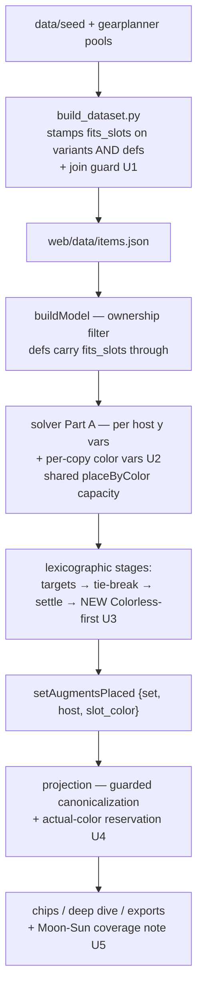

# Set Augments in Any Augment Slot - Plan

## Goal Capsule

- **Objective:** Close issue #316 — set-augment copies become placeable in any compatible augment slot a host exposes, not only literal Colorless slots, so builds whose best hosts expose only colored slots can be offered set-augment plans the game allows.
- **Product authority:** This Product Contract, then the wiki evidence in `docs/wiki-evidence/augment-sets.md`, then issue #316.
- **Open blockers:** None. The Moon/Sun eligibility question is deferred (see Scope Boundaries), not blocking.
- **Execution profile:** Single PR against `main`; every unit lands behind the full test suite; dataset regeneration means the change is live on deploy.
- **Stop conditions:** Stop and surface if the wiki re-check (U6) contradicts the placement warrant, if golden re-ratification shows a priority target regressing, or if the pinned post-stage cannot hold the settle contract.

## Product Contract

### Summary

Extend set-augment host eligibility and capacity accounting from literal-Colorless-only to the full multi-fit color matrix ordinary augments already use, with the consumed slot color attributed on every result surface and export.

### Problem Frame

The placement warrant is a verified chain: every Set Augment is a Colorless augment (`docs/wiki-evidence/augment-sets.md`, fact 2), and the wiki's slot-color matrix (`SLOT_ACCEPTS`) admits Colorless augments into every colored slot — the per-item description "Slotting this Augment in **any Augment Slot** will override its Set Bonus to the <X> set" (`docs/wiki-evidence/augment-sets.md:57`) corroborates but is not the basis, since the evidence file reads that sentence as suppression semantics. The built dataset already bakes `fits_slots` with all seven standard colors onto every set-augment record. The solver ignores that matrix: host eligibility counts only literal Colorless slots, the placement block is gated on a Colorless slot existing anywhere, and projection reserves capacity by decrementing a hardcoded Colorless count. The error is conservative — the solver under-uses set augments rather than fabricating placements — but a build whose best hosts expose only colored slots (e.g. the Gem of Many Facets' Green/Yellow) can never be offered a set-augment plan the game accepts, so some solves are provably suboptimal.

### Key Decisions

- **Reuse the baked multi-fit matrix as the single eligibility source.** The solver consumes the `fits_slots` already stamped on set-augment records at build time — the same matrix ordinary augments use — rather than a parallel eligibility list. (session-settled: user-approved — chosen over a set-augment-specific eligibility mechanism: the matrix is already the single source of truth and is already on the records.) The matrix is not yet readable at the solver's copy-build site — the set definitions the solver iterates carry no color, and the stat-less variant records that carry `fits_slots` are dominance-pruned from the augment pool — so the build must forward the matrix onto the definitions (R9); a JS-side color list would recreate the parallel eligibility list this decision rejects.
- **Moon/Sun slots stay ineligible until a rendered-tooltip wiki ruling confirms them.** The hub-page wording "any augment color slot" has not been verified against Lunar/Solar slots, and the baked matrix excludes Colorless augments from Moon/Sun. (session-settled: user-directed — chosen over following the hub-page wording as-is: the never-infer standing rule wins; the gap is disclosed and filed as follow-up.)
- **Tie-break placement prefers Colorless first.** When stat totals are identical either way, a copy consumes a free Colorless slot before a colored one, as the final deterministic stage of the lexicographic solve. (session-settled: user-directed — chosen over greatest-remaining-supply: a Colorless slot is the least reusable slot on an item, so consuming it first leaves the more broadly usable colored slots open.) The copy/host decision stays on the existing set-augment variables, which are already tie-break-minimized and settle-pinned; the consumed color rides on a separate per-copy variable excluded from the tie-break objective and left unpinned by the settle stage, so the final Colorless-first stage retains the freedom to act.

### Requirements

**Placement rules**

- R1. A set-augment copy may be hosted by any equipped item exposing at least one slot whose color accepts Colorless augments per the baked `fits_slots` matrix (the seven standard colors: Colorless, Red, Blue, Yellow, Orange, Green, Purple).
- R2. Each hosted copy consumes exactly one physical slot of a color its own host item exposes, sharing per-color capacity with ordinary-augment demand; a copy is never attributed a color absent from its host.
- R3. Moon/Sun slots are ineligible for set-augment copies until a rendered-tooltip wiki ruling confirms them.
- R4. On the primary loadout, when stat totals tie a copy lands in a free Colorless slot before a colored one; colored slots are used only when they enable a strictly better loadout. Alternatives re-solves skip the tie-break stage by design, so their placements carry no Colorless-first guarantee.
- R5. The shipped set-identity invariants are unchanged: at most three copies of a set augment overall, one copy per host item, and one set-bonus identity per item.

**Attribution and disclosure**

- R6. Every set-augment placement records the slot color it consumed, and every surface that names augment placements — loadout chips, deep dive, and all share exports — shows that attribution, flowing from the single projection source. Where the tie-break stage did not pin the color (every alternatives re-solve), the reported color is canonicalized once in the projection source, before ordinary-augment assignment, by the same Colorless-first rule applied against a running per-color ledger and only over colors the copy's host exposes with unreserved capacity; when no such recolor is feasible the solved color is reported unchanged — never a color absent from the host (R2), never a recolor that displaces an ordinary augment — and the canonical color, not the raw solver value, is what R7 reserves and every surface reports.
- R7. Post-solve slot reservation and open-slot accounting decrement the color the copy consumed, never a hardcoded Colorless.
- R8. The Moon/Sun exclusion is disclosed as a coverage note wherever placement-rule coverage is reported.

**Data and evidence**

- R9. The build stamps each set augment's baked `fits_slots` onto its emitted set definition (via the existing `SET_AUGMENT_PREFIX` join), so the solver reads the matrix at the copy-build site rather than a JS-side color list.
- R10. `docs/wiki-evidence/augment-sets.md` records the superseding placement ruling — the warrant (every Set Augment is Colorless; `SLOT_ACCEPTS` admits Colorless into every colored slot) and its date — superseding both loci that assert the old restriction: the Colorless-slot clause in confirmed fact 3 and the "Consumes 3 Colorless augment slots" modeling line, so no part of the evidence file reads as contradicting shipped behavior.

### Acceptance Examples

- AE1. **Covers R1, R6.** Given a winning host exposing only Green and Yellow slots and a set augment whose set advances the priorities, when the user solves, then the loadout hosts the copy in one of those slots and the receipt names the consumed color.
- AE2. **Covers R4.** Given a host with one free Colorless and one free Yellow slot and stat-identical placements, when the user solves, then the primary loadout shows the copy in the Colorless slot.
- AE3. **Covers R2.** Given a colored slot consumed by a set-augment copy, when ordinary augments are placed, then that slot is unavailable to them and totals reflect the shared capacity.
- AE4. **Covers R3, R8.** Given a host whose only augment slots are Moon or Sun, when the user solves, then no set-augment copy is offered on that host and the exclusion is visible in the coverage disclosure.
- AE5. **Covers R6, R2.** Given an alternatives re-solve where the host's Colorless slot is already consumed by an ordinary augment and the copy landed in a colored slot, when the placement is reported, then the copy keeps its solved color, no ordinary augment becomes unplaced, and the reported color is one the host exposes.

### Scope Boundaries

- Ordinary augment color rules and the baked matrix itself are unchanged.
- No new set-augment data harvesting; the 21 existing set augments and their definitions stand.
- The set-identity semantics shipped in PR #317 (#312) are untouched.
- **Resolved during implementation (U6, 2026-08-14 — no issue needed):** the Moon/Sun question closed without a follow-up. The Augment Slot page's rendered text rules Lunar/Solar slots out of the standard color system entirely ("will not interact with standard colored augments"), so R3's exclusion is confirmed correct rather than pending; the dated ruling lives in `docs/wiki-evidence/augment-sets.md`.

### Success Criteria

- The issue #316 repro shape solves correctly: a colored-slots-only host can carry a set-augment plan — with the set-augment family active, i.e. `ownedSetAugments` populated (Trove import), since the family is ownership-gated and an unpopulated gate passes the check vacuously.
- Existing set-augment tests (the U3–U5 suites) stay green with fixtures extended to colored-slot hosts; no golden currently pins a set-augment placement, so golden churn is expected to be nil or deliberately re-ratified.

### Sources

- `web/solver.js:436-497` — the current Part A block: the `presentColors.has("Colorless")` gate, the literal Colorless host filter, per-host caps, and the #312 one-copy constraint.
- `src/colors.py:54-81` — `SLOT_ACCEPTS` and `fits_slots`; Moon/Sun accept only their own color; `fits_slots("Colorless")` is the seven standard colors (asserted in `tests/test_colors.py:99-103`).
- Built records already carry the matrix: the `Set Augment: Alluring Elocution` record in the generated dataset has `fits_slots` = all seven standard colors.
- `web/projection.js:123-130` — reservation hardcodes a Colorless decrement (silently no-ops for a colored placement); ordinary augments use `slot_color`.
- `web/results.js:196, 222-228` — ordinary augments render "X in Y slot"; set-augment chips render no slot color today.
- `docs/wiki-evidence/augment-sets.md` — the standing set-augment rulings: the per-item "any Augment Slot" description (line 57) and, as of this work, the dated 2026-08-14 placement ruling that supersedes the earlier "3 Colorless augment slots" reading and rules Moon/Sun out (not pending).
- Color provenance chain: the pool key in `data/seed/compendium/raw/gearplanner_crafting.json` → `src/crafting_catalog.py:191-210` → `src/colors.py` annotation → `aug_color` + `fits_slots` on built records. `data/seed/compendium/augment_sets.json` defs carry no color field.
- `src/augment_sets.py` + `build_dataset.py` — the pipeline seam for R9: `SET_AUGMENT_PREFIX` joins each `Set Augment: <Name>` variant to its set, and the emitted defs are where `fits_slots` must land; a defs change regenerates the dataset, which makes the three-way build-stamp bump apply.
- `tests/solver.test.js:2300-2620` — the existing set-augment suites; every fixture host today is `["Colorless"]`.

---

## Planning Contract

Product Contract changed: Success Criteria only — the repro's ownership-gate precondition was stated; no requirement or scope changed.

### Key Technical Decisions

- **KTD1 — The matrix reaches the solver by stamping the defs at build time.** Instantiates the Product Contract's matrix-reuse decision (session-settled: user-approved) and R9. The stamp is a second consumer of `colors.fits_slots` via the existing `SET_AUGMENT_PREFIX` join — never hand-authored or re-derived — and must survive two seams: `buildModel`'s ownership filter copies defs by reference (verified), and `web/dataset.js`'s load-time normalizer must be confirmed not to touch the field (a Python stamp plus a JS normalizer on one field has diverged before, issue #90).
- **KTD2 — Per-copy color selection lives on new variables inside the existing Part A family.** For each (augment, host): color variables over the host's exposed colors ∩ the def's `fits_slots`, constrained to sum to the existing per-host copy variable; the color variables — not the copy variable — enter `placeByColor`, and the copy variable leaves the Colorless pool (leaving it in would double-book capacity). Host-binding (R2) falls out of defining color variables only over the host's own slots. The #312/#317 caps (one copy per host, ≤3 overall, single set identity) are re-derived over the unchanged per-host copy variables — the constraint shape does not fan out with colors. The fourth constraint in the current block — the per-host slot cap whose `n` counts literal Colorless slots — must also be re-derived: `n` becomes the count of host slots compatible with the def's matrix, or a colored-only host gets `n = 0` and every copy on it is forced to zero regardless of the widened gate. Solution extraction records the selected color as `slot_color` in `setAugmentsPlaced`.
- **KTD3 — Colorless-first is a pinned post-stage, never a tie-break coefficient.** Instantiates the tie-break decision (session-settled: user-directed) and R4, following `docs/solutions/design-patterns/add-a-solver-preference-as-a-pinned-post-stage.md` (issue #206: appending a var class to the shared tie-break objective reshuffled 5 of 11 goldens; the pinned post-stage measured zero churn). The new stage chains after `dropNoOpAugments`, pins everything the settle stage pinned **plus the settled placement outcome** (so it cannot re-add a no-op placement to buy a Colorless preference), carries `locks` forward, minimizes only the non-Colorless color variables, and falls back to the prior result on a non-Optimal solve. Alternatives paths are untouched by construction (`tieBreak:false`, no settle).
- **KTD4 — Attribution is canonicalized once, in the projection source.** Instantiates R6: a single deterministic, host-bounded pass producing a new canonical placement list that is the sole input to R7's reservation and every display/export surface (the craft-map read path included — chips and exports do not read the assignment path). The pass runs unconditionally — projection has no solve-path flag — and is idempotent on tie-broken primary solves. Its feasibility guard is a trial-assignment check: a recolor is accepted only when the full assignment re-run with it does not grow the unplaced set, which is what makes "unreserved capacity" account for ordinary-augment demand and not just other copies. Disclosure when the guard blocks a recolor: R4's blanket alternatives caveat suffices; no per-placement footnote (less display noise; revisitable on player feedback).
- **KTD5 — The defs-to-variant join gets a fail-closed build guard.** Beyond the issue's ask (confirmed at scoping): the guard asserts every emitted def joined a `Set Augment: <Name>` variant and carries `fits_slots`, raises naming the channel on a zero-record walk (per-channel vacuity, mirroring `set_def_orphans`), and reports the compared count. This also settles the failed-join question: an unjoined def is a build failure, not a silent fail-open or fail-closed branch at solve time.

### High-Level Technical Design

---

## Implementation Units

### U1. Stamp `fits_slots` onto the emitted set defs, with a join guard

- **Goal:** The matrix is readable at the solver's copy-build site; join drift fails the build.
- **Requirements:** R9; KTD1, KTD5.
- **Dependencies:** None.
- **Files:** `src/augment_sets.py`, `build_dataset.py`, `tests/test_augment_sets.py`.
- **Approach:** Copy each `Set Augment: <Name>` variant's baked `fits_slots` onto its def via the existing prefix join; add the guard alongside (fail-closed, per-channel vacuity, compared-count reporting). Confirm `web/dataset.js`'s load normalizer leaves the new field untouched. Declare the joined key/color strings as constants commented at both sites (representation drift has bitten three times).
- **Patterns to follow:** `set_def_orphans` in `src/enchantment_split.py` (named-channel vacuity guard); `build_dataset.py:767` (the variant-side stamp this mirrors).
- **Test scenarios:** Generated defs carry `fits_slots` equal to the joined variant's seven colors. Guard goes red when a variant is renamed/removed in a corrupted data copy and green after restore (clear `__pycache__` between cycles; corrupt the stamp and its source together, not one side). Vacuity: a zero-record channel raises naming the channel. Compared count equals 21. Load-path survival: the field is still present on defs after `web/dataset.js`'s load normalization (guards against a whitelist silently dropping the stamp, the issue #90 divergence shape).
- **Execution note:** Prove the guard fails before trusting it, and prove the new Python tests fail against the pre-change tree (copy the gitignored `web/data/` into the exported base tree first — a crash reads as a pass otherwise).
- **Verification:** `python3 tests/run_tests.py` green; regenerated dataset shows stamped defs.

### U2. Solver: per-copy color placement variables

- **Goal:** A copy can occupy any compatible slot color its host exposes, sharing real capacity.
- **Requirements:** R1, R2, R5; KTD2. Covers AE1, AE3.
- **Dependencies:** U1.
- **Files:** `web/solver.js`, `tests/solver.test.js`.
- **Approach:** Widen the family gate from literal-Colorless-present to any def-compatible color present. Per (augment, host): color vars over host colors ∩ `def.fits_slots` (skip host when empty), Σ colors = copy var, copy var ≤ host var; color vars enter `placeByColor` per color; **remove the copy var from the Colorless pool**. Keep the #312/#317 caps on the per-host copy vars; **re-derive the per-host slot cap** so its `n` counts the host's matrix-compatible slots rather than literal Colorless slots (unchanged, it zeroes colored-only hosts and makes AE1 infeasible). Extraction contract: keep `setAugMeta` (and therefore `setAugVars`) keyed on the copy var so the color vars stay out of the tie-break objective and settle pin sets — keying meta by the color var would silently disable U3; hold color vars in a separate map (color var → copy var + color); in extraction push a clone carrying `slot_color`, never mutating the shared meta object (an alternatives re-solve would otherwise leak its color into the already-returned primary result). Stamp `fits_slots` into the shared fixture helper (`tests/solver.test.js:2289` `augSetDef`) so the existing U3–U5 suites stay live rather than going inert.
- **Patterns to follow:** The ordinary-augment multi-fit encoding (`web/solver.js:337-391`); the existing Part A comment block for constraint documentation style.
- **Test scenarios:** Covers AE1 — a Green/Yellow-only host hosts a copy and `slot_color` names the consumed color. Covers AE3 — a colored slot consumed by a copy blocks an ordinary augment of that color (name the colored bucket directly; the existing test at `:2374` only proves the Colorless bucket). Host-binding: with aggregate supply elsewhere, a copy is never attributed a color its host lacks. Re-derived #312: a host with two compatible slots still holds one copy. Global Σ ≤ 3 unchanged. Deletion test: removing the copy-var-out-of-Colorless-pool line must turn a capacity test red, and reverting the per-host cap's `n` to the literal Colorless count must turn the AE1 test red.
- **Execution note:** Prove each new test red against the pre-change tree; assert on `buildModel(...)` output or end-to-end placement, never on `variantConflict`/`eligible()` — the defs path bypasses the eligibility pool.
- **Verification:** All solver suites green file-by-file; the golden suite consulted (see Verification Contract).

### U3. Solver: Colorless-first pinned post-stage

- **Goal:** Stat-equal ties on the primary loadout resolve to Colorless deterministically.
- **Requirements:** R4; KTD3. Covers AE2.
- **Dependencies:** U2.
- **Files:** `web/solver.js`, `tests/solver.test.js` (or a dedicated stage test file mirroring `tests/no-op-augments.test.js`).
- **Approach:** New final stage after `dropNoOpAugments` (~`web/solver.js:1438`): pin item/joker/member/copy vars and the settle stage's placement outcome, carry `locks`, minimize non-Colorless color vars, fall back to the prior result on non-Optimal. Do not touch the `encodeStage` tie-break objective.
- **Patterns to follow:** `dropNoOpAugments`'s pin-and-fallback tail; the #206 pinned-post-stage design doc.
- **Test scenarios:** Covers AE2 — free Colorless + free Yellow tie lands Colorless. Discriminator twin — a colored slot is chosen when strictly better (stops the first test passing vacuously against a solver that stopped placing copies). Settle preservation — the stage cannot increase total placements (a no-op placement is not re-added to buy a preference).
- **Execution note:** Expect zero golden churn per the #206 measurement; any golden diff is investigated, not blanket-accepted.
- **Verification:** Stage tests green; `tests/solver_golden.test.js` consulted locally.

### U4. Projection: actual-color reservation and guarded canonicalization

- **Goal:** Reservation and display agree on the consumed color on every path.
- **Requirements:** R2, R6, R7; KTD4. Covers AE3, AE5.
- **Dependencies:** U2 (U3 for the pinned-path idempotence case).
- **Files:** `web/projection.js`, `tests/projection.test.js`.
- **Approach:** Replace the hardcoded Colorless decrement (`web/projection.js:123-126`) with the copy's `slot_color`, defaulting a missing `slot_color` to Colorless — restored pre-change snapshots project without re-solving and could only have held Colorless placements; without the default, reservation no-ops and double-books the slot. Add the canonicalization pass per KTD4 as an exported helper producing a **new** canonical placement list (never mutating the persisted build/snapshot), run **unconditionally** (idempotent on tie-broken primary solves — projection has no solve-path flag to branch on), Colorless-first over host-exposed colors. The guard is a **trial-assignment check**, not a copy-only ledger: accept a candidate recolor only when re-running the assignment with it does not grow `unplaced` — a pre-assignment ledger sees only other copies and would steal a Colorless slot ordinary demand needs. Thread the canonical list into every read site — the assignment path and the craft-map path chips/deep-dive/exports read (`buildCraftMaps` and its call sites) — so reservation and display consume the same colors.
- **Test scenarios:** Covers AE5 — pre-consumed Colorless on an alternatives host: copy keeps its solved color, no ordinary augment becomes unplaced, reported color is host-exposed. Reservation decrements Yellow (not Colorless) for a Yellow placement. Idempotence: a tie-broken primary solve is unchanged by the pass. Feasible-recolor case: copy solved into Yellow with a genuinely free Colorless slot re-reports as Colorless and the reservation moves accordingly. Legacy snapshot: a restored build whose placements lack `slot_color` still reserves one Colorless slot per copy and produces no new `unplaced`. Display parity: the chip label and the reserved color match on an alternatives-path fixture.
- **Verification:** `tests/projection.test.js` green; no `unplaced` regressions in existing fixtures.

### U5. Display and exports: slot-color attribution and coverage disclosure

- **Goal:** Every surface names the consumed slot; the Moon/Sun exclusion is disclosed.
- **Requirements:** R6, R8; Covers AE1 (label half), AE4.
- **Dependencies:** U4.
- **Files:** `web/results.js`, `web/exporters.js`, `tests/breakdown.test.js`, `tests/attribution.test.js`, plus the export tests.
- **Approach:** Set-augment chips and deep-dive entries adopt the same "X in Y slot" convention ordinary augments use (`web/results.js:196`), sourced from projection; open-slot pips reflect actual consumption. The Moon/Sun coverage note is emitted from one predicate reading the dataset/solve state (never reconstructed from rendered output — the `boundNotice` incident), surfaced through the existing `coverageNote` channel (`metadata.augment_set_coverage` is already emitted by the build).
- **Test scenarios:** Chip label for a colored placement reads "in Green slot"; Colorless placement keeps today's shape. Covers AE4 — Moon/Sun-only host is offered nothing and the coverage note names the exclusion. Share exports (MD/CSV/print/`.gearset`) carry the same attribution — the exports-cover-all-new-mechanics invariant.
- **Verification:** All display/export suites green; a manual spot-check of one export shows the slot color.

### U6. Evidence, vocabulary, and closing

- **Goal:** The knowledge stores agree with shipped behavior and open work is filed.
- **Requirements:** R3, R10; Success Criteria.
- **Dependencies:** U1–U5 (lands with the same PR).
- **Files:** `docs/wiki-evidence/augment-sets.md`, `CONCEPTS.md`, `README.md`, `web/index.html`, `web/app.js`, this plan (Sources line-number re-anchoring).
- **Approach:** First run the one-hop wiki re-check of the `Lunar_and_Solar_Gems` hub neighborhood (the 2026-08-13 quarantine convention — the hub may state the Moon/Sun rule outright, resolving the deferral without a new harvest; browser-tab harvest only, ~1.5s pacing, strip `| = & ?`). Then: supersession edits at `augment-sets.md` lines 20 and 69 with the dated warrant (preserving fact 3's separate no-worn-gear-mixing claim and the four warrant-side Colorless mentions); update `CONCEPTS.md`'s stale "single Colorless 'Set Augment'" phrasing (line ~88) — the Multi-fit entry at ~line 70 already states this plan's invariant; file the Moon/Sun follow-up issue before the PR merges (Open-work rule) unless the wiki sweep resolved it; as a non-blocking observation, grep the sibling def channels (dino, membership) for the same Colorless-only assumption — a hit files its own separate issue rather than expanding or blocking this PR; bump the three-way build stamp (`?v=`, footer `BUILD`, README current-build line) — the dataset regenerates, so every solve changes on deploy.
- **Test scenarios:** Test expectation: none — documentation/evidence unit; `tests/test_build_stamp.py` enforces the trio mechanically.
- **Verification:** Evidence file reads consistently with shipped behavior end to end; follow-up issue number recorded in this plan's Scope Boundaries; build-stamp test green.

---

## Verification Contract

| Gate | Command / criterion | Applies |
|---|---|---|
| Python suite | `python3 tests/run_tests.py` | U1, U6 |
| JS suite, file by file | `for t in tests/*.test.js; do node "$t" || echo "FAIL $t"; done` — never `node a.js b.js` | U2–U5 |
| Golden ratification | `tests/solver_golden.test.js` locally; on a verified-improvement diff, `node tests/parity/capture_golden.js`, confirm per-fixture that no priority target regressed, commit `tests/parity/golden.json` | U2, U3 |
| Pre-change-tree proof | Export the base commit to scratch, copy the gitignored dataset in (`cp -R web/data <scratch>/web/` — `web/vendor` is tracked and already in the export), run the new tests there — each must fail (a crash is not a fail) | U1–U4 |
| Constraint deletion test | For each new LP constraint/stage, identify the line whose deletion turns a test red — the golden set is structurally blind to capacity bounds and post-stages | U2, U3 |
| Guard falsification | Corrupt the joined data (value and reference together) → guard red → restore → green | U1 |
| Build stamp | `tests/test_build_stamp.py` — `?v=` / footer `BUILD` / README agree | U6 |
| Repro | Issue #316 shape with `ownedSetAugments` populated: colored-only host receives a set-augment plan with slot attribution | U2, U4, U5 |

---

## Definition of Done

- All five acceptance examples are enforced by named tests; every suite green under the file-by-file runner; the golden baseline deliberately ratified (or verified unchanged).
- The PR body carries `Closes #316`; the Moon/Sun follow-up issue is filed (or resolved by the U6 wiki sweep) before merge, and its number is recorded in Scope Boundaries.
- `docs/wiki-evidence/augment-sets.md` and `CONCEPTS.md` agree with shipped behavior; this plan's Sources line anchors are re-checked after the evidence edit.
- The build-stamp trio is bumped and `tests/test_build_stamp.py` is green.
- No abandoned or experimental code remains in the diff.
