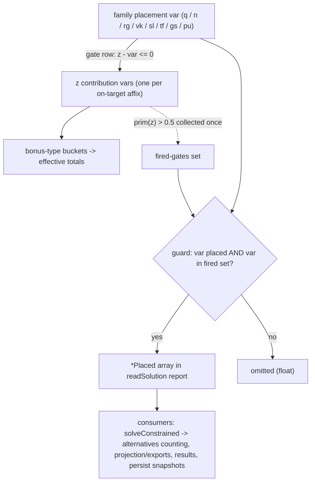

# Placed-Family Report Guards - Plan

## Goal Capsule

- **Objective:** Close issue #319 by adding a load-bearing report guard, with a deterministic report-layer test, to every one of the eight unguarded `*Placed` families in the solver's solution reader.
- **Product authority:** Issue #319 plus the standing rule in `docs/solutions/design-patterns/every-solver-family-report-needs-a-load-bearing-guard.md`; approach settled in the invoking session.
- **Execution profile:** Single PR, squash-merged, `Closes #319`. Behavior change on the live site (alternatives results and their counting), so the build-stamp trio bumps.
- **Stop conditions:** A golden diff that cannot be traced to a specific family's pre-existing phantom placement; any guard whose test cannot be proven red by mutation. Either is a blocker to surface, not to work around.

---

## Product Contract

### Summary

Retrofit load-bearing guards onto the eight `*Placed` families that `readSolution` still reports straight from the primal (`augmentsPlaced`, `dinoPlaced`, `ncPlaced`, `rollPlaced`, `vikPlaced`, `sealPlaced`, `tfPlaced`, `gsPlaced`), matching the three guards already shipped for jokers, memberships, and set augments. Every family gets a guard regardless of whether a float is currently reachable.

### Problem Frame

The solver has two solve paths, and neither disciplines every placement family. On the optimum path, the tie-break minimizes only joker, membership, and set-augment variables, and the settle stage drops only no-op ordinary-augment placements — the seven other craft families (Dino, Nightmare Crown, Roll, Vecna kit, seal, Thunder-Forged, Green Steel) are never minimized, so the LP solver may set one of their unconstrained placement variables to 1 opportunistically — a "float" — even on the optimum path. The alternatives path skips the tie-break and settle entirely for speed, so there every family, ordinary augments included, can float. A naive report then shows the player a phantom craft or placement that buys nothing: farm instructions for no benefit. This exact defect shipped three separate times (jokerPlaced, membershipPlaced, setAugmentsPlaced) before each family got a guard; eight families still report unguarded. Compounding the display risk, the fewer-crafts alternatives generator counts five of these same arrays to decide which alternative loadouts qualify, so a float can also distort which alternatives are generated and labeled — not just how results are displayed.

### Key Decisions

- **Blanket-guard all eight families rather than audit-first or a root fix on the alternatives path.** (session-settled: user-directed — chosen over guarding only families where a float is provably reachable, and over adding a minimization pass to the alternatives solve: reachability reasoning of this class has been wrong three times already, and the alternatives path's skipped tie-break is a deliberate performance win the product keeps.) The per-family audit still happens, but its job is to define each family's load-bearing condition — never to decide whether that family gets a guard.
- **Discipline lives at the report layer only.** The `tieBreak:false` solve path is untouched; floats may still occur in the primal, and the guard's job is to keep them out of everything the player sees or the generators consume.

### Requirements

- R1. Each of the eight families — ordinary augments, Dino, Nightmare Crown, Roll, Vecna kit, seal, Thunder-Forged, Green Steel — reports a placement only when that placement satisfies the family's defined load-bearing condition, on every solve path.
- R2. Each family's load-bearing condition is defined by a per-family audit answering: under what condition does this placement change the player's outcome? A family whose placements are structurally always load-bearing still gets its condition stated and its guard shaped accordingly.
- R3. Each guard has a deterministic report-layer test: feed the reader a primal where the family's variable is 1 and its load-bearing condition is false, and assert the report omits it. Tests target the guard, never the nondeterministic float itself.
- R4. The fewer-crafts alternatives generator's craft counting consumes only guarded reports, so floats cannot affect which alternatives are generated or labeled.
- R5. Each family's load-bearing definition is recorded in `docs/solutions/design-patterns/every-solver-family-report-needs-a-load-bearing-guard.md` alongside the three shipped guards, keeping the standing rule's catalog complete.
- R6. Golden fixtures are a triage surface, not a hard invariant: they are expected to pass unchanged, and any golden diff is investigated as a possible pre-existing optimum-path phantom placement in the seven never-minimized families — if confirmed, it is deliberately re-ratified with the reasoning recorded, never blanket-accepted and never treated as proof the guard is wrong.

### Acceptance Examples

- AE1. **Covers R1, R3.** Given a primal with a craft-family placement variable set to 1 whose placement contributes nothing its family's condition requires, when the reader builds the report, then that placement is absent from the family's `*Placed` array.
- AE2. **Covers R6.** Given the existing golden solver fixtures, when the full suite runs after the guards land, then every golden either passes unchanged or its diff is traced to a confirmed pre-existing phantom placement and deliberately re-ratified — a diff is a triage signal, not automatic proof the guard is wrong.
- AE3. **Covers R4.** Given an alternatives re-solve whose primal floats a craft variable, when the fewer-crafts generator counts crafts for that candidate, then the floated placement does not count toward the comparison.

### Scope Boundaries

- No changes to the alternatives solve path — no added stages, no epsilon objectives, no settle pass on `tieBreak:false` re-solves.
- No per-family "float not reachable, guard not needed" closure rulings; that half of #319's framing is superseded by the blanket-guard decision.
- No player-facing UI changes beyond the disappearance of phantom placements from results — alternatives, and any pre-existing optimum-path phantoms in the seven never-minimized families.
- Previously saved characters are out of scope: `web/persist.js` stores the placed arrays verbatim in snapshots and a restored character is never re-solved, so a pre-guard save that contains a phantom keeps it until the player re-solves. A read-time scrub cannot work — the snapshot lacks the primal the condition needs (confirmed with the user at plan scoping).
- Whether Thunder-Forged and Green Steel placements should join the fewer-crafts counting axis stays a deferred product question (they are excluded today); this plan guards their reports without changing the axis.

### Sources

- Issue #319 — the audit question and per-family method.
- `web/solver.js` — the eight unguarded report loops (~lines 1401–1418), the three guarded precedents directly below (~1429–1467), and the fewer-crafts craft counting (~1937–1945).
- `docs/solutions/design-patterns/every-solver-family-report-needs-a-load-bearing-guard.md` — the standing rule, the three prior instances, and the test-the-guard-not-the-float technique.
- PR #318 review — the setAugmentsPlaced guard this work generalizes from.
- `docs/solutions/workflow-issues/golden-solve-guard-missing-from-local-test-sweep.md` — why golden-green is not guard evidence (goldens exercise only the tie-break path).
- `docs/solutions/conventions/prove-a-test-fails-against-the-pre-change-tree.md` — the "wrong surface" failure shape the deterministic test seam avoids.

---

## Planning Contract

**Product Contract preservation:** unchanged from the reviewed requirements version, except two additions to Scope Boundaries (saved-snapshot exclusion; fewer-crafts axis deferral) confirmed at the plan scoping gate.

### Key Technical Decisions

- KTD1. **Blanket-guard all eight families.** (session-settled: user-directed — chosen over audit-first and over an alternatives-path minimization pass; inherits the Product Contract Key Decision of the same name.) Every unit below implements under this decision; no unit may close a family as "not reachable, no guard".
- KTD2. **One uniform load-bearing condition — "some gated contribution fired" — implemented by a shared helper.** All eight families deliver value exclusively through gated `z` contribution variables (`z - gate <= 0` rows emitted per gate in `encodeStage`); none feeds set thresholds or credits. A placement is therefore load-bearing iff some `z` it gates has `prim(z) > 0.5`. Precompute one `Set` of fired gate names by walking `program.zByBucket` (same traversal as `breakdownByTarget` and `buildSaturationReport`), then each family's guard is `prim(var) > 0.5 && fired.has(varOrItsValueVar)`. Because `effective` totals are computed from the same `z` values, the guarded report agrees with displayed totals on every solve path by construction. No family is an equality-forced tautology — all gates are `<=` rows — so no guard is vacuous.
- KTD3. **Ordinary augments join through the placement-identity variable.** The reported `augMeta` entries are per-color `p` variables, but value gates ride on the `pu` identity variables in `placeMeta`; the program stores no direct `p -> pu` link. Join by `variant_id`: report a `p` entry only when `prim(p) > 0.5` and some fired gate is a `pu` whose `placeMeta` entry carries the same `variant_id`. The `sum(p) = pu` equality row makes the join sound (p=1 implies its own pu=1; at most one pu per unique-equipped id can be 1).
- KTD4. **Deterministic test seam: export `readSolution` for tests.** (session-settled: user-approved — chosen over testing only through real `tieBreak:false` solves: HiGHS floats nondeterministically, so a solve-driven negative test can pass with the guard missing.) Add `readSolution` to the CommonJS `module.exports` block at the bottom of `web/solver.js` (test-only; the browser ignores it). Guard tests build a program with `buildProgram`, hand-craft a primal column map with the family var at 1 and its gated `z` values at 0, and assert omission. One additional integration test drives a real `tieBreak:false` solve mirroring the existing membership float test.
- KTD5. **Saved snapshots are not scrubbed.** (session-settled: user-approved — chosen over a best-effort read-time pass in `web/projection.js`: the snapshot carries placed arrays but no primal, so the fired-contribution condition is uncomputable there; the `canonicalSetAugments` precedent could at best drop host-less entries, which is a different defect.) New solves produce guarded output; stale saves self-heal on the next solve.
- KTD6. **Guards stay inline in `readSolution`, mirroring the three precedents; only the fired-gates computation is a helper.** The helper is a top-level `function` declaration in `web/solver.js` (browser shared-scope rules: no bare top-level `const` collisions across `web/*.js`; follow the `pinVarsAt`/`structuralPinNames` shape). Each family block keeps a prose comment naming the float mechanism, matching the comment style at the three shipped guards.

### High-Level Technical Design

Value gating and the guard, shared by all eight families (directional, not implementation specification):

The augment family differs only in which node carries the gate: the reported per-color `p` var joins the fired set through its `pu` identity var by `variant_id` (KTD3). Everything downstream of `readSolution` consumes the guarded arrays automatically — no consumer reads the raw primal.

### Sequencing

U1 -> U2 -> U3 -> U4; U5 after U2, parallelizable with U3/U4.

---

## Implementation Units

### U1. Fired-gates helper, test seam, and guards for the seven craft families

- **Goal:** `dinoPlaced`, `ncPlaced`, `rollPlaced`, `vikPlaced`, `sealPlaced`, `tfPlaced`, `gsPlaced` report only fired placements, with a deterministic red-proven test per family.
- **Requirements:** R1, R2, R3 (implements KTD2, KTD4, KTD6).
- **Dependencies:** none.
- **Files:** `web/solver.js` (helper + seven guard conditions in the report loops at ~1401–1418; `readSolution` added to `module.exports`), `tests/solver.test.js`.
- **Approach:** Add a top-level function that walks `program.zByBucket` once against a primal accessor and returns the set of gate names with a fired `z`. Rewrite each of the seven report loops from bare `prim(v) > 0.5` to also require the var in the fired set. Keep each family's loop and meta push otherwise unchanged; add the float-mechanism comment per block.
- **Execution note:** Test-first per family — write the omission test, watch it fail against the unguarded reader, then add the guard. After all seven land, mutation-check: disable one family's guard condition and confirm that family's test (and only that family's test) goes red.
- **Patterns to follow:** the three shipped guards at `web/solver.js:1423–1469` (precompute lookup, then `prim(var) > 0.5 && lookup` in the loop, prose comment above); fixture helpers at `tests/solver.test.js:18–70`; `pinVarsAt`/`structuralPinNames` for helper shape.
- **Test scenarios:**
  - Covers AE1. Per family (seven cases): program built from a minimal fixture with one craft option; primal sets the family var to 1 and all its gated `z` values to 0; the family's `*Placed` array omits the entry, and `effective` for the stat stays 0 (report and totals agree).
  - Per family positive arm: same primal with the gated `z` at 1 — the entry IS reported (guards must not over-drop; this arm also keeps the omission test non-vacuous).
  - Multi-affix family (dino or vik): var 1, one of two gated `z`s fired — entry reported (condition is "some z", not "all z").
- **Verification:** the seven new tests pass; each proven red against the pre-change tree (export base commit to a scratch dir, copy generated `web/data/items.json` in first); mutation check per family passes; `node tests/solver.test.js` green.

### U2. Ordinary-augment guard via the identity-variable join

- **Goal:** `augmentsPlaced` reports only per-color entries whose placement identity gates a fired contribution.
- **Requirements:** R1, R2, R3 (implements KTD3).
- **Dependencies:** U1 (fired-gates helper, test seam).
- **Files:** `web/solver.js`, `tests/solver.test.js`.
- **Approach:** Precompute the set of `variant_id`s whose `pu` var is in the fired set (walk `placeMeta`); the `augMeta` loop requires `prim(p) > 0.5` and the entry's `variant_id` in that set.
- **Execution note:** Test-first; then mutation-check the join specifically (drop the variant_id filter, confirm the U2 test goes red while U1 tests stay green).
- **Patterns to follow:** U1's guard shape; the `augByUnique` / unique-equipped comment at `web/solver.js:515` for why `variant_id` is the join key.
- **Test scenarios:**
  - Covers AE1. Primal with `p` = 1, its `pu` = 1, gated `z` = 0: entry omitted.
  - Positive arm: same with `z` = 1: entry reported with its color meta intact.
  - Two-augment case: one augment fired, one floated in the same solve — only the fired one reported (join keyed per `variant_id`, not globally).
- **Verification:** tests red-proven against pre-change tree; mutation check; `node tests/solver.test.js` green.

### U3. Alternatives-path integration test and counting assertion

- **Goal:** Prove the guards hold on the real float-prone path and that fewer-crafts counting consumes guarded output.
- **Requirements:** R4, R1 (covers AE3).
- **Dependencies:** U1, U2.
- **Files:** `tests/solver.test.js` (or `tests/alternatives.test.js` if the fixture fits better there).
- **Approach:** Mirror the shipped membership float test (`tests/solver.test.js:1834–1850`) in mechanism, but not in fixture shape: craft options whose stats are ranked but strictly redundant — each outvalued by a larger same-bucket source on a worn item — so the placement variables exist while their gated contributions stay 0 (an unranked-stat craft option mints no variables at all and cannot float). Solve via `solveConstrained(..., tieBreak: false)`; assert the craft families' `*Placed` arrays are empty. Add an assertion that `craftCount` (`web/alternatives.js:6–7`) over that solution is 0 — no generator-side change is needed or allowed (the generator already consumes `readSolution` output; a second guard there would be redundant).
- **Test scenarios:**
  - Covers AE3. `tieBreak:false` solve with idle craft capacity: all eight `*Placed` arrays empty; `craftCount` 0.
  - Fixture forces the float opportunity — spare capacity plus ranked-but-redundant craft stats (outvalued by a same-bucket worn source, per the `tests/no-op-augments.test.js` precedent) — so the test does not pass by HiGHS luck; floats must be made reachable, not hoped for.
- **Verification:** test red-proven against the pre-change tree (pre-guard, the floated placements appear). If HiGHS leaves the vars at 0 despite the reachable float — the outcome `tests/no-op-augments.test.js` documents for #206 — ratify the test as a pinning guard in that file's honest-scope style instead of treating it as a Stop Condition blocker; red-proof coverage is then carried by U1/U2's deterministic seam tests plus the mutation checks. `node tests/solver.test.js` and `node tests/alternatives.test.js` green.

### U4. Golden triage and build-stamp bump

- **Goal:** The full suite is green with any golden diff deliberately adjudicated, and the deploy carries the behavior-change stamp.
- **Requirements:** R6 (covers AE2).
- **Dependencies:** U1, U2, U3.
- **Files:** golden fixtures under `tests/` only if a diff is confirmed; `web/index.html` (`?v=128` on every script tag), `web/app.js` (`BUILD = "08142026.4"`), `README.md` (`**Current build:** 08142026.4`).
- **Approach:** Run both suites file-by-file. A golden diff is triaged per R6: trace it to a specific family's pre-existing optimum-path phantom; if confirmed, re-ratify with the reasoning recorded in the fixture's note field; if it cannot be traced, stop — that is a plan-level blocker, not a re-ratification.
- **Test scenarios:** Test expectation: none — this unit runs and adjudicates existing suites; `tests/test_build_stamp.py` enforces the stamp trio.
- **Verification:** `python3 tests/run_tests.py` green; `for t in tests/*.test.js; do node "$t"; done` green (file-by-file — never `node a.js b.js`); stamp test green with all three values agreeing.

### U5. Standing-rule doc catalog update

- **Goal:** The standing rule's guard catalog covers all eleven families so the next new family designs its guard in from the start.
- **Requirements:** R5.
- **Dependencies:** U2 (conditions final); parallelizable with U3/U4.
- **Files:** `docs/solutions/design-patterns/every-solver-family-report-needs-a-load-bearing-guard.md`.
- **Approach:** Extend the Context list (three instances → the #319 completion), record the uniform fired-contribution condition and the augment identity-join as shipped shapes alongside the three originals, and note the deterministic `readSolution` test seam as the now-preferred guard-test technique. Docs-only; no build stamp.
- **Test scenarios:** Test expectation: none — documentation.
- **Verification:** doc names all eight new conditions and the seam; cross-references stay valid.

---

## Verification Contract

| Gate | Command | Applies to |
|---|---|---|
| Python suite (incl. build stamp) | `python3 tests/run_tests.py` | U4 |
| JS suite, file-by-file | `for t in tests/*.test.js; do node "$t"; done` | U1–U4 |
| Prove-red | run each new test against the base commit exported to a scratch dir (copy `web/data/items.json` in first) | U1, U2, U3 |
| Mutation check | disable one guard's condition; only that family's test goes red | U1, U2 |
| Golden triage | any golden diff traced to a named family's phantom and re-ratified with a recorded note, or treated as a blocker | U4 |

---

## Definition of Done

- All eight families guarded in `readSolution`; the three pre-existing guards untouched.
- Every new test proven red against the pre-change tree; each guard mutation-checked.
- Full suites green; any golden re-ratification carries its recorded reasoning.
- Build-stamp trio bumped together (`?v=128` / `08142026.4` / README).
- Standing-rule doc catalog complete for all eleven families.
- No dead or experimental code in the diff; PR body says `Closes #319`.
