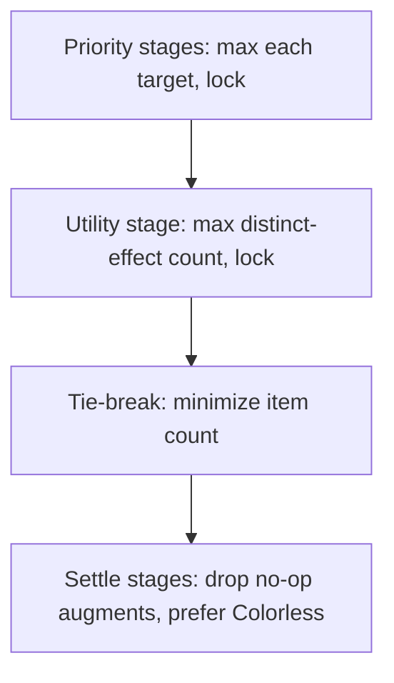
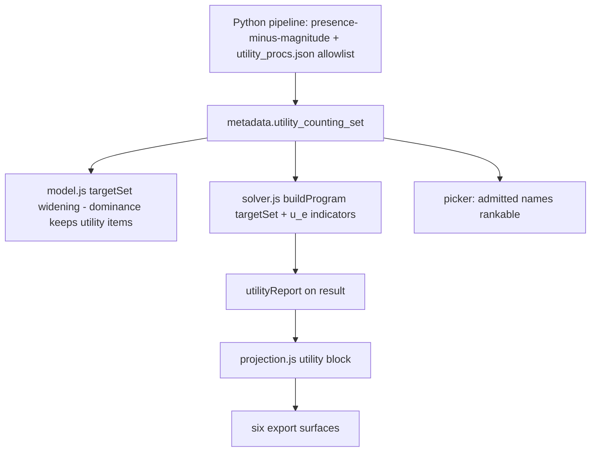

# Utility Tier - Plan

## Goal Capsule

- **Objective:** Close the #91 holistic-value remainder with a default-on, draggable "Utility effects" priority whose value is the count of distinct presence effects on the equipped loadout, plus a "more utility effects" Alternatives family.
- **Product authority:** Issue #91 and its comments; the fired measurement gate in `docs/plans/2026-08-02-002-feat-player-like-gearing-constraints-plan.md`; the session-settled Key Decisions below (hardened by a six-persona document review).
- **Authority hierarchy:** Product Contract > Planning Contract > per-unit Approach. The seven session-settled Key Decisions are closed; re-opening one requires the user.
- **Stop conditions:** Stop and surface rather than guess if (a) the perf gate in U3 fails its budget, (b) the untyped-proc review turns out not to be recordable from wiki evidence, or (c) any settled decision proves infeasible in the MILP encoding.
- **Execution profile:** Work lands through PRs, squash-merged; `main` deploys on push. New behavior tests are proven red against the pre-change tree (copy the gitignored `web/data/items.json` into the scratch export first). Goldens re-ratify deliberately, never blanket.
- **Tail ownership:** The final unit (U8) owns golden re-ratification, acceptance-example fixtures, success-criteria re-runs, the three-way build bump, and closing #91.
- **Product Contract preservation:** changed from the reviewed requirements version: R2 gained the pre-feature-save healing rule, R11 gained the generic-axes exclusion, R15 added (no bounds/credits on the tier row), Scope Boundaries gained the Browse-marking deferral — all confirmed in the plan scoping synthesis. Everything else is unchanged.

---

## Product Contract

### Summary

Add a **Utility tier**: a visible "Utility effects" entry that auto-appears at the bottom of the priority list, draggable and removable like any priority, valued as the count of distinct utility effects present on the equipped loadout. Effects come from the curated Bool presence vocabulary plus a one-time reviewed allowlist of untyped proc names, each worth exactly 1. A new "more utility effects" Alternatives family makes Echo-of-Whelm-shaped trades visible with no player action.

### Problem Frame

The shipped constraint levers (user caps, best-effort floors, ML floor default, redundancy finding) fixed most of #91's reports, and the prior plan's measurement gate said to build a holistic follow-up only if an expert-flagged residual survived them. It did, in two shapes.

First, presence-only value is invisible to the objective. A player using Echo of Whelm was told to swap to Calamitous Warhammer over a +1 Enhancement margin plus a +1 craftable — while Echo's three proc effects (stored as magnitude-less Bool presence) and Giant Bane (stored as an untyped magnitude) scored zero. Strict lexicographic priority takes +1 of a ranked stat over any quantity of unranked value, so the threshold for discarding an entire proc suite is one point. The wiki-honest data model is right; the answer is still wrong for the player.

Second, once a priority saturates there is no objective left at all. A single-priority solve at ML 34 fills 3 of 14 slots and leaves eleven literally empty — indistinguishable from the tool giving up. #91 collects five reports of exactly this shape, and the fewer priorities a player gives, the worse it gets: the simplest query produces the least explicable result.

Both shapes share a root: the solver has no notion of value beyond the ranked list. The ceiling disclosure and empty-slot invitation (shipped 2026-08-10) explain the behavior but do not change it.

### Key Decisions

- KD1. **The solver values procs — presence value enters the objective, not just the disclosures.** (session-settled: user-directed — chosen over disclose-only, over individually-ranked-procs-only, and over an always-below-everything tail: presence value must be able to win slots, not merely be explained away.)
- KD2. **It enters as a draggable, count-valued Utility tier — a true priority, not a weight.** (session-settled: user-directed — chosen over individual-proc ranking alone, an always-on tail tier, and a player-set exchange rate: a tier with a position in the ranked list is the only shape that lets procs outrank a marginal stat while keeping the lexicographic guarantee exact and inventing no magnitudes. Stats ranked above the tier can never lose a point; stats below it can — that is what dragging it means.)
- KD3. **On by default, at the bottom of the list.** (session-settled: user-directed — chosen over opt-in and over a default-plus-smart-nudge: the empty-sheet reports are most of the residual's felt pain, and a bottom-position tier fixes them by default at zero cost to any ranked stat. The Echo-shape rescue requires one drag.)
- KD4. **The counting universe is the curated Bool presence set plus a reviewed allowlist of untyped proc names.** (session-settled: user-directed — chosen over Bool-set-only and over count-everything-present: Bool-only misses the high-population untyped procs (Holy, Vampirism, Giant Bane and the other Banes); unreviewed counting violates exclude-until-verified. Each reviewed name is worth exactly 1; the initial review is a bounded pass over ~183 names with recorded dispositions. Note the marquee case straddles both halves: Echo's three named procs are Bool-typed and count via the curated set with no review needed — only its Giant Bane is untyped.)
- KD5. **The done bar is an Alternatives entry, not an inline callout.** (session-settled: user-directed — chosen over drag-away-is-enough and over an inline receipt callout: the Alternatives tab is the product's established surface for near-optimal trades; a "more utility effects" family shows the Echo trade with no player action and no new detection layer.)
- KD6. **Distinct effects count once.** (session-settled: user-approved — a second Ghost Touch adds nothing in game, so instances beyond the first are worth zero; this also keeps the count honest as a count.)
- KD7. **Reviewed proc names also become individually rankable.** (session-settled: user-approved — the review that admits a name to the counting universe is the same review that qualifies it for the picker, so a player who cares only about Vampirism can rank it outright; near-free byproduct.)

The stage chain the tier joins:

### Requirements

**The Utility tier**

- R1. A "Utility effects" entry auto-appears at the bottom of every newly created priority list, on by default; solves with it present end by maximizing the count of distinct utility effects, after every ranked stat above it is locked.
- R2. The tier is draggable to any position and removable, exactly like a ranked stat; stats ranked above it never lose a point to utility, and stats below it can. Within an existing list — including one restored from a saved character — player removal and dragged position persist; the tier re-seeds only when the player re-adds it or starts a new list. A pre-feature saved character (one saved before the tier existed, detected by a save marker) restores with the tier appended at the bottom — "never had it" heals; "player removed it" persists.
- R3. The tier's value is the count of **distinct** present effects — a duplicate of an effect already present contributes zero.
- R4. Solves remain deterministic: the same query returns the same loadout, including the utility-filled slots.

**The counting vocabulary**

- R5. Every name in the curated Bool presence vocabulary that passes the presence-minus-magnitude test counts 1 when present on the equipped loadout. The four dual-nature names that also carry a real rankable magnitude (Deception, Smoke Screen, Protection from Evil, Underwater Action) are excluded from the utility count — their value is already expressible as a ranked stat.
- R6. An untyped proc name counts only after a recorded review admits it; unreviewed names count zero and remain excluded (exclude-until-verified holds).
- R7. The initial review pass covers the current untyped proc population, with a per-name disposition (admit / exclude, with reason) recorded in the evidence store; Giant Bane and the high-population names (Holy, Vampirism, Chilling, Maiming, the Bane family) are in the first batch. (Echo's three Bool procs — Whelming Shockwave, Blunt Trauma, Lesser Boneshatter — already count via R5 and need no review.) The admission mechanism is reusable: after any dataset rebuild, untyped proc names with no recorded disposition are surfaced by the build (mirroring the umbrella-detector pattern), so new content cannot silently accumulate zero-counted procs.
- R8. Names admitted by the review join the rankable-affix picker as individually rankable presence effects.

**Surfaces and receipts**

- R9. The Utility tier renders in results as a priority row with receipts: which effects are present, each attributed to the item that carries it. When an effect is present on more than one equipped item, the receipt credits one item by a deterministic, stated rule (the specific tie-break is chosen in planning), so the attribution is stable and explainable. When zero utility effects are present, the row states that plainly rather than rendering an empty receipts list.
- R10. Utility flows through the projection layer into every export (Markdown, CSV, print, `.gearset`, portable JSON) like any other priority — solve-visible but share-invisible is not acceptable.
- R11. The Alternatives tab gains a "more utility effects" family: loadouts that trade a bounded amount of ranked-stat value for strictly more utility effects, with the trade stated per the existing alternatives idiom. The Utility tier participates in Alternatives only through this dedicated family — it is excluded from the generic rebalance/unranked/crafts axes even when dragged mid-list.
- R12. The empty-slot invitation fires only for slots the Utility stage still leaves empty.

**Compatibility and disclosure**

- R13. The change ships with the standard three-way build bump, and golden fixtures are re-ratified deliberately — every existing query visibly gains gear on re-solve, and that is the intended behavior, not drift.
- R14. Restored saved characters are not re-solved; they change only when the player re-solves.
- R15. The Utility row carries no per-priority Advanced controls in v1 — no caps, floors, or declared credits on the tier itself; the panel is suppressed for that row. Re-adding a removed tier happens through the existing add-a-priority affordance, where "Utility effects" is offered as a first-class entry.

### Acceptance Examples

- AE1. **Echo of Whelm, default settings.** **Covers R1, R11.** Given the ML9 warhammer report inputs with the Utility tier at the bottom: Calamitous Warhammer still wins the slot (+1 Charisma is ranked above utility), and the Alternatives tab shows an entry where Echo of Whelm takes the slot, stating the ranked-stat cost and the utility gained.
- AE2. **Echo of Whelm, tier dragged up.** **Covers R2.** Given the same inputs with Utility dragged above Charisma: Echo of Whelm wins the slot, and Charisma reports the -1 its position now permits.
- AE3. **Single-priority saturation.** **Covers R1, R4.** Given a one-priority query whose stat saturates on 3 slots: the remaining slots are filled with utility-carrying gear instead of left empty, and re-running returns the identical loadout.
- AE4. **Duplicate effect.** **Covers R3, R9.** Given two equippable items each carrying Ghost Touch: equipping the second adds zero to the Utility count, and the receipts attribute the effect once, to the item the stated attribution rule selects.
- AE5. **Unreviewed name.** **Covers R6.** Given an untyped proc name not yet reviewed: it contributes zero to the count and does not appear in Utility receipts.

### Success Criteria

- Re-running the Echo of Whelm report reproduces AE1 and AE2; the reply to that player is the AE1 Alternatives entry.
- Re-running the five empty-sheet report inputs produces full (or near-full) character sheets with the tier at its default position.
- #91 closes on this ship, citing both re-runs.

### Scope Boundaries

**Deferred for later**

- Proc magnitudes, proc rates, and uptime valuation — filed as #331; the tier deliberately counts presence, not power. (#214 is the adjacent-but-distinct data-fidelity issue: numeric affixes stored flat that are secretly conditional or ramping.)
- Set-tie alternatives (same set value at higher piece cost) — stays #240.
- Any smart-nudge detection surface ("X lost by 1 — drag Utility up") and inline receipt callouts — declined in session; revisit only if the Alternatives family proves undiscoverable.
- Marking counted-vs-excluded effects in the Browse view — a discoverability polish, same posture as the smart-nudge deferral; revisit on user reports.

**Outside this product's identity**

- Exchange-rate or weighted valuation of procs against ranked stats — the weighted-sum non-goal stands; position in the list is the only exchange mechanism.

### Dependencies / Assumptions

- Untyped proc names are readable per-item from the gear-planner structural data — verified: `Giant Bane` appears as `{type: null, value: '3'}` on planner records and in `web/data/items.json`.
- A distinct-count objective is expressible in the existing MILP machinery — verified: the `extraVars`/`extraConstraints` seam plus per-effect indicator binaries gated on carrier contributions (details in the Planning Contract).
- Affix values in the dataset are strings (`'1'`, `'3'`); counting-set derivation must not assume ints.
- The distinct-effect universe at the five reports' MLs is dense enough to fill (or nearly fill) empty slots — probed cheaply in U8 before final verification.

### Sources / Research

- Issue #91 (all three comments) — the product authority.
- `docs/plans/2026-08-02-002-feat-player-like-gearing-constraints-plan.md` — the measurement gate this plan answers; the keep-provable-optimal decision this plan preserves.
- `docs/plans/2026-08-10-002-feat-saturation-and-empty-slots-plan.md` — the eleven-empty-slots analysis and the shipped disclosure surfaces this plan builds past.
- `docs/solutions/design-patterns/lexicographic-redundancy-is-not-a-bug.md` — why the redundancy half needs no solver change; bounds what this plan may touch.
- `docs/solutions/design-patterns/add-a-solver-preference-as-a-pinned-post-stage.md` — consulted and ruled out for the stage itself (it governs preferences over equally-scoring solutions; the tier can win slots, so it is a true stage); its pin-granularity checklist governs the settle-stage composition.
- `web/dataset.js` (presence vocabulary and noise gate, ~635-680), `web/solver.js` (stage chain ~1675-1745, tie-break ~1102-1121, extraVars seam ~256), `web/results.js` (~691, ~767), `web/wizard.js` (priorities editor ~1612-1735, restore ~2103-2159) — current-state anchors.

---

## Planning Contract

### Key Technical Decisions

- KTD1. **The tier rides `state.priorities` as a sentinel entry and solves as a true lexicographic stage.** The stage loop special-cases the sentinel: instead of `objectiveStat`, it maximizes `objTerms` = Σ of per-effect indicator binaries, then locks the achieved count (`>=`, since indicators have no downward pressure) as a raw `extra` constraint carried into every subsequent solve (locks speak only `effectiveExpr(stat)`; a non-stat lock needs the `extra` channel — per-call only, never mutated onto the shared program). The sentinel is never fed to `effectiveExpr`, `visibleGateSet`'s stat universe, `probeMax`, the caps/floors machinery, or the tie-break fallback's `objectiveStat` (which uses `targetList.at(-1)` — with the sentinel last, the fallback re-targets the last non-sentinel stat). The sentinel token is named at implementation time with a test guarding it against collision with any dataset affix name, picker vocab entry, or alias key. (session-settled: user-directed — instantiates KD2; the pinned-post-stage pattern is ruled out because it governs preference-over-equal-scores and the tier can win slots.)
- KTD2. **Distinct count = one binary `u_e` per canonical effect name, gated across every channel.** For each counting-set name, `u_e − Σ(carrier contribution gates in the effect's buckets) ≤ 0` — worn affixes, augments, crafting picks, and set tiers all gate it, consistent with bucket semantics. The binary ceiling makes duplicates worth zero (R3 falls out of the encoding); no per-bucket instance counting. (session-settled: user-approved — the every-channel-counts scoping decision.)
- KTD3. **The counting set is build-stamped metadata, and its names widen `targetSet` in `model.js` and `solver.js` in lockstep — conditionally.** Authority: `metadata.utility_counting_set` = (presence-minus-magnitude Bool names) ∪ (admitted untyped names), derived in the Python pipeline so app and Python tests agree (the repo's precedent for `rankable_affixes`). The widening must land in both `buildModel`'s widening site (`web/model.js` ~638-652) and `buildProgram`'s (`web/solver.js` ~183-192) — **without the model-side widening, the dominance pre-filter prunes utility-only items before the solver ever sees them.** The widening fires **only when the sentinel is present in the query's targets**: a tier-removed or pre-feature query rebuilds the exact pre-feature pool, so the A/B fixture can pin byte-identity and pre-U8 goldens stay green through U3's merge. Plumbing: the counting set is passed into `buildModel` as an argument (available at every call site from the in-scope dataset), stored on the returned model, and read by `buildProgram` from the model — never carried on the persisted query. Call sites to thread: `web/query.js`, both `buildModel` sites in `web/wizard.js`, and `tests/parity/capture_golden.js` (an unthreaded capture would silently solve with zero indicators). This is the single most load-bearing implementation constraint in the plan.
- KTD4. **The untyped-proc review gets its own shard and gate — `src/untyped_rankable.py` is the pattern, not the vehicle.** That module's candidate rule requires a non-Weapon slot, deliberately excluding the proc population this review targets; widening it would make the two gates' stale-checks fight. New module + `data/seed/compendium/utility_procs.json` with `allow`/`quarantined` entries (each carrying name, evidence, reason), an `assert_adjudicated`-style build gate that fails on any un-dispositioned candidate, refuses to inspect zero candidates, and flags stale entries. Admitted names feed the counting set (KTD3) and a **presence-path picker entry** — suggest + presence sets, on/off badge, no Advanced credit/bound controls — NOT `metadata.rankable_affixes`, which would hand Holy/Vampirism the declared-credit control `web/dataset.js` explicitly warns against and break the presence-minus-magnitude test for those very names.
- KTD5. **The settle stages re-inject the utility lock.** `dropNoOpAugments` and `preferColorlessSetAugments` currently build `extra` = pins only; both gain the utility count lock so settling can never strip a utility-carrying placement the stage just chose. Pin classes follow the pinned-post-stage doc's checklist.
- KTD6. **Utility receipts ship as a dedicated plain-JSON report on the result, guarded and deterministic.** A `utilityReport` (effects present, each with its credited carrier) computed at solve time, added to `persist.js` `RESULT_KEEP` so restored characters render without re-solving (R14). Attribution credits the first carrier in the tie-break's item order (lowest x-index) — deterministic and stated (R9). The report applies the load-bearing guard discipline: an effect appears only when its indicator is genuinely load-bearing, verified on the `tieBreak:false` alternatives path too (the floated-var hazard). The render distinguishes **report-absent from count-zero**: a healed pre-feature restore has a Utility row in its priority list but no `utilityReport` in its snapshot — that state suppresses the row (or renders a "re-solve to compute utility" note), never the zero-state sentence, which would be a false claim about an unknown count.
- KTD7. **The Alternatives family follows the `unranked` generator shape, and the generic families protect the count.** Re-solve with the utility `objTerms` maximized, ranked targets locked exact then relaxed via the existing `alternativeGive` bound (max(2, 10%)); surface only when the count strictly exceeds the optimum's. The sentinel is excluded from the generic rebalance/unranked/crafts generators' target iteration AND from all four lock-construction sites (a sentinel lock renders to empty terms and is silently skipped, not an error) — instead, generic-family re-solves thread the KTD1 count lock via the `extra` channel whenever the sentinel ranks at or above the positions that family's lock idiom protects, so a set trade can never silently shed every utility effect the player ranked for. New branches in `analyzeAlternative` tag/gainText and `rankAlternatives` `typeOrder`. (session-settled: user-approved — the generic-axes exclusion.)
- KTD8. **Save healing via a marker.** Post-feature saves stamp a marker in inputs (e.g., `utility_tier_aware: true`); on load, a save without the marker gets the sentinel appended at the bottom (heals the pre-feature population, which is exactly the empty-sheet reports); a marked save restores verbatim, so explicit removals persist. The load-path rewrite lives beside the existing `migratePriorities` machinery. (session-settled: user-approved — the heal-old-saves scoping decision.)
- KTD9. **Golden fixtures gain the tier, mirroring healed restores, plus one A/B pair.** All existing fixtures re-capture with the sentinel appended (matching what a restored real query solves); one new fixture pair pins tier-present vs tier-removed (the #110 blocklist-pair precedent). The fixture-count assert bumps with a dated comment. Re-ratification is per-fixture deliberate.
- KTD10. **A measured perf gate guards the widening.** Widening `targetSet` by the counting set (~800 presence names) materializes buckets and indicator vars in every sentinel-present solve. U3 measures cold-solve time on the golden fixture set — baseline unmodified vs "after" with the sentinel appended to each fixture's targets (otherwise conditional widening makes the comparison solve the identical un-widened program twice and the gate passes vacuously); budget: median solve stays under 2× baseline. Over budget → stop and surface; the real lever is **trimming or tiering the counting set** (admit a curated high-value subset first, widen in measured batches) — lazy indicator minting is already the base encoding and saves nothing.

### High-Level Technical Design

Counting-set fan-out — one authority feeding four consumers:

### Assumptions

- The counting set's size (~800 Bool names + admitted untyped) is tolerable for model size under the KTD10 gate; the fallback (lazy indicator minting) is designed but not built unless the gate fails.
- The wizard's existing drag/remove/persist machinery generalizes to the sentinel row with only the Advanced-panel suppression (R15) and add-affordance special cases.

---

## Implementation Units

### U1. Counting-set pipeline and the utility-procs gate

**Goal:** The build stamps `metadata.utility_counting_set` and enforces the reusable untyped-proc review gate.

**Requirements:** R5, R6, R7 (mechanism), R8. Implements KTD3, KTD4.

**Dependencies:** none.

**Files:** `src/utility_procs.py` (new), `data/seed/compendium/utility_procs.json` (new), `build_dataset.py`, `src/` metadata assembly, `web/dataset.js` (consume stamped set for picker/vocab), `tests/test_utility_procs.py` (new), `tests/test_vocabulary.py`.

**Approach:** Derive the Bool half as presence-minus-magnitude at build time (the stamped set is authoritative; the client consumes it — a parity test guards the JS predicate against drift if any copy remains; the four dual-nature names fall out). Candidate rule for the untyped half: untyped names with proc shape on weapon/off-hand slots — the population `untyped_rankable.py` excludes. Gate mirrors `assert_adjudicated`: SystemExit on un-dispositioned candidates, refuse-zero-candidates per channel, stale-entry detection. Admitted names flow into the counting set and a **presence-path picker entry** (suggest + presence sets, on/off badge, no Advanced controls) — never `rankable_affixes` (KTD4; the declared-credit defect).

**Patterns to follow:** `src/untyped_rankable.py` + `tests/test_untyped_rankable.py` (shard shape, gate tests); `docs/solutions/design-patterns/turn-a-silent-crediting-bug-class-into-an-exhaustive-build-gate.md`; `docs/solutions/conventions/exclude-until-verified-data-gates.md`.

**Execution note:** Prove the gate fails before trusting it — corrupt a disposition, watch it go red per channel, restore.

**Test scenarios:**
- Happy: the stamped set contains a known Bool presence name (Ghost Touch) and excludes the four dual-nature names.
- Happy: an `allow`-dispositioned untyped name enters the counting set and `rankable_affixes`.
- Edge: a `quarantined` name is absent from both, and its entry carries a reason (Covers AE5 at the pipeline layer).
- Error: an un-dispositioned candidate fails the build by name.
- Error: the gate refuses to inspect zero candidates over a non-empty vocabulary.
- Edge: a stale allow entry (name no longer a candidate) fails the build.

**Verification:** `python3 tests/run_tests.py` green; corrupted-input red-run observed; `metadata.utility_counting_set` present in a fresh `web/data/items.json`.

### U2. First-batch untyped-proc review

**Goal:** The ~183 untyped proc names carry recorded dispositions; the first batch (Giant Bane, Holy, Vampirism, Chilling, Maiming, the Bane family) is admitted or excluded with evidence.

**Requirements:** R7. Implements KTD4's data half.

**Dependencies:** U1.

**Files:** `data/seed/compendium/utility_procs.json`, `docs/wiki-evidence/utility-procs.md` (new).

**Approach:** Give the first-batch names (Giant Bane, Holy, Vampirism, Chilling, Maiming, the Bane family) genuine evidence-backed rulings — item context plus wiki tooltips where needed (same-origin browser harvest, paced). Disposition vocabulary: admit (player-felt effect) / exclude (flavor, sentence line, non-effect) / **quarantined with reason "unreviewed"** — every candidate outside the first batch bulk-quarantines (the `untyped_rankable.json` precedent), so U1's zero-un-dispositioned gate is satisfied without evidencing all ~183 names. Record per-name evidence for real rulings in the shard; summarize in the evidence doc.

**Patterns to follow:** `docs/wiki-evidence/` ruling docs; the harvest method (`docs/wiki-evidence/harvest-method.md`) if wiki checks are needed.

**Test scenarios:** Test expectation: none — data review; U1's gate is the enforcement (every entry admitted here must pass its shape checks).

**Verification:** Build green with zero un-dispositioned candidates; evidence doc records the batch's rulings; Giant Bane admitted.

### U3. Solver: the Utility stage

**Goal:** The sentinel priority solves as a true lexicographic stage maximizing the distinct-effect count, deterministically, at acceptable cost.

**Requirements:** R1 (solve half), R2 (position semantics), R3, R4. Implements KTD1, KTD2, KTD3 (widening), KTD5, KTD10.

**Dependencies:** U1.

**Files:** `web/solver.js`, `web/model.js`, `web/query.js`, `web/wizard.js` (buildModel call sites), `tests/solver.test.js`, `tests/constraints.test.js`.

**Approach:** Thread the counting set per KTD3 (buildModel argument → model field → buildProgram; call sites: `web/query.js`, both wizard sites — capture harness threading lands in U8). Union it into `targetSet` in `buildModel` and `buildProgram` **only when the sentinel is in the query's targets** (lockstep — the dominance trap; conditional — the byte-identity requirement). Mint one `u_e` binary per counting-set name present on any eligible variant, gated `u_e − Σ(contribution z vars in the effect's buckets) ≤ 0` (z vars, not raw gate binaries — each z already ANDs its own gates; all channels count). Stage loop: on the sentinel, solve `objTerms` max over the `u_e` set, read the achieved count, append the `>=` lock as an `extra` constraint threaded through subsequent stages, the tie-break, and both settle stages (KTD5). Sentinel position in `targets` decides which stats are locked before/after it. Exclude the sentinel per KTD1's list (including the tie-break fallback). Measure the KTD10 perf gate: baseline fixtures unmodified vs sentinel-appended.

**Patterns to follow:** the stage chain (`solveLexicographic` ~1675-1745); the `extraVars`/`extraConstraints` seam (~256); the Bool soundness tests (`tests/solver.test.js` ~155-195) — the "non-target boolean never perturbs the optimum" test is the template for the tier-removed case.

**Execution note:** Prove the new stage tests red against the pre-change tree (copy `web/data/items.json` into the scratch export first, or the crash reads as a pass).

**Test scenarios:**
- Happy: single-priority saturated fixture — slots fill with utility gear; identical loadout on re-run (Covers AE3).
- Happy: tier at bottom — every ranked stat's value matches the tier-absent solve exactly (lexicographic soundness; the guarantee).
- Happy: tier dragged above a low stat — utility can win a slot at that stat's expense, stats above unchanged (Covers AE2 shape, synthetic fixture).
- Edge: two items sharing an effect — count increments once (Covers AE4 count half).
- Edge: an effect reachable only via an augment or set tier still counts (every-channel gate).
- Edge: tier removed — solve is byte-identical to pre-feature behavior.
- Error: a counting-set name absent from every eligible variant mints no indicator and breaks nothing.
- Integration: the settle stages preserve the locked count (a no-op-augment drop cannot strip a counted effect's only carrier).
- Perf: golden-set median cold-solve within the KTD10 budget; record numbers.

**Verification:** All solver test files green individually; perf numbers recorded in the PR; prove-red run documented.

### U4. Wizard: seeding, persistence, healing

**Goal:** The tier auto-seeds, drags, removes, persists, re-adds, and heals pre-feature saves.

**Requirements:** R1 (UI half), R2, R15. Implements KTD8.

**Dependencies:** U3 (sentinel semantics); **merge sequenced after U5, U6, U7** — default-on seeding is the user-visible flip, and `main` deploys on push, so U4 landing before the render/export/alternatives surfaces would put "solve-visible, share-invisible" live (the exact state R10 forbids). Code-review earlier is fine; merge last before U8.

**Files:** `web/wizard.js`, `web/persist.js`, `tests/wizard.test.js`, `tests/persist.test.js`.

**Approach:** Seed the sentinel at new-list creation (state init), not on load. Stamp `utility_tier_aware` on save inputs — **the marker joins `INPUT_KEYS` in `web/persist.js`** (the save-path allowlist; a marker outside it is silently stripped and every save reads pre-feature; `backup.js` imports the list, so the round-trip follows free). On load, append the sentinel to unmarked (pre-feature) restores beside the existing `migratePriorities` machinery; marked restores are verbatim (removal persists). Suppress the Advanced panel for the sentinel row (R15). Re-add: special-case acceptance in `resolvePriorityAdd` AND seed both datalist option lists (`wz-stats`, `wz-stats2`) with the sentinel's display name — acceptance without datalist seeding makes re-add type-it-blind, failing R15's "first-class entry". Respect the drag-suppression rules for any special row content.

**Patterns to follow:** priorities editor (~1612-1735), restore path (~2103-2159), `docs/solutions/logic-errors/closure-scoped-ui-state-must-reset-on-character-load.md` (the tier's position/presence lives in persisted priority-list state, never closure state).

**Test scenarios:**
- Happy: new query — sentinel present at bottom of `state.priorities`.
- Happy: drag to position 2, save, load — position restored.
- Happy: remove, save, load — still removed (marked save).
- Happy: pre-feature save (no marker) loads with sentinel appended at bottom.
- Edge: pre-feature save whose priority list is empty — sentinel appended, list valid.
- Edge: re-add after removal via the add affordance — sentinel returns at bottom.
- Edge: the sentinel row renders no Advanced (min/max/credit) panel.
- Error: `resolvePriorityAdd` of the sentinel when already present is a no-op, not a duplicate.

**Verification:** `tests/wizard.test.js` + `tests/persist.test.js` green individually; manual wizard pass on localhost.

### U5. Results and persistence: the utility row and receipts

**Goal:** Results render the Utility priority row with guarded, deterministic receipts and the zero-state; restored characters render it without re-solving.

**Requirements:** R9, R12, R14. Implements KTD6.

**Dependencies:** U3.

**Files:** `web/solver.js` (build `utilityReport`), `web/results.js`, `web/persist.js` (`RESULT_KEEP`), `tests/results.test.js`, `tests/persist.test.js`.

**Approach:** `utilityReport` computed at solve time: for each counted effect, its credited carrier by first-carrier-in-item-order (deterministic, stated), with the load-bearing guard applied (effect appears only when its indicator is load-bearing; verified on the `tieBreak:false` path). Results: **exclude the sentinel from the generic per-stat card loop** (it iterates `query.targets` and would render a phantom "0" card from the absent `effective[]` entry) and insert the report-driven utility row into the card sequence **at the sentinel's rank index**, with the count, per-effect receipts, and the plain zero-state. Three render states: receipts-present, count-zero (the R9 sentence), and **report-absent** (healed pre-feature restore: suppress the row or render a "re-solve to compute utility" note — never the zero-state, per KTD6). The receipts function takes the `build` being rendered — never closes over the optimum — so alternative-inspect works free. Scope the empty-slot invitation to slots still empty post-Utility (R12; mostly automatic via `buildEmptySlotReport`).

**Patterns to follow:** `saturationReport`/`creditReport` (plain-JSON report + `RESULT_KEEP` + render), `docs/solutions/design-patterns/every-solver-family-report-needs-a-load-bearing-guard.md` (synthetic-primal guard tests), `docs/solutions/design-patterns/redundancy-under-a-shared-cap-must-be-judged-set-consistently.md` (attribution judged as a set).

**Test scenarios:**
- Happy: row renders count + effects + credited items.
- Happy: zero effects — plain zero-state sentence, no empty list (Covers AE5 surface half).
- Edge: shared effect credits exactly one item by the stated rule (Covers AE4 receipts half).
- Edge: synthetic primal with a floated indicator (no real carrier fired) — effect omitted from the report.
- Edge: restored character (report in `RESULT_KEEP`) renders identically without re-solve.
- Edge: healed pre-feature restore (sentinel in list, no report in snapshot) renders the report-absent state, never the zero-state.
- Integration: selecting an Alternatives entry re-renders receipts from that build, not the optimum.

**Verification:** `tests/results.test.js` + `tests/persist.test.js` green; guard test proven red against pre-change tree.

### U6. Projection and exports

**Goal:** The utility row and receipts appear in all six export surfaces from one projection source.

**Requirements:** R10.

**Dependencies:** U5.

**Files:** `web/projection.js`, `web/exporters.js`, `tests/projection.test.js`, `tests/exporters.test.js`.

**Approach:** `project(rec)` gains a `utility` block read from `utilityReport` (single wording source, per the standing invariant); each renderer prints it — Markdown/BBCode/CSV/print as a priority-like section, portable JSON as a named field, `.gearset` under the existing "not importable — apply by hand" split. Carrying it through the model is necessary, not sufficient — each surface asserts it renders.

**Patterns to follow:** the saturation/credit notice plumbing through `project()`; the exporters' per-surface sections; memory-documented invariant: every new mechanic flows through projection into all exports by default.

**Test scenarios:**
- Happy: each of the six surfaces contains the utility section for a fixture with effects.
- Edge: zero-state renders (or cleanly omits) per surface without broken formatting.
- Edge: portable JSON round-trips the field shape (schema-stable naming).

**Verification:** `tests/projection.test.js` + `tests/exporters.test.js` green individually.

### U7. Alternatives: the "more utility effects" family

**Goal:** The default result surfaces near-optimal loadouts that trade bounded ranked-stat value for strictly more utility effects.

**Requirements:** R11. Implements KTD7.

**Dependencies:** U3.

**Files:** `web/solver.js` (`generateAlternatives`), `web/alternatives.js`, `tests/alternatives.test.js`.

**Approach:** New generator following the `unranked` shape: `solveConstrained` with the utility `objTerms` maximized, ranked targets locked then relaxed by `alternativeGive`, `tieBreak:false`; keep only results whose count strictly exceeds the optimum's (strict `>` at the claim site — the superlative-claim rule). Tag/gainText/gainMag branches in `analyzeAlternative`; `typeOrder` slot in `rankAlternatives`. Exclude the sentinel from the generic axes' target iteration AND all four lock-construction sites; thread the count lock into generic-family re-solves per KTD7 so trades cannot silently shed ranked-above utility.

**Patterns to follow:** the `unranked` generator (~2123-2141); `docs/solutions/logic-errors/weak-dominance-comparator-cannot-back-a-superlative-claim.md`.

**Test scenarios:**
- Happy: Echo-shaped synthetic fixture — the family surfaces the proc-richer item with the ranked cost stated (Covers AE1 shape).
- Edge: no utility-richer trade exists within the give — family yields nothing (no noise entries).
- Edge: a tie in count does not surface (strict >; Covers AE4-adjacent tie case).
- Edge: sentinel dragged mid-list — generic rebalance/unranked/crafts axes skip it.
- Edge: tier ranked first — a set-activation alternative preserves the optimum's utility count (the KTD7 lock threading).
- Integration: selected family entry renders utility receipts via U5.

**Verification:** `tests/alternatives.test.js` + `tests/solver.test.js` green individually.

### U8. Ship: goldens, acceptance re-runs, build bump

**Goal:** The feature ships verified end to end: goldens re-ratified, acceptance examples proven on real data, success criteria re-run, #91 closed.

**Requirements:** R13, Success Criteria. Implements KTD9; probes the effect-density assumption.

**Dependencies:** U1-U7.

**Files:** `tests/parity/golden.json`, `tests/parity/capture_golden.js`, `tests/solver_golden.test.js`, `web/index.html`, `web/app.js`, `README.md`, `docs/wiki-evidence/utility-procs.md`.

**Approach:** Probe effect density across the five empty-sheet reports' pools first (cheap data scan; a thin universe surfaces before verification). Thread the counting set through `tests/parity/capture_golden.js` (KTD3 — an unthreaded capture solves with zero indicators). Append the sentinel to legacy fixtures (mirroring healed restores; for aliasTargets fixtures, append to that list), add the tier-present/tier-removed A/B pair, bump the fixture-count assert with a dated comment, re-capture and re-ratify per fixture. Run AE1/AE2 on the real Echo of Whelm inputs and the five empty-sheet inputs; record outcomes in the PR and the #91 close. Player-facing disclosure: the every-solve-changes note leads the #91 closing comment (the established player-reply channel) and one README line carries it for players who never read the issue. Three-way build bump.

**Patterns to follow:** `node tests/parity/capture_golden.js` re-ratify flow; the #110 A/B fixture-pair precedent; the build-stamp rule (`tests/test_build_stamp.py`).

**Execution note:** Golden churn will be large by design (R13) — ratify per fixture with eyes on each diff, never blanket-accept.

**Test scenarios:**
- Happy: AE1 on real data — Calamitous wins; Alternatives shows Echo with the trade.
- Happy: AE2 on real data — Echo wins with the tier above Charisma.
- Happy: the five empty-sheet inputs produce filled sheets (Covers AE3 on real data).
- Edge: A/B golden pair — tier-removed solves byte-identical to pre-feature.
- Error: build-stamp test fails if any of the three bump sites is missed.

**Verification:** Full Python suite + every JS test file individually green; golden diffs reviewed per fixture; live-site footer shows the new build after deploy.

---

## Verification Contract

| Gate | Command | Applies to |
|---|---|---|
| Python suite | `python3 tests/run_tests.py` | U1, U8 (U2 is manual data review; its output feeds U1's automated gate) |
| JS suite (file-by-file — never `node a.js b.js`) | `for t in tests/*.test.js; do node "$t"; done` | U3-U8 |
| Prove-red | export base commit to scratch, copy `web/data/items.json` in, run new tests — behavior tests must fail | U1, U3, U5 (new-behavior tests) |
| Guard falsification | corrupt a disposition / feed a synthetic primal, watch the gate/guard go red, restore | U1, U5 |
| Golden re-ratify | `node tests/parity/capture_golden.js`, per-fixture review | U8 |
| Perf gate | golden-set median cold solve ≤ 2× baseline (baseline unmodified vs sentinel-appended fixtures), numbers recorded | U3 |
| Build stamp | `tests/test_build_stamp.py` (three-way bump) | U8 |
| Deploy check | live footer shows new BUILD after merge | U8 |

---

## Definition of Done

- All eight units landed through green PRs; CI (build + both suites) green on `main`.
- Every R1-R15 is implemented or explicitly carried by a filed issue; AE1-AE5 proven (synthetic in-unit, AE1/AE2 on real data in U8).
- Success-criteria re-runs recorded; #91 closed citing them.
- The perf gate's numbers are recorded and within budget.
- Golden re-ratification was per-fixture deliberate, with the A/B pair pinned.
- No dead-end or experimental code from abandoned approaches remains in the diff.
- The three-way build bump shipped; the live footer reflects it.

---

## Risks & Dependencies

- **Model-size/perf growth (highest risk):** widening `targetSet` by ~800 names materializes buckets and indicators in every sentinel-present solve. Mitigated by the KTD10 measured gate; the over-budget lever is trimming or tiering the counting set (measured batches), and stop-and-surface if even that fails.
- **Golden churn magnitude:** every fixture changes by design; the risk is blanket acceptance hiding a real regression. Mitigated by per-fixture ratification and the tier-removed A/B fixture proving byte-identical pre-feature behavior.
- **Review-batch effort:** ~183 names need dispositions before the untyped half activates; the Bool half (which covers Echo's three named procs) activates without it. If the review stalls, U1-U8 can ship with the untyped shard partially quarantined — exclude-until-verified keeps that honest.
- **Wizard regression surface:** the priorities editor is heavily used; the sentinel special cases (advanced-panel suppression, add-affordance, healing) are covered by U4's scenarios plus the existing wizard suite.

## System-Wide Impact

- Every default solve on the live site changes the moment this deploys (slots fill). U8 owns the player-facing disclosure: the #91 closing comment leads with it and a README line carries it (R13 covers only the golden/build-bump half).
- Saved characters: pre-feature saves heal on load (KTD8); no saved result mutates without a re-solve (R14).
- Exports gain a section on every surface (R10) — downstream consumers of the portable JSON see a new named field (additive, no breaking change; the envelope has no reader yet, #190).
