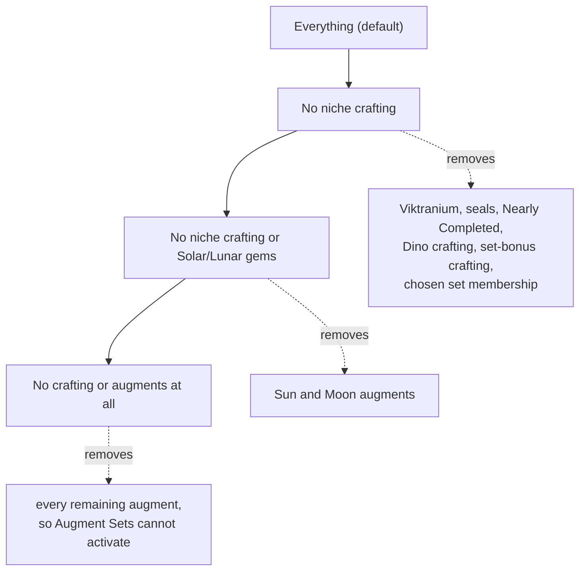
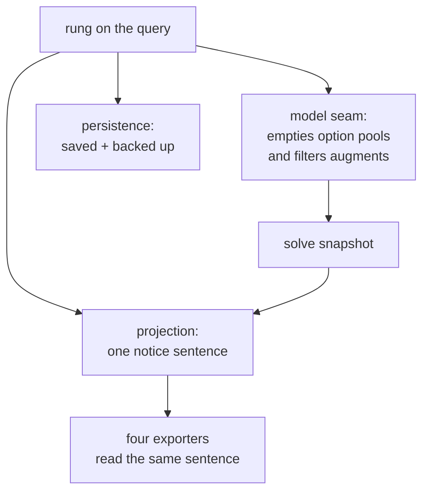

# Augment Exclusion Controls - Plan

## Goal Capsule

- **Objective:** Let a player solve without the crafting and augments they will not pay for, through one ordered control that reaches printed-only and cannot be set to a self-contradicting state.
- **Product authority:** User-directed through brainstorm dialogue on 2026-08-16. Closes #346.
- **Open blockers:** None. Precision beyond the color axis is blocked on #197 (no cost/rarity/source-tier field) and is out of scope.
- **Product Contract preservation:** Unchanged. Planning added the Planning Contract and below; no R-ID text was altered.
- **Stop conditions:** Stop and surface if the default rung fails to reproduce today's loadouts on the golden fixtures, or if any rung makes a golden query infeasible rather than merely worse.

---

## Product Contract

### Summary

Replace the "Don't build around niche crafting" checkbox with one ordered control covering how much beyond the printed item the solver may assume, ending at printed-only. Its four rungs are Everything, No niche crafting, also no Solar/Lunar gems, and No crafting or augments at all. The augment ML ceiling joins the same section and is disabled when no augment can reach it. Results state what the finished loadout leans on.

### Problem Frame

A player leveling through past lives will not spend crafting mats on gear they replace in four levels. The optimizer has no way to hear that. It solves against the full 1,063-augment catalog and returns a loadout whose numbers depend on augments the player has no intention of acquiring — and the gap is invisible, because every augment in the pool is technically obtainable.

Measurement on the reported case (ML15, two-handed, melee preset, no crafting) shows the dependency is larger and differently shaped than expected:

| pool | augments placed | Accuracy | Deadly | Seeker | Armor-Piercing | Armor Class |
|---|---|---|---|---|---|---|
| all gear | 8 | 23 | 13 | 12 | 25 | 39 |
| no Sun/Moon | 2 | 20 | 12 | 8 | 16 | 48 |
| no color augments | 5 | 23 | 13 | 12 | 25 | 33 |
| no augments | 0 | 19 | 10 | 12 | 5 | 43 |

Six of the eight augments the solver chose were Solar/Lunar gems, while removing every ordinary color augment moved no ranked stat except Armor Class. On this query the optimizer leans hardest on a single augment family. Whether that holds across classes, levels, and priority sets is unmeasured — one query motivates the control, it does not establish a general law.

The control that already restricts this surface is trying to be the answer and cannot reach it. "Don't build around niche crafting" states its purpose as *"so every item must win on what is actually printed on it"* — and then concedes in the same breath that *regular augments still count*. It describes printed-only and delivers something short of it. Adding a second augment control beside it would leave the first one's stated purpose false rather than fix it.

### Key Decisions

- **The control axis is augment color, not acquisition cost.** (session-settled: user-directed — chosen over a cost/source-based filter: the data cannot express spend.) Every augment record carries null `location_quest`, `binding`, `crafting`, and `no_drop_source`, with `restrictions: 'unknown'` across all 1,063. Color is a proxy for spend and misfires in both directions — the Red pool holds pure loot drops (*A History of Draconic Interference*, *Bestiary of the Planes*) beside crafted rubies. Sun and Moon are the one place where a color maps to a single named family: every entry is a Solar or Lunar Gem, and the [[Multi-fit]] matrix already isolates them. That the family is uniformly expensive to acquire is an assumption, not a sourced fact — see Dependencies.

- **Augments join the niche-crafting control rather than getting one of their own.** (session-settled: user-directed — chosen over a separate augment control beside it: two adjacent controls would leave the existing one's stated purpose false.) The niche-crafting checkbox already describes printed-only and falls short of it. Absorbing augments completes the control it was trying to be, and removes the wording contradiction instead of patching it.

- **The merged control is an ordered ladder, not a set of independent checkboxes.** Each rung removes strictly more than the one above, so no combination of settings can contradict itself — which is the structural version of the rule below rather than a runtime check. Independent checkboxes would reintroduce exactly the contradictory state that rule exists to prevent: "no augments" plus "no Solar/Lunar gems" is a selection with a redundant half. The cost is one foreclosed combination — excluding augments while still assuming niche crafting — judged implausible because the niche systems are endgame content a player who won't slot augments is unlikely to have farmed. Not verified; see Dependencies.

- **Contradictory selections are prevented, not silently ignored.** (session-settled: user-directed.) A control that cannot apply under the current selection is disabled with a stated reason. The augment ML ceiling below the augment-excluding rungs is the motivating case, and the rule generalizes to any future control on this surface.

- **Default preserves today's behavior.** The ladder ships at Everything, so no saved character changes until the player opts in. A character saved with the old checkbox ticked restores at the No-niche-crafting rung, which is the same behavior under a new name.

### Requirements

**The merged control**

- R1. One ordered control replaces the "Don't build around niche crafting" checkbox, with four rungs that each remove strictly more than the one above: Everything; No niche crafting; No niche crafting or Solar/Lunar gems; No crafting or augments at all. It defaults to Everything.
- R2. The No-niche-crafting rung excludes exactly what today's checkbox excludes — Viktranium experiments, Sealed-in-X seals, Nearly Completed, Dinosaur Bone crafting, and set-bonus crafting — so the rung is behaviorally identical to ticking the old box.
- R3. The Solar/Lunar rung additionally removes every Sun and Moon augment from the candidate pool; all other augment colors remain available.
- R4. The bottom rung additionally removes every augment, so each item wins on what is printed on it. This is the control's stated purpose, now reachable.
- R5. The control's label and help text describe what each rung leaves available, and no longer carve out augments as an exception.
- R6. The augment ML ceiling renders in the same section as the merged control and is disabled, with a stated reason, on any rung where no augment can reach it. Its value is retained and restored when the player returns to a rung where it applies.
- R7. The selection is part of the query: it persists with a saved character, survives backup and restore, and flows through the projection layer into every export including the portable `ddo-loadout/v1` envelope. A character saved with the old boolean restores at the rung that boolean meant: absent or false at Everything, true at No niche crafting.

**Disclosure**

- R8. The disclosure is a notice in the results, in the existing scope-note idiom. The crafting-exclusion notice widens to cover the whole ladder rather than a second notice appearing beside it — one control, one notice.
- R9. On the top rung the notice states what the loadout depends on that a lower rung would remove, naming Solar/Lunar gems when the loadout leans on them. On any lower rung it states what the current rung excluded. Either way a player who never opens the control learns from the results that the ladder exists.
- R10. The notice reports what the solve actually placed, so it stays correct if the rung definitions are later revised.
- R11. When a rung makes a mechanic unreachable rather than merely unused, the notice says so instead of the results omitting it silently. An Augment Set that cannot activate on the bottom rung is the motivating case.
- R12. When a rung removes a targeted stat's last source from the pool, the existing zero-source notice names the rung as the cause instead of pointing only at the ML band and character filters. Twenty targetable stats are augment-only, so this is the ladder's most common surprise.

### Acceptance Examples

- AE1. **Leveling solve, gems excluded.** Covers R3, R8. Given the ML15 two-handed melee query on the Solar/Lunar rung: no Sun or Moon augment appears in the result, ordinary color augments still do, and the ranked stats settle at the measured no-Sun/Moon values rather than the all-gear values.
- AE2. **Ceiling cannot apply.** Covers R6. Given the bottom rung: the augment ML ceiling is disabled and states that no augment can reach it. Returning to a rung that admits augments restores it with its prior value intact.
- AE3. **Augment sets follow the augments.** Covers R4, R11. Given the bottom rung: no Augment Set activates, because a Set Augment is itself a Colorless augment and the pool no longer holds one. The results say the set was unavailable rather than silently omitting it.
- AE4. **The rungs nest.** Covers R1, R2, R3. Given the same query solved on each rung in turn: every item excluded at one rung stays excluded at every rung below it, and the No-niche-crafting rung returns exactly the loadout today's ticked checkbox returns.
- AE5. **The notice is the discovery path.** Covers R8, R9. Given the ML15 melee query on the top rung, where the solve leans on Solar/Lunar gems: the results carry one notice naming that dependency and the control that changes it. Given the same query on the bottom rung: one notice states what was excluded. Neither case produces two notices about the same solve, and the sentence a player reads in the results is the sentence a shared export carries.
- AE6. **Migration is inert.** Covers R7. Given a character saved with the old checkbox unticked: it restores at Everything and re-solves to the same loadout it produced before. Given one saved with it ticked: it restores at No niche crafting, likewise unchanged.
- AE7. **A rung removes a stat's last source.** Covers R12. Given an ML34 query targeting Strikethrough — an augment-only stat — solved on the bottom rung: the solve stays optimal, Strikethrough comes back 0, and the zero-source notice names the rung as the cause and points at the control. On the top rung the same query returns a non-zero Strikethrough from an augment.

### Scope Boundaries

- Cost-, rarity-, or source-based exclusion. Blocked on #197, which is the shared prerequisite under every attainability feature.
- Adjudicating which augments are loot drops versus mat-cost purchases. That is wiki work, and this repo does not infer values it has not sourced.
- Per-augment blocking. The blocklist already covers it.
- Arbitrary combinations of the exclusions. The ladder is deliberately ordered; a player cannot exclude augments while keeping niche crafting.
- Modelling augments the player actually owns. The owned-gear pool constrains base items only, and extending it to augments is a separate question.

### Dependencies / Assumptions

- Assumes `aug_color` is a complete and reliable partition of the augment catalog. Verified: all 1,063 augment records carry one of Colorless, Red, Blue, Yellow, Green, Orange, Purple, Sun, or Moon, with none missing.
- Assumes the [[Multi-fit]] matrix already isolates Sun and Moon — each fits only its own slot color while every other color fits a spread — so excluding them cannot strand a placement rule.
- Assumes removing augments from the candidate pool is sufficient to suppress Augment Sets, since a Set Augment's only piece source is a Colorless augment. AE3 exists to confirm this rather than assume it.
- Assumes the ladder's rung order matches how players actually experience acquisition cost — that a player unwilling to slot augments is also unwilling to farm Viktranium, seals, Nearly Completed, and Dino crafting. Unverified, and it is what makes an ordered ladder safe rather than lossy. If a real player wants printed-item augments while still using niche crafting, the ladder cannot express it and the shape needs revisiting.
- Assumes Solar and Lunar Gems cost more to acquire than ordinary color augments. This is the premise the Solar/Lunar rung rests on and it is **not sourced** — the catalog carries no acquisition data for any augment, and this repo does not infer game values it has not read from the wiki. What is verified is narrower: the family is uniformly named and isolated in the fit matrix. If the wiki shows Solar/Lunar Gems are cheaply obtained, the middle position loses its rationale even though the control still functions.

### Outstanding Questions

**Resolve before planning**

- None.

**Deferred to planning**

- Whether the Solar/Lunar rung also disables the augment ML ceiling when no remaining augment sits above the cap, or leaves it live. R6 disables it only when no augment can reach it; whether that condition is evaluated per-rung or per-pool is an implementation call.
- The rungs' wording and the notice's sentences. R5 and R9 fix their meaning; the copy is a writing task.

### Sources / Research

- `CONCEPTS.md` — [[Augment]], [[Multi-fit]], and [[Augment Set]] carry the color-capacity model, the compatibility matrix, and the three-copies-of-one-Colorless-augment rule this scope depends on.
- `web/wizard.js` — the niche-crafting checkbox this control replaces, including the "Regular augments still count" carve-out R5 removes and the printed-only purpose statement the merge finally delivers.
- `docs/plans/2026-08-16-002-feat-augment-ceiling-and-bundles-plan.md` — the augment ML ceiling this scope moves into the same section.
- `web/results.js` — the scope-note notice family the R8 notice joins, and the standing rule attached to it: a notice phrased once in the results and again in the exporters is how the app and a shared build come to disagree about the same solve. The sentence is authored once and read from projection.

---

## Planning Contract

### Key Technical Decisions

- KTD1. **The ladder replaces `excludeCraftingSystems` at the same seam it already occupies.** (session-settled: user-directed — inherits the Product Contract decision "Augments join the niche-crafting control rather than getting one of their own".) `web/model.js` already empties the craftable option pools behind one query flag, at the model boundary, with the comment stating augments are deliberately not gated. The ladder generalizes that branch rather than adding a second pool-filtering path, so alternatives re-solves, saved queries, and exports keep inheriting the setting from the query they already carry.

- KTD2. **The rung is a string enum on the query, ordered by an explicit table.** Persisted characters and backup files are JSON a player can read, and a rung named `printed-only` survives inspection where `3` does not. The ladder's monotonicity needs an ordering, so one exported rank table is the single place that defines it — never a numeric field the callers compare directly.

- KTD3. **Migration derives the rung from the old boolean; no save marker.** The old field is a total function onto the ladder — absent or `false` maps to the top rung, `true` maps to No niche crafting. This is unlike the Utility tier's marker, which existed because "never had it" and "player removed it" were indistinguishable; here they are not. The old key is read on load and stops being written.

- KTD4. **A rung that excludes augments forces the augment ML ceiling to null in the solved query.** (session-settled: user-approved — chosen over retaining the value in the solved query: a retained ceiling would be reported as active on a solve that placed no augments.) The UI retains the player's typed value (R6), but the query the solver and the notices read must carry `null`, or `augCeilingLine` reports "augments were restricted to ML N" on a solve that placed none. Retaining a value in the control and asserting it in the results are different things.

- KTD5. **The merged notice widens the existing crafting-exclusion line rather than adding a second one.** That line is already read by all four exporters through one projection field, so widening it satisfies the export half of R7 with no new plumbing and honors the standing rule that a notice is phrased once. The top-rung sentence needs what the solve placed, so the line reads the snapshot as well as the query.

- KTD6. **Goldens are verified unchanged, not re-captured.** (session-settled: user-approved — chosen over a defensive re-capture: re-capturing would mask a regression the default rung is supposed to make impossible.) The default rung must reproduce today's behavior exactly; a golden diff on the default rung is a regression signal, and re-capturing would erase it. Any capture that does become necessary rebuilds `web/data/items.json` from the current tree first — see `docs/solutions/workflow-issues/rebuild-the-dataset-before-any-golden-capture.md`.

### High-Level Technical Design

The ladder maps each rung to what leaves the candidate pool. Every rung inherits the exclusions above it:

One rung value is read by four surfaces, each for a different purpose:

The snapshot edge is what lets the top rung name what the loadout depends on: the sentence is a function of the rung *and* what the solve placed, not the rung alone.

### Assumptions

- The default rung reproduces today's solves byte-for-byte, so the golden and parity fixtures do not move. U6 proves this rather than assuming it.
- Sun and Moon are a complete, reliable partition of the Solar/Lunar family in the catalog, verified during the brainstorm across all 1,063 augment records.
- Removing augments from the pool is sufficient to suppress Augment Sets, since a Set Augment is itself a Colorless augment. U5 proves this.

### Sequencing

U1 establishes the rung and the model seam; U2, U3, and U4 each consume it and are independent of one another. U5 builds on U4's notice. U6 is the release gate and runs last.

### System-Wide Impact

- **Saved-character lifecycle.** The rung joins the input allowlist that the save path and backup import share deliberately, so a field cannot persist on one path and be stripped on the other. Adding to it changes what every future save carries.
- **Every export format.** All four exporters read the rung notice through one projection field, so U4 changes what a shared build says without touching the exporters. That is the reason to widen the existing sentence rather than add a second one — and the reason a wording mistake reaches five surfaces at once.
- **Alternatives re-solves.** They inherit the query, so they inherit the rung for free. No separate handling, but any alternative shown under a restrictive rung must obey the same exclusions.
- **Deployed behavior.** This changes player-facing behavior, so the three build markers bump together. The dataset is fetched without caching, so a merge changes every live solve the moment it deploys.

### Risks & Dependencies

- **Migration is the highest-consequence risk.** A wrong derivation from the old boolean silently changes the loadout of every saved character, and the player has no signal that anything moved. U3 tests both boolean states and AE6 pins the outcome; treat a golden or restored-loadout diff here as a stop condition, not a fixture to update.
- **Pool composition meets the dominance pre-filter.** The pre-filter carries documented soundness obligations about which items may prune which peers. The ladder removes candidates before the model is built — the same path the existing flag already uses — so the risk is contained rather than new. Confirm the pre-filter behaves under an augment-free pool rather than assuming the existing seam covers it.
- **A retained ceiling is a live contradiction risk.** KTD4 exists because the UI keeps a value the solve must ignore. If the solved query carries the number, the results assert a restriction that did nothing — the same class of defect as a notice that outlives the solve that justified it.
- **Notice parity across five surfaces.** The single-authorship rule for notice sentences exists because phrasing one in results and again in the exporters is how the app and a shared build come to disagree. U4 must not introduce a second wording anywhere.

---

## Implementation Units

### U1. Rung model and the pool seam

- **Goal:** Replace the boolean with the ordered rung at the query boundary and the model seam, so each rung removes strictly more than the one above it.
- **Requirements:** R1, R2, R3, R4; implements KTD1, KTD2, KTD4.
- **Dependencies:** none.
- **Files:** `web/model.js`, `web/wizard.js`, `tests/model.test.js`, `tests/solver.test.js`
- **Approach:** Define the rung vocabulary and its rank table in one exported place. Generalize the existing single-flag branch in `web/model.js` into rank comparisons: at or below the No-niche-crafting rank, empty the craftable option families exactly as the boolean does today; at or below the Solar/Lunar rank, additionally drop Sun and Moon augments from the candidate pool; at the bottom rank, drop every augment. `buildQuery` emits the rung and, per KTD4, emits a null augment ceiling whenever the rung excludes augments — the retained UI value is not the solved value.
- **Patterns to follow:** the existing `excludeCraftingSystems` branch and its comment block in `web/model.js`; `web/wizard.js`'s `buildQuery` field construction.
- **Execution note:** the No-niche-crafting rung must be provably identical to today's boolean before the new rungs are added — establish that equivalence first, since every migration case depends on it.
- **Test scenarios:**
  - The No-niche-crafting rung produces the same emptied option families as `excludeCraftingSystems: true` on the same query.
  - The Solar/Lunar rung leaves Colorless, Red, Blue, Yellow, Green, Orange, and Purple augments in the pool and removes every Sun and Moon one.
  - Covers AE4. The rungs nest: an item excluded at one rung is absent at every rung below it, across a real solve on each rung in turn.
  - The bottom rung places zero augments and leaves the printed affixes untouched.
  - Covers AE1. The ML15 two-handed melee query on the Solar/Lunar rung reproduces the measured no-Sun/Moon values rather than the all-gear values.
  - A rung that excludes augments yields a solved query whose augment ceiling is null even when the input carried a number.
  - An unrecognized or absent rung value resolves to the top rung rather than throwing.
  - Covers AE7. An ML34 query targeting Strikethrough returns a non-zero value on the top rung and zero on the bottom rung, staying optimal — per-stat floors are best-effort, so the rung takes the last source away without making the solve infeasible.
- **Verification:** the Python and JS suites pass, and a real solve on each rung shows the nesting property.

### U2. The merged control and the disabled ceiling

- **Goal:** Replace the checkbox with the ladder control and disable the augment ML ceiling, with a stated reason, on rungs where no augment can reach it.
- **Requirements:** R1, R5, R6.
- **Dependencies:** U1.
- **Files:** `web/wizard.js`, `web/styles.css`, `tests/wizard.test.js`
- **Approach:** Render the ladder where the checkbox sits, in the same section as the augment ML ceiling. Each rung's help text says what it leaves available; the "Regular augments still count" carve-out is deleted rather than reworded. The ceiling input disables with a stated reason on augment-excluding rungs and retains its value, so returning to a rung that admits augments restores it.
- **Patterns to follow:** the existing `wz-check` control markup and its `onchange` state wiring; the existing ceiling input's state handling.
- **Test scenarios:**
  - Selecting each rung sets the corresponding state value, and the built query carries it.
  - Covers AE2. On an augment-excluding rung the ceiling control is disabled and states why; returning to an augment-admitting rung re-enables it with the prior value intact.
  - The rendered help text contains no claim that augments are exempt.
  - The ceiling's retained value survives a round trip through two rung changes without being cleared.
- **Verification:** the JS suite passes and the control renders with the ceiling correctly disabled on the bottom two rungs.

### U3. Persistence, backup, and migration

- **Goal:** Persist the rung and migrate saved characters off the old boolean without changing any restored loadout.
- **Requirements:** R7; implements KTD3.
- **Dependencies:** U1.
- **Files:** `web/persist.js`, `web/wizard.js`, `tests/persist.test.js`, `tests/backup.test.js`, `tests/import.test.js`
- **Approach:** Add the rung to the saved-input allowlist that the save path and backup import share, so the two cannot drift. On load, prefer the rung when present; otherwise derive it from the old boolean per KTD3 and stop writing the old key.
- **Patterns to follow:** `augCeiling`'s treatment as a plain nullable scalar with no save marker; the `#245` absent-reads-as-default restore branch.
- **Test scenarios:**
  - Covers AE6. A save with the old boolean absent or false restores at the top rung; one with it true restores at No niche crafting.
  - A save carrying a rung restores that rung and ignores any stale boolean beside it.
  - A backup export and re-import round-trips the rung unchanged.
  - A hand-edited backup with an unrecognized rung value loads at the top rung rather than failing.
  - The state does not leak between characters: loading a top-rung character after a bottom-rung one leaves the top rung set.
- **Verification:** the JS suite passes and a save/load/export/import cycle preserves the rung.

### U4. The merged results notice

- **Goal:** Widen the crafting-exclusion notice into one sentence covering the whole ladder, including the top rung's dependency statement.
- **Requirements:** R8, R9, R10; implements KTD5.
- **Dependencies:** U1.
- **Files:** `web/projection.js`, `tests/projection.test.js`, `tests/exporters.test.js`, `tests/results.test.js`
- **Approach:** Rewrite the crafting-exclusion line to select its sentence from the rung, and to read the solve snapshot for the top-rung case so it can name what the loadout depends on. Keep the existing restore-path fallback so a restored character discloses identically without re-solving. Because all four exporters already read this one projection field, no export plumbing changes.
- **Patterns to follow:** the existing crafting-exclusion and augment-ceiling line functions and their snapshot-versus-inputs reading rules.
- **Test scenarios:**
  - Covers AE5. The top rung with a Solar/Lunar-dependent loadout produces one sentence naming that dependency; the bottom rung produces one sentence naming what was excluded.
  - Exactly one notice is produced per solve — the widened line replaces rather than joins the old one.
  - The sentence rendered in results is byte-identical to the sentence each of the four exporters emits.
  - A restored pre-feature snapshot discloses at the top rung without re-solving.
  - The augment-ceiling notice stays silent on any rung that excluded augments.
- **Verification:** the JS suite passes and one solve's notice text matches across the app and every export.

### U5. Unreachable-mechanic disclosure

- **Goal:** Say when a rung makes a mechanic unreachable or removes a targeted stat's last source, rather than leaving the player with a silent zero.
- **Requirements:** R11, R12.
- **Dependencies:** U4.
- **Files:** `web/projection.js`, `web/results.js`, `tests/projection.test.js`, `tests/results.test.js`
- **Approach:** On rungs that exclude augments, report Augment Sets as unavailable rather than absent. When a rung removed a targeted stat's last source, extend the existing zero-source notice so it names the rung as the cause — today it offers only the ML band and character filters, which is misleading advice for this cause. Both reuse the projection-authored sentence path U4 establishes so results and exports cannot diverge.
- **Patterns to follow:** the existing zero-source notice and its deliberate refusal to name a single cause; the notice family's single-authorship rule.
- **Test scenarios:**
  - Covers AE3. On the bottom rung no Augment Set activates and the results state it was unavailable rather than omitting it.
  - On the top rung an Augment Set that simply lost on merit is not reported as unavailable — the two states stay distinct.
  - Covers AE7. Targeting Strikethrough on the bottom rung yields a zero-source notice that names the rung and points at the control.
  - A stat unreachable for an unrelated reason (ML band, owned-gear pool) does not blame the rung.
  - The unavailability and binding-constraint statements reach the exports through the same field as the rung notice.
- **Verification:** the JS suite passes; a bottom-rung solve names the unavailable set, and a rung-caused zero names the rung.

### U6. Golden verification and release stamp

- **Goal:** Prove the default rung changed nothing, and ship the build stamp the repo requires.
- **Requirements:** R1 (default), R7; implements KTD6.
- **Dependencies:** U1, U2, U3, U4, U5.
- **Files:** `web/index.html`, `web/app.js`, `README.md`, `tests/parity/`
- **Approach:** Run the golden and parity suites against the default rung and confirm zero diff. Do not re-capture; a diff here is a regression to fix, not a fixture to re-ratify. Then bump the three build markers together — the cache-bust query on the versioned assets, the footer build constant, and the README build line — since this changes player-facing behavior.
- **Execution note:** verification-only for the golden half; the stamp bump is the last edit before the PR.
- **Test scenarios:**
  - Test expectation: none for the stamp bump itself — the repo's build-stamp test already enforces that the three markers agree.
  - The golden solver fixtures produce zero diff on the default rung.
  - The parity baseline produces zero diff on the default rung.
- **Verification:** golden and parity suites green with no fixture edits, and the build-stamp test passes with the three markers bumped in step.

---

## Verification Contract

| Gate | Command | Applies to |
|---|---|---|
| Python suite | `python3 tests/run_tests.py` | U6 (build stamp), any seed or pipeline touch |
| JS suite | `for t in tests/*.test.js; do node "$t"; done` | U1-U6 — run file by file; `node a.js b.js` executes only the first |
| Golden solver fixtures | `node tests/solver_golden.test.js` | U1, U6 — zero diff expected on the default rung |
| Real-data acceptance | `node tests/utility_runs.test.js` | U1 — re-run after any pool-composition change |

A golden or parity diff on the default rung is a regression, not a fixture to re-ratify. If a capture ever becomes necessary, rebuild `web/data/items.json` from the current tree first.

---

## Definition of Done

- Every requirement R1-R12 is satisfied by a unit, and every acceptance example AE1-AE7 has a test that enforces it.
- A rung-caused zero names the rung as the cause instead of pointing the player at their ML band.
- The default rung reproduces today's loadouts: golden and parity fixtures show zero diff with no fixture edits.
- A saved character from before this change restores with its loadout unchanged, from both the ticked and unticked boolean.
- One notice per solve, and the sentence in the app is byte-identical to the sentence in all four exports.
- The niche-crafting help text no longer claims augments are exempt.
- The three build markers agree and are bumped together.
- Dead-end code from abandoned approaches is removed rather than left in the diff.
- Issue #346 — the global "solve without augments" request this closes; issue #197 — the cost/source-field blocker behind the deferred precision; issue #339 — the shipped ML ceiling.
- Impact measurements in the Problem Frame were produced by solving the reported ML15 query against four filtered pools with the shipped solver.
