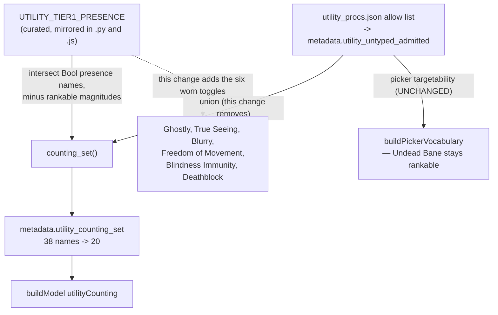

# Utility Default Roster - Plan

## Goal Capsule

- **Objective:** Change which effects the Utility tier counts, so leftover slots fill with the toggles players notice instead of near-duplicate weapon procs. Closes #343 on its own, with no change to how the tier works.
- **Product authority:** User-directed through brainstorm dialogue on 2026-08-16.
- **Open blockers:** None.
- **Product Contract preservation:** Unchanged. Planning added the Planning Contract and below; no R-ID text was altered.
- **Stop conditions:** Stop and surface if the counted set does not land at exactly the twenty names in R1, or if any golden fixture's ranked-stat values move. Loadouts are expected to change; ranked values are not — the tier is pinned last, so it cannot buy an effect with a ranked point.
- **Relationship to the container work:** The player-curated container is scoped separately in `docs/plans/2026-08-16-005-feat-utility-nice-to-have-container-plan.md`. This plan is not a step toward it and does not depend on it — it is the whole fix for the reported bug, and it ships independently.

---

## Product Contract

### Summary

Replace the 24 weapon procs in the Utility tier's counted set with the six worn defensive toggles players expect. The tier's mechanics are untouched: it stays a draggable priority maximizing a count of distinct effects, in one solve stage.

### Problem Frame

A player reported that Ghostly and True Seeing never appear in an optimized loadout. Both are in the catalog and both are targetable — name either explicitly and the solver finds it. The failure is that nothing seeks them on the player's behalf.

The [[Utility tier]] exists to fill slots that ranked stats left empty, and it counts **38 of 838** presence names. Those 38 are almost entirely weapon procs — the whole Bane family plus Holy, Unholy, Anarchic, Axiomatic, Vampirism, Maiming, and Chilling. Every classic worn defensive toggle is excluded: Ghostly, True Seeing, Blurry, Freedom of Movement, Blindness Immunity, Deathblock. Feather Falling is the only one that made the list.

So the one mechanism meant to fill spare slots with felt effects reaches for Undead Bane and never for True Seeing.

The list is that shape because the full 838-name population failed the #91 measured perf gate at 7.7× a 2× budget, so v1 shipped a curated subset intended to widen in measured batches. That widening was never filed, and the shipped 38 already measured 1.96× — apparently no headroom. Measuring what the 38 actually cost inverts the problem:

| set | names | carrying variants | measured cold-solve |
|---|---|---|---|
| current tier-1 | 38 | 1,904 | 1.96× baseline (recorded by #91) |
| …of which weapon procs | 24 | 1,638 (86%) | — |
| …everything else | 14 | 266 | — |
| **this plan's roster** | **20** | **699 (−63%)** | **1.56× baseline (measured)** |

The weapon procs are 86% of the carrying-variant footprint. Swapping them out is not a widening that must fit the budget — it *buys back* budget, taking the tier from 1.96× to 1.56× against a 2.0× ceiling.

### Key Decisions

- **The counted set drops the weapon procs and gains the worn toggles.** (session-settled: user-directed — chosen over keeping today's 38 and widening around them: the count was padded with near-duplicates and they cost 86% of the budget.) A Bane proc is a damage-type decision belonging to the weapon choice, and 24 near-duplicate Bane names pad a count no player experiences as 24 distinct wins.

- **The tier's mechanics do not change in this plan.** It stays draggable, stays a flat count of distinct effects, stays one solve stage. R2 and R15 of the #91 plan remain in force here. This is a data change to which names are counted — nothing else — which is why it carries no migration, no new UI, and no new solve cost.

- **Golden fixtures are re-ratified deliberately.** Loadouts change on re-solve — that is the fix working, not drift. This follows R13 of the #91 plan, which established the same pattern when the tier first shipped.

### Requirements

- R1. The Utility tier's counted set becomes these 20 names: Blunt Trauma, Brilliance of the Shattered Sun, Feather Falling, Ghost Touch, Kick 'Em While They're Down, Legendary Tet-zik The Enlightened Change, Legendary Vile Grip of the Hidden Hand, Lesser Boneshatter, Lifeblood of the Undead Prince, Path of the Fire Dragon, Path of the Guarding Stone, Vile Grip of the Hidden Hand, Way of the Sun Soul, Whelming Shockwave, Ghostly, True Seeing, Blurry, Freedom of Movement, Blindness Immunity, Deathblock.
- R2. The weapon procs leave the counted set entirely. Nothing in this plan makes them re-addable; that is the container plan's job.
- R3. Everything else about the tier is unchanged: draggable position, flat distinct-count value, one solve stage, existing receipts, existing Alternatives family, existing exports.
- R4. The counted set stays defined in one place, with the Python build and the browser reading the same list — the parity the stamped-set test already guards.
- R5. Saved characters need no migration and no notice. Nothing about a saved record's shape changes, and R14 of the #91 plan still holds: nothing re-solves until the player re-solves.

### Acceptance Examples

- AE1. **The reported bug closes.** Covers R1. Given an ML34 solve with a single ranked priority (Constitution) and the Utility tier at the bottom: Ghostly, True Seeing, Blurry, Freedom of Movement, Blindness Immunity, and Deathblock all appear among the counted effects, where today's solve returns fourteen weapon procs and none of them.
- AE2. **It survives contention.** Covers R1. Given the same solve with six contested ranked stats above the tier (Constitution, both Shelterings, Healing Amplification, Dodge, Fortification): the count falls to five, and Ghostly, Blindness Immunity, and Deathblock are among them — where today's roster returns five weapon procs and no toggle.
- AE3. **A weapon build loses nothing.** Covers R2. Given a two-handed melee query ranking Melee Power and Doublestrike: the count is unchanged at fifteen, and the six worn toggles replace the Banes rather than reducing the total.
- AE4. **The tier gets cheaper.** Covers R1. Given the golden fixture set: the measured cold-solve ratio with the new roster is at or below the 1.96× the previous roster recorded, and inside the 2.0× budget.

### Scope Boundaries

- The pinned, player-curated container, its Advanced panel, ordering, and per-character persistence. Scoped separately in `docs/plans/2026-08-16-005-feat-utility-nice-to-have-container-plan.md`.
- Making the weapon procs re-addable. They leave the counted set here and return as an addable population only when the container ships.
- Widening toward the full 838-name presence population. Still governed by the #91 measured-batch rule; this plan reduces the budget rather than spending it.
- Value-weighting effects (#331). The count stays flat.

### Dependencies / Assumptions

- Assumes the six named toggles are the right roster. The wider set of worn presence effects has not been adjudicated against the wiki, and the final list may change on review — which is cheap here precisely because this is a data change.
- Verified, not assumed: all twenty names have worn-gear sources, so the crafting/augment ladder shipped in #346 cannot strand them. Ghostly has 110 worn carriers to 1 augment; True Seeing 60 to 0.
- Verified, not assumed: dropping the Banes does not reduce the count even for the build most exposed to it. A weapon-focused query returns fifteen effects before and after.

### Outstanding Questions

**Resolve before planning**

- None.

**Deferred to planning**

- Whether the golden re-ratification lands in the same commit as the roster change or a follow-up, given every fixture's loadout is expected to move.

### Sources / Research

- Issue #343 carries the verbatim report and the reproduction.
- `docs/plans/2026-08-15-002-feat-utility-tier-holistic-value-plan.md` — the #91 plan that shipped the tier. Its R13 established the deliberate golden re-ratification pattern this plan reuses; its R2, R15, and R14 stay in force.
- `CONCEPTS.md` — [[Utility tier]] and [[Boolean feature]]. Both remain accurate after this change, since the counting semantics are untouched.
- Cold-solve figures: the #91 plan recorded the 38-name roster at 1.96× the pre-feature baseline against a 2.0× budget. This roster measured **1.56×** on the same gate (`tests/perf_utility.js`, 23 fixtures, baseline median 510 ms / sentinel-appended 796 ms) on 2026-08-16. An earlier draft of this plan carried a 0.76× figure taken from a reviewer's measurement during a different review; running the gate directly did not reproduce it, and the measured number replaces it.

---

## Planning Contract

### Key Technical Decisions

- KTD1. **The counted set is assembled from two sources, and this change touches both — differently.** `counting_set` in `src/utility_procs.py` unions two populations: Bool presence names restricted to the curated `UTILITY_TIER1_PRESENCE` (the 14), and the allow-dispositioned untyped procs stamped as `metadata.utility_untyped_admitted` (the 24). The six toggles are added to the first; the second stops being unioned into the count. Treating this as one list edit would either miss the procs or delete them from the wrong place.

- KTD2. **The reviewed-proc allow list is not touched.** `data/seed/compendium/utility_procs.json` and its `utility_untyped_admitted` stamp keep every one of the 24 names, because that stamp has a second consumer: `buildPickerVocabulary` reads it to make those names individually rankable. Emptying it would remove Undead Bane from the picker, which is a different and unwanted change. They stop being *counted*, not *available* — R2 of the Product Contract says exactly this, and this is the seam that delivers it.

- KTD3. **The curated constant stays mirrored rather than derived.** R4 asks for one definition; in this codebase that is delivered as two guarded copies, not one file. `UTILITY_TIER1_PRESENCE` exists in `web/dataset.js` (which must classify catalogs built before a stamp existed) and in `src/utility_procs.py` as `frozenset | PRESENCE_ALLOW`, with the stamped-set parity test failing the build the moment they disagree — so there is one *effective* definition even though there are two literals. Both copies gain the six toggles in the same change; collapsing the duplication is out of scope and would break the pre-stamp classification path.

- KTD4. **Golden and parity fixtures are re-ratified in this change, not a follow-up.** (session-settled: user-approved — chosen over deferring the capture: a mysterious red suite is worse than a large, explained diff.) Every fixture's loadout is expected to move because the tier now secures different effects. This follows R13 of the #91 plan. The dataset is rebuilt from the current tree before any capture, per `docs/solutions/workflow-issues/rebuild-the-dataset-before-any-golden-capture.md`.

### High-Level Technical Design

Where the counted set comes from today, and what each half of this change does to it:

The solver side is untouched: `buildModel` still receives one counting set and mints one stage. Only the set's membership changes.

### Assumptions

- The six toggles all clear the presence-minus-magnitude test, so adding them to the curated constant is sufficient to get them counted. Verified: each is Bool-carried and none appears in `rankable_affixes`.
- The parity test's existing two directions still hold once the untyped union is gone. Direction 1 (every counted non-admitted name is tier-1) becomes stricter, not weaker; direction 2 (every Bool-carried tier-1 name is counted) now covers six more names.

### Sequencing

U1 changes both mirrors and the union, and is the only unit that changes behavior. U2 extends the tests that guard it. U3 re-ratifies fixtures and ships the build stamp, and runs last because it captures what U1 produced.

### System-Wide Impact

- **The Alternatives "more utility effects" family offers different trades.** Its mechanism is unchanged, but the effects it can gain are drawn from the new counted set, so the alternatives a player sees differ. Same category as the export change below: contents move, plumbing does not.
- **Every export's utility receipts change contents.** The tier's receipts flow through the projection layer into all five outputs, so a shared build lists different effects after this change. The shape is unchanged — no export plumbing moves — but a player comparing an old shared build to a new one sees different names.
- **The picker is deliberately untouched.** The 24 procs stay individually rankable. This is the one cross-surface effect this change specifically avoids, and KTD2 is what avoids it.
- **Deployed behavior.** The dataset is fetched without caching, so a merge changes every live solve the moment it deploys. Hence the build-stamp trio in U3.

---

## Implementation Units

### U1. Reshape the counted set

- **Goal:** The Utility tier counts the twenty names in R1 and nothing else.
- **Requirements:** R1, R2, R3, R4; implements KTD1, KTD2, KTD3.
- **Dependencies:** none.
- **Files:** `src/utility_procs.py`, `web/dataset.js`, `build_dataset.py`, `tests/test_utility_procs.py`, `tests/dataset.test.js`
- **Approach:** Add the six worn toggles to `UTILITY_TIER1_PRESENCE` in both mirrors — the Python frozenset and the JavaScript literal — keeping the existing comment structure that explains why each group is present. Then stop `counting_set` unioning the untyped-admitted names, so the count is the tier-1 intersection alone. Drop the now-unused parameter rather than passing an empty set — a dead argument at the one call site in `build_dataset.py` would read as "the procs are still wired in" to the next person. That call site and the direct `counting_set` calls in the Python tests move with it. Leave `data/seed/compendium/utility_procs.json`, the `utility_untyped_admitted` stamp, and every picker path untouched.
- **Patterns to follow:** the existing grouped-with-rationale shape of both `UTILITY_TIER1_PRESENCE` copies; `counting_set`'s docstring, which states the union it is losing and must be corrected rather than left describing old behavior.
- **Execution note:** the two mirrors and the union are one behavioral change — land them together, since a build with only one side updated trips the parity guard and reports a drift that is really a half-finished edit.
- **Test scenarios:**
  - The stamped `metadata.utility_counting_set` contains exactly the twenty names in R1, in sorted order.
  - Every one of the 24 untyped procs is absent from the counted set.
  - Every one of the 24 untyped procs is still present in `metadata.utility_untyped_admitted` and still reachable through the picker vocabulary as a rankable presence name.
  - The two `UTILITY_TIER1_PRESENCE` copies contain the same twenty-minus-untyped membership — the existing parity guard, now covering six more names.
  - `counting_set` no longer accepts an untyped-admitted argument, and the build produces the same stamp it did before the signature changed for every name that survives.
  - A presence name that carries a rankable magnitude (Deception, Underwater Action) is still excluded, so the magnitude subtraction was not lost in the edit.
- **Verification:** the Python suite and the JS suite pass, and the built catalog stamps twenty counting names.

### U2. Pin the behavior on real data

- **Goal:** The three measured behaviors that justify this change are enforced by tests, not just recorded in the plan.
- **Requirements:** R1, R2.
- **Dependencies:** U1.
- **Files:** `tests/ae_utility_runs.js`
- **Approach:** Extend the existing real-data acceptance-run script with the three solves this plan measured. It already builds a model against the built catalog and solves with HiGHS, so the additions are queries and assertions rather than new scaffolding.
- **Patterns to follow:** `tests/ae_utility_runs.js`'s existing AE1–AE3 shape — a labelled query, a solve, and named assertions with the reasoning in comments. Note it is deliberately not a `*.test.js` file, so it is re-run when the dataset or solver changes rather than on every commit.
- **Test scenarios:**
  - Covers AE1. ML34 with a single ranked priority and the tier ranked: all six worn toggles appear among the counted effects.
  - Covers AE2. The same solve with six contested ranked stats above the tier: the count is five and at least Ghostly, Blindness Immunity, and Deathblock are among them.
  - Covers AE3. A two-handed melee query ranking Melee Power and Doublestrike: the count is fifteen, and no Bane-family name appears.
  - The ranked-stat values in the contested run are identical with the tier present and absent, proving the tier still cannot buy an effect with a ranked point.
- **Verification:** `node tests/ae_utility_runs.js` passes with the new cases, and its output shows the secured effects by name so a reader can see the fix rather than infer it.

### U3. Re-ratify fixtures and ship

- **Goal:** The golden and parity fixtures reflect the new behavior, and the build is stamped.
- **Requirements:** R1; implements KTD4.
- **Dependencies:** U1, U2.
- **Files:** `tests/parity/golden.json`, `tests/parity/baseline.json`, `web/index.html`, `web/app.js`, `README.md`
- **Approach:** Rebuild the dataset from the current tree first, then re-capture the golden and parity fixtures and review the diff before accepting it. Every fixture whose solve had leftover slots is expected to swap weapon procs for worn toggles; a fixture whose *ranked* values moved is a defect, not a re-ratification. Then bump the three build markers together, since this changes player-facing behavior.
- **Patterns to follow:** `docs/solutions/workflow-issues/rebuild-the-dataset-before-any-golden-capture.md` — a capture against a stale catalog drifts unrelated fixtures and the drift reads as a real diff. `tests/parity/capture_golden.js` is the entry point.
- **Execution note:** review the captured diff before committing it. The point of re-ratifying deliberately is that someone looked; a blanket accept would hide exactly the ranked-value regression the stop condition names.
- **Test scenarios:**
  - Test expectation: none for the stamp bump itself — the repo's build-stamp test already enforces that the three markers agree.
  - Every re-captured golden fixture's ranked-stat values are unchanged from the previous capture; only utility effects and the items supplying them differ.
  - The parity baseline re-captures without unrelated drift, confirming the dataset was rebuilt before capture.
  - Covers AE4. The measured perf gate reports a ratio at or below the 1.96x the previous roster recorded, and inside the 2.0x budget. Landing at or above 1.96x would mean the footprint reduction did not reach the solve.
- **Verification:** golden and parity suites pass against the new fixtures, the build-stamp test passes with all three markers bumped, and the captured diff shows utility effects changing while ranked values hold.

---

## Verification Contract

| Gate | Command | Applies to |
|---|---|---|
| Python suite | `python3 tests/run_tests.py` | U1, U3 |
| JS suite | `for t in tests/*.test.js; do node "$t"; done` | U1-U3 — run file by file; `node a.js b.js` executes only the first |
| Real-data acceptance | `node tests/ae_utility_runs.js` | U2 — not part of the suite glob; run by hand |
| Golden fixtures | `node tests/solver_golden.test.js` | U3 — expected to fail until re-captured, then pass |
| Measured perf gate | `node tests/perf_utility.js` | U3 (AE4) — hand-run, not in the suite glob; record the numbers in the PR |

A golden diff here is expected and is the fix working. That makes it the one gate that cannot be read as a pass/fail signal alone — the diff itself must be reviewed against the stop condition before the capture is accepted.

---

## Definition of Done

- The counted set is exactly the twenty names in R1, and all 24 weapon procs remain individually rankable in the picker.
- The three measured behaviors from the Problem Frame are enforced by real-data tests, including that a weapon build's count does not fall.
- Golden and parity fixtures are re-captured from a freshly built dataset, and the diff shows utility effects moving while ranked-stat values hold.
- The three build markers agree and are bumped together.
- No saved character required migration, and none was written.
- Dead-end code from abandoned approaches is removed rather than left in the diff.
