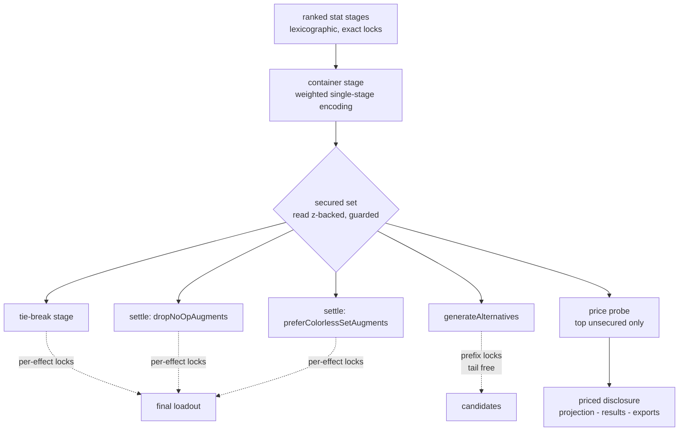
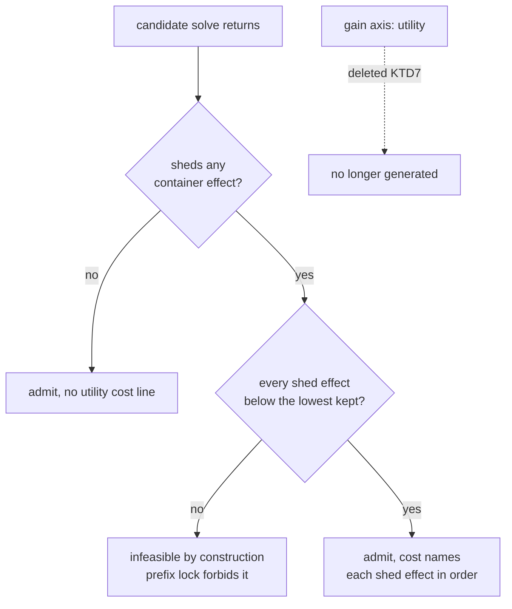

# Utility Nice-to-Have Container - Plan

**Tracked as #348.**

## Goal Capsule

- **Objective:** Turn the Utility tier into a pinned, player-curated container of nice-to-have effects, pursued in the player's own order — so a player who wants Ghostly ahead of Feather Falling can say so, and one who never opens the panel still gets a sensible default.
- **Product authority:** User-directed through brainstorm dialogue on 2026-08-16.
- **Open blockers:** None for scope. One verification gates implementation — see Dependencies.
- **Depends on:** `docs/plans/2026-08-16-004-fix-utility-default-roster-plan.md`, which closes #343 on its own. This plan assumes that roster has shipped and is the container's starting contents. It must not be treated as the fix for the reported bug.

---

## Product Contract

### Summary

The Utility row becomes a pinned, visually distinct container at the bottom of the priority list, with a panel where the player reorders, adds, and removes the effects inside it. Effects are pursued in the player's order rather than counted flat, and every solve downstream of that ordering respects it — including the tie-break and Alternatives, which today only preserve the count. The tier's own Alternatives family retires in favor of telling the player what a missed effect would have cost. Saved characters heal to the new shape with a notice.

### Problem Frame

The roster change that closes #343 fixes *which* effects the optimizer reaches for. It does not let a player say which ones matter to them.

The tier values effects as a flat count of distinct presences: every effect is worth exactly 1. Ghostly — 10% incorporeal miss chance — scores the same as Feather Falling. A player who drags the tier up to buy more effects cannot say which effects; they get whatever combination is cheapest for the solver, which may be three trivial ones over one they wanted. The count is value-blind by construction, and position in the priority list is the only trade mechanism the tier offers.

That is tolerable while the tier is a scavenger filling leftover slots. It stops being tolerable once players start curating what it holds, because curation without ordering is only half a control.

### Key Decisions

- **The Utility row is a pinned container, not a rankable priority.** (session-settled: user-directed — chosen over leaving it draggable: a flat count dragged up buys effects as a bundle, which is not what a must-have needs.) It always sits at the bottom and cannot be moved. Must-haves already have a mechanism — a `min 1` floor — so the container is explicitly for leftovers. Ranking a stat normally is **not** that mechanism: rank position expresses a preference that competes, and a preference can lose at any rank beneath whatever outbids it. Measured while scoping #345: ranking each of the twenty tier-1 toggles last under the Melee preset at ML15 two-handed leaves four of the ten reachable ones at zero. See `docs/plans/2026-08-17-001-fix-ranked-priority-zero-disclosure-plan.md`. *Overrides R2 of the #91 plan and moots part of its AE2; its R11 is overridden outright below.*

- **The row gains a curation panel.** (session-settled: user-directed.) It lists the effects the container will apply, in order, and the player can reorder, add, and remove them. *Overrides R15 of the #91 plan, which suppressed the Advanced panel for this row.* It is a list manager, not the numeric-field panel other rows use, and shares only the name.

- **In-container order is strict lexicographic sub-ranking.** (session-settled: user-directed — chosen over count-then-tiebreak: the player's #1 effect should be genuinely guaranteed, not surrendered to breadth.) This does not recreate must-have semantics, because the container is pinned last: nothing inside it can ever cost a ranked stat a point.

- **Strict order is realized in one solve stage, not one per effect.** Measured: twenty sequential sub-rank stages cost 3.94× median and 6.93× worst against a 2.0× budget, with one endgame fixture projecting 88 seconds — cost is entirely per-stage solves, so the roster's variant reduction cannot absorb a 20× stage multiplier. A single-stage weighted objective reproduced the sequential selection exactly at 6–27× lower cost. The settled ordering decision stands; only the realization changes.

- **Ordering is enforced by locking the effects the container secured, not how many it secured.** The shipped tier pushes a count floor (`Σ u_e >= count`) into every solve that follows its stage — the tie-break, both settle stages, the colorless post-stage — and threads the same floor into the generic Alternatives families. A count floor is satisfied by any equal-size set, so it permits trading the player's first effect for a lower one. A per-effect floor on each secured effect is order-faithful by construction, and it avoids having to re-derive a floor from the single-stage weighted objective's value. *This corrects the scope in #348, which framed the contradiction as an Alternatives problem: it is equally present inside the optimum path.*

- **The tier's dedicated Alternatives family retires, and the unsecured-effect disclosure gains a price instead.** (session-settled: user-directed — chosen over redefining the family against the container order: ordering plus a curation panel already does the job a flat-count card was invented for, and a priced sentence lands where the player is already looking.) With the container pinned last and solved lexicographically under ranked-exact locks, its result is already lexicographically maximal at those values — so the family's zero-cost probe can never strictly win, and every candidate it could surface costs a ranked stat. That trade is better stated than offered. *Overrides R11 of the #91 plan and retires the family it created.*

- **A generic Alternatives candidate may shed container effects only from the tail of the order.** (session-settled: user-directed — chosen over forbidding all sheds: the container fills exactly the slots a set-completion or craft candidate restructures, so a no-shed rule would starve those families of candidates.) Shedding upward is what R6 forbids; shedding downward is a real trade the player can price.

- **Saved characters heal to the new shape with a notice.** (session-settled: user-directed — chosen over silent migration: a player who deliberately dragged the tier mid-list would otherwise find it moved with no explanation.)

### Requirements

**The container**

- R1. The Utility row is pinned to the bottom of the priority list and cannot be dragged. It remains removable and re-addable through the existing affordance.
- R2. The row is styled distinctly from ranked priorities, and its copy states that it holds effects worth having only if there is room — and that anything the player needs belongs in the priority list instead.
- R3. The row's collapsed state shows what the container holds, so a player who never opens the panel still sees its contents.
- R4. A curation panel lists the effects the container will apply, in the order it will pursue them, and lets the player reorder, remove, and add them. The addable population is every targetable presence effect.
- R5. The container holds at most N effects. The panel refuses adds beyond N and says why. N is set by the measured encoding gate, not chosen for UI reasons.

**Solve behavior**

- R6. Effects are pursued in the container's order: the first is secured, then the second without surrendering the first, and so on.
- R7. The container's order is realized without one solve stage per effect, and the realization is proven equivalent to the sequential reference on the golden fixture set.
- R8. No effect in the container can cost a ranked stat a single point, at any container position.
- R9. The container ships with the roster from the default-roster plan, in a stated default order, with the six worn defensive toggles ahead of the fourteen inherited names. Order is a product decision recorded here, never an artifact of sort order in the underlying set.
- R10. Solves stay deterministic: the same query and container return the same loadout.
- R15. The lock that carries the container's result into every later solve — the tie-break, the settle stages, and the generic Alternatives families — names the individual effects secured, not their number. No solve after the container's stage may trade a secured effect for a lower-ordered one.
- R16. An Alternatives candidate may give up container effects only from the bottom of the order: it may never shed an effect ordered above one it keeps. Effects given up are named, in order, in the candidate's stated cost — never reported as a bare count.
- R17. The Utility tier has no gain axis of its own in Alternatives. It appears there only as a named cost.

**Persistence and disclosure**

- R11. The container's contents and their order are part of the player's saved state: they persist with a character, survive backup and restore, and flow through the projection layer into every export including the portable `ddo-loadout/v1` envelope.
- R12. A saved character written before this change is distinguishable from one written after, so the heal fires exactly once on the right population.
- R13. On heal, a mid-list Utility tier moves to the bottom and the container seeds to the default; the player is told both facts. R14 of the #91 plan still holds — nothing re-solves until the player re-solves.
- R14. Results name which container effects the loadout carries **and which it could not secure**, so a player who curated learns their top choice was missed rather than inferring it from absence. Each unsecured effect is priced: results state what securing it would cost in ranked stats, or say plainly that no equippable item can supply it under this query. A price that cannot be computed within the solve budget is omitted — the effect is still named.

### Acceptance Examples

- AE1. **Order is honored, not breadth.** Covers R6, R7. Given a container whose first effect conflicts with two lower ones: the first is secured and the two are given up, rather than the reverse — and the result is identical to a sequential sub-ranked reference solve.
- AE2. **The container never taxes a ranked stat.** Covers R8. Given a query with contested ranked stats: every ranked value is identical with the container present and absent.
- AE3. **A curated top choice that was missed is named and priced.** Covers R14. Given a container whose first effect no equippable item can supply under the current query: the results say that effect was not secured and that it is unreachable here. Given one that is reachable only by giving up ranked value: the results name it and state that cost.
- AE4. **Curation sticks.** Covers R4, R11. Given a player who removes two defaults, adds Undead Bane, and reorders: saving, reloading, exporting, and re-importing preserves that exact list and order.
- AE5. **The cap is enforced and explained.** Covers R5. Given a container already holding N effects: adding another is refused with a stated reason, and no solve is run in a state above N.
- AE6. **A pre-container character heals once, visibly.** Covers R12, R13. Given a character saved before this change with the tier at position 3: it loads with the tier pinned, the container seeded, and a notice naming both changes. Loading it a second time does not re-heal or re-notify. Its stored loadout is unchanged until re-solved.
- AE7. **No later solve reorders the container.** Covers R15. Given a query where two loadouts tie on every ranked stat and secure equal-size but differently-ordered container sets: the returned loadout carries the higher-ordered set, through the tie-break and both settle stages.
- AE8. **A candidate sheds from the tail or not at all.** Covers R16, R17. Given a set-completion candidate that could either drop the first effect to gain the fourth and fifth, or drop the sixth alone: only the latter surfaces, its cost names the sixth effect, and no candidate is tagged as a utility gain.

### Scope Boundaries

- Closing #343. The default-roster plan does that; this plan assumes it shipped.
- Value-weighting or exchange rates between effects (#331). The player's ordering does that job, and weighted-sum modes remain a standing non-goal.
- Widening the default roster further (#349). Still governed by the #91 measured-batch rule.
- Keeping a utility gain axis in Alternatives in any form. The axis is retired, not redefined; a lexicographic vector comparison between candidates was considered and rejected as machinery the priced disclosure replaces.

### Dependencies / Assumptions

- **Gating verification:** the single-stage encoding must be proven equivalent to sequential sub-ranking across the full golden fixture set, with the solver's gap tolerance pinned, before any UI or persistence work commits. The equivalence was verified on four fixtures at twenty effects; the encoding's weights grow exponentially with container size, so the tolerance and the cap in R5 are the same question. If equivalence cannot be established, the fallback is count-then-tiebreak within the container, which surrenders R6 and must be brought back to the user rather than chosen during implementation.
- **Pricing an unsecured effect costs a probe solve per named effect.** If that proves too expensive under the single-stage encoding, the disclosure degrades to naming the effect without a price (R14 states this). It does not degrade to dropping the disclosure, and it does not reinstate the retired family.
- Assumes the default roster from the prior plan is stable enough to seed from. If the wiki review changes that roster after characters have saved containers, those saved containers do not follow.

### Outstanding Questions

**Resolve before planning**

- None. The Alternatives question — what becomes of the shipped "more utility effects" family under an ordered container — was resolved on 2026-08-17: the family retires and the unsecured-effect disclosure is priced instead. See Key Decisions.

**Deferred to planning**

- Whether the price probe runs for every unsecured effect eagerly or only on demand, and what solve budget bounds it.

- Whether removing every effect from the container is equivalent to removing the row, or a distinct state worth its own copy.
- Whether the panel offers the full addable population as a searchable list or a curated menu with search as a fallback.
- Whether a post-ship roster revision re-seeds untouched containers or leaves all saved containers frozen.

### Sources / Research

- Issue #343 carries the report that motivated the roster change and the six settled rulings behind this container.
- `docs/plans/2026-08-16-004-fix-utility-default-roster-plan.md` — the prerequisite that closes #343 and supplies this container's starting contents.
- `docs/plans/2026-08-15-002-feat-utility-tier-holistic-value-plan.md` — the #91 plan this supersedes in part: R2 (draggable), R15 (no Advanced panel), R11 (the Alternatives family).
- `CONCEPTS.md` — its [[Utility tier]] entry describes the tier as draggable with position as the only trade mechanism, and no Advanced panel. That entry goes stale when this plan ships and must be updated with it.
- `web/solver.js` — the shipped mechanics this plan revises: the utility stage and its count floor (`utilityExtra`), the generic families' `utilityLock`, and the `more-utility` family (gain axis `utility`). `web/alternatives.js` carries the count-based cost accounting (`utilDelta`) that R16 replaces with named effects.
- Stage-cost figures were measured against the golden fixture set on 2026-08-16: twenty sequential sub-rank stages at 3.94× median and 6.93× worst versus a 2.0× budget; a single-stage weighted objective reproducing the same selection at 6–27× lower cost.

---

## Planning Contract

**Product Contract preservation:** unchanged. Planning added no product behavior; the three "deferred to planning" questions are answered below as Key Technical Decisions, and R14's pricing is bounded by KTD5 (a scope narrowing the user confirmed on 2026-08-17).

### Approach

The container is one solve stage whose result is carried forward by **per-effect locks** rather than a count floor. That single change makes the ordering faithful in both places it is currently violated — the optimum's post-stages and the generic Alternatives families — and it is the reason the tier's own Alternatives family can retire rather than be rebuilt against the order.

Work is gated: **U1 proves the encoding before anything else is built.** Nothing in U2–U8 is safe to start until U1 reports equivalence and a container cap.

### Key Technical Decisions

- **KTD1 — the container's order is realized as a single weighted stage, gated by a measured equivalence proof.** (session-settled: user-directed, inherited from the Product Contract's fourth Key Decision — chosen over twenty sequential sub-rank stages: measured at 3.94× median / 6.93× worst against a 2.0× budget.) The weights grow exponentially with container size, so the proof's failure point sets N (R5). If equivalence cannot be established, stop and return to the user — the count-then-tiebreak fallback surrenders R6 and is not an implementation-time choice.

- **KTD2 — every lock and every receipt reads the guarded, z-backed secured set, never the raw `u_e` primal.** `docs/solutions/design-patterns/every-solver-family-report-needs-a-load-bearing-guard.md` is the third instance of this bug class, and alternatives generation runs `tieBreak:false`, where nothing minimizes an indicator var — HiGHS may float one to 1 on spare capacity. The shipped code already does this for `optUtilityCount` (`web/solver.js`, the "review fix" comment); the per-effect locks inherit the same rule rather than re-deriving it.

- **KTD3 — container state is `null` when untouched and an explicit ordered array once curated.** `null` means "follow the current default roster", so a post-ship roster revision (#349) reaches players who never opened the panel, while a curated list is frozen against it. One nullable field, no companion boolean. *Answers the third deferred-to-planning question, and reverses this plan's earlier assumption that saved containers never follow a roster revision.*

- **KTD4 — a new save marker, `utility_container_aware`, distinct from the shipped `utility_tier_aware`.** R12 needs three distinguishable generations (pre-tier, tier-but-pre-container, post-container), and the shipped marker only separates the first. It follows the same contract as its predecessor: stamped unconditionally by the writing code, on the `INPUT_KEYS` allowlist so `web/backup.js` carries it through export/import.

- **KTD5 — exactly one price probe per solve: the highest-ordered unsecured effect.** (session-settled: user-directed — chosen over pricing every unsecured effect: a probe is a full MILP and a container that secures little would add several seconds on top of the weighted stage.) Lower unsecured effects are named without a price. The price is computed at solve time so it flows through `web/projection.js` into every export.

- **KTD6 — tail-only shedding is a prefix of per-effect locks, not a new constraint class.** A candidate's allowance is expressed by locking the secured effects above the shed depth and leaving the tail free — the same constraint bodies as KTD2 with a shorter prefix. `alternativeGive` is the precedent for choosing the depth.

- **KTD7 — the `utility` gain axis is deleted, not redefined.** (session-settled: user-directed.) `web/alternatives.js`'s `utilDelta` survives only as a cost, and reports named effects rather than a signed count.

- **KTD8 — the default order is an explicit ordered constant, not the iteration order of `UTILITY_TIER1_PRESENCE`.** R9 makes the order a product decision; a `Set`'s insertion order would make it an artifact of how the roster was edited. It lives beside the roster in `web/dataset.js`, mirrored in `src/utility_procs.py` under the existing drift guard, with the six worn defensive toggles first.

- **KTD9 — the curation panel is search-first over every targetable presence effect, with the default twenty as the empty-search suggestions.** *Answers the second deferred-to-planning question.* The addable population is ~838 names, which is a search problem, not a menu; the blocklist picker in `web/wizard.js` is the pattern to mirror.

- **KTD10 — an empty container is a distinct state with its own copy, not equivalent to removing the row.** *Answers the first deferred-to-planning question.* Removing the row is the existing affordance and means "do not pursue utility"; an empty container means "pursue utility, but I have not chosen what" and offers the panel.

---

## High-Level Technical Design

Where the locks ride today versus after this change. The count floor is the single body that permits the R6 violation; every consumer of it becomes a per-effect prefix.

Candidate admission in the generic families, after KTD6. The retired branch is shown so a reader can see what is gone.

---

## Implementation Units

### U1. Prove the encoding, and prove the secured set is readable off it

**Goal:** Establish that a single weighted stage reproduces sequential sub-ranking, that the guarded secured set can be read from its result, and what container cap N the weights support. This unit gates every other unit.

**Requirements:** R5, R7, KTD1, KTD2.

**Dependencies:** none.

**Files:** `tests/encoding_equivalence.js` (new, hand-run like `tests/perf_utility.js`), `web/solver.js` (both encodings behind an internal switch), `tests/perf_utility.js` (extend the existing `ROSTER` parameterization idiom to select the encoding).

**Approach:** Build the sequential reference — one sub-rank stage per container effect — as the ground truth, and the weighted single-stage encoding as the candidate. Sweep container size from 1 upward across the **17** fixtures in `tests/parity/fixtures.json` that rank the sentinel, with the HiGHS gap tolerance pinned, comparing the *selected effect set and order*, not the objective value. The remaining **six** — `endgame-caster-ml32`, the two `trance-credit-displaces-ml34` pair, `provenance-alias-sacred-dc-ml34`, `utility-ab-kinetic-ml34-baseline`, `utility-removed-complex-blocklist-topaz-ml36` — do not rank it and serve as the invariance control: their solves must not move at all. N is the largest size at which every fixture agrees, minus a stated safety margin. Separately assert that the effects the weighted result secures can be recovered by the z-backed read, matching what the sequential reference secured.

**Execution note:** Measurement-first. Produce the recorded table before any UI, persistence, or Alternatives work begins. A failure here goes back to the user, not to a fallback.

**Patterns to follow:** `tests/perf_utility.js` for the harness shape, the budget statement, and the convention of recording ranges rather than points; `tests/parity/capture_golden.js` for resolving a fixture query into a solve.

**Test scenarios:**
- Covers R7. Sequential reference and weighted encoding select the identical ordered effect set, on every sentinel-ranking fixture, at every container size up to N.
- Control. The six fixtures that do not rank the sentinel solve identically under both encodings and identically to the pre-change tree.
- Covers R7. At N+1 the harness reports the first disagreement by name rather than passing silently — the cap is proven, not assumed.
- Covers KTD2. The z-backed secured-set read off the weighted result equals the sequential reference's secured set on every fixture.
- Cost: weighted-encoding median against the 2.0× cold-solve budget, reported per fixture and as a median, on the same machine and in the same session as its baseline.
- Non-vacuity: a fixture with an empty container and one with a single-effect container both run and report, rather than being skipped into a vacuous pass.

**Verification:** A recorded table — fixture × container size × equivalence verdict × cost ratio — plus a stated N and the gap tolerance used. Pasted into the PR, per the `perf_utility.js` convention.

---

### U2. Replace the count floor with per-effect locks in the optimum path

**Goal:** No solve after the container's stage may trade a secured effect for a lower-ordered one.

**Requirements:** R15, AE7. **Depends on:** U1.

**Files:** `web/solver.js`, `tests/solver.test.js`.

**Approach:** `utilityExtra` currently carries one body, `Σ u_e >= count`, threaded into the tie-break, both settle stages, and the colorless post-stage. Replace it with one body per secured effect, sourced from the guarded report per KTD2. The threading sites do not change — only the bodies they carry.

**Patterns to follow:** the existing `utilityExtra` construction and its per-call `extra` threading (never mutated onto the shared program); `docs/solutions/design-patterns/add-a-solver-preference-as-a-pinned-post-stage.md` for how a post-stage inherits accumulated locks.

**Test scenarios:**
- Covers R15, AE7. Two loadouts tie on every ranked stat and secure equal-size but differently-ordered container sets; the returned loadout carries the higher-ordered set, through the tie-break and both settle stages.
- Covers R15. A secured effect is present in the final solution for every effect the container stage secured — asserted per effect, not by count.
- Covers KTD2. A floated indicator with no backing fired contribution does not produce a lock, proven by injecting a synthetic primal (`readSolution` is exported for exactly this, per #319).
- Regression: a query with the container empty produces no lock bodies at all, and solves identically to today.

**Verification:** `node tests/solver.test.js` passes, and the injected-primal case fails against the pre-change tree.

---

### U3. The container as an ordered solve input, with a secured/unsecured report

**Goal:** Contents and order reach the solver as an ordered list, and the report distinguishes what was secured from what was not.

**Requirements:** R6, R8, R9, R10, R14 (naming half), KTD3, KTD8. **Depends on:** U1, U2.

**Files:** `web/model.js`, `web/query.js`, `web/solver.js`, `web/dataset.js`, `src/utility_procs.py`, `tests/model.test.js`, `tests/dataset.test.js`, `tests/test_utility_procs.py`.

**Approach:** U1's dual-encoding switch collapses here: the weighted encoding becomes the only path and the sequential reference moves entirely into the U1 harness, so no dead branch ships. The counting set becomes an ordered list at the `buildModel` seam (the 11th argument today), keeping the existing fail-fast when the sentinel is ranked but nothing resolves. The container stage uses the U1 encoding. `utilityReport` gains the ordered secured list and the ordered unsecured list. Add the ordered default constant per KTD8 and extend the existing mirror guard to cover order, not just membership.

**Test scenarios:**
- Covers R6, AE1. A container whose first effect conflicts with two lower ones secures the first and gives up the two.
- Covers R9, KTD8. The default order is the declared constant, with the six worn toggles first; reordering the underlying `Set` literal does not change it.
- Covers R8, AE2. Every ranked value is identical with the container present and absent, on a query with contested ranked stats — asserted at every container position, since the row is pinned last by construction rather than by policy.
- Covers R10. The same query and container return the same loadout across repeated solves.
- Covers R14. The report names every unsecured effect, in container order.
- Covers KTD8. The JS and Python copies of the ordered default agree — the mirror guard fails when one is edited alone.
- Edge: a container holding an effect no item in the dataset supplies is reported unsecured rather than dropped from the list.

**Verification:** `node tests/model.test.js`, `node tests/dataset.test.js`, and `python3 tests/run_tests.py` pass.

---

### U4. Tail-only shedding in Alternatives, and retire the utility gain axis

**Goal:** A candidate may shed only from the bottom of the order and must name what it gave up; the tier stops being a gain axis.

**Requirements:** R16, R17, AE8, KTD6, KTD7. **Depends on:** U2, U3.

**Files:** `web/solver.js`, `web/alternatives.js`, `tests/alternatives.test.js`.

**Approach:** `utilityLock` becomes a prefix of per-effect locks — secured effects above the shed depth are locked, the tail is free — replacing the give-relaxed count floor at all four generic-family sites. Delete the `more-utility` family and the `utility` gain axis, including its tag, gain text, and its slot in `typeOrder`. `utilDelta` becomes a cost-only path reporting named effects.

**Test scenarios:**
- Covers R16, AE8. A candidate that could drop the first effect to gain the fourth and fifth, or drop the sixth alone, surfaces only the latter, and its cost names the sixth.
- Covers R16. An upward shed is infeasible under the prefix lock rather than filtered after the fact.
- Covers R17, KTD7. No candidate carries a `utility` gain axis, tag, or gain text under any query.
- Covers R16. The cost line names effects, never a signed count.
- Edge: a container with nothing secured produces no prefix locks and no cost lines, and the generic families behave as they do with the tier absent.

**Verification:** `node tests/alternatives.test.js` passes; the deleted axis is absent from `typeOrder` and from every generated candidate.

---

### U5. Price the top unsecured effect and disclose it

**Goal:** A player who curated learns what their highest-ordered miss would have cost.

**Requirements:** R14, KTD5. **Depends on:** U3.

**Files:** `web/solver.js`, `web/projection.js`, `web/results.js`, `web/exporters.js`, `tests/projection.test.js`, `tests/results.test.js`, `tests/exporters.test.js`.

**Approach:** One probe: re-solve with the top unsecured effect forced secured, ranked stats relaxed, and report the ranked delta. Unreachable under any relaxation is a distinct outcome from expensive. The price rides on `utilityReport` so `web/projection.js` carries it into all five exports; `web/persist.js` already keeps `utilityReport` under `RESULT_KEEP`, so a restored character renders it without re-solving.

**Patterns to follow:** the one-canonical-sentence discipline in `web/projection.js` (`utilityLine`, `utilityExcludedLine`) — add the priced sentence there, not a second corpus that can drift.

**Test scenarios:**
- Covers R14, AE3. An unreachable top choice is reported as not secured and unreachable here.
- Covers R14, AE3. A reachable-but-costly top choice is named with its ranked cost.
- Covers KTD5. Exactly one probe runs regardless of how many effects are unsecured; the rest are named without a price.
- Covers R14. The priced sentence appears in Markdown, BBCode, CSV, the print view, and the `ddo-loadout/v1` envelope, from the one shared source.
- Edge: everything secured produces no priced sentence and no probe.
- Edge: a probe that exceeds the budget omits the price and still names the effect.

**Verification:** `node tests/projection.test.js`, `node tests/results.test.js`, `node tests/exporters.test.js` pass; the five exports carry the same sentence byte-identically.

---

### U6. The pinned row and the curation panel

**Goal:** The player can see and curate the container without opening documentation.

**Requirements:** R1, R2, R3, R4, R5, KTD9, KTD10. **Depends on:** U3.

**Files:** `web/wizard.js`, `web/app.js`, `tests/wizard.test.js`.

**Approach:** The sentinel row loses its drag handle and its ↑/↓ buttons and is always rendered last; `addPriority`'s existing insert-above-the-sentinel rule already keeps it there. `advancedRowModel` currently returns an empty model for the sentinel (R15 of the #91 plan) — it gains a list-manager model instead. The panel is search-first per KTD9, enforces N with a stated reason, and shows the empty-container copy per KTD10. The collapsed row lists contents.

**Patterns to follow:** the blocklist picker in `web/wizard.js` for search over a large placeable population; `renderRankedList`/`rankedHTML` for the row-rebuild idiom and the stat-name-keyed panel-open state (never index-keyed).

**Test scenarios:**
- Covers R1. The sentinel row is not draggable and has no reorder buttons; dragging a ranked row past it cannot displace it.
- Covers R1. The row remains removable and re-addable through the existing affordance.
- Covers R3. The collapsed row names the container's contents in order.
- Covers R4, AE4. Removing two defaults, adding a name, and reordering produces exactly that list and order in state.
- Covers R5, AE5. Adding beyond N is refused with a stated reason, and no solve runs above N.
- Covers KTD10. An empty container renders its own copy and still offers the panel.
- Covers KTD9. Empty search suggests the default twenty; a search matches across the full targetable presence population.

**Verification:** `node tests/wizard.test.js` passes, plus a browser pass against `python3 -m http.server 8000` covering drag, panel, cap refusal, and the empty state.

---

### U7. Persistence, heal, backup round-trip, and the envelope

**Goal:** Curation survives save, reload, backup, and transfer; existing characters heal exactly once.

**Requirements:** R11, R12, R13, AE4, AE6, KTD3, KTD4. **Depends on:** U6.

**Files:** `web/persist.js`, `web/backup.js`, `web/wizard.js`, `web/exporters.js`, `tests/persist.test.js`, `tests/backup.test.js`.

**Approach:** Add the container field and the `utility_container_aware` marker to `INPUT_KEYS`, following the `utility_tier_aware` contract exactly — stamped unconditionally by the writing code, never read from state. Extend `healUtilityTier` to a second generation: a marked-tier-but-unmarked-container record moves a mid-list tier to the bottom and seeds the container, with one notice naming both facts. `null` and an explicit array must survive the JSON round-trip distinguishably per KTD3.

**Patterns to follow:** `healUtilityTier` and its `migratePriorities` sibling for the load-path heal; the `ownedNames`/`ownedSetAugments` Set-as-array precedent if the container is ever held as a Set at runtime.

**Test scenarios:**
- Covers R11, AE4. Save, reload, export, and re-import preserve the exact list and order; a `null` container reloads as `null`, not as a materialized copy of the default.
- Covers R12, AE6. A pre-tier record, a tier-aware-but-pre-container record, and a post-container record are distinguishable, and each heals at most once.
- Covers R13, AE6. A mid-list tier moves to the bottom, the container seeds, and one notice names both changes; a second load neither re-heals nor re-notifies, and the stored loadout is unchanged until re-solved.
- Covers R11. `web/backup.js` carries both new keys — the allowlist import means the round-trip cannot silently strip them.
- Covers R11. The `ddo-loadout/v1` envelope carries contents and order.
- Edge: a curated container whose names no longer exist in the roster loads without dropping the rest of the list.

**Verification:** `node tests/persist.test.js`, `node tests/backup.test.js` pass; a manual export/import between two browser profiles preserves a curated container.

---

### U8. Re-ratify goldens, re-run the gate, and ship

**Goal:** The regression bed reflects the new ordering, the perf claim is re-measured rather than cited, and the build is stamped.

**Requirements:** R7, R10; the repo's standing build-stamp rule. **Depends on:** U1–U7.

**Files:** `tests/parity/golden.json`, `tests/perf_utility.js`, `CONCEPTS.md`, `web/app.js`, `web/index.html`, `README.md`.

**Approach:** Seventeen of the 23 fixtures rank the sentinel, so ordering changes which effects they secure and those goldens move; the other six must not move at all, which is the sharpest available signal that nothing leaked outside the tier. Regenerate with `node tests/parity/capture_golden.js` **only after** U1's equivalence table exists — the goldens are the regression guard, never the equivalence bed. Re-run `node tests/perf_utility.js` on the shipped encoding and record fresh numbers. Update the `Utility tier` entry in `CONCEPTS.md`, which describes the tier as draggable with position as the only trade mechanism and no Advanced panel, and the measured-batch entry that cites it as the standing case. Bump the footer `BUILD` in `web/app.js` and every `?v` query string together.

**Test scenarios:**
- Covers R10. The regenerated goldens reproduce exactly on a second run.
- Every changed fixture's diff is reviewed and attributable to the ordering change; the six non-sentinel fixtures are byte-identical, and a change to any of them blocks the ship.
- `python3 tests/run_tests.py` passes, including `tests/test_build_stamp.py`, which fails when the README build line drifts from `web/app.js`.
- Every `tests/*.test.js` file passes when run individually.

**Verification:** full suite green, gate numbers recorded in the PR, footer build matches the README line.

---

## Verification Contract

- **JS suite:** every `tests/*.test.js` file run **individually** — `node a.js b.js` executes only the first, which has silently skipped the golden solver check before.
- **Python suite:** `python3 tests/run_tests.py`.
- **Gate:** `node tests/encoding_equivalence.js` (U1) and `node tests/perf_utility.js`, both recorded in the PR with the machine and session stated.
- **Browser:** `python3 -m http.server 8000`, then `http://localhost:8000/web/` — solve with a curated container, confirm the pinned row, the panel, the cap refusal, the empty state, the priced disclosure, and an export.
- **Build stamp:** footer `BUILD` in `web/app.js`, every `?v` query string, and the README build line move together.

## Definition of Done

- U1's equivalence table exists, states N and the pinned gap tolerance, and is in the PR.
- R6 holds in the optimum path and in Alternatives, proven by AE7 and AE8 rather than asserted.
- The `utility` gain axis is absent from generated candidates, `typeOrder`, and the cost vocabulary.
- The top unsecured effect is priced in all five exports from one shared sentence source.
- A pre-container character heals once, visibly, and its stored loadout is unchanged until re-solved.
- Goldens re-ratified after equivalence, perf re-measured not cited, `CONCEPTS.md` updated, build stamped.

## Assumptions

- The default roster from `docs/plans/2026-08-16-004-fix-utility-default-roster-plan.md` shipped (PR #350, closing #343) and is stable enough to seed from.
- The exponential weight growth in KTD1 bounds N below the 20-name default roster only if the proof says so; if N lands under 20, the default container is truncated in declared order and the panel says why.

## Risks

- **The gate fails.** Equivalence cannot be established at a useful N. Mitigation: U1 is first and cheap; the outcome returns to the user rather than silently selecting the count-then-tiebreak fallback, which surrenders R6.
- **Golden churn hides a real regression.** Every fixture moves at once, so an unrelated defect could ride along. Mitigation: regenerate only after U1, and review each fixture's diff for attributability rather than accepting the batch.
- **The price probe inflates solve time.** Mitigation: KTD5 caps it at one, and R14 already permits omitting the price while still naming the effect.
